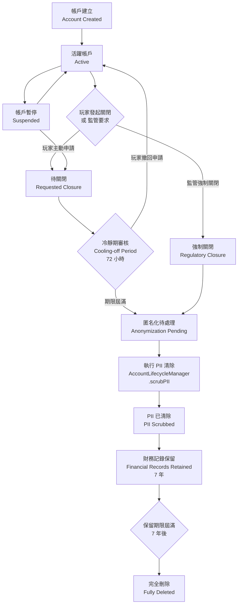

# 帳戶生命週期管理架構（Account Lifecycle Management Architecture）

> **XREF（交叉引用）**: 業務需求詳見 [帳戶關閉需求](../../requirements/01_Player_Experience/07_Account_Closure_Deletion.md)
> **目標讀者**: 系統架構師、後端開發人員、DPO
> **最後更新**: 2026-04-02

---

## 1. 概述

帳戶生命週期管理架構處理玩家從帳戶建立至完全刪除的完整流程，核心挑戰在於平衡以下兩項相互衝突的法規要求：

- **GDPR Art. 17「被遺忘權」（Right to Erasure）**: 玩家有權要求刪除其個人識別資訊（PII, Personally Identifiable Information）
- **UKGC 財務記錄保留**: 賭博業者須保留財務記錄至少 7 年以供稽核

解決方案採用**選擇性匿名化（Selective Anonymization）**策略：在玩家 ID 與財務記錄之間維持不可識別的關聯，同時徹底清除所有 PII 欄位。

---

## 2. 帳戶狀態流程



---

## 3. PII 匿名化策略

### 3.1 欄位處置規則

| 資料分類 | 欄位 | 處置方式 | 保留期限 | 法規依據 |
|---------|------|---------|---------|---------|
| 玩家識別碼 | `player_id`（UUID） | **保留**（不可識別） | 永久 | 財務記錄關聯需要 |
| 姓名 | `first_name`, `last_name` | 清除 → `ANONYMIZED` | 0（立即） | GDPR Art. 17 |
| 電子郵件 | `email` | 清除 → `deleted_{uuid}@anon.invalid` | 0（立即） | GDPR Art. 17 |
| 電話號碼 | `phone_number` | 清除 → `NULL` | 0（立即） | GDPR Art. 17 |
| 出生日期 | `date_of_birth` | 清除 → `NULL` | 0（立即） | GDPR Art. 17 |
| 地址 | `address_*` 欄位 | 清除 → `NULL` | 0（立即） | GDPR Art. 17 |
| 國籍 | `nationality` | 清除 → `NULL` | 0（立即） | GDPR Art. 17 |
| 存款記錄 | `t_wallet_transaction` | **保留**（關聯匿名 player_id） | 7 年 | UKGC LCCP |
| 提款記錄 | `t_withdrawal_record` | **保留**（關聯匿名 player_id） | 7 年 | UKGC LCCP |
| 下注歷史 | `t_game_round` | **保留**（關聯匿名 player_id） | 7 年 | MGA CLP |
| KYC 文件 | `t_kyc_verification` | 清除文件內容 → 保留驗證狀態 | 5 年 | FATF R.11 |
| 登入日誌 | `t_login_log` | 清除 IP → 保留時間戳記 | 2 年 | GDPR Art. 5(1)(e) |

### 3.2 匿名化後資料範例

```sql
-- 匿名化前
SELECT player_id, email, first_name, last_name
FROM t_player WHERE player_id = 12345;
-- 結果: 12345 | john.doe@email.com | John | Doe

-- 匿名化後（GDPR Art. 17 執行完畢）
SELECT player_id, email, first_name, last_name
FROM t_player WHERE player_id = 12345;
-- 結果: 12345 | deleted_a1b2c3@anon.invalid | ANONYMIZED | ANONYMIZED

-- 財務記錄仍可查詢（關聯匿名 player_id，符合 UKGC 要求）
SELECT player_id, amount, transaction_type, created_at
FROM t_wallet_transaction WHERE player_id = 12345;
-- 結果: 12345 | 500.00 | DEPOSIT | 2024-03-15 10:30:00
```

---

## 4. AccountLifecycleManager 實作

```java
/**
 * 帳戶生命週期管理器
 * 負責處理帳戶關閉、PII 匿名化及財務記錄保留
 * 所有狀態轉換操作必須在 Manager 層以 @Transactional 執行
 */
@Component
@RequiredArgsConstructor
public class AccountLifecycleManager {

    private final PlayerDao playerDao;
    private final FinancialRecordDao financialRecordDao;
    private final KycVerificationDao kycVerificationDao;
    private final AccountClosureAuditDao accountClosureAuditDao;
    private final LoginLogDao loginLogDao;

    /**
     * 發起帳戶關閉申請（玩家主動申請）
     * 啟動 72 小時冷靜期，期間玩家可撤回申請
     */
    @Transactional(rollbackFor = Throwable.class)
    public Option<AccountClosureVO> initiateAccountClosure(Long playerId, AccountClosureForm form) {
        Option<PlayerEntity> playerOpt = Option.of(playerDao.selectById(playerId));
        if (playerOpt.isEmpty()) {
            return Option.none();
        }

        PlayerEntity player = playerOpt.get();
        if (player.getAccountStatus() != AccountStatus.ACTIVE) {
            return Option.none();
        }

        // 更新帳戶狀態為待關閉
        playerDao.updateAccountStatus(playerId, AccountStatus.REQUESTED_CLOSURE);

        // 記錄關閉申請（含冷靜期到期時間）
        AccountClosureAuditEntity audit = new AccountClosureAuditEntity();
        audit.setPlayerId(playerId);
        audit.setClosureReason(form.getReason());
        audit.setRequestedAt(LocalDateTime.now());
        audit.setCoolingOffExpiresAt(LocalDateTime.now().plusHours(72));
        audit.setDeleted(false);
        accountClosureAuditDao.insert(audit);

        return Option.of(SmartBeanUtil.copy(audit, AccountClosureVO.class));
    }

    /**
     * 執行 PII 匿名化（GDPR Art. 17 Right to Erasure）
     * 在冷靜期屆滿後由排程任務觸發，或由監管要求立即觸發
     */
    @Transactional(rollbackFor = Throwable.class)
    public Option<AnonymizationResultVO> scrubPII(Long playerId) {
        Option<PlayerEntity> playerOpt = Option.of(playerDao.selectById(playerId));
        if (playerOpt.isEmpty()) {
            return Option.none();
        }

        String anonymizedEmail = "deleted_" + UUID.randomUUID().toString().substring(0, 8) + "@anon.invalid";

        // 清除 PII 欄位（保留 player_id 及財務關聯）
        PlayerPiiScrubForm scrubForm = new PlayerPiiScrubForm();
        scrubForm.setPlayerId(playerId);
        scrubForm.setEmail(anonymizedEmail);
        scrubForm.setFirstName("ANONYMIZED");
        scrubForm.setLastName("ANONYMIZED");
        scrubForm.setPhoneNumber(null);
        scrubForm.setDateOfBirth(null);
        scrubForm.setNationality(null);
        playerDao.scrubPiiFields(scrubForm);

        // 清除 KYC 文件內容（保留驗證狀態記錄，符合 FATF R.11）
        kycVerificationDao.scrubDocumentContent(playerId);

        // 清除登入日誌 IP（保留時間戳記，符合 GDPR Art. 5(1)(e)）
        loginLogDao.anonymizeIpAddresses(playerId);

        // 更新帳戶狀態為已清除
        playerDao.updateAccountStatus(playerId, AccountStatus.PII_SCRUBBED);

        // 設定財務記錄保留到期時間（7 年後）
        financialRecordDao.setRetentionExpiry(playerId, LocalDate.now().plusYears(7));

        // 記錄匿名化執行事件（稽核追蹤）
        accountClosureAuditDao.insertScrubCompletionLog(playerId, LocalDateTime.now());

        AnonymizationResultVO result = new AnonymizationResultVO();
        result.setPlayerId(playerId);
        result.setAnonymizedAt(LocalDateTime.now());
        result.setFinancialRetentionUntil(LocalDate.now().plusYears(7));
        return Option.of(result);
    }

    /**
     * 完全刪除帳戶（財務記錄 7 年保留期屆滿後執行）
     */
    @Transactional(rollbackFor = Throwable.class)
    public Option<Boolean> fullyDeleteAccount(Long playerId) {
        // 確認財務記錄保留期已屆滿
        boolean retentionExpired = financialRecordDao.isRetentionExpired(playerId);
        if (!retentionExpired) {
            return Option.none();
        }

        financialRecordDao.hardDeleteByPlayerId(playerId);
        playerDao.markFullyDeleted(playerId);
        return Option.of(Boolean.TRUE);
    }
}
```

---

## 5. 排程任務整合

```java
/**
 * 帳戶生命週期排程任務
 * 注意：@Scheduled 使用虛擬執行緒（Virtual Threads），由 VirtualThreadsConfig 統一管理
 */
@Component
@RequiredArgsConstructor
public class AccountLifecycleScheduler {

    private final AccountLifecycleManager accountLifecycleManager;
    private final PlayerDao playerDao;

    /**
     * 每小時檢查冷靜期屆滿的關閉申請
     */
    @Scheduled(fixedRate = 3600000)
    public void processCoolingOffExpiredClosures() {
        List<Long> expiredPlayerIds = playerDao.findCoolingOffExpiredClosures(LocalDateTime.now());
        expiredPlayerIds.forEach(playerId ->
            accountLifecycleManager.scrubPII(playerId)
        );
    }

    /**
     * 每日凌晨 2 點檢查財務記錄保留期屆滿的帳戶
     */
    @Scheduled(cron = "0 0 2 * * *")
    public void processRetentionExpiredAccounts() {
        List<Long> expiredPlayerIds = playerDao.findFinancialRetentionExpired();
        expiredPlayerIds.forEach(playerId ->
            accountLifecycleManager.fullyDeleteAccount(playerId)
        );
    }
}
```

---

## 6. 合規要求對應

| 法規 | 條款 | 要求 | 系統實作 |
|------|------|------|---------|
| GDPR | Art. 17 | 被遺忘權：玩家可要求刪除個人資料 | `scrubPII()` 執行 PII 清除 |
| GDPR | Art. 17(3)(b) | 例外：法律義務所需之資料可保留 | 財務記錄依 UKGC 要求保留 7 年 |
| GDPR | Art. 5(1)(e) | 儲存限制：資料不得超過必要期限保留 | 排程任務定期執行完全刪除 |
| GDPR | Art. 30 | 處理活動記錄 | `accountClosureAuditDao` 完整稽核日誌 |
| UKGC LCCP | Condition 12 | 財務記錄保留 5 年（最佳實踐 7 年） | `financialRecordDao.setRetentionExpiry()` |
| MGA CLP | Art. 15 | 玩家資料管理義務 | 冷靜期 + 分階段匿名化流程 |
| FATF | R.11 | CDD 文件保留至少 5 年 | KYC 驗證狀態保留，文件內容清除 |

### 6.1 GDPR vs. UKGC 衝突解決方案

```
衝突核心：GDPR Art. 17 要求「立即刪除」vs. UKGC 要求「保留 7 年」

解決原則：
┌─────────────────────────────────────────────────────────┐
│  GDPR Art. 17(3)(b) 允許例外：                           │
│  「為履行法律義務所必要之處理」可不適用被遺忘權             │
│                                                         │
│  實作策略：                                              │
│  1. 立即清除所有 PII（滿足 GDPR Art. 17 主要義務）        │
│  2. 以匿名化 player_id 保留財務記錄（滿足 UKGC）          │
│  3. 匿名化後的財務記錄不再能識別特定個人                   │
│     → 不屬於「個人資料」→ GDPR 不再適用                   │
└─────────────────────────────────────────────────────────┘
```

---

## 7. 相關文件 XREF

- **業務需求**: [帳戶關閉需求](../../requirements/01_Player_Experience/07_Account_Closure_Deletion.md)
- **KYC 狀態機**: [KYC 進度狀態機](02_KYC_Progression_State_Machine.md)
- **玩家生命週期**: [玩家生命週期實作](01_Player_Lifecycle_Implementation.md)
- **資料安全架構**: [安全架構](../12_Security/)
- **GDPR 合規框架**: [Risk Engine 架構](../05_Risk_Engine/)
