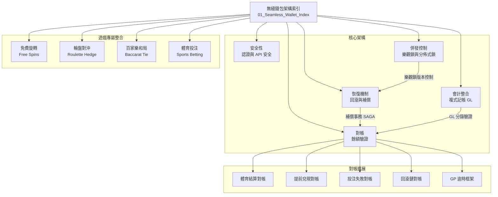

# 無縫錢包架構

> **目標讀者**: 架構師、後端開發者
> **業務需求**: [無縫錢包需求](../../requirements/02_Financial_Operations/01_Seamless_Wallet_Requirements.md)
> **狀態**: 索引已建立 - 連結至 source-archive/

---

## Finance Service 文檔導覽



---

## 技術架構文檔

| 文檔 | 說明 | 來源 |
|----------|-------------|--------|
| [安全性](../../source-archive/02_Finance_Center/seamless-wallet/02-SW-01_Security.md) | 認證、授權與 API 安全 | [source](../../source-archive/02_Finance_Center/seamless-wallet/02-SW-01_Security.md) |
| [併發控制](../../source-archive/02_Finance_Center/seamless-wallet/02-SW-02_Concurrency.md) | 樂觀鎖、競爭條件處理與分佈式鎖 | [source](../../source-archive/02_Finance_Center/seamless-wallet/02-SW-02_Concurrency.md) |
| [恢復機制](../../source-archive/02_Finance_Center/seamless-wallet/02-SW-03_Recovery.md) | 交易回滾、補償與失敗恢復 | [source](../../source-archive/02_Finance_Center/seamless-wallet/02-SW-03_Recovery.md) |
| [會計整合](../../source-archive/02_Finance_Center/seamless-wallet/02-SW-04_Accounting.md) | 複式記帳與 GL 整合 | [source](../../source-archive/02_Finance_Center/seamless-wallet/02-SW-04_Accounting.md) |
| [對帳](../../source-archive/02_Finance_Center/seamless-wallet/02-SW-05_Reconciliation.md) | 餘額驗證與差異解決 | [source](../../source-archive/02_Finance_Center/seamless-wallet/02-SW-05_Reconciliation.md) |

## 遊戲專屬整合

| 文檔 | 說明 | 來源 |
|----------|-------------|--------|
| [免費旋轉](../../source-archive/02_Finance_Center/seamless-wallet/02-SW-06_Free_Spins.md) | 免費旋轉錢包整合模式 | [source](../../source-archive/02_Finance_Center/seamless-wallet/02-SW-06_Free_Spins.md) |
| [輪盤對沖](../../source-archive/02_Finance_Center/seamless-wallet/02-SW-07_Roulette_Hedge.md) | 輪盤對沖投注偵測 | [source](../../source-archive/02_Finance_Center/seamless-wallet/02-SW-07_Roulette_Hedge.md) |
| [百家樂和局](../../source-archive/02_Finance_Center/seamless-wallet/02-SW-08_Baccarat_Tie.md) | 百家樂和局投注處理 | [source](../../source-archive/02_Finance_Center/seamless-wallet/02-SW-08_Baccarat_Tie.md) |
| [體育投注](../../source-archive/02_Finance_Center/seamless-wallet/02-SW-09_Sports_Betting.md) | 體育投注錢包整合 | [source](../../source-archive/02_Finance_Center/seamless-wallet/02-SW-09_Sports_Betting.md) |

## 對帳擴展

| 文檔 | 說明 | 來源 |
|----------|-------------|--------|
| [體育結算](../../source-archive/02_Finance_Center/seamless-wallet/02-SW-10_Sports_Settlement_Reconciliation.md) | 體育投注結算對帳 | [source](../../source-archive/02_Finance_Center/seamless-wallet/02-SW-10_Sports_Settlement_Reconciliation.md) |
| [提前兌現對帳](../../source-archive/02_Finance_Center/seamless-wallet/02-SW-11_Cashout_Reconciliation.md) | 提前兌現交易對帳 | [source](../../source-archive/02_Finance_Center/seamless-wallet/02-SW-11_Cashout_Reconciliation.md) |
| [投注失敗對帳](../../source-archive/02_Finance_Center/seamless-wallet/02-SW-12_Bet_Failure_Reconciliation.md) | 失敗投注處理與恢復 | [source](../../source-archive/02_Finance_Center/seamless-wallet/02-SW-12_Bet_Failure_Reconciliation.md) |
| [回滾鏈](../../source-archive/02_Finance_Center/seamless-wallet/02-SW-13_Rollback_Chain_Reconciliation.md) | 多步驟回滾鏈對帳 | [source](../../source-archive/02_Finance_Center/seamless-wallet/02-SW-13_Rollback_Chain_Reconciliation.md) |
| [GP 逾時框架](../../source-archive/02_Finance_Center/seamless-wallet/02-SW-14_GP_Timeout_Framework.md) | 遊戲供應商逾時處理框架 | [source](../../source-archive/02_Finance_Center/seamless-wallet/02-SW-14_GP_Timeout_Framework.md) |

---

## Java Implementation (SmartAdmin)

### WalletService (Single-table CRUD)

```java
@Service
@RequiredArgsConstructor
public class WalletService {

    private final WalletDao walletDao;
    private final WalletManager walletManager;

    /**
     * Query wallet balance with Vavr Option for null-safety.
     */
    public Option<WalletVO> getWalletBalance(Long playerId) {
        return Option.of(walletDao.selectByPlayerId(playerId))
            .map(entity -> SmartBeanUtil.copy(entity, WalletVO.class));
    }

    /**
     * Debit transaction (requires @Transactional - delegate to Manager).
     */
    public ResponseDTO<TransactionVO> debit(WalletDebitForm form) {
        return walletManager.processDebit(form);
    }

    /**
     * Credit transaction (requires @Transactional - delegate to Manager).
     */
    public ResponseDTO<TransactionVO> credit(WalletCreditForm form) {
        return walletManager.processCredit(form);
    }
}

@Component
@RequiredArgsConstructor
public class WalletManager {

    private final WalletDao walletDao;
    private final TransactionDao transactionDao;
    private final DistributedLockManager lockManager;

    /**
     * Process debit transaction with optimistic locking.
     * @Transactional only allowed in Manager layer per SmartAdmin architecture.
     */
    @Transactional(rollbackFor = Throwable.class)
    public ResponseDTO<TransactionVO> processDebit(WalletDebitForm form) {
        // 1. Acquire distributed lock for player wallet
        String lockKey = "wallet:lock:" + form.getPlayerId();
        return lockManager.executeWithLock(lockKey, () -> {
            // 2. Load wallet with version for optimistic locking
            WalletEntity wallet = walletDao.selectByPlayerId(form.getPlayerId());
            if (wallet.getBalance().compareTo(form.getAmount()) < 0) {
                return ResponseDTO.error(ErrorCode.INSUFFICIENT_BALANCE);
            }

            // 3. Update balance with version check
            wallet.setBalance(wallet.getBalance().subtract(form.getAmount()));
            int updated = walletDao.updateByIdWithVersion(wallet);
            if (updated == 0) {
                throw new BusinessException("Concurrent modification detected");
            }

            // 4. Create transaction record
            TransactionEntity txn = TransactionEntity.builder()
                .playerId(form.getPlayerId())
                .amount(form.getAmount().negate())
                .type(TransactionType.DEBIT)
                .gameRoundId(form.getGameRoundId())
                .status(TransactionStatus.CONFIRMED)
                .build();
            transactionDao.insert(txn);

            return ResponseDTO.ok(SmartBeanUtil.copy(txn, TransactionVO.class));
        });
    }

    /**
     * Process credit transaction (win payout).
     */
    @Transactional(rollbackFor = Throwable.class)
    public ResponseDTO<TransactionVO> processCredit(WalletCreditForm form) {
        // Similar implementation with credit logic
        String lockKey = "wallet:lock:" + form.getPlayerId();
        return lockManager.executeWithLock(lockKey, () -> {
            WalletEntity wallet = walletDao.selectByPlayerId(form.getPlayerId());
            wallet.setBalance(wallet.getBalance().add(form.getAmount()));
            walletDao.updateByIdWithVersion(wallet);

            TransactionEntity txn = TransactionEntity.builder()
                .playerId(form.getPlayerId())
                .amount(form.getAmount())
                .type(TransactionType.CREDIT)
                .gameRoundId(form.getGameRoundId())
                .status(TransactionStatus.CONFIRMED)
                .build();
            transactionDao.insert(txn);

            return ResponseDTO.ok(SmartBeanUtil.copy(txn, TransactionVO.class));
        });
    }
}
```

---

## SQL Schema

```sql
-- Wallet table with optimistic locking
CREATE TABLE t_wallet (
    id BIGINT PRIMARY KEY,
    player_id BIGINT NOT NULL UNIQUE,
    balance DECIMAL(18, 4) NOT NULL DEFAULT 0.0000,
    currency_code VARCHAR(3) NOT NULL DEFAULT 'USD',
    version INT NOT NULL DEFAULT 0,  -- Optimistic lock version
    tenant_id BIGINT NOT NULL,
    created_at TIMESTAMP NOT NULL DEFAULT CURRENT_TIMESTAMP,
    updated_at TIMESTAMP NOT NULL DEFAULT CURRENT_TIMESTAMP,
    deleted BOOLEAN NOT NULL DEFAULT FALSE
);

CREATE INDEX idx_wallet_player ON t_wallet(player_id, deleted);
CREATE INDEX idx_wallet_tenant ON t_wallet(tenant_id, deleted);

COMMENT ON TABLE t_wallet IS '無縫錢包 - 玩家餘額主表';
COMMENT ON COLUMN t_wallet.player_id IS '玩家 ID';
COMMENT ON COLUMN t_wallet.balance IS '當前餘額（4 位小數精度）';
COMMENT ON COLUMN t_wallet.version IS '樂觀鎖版本號';

-- Transaction log for debit/credit operations
CREATE TABLE t_wallet_transaction (
    id BIGINT PRIMARY KEY,
    player_id BIGINT NOT NULL,
    amount DECIMAL(18, 4) NOT NULL,  -- Negative for debit, positive for credit
    type VARCHAR(20) NOT NULL,  -- DEBIT, CREDIT, REFUND
    status VARCHAR(20) NOT NULL,  -- PENDING, CONFIRMED, FAILED, ROLLED_BACK
    game_round_id VARCHAR(100),
    game_provider_id VARCHAR(50),
    idempotency_key VARCHAR(100) UNIQUE,  -- Prevent duplicate processing
    tenant_id BIGINT NOT NULL,
    created_at TIMESTAMP NOT NULL DEFAULT CURRENT_TIMESTAMP,
    updated_at TIMESTAMP NOT NULL DEFAULT CURRENT_TIMESTAMP,
    deleted BOOLEAN NOT NULL DEFAULT FALSE
);

CREATE INDEX idx_txn_player ON t_wallet_transaction(player_id, created_at);
CREATE INDEX idx_txn_game_round ON t_wallet_transaction(game_round_id);
CREATE INDEX idx_txn_idempotency ON t_wallet_transaction(idempotency_key);
CREATE INDEX idx_txn_tenant ON t_wallet_transaction(tenant_id, created_at);

COMMENT ON TABLE t_wallet_transaction IS '無縫錢包交易日誌';
COMMENT ON COLUMN t_wallet_transaction.amount IS '交易金額（負數=扣款，正數=存款）';
COMMENT ON COLUMN t_wallet_transaction.idempotency_key IS '冪等鍵（防重複處理）';
```

---

**最後更新**: 2026-02-08
