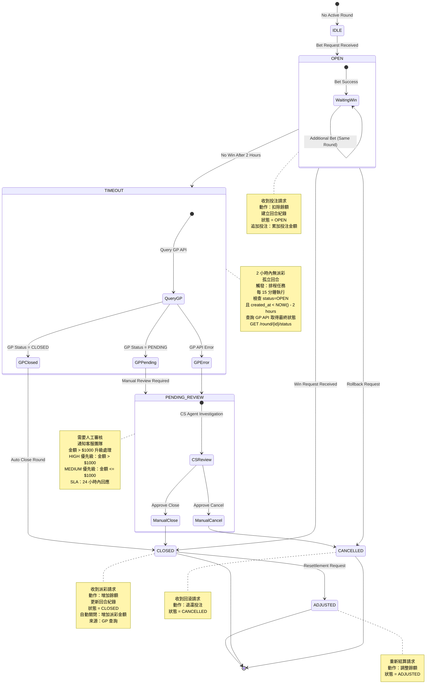
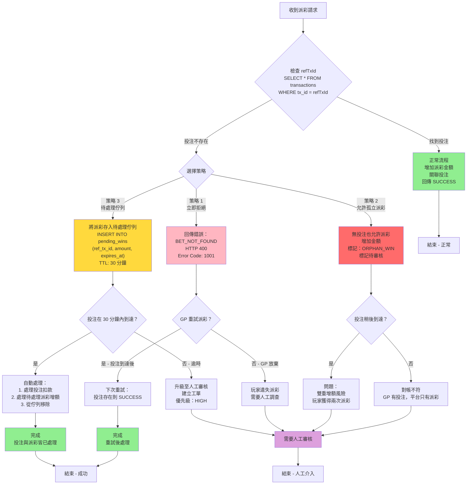
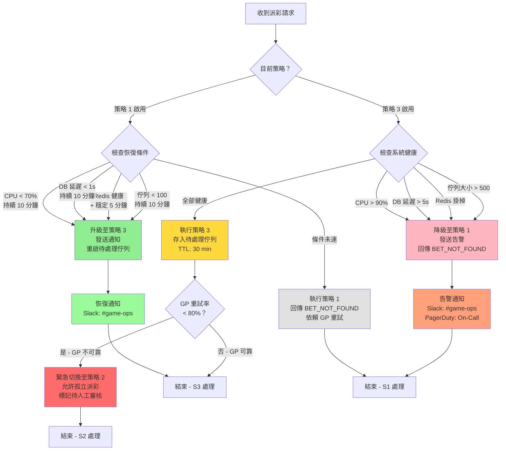
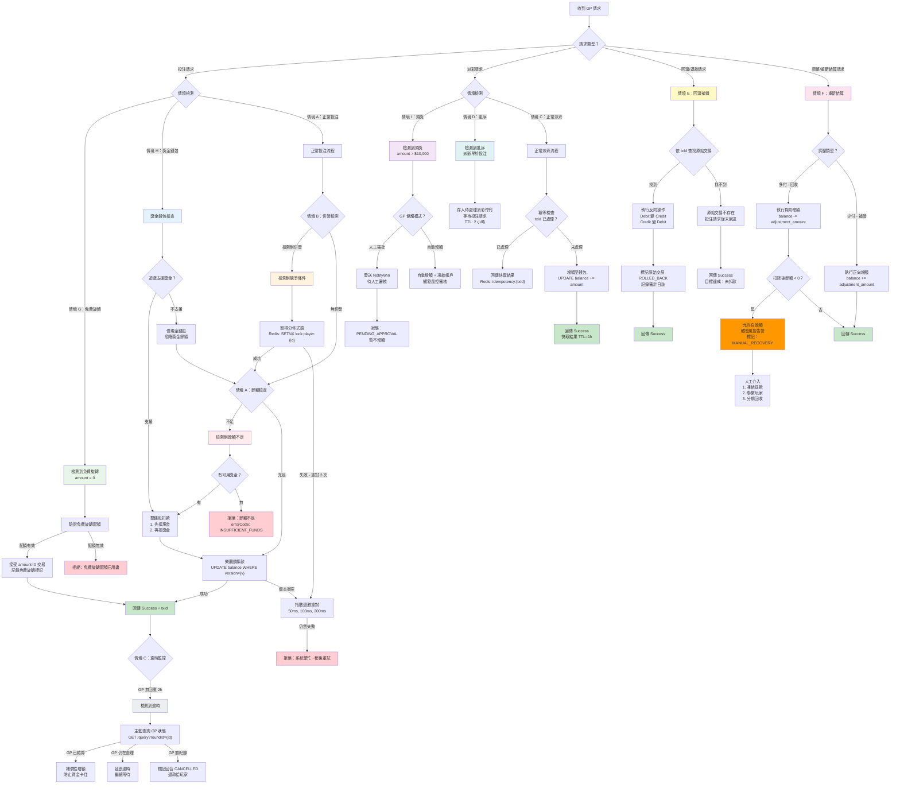
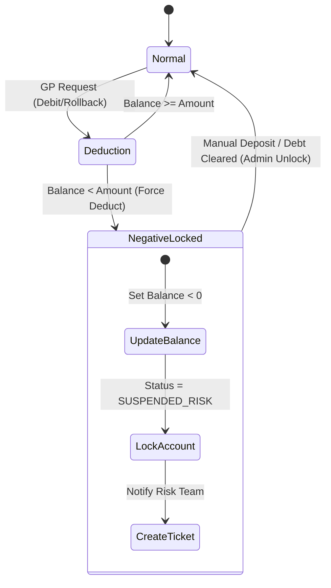

# 無縫錢包技術架構

> **規範來源**: [03-03_Seamless_Wallet_Analysis.md](../../source-archive/03_Game_Center/03-03_Seamless_Wallet_Analysis.md)
> **目標讀者**: 架構師、後端開發者、DevOps
> **業務需求**: [無縫錢包需求](../../requirements/02_Financial_Operations/01_Seamless_Wallet_Requirements.md)
> **同步時間**: 2026-02-08

---

## 1. 概述

本文檔涵蓋無縫錢包 (Seamless Wallet) 整合系統的技術架構和實作細節。包括 API 規格、併發控制機制、狀態機、資料庫結構、監控配置以及 SmartAdmin 架構對應。

---

## 2. 基於回合的狀態機

### 2.1 狀態圖



---

## 3. 冪等性實作

> **交叉引用 — 冪等策略三文件導航**:
> - [Seamless_Wallet_Technical.md](03_Seamless_Wallet_Technical.md#4-冪等三層防禦) — 三層架構圖（Redis → DB UNIQUE → Fallback Query）+ Java IdempotencyGuard 實作
> - [Financial_Implementation.md](04_Financial_Implementation.md#23-並發安全的餘額扣減redis-lua) — WalletManager 中 Redis 快取層的實際扣款應用
> - **本文件** (Seamless_Wallet_Analysis.md) — 逾時重試時序圖 + 組件設計分析

### 3.1 逾時與重試時序圖

```mermaid
sequenceDiagram
    participant GP as 遊戲供應商
    participant GW as API Gateway
    participant Platform as Wallet Service
    participant Redis as Redis Cache
    participant DB as Database

    Note over GP,DB: 情境 C：逾時與冪等重試

    rect rgb(255, 230, 230)
        Note over GP,DB: 第一次嘗試 - 發生逾時

        GP->>GW: POST /debit<br/>{txId: "TX001", amount: 100}
        GW->>Platform: validateRequest(txId, amount)

        Platform->>Redis: GET idempotency:TX001
        Redis-->>Platform: null (不存在)

        Platform->>DB: BEGIN TRANSACTION

        Platform->>DB: SELECT balance FROM wallet<br/>WHERE player_id = ? FOR UPDATE
        DB-->>Platform: balance = 500

        Platform->>DB: UPDATE wallet<br/>SET balance = 400<br/>WHERE player_id = ?
        DB-->>Platform: OK (1 row affected)

        Platform->>DB: INSERT INTO transactions<br/>(tx_id, type, amount, balance_after)<br/>VALUES ('TX001', 'DEBIT', 100, 400)
        DB-->>Platform: OK

        Platform->>DB: COMMIT

        Platform->>Redis: SETEX idempotency:TX001<br/>value: {status: SUCCESS, balance: 400}<br/>TTL: 3600
        Redis-->>Platform: OK

        Platform->>GW: Response: {status: SUCCESS, balance: 400}

        Note over GW,GP: 網路錯誤 - 回應遺失！
        GW-xGP: TCP Connection Reset / Timeout

        Note over GP: GP 收到 TIMEOUT<br/>狀態未知<br/>決定 RETRY
    end

    rect rgb(230, 255, 230)
        Note over GP,DB: 第二次嘗試 - 冪等重試（相同 txId）

        GP->>GW: POST /debit<br/>{txId: "TX001", amount: 100}<br/>相同 txId

        GW->>Platform: validateRequest(txId, amount)

        Platform->>Redis: GET idempotency:TX001
        Redis-->>Platform: {status: SUCCESS, balance: 400}<br/>存在！

        Note over Platform: 冪等檢查通過<br/>回傳快取回應<br/>無資料庫操作！

        Platform-->>GW: Response: {status: SUCCESS, balance: 400}<br/>來源：CACHED

        GW-->>GP: Response: {status: SUCCESS, balance: 400}

        Note over GP: 重試成功<br/>收到回應<br/>玩家餘額：400
    end

    rect rgb(230, 230, 255)
        Note over GP,DB: 第三次嘗試 - 不同 txId（新交易）

        GP->>GW: POST /debit<br/>{txId: "TX002", amount: 50}<br/>新 txId

        GW->>Platform: validateRequest(txId, amount)

        Platform->>Redis: GET idempotency:TX002
        Redis-->>Platform: null (不存在)

        Platform->>DB: BEGIN TRANSACTION

        Platform->>DB: SELECT balance FROM wallet<br/>WHERE player_id = ? FOR UPDATE
        DB-->>Platform: balance = 400

        Platform->>DB: UPDATE wallet<br/>SET balance = 350<br/>WHERE player_id = ?
        DB-->>Platform: OK

        Platform->>DB: INSERT INTO transactions<br/>(tx_id, type, amount, balance_after)<br/>VALUES ('TX002', 'DEBIT', 50, 350)
        DB-->>Platform: OK

        Platform->>DB: COMMIT

        Platform->>Redis: SETEX idempotency:TX002<br/>value: {status: SUCCESS, balance: 350}<br/>TTL: 3600
        Redis-->>Platform: OK

        Platform->>GW: Response: {status: SUCCESS, balance: 350}
        GW-->>GP: Response: {status: SUCCESS, balance: 350}

        Note over GP: 新交易成功<br/>玩家餘額：350
    end

    style Platform fill:#E6E6FA
    style Redis fill:#FFE4B5
    style DB fill:#ADD8E6
```

### 3.2 冪等性組件設計

| 組件 | 策略 | 關鍵參數 |
|-----------|----------|---------------|
| **唯一性保證** | txId 作為 Redis Key + DB 唯一約束 | `UNIQUE INDEX (tx_id)` |
| **快取 TTL** | Redis SETEX 避免永久佔用記憶體 | 3600 秒（1 小時） |
| **回應一致性** | 快取完整回應（餘額、狀態） | JSON 格式儲存 |
| **併發保護** | Redis SETNX 或 Lua Script | 原子操作 |
| **清理策略** | TTL 自動過期 + 定期批次清理 | 每日清理超過 24 小時的紀錄 |

### 3.3 錯誤處理

1. **Redis 不可用**：降級為僅檢查 DB 唯一約束（效能降低但正確性保持）
2. **DB 唯一約束衝突**：捕獲例外，查詢原始紀錄，回傳原始結果
3. **txId 格式錯誤**：400 Bad Request，拒絕請求

---

## 4. 亂序處理決策樹

### 4.1 策略決策流程圖



### 4.2 策略切換決策樹



---

## 5. 完整極端情境決策矩陣

### 5.1 統一例外處理流程圖



---

## 6. 負餘額狀態機



---

## 7. 整合交易流程

```mermaid
flowchart TD

    Req["GP 請求 (Debit/Credit)"] --> CheckID{"有 TransactionId？"}

    CheckID -->|否| Err400["Error 400: Missing ID"]

    CheckID -->|是| CheckCache{"冪等檢查<br/>(Redis Key 存在？)"}

    CheckCache -->|是| ReturnCache["回傳快取回應"]

    CheckCache -->|否| LoadConfig["載入遊戲配置<br/>(取得錢包優先順序)"]

    LoadConfig --> TypeCheck{"請求類型？"}

    TypeCheck -->|扣款 (投注)| CalcDeduction["計算扣款順序<br/>(例如 獎金優先於現金)"]

    CalcDeduction --> CheckBal{"餘額充足？"}

    CheckBal -->|否| ErrFund["Error: Insufficient Funds"]

    CheckBal -->|是| ExecDebit["對錢包執行扣款"]

    TypeCheck -->|增額 (派彩/回滾)| ExecCredit["執行增額/調整"]

    ExecCredit --> CheckNeg{"結果餘額 < 0？"}

    CheckNeg -->|是| LockAcc["更新餘額並<br/>SET STATUS = LOCKED"]

    LockAcc --> AlertRisk["觸發風控告警"]

    CheckNeg -->|否| NormalUpdate["更新餘額"]

    ExecDebit --> SaveTx["儲存交易日誌"]

    ErrFund --> SaveTx

    LockAcc --> SaveTx

    NormalUpdate --> SaveTx

    SaveTx --> CacheRes["快取回應至 Redis"]

    CacheRes --> Resp["回傳 API 回應"]
```

---

## 8. 錢包扣款順序配置

### 8.1 遊戲配置結構

```json
{
  "game_code": "slot_001",
  "wallet_priority": ["BONUS_WALLET", "CASH_WALLET"],
  "use_system_default": false
}
```

### 8.2 執行流程

1. 收到投注請求
2. 檢查 `game_config.wallet_priority` 是否存在
3. 若存在且 `use_system_default = false`：使用遊戲配置
4. 若不存在：使用系統預設（獎金 -> 現金 -> 信用額度）
5. 依優先順序扣除餘額
6. 若首選錢包餘額不足，允許混合扣款（記錄分割明細）

---

## 9. 監控與告警配置

### 9.1 Prometheus AlertManager 規則

```yaml
# Prometheus AlertManager Rules
groups:
  - name: seamless_wallet_alerts
    rules:
      # 情境 A：異常餘額不足率
      - alert: HighInsufficientFundsRate
        expr: (rate(bet_rejected_insufficient_funds_total[5m]) / rate(bet_requests_total[5m])) > 0.3
        for: 5m
        labels:
          severity: warning
        annotations:
          summary: "餘額不足拒絕率 > 30%，可能玩家資金耗盡或存款異常"

      # 情境 B：高鎖競爭
      - alert: HighLockContentionRate
        expr: rate(redis_lock_timeout_total[5m]) > 10
        for: 2m
        labels:
          severity: critical
        annotations:
          summary: "Redis 鎖逾時頻率過高，系統併發壓力過大"

      # 情境 C：異常 GP 逾時率
      - alert: HighGPTimeoutRate
        expr: (rate(gp_timeout_total[1h]) / rate(bet_requests_total[1h])) > 0.01
        for: 10m
        labels:
          severity: warning
        annotations:
          summary: "GP 逾時率 > 1%，檢查 GP 服務健康狀態"

      # 情境 D：亂序積壓
      - alert: PendingWinQueueBacklog
        expr: pending_win_queue_size > 100
        for: 5m
        labels:
          severity: warning
        annotations:
          summary: "待處理派彩佇列積壓 > 100，可能投注請求延遲或遺失"

      # 情境 F：負餘額累積
      - alert: NegativeBalanceAccumulation
        expr: sum(player_negative_balance) < -10000
        for: 1m
        labels:
          severity: critical
        annotations:
          summary: "負餘額累積超過 $10,000，觸發財務風控審核"

      # 情境 I：異常頭獎頻率
      - alert: UnusualJackpotFrequency
        expr: rate(jackpot_win_total[1h]) > 5
        for: 5m
        labels:
          severity: critical
        annotations:
          summary: "頭獎觸發 > 1 小時 5 次，懷疑遊戲邏輯異常或詐騙"
```

### 9.2 策略切換告警

```yaml
# Prometheus AlertManager Rules
alerts:
  - name: out_of_order_strategy_degraded
    expr: out_of_order_strategy != 3
    for: 5m
    labels:
      severity: warning
    annotations:
      summary: "亂序處理策略降級至策略 {{ $value }}"
      description: "目前策略：{{ if eq $value 1 }}立即拒絕{{ else if eq $value 2 }}孤立派彩（緊急）{{ end }}"

  - name: out_of_order_emergency_mode
    expr: out_of_order_strategy == 2
    for: 1m
    labels:
      severity: critical
    annotations:
      summary: "亂序處理進入緊急模式（策略 2 - 孤立派彩）"
      description: "GP 重試率過低，允許孤立派彩，需立即人工介入"
```

---

## 10. SmartAdmin 架構對應

### 10.1 五層模組設計

| 層級 | 類別模式 | 職責 | 註解限制 |
|-------|--------------|---------------|----------------------|
| **Controller** | `SeamlessWalletController` | 接收 GP HTTP 請求，參數驗證，回傳 ResponseDTO | 禁用 @Transactional |
| **Service** | `SeamlessWalletService` | 業務協調，冪等檢查，呼叫 Manager | 禁用 @Transactional |
| **Manager** | `SeamlessWalletTransactionManager` | 交易管理，分佈式鎖，錢包扣款/增額 | **僅此層允許** @Transactional |
| **Dao** | `GameTransactionRecordDao` | 資料庫 CRUD，MyBatis Mapper | 無業務邏輯 |
| **Entity** | `GameTransactionRecordEntity` | 資料模型，對應表結構 | 無業務邏輯 |

### 10.2 依賴規則（由 ArchitectureTest 強制）

```text
Controller -> Service (允許)
Service -> Dao      (允許 - 用於冪等紀錄查詢)
Service -> Manager  (允許 - 需要 @Transactional 時)
Manager -> Dao      (允許)

Controller -> Dao   (禁止 - 違反分層)
Controller -> Manager (禁止 - 違反分層)
```

### 10.3 Entity 層

**GameTransactionRecordEntity.java** - 對應遊戲交易紀錄表，追蹤所有 Debit/Credit/Rollback/Adjust 操作，包含 txId、roundId、type、amount、balance_after 和 status 欄位。

**RoundStateEntity.java** - 對應回合狀態表，用於基於回合的 GP 整合，追蹤 roundId、status (OPEN/CLOSED/CANCELLED/ADJUSTED/TIMEOUT/PENDING_REVIEW)、總投注金額、總派彩金額和時間戳記。

### 10.3.1 資料庫結構

```sql
-- 無縫錢包操作的遊戲交易紀錄表
CREATE TABLE t_game_transaction_record (
    id              BIGSERIAL PRIMARY KEY,
    tenant_id       BIGINT NOT NULL,
    player_id       BIGINT NOT NULL,
    tx_id           VARCHAR(100) NOT NULL,
    round_id        VARCHAR(100),
    tx_type         VARCHAR(20) NOT NULL,
    amount          DECIMAL(18, 4) NOT NULL,
    balance_after   DECIMAL(18, 4) NOT NULL,
    status          SMALLINT NOT NULL DEFAULT 1,
    game_code       VARCHAR(50),
    provider_code   VARCHAR(50),
    created_at      TIMESTAMP NOT NULL DEFAULT NOW(),
    updated_at      TIMESTAMP NOT NULL DEFAULT NOW(),
    deleted         BOOLEAN NOT NULL DEFAULT FALSE,
    CONSTRAINT uk_game_tx_id UNIQUE (tenant_id, tx_id)
);

CREATE INDEX idx_game_tx_player ON t_game_transaction_record(tenant_id, player_id, created_at DESC);
CREATE INDEX idx_game_tx_round ON t_game_transaction_record(tenant_id, round_id) WHERE round_id IS NOT NULL;
CREATE INDEX idx_game_tx_status ON t_game_transaction_record(tenant_id, status, created_at) WHERE status != 1;

-- 基於回合的遊戲供應商整合回合狀態表
CREATE TABLE t_round_state (
    id              BIGSERIAL PRIMARY KEY,
    tenant_id       BIGINT NOT NULL,
    player_id       BIGINT NOT NULL,
    round_id        VARCHAR(100) NOT NULL,
    status          VARCHAR(20) NOT NULL DEFAULT 'OPEN',
    total_bet       DECIMAL(18, 4) NOT NULL DEFAULT 0,
    total_win       DECIMAL(18, 4) NOT NULL DEFAULT 0,
    game_code       VARCHAR(50),
    provider_code   VARCHAR(50),
    opened_at       TIMESTAMP NOT NULL DEFAULT NOW(),
    closed_at       TIMESTAMP,
    timeout_at      TIMESTAMP,
    created_at      TIMESTAMP NOT NULL DEFAULT NOW(),
    updated_at      TIMESTAMP NOT NULL DEFAULT NOW(),
    deleted         BOOLEAN NOT NULL DEFAULT FALSE,
    CONSTRAINT uk_round_id UNIQUE (tenant_id, round_id)
);

CREATE INDEX idx_round_player ON t_round_state(tenant_id, player_id, opened_at DESC);
CREATE INDEX idx_round_status ON t_round_state(tenant_id, status, opened_at) WHERE status = 'OPEN';
CREATE INDEX idx_round_timeout ON t_round_state(tenant_id, timeout_at) WHERE status = 'OPEN' AND timeout_at IS NOT NULL;
```

### 10.4 DAO 層

**GameTransactionRecordDao.java** - 遊戲交易 CRUD 操作的 MyBatis Mapper，包含依 txId 查詢的冪等檢查和對帳批次查詢。

**RoundStateDao.java** - 回合狀態管理的 MyBatis Mapper，包含查詢孤立回合（status=OPEN 且 created_at 超過閾值）。

### 10.5 Manager 層

**SeamlessWalletTransactionManager.java** - 處理所有交易操作：
- `processBet()`：分佈式鎖取得、餘額檢查、在 @Transactional 內執行扣款
- `processWin()`：增額執行、在 @Transactional 內關閉回合
- `processRollback()`：在 @Transactional 內執行反向操作
- `processAdjustment()`：支援負餘額的重新結算處理，在 @Transactional 內

```java
@Component
@RequiredArgsConstructor
public class SeamlessWalletTransactionManager {

    private final PlayerWalletDao walletDao;
    private final GameTransactionRecordDao transactionDao;
    private final RoundStateDao roundStateDao;
    private final RedissonClient redissonClient;

    private static final String LOCK_KEY_PREFIX = "seamless:player:";

    /**
     * 使用分佈式鎖和交易管理處理投注。
     * 依 SmartAdmin 架構，@Transactional 僅允許在 Manager 層使用。
     */
    @Transactional(rollbackFor = Throwable.class)
    public TransactionResult processBet(BetRequestForm form) {
        String lockKey = LOCK_KEY_PREFIX + form.getPlayerId();
        RLock lock = redissonClient.getLock(lockKey);

        try {
            // 取得帶逾時的分佈式鎖
            if (!lock.tryLock(5, 10, TimeUnit.SECONDS)) {
                throw new BusinessException(ErrorCode.SYSTEM_BUSY);
            }

            // 使用 SELECT FOR UPDATE 檢查餘額
            PlayerWalletEntity wallet = walletDao.selectForUpdate(form.getPlayerId());
            if (wallet.getBalance().compareTo(form.getAmount()) < 0) {
                throw new BusinessException(ErrorCode.INSUFFICIENT_FUNDS);
            }

            // 扣除餘額
            BigDecimal newBalance = wallet.getBalance().subtract(form.getAmount());
            walletDao.updateBalance(form.getPlayerId(), newBalance, wallet.getVersion());

            // 記錄交易
            GameTransactionRecordEntity record = new GameTransactionRecordEntity();
            record.setTxId(form.getTxId());
            record.setPlayerId(form.getPlayerId());
            record.setType(TransactionType.DEBIT);
            record.setAmount(form.getAmount());
            record.setBalanceAfter(newBalance);
            transactionDao.insert(record);

            return TransactionResult.success(newBalance);
        } catch (InterruptedException e) {
            Thread.currentThread().interrupt();
            throw new BusinessException(ErrorCode.LOCK_ACQUISITION_FAILED);
        } finally {
            if (lock.isHeldByCurrentThread()) {
                lock.unlock();
            }
        }
    }
}
```

### 10.6 Service 層

**SeamlessWalletService.java** - 協調業務邏輯：
- 透過 Redis 快取查詢進行冪等檢查
- 委派 Manager 處理交易操作
- 處理亂序待處理佇列邏輯
- 與 Risk Engine 協調異常偵測

### 10.7 Controller 層

**SeamlessWalletController.java** - HTTP 介面：
- 接收 GP 請求（Debit、Credit、Rollback、Adjust、GetBalance）
- 參數驗證
- 以標準化錯誤碼回傳 ResponseDTO

### 10.8 基礎模組依賴

| 基礎模組 | 用途 | 參考位置 |
|------------------|---------|-------------------|
| **foundation.redis-lock** | 分佈式鎖防止併發扣款（情境 B） | SeamlessWalletTransactionManager.processBet/processWin/processRollback() |
| **foundation.cache** | Caffeine + Redis 快取用於冪等 | SeamlessWalletService.checkIdempotency() |
| **foundation.audit-log** | 審計日誌記錄 | 所有交易後自動記錄 |
| **foundation.retry** | 失敗重試策略 | GP API 呼叫失敗重試 |

### 10.9 冪等 TTL 標準化

從 v2.0.0 起，統一冪等 TTL 為 **3600 秒（1 小時）**，與有效投注額計算模組一致，便於營運和監控對齊。

---

## 11. 架構影響分析

1. **遊戲配置服務**：結構需擴展以支援 `wallet_priority` 配置
2. **錢包服務**：
   - `debit()` 方法須支援接受 `priority_list` 參數
   - 須處理「分割交易」（例如 20 來自獎金，80 來自現金）
3. **風控引擎**：須監聽 `BALANCE_CHANGE` 事件，當 `NewBalance < 0` 時觸發帳戶鎖定

---

## 12. 關鍵實作注意事項

1. **情境優先順序**：決策樹依 P0 -> P1 -> P2 順序處理，確保高優先情境優先處理
2. **冪等保護**：所有 Credit/Debit 操作須通過 `idempotency:{txId}` 檢查
3. **分佈式鎖**：併發情境使用 Redis SETNX + TTL=5s 防止永久佔鎖
4. **降級策略**：當 Redis/GP 不可用時，優先資金安全（拒絕而非錯誤扣款）
5. **審計日誌**：所有例外情境（負餘額、頭獎、回滾）須記錄完整審計日誌
6. **人工介入**：明確預定義人工介入閾值，防止自動決策失控

---

## 13. 相關文檔

### 上游架構
- **統一錢包模型** - 整體錢包架構，可下注餘額公式
- **交易處理流程** - 事件驅動架構，Outbox Pattern

### 深度技術分析
詳細的無縫錢包主題分析（13 個主題），提供細粒度實作指引：

- **無縫錢包主題索引** - 完整導航和學習路徑
  - Token 驗證 - API 認證決策樹（投注 vs 結果 API 驗證策略）
  - 冪等設計 - 三層保護（Redis -> DB -> 分佈式鎖），防重複扣款
  - 體育投注邏輯 - 有效投注額 (Valid Turnover) 計算，HALF WIN/LOSS 處理
  - 有效投注額併發累加 - Lua script 原子性，TOCTOU 攻擊防護
  - 錯誤恢復 - 例外處理，補償交易，回滾策略

### 風控整合
- **風控框架** - 交易風險檢查，對沖偵測

---

## 14. 變更日誌

### v2.0.0 (2026-01-29)

**重大變更**：
1. 新增 SmartAdmin 架構對應（第 10 節）
   - 完整五層架構（Entity/Dao/Manager/Service/Controller）
   - 無縫錢包核心邏輯實作（投注/派彩/回滾）
   - 分佈式鎖（RedisLock）和冪等（Redis Cache）整合
   - 回合狀態管理（基於回合的 GP 支援）
   - 基礎模組依賴文檔（redis-lock, cache, audit-log, retry）
   - ArchitectureTest 驗證規則

2. 統一冪等 TTL 為 3600 秒（1 小時）
   - 與有效投注額計算模組一致
   - 移除不一致的描述（1-2h）

### v1.0.0 (2026-01-28)

**初始版本**：
- 無縫錢包整合情境分析（第 1-2 節）
- 9 種極端情境綜合決策矩陣（第 5 節）
- 冪等、併發控制、亂序處理（第 3-4 節）
- 基於回合的狀態機（第 2 節）
- 負餘額處理、錢包扣款順序（第 6-8 節）
