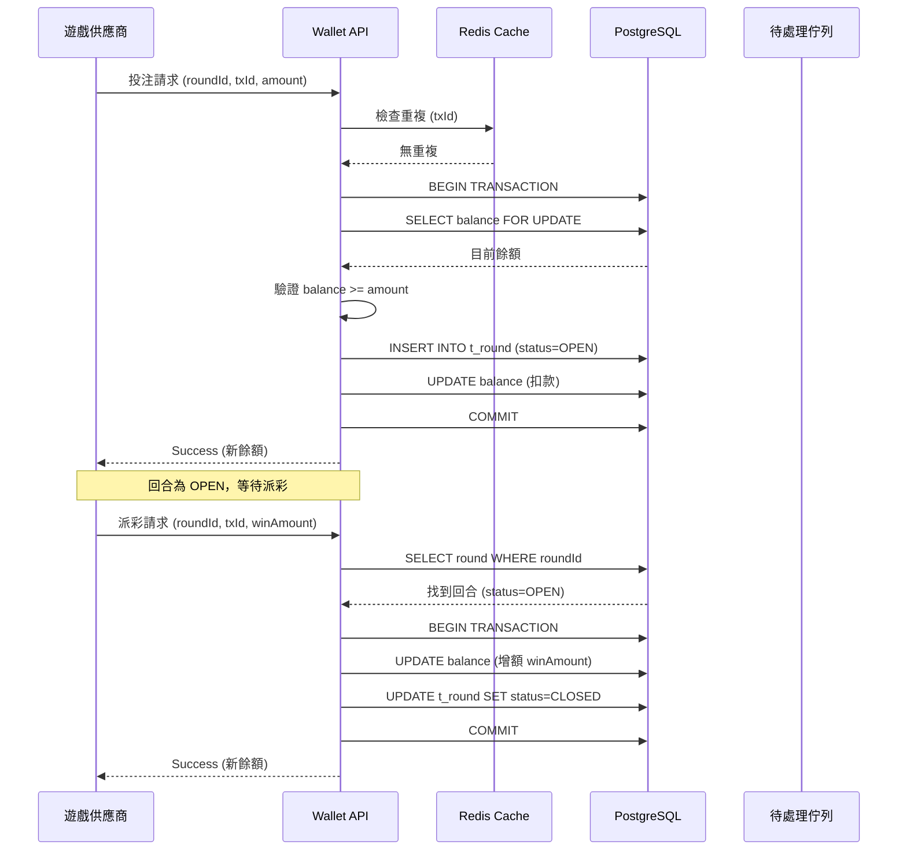
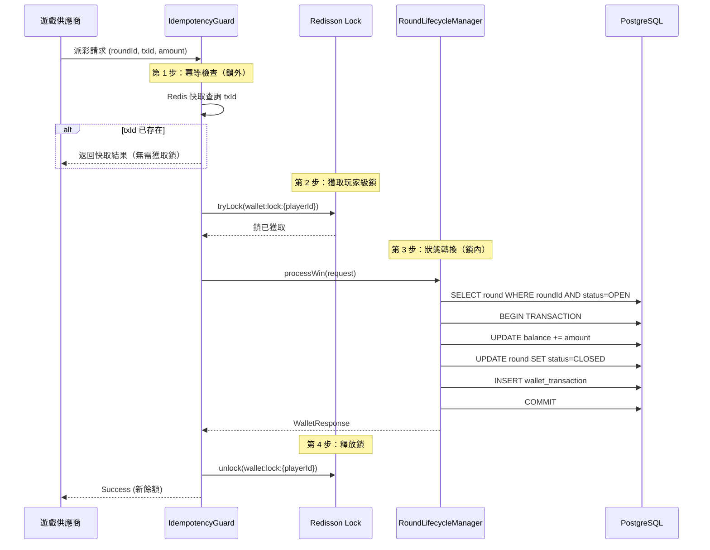

# 無縫錢包技術實作

> **業務需求**: [Seamless_Wallet_Requirements.md](../../requirements/02_Financial_Operations/01_Seamless_Wallet_Requirements.md)
> **目標讀者**: 架構師、後端開發者、DevOps 工程師
> **同步時間**: 2026-02-09

---

## 1. 架構概述

無縫錢包 (Seamless Wallet) 技術實作提供平台與遊戲供應商 (GP) 之間的即時交易處理，確保原子性、冪等性和併發安全。

**關鍵技術組件**：
- 基於回合的狀態機，用於交易生命週期管理
- 三層冪等防禦（Redis + DB + 分佈式鎖）
- 孤立回合偵測與自動恢復
- 負餘額處理與自動帳戶鎖定
- 亂序請求處理與待處理佇列
- 系統壓力管理的策略切換

---

## 2. 基於回合的狀態機

### 2.1 狀態轉換圖



### 2.2 狀態定義

| 狀態 | 說明 | 進入條件 | 離開條件 |
|-------|-------------|----------------|----------------|
| **OPEN** | 投注已扣除，等待派彩 | 投注請求成功 | 派彩請求到達或逾時 |
| **CLOSED** | 回合正常完成 | 派彩請求成功 | N/A（終態） |
| **TIMEOUT** | 2 小時內未收到派彩 | 系統排程檢查 | GP 狀態查詢或人工審核 |
| **PENDING_REVIEW** | GP 狀態未知，需人工介入 | GP 查詢失敗 | 客服關閉或取消 |
| **CANCELLED** | 回合取消，投注退還 | 回滾請求或人工取消 | N/A（終態） |
| **ADJUSTED** | 已套用重新結算 | 來自 GP 的調整請求 | N/A（終態） |

### 2.3 實作（Java）

```java
@Component
@RequiredArgsConstructor
public class RoundLifecycleManager {

    private final RoundRepository roundRepository;
    private final WalletService walletService;
    private final RedissonClient redissonClient;

    @Transactional(rollbackFor = Throwable.class)
    public WalletResponse processBet(BetRequest request) {
        String lockKey = "round:lock:" + request.getPlayerId();
        RLock lock = redissonClient.getLock(lockKey);

        try {
            if (!lock.tryLock(3, 10, TimeUnit.SECONDS)) {
                throw new BusinessException(ErrorCode.SYSTEM_BUSY);
            }

            // 建立回合紀錄
            Round round = Round.builder()
                .roundId(request.getRoundId())
                .playerId(request.getPlayerId())
                .gpId(request.getGpId())
                .betAmount(request.getAmount())
                .status(RoundStatus.OPEN)
                .createdAt(LocalDateTime.now())
                .build();

            roundRepository.save(round);

            // 扣除錢包餘額
            WalletResponse response = walletService.debit(
                request.getPlayerId(),
                request.getAmount(),
                request.getTxId()
            );

            return response;

        } catch (InterruptedException e) {
            Thread.currentThread().interrupt();
            throw new BusinessException(ErrorCode.LOCK_TIMEOUT);
        } finally {
            if (lock.isHeldByCurrentThread()) {
                lock.unlock();
            }
        }
    }
}
```

---

## 3. 孤立回合偵測

### 3.1 偵測 SQL

**排程任務**（每 15 分鐘執行）：

```sql
-- 偵測孤立回合（開啟超過 2 小時）
SELECT
    round_id,
    player_id,
    gp_id,
    bet_amount,
    created_at,
    EXTRACT(EPOCH FROM (NOW() - created_at)) / 3600 AS hours_open
FROM t_round
WHERE status = 'OPEN'
  AND created_at < NOW() - INTERVAL '2 hours'
ORDER BY created_at ASC
LIMIT 100;
```

### 3.2 自動恢復實作

```java
@Scheduled(cron = "0 */15 * * * *") // 每 15 分鐘
public void detectOrphanedRounds() {
    List<Round> orphanedRounds = roundRepository.findOrphanedRounds(
        LocalDateTime.now().minusHours(2)
    );

    for (Round round : orphanedRounds) {
        try {
            // 查詢 GP 取得最終回合狀態
            GPRoundStatus gpStatus = gpClient.queryRoundStatus(
                round.getGpId(),
                round.getRoundId()
            );

            if (gpStatus == GPRoundStatus.COMPLETED) {
                // 以實際派彩金額關閉回合
                closeRound(round.getRoundId(), gpStatus.getWinAmount());
            } else if (gpStatus == GPRoundStatus.CANCELLED) {
                // 退還投注
                cancelRound(round.getRoundId());
            } else {
                // GP 狀態未知，升級至人工審核
                escalateToManualReview(round);
            }

        } catch (GPQueryException e) {
            // GP 查詢失敗，立即升級
            escalateToManualReview(round);
        }
    }
}
```

---

## 4. 冪等三層防禦

> **交叉引用 — 冪等策略三文件導航**:
> - **本文件** (Seamless_Wallet_Technical.md) — 三層架構圖 + Java 實作（IdempotencyGuard）
> - [Financial_Implementation.md](04_Financial_Implementation.md#23-並發安全的餘額扣減redis-lua) — WalletManager 中 Redis 快取層的實際扣款應用
> - [Seamless_Wallet_Analysis.md](02_Seamless_Wallet_Analysis.md#3-冪等性實作) — 逾時重試時序圖 + 組件設計分析

### 4.1 架構圖

```
帶有 txId 的請求
       ↓
[第 1 層：Redis 快取]
   - 1 小時 TTL
   - O(1) 查詢
   - 快速路徑（< 5ms）
       ↓ 快取未命中
[第 2 層：DB 唯一約束]
   - t_transaction.tx_id UNIQUE
   - 使用 ON CONFLICT 的 UPSERT
   - 中速路徑（< 50ms）
       ↓ 約束違反
[第 3 層：回退查詢]
   - SELECT FROM t_transaction WHERE tx_id
   - 回傳已儲存的回應
   - 慢速路徑（< 100ms）
```

### 4.2 實作

```java
@Service
@RequiredArgsConstructor
public class IdempotencyGuard {

    private final StringRedisTemplate redisTemplate;
    private final TransactionRepository transactionRepository;

    public <T> T executeIdempotent(String txId, Supplier<T> action) {
        // 第 1 層：Redis 快取檢查
        String cacheKey = "tx:response:" + txId;
        String cachedResponse = redisTemplate.opsForValue().get(cacheKey);
        if (cachedResponse != null) {
            return deserialize(cachedResponse);
        }

        // 第 2 層：DB 唯一約束檢查（SmartAdmin: Service 層使用 Vavr Option）
        Option<Transaction> existing = transactionRepository.findByTxId(txId);
        if (existing.isDefined()) {
            T response = deserialize(existing.get().getResponse());
            // 填充快取供下次請求使用
            redisTemplate.opsForValue().set(cacheKey, serialize(response), 1, TimeUnit.HOURS);
            return response;
        }

        // 執行業務邏輯
        T response = action.get();

        // 將回應儲存至 DB 和快取
        Transaction tx = Transaction.builder()
            .txId(txId)
            .response(serialize(response))
            .createdAt(LocalDateTime.now())
            .build();
        transactionRepository.save(tx);

        redisTemplate.opsForValue().set(cacheKey, serialize(response), 1, TimeUnit.HOURS);

        return response;
    }
}
```

---

## 5. 併發處理（Redisson 分佈式鎖）

### 5.1 鎖配置

```yaml
# application.yml
redisson:
  single-server-config:
    address: redis://localhost:6379
    connection-pool-size: 64
    connection-minimum-idle-size: 10
  lock:
    wait-time: 3000  # 3 秒
    lease-time: 10000 # 10 秒
```

### 5.2 鎖實作

```java
@Component
@RequiredArgsConstructor
public class ConcurrencyManager {

    private final RedissonClient redissonClient;

    @Transactional(rollbackFor = Throwable.class)
    public WalletResponse debitWithLock(Long playerId, BigDecimal amount, String txId) {
        String lockKey = "wallet:lock:" + playerId;
        RLock lock = redissonClient.getLock(lockKey);

        try {
            // 嘗試取得鎖（等待 3 秒，最多持有 10 秒）
            boolean acquired = lock.tryLock(3, 10, TimeUnit.SECONDS);
            if (!acquired) {
                throw new BusinessException(ErrorCode.SYSTEM_BUSY_RETRY_LATER);
            }

            // 臨界區：餘額檢查 + 扣款
            Wallet wallet = walletRepository.findByPlayerIdForUpdate(playerId)
                .orElseThrow(() -> new BusinessException(ErrorCode.WALLET_NOT_FOUND));

            if (wallet.getBalance().compareTo(amount) < 0) {
                throw new BusinessException(ErrorCode.INSUFFICIENT_FUNDS);
            }

            wallet.setBalance(wallet.getBalance().subtract(amount));
            walletRepository.save(wallet);

            return WalletResponse.ok(wallet.getBalance());

        } catch (InterruptedException e) {
            Thread.currentThread().interrupt();
            throw new BusinessException(ErrorCode.LOCK_INTERRUPTED);
        } finally {
            if (lock.isHeldByCurrentThread()) {
                lock.unlock();
            }
        }
    }
}
```

### 5.3 鎖順序協議（Lock Ordering Protocol）

狀態機（Section 2）與分佈式鎖（Section 5.2）的交互必須遵循以下順序保證，避免死鎖和資料不一致：

**鎖獲取順序規則**:

```
1. 冪等檢查（鎖外）     → 重複請求直接返回快取結果，無需獲取鎖
2. 玩家級鎖（外層鎖）    → wallet:lock:{playerId}，防止同一玩家並發操作
3. 回合級鎖（內層鎖）    → round:lock:{playerId}，防止同一回合並發結算
4. 狀態轉換（鎖內）      → 在鎖保護範圍內完成 OPEN → CLOSED/CANCELLED
5. DB 持久化（鎖內）     → @Transactional 在 Manager 層
6. 釋放鎖（finally）     → 逆序釋放：回合鎖 → 玩家鎖
```

**請求處理流程圖**:



**關鍵保證**:
1. **冪等攔截在鎖外**: 重複請求不消耗鎖資源，保護系統吞吐量
2. **狀態轉換在鎖內**: 所有 `round.status` 變更都在 Redisson 鎖保護範圍內完成
3. **@Transactional 在 Manager 層**: 由 `RoundLifecycleManager` 處理（SmartAdmin 架構規則）
4. **無巢狀鎖**: 投注和派彩操作只獲取玩家級鎖，避免死鎖風險

---

## 6. 負餘額處理

### 6.1 重新結算流程

```java
@Service
@RequiredArgsConstructor
public class ResettlementService {

    private final ResettlementManager resettlementManager;
    private final AlertService alertService;

    public void processResettlement(ResettlementRequest request) {
        // 委派交易工作給 Manager
        WalletResponse response = resettlementManager.applyResettlement(request);

        // 非交易性：若負餘額則觸發告警
        if (response.getNewBalance().compareTo(BigDecimal.ZERO) < 0) {
            alertService.sendAlert(
                AlertLevel.CRITICAL,
                "負餘額告警",
                "玩家 " + request.getPlayerId() + " 餘額：" + response.getNewBalance()
            );
        }
    }
}
```

**ResettlementManager**（@Transactional 在 Manager 層）：

```java
@Component
@RequiredArgsConstructor
public class ResettlementManager {

    private final WalletService walletService;
    private final PlayerAccountService accountService;

    @Transactional(rollbackFor = Throwable.class)
    public WalletResponse applyResettlement(ResettlementRequest request) {
        BigDecimal adjustAmount = request.getAdjustAmount(); // 可為負數

        // 套用調整（可能導致負餘額）
        WalletResponse response = walletService.adjust(
            request.getPlayerId(),
            adjustAmount,
            request.getTxId()
        );

        // 檢查負餘額 - 在同一交易內鎖定帳戶
        if (response.getNewBalance().compareTo(BigDecimal.ZERO) < 0) {
            accountService.lockAccount(
                request.getPlayerId(),
                AccountLockReason.NEGATIVE_BALANCE,
                "餘額：" + response.getNewBalance()
            );
        }

        return response;
    }
}
```

### 6.2 帳戶鎖定實作

```sql
-- 鎖定帳戶並阻止所有操作
UPDATE t_player_account
SET status = 'LOCKED',
    lock_reason = 'NEGATIVE_BALANCE',
    lock_details = '餘額：-$123.45',
    locked_at = NOW(),
    updated_at = NOW()
WHERE player_id = ?;

-- 阻止所有新投注、存款、提款
-- （在每次操作前於 WalletService 中檢查）
```

---

## 7. 亂序處理

### 7.1 待處理佇列架構

```java
@Component
@RequiredArgsConstructor
public class OutOfOrderHandler {

    private final StringRedisTemplate redisTemplate;
    private final RoundRepository roundRepository;

    /**
     * 策略 3：臨時儲存（30 分鐘過期）
     * 當派彩先於投注到達時，存入待處理佇列
     */
    public void handleOrphanWin(WinRequest request) {
        String pendingKey = "pending:win:" + request.getRoundId();

        // 將派彩請求存入 Redis（30 分鐘 TTL）
        redisTemplate.opsForValue().set(
            pendingKey,
            serialize(request),
            30,
            TimeUnit.MINUTES
        );

        // 排程 5 分鐘後重試
        scheduleRetry(request.getRoundId(), 5);
    }

    @Scheduled(fixedDelay = 60000) // 每 1 分鐘
    public void processPendingWins() {
        Set<String> pendingKeys = redisTemplate.keys("pending:win:*");

        for (String key : pendingKeys) {
            String roundId = key.replace("pending:win:", "");

            // 檢查投注是否已到達（SmartAdmin: Vavr Option）
            Option<Round> round = roundRepository.findByRoundId(roundId);
            if (round.isDefined() && round.get().getStatus() == RoundStatus.OPEN) {
                // 投注已到達，處理待處理派彩
                WinRequest winRequest = deserialize(redisTemplate.opsForValue().get(key));
                processWin(winRequest);
                redisTemplate.delete(key);
            }
        }
    }
}
```

### 7.2 策略切換

```java
@Component
public class StrategyManager {

    private final AtomicInteger pendingQueueSize = new AtomicInteger(0);

    public WinResponse handleWin(WinRequest request) {
        // 檢查投注是否存在（SmartAdmin: Vavr Option）
        Option<Round> round = roundRepository.findByRoundId(request.getRoundId());

        if (round.isEmpty()) {
            // 偵測到亂序
            if (pendingQueueSize.get() > 100) {
                // 策略 1：立即拒絕（降級模式）
                throw new BusinessException(ErrorCode.BET_NOT_FOUND);
            } else {
                // 策略 3：臨時儲存（正常模式）
                handleOrphanWin(request);
                pendingQueueSize.incrementAndGet();
                return WinResponse.pending();
            }
        }

        // 正常流程：投注存在
        return processWin(request);
    }
}
```

---

## 8. 例外處理

### 8.1 Redis 連線失敗

```java
@Service
@RequiredArgsConstructor
public class ResilientCacheService {

    private final StringRedisTemplate redisTemplate;
    private final CircuitBreaker circuitBreaker;

    public Option<String> get(String key) {
        try {
            return circuitBreaker.executeSupplier(() ->
                Option.of(redisTemplate.opsForValue().get(key))
            );
        } catch (CallNotPermittedException e) {
            // 熔斷器開啟，繞過快取
            return Option.none();
        } catch (RedisConnectionException e) {
            // 連線失敗，優雅降級
            return Option.none();
        }
    }
}
```

### 8.2 資料庫延遲 P99 降級

```java
@Component
public class LatencyMonitor {

    private final MeterRegistry meterRegistry;

    @Around("@annotation(Monitored)")
    public Object monitorLatency(ProceedingJoinPoint joinPoint) throws Throwable {
        Timer.Sample sample = Timer.start(meterRegistry);
        try {
            return joinPoint.proceed();
        } finally {
            sample.stop(Timer.builder("db.query.latency")
                .tag("method", joinPoint.getSignature().getName())
                .register(meterRegistry));
        }
    }
}
```

---

## 9. 監控指標

### 9.1 Prometheus 指標

```java
@Component
@RequiredArgsConstructor
public class WalletMetrics {

    private final MeterRegistry meterRegistry;

    public void recordTransaction(TransactionType type, boolean success) {
        meterRegistry.counter("wallet.transaction.total",
            "type", type.name(),
            "status", success ? "success" : "failure"
        ).increment();
    }

    public void recordOutOfOrderEvent() {
        meterRegistry.counter("wallet.out_of_order.total").increment();
    }

    public void recordNegativeBalance(BigDecimal balance) {
        meterRegistry.gauge("wallet.negative_balance.amount", balance.doubleValue());
    }
}
```

---

## 10. 配置參考

### 10.1 Redis 配置

```yaml
spring:
  redis:
    host: localhost
    port: 6379
    password: ${REDIS_PASSWORD}
    timeout: 2000ms
    lettuce:
      pool:
        max-active: 8
        max-idle: 8
        min-idle: 2
```

### 10.2 資料庫配置

```yaml
spring:
  datasource:
    hikari:
      maximum-pool-size: 20
      minimum-idle: 5
      connection-timeout: 3000
      idle-timeout: 600000
      max-lifetime: 1800000
```

---

**文檔版本**: 1.0.0
**最後更新**: 2026-02-09
**維護團隊**: 後端團隊
