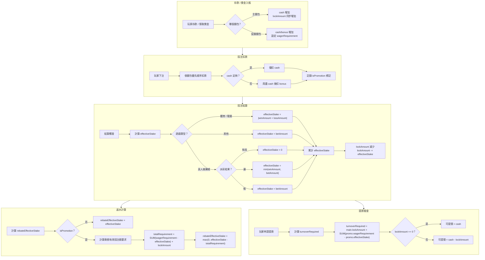
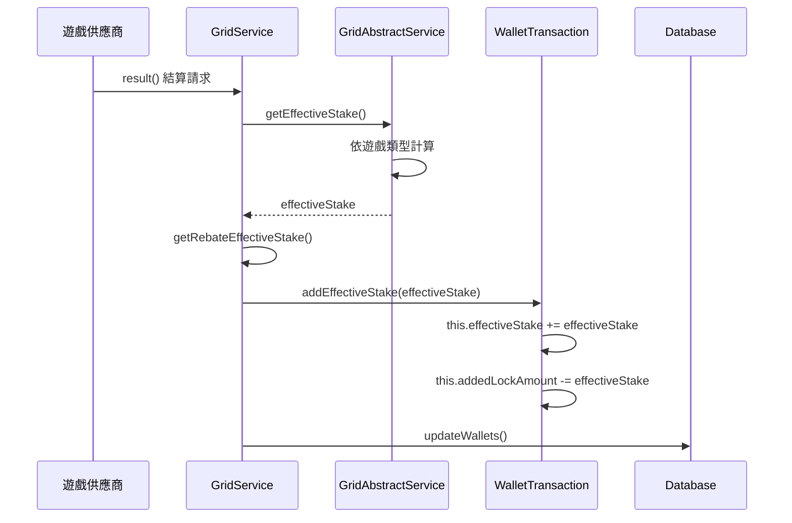
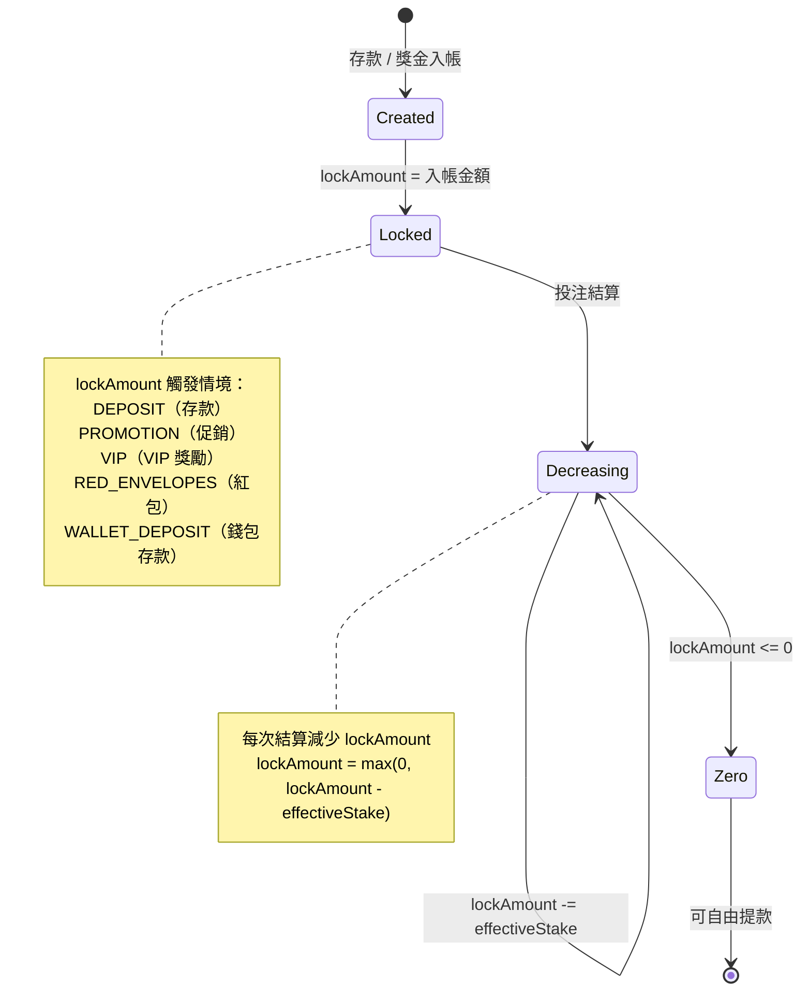
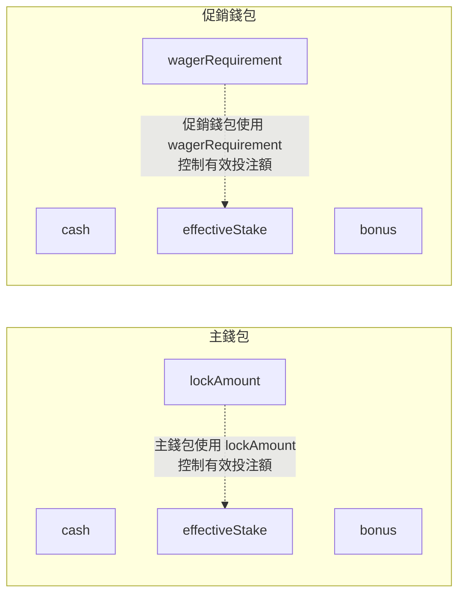
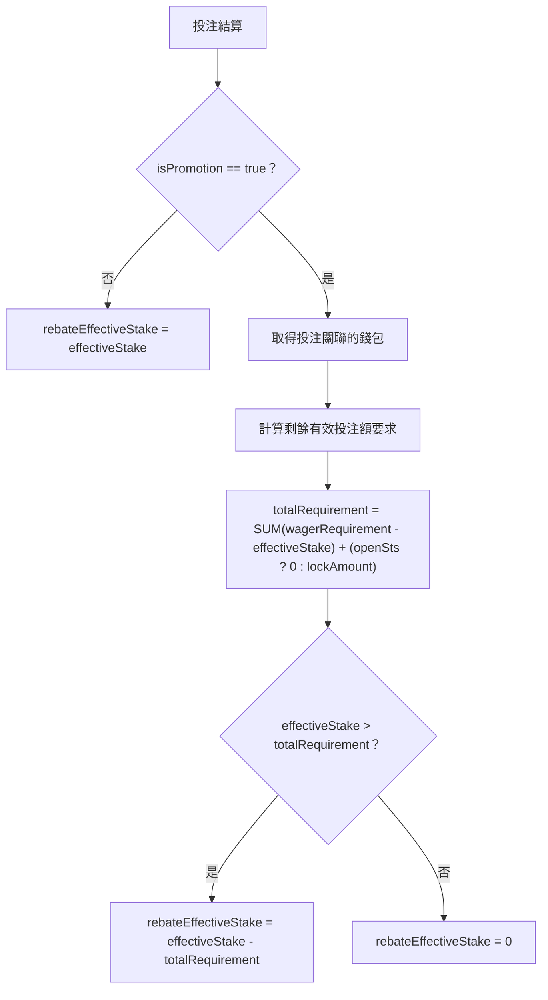
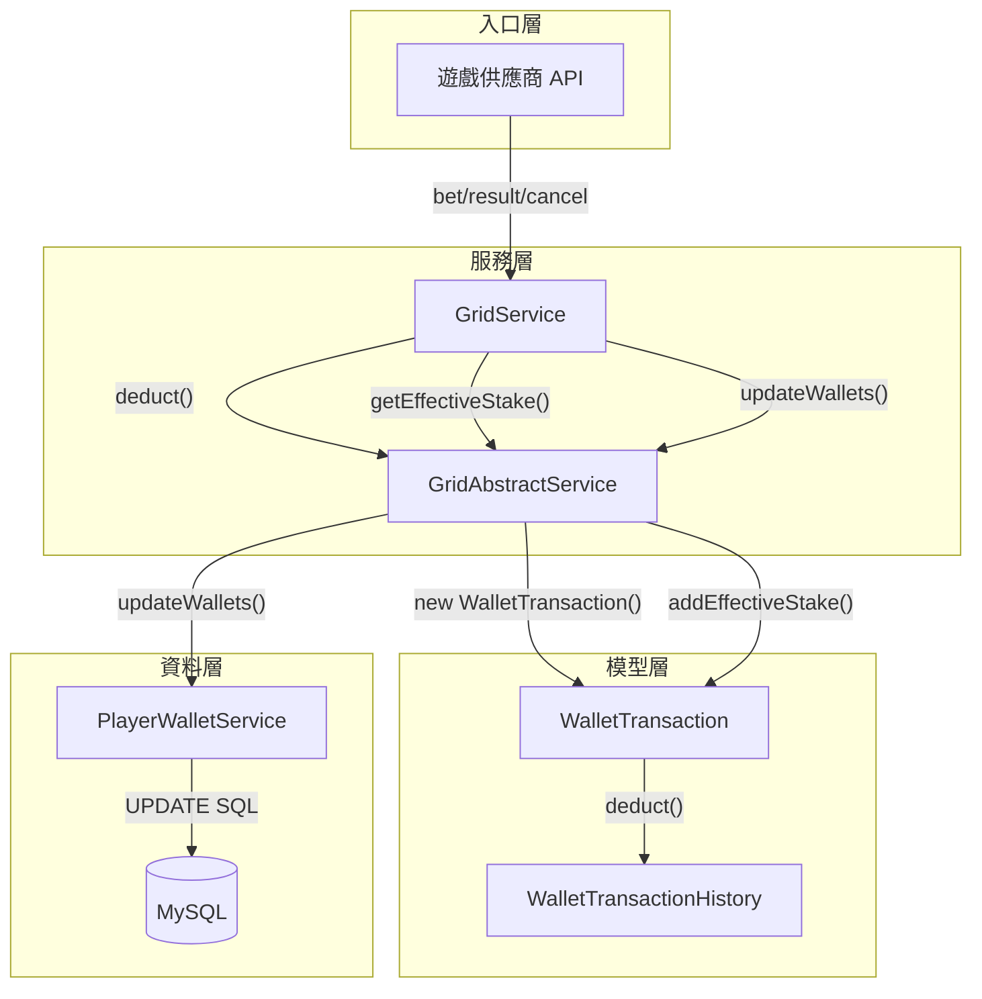

# 有效投注額架構：三層驗證與計算邏輯

> **XREF（交叉引用）**: 完整業務規則定義見 [Turnover 業務規則](../../requirements/03_Gaming_Operations/01_Turnover_Business_Rules.md)

> **SSOT 聲明**: 本文件是有效投注額 (Valid Turnover) 架構的唯一真實來源 (Single Source of Truth)。
> 合併自 `08_Turnover_Calculation_Architecture.md` + `09_Turnover_Calculation_Logic_Detail.md`。
>
> **規範來源**:
> - [source-archive/02_Finance_Center/02-04_Turnover_and_Game_Reconciliation_Analysis.md](../../source-archive/02_Finance_Center/02-04_Turnover_and_Game_Reconciliation_Analysis.md)
> - [source-archive/02_Finance_Center/02-04-diagrams/02-04-02_Calculation_Logic.md](../../source-archive/02_Finance_Center/02-04-diagrams/02-04-02_Calculation_Logic.md)
>
> **業務需求 XREF**: [有效投注額與遊戲對帳需求](../../requirements/02_Financial_Operations/05_Turnover_Reconciliation_Requirements.md)
>
> **目標讀者**: 架構師、後端開發者、風控工程師
>
> **最後更新**: 2026-03-31

---

## 目錄

1. [三層驗證架構](#1-三層驗證架構)
2. [核心概念定義](#2-核心概念定義)
3. [有效投注額計算流程](#3-有效投注額計算流程)
4. [lockAmount 生命週期](#4-lockamount-生命週期)
5. [促銷錢包邏輯](#5-促銷錢包邏輯)
6. [提款有效投注額要求](#6-提款有效投注額要求)
7. [資料庫更新邏輯](#7-資料庫更新邏輯)
8. [儲存策略](#8-儲存策略)
9. [SmartAdmin 架構實作](#9-smartadmin-架構實作)
10. [完整資料流](#10-完整資料流)
11. [資料庫 Schema](#11-資料庫-schema)

---

## 1. 三層驗證架構

### 1.1 架構概述

有效投注額 (Valid Turnover) 計算系統位於三層風控堆疊中。它根據遊戲結果（WIN/LOSS/DRAW）計算有效投注額狀態因子，前提是第 1 層（風控引擎）驗證已通過。

```
+-----------------------------------------------------------------------------+
|                   統一有效投注額驗證堆疊                                      |
+-----------------------------------------------------------------------------+
|                                                                              |
|  第 1 層：風控驗證（Risk Engine - 05-01）                                     |
|  +-------------------------------------------------------------+           |
|  | 職責：拒絕決策                                                 |           |
|  | 檢查：對沖/套利/低賠率/同 IP 對沖                                |           |
|  | 輸出：{ is_valid: boolean, effective_turnover_base: number }   |           |
|  |                                                               |           |
|  | X is_valid = false -> 立即回傳 0（跳過第 2/3 層）               |           |
|  | V is_valid = true  -> 回傳 effective_turnover_base             |           |
|  +-------------------------------------------------------------+           |
|                           | (僅當 is_valid = true)                          |
|  第 2 層：財務層（本模組 - 02-04）                                            |
|  +-------------------------------------------------------------+           |
|  | 職責：狀態因子調整                                              |           |
|  | 檢查：WIN/LOSS/DRAW/CANCEL/HALF_WIN/HALF_LOSS                  |           |
|  | 輸出：valid_turnover_finance                                   |           |
|  |     = effective_turnover_base x status_factor                  |           |
|  |                                                               |           |
|  | 警告：此層不做拒絕邏輯                                           |           |
|  +-------------------------------------------------------------+           |
|                           |                                                  |
|  第 3 層：活動層（04-01）                                                     |
|  +-------------------------------------------------------------+           |
|  | 職責：遊戲權重調整                                              |           |
|  | 檢查：SLOTS/SPORTS/BACCARAT/LOTTERY 等                         |           |
|  | 輸出：activity_valid_turnover                                  |           |
|  |     = valid_turnover_finance x game_weight                     |           |
|  |                                                               |           |
|  | 警告：此層不做拒絕邏輯                                           |           |
|  +-------------------------------------------------------------+           |
|                                                                              |
+-----------------------------------------------------------------------------+
```

### 1.2 職責矩陣

| 職責 | 第 1 層（風控引擎） | 第 2 層（財務） | 第 3 層（活動） |
|---------------|----------------------|-------------------|-------------------|
| **拒絕決策** | 唯一負責 | 不涉及 | 不涉及 |
| **狀態因子調整** | 不涉及 | 唯一負責 | 不涉及 |
| **遊戲權重套用** | 不涉及 | 不涉及 | 唯一負責 |
| **短路回傳** | is_valid=false 回傳 0 | 信任第 1 層結果 | 信任第 2 層結果 |
| **效能影響** | 所有投注執行 | 僅通過第 1 層的投注（~95%）| 僅有活躍獎金的投注 |

### 1.3 分層處理實作

**第 1 層（風控引擎驗證）**

```typescript
const riskValidation = await RiskEngine.validateTurnover({
  bet_id: bet.id,
  player_id: bet.player_id,
  game_type: bet.game_type,
  bet_amount: bet.amount,
  odds: bet.odds,
  odds_type: bet.odds_type
});

// BLOCK 規則拒絕 -> 短路回傳（跳過第 2/3 層）
if (!riskValidation.is_valid && riskValidation.action_type === 'BLOCK') {
  return {
    bet_id: bet.id,
    effective_turnover_base: 0,
    valid_turnover_finance: 0,
    activity_valid_turnover: 0,
    rejected_by: 'RISK_ENGINE',
    action_type: 'BLOCK',
    matched_rules: riskValidation.matched_rules
  };
}
const effective_turnover_base = riskValidation.effective_turnover_base;
```

**第 2 層（財務狀態因子調整）**

```typescript
function getStatusFactor(status: BetStatus): number {
  const STATUS_FACTORS = {
    'WIN': 1.0, 'LOSS': 1.0,
    'DRAW': 0.0, 'TIE': 0.0, 'VOID': 0.0, 'CANCEL': 0.0,
    'HALF_WIN': 1.0,   // v2.0.0: 標準本金法
    'HALF_LOSS': 1.0,  // v2.0.0: 標準本金法
    'RUNNING': 0.0
  };
  return STATUS_FACTORS[status] ?? 0.0;
}
const status_factor = getStatusFactor(bet.status);
const valid_turnover_finance = effective_turnover_base * status_factor;
```

**第 3 層（記錄三層結果）**

```typescript
await db.transaction(async (tx) => {
  await tx.insertInto('bet_turnover_record').values({
    bet_id: bet.id,
    effective_turnover_base,
    action_type: riskValidation.action_type,
    matched_rules: riskValidation.matched_rules,
    status_factor,
    valid_turnover_finance,
    activity_valid_turnover: activity_valid_turnover ?? 0,
    game_weight: game_weight ?? 1.0,
    calculated_at: new Date()
  });
});
```

---

## 2. 核心概念定義

| 術語 | 說明 | 儲存位置 |
|------|------|----------|
| **effectiveStake** | 判斷玩家是否達成有效投注額要求的關鍵指標 | `player_wallet.effective_stake` |
| **lockAmount** | 主錢包中的不可提領金額，透過有效投注額解鎖 | `player_wallet.lock_amount`（僅主錢包） |
| **wagerRequirement** | 促銷錢包必須達成的有效投注額門檻 | `player_wallet.wager_requirement`（僅促銷錢包） |
| **turnoverRequired** | 玩家必須完成的總有效投注額 = 主錢包 lockAmount + SUM(促銷錢包 wagerRequirement - effectiveStake) | 計算值，非資料庫欄位 |
| **rebateEffectiveStake** | 可計入返水計算的有效投注額 | `transaction.rebate_effective_stake` |

> **業務規則 XREF**: 賠率門檻、遊戲貢獻權重、活動投注額計算規則請參閱
> [有效投注額與遊戲對帳需求 §1](../../requirements/02_Financial_Operations/05_Turnover_Reconciliation_Requirements.md)

---

## 3. 有效投注額計算流程

### 3.1 端對端流程



### 3.2 計算觸發時序



### 3.3 依遊戲類型的公式

| 遊戲類型 | 條件 | effectiveStake 公式 |
|----------|------|---------------------|
| **體育 / 電競** | 所有結果 | `abs(winAmount + lossAmount)` |
| **真人娛樂城** | 和局 (payout == betAmount) | `0` |
| **真人娛樂城** | 贏 (winAmount > 0) | `min(winAmount, betAmount)` |
| **真人娛樂城** | 輸 (winAmount == 0) | `betAmount` |
| **其他類型** | 所有結果 | `betAmount` |

### 3.4 程式碼參考

```java
// GridAbstractService.java:171-193
protected long getEffectiveStake(GameType gameType, long betAmount, long winAmount, long lossAmount) {
    return switch (gameType) {
        case SPORTS, E_SPORTS -> Math.abs(winAmount + lossAmount);
        case CASINO -> {
            if (winAmount == betAmount) yield 0L;          // 和局
            else if (winAmount > 0) yield Math.min(winAmount, betAmount); // 贏
            else yield betAmount;                            // 輸
        }
        default -> betAmount;
    };
}

// WalletTransaction.java:119-125
public void addEffectiveStake(long effectiveStake) {
    this.effectiveStake += effectiveStake;
    this.addedLockAmount -= effectiveStake;
}
```

---

## 4. lockAmount 生命週期

### 4.1 狀態圖



### 4.2 lockAmount 變更事件

| 操作 | lockAmount 變化 | 說明 |
|------|-----------------|------|
| 存款入帳 | **+金額** | 完成有效投注額才能提款 |
| 領取獎金 | **+金額** | 同上 |
| VIP 獎勵 | **+金額** | 同上 |
| 下注 | **無變化** | 僅扣除資金，不影響 lockAmount |
| 投注結算 | **-effectiveStake** | 解鎖等值金額 |
| 投注取消 | **+effectiveStake** | 恢復原本鎖定 |

### 4.3 程式碼參考

- **增加邏輯**: `WalletTransaction.java:52-101`
- **減少邏輯**: `WalletTransaction.java:119-125`

---

## 5. 促銷錢包邏輯

### 5.1 主錢包 vs. 促銷錢包



### 5.2 促銷錢包完成檢查

```
促銷錢包有效投注額達成 = (effectiveStake >= wagerRequirement)
```

### 5.3 促銷轉主錢包有效投注額計算

從促銷錢包轉出時，剩餘有效投注額要求按比例轉移：

```
transferWagerRequirement = (wagerRequirement - effectiveStake) * (transferAmount / (cash + bonus))
```

### 5.4 返水有效投注額 (rebateEffectiveStake) 計算



| 投注類型 | 條件 | rebateEffectiveStake |
|----------|------|----------------------|
| 非促銷投注 | isPromotion = false | `effectiveStake` |
| 促銷投注 | 有效投注額已達成 | `effectiveStake` |
| 促銷投注 | 有效投注額未達成 | `max(0, effectiveStake - remainingRequirement)` |

**程式碼參考**: `GridAbstractService.java:195-239`

---

## 6. 提款有效投注額要求

### 6.1 公式

> **業務規則 XREF**: 賠率門檻、免費旋轉規則、每日對帳要求請參閱
> [有效投注額與遊戲對帳需求](../../requirements/02_Financial_Operations/05_Turnover_Reconciliation_Requirements.md)

```
turnoverRequired = main.lockAmount + SUM(promo.wagerRequirement - promo.effectiveStake)
```

其中：
- `main.lockAmount`：主錢包鎖定金額
- `SUM(...)`：所有**活躍**促銷錢包剩餘有效投注額要求的總和

### 6.2 程式碼參考

- `PlayerManager.java:709-718`

---

## 7. 資料庫更新邏輯

### 7.1 錢包更新 SQL

```sql
UPDATE player_wallet
SET
    cash = cash + #{cashDelta},
    bonus = bonus + #{bonusDelta},
    clean_amount = GREATEST(clean_amount + #{cleanDelta}, 0),
    lock_amount = GREATEST(lock_amount + #{lockDelta}, 0),
    effective_stake = effective_stake + #{effectiveStakeDelta}
WHERE
    id = #{walletId}
    AND cash + #{cashDelta} >= 0
    AND bonus + #{bonusDelta} >= 0;
```

> **注意**：`GREATEST(..., 0)` 確保 `clean_amount` 和 `lock_amount` 永不為負。

### 7.2 WalletTransaction 對 PlayerWallet 欄位對映

| WalletTransaction 欄位 | 資料庫更新模式 | 備註 |
|------------------------|----------------|------|
| `cleanAmount` | **差額** (+ 或 -) | 受 `GREATEST(..., 0)` 保護 |
| `lockAmount` | **差額** (+ 或 -) | 受 `GREATEST(..., 0)` 保護 |
| `effectiveStake` | **絕對值** | 直接設定 |
| `cash` | **絕對值** | 直接設定 |
| `bonus` | **絕對值** | 直接設定 |

---

## 8. 儲存策略

> **合規標準**: MGA Player Protection Directive 3.2 — 有效投注額計算過程必須可審計追溯，中間結果必須持久化。

**設計決策：單一反正規化表 `t_bet_turnover_record`**

| 層 | 計算模式 | 儲存欄位 | 寫入時機 | 備註 |
|---|---------|---------|---------|------|
| 第 1 層（風控） | **即時計算**（投注結算時） | `effective_turnover_base`, `action_type`, `matched_rules` | 投注結算時（bet settlement） | 與風控引擎同步執行 |
| 第 2 層（財務） | **即時計算**（投注結算時） | `status_factor`, `valid_turnover_finance` | 投注結算時（第 1 層通過後） | 依賴遊戲結果（WIN/LOSS/DRAW） |
| 第 3 層（活動） | **即時計算**（投注結算時） | `game_weight`, `activity_valid_turnover` | 投注結算時（第 2 層完成後） | 僅當玩家有活躍獎金時執行 |
| 每日聚合 | **批次計算**（每日 02:00） | `t_daily_reconciliation_report` | T+1 對帳排程 | 用於每日監控和審計 |

**選擇單一反正規化表的理由**：
1. **查詢效能**: 報表查詢只需 1 次 JOIN（vs 3 次 JOIN），對於即時儀表板至關重要
2. **審計完整性**: 單一記錄包含三層結果，MGA 審計時可一次性呈現完整計算鏈
3. **原子性**: 三層計算在同一個 `@Transactional` 內完成，由 `TurnoverManager` 協調（SmartAdmin Manager 層）

---

## 9. SmartAdmin 架構實作

### 9.1 TurnoverService - 有效投注額查詢服務

```java
package net.lab1024.sa.business.finance.turnover.service;

import io.vavr.control.Option;
import lombok.RequiredArgsConstructor;
import net.lab1024.sa.business.finance.turnover.domain.TurnoverVO;
import net.lab1024.sa.business.finance.turnover.dao.PlayerWalletDao;
import net.lab1024.sa.business.finance.turnover.entity.PlayerWalletEntity;
import net.lab1024.sa.common.core.util.SmartBeanUtil;
import org.springframework.stereotype.Service;

/**
 * 有效投注額服務
 */
@Service
@RequiredArgsConstructor
public class TurnoverService {

    private final PlayerWalletDao playerWalletDao;

    /**
     * 查詢玩家主錢包有效投注額狀態
     */
    public Option<TurnoverVO> getMainWalletTurnoverStatus(Long playerId) {
        return Option.of(playerWalletDao.selectMainWallet(playerId))
            .map(wallet -> {
                TurnoverVO vo = SmartBeanUtil.copy(wallet, TurnoverVO.class);
                vo.setRemainingTurnover(wallet.getLockAmount());
                vo.setCompletionRate(calculateCompletionRate(wallet));
                return vo;
            });
    }

    private Double calculateCompletionRate(PlayerWalletEntity wallet) {
        if (wallet.getLockAmount() == null || wallet.getLockAmount() == 0L) {
            return 100.0;
        }
        long initialLock = wallet.getLockAmount() + wallet.getEffectiveStake();
        if (initialLock == 0L) return 0.0;
        return (wallet.getEffectiveStake() * 100.0) / initialLock;
    }
}
```

### 9.2 TurnoverManager - 有效投注額結算管理器

```java
package net.lab1024.sa.business.finance.turnover.manager;

import lombok.RequiredArgsConstructor;
import net.lab1024.sa.business.finance.turnover.dao.PlayerWalletDao;
import net.lab1024.sa.business.finance.turnover.dao.WalletTransactionDao;
import net.lab1024.sa.business.finance.turnover.entity.PlayerWalletEntity;
import net.lab1024.sa.business.finance.turnover.entity.WalletTransactionEntity;
import org.springframework.stereotype.Component;
import org.springframework.transaction.annotation.Transactional;

import java.util.List;

/**
 * 有效投注額事務管理器
 * 負責多錢包協調的複雜有效投注額計算與更新
 */
@Component
@RequiredArgsConstructor
public class TurnoverManager {

    private final PlayerWalletDao playerWalletDao;
    private final WalletTransactionDao transactionDao;

    /**
     * 結算投注並更新有效投注額（跨多個錢包）
     */
    @Transactional(rollbackFor = Throwable.class)
    public void settleBetEffectiveStake(Long playerId, Long betTransactionId, Long effectiveStake) {
        WalletTransactionEntity transaction = transactionDao.selectById(betTransactionId);
        if (transaction == null) {
            throw new IllegalArgumentException("投注交易不存在: " + betTransactionId);
        }

        PlayerWalletEntity wallet = playerWalletDao.selectById(transaction.getWalletId());
        if (wallet == null) {
            throw new IllegalArgumentException("錢包不存在: " + transaction.getWalletId());
        }

        long newEffectiveStake = wallet.getEffectiveStake() + effectiveStake;
        long newLockAmount = Math.max(0L, wallet.getLockAmount() - effectiveStake);

        playerWalletDao.updateEffectiveStakeAndLock(
            wallet.getId(), newEffectiveStake, newLockAmount
        );
        transactionDao.updateEffectiveStake(betTransactionId, effectiveStake);
    }

    /**
     * 批量更新玩家所有活躍促銷錢包有效投注額（每日批次作業）
     */
    @Transactional(rollbackFor = Throwable.class)
    public void batchRecalculatePromotionWallets(List<Long> playerIds) {
        for (Long playerId : playerIds) {
            List<PlayerWalletEntity> promoWallets = playerWalletDao.selectActivePromotionWallets(playerId);
            for (PlayerWalletEntity wallet : promoWallets) {
                long remaining = wallet.getWagerRequirement() - wallet.getEffectiveStake();
                if (remaining <= 0) {
                    playerWalletDao.markPromotionComplete(wallet.getId());
                }
            }
        }
    }
}
```

### 9.3 TurnoverCalculationManager - 三層驗證結算管理器

```java
@Component
@RequiredArgsConstructor
public class TurnoverCalculationManager {

    private final BetTurnoverRecordDao turnoverDao;
    private final KafkaTemplate<String, String> kafkaTemplate;

    private static final Map<String, BigDecimal> STATUS_FACTORS = Map.of(
        "WIN", BigDecimal.ONE,
        "LOSS", BigDecimal.ONE,
        "DRAW", BigDecimal.ZERO,
        "CANCEL", BigDecimal.ZERO,
        "HALF_WIN", BigDecimal.ONE,
        "HALF_LOSS", BigDecimal.ONE
    );

    /**
     * 使用交易支援計算並記錄有效投注額。
     * 依 SmartAdmin 架構，@Transactional 僅允許在 Manager 層使用。
     */
    @Transactional(rollbackFor = Throwable.class)
    public ResponseDTO<TurnoverResult> calculateAndRecordTurnover(
            BetSettleForm form, RiskValidationResult riskResult) {

        BigDecimal statusFactor = STATUS_FACTORS.getOrDefault(form.getStatus(), BigDecimal.ZERO);
        BigDecimal validTurnover = riskResult.getEffectiveTurnoverBase().multiply(statusFactor);

        BetTurnoverRecordEntity record = new BetTurnoverRecordEntity();
        record.setBetId(form.getBetId());
        record.setPlayerId(form.getPlayerId());
        record.setValidTurnoverFinance(validTurnover);
        record.setStatusFactor(statusFactor);
        turnoverDao.insert(record);

        kafkaTemplate.send("finance.turnover.calculated",
            form.getPlayerId().toString(), JsonUtil.toJsonString(record));

        return ResponseDTO.ok(TurnoverResult.success(record));
    }
}
```

---

## 10. 完整資料流



---

## 11. 資料庫 Schema

### 11.1 t_player_wallet - 玩家錢包表

```sql
CREATE TABLE t_player_wallet (
    id BIGINT PRIMARY KEY AUTO_INCREMENT,
    tenant_id BIGINT NOT NULL,
    player_id BIGINT NOT NULL,
    wallet_type VARCHAR(20) NOT NULL COMMENT 'MAIN, PROMOTION',
    cash BIGINT NOT NULL DEFAULT 0 COMMENT '現金餘額（分）',
    bonus BIGINT NOT NULL DEFAULT 0 COMMENT '獎金餘額（分）',
    clean_amount BIGINT NOT NULL DEFAULT 0 COMMENT '可提領金額 = cash - lockAmount',
    lock_amount BIGINT NOT NULL DEFAULT 0 COMMENT '鎖定金額（僅主錢包）',
    effective_stake BIGINT NOT NULL DEFAULT 0 COMMENT '累計有效投注額',
    wager_requirement BIGINT COMMENT '有效投注額要求（僅促銷錢包）',
    promotion_id BIGINT COMMENT '促銷活動 ID（僅促銷錢包）',
    is_closed BOOLEAN NOT NULL DEFAULT FALSE COMMENT '促銷錢包是否已關閉',
    created_at TIMESTAMP NOT NULL DEFAULT CURRENT_TIMESTAMP,
    updated_at TIMESTAMP NOT NULL DEFAULT CURRENT_TIMESTAMP ON UPDATE CURRENT_TIMESTAMP,
    deleted BOOLEAN NOT NULL DEFAULT FALSE,

    INDEX idx_player_type (player_id, wallet_type),
    INDEX idx_tenant_player (tenant_id, player_id),
    INDEX idx_promotion (promotion_id)
) COMMENT '玩家錢包表';

COMMENT ON COLUMN t_player_wallet.lock_amount IS '鎖定金額：存款/獎金產生的有效投注額要求（僅主錢包，透過結算逐步解鎖）';
COMMENT ON COLUMN t_player_wallet.effective_stake IS '累計有效投注額：結算時計算並累加，用於解鎖 lockAmount 或達成 wagerRequirement';
COMMENT ON COLUMN t_player_wallet.wager_requirement IS '有效投注額要求：促銷錢包必須完成的總有效投注額（僅促銷錢包）';
```

### 11.2 t_transaction - 投注交易表

```sql
CREATE TABLE t_transaction (
    id BIGINT PRIMARY KEY AUTO_INCREMENT,
    tenant_id BIGINT NOT NULL,
    player_id BIGINT NOT NULL,
    wallet_id BIGINT NOT NULL,
    game_provider VARCHAR(50) NOT NULL COMMENT '遊戲供應商（PG, EVO, etc.）',
    game_type VARCHAR(20) NOT NULL COMMENT 'SPORTS, CASINO, E_SPORTS, SLOTS',
    bet_amount BIGINT NOT NULL COMMENT '投注金額（分）',
    payout BIGINT COMMENT '派彩金額（分，結算後填寫）',
    effective_stake BIGINT NOT NULL DEFAULT 0 COMMENT '有效投注額（結算後計算）',
    rebate_effective_stake BIGINT NOT NULL DEFAULT 0 COMMENT '返水有效投注額',
    is_promotion BOOLEAN NOT NULL DEFAULT FALSE COMMENT '是否為促銷投注',
    ante BIGINT NOT NULL DEFAULT 0 COMMENT '前置手續費（分）',
    tip BIGINT NOT NULL DEFAULT 0 COMMENT '小費（分）',
    external_bet_id VARCHAR(100) COMMENT '外部投注 ID（遊戲供應商）',
    status VARCHAR(20) NOT NULL DEFAULT 'UNSETTLE' COMMENT 'UNSETTLE, SETTLE, CANCELLED, VOIDED',
    created_at TIMESTAMP NOT NULL DEFAULT CURRENT_TIMESTAMP,
    updated_at TIMESTAMP NOT NULL DEFAULT CURRENT_TIMESTAMP ON UPDATE CURRENT_TIMESTAMP,
    deleted BOOLEAN NOT NULL DEFAULT FALSE,

    INDEX idx_player_status (player_id, status),
    INDEX idx_wallet_time (wallet_id, created_at),
    INDEX idx_external_id (external_bet_id),
    INDEX idx_tenant (tenant_id)
) COMMENT '投注交易表';

COMMENT ON COLUMN t_transaction.effective_stake IS '有效投注額：結算時依遊戲類型計算（體育=|win+loss|，賭場和局=0，賭場贏=min(win,bet)，賭場輸=bet）';
COMMENT ON COLUMN t_transaction.rebate_effective_stake IS '返水有效投注額：促銷投注需扣除剩餘要求（totalReq = SUM(wagerReq-effectiveStake) + lockAmount）';
```

### 11.3 t_bet_turnover_record - 有效投注額計算記錄表（三層審計）

```sql
CREATE TABLE t_bet_turnover_record (
    id BIGINT PRIMARY KEY AUTO_INCREMENT,
    tenant_id BIGINT NOT NULL,
    bet_id VARCHAR(100) NOT NULL,
    player_id BIGINT NOT NULL,
    game_type VARCHAR(20) COMMENT '遊戲類型',

    -- 第 1 層結果
    effective_turnover_base DECIMAL(18, 4) NOT NULL DEFAULT 0 COMMENT '風控引擎基礎有效投注額',
    action_type VARCHAR(10) COMMENT 'BLOCK, FLAG, PASS',
    matched_rules JSON COMMENT '匹配的風控規則',
    risk_proposal_id VARCHAR(100) COMMENT '風險提案 ID（FLAG 時）',

    -- 第 2 層結果
    status VARCHAR(20) COMMENT '投注狀態',
    status_factor DECIMAL(5, 2) COMMENT '狀態因子',
    valid_turnover_finance DECIMAL(18, 4) NOT NULL DEFAULT 0 COMMENT '財務有效投注額',

    -- 第 3 層結果
    game_weight DECIMAL(5, 2) COMMENT '遊戲權重',
    activity_valid_turnover DECIMAL(18, 4) NOT NULL DEFAULT 0 COMMENT '活動有效投注額',

    calculated_at TIMESTAMP NOT NULL DEFAULT CURRENT_TIMESTAMP,
    deleted BOOLEAN NOT NULL DEFAULT FALSE,

    INDEX idx_bet_id (bet_id),
    INDEX idx_player_time (player_id, calculated_at),
    INDEX idx_tenant (tenant_id)
) COMMENT '有效投注額三層計算記錄表（審計追蹤）';
```

### 11.4 關鍵查詢範例

```sql
-- 查詢玩家剩餘有效投注額要求（提款前檢查）
SELECT
    (SELECT COALESCE(lock_amount, 0)
     FROM t_player_wallet
     WHERE player_id = ? AND wallet_type = 'MAIN' AND deleted = FALSE) +
    COALESCE(SUM(GREATEST(wager_requirement - effective_stake, 0)), 0) AS turnover_required
FROM t_player_wallet
WHERE player_id = ?
  AND wallet_type = 'PROMOTION'
  AND is_closed = FALSE
  AND deleted = FALSE;

-- 查詢玩家有效投注額完成進度
SELECT
    w.wallet_type,
    CASE
        WHEN w.wallet_type = 'MAIN' THEN w.lock_amount
        WHEN w.wallet_type = 'PROMOTION' THEN w.wager_requirement
    END AS total_requirement,
    w.effective_stake,
    CASE
        WHEN w.wallet_type = 'MAIN' AND w.lock_amount > 0
            THEN ROUND((w.effective_stake * 100.0) / (w.lock_amount + w.effective_stake), 2)
        WHEN w.wallet_type = 'PROMOTION' AND w.wager_requirement > 0
            THEN ROUND((w.effective_stake * 100.0) / w.wager_requirement, 2)
        ELSE 100.0
    END AS completion_rate
FROM t_player_wallet w
WHERE w.player_id = ? AND w.deleted = FALSE
ORDER BY w.wallet_type;
```

---

## 原始程式碼索引

| 功能 | 檔案 | 方法 |
|------|------|----------|
| 投注扣款 | GridAbstractService.java | `deduct()` |
| 有效投注額計算 | GridAbstractService.java | `getEffectiveStake()` |
| 返水有效投注額 | GridAbstractService.java | `getRebateEffectiveStake()` |
| 錢包交易處理 | WalletTransaction.java | `deduct()`, `addEffectiveStake()` |
| 投注結算 | GridService.java | `result()` |
| 提款有效投注額查詢 | PlayerManager.java | `getBalance()` |
| 資料庫更新 | PlayerWalletServiceImpl.java | 第 69-86 行 |

---

**文件版本**: 2.0.0（合併自 08 v2.0.0 + 09 v1.0.0）
**最後更新**: 2026-03-31
**維護團隊**: 財務團隊 & 後端團隊
