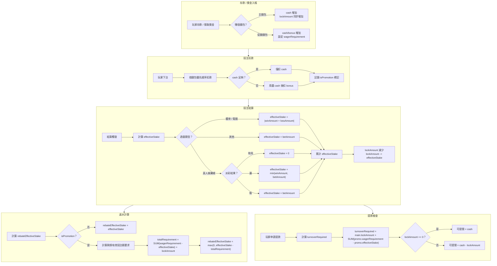
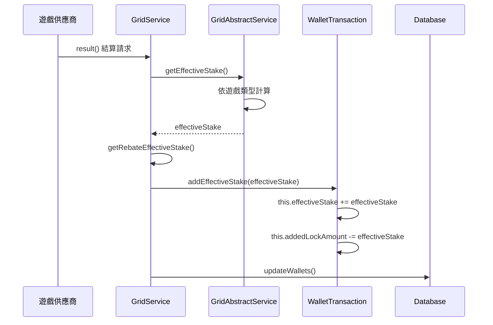
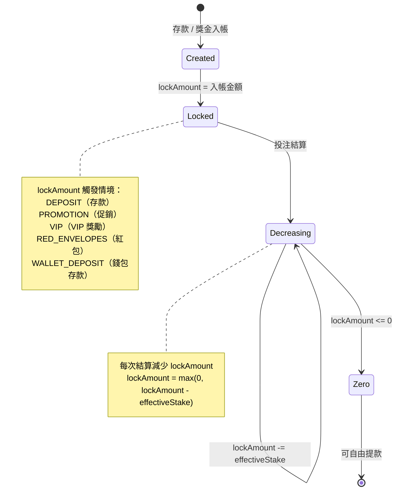
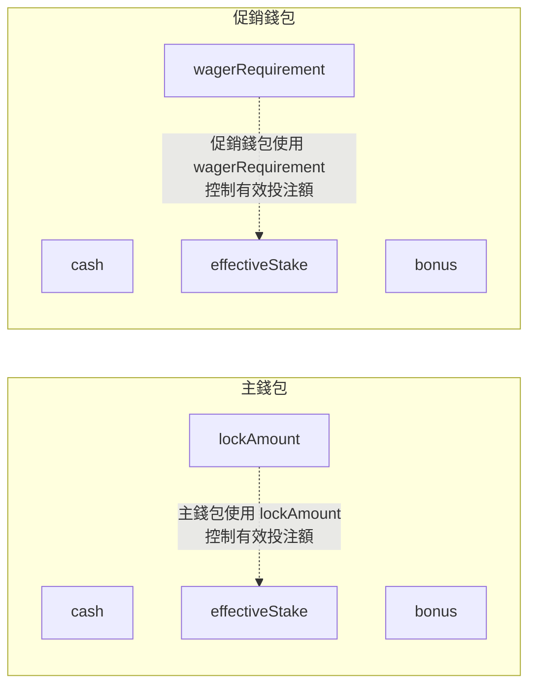
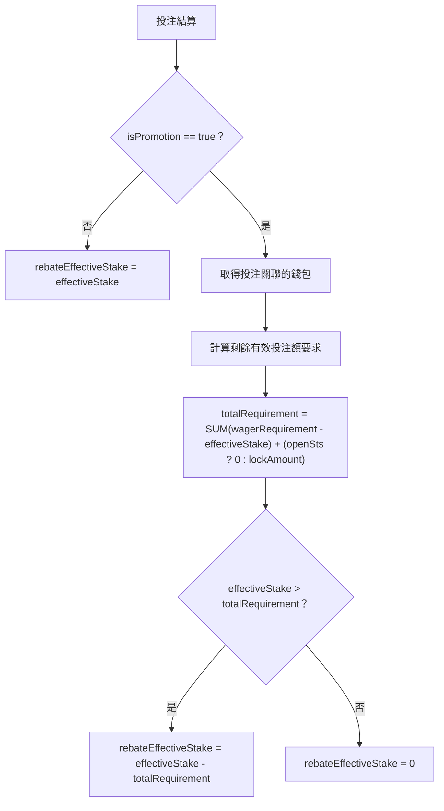
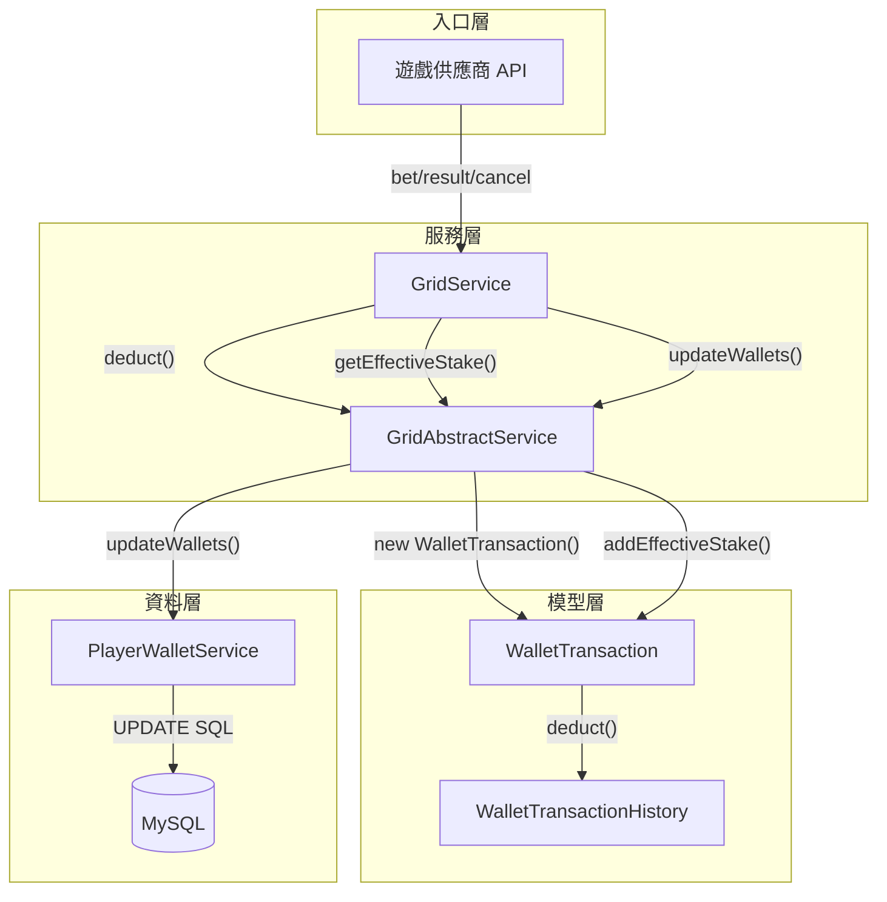

# 有效投注額計算邏輯詳解

> **規範來源**: [02-04-02_Calculation_Logic.md](../../source-archive/02_Finance_Center/02-04-diagrams/02-04-02_Calculation_Logic.md)
> **目標讀者**: 架構師、後端開發者
> **業務需求**: None
> **同步時間**: 2026-02-08

---

## 1. 核心概念定義

| 術語 | 說明 | 儲存位置 |
|------|------|----------|
| **effectiveStake** | 判斷玩家是否達成有效投注額要求的關鍵指標 | `player_wallet.effective_stake` |
| **lockAmount** | 主錢包中的不可提領金額，透過有效投注額解鎖 | `player_wallet.lock_amount`（僅主錢包） |
| **wagerRequirement** | 促銷錢包必須達成的有效投注額門檻 | `player_wallet.wager_requirement`（僅促銷錢包） |
| **turnoverRequired** | 玩家必須完成的總有效投注額 = 主錢包 lockAmount + SUM(促銷錢包 wagerRequirement - effectiveStake) | 計算值，非資料庫欄位 |
| **rebateEffectiveStake** | 可計入返水計算的有效投注額 | `transaction.rebate_effective_stake` |

---

## 2. 完整有效投注額計算流程

### 2.1 端對端流程



---

## 3. 有效投注額 (effectiveStake) 計算

### 3.1 計算觸發時序



### 3.2 依遊戲類型的公式

| 遊戲類型 | 條件 | effectiveStake 公式 |
|----------|------|---------------------|
| **體育 / 電競** | 所有結果 | `abs(winAmount + lossAmount)` |
| **真人娛樂城** | 和局 (payout == betAmount) | `0` |
| **真人娛樂城** | 贏 (winAmount > 0) | `min(winAmount, betAmount)` |
| **真人娛樂城** | 輸 (winAmount == 0) | `betAmount` |
| **其他類型** | 所有結果 | `betAmount` |

### 3.3 程式碼參考

```java
// GridAbstractService.java:171-193
protected long getEffectiveStake(GameType gameType, long betAmount, long winAmount, long lossAmount) {
    return switch (gameType) {
        case SPORTS, E_SPORTS -> Math.abs(winAmount + lossAmount);
        case CASINO -> {
            if (winAmount == betAmount) yield 0L;          // 和局
            else if (winAmount > 0) yield Math.min(winAmount, betAmount); // 贏
            else yield betAmount;                            // 輸
        }
        default -> betAmount;
    };
}
```

```java
// WalletTransaction.java:119-125
public void addEffectiveStake(long effectiveStake) {
    this.effectiveStake += effectiveStake;
    this.addedLockAmount -= effectiveStake;
}
```

---

## 4. lockAmount 生命週期

### 4.1 狀態圖



### 4.2 lockAmount 變更事件

| 操作 | lockAmount 變化 | 說明 |
|------|-----------------|------|
| 存款入帳 | **+金額** | 完成有效投注額才能提款 |
| 領取獎金 | **+金額** | 同上 |
| VIP 獎勵 | **+金額** | 同上 |
| 下注 | **無變化** | 僅扣除資金，不影響 lockAmount |
| 投注結算 | **-effectiveStake** | 解鎖等值金額 |
| 投注取消 | **+effectiveStake** | 恢復原本鎖定 |

### 4.3 程式碼參考

- **增加邏輯**: `WalletTransaction.java:52-101`
- **減少邏輯**: `WalletTransaction.java:119-125`

---

## 5. 促銷錢包有效投注額邏輯

### 5.1 主錢包 vs. 促銷錢包



### 5.2 促銷錢包完成檢查

```
促銷錢包有效投注額達成 = (effectiveStake >= wagerRequirement)
```

### 5.3 促銷轉主錢包有效投注額計算

從促銷錢包轉出時，剩餘有效投注額要求按比例轉移：

```
transferWagerRequirement = (wagerRequirement - effectiveStake) * (transferAmount / (cash + bonus))
```

---

## 6. 返水有效投注額 (rebateEffectiveStake) 計算

### 6.1 流程



### 6.2 關鍵邏輯摘要

| 投注類型 | 條件 | rebateEffectiveStake |
|----------|------|----------------------|
| 非促銷投注 | isPromotion = false | `effectiveStake` |
| 促銷投注 | 有效投注額已達成 | `effectiveStake` |
| 促銷投注 | 有效投注額未達成 | `max(0, effectiveStake - remainingRequirement)` |

### 6.3 程式碼參考

- `GridAbstractService.java:195-239`

---

## 7. 提款有效投注額要求 (turnoverRequired)

### 7.1 公式

```
turnoverRequired = main.lockAmount + SUM(promo.wagerRequirement - promo.effectiveStake)
```

其中：
- `main.lockAmount`：主錢包鎖定金額
- `SUM(...)`：所有**活躍**促銷錢包剩餘有效投注額要求的總和

### 7.2 程式碼參考

- `PlayerManager.java:709-718`

---

## 8. 資料庫更新邏輯

### 8.1 錢包更新 SQL

```sql
UPDATE player_wallet
SET
    cash = cash + #{cashDelta},
    bonus = bonus + #{bonusDelta},
    clean_amount = GREATEST(clean_amount + #{cleanDelta}, 0),
    lock_amount = GREATEST(lock_amount + #{lockDelta}, 0),
    effective_stake = effective_stake + #{effectiveStakeDelta}
WHERE
    id = #{walletId}
    AND cash + #{cashDelta} >= 0
    AND bonus + #{bonusDelta} >= 0;
```

> **注意**：`GREATEST(..., 0)` 確保 `clean_amount` 和 `lock_amount` 永不為負。

---

## 9. 完整資料流



---

## 10. 驗證清單

### 10.1 有效投注額計算

- [ ] 體育/電競使用 `abs(winAmount + lossAmount)` -- 確認正確性
- [ ] 真人娛樂城和局：effectiveStake = 0 -- 確認預期行為
- [ ] 真人娛樂城贏：`min(winAmount, betAmount)` -- 確認邏輯

### 10.2 lockAmount 邏輯

- [ ] 僅主錢包有 lockAmount -- 確認正確性
- [ ] lockAmount 觸發類型（DEPOSIT、PROMOTION、VIP、RED_ENVELOPES）-- 確認完整性
- [ ] lockAmount 最小為 0（永不為負）-- 確認正確性

### 10.3 返水計算

- [ ] 促銷投注需完成有效投注額才有返水資格 -- 確認預期行為
- [ ] `REBATE_BETTING_LOCKED` 開關邏輯 -- 確認是否需調整

### 10.4 提款有效投注額

- [ ] turnoverRequired 公式正確性 -- 確認
- [ ] 僅計算「活躍」促銷錢包 -- 確認正確性

---

## 11. SmartAdmin 架構實作範例

### 11.1 TurnoverService - 有效投注額查詢服務

```java
package net.lab1024.sa.business.finance.turnover.service;

import io.vavr.control.Option;
import lombok.RequiredArgsConstructor;
import net.lab1024.sa.business.finance.turnover.domain.TurnoverVO;
import net.lab1024.sa.business.finance.turnover.dao.PlayerWalletDao;
import net.lab1024.sa.business.finance.turnover.entity.PlayerWalletEntity;
import net.lab1024.sa.common.core.util.SmartBeanUtil;
import org.springframework.stereotype.Service;

/**
 * 有效投注額服務
 */
@Service
@RequiredArgsConstructor
public class TurnoverService {

    private final PlayerWalletDao playerWalletDao;

    /**
     * 查詢玩家主錢包有效投注額狀態
     */
    public Option<TurnoverVO> getMainWalletTurnoverStatus(Long playerId) {
        return Option.of(playerWalletDao.selectMainWallet(playerId))
            .map(wallet -> {
                TurnoverVO vo = SmartBeanUtil.copy(wallet, TurnoverVO.class);
                vo.setRemainingTurnover(wallet.getLockAmount());
                vo.setCompletionRate(calculateCompletionRate(wallet));
                return vo;
            });
    }

    /**
     * 計算有效投注額完成百分比
     */
    private Double calculateCompletionRate(PlayerWalletEntity wallet) {
        if (wallet.getLockAmount() == null || wallet.getLockAmount() == 0L) {
            return 100.0;
        }
        long initialLock = wallet.getLockAmount() + wallet.getEffectiveStake();
        if (initialLock == 0L) return 0.0;
        return (wallet.getEffectiveStake() * 100.0) / initialLock;
    }
}
```

### 11.2 TurnoverManager - 有效投注額結算管理器

```java
package net.lab1024.sa.business.finance.turnover.manager;

import lombok.RequiredArgsConstructor;
import net.lab1024.sa.business.finance.turnover.dao.PlayerWalletDao;
import net.lab1024.sa.business.finance.turnover.dao.WalletTransactionDao;
import net.lab1024.sa.business.finance.turnover.entity.PlayerWalletEntity;
import net.lab1024.sa.business.finance.turnover.entity.WalletTransactionEntity;
import org.springframework.stereotype.Component;
import org.springframework.transaction.annotation.Transactional;

import java.util.List;

/**
 * 有效投注額事務管理器
 * 負責多錢包協調的複雜有效投注額計算與更新
 */
@Component
@RequiredArgsConstructor
public class TurnoverManager {

    private final PlayerWalletDao playerWalletDao;
    private final WalletTransactionDao transactionDao;

    /**
     * 結算投注並更新有效投注額（跨多個錢包）
     *
     * @param playerId 玩家 ID
     * @param betTransactionId 投注交易 ID
     * @param effectiveStake 本次有效投注額
     */
    @Transactional(rollbackFor = Throwable.class)
    public void settleBetEffectiveStake(Long playerId, Long betTransactionId, Long effectiveStake) {
        // 1. 查詢投注記錄
        WalletTransactionEntity transaction = transactionDao.selectById(betTransactionId);
        if (transaction == null) {
            throw new IllegalArgumentException("投注交易不存在: " + betTransactionId);
        }

        // 2. 更新投注錢包有效投注額
        PlayerWalletEntity wallet = playerWalletDao.selectById(transaction.getWalletId());
        if (wallet == null) {
            throw new IllegalArgumentException("錢包不存在: " + transaction.getWalletId());
        }

        long newEffectiveStake = wallet.getEffectiveStake() + effectiveStake;
        long newLockAmount = Math.max(0L, wallet.getLockAmount() - effectiveStake);

        playerWalletDao.updateEffectiveStakeAndLock(
            wallet.getId(),
            newEffectiveStake,
            newLockAmount
        );

        // 3. 更新交易記錄
        transactionDao.updateEffectiveStake(betTransactionId, effectiveStake);
    }

    /**
     * 批量更新玩家所有活躍促銷錢包有效投注額（每日批次作業）
     */
    @Transactional(rollbackFor = Throwable.class)
    public void batchRecalculatePromotionWallets(List<Long> playerIds) {
        for (Long playerId : playerIds) {
            List<PlayerWalletEntity> promoWallets = playerWalletDao.selectActivePromotionWallets(playerId);
            for (PlayerWalletEntity wallet : promoWallets) {
                recalculateWagerRequirement(wallet);
            }
        }
    }

    /**
     * 重新計算促銷錢包有效投注額要求（促銷轉主錢包時使用）
     */
    private void recalculateWagerRequirement(PlayerWalletEntity wallet) {
        long remaining = wallet.getWagerRequirement() - wallet.getEffectiveStake();
        if (remaining <= 0) {
            playerWalletDao.markPromotionComplete(wallet.getId());
        }
    }
}
```

### 11.3 GridAbstractService - 有效投注額計算核心邏輯

```java
package net.lab1024.sa.business.game.grid.service;

import lombok.RequiredArgsConstructor;
import net.lab1024.sa.business.game.grid.domain.GameType;
import net.lab1024.sa.business.finance.turnover.manager.TurnoverManager;
import org.springframework.stereotype.Service;

/**
 * 遊戲網格抽象服務 - 有效投注額計算
 */
@Service
@RequiredArgsConstructor
public class GridAbstractService {

    private final TurnoverManager turnoverManager;

    /**
     * 依遊戲類型計算有效投注額
     *
     * @param gameType 遊戲類型（體育/電競/真人娛樂城/其他）
     * @param betAmount 投注金額
     * @param winAmount 派彩金額
     * @param lossAmount 虧損金額（體育/電競專用）
     * @return 有效投注額
     */
    protected long getEffectiveStake(GameType gameType, long betAmount, long winAmount, long lossAmount) {
        return switch (gameType) {
            case SPORTS, E_SPORTS -> Math.abs(winAmount + lossAmount);
            case CASINO -> {
                if (winAmount == betAmount) yield 0L;                  // 和局
                else if (winAmount > 0) yield Math.min(winAmount, betAmount); // 贏
                else yield betAmount;                                    // 輸
            }
            default -> betAmount;
        };
    }

    /**
     * 計算返水有效投注額（促銷投注需扣除剩餘有效投注額要求）
     */
    protected long getRebateEffectiveStake(Long playerId, Long walletId, long effectiveStake, boolean isPromotion) {
        if (!isPromotion) {
            return effectiveStake;
        }

        // 促銷投注：計算剩餘有效投注額要求
        long remainingRequirement = turnoverManager.calculateRemainingTurnoverRequired(playerId);
        return Math.max(0L, effectiveStake - remainingRequirement);
    }
}
```

---

## 12. 資料庫 Schema

### 12.1 player_wallet - 玩家錢包表

```sql
CREATE TABLE t_player_wallet (
    id BIGINT PRIMARY KEY AUTO_INCREMENT,
    tenant_id BIGINT NOT NULL,
    player_id BIGINT NOT NULL,
    wallet_type VARCHAR(20) NOT NULL COMMENT 'MAIN, PROMOTION',
    cash BIGINT NOT NULL DEFAULT 0 COMMENT '現金餘額（分）',
    bonus BIGINT NOT NULL DEFAULT 0 COMMENT '獎金餘額（分）',
    lock_amount BIGINT NOT NULL DEFAULT 0 COMMENT '鎖定金額（僅主錢包）',
    clean_amount BIGINT NOT NULL DEFAULT 0 COMMENT '可提領金額',
    effective_stake BIGINT NOT NULL DEFAULT 0 COMMENT '累計有效投注額',
    wager_requirement BIGINT COMMENT '有效投注額要求（僅促銷錢包）',
    promotion_id BIGINT COMMENT '促銷活動 ID（僅促銷錢包）',
    status VARCHAR(20) NOT NULL DEFAULT 'ACTIVE' COMMENT 'ACTIVE, COMPLETED, EXPIRED',
    created_at TIMESTAMP NOT NULL DEFAULT CURRENT_TIMESTAMP,
    updated_at TIMESTAMP NOT NULL DEFAULT CURRENT_TIMESTAMP ON UPDATE CURRENT_TIMESTAMP,
    deleted BOOLEAN NOT NULL DEFAULT FALSE,

    INDEX idx_player_type (player_id, wallet_type),
    INDEX idx_tenant_player (tenant_id, player_id),
    INDEX idx_status (status)
) COMMENT '玩家錢包表';

COMMENT ON COLUMN t_player_wallet.lock_amount IS '鎖定金額：存款或獎金產生的有效投注額要求鎖定金額（僅主錢包有值）';
COMMENT ON COLUMN t_player_wallet.effective_stake IS '累計有效投注額：用於解鎖 lock_amount 或達成 wager_requirement';
COMMENT ON COLUMN t_player_wallet.wager_requirement IS '有效投注額要求：促銷錢包必須完成的有效投注額門檻';
```

### 12.2 wallet_transaction - 錢包交易記錄表

```sql
CREATE TABLE t_wallet_transaction (
    id BIGINT PRIMARY KEY AUTO_INCREMENT,
    tenant_id BIGINT NOT NULL,
    player_id BIGINT NOT NULL,
    wallet_id BIGINT NOT NULL,
    transaction_type VARCHAR(30) NOT NULL COMMENT 'DEPOSIT, WITHDRAW, BET, PAYOUT, PROMOTION',
    amount BIGINT NOT NULL COMMENT '交易金額（分）',
    cash_delta BIGINT NOT NULL DEFAULT 0 COMMENT '現金變化',
    bonus_delta BIGINT NOT NULL DEFAULT 0 COMMENT '獎金變化',
    lock_delta BIGINT NOT NULL DEFAULT 0 COMMENT 'lockAmount 變化',
    effective_stake BIGINT NOT NULL DEFAULT 0 COMMENT '本次交易產生的有效投注額',
    rebate_effective_stake BIGINT NOT NULL DEFAULT 0 COMMENT '可計入返水的有效投注額',
    is_promotion BOOLEAN NOT NULL DEFAULT FALSE COMMENT '是否為促銷投注',
    game_provider VARCHAR(50) COMMENT '遊戲供應商',
    game_type VARCHAR(20) COMMENT '遊戲類型（SPORTS/CASINO/E_SPORTS/SLOTS）',
    bet_id VARCHAR(100) COMMENT '投注單 ID（外部供應商）',
    status VARCHAR(20) NOT NULL DEFAULT 'COMPLETED' COMMENT 'PENDING, COMPLETED, CANCELLED',
    created_at TIMESTAMP NOT NULL DEFAULT CURRENT_TIMESTAMP,
    updated_at TIMESTAMP NOT NULL DEFAULT CURRENT_TIMESTAMP ON UPDATE CURRENT_TIMESTAMP,
    deleted BOOLEAN NOT NULL DEFAULT FALSE,

    INDEX idx_player_time (player_id, created_at),
    INDEX idx_wallet_type (wallet_id, transaction_type),
    INDEX idx_bet_id (bet_id),
    INDEX idx_tenant (tenant_id)
) COMMENT '錢包交易記錄表';

COMMENT ON COLUMN t_wallet_transaction.effective_stake IS '有效投注額：結算時依遊戲類型計算，用於解鎖 lockAmount 或達成 wagerRequirement';
COMMENT ON COLUMN t_wallet_transaction.rebate_effective_stake IS '返水有效投注額：促銷投注需扣除剩餘有效投注額要求後才可計入返水';
```

### 12.3 turnover_history - 有效投注額歷史記錄表

```sql
CREATE TABLE t_turnover_history (
    id BIGINT PRIMARY KEY AUTO_INCREMENT,
    tenant_id BIGINT NOT NULL,
    player_id BIGINT NOT NULL,
    wallet_id BIGINT NOT NULL,
    transaction_id BIGINT NOT NULL,
    effective_stake BIGINT NOT NULL COMMENT '有效投注額',
    lock_amount_before BIGINT NOT NULL COMMENT '變更前 lockAmount',
    lock_amount_after BIGINT NOT NULL COMMENT '變更後 lockAmount',
    game_type VARCHAR(20) COMMENT '遊戲類型',
    bet_amount BIGINT COMMENT '投注金額',
    win_amount BIGINT COMMENT '派彩金額',
    calculation_formula VARCHAR(100) COMMENT '計算公式（用於審計追蹤）',
    created_at TIMESTAMP NOT NULL DEFAULT CURRENT_TIMESTAMP,

    INDEX idx_player_time (player_id, created_at),
    INDEX idx_transaction (transaction_id),
    INDEX idx_tenant (tenant_id)
) COMMENT '有效投注額變更歷史表（審計追蹤）';

COMMENT ON COLUMN t_turnover_history.calculation_formula IS '計算公式範例: "SPORTS: abs(-500 + (-500)) = 1000" 或 "CASINO_WIN: min(1500, 1000) = 1000"';
```

### 12.4 關鍵查詢範例

```sql
-- 查詢玩家剩餘有效投注額要求（提款檢查）
SELECT
    (SELECT COALESCE(lock_amount, 0)
     FROM t_player_wallet
     WHERE player_id = ? AND wallet_type = 'MAIN' AND deleted = FALSE) +
    COALESCE(SUM(wager_requirement - effective_stake), 0) AS turnover_required
FROM t_player_wallet
WHERE player_id = ?
  AND wallet_type = 'PROMOTION'
  AND status = 'ACTIVE'
  AND deleted = FALSE;

-- 查詢玩家有效投注額完成進度
SELECT
    wallet_type,
    CASE
        WHEN wallet_type = 'MAIN' THEN lock_amount
        WHEN wallet_type = 'PROMOTION' THEN wager_requirement
    END AS total_requirement,
    effective_stake,
    CASE
        WHEN wallet_type = 'MAIN' AND lock_amount > 0
            THEN ROUND((effective_stake * 100.0) / (lock_amount + effective_stake), 2)
        WHEN wallet_type = 'PROMOTION' AND wager_requirement > 0
            THEN ROUND((effective_stake * 100.0) / wager_requirement, 2)
        ELSE 100.0
    END AS completion_rate
FROM t_player_wallet
WHERE player_id = ? AND deleted = FALSE
ORDER BY wallet_type;

-- 查詢玩家有效投注額歷史趨勢（過去 30 天）
SELECT
    DATE(created_at) AS bet_date,
    game_type,
    SUM(effective_stake) AS daily_turnover,
    COUNT(DISTINCT transaction_id) AS bet_count
FROM t_turnover_history
WHERE player_id = ?
  AND created_at >= DATE_SUB(CURRENT_DATE, INTERVAL 30 DAY)
GROUP BY DATE(created_at), game_type
ORDER BY bet_date DESC, game_type;
```

---

## 13. 原始程式碼索引

| 功能 | 檔案 | 方法 |
|------|------|----------|
| 投注扣款 | GridAbstractService.java | `deduct()` |
| 有效投注額計算 | GridAbstractService.java | `getEffectiveStake()` |
| 返水有效投注額 | GridAbstractService.java | `getRebateEffectiveStake()` |
| 錢包交易處理 | WalletTransaction.java | `deduct()`, `addEffectiveStake()` |
| 投注結算 | GridService.java | `result()` |
| 提款有效投注額查詢 | PlayerManager.java | `getBalance()` |
| 資料庫更新 | PlayerWalletServiceImpl.java | 第 69-86 行 |

---

**文檔版本**: 1.0.0
**最後更新**: 2026-02-08
**維護團隊**: 財務團隊 & 後端團隊
