# 有效投注額實作：LockAmount、Effective Stake 與流程圖

> **SSOT 聲明**: 本文件是有效投注額實作細節的唯一真實來源 (Single Source of Truth)。
> 合併自 `10_Turnover_Implementation.md` + `11_Turnover_Flowcharts.md`。
>
> **規範來源**:
> - [source-archive/02_Finance_Center/02-04-diagrams/02-04-03_Implementation_Details.md](../../source-archive/02_Finance_Center/02-04-diagrams/02-04-03_Implementation_Details.md)
> - [source-archive/02_Finance_Center/02-04-diagrams/02-04-01_Flowcharts_and_Sequences.md](../../source-archive/02_Finance_Center/02-04-diagrams/02-04-01_Flowcharts_and_Sequences.md)
>
> **架構 XREF**: [有效投注額架構：三層驗證與計算邏輯](./08_Turnover_Architecture.md)
>
> **業務需求**: [有效投注額業務規則](../../requirements/03_Gaming_Operations/01_Turnover_Business_Rules.md) | [財務調解需求](../../requirements/02_Financial_Operations/04_Reconciliation_Requirements.md)
>
> **目標讀者**: 架構師、後端開發人員、DevOps
>
> **最後更新**: 2026-03-31

---

## 目錄

1. [核心服務與類別對照](#1-核心服務與類別對照)
2. [錢包扣款演算法](#2-錢包扣款演算法)
3. [有效投注額計算](#3-有效投注額計算)
4. [投注生命週期與 LockAmount 狀態轉換](#4-投注生命週期與-lockamount-狀態轉換)
5. [情境演練](#5-情境演練)
6. [返水有效投注額計算](#6-返水有效投注額計算)
7. [資料庫更新邏輯](#7-資料庫更新邏輯)
8. [端對端演練：優惠錢包有效投注額完成](#8-端對端演練優惠錢包有效投注額完成)
9. [特殊情況](#9-特殊情況)
10. [流程圖：三層驗證架構](#10-流程圖三層驗證架構)
11. [流程圖：各層詳細流程](#11-流程圖各層詳細流程)
12. [流程圖：計算範例](#12-流程圖計算範例)
13. [投注生命週期狀態機](#13-投注生命週期狀態機)
14. [風險標記機制](#14-風險標記機制)
15. [設計原則：Layer 2 不修改 Valid Bet](#15-設計原則layer-2-不修改-valid-bet)
16. [SmartAdmin 架構實作](#16-smartadmin-架構實作)
17. [資料庫 Schema](#17-資料庫-schema)
18. [方法參考索引](#18-方法參考索引)
19. [業務規則摘要（技術參考）](#19-業務規則摘要技術參考)

---

## 1. 核心服務與類別對照

### 1.1 服務依賴關係

```
GridService (betting core)
  ├── GridAbstractService (shared calculation logic)
  │     ├── getEffectiveStake()
  │     ├── getRebateEffectiveStake()
  │     └── deduct() / updateWallets()
  ├── WalletTransaction (per-tx wallet delta model)
  ├── PlayerWallet (wallet entity)
  └── Transaction (bet record entity)

PromotionService (promotion lifecycle)
  ├── promotionApply()
  └── promotionApprove()

WalletTransactionService (deposit / withdraw / VIP)
  └── deposit()
```

### 1.2 原始碼檔案索引

| 類別 | 路徑 | 職責 |
|------|------|------|
| `GridService` | `transaction-service/.../service/GridService.java` | 投注、結算、取消、回滾 |
| `GridAbstractService` | `transaction-service/.../service/GridAbstractService.java` | 有效投注額計算、返水計算、共享扣款邏輯 |
| `WalletTransaction` | `transaction-service/.../model/WalletTransaction.java` | 單筆交易錢包變動追蹤 |
| `PlayerWallet` | `common-lib/.../db/domain/PlayerWallet.java` | 錢包實體：cash、bonus、cleanAmount、lockAmount、effectiveStake、wagerRequirement |
| `Transaction` | `common-lib/.../db/domain/Transaction.java` | 投注記錄：betAmount、payout、effectiveStake、rebateEffectiveStake |
| `PromotionService` | `transaction-service/.../service/PromotionService.java` | 優惠申請/核准邏輯 |
| `PlayerWalletServiceImpl` | `data-mysql/.../service/impl/PlayerWalletServiceImpl.java` | 錢包資料庫操作 |

---

## 2. 錢包扣款演算法

**來源**: `GridAbstractService.java`（第 116-168 行）

### 2.1 扣款優先順序

```
1. Cash first   -> deduct from wallet.cash
2. Bonus second -> deduct from wallet.bonus (when cash insufficient)
3. Multi-wallet -> iterate wallets by priority
4. Main wallet  -> allows overdraft (negative balance) as last resort
```

### 2.2 扣款範例

**範例 1：現金充足**

```yaml
Before: { cash: 1000, bonus: 500, lockAmount: 300, effectiveStake: 0 }
Bet:    100
Deduct: { deductCash: -100, deductBonus: 0 }
After:  { cash: 900, bonus: 500, lockAmount: 300, effectiveStake: 0 }
```

**範例 2：現金不足，使用獎金**

```yaml
Before: { cash: 50, bonus: 500, lockAmount: 20, effectiveStake: 0 }
Bet:    100
Deduct: { deductCash: -50, deductBonus: -50 }
After:  { cash: 0, bonus: 450, lockAmount: 20, effectiveStake: 0 }
```

**範例 3：跨錢包扣款**

```yaml
# Promotion wallet (priority 1)
Before: { cash: 30, bonus: 100, wagerRequirement: 500, effectiveStake: 0 }
# Main wallet (priority 2)
Before: { cash: 50, bonus: 0, lockAmount: 20, effectiveStake: 0 }

Bet: 150
Step 1: Promotion wallet deducts cash=30 + bonus=100 = 130
Step 2: Main wallet deducts remaining cash=20

After (Promotion): { cash: 0, bonus: 0 }
After (Main):      { cash: 30, bonus: 0, lockAmount: 20 }
```

---

## 3. 有效投注額計算

### 3.1 計算時機

**來源**: `GridService.java`（第 356-430 行）

有效投注額 (Effective Stake) **僅在結算時**計算，投注下單時不計算。

| 事件 | effectiveStake 操作 |
|------|---------------------|
| 投注下單 | 不計算 |
| 結算 (SETTLE) | 計算並累加 |
| 部分派彩 (PARTIAL_PAYOUT) | 計算差額並累加 |
| 取消 (CANCEL) | 扣除先前累加值 |

### 3.2 各遊戲類型公式

**來源**: `GridAbstractService.java`（第 170-192 行）

#### 體育博彩 / 電子競技

```
effectiveStake = |winAmount + lossAmount|
```

| betAmount | payout | winAmount | lossAmount | effectiveStake |
|-----------|--------|-----------|------------|----------------|
| 100 | 180 | 80 | 0 | 80 |
| 100 | 0 | 0 | 100 | 100 |

#### 賭場遊戲

```
if payout == betAmount (tie):     effectiveStake = 0
if winAmount > 0 (win):           effectiveStake = min(winAmount, betAmount)
if winAmount == 0 (loss):         effectiveStake = betAmount
```

| betAmount | payout | winAmount | 結果 | effectiveStake |
|-----------|--------|-----------|------|----------------|
| 100 | 100 | 0 | 和局 | 0 |
| 100 | 180 | 80 | 贏 | min(80,100) = 80 |
| 100 | 200 | 100 | 贏 | min(100,100) = 100 |
| 100 | 0 | 0 | 輸 | 100 |

#### 其他遊戲類型

```
effectiveStake = betAmount
```

### 3.3 Effective Stake / LockAmount 關係

**來源**: `WalletTransaction.java`（第 119-125 行）

```
Rule: lockAmount -= effectiveStake  (when effectiveStake >= 0)
Constraint: lockAmount = GREATEST(lockAmount + delta, 0)  -- never below zero
```

```yaml
Before: { lockAmount: 500, effectiveStake: 100 }
Settlement produces: effectiveStake = 200
After:  { lockAmount: 300, effectiveStake: 300 }
```

---

## 4. 投注生命週期與 LockAmount 狀態轉換

### 4.1 投注下單

**來源**: `GridService.bet()`（第 65-84 行）

- LockAmount 變化: **無**
- effectiveStake: **不計算**

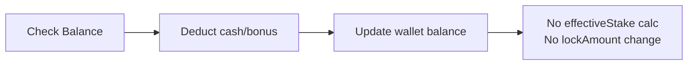

### 4.2 結算 - 贏

**來源**: `GridService.result()`（第 125-143 行）

```yaml
Before:     { cash: 900, lockAmount: 500, effectiveStake: 0 }
Settlement: payout=180, effectiveStake=80
After:      { cash: 1080, lockAmount: 420, effectiveStake: 80 }
```

### 4.3 結算 - 輸

```yaml
Before:     { cash: 900, lockAmount: 500, effectiveStake: 0 }
Settlement: payout=0, effectiveStake=100
After:      { cash: 900, lockAmount: 400, effectiveStake: 100 }
```

### 4.4 取消

**來源**: `GridService.result()` with `TxType.CANCEL`（第 403-409 行）

```java
// Negate effective stake on cancel
wallet.addEffectiveStake(bet.getEffectiveStake().negate());
// lockAmount += |effectiveStake| (since effectiveStake delta is negative)
```

```yaml
Before (settled): { cash: 1080, lockAmount: 420, effectiveStake: 80 }
Cancel:           refund betAmount=100, effectiveStake=-80
After:            { cash: 980, lockAmount: 500, effectiveStake: 0 }
```

### 4.5 作廢

**來源**: `GridService.internalVoid()`（第 229-264 行）

```java
// Void: refund (betAmount - payout), negate effectiveStake
wallet.addEffectiveStake(tx.getEffectiveStake().negate());
```

```yaml
Before (settled): { cash: 1080, lockAmount: 420, effectiveStake: 80, payout: 180 }
Void:             refund (100-180)=-80, effectiveStake=-80
After:            { cash: 1000, lockAmount: 500, effectiveStake: 0 }
```

### 4.6 部分結算

**來源**: `GridService.singleBetMultipleResult()`（第 147-162、436-490 行）

- LockAmount 變化: **僅在狀態轉為 SETTLE 時**

```yaml
# First payout: status remains UNSETTLE
Payout: 50, effectiveStake: unchanged, lockAmount: unchanged

# Second payout: status transitions to SETTLE
Payout: 100 (cumulative 150), effectiveStake: 100, lockAmount -= 100
```

---

## 5. 情境演練

### 5.1 主錢包無 LockAmount

```yaml
# Initial
Main: { cash: 1000, lockAmount: 0, cleanAmount: 1000, effectiveStake: 0 }

# Step 1: Bet 100
Main: { cash: 900, lockAmount: 0, cleanAmount: 900, effectiveStake: 0 }

# Step 2a: Settle WIN (CASINO, payout=180, win=80)
#   effectiveStake = min(80, 100) = 80
#   lockAmount = GREATEST(0 - 80, 0) = 0
Main: { cash: 1080, lockAmount: 0, cleanAmount: 1080, effectiveStake: 80 }
```

### 5.2 優惠錢包 (wagerRequirement)

```yaml
# Initial
Promo: { cash: 100, bonus: 200, wagerRequirement: 1500, effectiveStake: 0 }

# Step 1: Bet 100
Promo: { cash: 0, bonus: 200, wagerRequirement: 1500, effectiveStake: 0 }

# Step 2: Settle WIN (payout=150, win=50)
#   effectiveStake = min(50, 100) = 50
Promo: { cash: 150, bonus: 200, wagerRequirement: 1500, effectiveStake: 50 }
# Remaining wager: 1500 - 50 = 1450
```

### 5.3 主錢包有 LockAmount

```yaml
# Initial (deposit bonus applied)
Main: { cash: 1000, lockAmount: 500, cleanAmount: 500, effectiveStake: 0 }

# Step 1: Bet 200
Main: { cash: 800, lockAmount: 500, cleanAmount: 300, effectiveStake: 0 }

# Step 2: Settle WIN (payout=300, win=100)
#   effectiveStake = min(100, 200) = 100
#   lockAmount = 500 - 100 = 400
Main: { cash: 1100, lockAmount: 400, cleanAmount: 700, effectiveStake: 100 }
```

### 5.4 跨錢包投注（Cash + Bonus）

```yaml
# Initial
Promo: { cash: 50, bonus: 300, wagerRequirement: 1000, effectiveStake: 0 }
Main:  { cash: 200, bonus: 0, lockAmount: 100, effectiveStake: 0 }

# Step 1: Bet 500
#   Promo deducts: cash=50 + bonus=300 = 350
#   Main deducts: cash=150 (remaining)
Promo: { cash: 0, bonus: 0 }
Main:  { cash: 50, lockAmount: 100, effectiveStake: 0 }

# Step 2: Settle WIN (payout=600, win=100, effectiveStake=100)
#   Payout routed to promo wallet (getBetResultWallet logic)
Promo: { cash: 600, bonus: 0, wagerRequirement: 1000, effectiveStake: 100 }
Main:  { cash: 50, lockAmount: 100, effectiveStake: 0 }
```

---

## 6. 返水有效投注額計算

**來源**: `GridAbstractService.getRebateEffectiveStake()`（第 194-238 行）

### 6.1 公式

```
Non-promotion bet:
  rebateEffectiveStake = effectiveStake

Promotion bet:
  totalRequirement = SUM(wagerRequirement - effectiveStake) + (openSts ? 0 : lockAmount)
  rebateEffectiveStake = MAX(0, effectiveStake - totalRequirement)
```

### 6.2 範例

**範例 1：優惠錢包有效投注額未完成**

```yaml
effectiveStake: 100
Promo wallet: { wagerRequirement: 1000, effectiveStake: 50 }  # remaining: 950
Main wallet:  { lockAmount: 200 }  # openSts = false
totalRequirement: 950 + 200 = 1150
rebateEffectiveStake: MAX(0, 100 - 1150) = 0  # no rebate
```

**範例 2：優惠錢包有效投注額已完成**

```yaml
effectiveStake: 100
Promo wallet: { wagerRequirement: 500, effectiveStake: 500 }  # remaining: 0
Main wallet:  { lockAmount: 0 }
totalRequirement: 0 + 0 = 0
rebateEffectiveStake: MAX(0, 100 - 0) = 100  # full rebate
```

### 6.3 系統配置

| 配置項 | 用途 |
|--------|------|
| `REBATE_BETTING_LOCKED` | 是否將 lockAmount 納入返水 totalRequirement 計算 |

---

## 7. 資料庫更新邏輯

### 7.1 PlayerWallet 更新 SQL

**來源**: `PlayerWalletServiceImpl.java`（第 69-86 行）

```sql
UPDATE player_wallet SET
    cash = ?,
    bonus = ?,
    clean_amount = GREATEST(clean_amount + ?, 0),
    lock_amount = GREATEST(lock_amount + ?, 0),
    effective_stake = ?
WHERE id = ?
```

關鍵限制：
- `cleanAmount` 和 `lockAmount` 使用 `GREATEST(..., 0)` 確保非負
- `effectiveStake` 設定為絕對值（非差額）
- `cash` 和 `bonus` 設定為絕對值

### 7.2 WalletTransaction 對 PlayerWallet 欄位對映

**來源**: `GridAbstractService.java`（第 75-114 行）

| WalletTransaction 欄位 | 資料庫更新模式 | 備註 |
|------------------------|----------------|------|
| `cleanAmount` | **差額** (+ 或 -) | 受 `GREATEST(..., 0)` 保護 |
| `lockAmount` | **差額** (+ 或 -) | 受 `GREATEST(..., 0)` 保護 |
| `effectiveStake` | **絕對值** | 直接設定 |
| `cash` | **絕對值** | 直接設定 |
| `bonus` | **絕對值** | 直接設定 |

---

## 8. 端對端演練：優惠錢包有效投注額完成

### 8.1 初始狀態

```yaml
Main: { cash: 500, bonus: 0, lockAmount: 0, cleanAmount: 500, effectiveStake: 0 }
```

### 8.2 步驟 1：申請優惠

玩家存款 200，獲得 100 獎金，有效投注額要求 = 5 倍（5 * 300 = 1500）。

```yaml
# Main wallet: deduct 200, add lockAmount 200 (PROMOTION type deduct)
Main:  { cash: 300, lockAmount: 200, cleanAmount: 100, effectiveStake: 0 }
# New promotion wallet created
Promo: { cash: 200, bonus: 100, wagerRequirement: 1500, effectiveStake: 0, isClosed: false }
```

### 8.3 步驟 2：投注 #1（優惠錢包）

```yaml
Bet: 150 from promo wallet
Promo: { cash: 50, bonus: 100, wagerRequirement: 1500, effectiveStake: 0 }
```

### 8.4 步驟 3：結算 #1

```yaml
Settlement: payout=200 (win 50), effectiveStake=100
Promo: { cash: 250, bonus: 100, wagerRequirement: 1500, effectiveStake: 100 }
# Remaining wager: 1400
```

### 8.5 步驟 4-15：持續投注

```yaml
# After multiple rounds of betting and settlement
Total bets placed: 2000
Total effectiveStake accumulated: 1500

Promo: { cash: 280, bonus: 120, wagerRequirement: 1500, effectiveStake: 1500 }
# Remaining wager: 0 (COMPLETE)
```

### 8.6 步驟 16：優惠錢包關閉與轉移

當 `effectiveStake >= wagerRequirement` 時，優惠錢包關閉並將餘額轉回主錢包。

```yaml
# Close promotion wallet
Promo: { isClosed: true, cash: 0, bonus: 0 }

# Transfer to main wallet, reduce lockAmount
Main: { cash: 700, lockAmount: 0, cleanAmount: 700, effectiveStake: 0 }
# lockAmount: 200 - 200 = 0 (wager requirement fulfilled)
```

---

## 9. 特殊情況

### 9.1 手續費 / 佣金處理

- 手續費記錄於 `Transaction.ante`（前置費）和 `Transaction.tip`（小費）
- 手續費**不影響** effectiveStake 計算
- 手續費會減少實際派彩金額

### 9.2 派彩錢包路由（跨錢包投注）

`getBetResultWallet` 方法決定派彩目的地：

```
Priority:
  1. Open (unclosed) promotion wallet -> payout to promotion wallet
  2. No open promotion wallet         -> payout to main wallet
```

effectiveStake **不會**按比例分配到各錢包；它會完整累加到接收派彩的錢包。

---

## 10. 流程圖：三層驗證架構

### 10.1 架構概覽

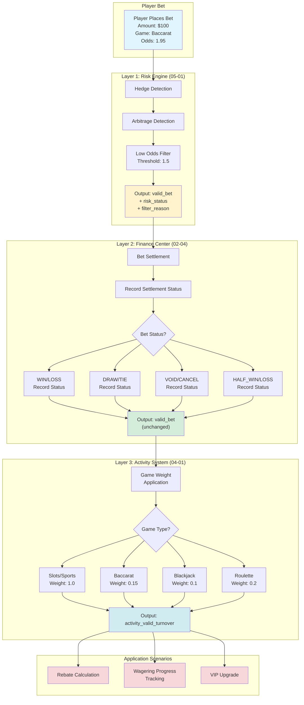

### 10.2 主流程圖

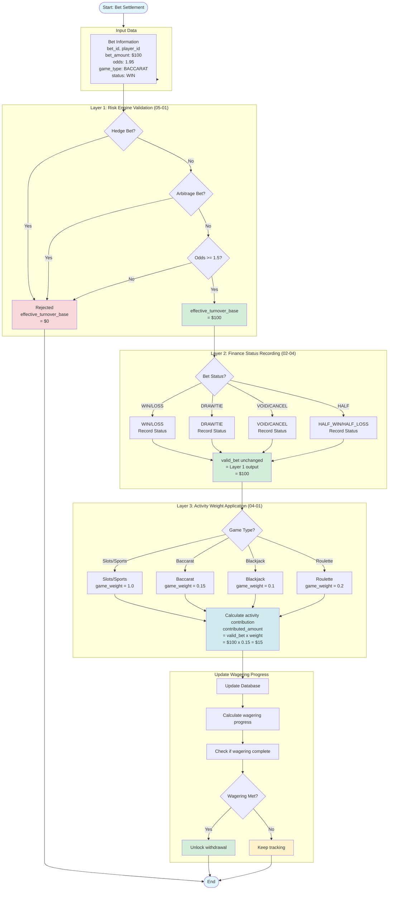

---

## 11. 流程圖：各層詳細流程

### 11.1 端對端時序圖

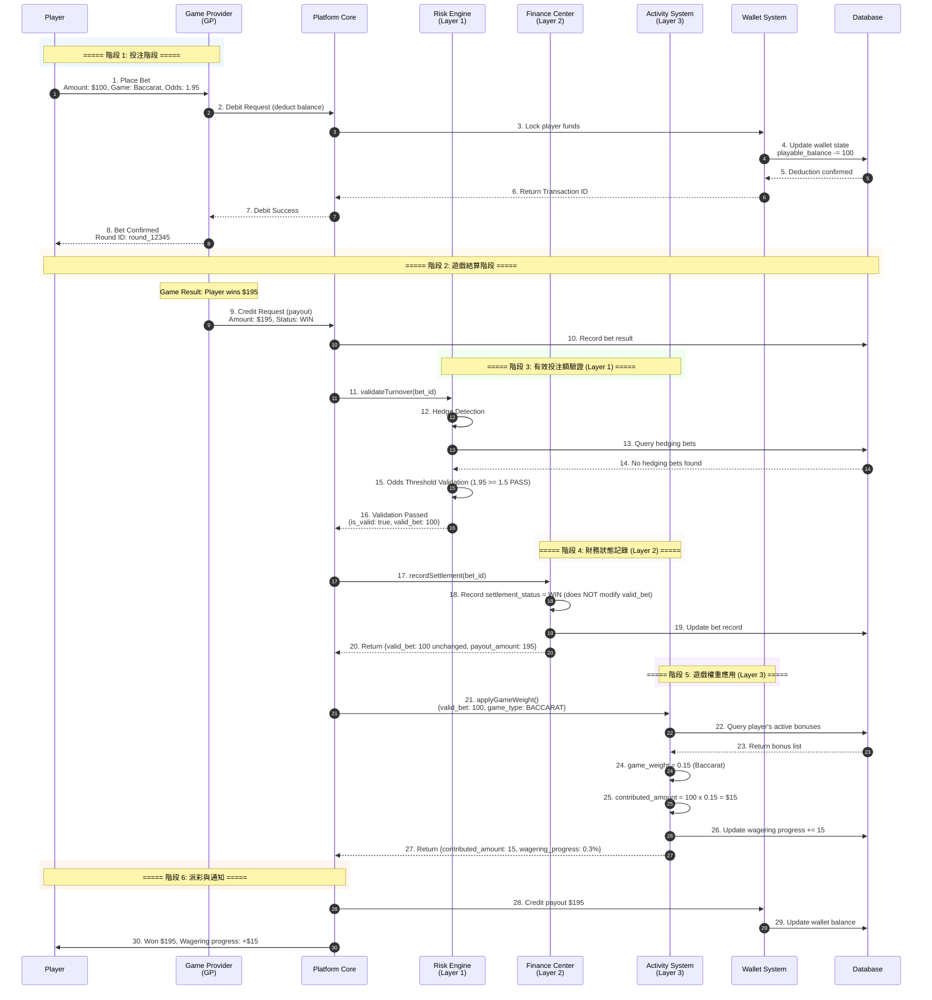

### 11.2 Layer 1：對沖偵測流程

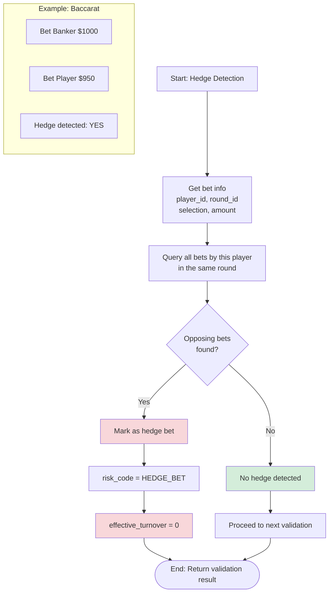

### 11.3 Layer 2：財務結算記錄流程

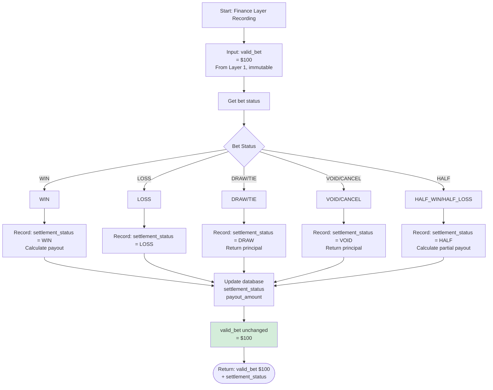

### 11.4 Layer 3：遊戲權重應用流程

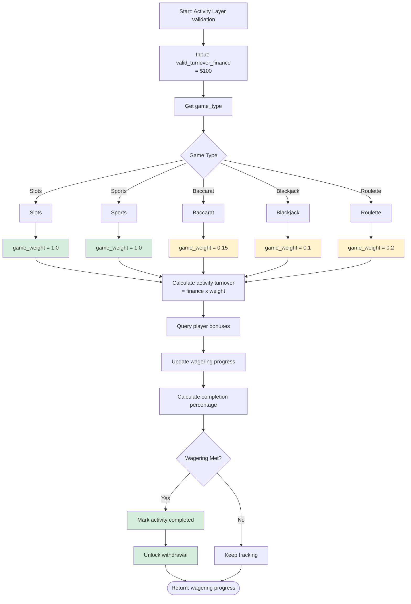

---

## 12. 流程圖：計算範例

### 12.1 範例 1：百家樂投注

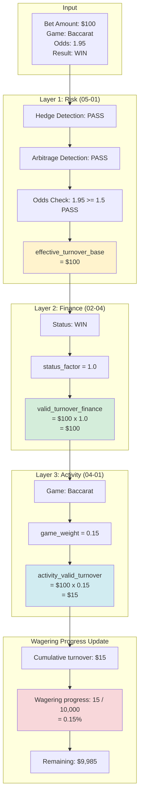

### 12.2 範例 2：老虎機投注

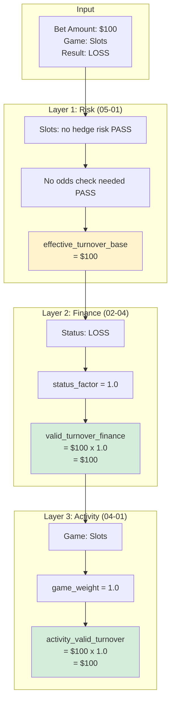

### 12.3 範例 3：對沖投注被拒絕

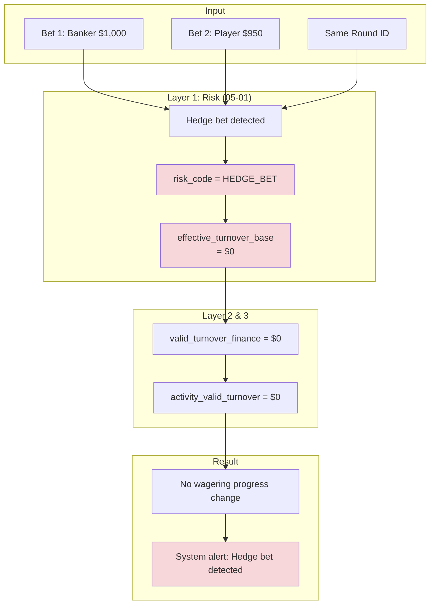

---

## 13. 投注生命週期狀態機

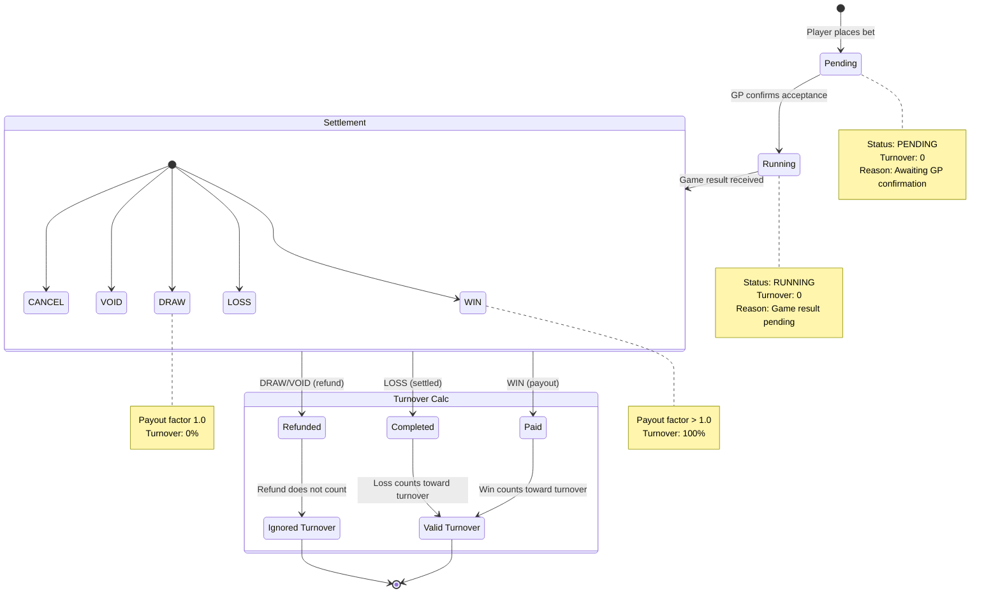

---

## 14. 風險標記機制

### 14.1 風險標記欄位定義

| 欄位 | 說明 | 範例值 |
|------|------|--------|
| `risk_status` | 風控結果 (PASSED/FILTERED/PENDING) | `FILTERED` |
| `filter_reason` | 拒絕原因（人類可讀） | `"Hedge bet: simultaneous Banker/Player bet"` |
| `risk_rules_applied` | 匹配的風控規則（JSON） | `[{"rule_id": "HEDGE_001", "action": "FILTER"}]` |
| `calculation_version` | 計算版本，支援重新計算 | `v1.2.0` |

### 14.2 計算版本歷史

| 版本 | 變更 | 生效日期 |
|------|------|----------|
| v1.0.0 | 初始版本，使用實際風險法 | 2026-01-01 |
| v1.1.0 | 修正為標準本金法 | 2026-01-28 |
| v1.2.0 | 調整賠率門檻 1.3 -> 1.5 | 2026-02-01 |

---

## 15. 設計原則：Layer 2 不修改 Valid Bet

> **關鍵設計決策**: Layer 2 (財務中心) 僅記錄結算狀態，**不修改** Layer 1 (風控引擎) 決定的 `valid_bet` 值。

**理由**：
1. **風控獨立性**: Layer 1 拒絕是最終決策，後續層不應推翻
2. **公平性原則**: 相同投注行為（相同本金風險）應產生相同 valid_bet，不論最終結果
3. **行業標準（標準本金法）**: Pinnacle、Betfair、Evolution Gaming 均使用此方法

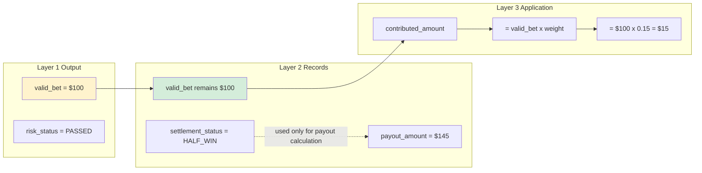

---

## 16. SmartAdmin 架構實作

### 16.1 GridService - 投注服務

```java
package net.lab1024.sa.business.game.grid.service;

import io.vavr.control.Option;
import lombok.RequiredArgsConstructor;
import net.lab1024.sa.business.game.grid.dao.TransactionDao;
import net.lab1024.sa.business.game.grid.domain.GameType;
import net.lab1024.sa.business.game.grid.entity.TransactionEntity;
import net.lab1024.sa.business.game.grid.manager.GridSettlementManager;
import org.springframework.stereotype.Service;

/**
 * 投注服務 - 有效投注額生命週期管理
 */
@Service
@RequiredArgsConstructor
public class GridService {

    private final TransactionDao transactionDao;
    private final GridSettlementManager settlementManager;
    private final GridAbstractService abstractService;

    /**
     * 投注下單（不計算有效投注額）
     */
    public Option<Long> bet(Long playerId, Long walletId, Long betAmount) {
        WalletTransaction tx = abstractService.deduct(playerId, walletId, betAmount);
        if (tx == null) {
            return Option.none();
        }
        TransactionEntity bet = new TransactionEntity();
        bet.setPlayerId(playerId);
        bet.setWalletId(walletId);
        bet.setBetAmount(betAmount);
        bet.setEffectiveStake(0L);
        bet.setStatus("UNSETTLE");
        transactionDao.insert(bet);
        return Option.of(bet.getId());
    }

    /**
     * 投注結算（計算有效投注額並更新 lockAmount）
     */
    public void result(Long transactionId, Long payout, GameType gameType) {
        TransactionEntity tx = transactionDao.selectById(transactionId);
        if (tx == null || !"UNSETTLE".equals(tx.getStatus())) {
            throw new IllegalStateException("Invalid transaction state");
        }
        long winAmount = payout - tx.getBetAmount();
        long lossAmount = (winAmount < 0) ? Math.abs(winAmount) : 0L;
        long effectiveStake = abstractService.getEffectiveStake(
            gameType, tx.getBetAmount(), winAmount, lossAmount
        );
        long rebateEffectiveStake = abstractService.getRebateEffectiveStake(
            tx.getPlayerId(), tx.getWalletId(), effectiveStake, tx.getIsPromotion()
        );
        settlementManager.settleTransaction(transactionId, payout, effectiveStake, rebateEffectiveStake);
    }

    /**
     * 投注取消（回復 effectiveStake 和 lockAmount）
     */
    public void cancel(Long transactionId) {
        TransactionEntity tx = transactionDao.selectById(transactionId);
        if (tx == null || !"SETTLE".equals(tx.getStatus())) {
            throw new IllegalStateException("Only settled bets can be cancelled");
        }
        settlementManager.cancelTransaction(transactionId);
    }
}
```

### 16.2 GridSettlementManager - 結算管理器（事務邊界）

```java
package net.lab1024.sa.business.game.grid.manager;

import lombok.RequiredArgsConstructor;
import net.lab1024.sa.business.finance.wallet.dao.PlayerWalletDao;
import net.lab1024.sa.business.finance.wallet.entity.PlayerWalletEntity;
import net.lab1024.sa.business.game.grid.dao.TransactionDao;
import net.lab1024.sa.business.game.grid.entity.TransactionEntity;
import org.springframework.stereotype.Component;
import org.springframework.transaction.annotation.Transactional;

/**
 * 投注結算管理器 - 處理跨錢包有效投注額更新
 */
@Component
@RequiredArgsConstructor
public class GridSettlementManager {

    private final TransactionDao transactionDao;
    private final PlayerWalletDao walletDao;

    /**
     * 結算交易並更新有效投注額（事務邊界）
     */
    @Transactional(rollbackFor = Throwable.class)
    public void settleTransaction(Long txId, Long payout, Long effectiveStake, Long rebateEffectiveStake) {
        TransactionEntity tx = transactionDao.selectById(txId);
        tx.setPayout(payout);
        tx.setEffectiveStake(effectiveStake);
        tx.setRebateEffectiveStake(rebateEffectiveStake);
        tx.setStatus("SETTLE");
        transactionDao.updateById(tx);

        PlayerWalletEntity wallet = walletDao.selectById(tx.getWalletId());
        long newEffectiveStake = wallet.getEffectiveStake() + effectiveStake;
        long newLockAmount = Math.max(0L, wallet.getLockAmount() - effectiveStake);
        long newCash = wallet.getCash() + payout;

        walletDao.updateSettlement(wallet.getId(), newCash, newEffectiveStake, newLockAmount);
    }

    /**
     * 取消交易並回復有效投注額
     */
    @Transactional(rollbackFor = Throwable.class)
    public void cancelTransaction(Long txId) {
        TransactionEntity tx = transactionDao.selectById(txId);

        PlayerWalletEntity wallet = walletDao.selectById(tx.getWalletId());
        long newEffectiveStake = wallet.getEffectiveStake() - tx.getEffectiveStake();
        long newLockAmount = wallet.getLockAmount() + tx.getEffectiveStake();
        long newCash = wallet.getCash() - tx.getPayout() + tx.getBetAmount();

        walletDao.updateSettlement(wallet.getId(), newCash, newEffectiveStake, newLockAmount);

        tx.setStatus("CANCELLED");
        transactionDao.updateById(tx);
    }
}
```

### 16.3 GridAbstractService - 共享計算邏輯

```java
package net.lab1024.sa.business.game.grid.service;

import lombok.RequiredArgsConstructor;
import net.lab1024.sa.business.finance.wallet.dao.PlayerWalletDao;
import net.lab1024.sa.business.finance.wallet.entity.PlayerWalletEntity;
import net.lab1024.sa.business.game.grid.domain.GameType;
import org.springframework.stereotype.Service;

import java.util.List;

/**
 * 遊戲抽象服務 - 有效投注額計算核心邏輯（無狀態）
 */
@Service
@RequiredArgsConstructor
public class GridAbstractService {

    private final PlayerWalletDao walletDao;

    /**
     * 依遊戲類型計算有效投注額
     */
    protected long getEffectiveStake(GameType gameType, long betAmount, long winAmount, long lossAmount) {
        return switch (gameType) {
            case SPORTS, E_SPORTS -> Math.abs(winAmount + lossAmount);
            case CASINO -> {
                long payout = betAmount + winAmount;
                if (payout == betAmount) yield 0L;  // 和局
                else if (winAmount > 0) yield Math.min(winAmount, betAmount); // 贏
                else yield betAmount;  // 輸
            }
            default -> betAmount;
        };
    }

    /**
     * 計算返水有效投注額（促銷投注需扣除剩餘要求）
     */
    protected long getRebateEffectiveStake(Long playerId, Long walletId, long effectiveStake, Boolean isPromotion) {
        if (!isPromotion) {
            return effectiveStake;
        }
        PlayerWalletEntity mainWallet = walletDao.selectMainWallet(playerId);
        List<PlayerWalletEntity> promoWallets = walletDao.selectActivePromotionWallets(playerId);

        long totalRequirement = mainWallet.getLockAmount();
        for (PlayerWalletEntity promo : promoWallets) {
            totalRequirement += Math.max(0L, promo.getWagerRequirement() - promo.getEffectiveStake());
        }
        return Math.max(0L, effectiveStake - totalRequirement);
    }
}
```

---

## 17. 資料庫 Schema

### 17.1 t_player_wallet - 玩家錢包表

```sql
CREATE TABLE t_player_wallet (
    id BIGINT PRIMARY KEY AUTO_INCREMENT,
    tenant_id BIGINT NOT NULL,
    player_id BIGINT NOT NULL,
    wallet_type VARCHAR(20) NOT NULL COMMENT 'MAIN, PROMOTION',
    cash BIGINT NOT NULL DEFAULT 0 COMMENT '現金餘額（分）',
    bonus BIGINT NOT NULL DEFAULT 0 COMMENT '獎金餘額（分）',
    clean_amount BIGINT NOT NULL DEFAULT 0 COMMENT '可提領金額 = cash - lockAmount',
    lock_amount BIGINT NOT NULL DEFAULT 0 COMMENT '鎖定金額（僅主錢包）',
    effective_stake BIGINT NOT NULL DEFAULT 0 COMMENT '累計有效投注額',
    wager_requirement BIGINT COMMENT '有效投注額要求（僅促銷錢包）',
    promotion_id BIGINT COMMENT '促銷活動 ID（僅促銷錢包）',
    is_closed BOOLEAN NOT NULL DEFAULT FALSE COMMENT '促銷錢包是否已關閉',
    created_at TIMESTAMP NOT NULL DEFAULT CURRENT_TIMESTAMP,
    updated_at TIMESTAMP NOT NULL DEFAULT CURRENT_TIMESTAMP ON UPDATE CURRENT_TIMESTAMP,
    deleted BOOLEAN NOT NULL DEFAULT FALSE,

    INDEX idx_player_type (player_id, wallet_type),
    INDEX idx_tenant_player (tenant_id, player_id),
    INDEX idx_promotion (promotion_id)
) COMMENT '玩家錢包表';
```

### 17.2 t_transaction - 投注交易表

```sql
CREATE TABLE t_transaction (
    id BIGINT PRIMARY KEY AUTO_INCREMENT,
    tenant_id BIGINT NOT NULL,
    player_id BIGINT NOT NULL,
    wallet_id BIGINT NOT NULL,
    game_provider VARCHAR(50) NOT NULL COMMENT '遊戲供應商',
    game_type VARCHAR(20) NOT NULL COMMENT 'SPORTS, CASINO, E_SPORTS, SLOTS',
    bet_amount BIGINT NOT NULL COMMENT '投注金額（分）',
    payout BIGINT COMMENT '派彩金額（分，結算後填寫）',
    effective_stake BIGINT NOT NULL DEFAULT 0 COMMENT '有效投注額（結算後計算）',
    rebate_effective_stake BIGINT NOT NULL DEFAULT 0 COMMENT '返水有效投注額',
    is_promotion BOOLEAN NOT NULL DEFAULT FALSE COMMENT '是否為促銷投注',
    ante BIGINT NOT NULL DEFAULT 0 COMMENT '前置手續費（分）',
    tip BIGINT NOT NULL DEFAULT 0 COMMENT '小費（分）',
    external_bet_id VARCHAR(100) COMMENT '外部投注 ID（遊戲供應商）',
    status VARCHAR(20) NOT NULL DEFAULT 'UNSETTLE' COMMENT 'UNSETTLE, SETTLE, CANCELLED, VOIDED',
    created_at TIMESTAMP NOT NULL DEFAULT CURRENT_TIMESTAMP,
    updated_at TIMESTAMP NOT NULL DEFAULT CURRENT_TIMESTAMP ON UPDATE CURRENT_TIMESTAMP,
    deleted BOOLEAN NOT NULL DEFAULT FALSE,

    INDEX idx_player_status (player_id, status),
    INDEX idx_wallet_time (wallet_id, created_at),
    INDEX idx_external_id (external_bet_id),
    INDEX idx_tenant (tenant_id)
) COMMENT '投注交易表';
```

### 17.3 t_wagering_progress - 有效投注額進度表

```sql
CREATE TABLE t_wagering_progress (
    id BIGSERIAL PRIMARY KEY,
    tenant_id BIGINT NOT NULL,
    player_id BIGINT NOT NULL,
    bonus_id BIGINT NOT NULL,
    wagering_requirement DECIMAL(18, 4) NOT NULL,
    wagering_completed DECIMAL(18, 4) NOT NULL DEFAULT 0,
    progress_percentage DECIMAL(5, 2) NOT NULL DEFAULT 0,
    status VARCHAR(20) NOT NULL DEFAULT 'ACTIVE',
    completed_at TIMESTAMP,
    created_at TIMESTAMP NOT NULL DEFAULT NOW(),
    updated_at TIMESTAMP NOT NULL DEFAULT NOW(),
    CONSTRAINT uk_wagering_progress UNIQUE (tenant_id, player_id, bonus_id)
);

CREATE INDEX idx_wagering_player ON t_wagering_progress(tenant_id, player_id, status);
CREATE INDEX idx_wagering_status ON t_wagering_progress(tenant_id, status, updated_at DESC)
    WHERE status = 'ACTIVE';
```

---

## 18. 方法參考索引

| 方法 | 來源:行號 | 用途 |
|------|-----------|------|
| `bet(Transaction bet)` | GridService.java:65-84 | 投注下單 |
| `result(Transaction tx, Transaction originBet)` | GridService.java:125-143 | 投注結算 |
| `internalVoid(Transaction tx)` | GridService.java:229-264 | 投注作廢 |
| `rollback(Transaction rollback, Transaction bet)` | GridService.java:164-208 | 投注回滾 |
| `singleBetMultipleResult()` | GridService.java:147-162, 436-490 | 部分結算 |
| `deduct(...)` | GridAbstractService.java:116-168 | 錢包扣款 |
| `getEffectiveStake(...)` | GridAbstractService.java:170-192 | 有效投注額計算 |
| `getRebateEffectiveStake(...)` | GridAbstractService.java:194-238 | 返水有效投注額計算 |
| `addEffectiveStake(BigDecimal)` | WalletTransaction.java:119-125 | 累加有效投注額，調整 lockAmount |
| `updateWallets(...)` | GridAbstractService.java:75-114 | 將錢包變更持久化到資料庫 |
| `promotionApply(...)` | PromotionService.java:69-136 | 優惠申請 |
| `promotionApprove(...)` | PromotionService.java:139-224 | 優惠核准 |
| `deposit(...)` | WalletTransactionService.java:62-101 | 存款處理 |

---

## 19. 業務規則摘要（技術參考）

### 19.1 LockAmount 規則

| 規則 | 說明 |
|------|------|
| **產生** | 主錢包收到 DEPOSIT、PROMOTION、VIP、RED_ENVELOPES 資金時增加 |
| **減少** | 結算時 `lockAmount -= effectiveStake` |
| **回復** | 取消/作廢時 `lockAmount += effectiveStake` |
| **下限** | `GREATEST(lock_amount + delta, 0)` — 永不低於零 |
| **提款** | 可提款金額 = `cash - lockAmount`（即 `cleanAmount`）|

### 19.2 EffectiveStake 規則

| 規則 | 說明 |
|------|------|
| **計算時機** | 僅在結算時計算，投注下單時不計算 |
| **體育博彩** | `|winAmount + lossAmount|` |
| **賭場（和局）** | `0` |
| **賭場（贏）** | `min(winAmount, betAmount)` |
| **賭場（輸）** | `betAmount` |
| **其他** | `betAmount` |
| **累加** | 結算時 `effectiveStake += calculated_value` |
| **回復** | 取消時 `effectiveStake -= original_value` |

### 19.3 返水規則

| 規則 | 說明 |
|------|------|
| **非優惠投注** | `rebateEffectiveStake = effectiveStake` |
| **優惠投注** | `rebateEffectiveStake = MAX(0, effectiveStake - totalRequirement)` |
| **totalRequirement** | `SUM(wagerReq - effectiveStake) + (openSts ? 0 : lockAmount)` |
| **配置** | `REBATE_BETTING_LOCKED` 控制是否納入 lockAmount |

---

**文件版本**: 2.0.0（合併自 10 v1.0.0 + 11 v4.0.0）
**最後更新**: 2026-03-31
**維護團隊**: 財務團隊 & 後端團隊
