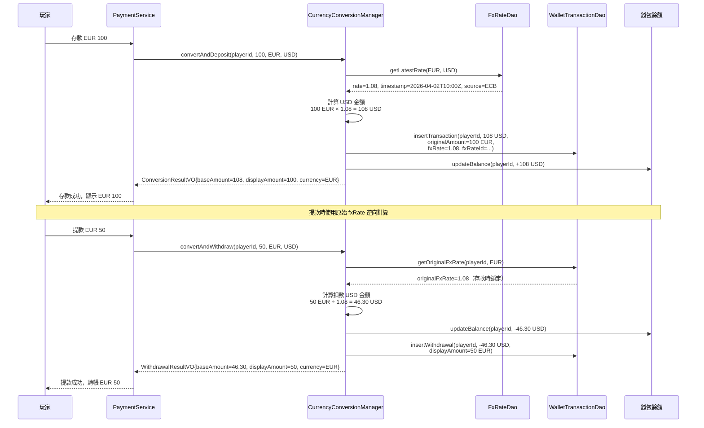
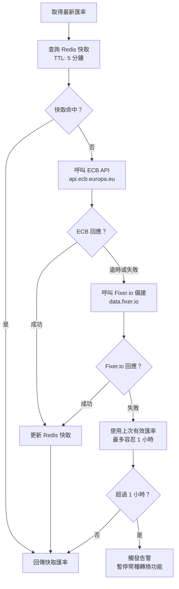

# 多幣種兌換管理架構（Multi-Currency Exchange Management Architecture）

> **XREF（交叉引用）**: 業務需求詳見 [財務實作需求](../../requirements/02_Financial_Operations/02_Financial_Implementation_Requirements.md)
> **目標讀者**: 系統架構師、後端開發人員
> **最後更新**: 2026-04-02

---

## 1. 概述

多幣種兌換管理架構支援玩家以本地貨幣（如 EUR、GBP、HKD）進行存提款操作，系統內部統一以基準貨幣（Base Currency，通常為 USD）儲存餘額，並在顯示層動態轉換為玩家偏好的顯示貨幣。

核心設計原則：

- **存款時鎖定匯率（Rate-Lock at Deposit）**: 存款時記錄當下的外匯（FX）匯率，提款時依原始匯率計算，避免匯率波動導致的玩家損失
- **PCI DSS 4.0 Req 3.5 合規**: 持卡人貨幣（cardholder currency）記錄需加密保護，防止未授權存取
- **多匯率來源容錯**: 主要來源（ECB）失效時自動切換備援來源（Fixer.io）
- **原子化轉換**: 所有幣種轉換與錢包記帳操作在單一 `@Transactional` 內完成

---

## 2. 幣種轉換流程



---

## 3. FX 匯率 API 合約

### 3.1 匯率資料模型

| 欄位 | 類型 | 說明 |
|------|------|------|
| `fx_rate_id` | BIGINT | 主鍵，唯一識別碼 |
| `from_currency` | VARCHAR(3) | 來源幣種（ISO 4217，如 EUR） |
| `to_currency` | VARCHAR(3) | 目標幣種（如 USD） |
| `rate` | DECIMAL(18,8) | 匯率（8 位小數精度） |
| `rate_timestamp` | TIMESTAMP WITH TIME ZONE | 匯率報價時間（UTC） |
| `source` | VARCHAR(50) | 匯率來源（ECB / FIXER_IO / MANUAL） |
| `valid_from` | TIMESTAMP WITH TIME ZONE | 此匯率生效時間 |
| `valid_until` | TIMESTAMP WITH TIME ZONE | 此匯率到期時間（NULL 表示仍有效） |
| `deleted` | SMALLINT | 軟刪除標記（0=有效，1=已刪除） |

### 3.2 支援幣種清單

| 幣種代碼 | 幣種名稱 | 主要市場 |
|---------|---------|---------|
| USD | 美元 | 基準幣種（Base Currency） |
| EUR | 歐元 | 歐盟市場 |
| GBP | 英鎊 | 英國市場（UKGC 監管） |
| HKD | 港元 | 香港市場 |
| JPY | 日圓 | 日本市場 |
| MYR | 馬來西亞令吉 | 東南亞市場 |
| THB | 泰銖 | 泰國市場 |
| VND | 越南盾 | 越南市場 |

### 3.3 匯率來源容錯策略



---

## 4. CurrencyConversionManager 實作

```java
/**
 * 多幣種兌換管理器
 * 負責 FX 匯率查詢、幣種轉換計算及錢包記帳的原子化執行
 * 所有轉換操作必須在 Manager 層以 @Transactional 執行，確保金融資料一致性
 */
@Component
@RequiredArgsConstructor
public class CurrencyConversionManager {

    private final FxRateDao fxRateDao;
    private final WalletTransactionDao walletTransactionDao;
    private final PlayerWalletDao playerWalletDao;
    private final FxRateProviderService fxRateProviderService;

    /**
     * 外幣存款轉換（存款時鎖定匯率）
     *
     * @param playerId     玩家 ID
     * @param amount       存款金額（以 fromCurrency 計）
     * @param fromCurrency 玩家存款幣種（如 EUR）
     * @param baseCurrency 系統基準幣種（如 USD）
     */
    @Transactional(rollbackFor = Throwable.class)
    public Option<ConversionResultVO> convertAndDeposit(
            Long playerId,
            BigDecimal amount,
            String fromCurrency,
            String baseCurrency) {

        if (fromCurrency.equals(baseCurrency)) {
            // 同幣種直接記帳，無需轉換
            return depositInBaseCurrency(playerId, amount, baseCurrency);
        }

        // 1. 取得最新 FX 匯率（含來源記錄，符合 PCI DSS 4.0 Req 3.5）
        Option<FxRateEntity> rateOpt = Option.of(fxRateDao.getLatestRate(fromCurrency, baseCurrency));
        if (rateOpt.isEmpty()) {
            return Option.none();
        }
        FxRateEntity fxRate = rateOpt.get();

        // 2. 計算基準幣種金額（8 位小數精度，避免浮點誤差）
        BigDecimal baseAmount = amount.multiply(fxRate.getRate())
                                      .setScale(8, RoundingMode.HALF_UP);

        // 3. 建立錢包交易記錄（記錄原始幣種金額及鎖定匯率）
        WalletTransactionEntity transaction = new WalletTransactionEntity();
        transaction.setPlayerId(playerId);
        transaction.setTransactionType(TransactionType.DEPOSIT);
        transaction.setBaseAmount(baseAmount);
        transaction.setBaseCurrency(baseCurrency);
        transaction.setOriginalAmount(amount);
        transaction.setOriginalCurrency(fromCurrency);
        transaction.setFxRateId(fxRate.getFxRateId());
        transaction.setFxRate(fxRate.getRate());
        transaction.setFxRateTimestamp(fxRate.getRateTimestamp());
        transaction.setDeleted(false);
        walletTransactionDao.insert(transaction);

        // 4. 更新玩家錢包餘額
        playerWalletDao.increaseBalance(playerId, baseAmount);

        // 5. 建立回傳值
        ConversionResultVO result = new ConversionResultVO();
        result.setPlayerId(playerId);
        result.setBaseAmount(baseAmount);
        result.setBaseCurrency(baseCurrency);
        result.setDisplayAmount(amount);
        result.setDisplayCurrency(fromCurrency);
        result.setFxRate(fxRate.getRate());
        result.setFxRateSource(fxRate.getSource());
        return Option.of(result);
    }

    /**
     * 外幣提款轉換（使用存款時鎖定的匯率逆向計算）
     */
    @Transactional(rollbackFor = Throwable.class)
    public Option<ConversionResultVO> convertAndWithdraw(
            Long playerId,
            BigDecimal withdrawAmount,
            String toCurrency,
            String baseCurrency) {

        // 取得玩家最近存款的鎖定匯率
        Option<BigDecimal> lockedRateOpt = Option.of(
            walletTransactionDao.getLockedFxRate(playerId, toCurrency)
        );
        if (lockedRateOpt.isEmpty()) {
            return Option.none();
        }

        BigDecimal lockedRate = lockedRateOpt.get();
        BigDecimal baseDeductAmount = withdrawAmount.divide(lockedRate, 8, RoundingMode.HALF_UP);

        WalletTransactionEntity transaction = new WalletTransactionEntity();
        transaction.setPlayerId(playerId);
        transaction.setTransactionType(TransactionType.WITHDRAWAL);
        transaction.setBaseAmount(baseDeductAmount.negate());
        transaction.setBaseCurrency(baseCurrency);
        transaction.setOriginalAmount(withdrawAmount.negate());
        transaction.setOriginalCurrency(toCurrency);
        transaction.setFxRate(lockedRate);
        transaction.setDeleted(false);
        walletTransactionDao.insert(transaction);

        playerWalletDao.decreaseBalance(playerId, baseDeductAmount);

        ConversionResultVO result = new ConversionResultVO();
        result.setPlayerId(playerId);
        result.setBaseAmount(baseDeductAmount);
        result.setDisplayAmount(withdrawAmount);
        result.setDisplayCurrency(toCurrency);
        result.setFxRate(lockedRate);
        return Option.of(result);
    }

    private Option<ConversionResultVO> depositInBaseCurrency(Long playerId, BigDecimal amount, String currency) {
        WalletTransactionEntity transaction = new WalletTransactionEntity();
        transaction.setPlayerId(playerId);
        transaction.setTransactionType(TransactionType.DEPOSIT);
        transaction.setBaseAmount(amount);
        transaction.setBaseCurrency(currency);
        transaction.setOriginalAmount(amount);
        transaction.setOriginalCurrency(currency);
        transaction.setDeleted(false);
        walletTransactionDao.insert(transaction);
        playerWalletDao.increaseBalance(playerId, amount);

        ConversionResultVO result = new ConversionResultVO();
        result.setPlayerId(playerId);
        result.setBaseAmount(amount);
        result.setDisplayAmount(amount);
        result.setDisplayCurrency(currency);
        result.setFxRate(BigDecimal.ONE);
        return Option.of(result);
    }
}
```

---

## 5. 合規要求對應

| 法規 | 條款 | 要求 | 系統實作 |
|------|------|------|---------|
| PCI DSS 4.0 | Req 3.5 | 持卡人貨幣資料加密保護 | `original_currency` 欄位加密儲存 |
| PCI DSS 4.0 | Req 10.3 | 記錄所有存取持卡人資料的操作 | `WalletTransactionDao` 完整稽核日誌 |
| MGA Financial | Art. 4 | 多幣種錢包管理規範 | 基準幣種統一記帳 + 顯示幣種轉換 |
| MGA Financial | Art. 4.2 | 匯率記錄保存義務 | `fx_rate_id` 關聯追蹤每筆交易匯率 |
| UKGC LCCP | Condition 8 | 財務記錄完整性 | 存款時鎖定匯率，防止事後篡改 |
| GDPR | Art. 25 | 設計階段隱私保護 | 持卡人資料最小化儲存原則 |

---

## 6. 相關文件 XREF

- **業務需求**: [財務實作需求](../../requirements/02_Financial_Operations/02_Financial_Implementation_Requirements.md)
- **無縫錢包架構**: [Seamless Wallet 分析](02_Seamless_Wallet_Analysis.md)
- **支付閘道技術規格**: [支付閘道技術](06_Payment_Gateway_Technical.md)
- **財務對帳架構**: [對帳技術規格](07_Reconciliation_Technical.md)
- **有效投注額計算**: [Turnover 架構](08_Turnover_Architecture.md)
