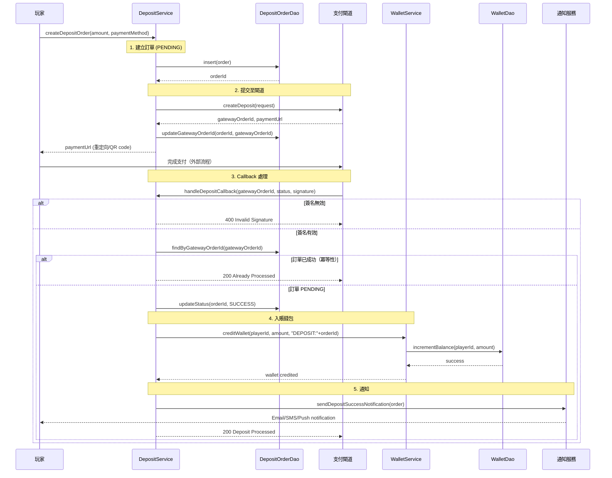

# 金融實作架構（Financial Implementation Architecture）

> **Canonical Source**: [source-archive/00_Foundation/guides/00-11_Financial_Implementation.md](../../source-archive/00_Foundation/guides/00-11_Financial_Implementation.md)
> **目標讀者（Audience）**: 架構師、後端開發人員、系統整合工程師
> **業務需求（Business Requirements）**: [Financial_Implementation_Requirements.md](../../requirements/02_Financial_Operations/Financial_Implementation_Requirements.md)
> **最後同步（Last Synced）**: 2026-02-09
>
> **技術焦點（Technical Focus）**: 本文件包含從需求層提取的實作細節（原子性 (Atomicity)、冪等性 (Idempotency)、HMAC-SHA256 演算法、SAGA 補償流程）。

---

## 1. 文件目的

本文件提供 iGaming 平台核心金融流程的**技術架構與實作指南**，包括錢包系統、支付閘道整合、提款風控與對帳系統。

**目標讀者**：
- 後端開發人員（金融模組）
- Full-Stack 開發人員
- 系統整合工程師

**實作順序**：
1. 錢包系統 → 支付閘道 → 提款風控 → 對帳系統
2. 每項任務包含：閱讀順序、實作步驟、驗證檢查表、常見陷阱
3. 遵循 SmartAdmin 架構模式（Entity、Manager、Service）

---

## 2. 錢包系統實作

> **MGA 資金隔離要求**: 錢包系統中的玩家餘額在財務層面必須與營運資金隔離（MGA Player Protection Directive 2018）。`t_wallet` 記錄的 `balance` 代表玩家應得資金，對應銀行端的獨立信託帳戶。資金隔離審計程序的完整設計需獨立文件規劃。

### 2.1 資料庫 Schema

```sql
-- Wallet master table
CREATE TABLE t_wallet (
    wallet_id BIGINT PRIMARY KEY,
    player_id BIGINT NOT NULL,
    tenant_id VARCHAR(50) NOT NULL,
    wallet_type VARCHAR(20) NOT NULL, -- CASH, BONUS, LOCKED
    balance DECIMAL(19,4) NOT NULL DEFAULT 0.0000,
    locked_amount DECIMAL(19,4) NOT NULL DEFAULT 0.0000,
    version INT NOT NULL DEFAULT 0, -- Optimistic lock
    created_at TIMESTAMP NOT NULL,
    updated_at TIMESTAMP NOT NULL,
    UNIQUE(player_id, wallet_type),
    INDEX idx_player_tenant (player_id, tenant_id)
);

-- Wallet transaction records
CREATE TABLE t_wallet_transaction (
    transaction_id BIGINT PRIMARY KEY,
    wallet_id BIGINT NOT NULL,
    transaction_type VARCHAR(20) NOT NULL, -- DEPOSIT, WITHDRAW, BET, WIN
    amount DECIMAL(19,4) NOT NULL,
    balance_before DECIMAL(19,4) NOT NULL,
    balance_after DECIMAL(19,4) NOT NULL,
    request_id VARCHAR(64) UNIQUE NOT NULL, -- Idempotency
    created_at TIMESTAMP NOT NULL,
    INDEX idx_wallet_time (wallet_id, created_at)
);

-- Wallet lock records
CREATE TABLE t_wallet_lock (
    lock_id BIGINT PRIMARY KEY,
    wallet_id BIGINT NOT NULL,
    lock_amount DECIMAL(19,4) NOT NULL,
    lock_reason VARCHAR(50) NOT NULL, -- BET_PENDING, WITHDRAWAL_PENDING
    reference_id VARCHAR(64) NOT NULL, -- Associated bet/withdrawal order
    created_at TIMESTAMP NOT NULL,
    INDEX idx_wallet_ref (wallet_id, reference_id)
);
```

> **鎖定金額雙軌設計說明**：
> - `t_wallet.locked_amount` 為**彙總欄位**，代表該錢包所有未釋放鎖定的總額
> - `t_wallet_lock` 為**明細表**，記錄每筆鎖定的原因、金額和關聯訂單
> - **一致性保證**：`t_wallet.locked_amount = SUM(t_wallet_lock.lock_amount WHERE wallet_id = ?)`
> - **更新機制**：每次 `lockWalletAmount()` / `unlockWalletAmount()` 在同一 `@Transactional` 中同步更新兩者（參見 Section 2.4）
> - **設計理由**：彙總欄位提供 O(1) 餘額查詢效能，明細表提供完整審計軌跡

### 2.2 即時投注可用餘額計算（Betting Available Balance）

> **公式上下文**：此公式僅適用於即時投注扣款（現金錢包）。前台顯示用的錢包總覽餘額（含紅利、信用額度）見 → [Data_Model.md Section 5.2](../00_Overview/Data_Model.md)

```java
/**
 * 計算即時投注可用餘額
 *
 * 公式：可用餘額 = 現金錢包餘額 - 鎖定金額 - 待結算投注
 *
 * @param playerId 玩家 ID
 * @param tenantId 租戶 ID
 * @return 可下注餘額
 */
public BigDecimal calculateAvailableBalance(Long playerId, String tenantId) {
    // 1. 查詢現金錢包
    Wallet cashWallet = walletDao.findByPlayerAndType(
        playerId,
        WalletType.CASH
    );

    if (cashWallet == null) {
        return BigDecimal.ZERO;
    }

    // 2. 套用公式
    BigDecimal availableBalance = cashWallet.getBalance()
        .subtract(cashWallet.getLockedAmount())
        .subtract(calculatePendingBets(playerId));

    // 3. 最小值為零
    return availableBalance.max(BigDecimal.ZERO);
}

/**
 * 計算待結算投注金額
 */
private BigDecimal calculatePendingBets(Long playerId) {
    return betDao.sumPendingBetAmount(playerId);
}
```

### 2.3 並發安全的餘額扣減（Redis Lua）

> **SmartAdmin 架構對齊**: 此操作涉及 Redis 分佈式操作 + DB 持久化，依據 SmartAdmin 架構規則必須放置於 **Manager 層**（參見 [F04-architecture-rules](../../../../.agent/rules/foundation/F04-architecture-rules.md)）。
> **合規標準**: PCI-DSS v4 Req 6.2.1（安全開發生命週期）— 金融交易邏輯必須遵循分層架構設計原則。
> **鎖順序協議**: 涉及多資源鎖定時，必須遵循 [Seamless_Wallet_Technical.md Section 5.3 鎖順序協議](Seamless_Wallet_Technical.md#53-鎖順序協議lock-ordering-protocol)，確保一致的鎖定取得順序（Wallet → Transaction → Lock），避免死鎖。

```java
/**
 * 錢包 Manager — 負責分佈式鎖協調與交易持久化
 *
 * SmartAdmin 架構規則：
 * - @Transactional 僅限 Manager 層
 * - 分佈式鎖操作（Redis Lua）由 Manager 協調
 * - Service 層透過呼叫此 Manager 完成扣款
 */
@Component
@RequiredArgsConstructor
@Slf4j
public class WalletManager {

    private final StringRedisTemplate redisTemplate;
    private final WalletDao walletDao;
    private final WalletTransactionDao walletTransactionDao;

    /**
     * 扣減錢包餘額（原子操作）
     *
     * 使用 Redis Lua script 保證原子性，同步持久化至 DB
     * ISO 27001 A.14.2: 安全設計原則 — 交易完整性保證
     *
     * @param request 扣款請求
     * @return 扣款結果
     */
    @Transactional(rollbackFor = Throwable.class)
    public DebitResult debitWallet(DebitRequest request) {
        String requestId = request.getRequestId();
        Long walletId = request.getWalletId();
        BigDecimal amount = request.getAmount();

        // 1. 冪等性檢查（Redis 快速路徑）
        String cacheKey = "wallet:debit:" + requestId;
        DebitResult cachedResult = redisTemplate.opsForValue().get(cacheKey);
        if (cachedResult != null) {
            log.info("Request {} already processed (cached)", requestId);
            return cachedResult;
        }

        // 2. 執行 Lua script 進行 Redis 餘額扣減
        String luaScript = """
            local wallet_key = KEYS[1]
            local amount = tonumber(ARGV[1])

            -- Check balance
            local balance = tonumber(redis.call('HGET', wallet_key, 'balance'))
            if balance < amount then
                return 'INSUFFICIENT_BALANCE'
            end

            -- Atomic deduction
            redis.call('HINCRBYFLOAT', wallet_key, 'balance', -amount)
            return 'SUCCESS'
            """;

        String walletKey = "wallet:" + walletId;
        String result = redisTemplate.execute(
            RedisScript.of(luaScript, String.class),
            Collections.singletonList(walletKey),
            amount.toString()
        );

        if (!"SUCCESS".equals(result)) {
            throw new InsufficientBalanceException("Insufficient balance");
        }

        // 3. 同步持久化到資料庫（在 @Transactional 範圍內）
        persistWalletTransaction(request);

        // 4. 快取結果（ADR-015：統一冪等 TTL 為 3600 秒 / 1 小時）
        DebitResult debitResult = new DebitResult(requestId, walletId, amount);
        redisTemplate.opsForValue().set(cacheKey, debitResult, 1, TimeUnit.HOURS);

        return debitResult;
    }
}
```

> **設計決策說明**:
> - **移除非同步持久化**: 原設計使用 `CompletableFuture.runAsync()` 非同步寫入 DB，但這會導致 Redis 與 DB 狀態不一致窗口。改為同步寫入確保 @Transactional 涵蓋完整操作。
> - **Manager 層放置**: 依據 SmartAdmin F04 規則，涉及 @Transactional 的操作必須在 Manager 層。WalletService 應透過呼叫 `walletManager.debitWallet()` 完成扣款。
> - **冪等三層防禦**: 此方法為第一層（Redis 快取），完整三層策略請參見 [Seamless_Wallet_Technical.md](Seamless_Wallet_Technical.md#4-冪等三層防禦)。

### 2.4 錢包鎖定/解鎖機制

```java
/**
 * Wallet Service（委派給 Manager 處理交易）
 */
@Service
@RequiredArgsConstructor
public class WalletService {

    private final WalletManager walletManager;

    /**
     * 鎖定錢包金額（下注時使用）
     *
     * @param walletId 錢包 ID
     * @param amount 鎖定金額
     * @param betId 投注訂單 ID
     */
    public void lockWalletAmount(Long walletId, BigDecimal amount, String betId) {
        walletManager.lockWalletAmount(walletId, amount, betId);
    }

    /**
     * 解鎖錢包金額（結算時使用）
     *
     * @param walletId 錢包 ID
     * @param betId 投注訂單 ID
     */
    public void unlockWalletAmount(Long walletId, String betId) {
        walletManager.unlockWalletAmount(walletId, betId);
    }
}

/**
 * Wallet Manager（處理交易）
 */
@Component
@RequiredArgsConstructor
public class WalletManager {

    private final WalletDao walletDao;
    private final WalletLockDao walletLockDao;
    private final EventPublisher eventPublisher;

    /**
     * 鎖定錢包金額（交易性）
     *
     * @param walletId 錢包 ID
     * @param amount 鎖定金額
     * @param betId 投注訂單 ID
     */
    @Transactional(rollbackFor = Throwable.class)
    public void lockWalletAmount(Long walletId, BigDecimal amount, String betId) {
        // 1. 樂觀鎖更新
        int updated = walletDao.incrementLockedAmount(walletId, amount);
        if (updated == 0) {
            throw new ConcurrentUpdateException("Wallet update conflict, please retry");
        }

        // 2. 記錄鎖定明細
        WalletLock lock = WalletLock.builder()
            .walletId(walletId)
            .lockAmount(amount)
            .lockReason(LockReason.BET_PENDING)
            .referenceId(betId)
            .createdAt(LocalDateTime.now())
            .build();

        walletLockDao.insert(lock);

        // 3. 發布事件
        eventPublisher.publish(new WalletLockedEvent(walletId, amount, betId));
    }

    /**
     * 解鎖錢包金額（交易性）
     *
     * @param walletId 錢包 ID
     * @param betId 投注訂單 ID
     */
    @Transactional(rollbackFor = Throwable.class)
    public void unlockWalletAmount(Long walletId, String betId) {
        // 1. 查詢鎖定記錄
        WalletLock lock = walletLockDao.findByReference(walletId, betId);
        if (lock == null) {
            log.warn("Lock not found for bet {}", betId);
            return;
        }

        // 2. 樂觀鎖更新
        int updated = walletDao.decrementLockedAmount(walletId, lock.getLockAmount());
        if (updated == 0) {
            throw new ConcurrentUpdateException("Wallet update conflict, please retry");
        }

        // 3. 刪除鎖定記錄
        walletLockDao.deleteById(lock.getLockId());

        // 4. 發布事件
        eventPublisher.publish(new WalletUnlockedEvent(walletId, lock.getLockAmount(), betId));
    }
}
```

### 2.5 Outbox Pattern（交易一致性）

```sql
-- Outbox event table
CREATE TABLE t_outbox_event (
    event_id BIGINT PRIMARY KEY,
    aggregate_type VARCHAR(50) NOT NULL, -- WALLET, BET, WITHDRAWAL
    aggregate_id VARCHAR(64) NOT NULL,
    event_type VARCHAR(50) NOT NULL,
    payload JSON NOT NULL,
    created_at TIMESTAMP NOT NULL,
    processed_at TIMESTAMP NULL,
    INDEX idx_unprocessed (processed_at, created_at)
);
```

```java
/**
 * Wallet Manager - 在同一交易中儲存業務資料與事件
 */
@Component
@RequiredArgsConstructor
public class WalletManager {

    private final WalletDao walletDao;
    private final WalletTransactionDao walletTransactionDao;
    private final OutboxEventDao outboxEventDao;

    /**
     * 扣款並記錄事件（交易性）
     *
     * @param request 扣款請求
     */
    @Transactional(rollbackFor = Throwable.class)
    public void debitWalletWithEvent(DebitRequest request) {
        // 1. 更新錢包餘額
        walletDao.debitBalance(request.getWalletId(), request.getAmount());

        // 2. 記錄交易
        WalletTransaction tx = createTransaction(request);
        walletTransactionDao.insert(tx);

        // 3. 儲存 Outbox 事件（同一交易）
        OutboxEvent event = OutboxEvent.builder()
            .aggregateType("WALLET")
            .aggregateId(request.getWalletId().toString())
            .eventType("WALLET_DEBITED")
            .payload(toJson(tx))
            .createdAt(LocalDateTime.now())
            .build();

        outboxEventDao.insert(event);

        // 交易提交後，事件將非同步轉發至 Kafka
    }
}

/**
 * Outbox Event Relay（排程任務）
 */
@Scheduled(fixedDelay = 1000)
public void relayOutboxEvents() {
    List<OutboxEvent> events = outboxEventDao.findUnprocessed(100);

    for (OutboxEvent event : events) {
        try {
            // 發送至 Kafka
            kafkaTemplate.send(
                "wallet-events",
                event.getAggregateId(),
                event.getPayload()
            );

            // 標記為已處理
            outboxEventDao.markProcessed(event.getEventId());

        } catch (Exception e) {
            log.error("Failed to relay event {}", event.getEventId(), e);
            // 下次循環重試
        }
    }
}
```

---

## 3. 支付閘道整合

### 3.0 支付處理端到端流程

以下序列圖說明從存款發起、閘道互動到最終入賬的完整支付處理流程：



**關鍵實作要點**：
1. **訂單建立**：狀態初始為 `PENDING`，閘道回應後記錄 gateway order ID
2. **簽名驗證**：HMAC-SHA256 簽名檢查防止未授權的 callback
3. **冪等性**：重複 callback 直接返回成功，不重複入賬
4. **交易一致性**：錢包入賬與訂單狀態更新在單一交易中完成
5. **非同步通知**：Email/SMS 在交易提交後發送，避免阻塞

---

### 3.1 閘道介面定義

```java
/**
 * 支付閘道抽象介面
 */
public interface PaymentGateway {

    /**
     * 建立存款訂單
     *
     * @param request 存款請求
     * @return 支付 URL 或 QR code
     */
    DepositResponse createDeposit(DepositRequest request);

    /**
     * 處理存款回調
     *
     * @param callback 回調資料
     * @return 處理結果
     */
    CallbackResult handleDepositCallback(Map<String, String> callback);

    /**
     * 建立提款訂單
     *
     * @param request 提款請求
     * @return 提款訂單號
     */
    WithdrawalResponse createWithdrawal(WithdrawalRequest request);

    /**
     * 查詢提款狀態
     *
     * @param orderId 訂單 ID
     * @return 訂單狀態
     */
    WithdrawalStatus queryWithdrawalStatus(String orderId);

    /**
     * 驗證回調簽名
     *
     * @param params 回調參數
     * @param signature 簽名
     * @return 是否有效
     */
    boolean verifySignature(Map<String, String> params, String signature);
}
```

### 3.2 HMAC 簽名驗證

```java
/**
 * 支付閘道簽名工具
 */
@Component
public class PaymentSignatureUtil {

    @Value("${payment.gateway.secret-key}")
    private String secretKey;

    /**
     * 產生 HMAC-SHA256 簽名
     *
     * 步驟：
     * 1. 參數按 key 排序
     * 2. 拼接為 key1=value1&key2=value2
     * 3. HMAC-SHA256 加密
     * 4. Base64 編碼
     *
     * @param params 參數
     * @return 簽名
     */
    public String generateSignature(Map<String, String> params) {
        // 1. 過濾空值並排序
        String sortedParams = params.entrySet().stream()
            .filter(e -> StringUtils.isNotBlank(e.getValue()))
            .sorted(Map.Entry.comparingByKey())
            .map(e -> e.getKey() + "=" + e.getValue())
            .collect(Collectors.joining("&"));

        // 2. HMAC-SHA256 加密
        byte[] hmac = HmacUtils.hmacSha256(secretKey.getBytes(), sortedParams.getBytes());

        // 3. Base64 編碼
        return Base64.getEncoder().encodeToString(hmac);
    }

    /**
     * 驗證簽名
     *
     * @param params 參數
     * @param receivedSignature 收到的簽名
     * @return 是否有效
     */
    public boolean verifySignature(Map<String, String> params, String receivedSignature) {
        String expectedSignature = generateSignature(params);

        // 使用時間安全比較函數（防止計時攻擊）
        return MessageDigest.isEqual(
            expectedSignature.getBytes(),
            receivedSignature.getBytes()
        );
    }
}
```

### 3.3 存款服務實作

> **KYC 閘控整合**: 存款和提款操作須遵循 [Player_Lifecycle_Implementation.md](../01_Player_Service/Player_Lifecycle_Implementation.md) 定義的帳戶狀態機。帳戶狀態為 `PENDING_VERIFICATION` 的玩家在 KYC 驗證完成前，其提款功能受限（存款不受影響，但可能觸發額外 AML 檢查）。

```java
/**
 * 存款服務
 */
@Service
@RequiredArgsConstructor
public class DepositService {

    private final PaymentGateway paymentGateway;
    private final DepositOrderDao depositOrderDao;
    private final WalletService walletService;
    private final DepositManager depositManager;

    /**
     * 建立存款訂單
     *
     * @param request 存款請求
     * @return 支付 URL
     */
    public DepositResponse createDepositOrder(DepositRequest request) {
        // 1. 建立訂單（狀態：PENDING）
        DepositOrder order = DepositOrder.builder()
            .orderId(generateOrderId())
            .playerId(request.getPlayerId())
            .tenantId(request.getTenantId())
            .amount(request.getAmount())
            .currency(request.getCurrency())
            .paymentMethod(request.getPaymentMethod())
            .status(OrderStatus.PENDING)
            .createdAt(LocalDateTime.now())
            .build();

        depositOrderDao.insert(order);

        // 2. 呼叫支付閘道
        DepositResponse response = paymentGateway.createDeposit(request);

        // 3. 更新訂單（記錄閘道訂單 ID）
        depositOrderDao.updateGatewayOrderId(
            order.getOrderId(),
            response.getGatewayOrderId()
        );

        return response;
    }

    /**
     * 處理存款回調
     *
     * 冪等性保證：每筆訂單僅入賬一次
     *
     * @param callback 回調資料
     * @return 處理結果
     */
    public CallbackResult handleDepositCallback(Map<String, String> callback) {
        String signature = callback.get("signature");

        // 1. 驗證簽名
        if (!paymentGateway.verifySignature(callback, signature)) {
            String gatewayOrderId = callback.get("order_id");
            log.error("Invalid signature for order {}", gatewayOrderId);
            return CallbackResult.failure("Invalid signature");
        }

        // 2. 委派給 Manager 處理交易
        return depositManager.processDepositCallback(callback);
    }
}

/**
 * Deposit Manager（處理交易）
 */
@Component
@RequiredArgsConstructor
public class DepositManager {

    private final DepositOrderDao depositOrderDao;
    private final WalletService walletService;
    private final NotificationService notificationService;

    /**
     * 處理存款回調（交易性）
     *
     * @param callback 回調資料
     * @return 處理結果
     */
    @Transactional(rollbackFor = Throwable.class)
    public CallbackResult processDepositCallback(Map<String, String> callback) {
        String gatewayOrderId = callback.get("order_id");
        String status = callback.get("status");

        // 1. 查詢訂單
        DepositOrder order = depositOrderDao.findByGatewayOrderId(gatewayOrderId);
        if (order == null) {
            log.error("Order not found: {}", gatewayOrderId);
            return CallbackResult.failure("Order not found");
        }

        // 2. 冪等性檢查
        if (order.getStatus() == OrderStatus.SUCCESS) {
            log.info("Order {} already processed", order.getOrderId());
            return CallbackResult.success("Already processed");
        }

        // 3. 更新訂單狀態
        if ("SUCCESS".equals(status)) {
            order.setStatus(OrderStatus.SUCCESS);
            order.setCompletedAt(LocalDateTime.now());
            depositOrderDao.updateStatus(order);

            // 4. 入賬錢包
            walletService.creditWallet(
                order.getPlayerId(),
                order.getAmount(),
                "DEPOSIT:" + order.getOrderId()
            );

            // 5. 發送通知
            notificationService.sendDepositSuccessNotification(order);

            return CallbackResult.success("Deposit processed");

        } else {
            order.setStatus(OrderStatus.FAILED);
            depositOrderDao.updateStatus(order);

            return CallbackResult.success("Deposit failed");
        }
    }
}
```

### 3.4 提款服務實作

```java
/**
 * 提款服務
 */
@Service
@RequiredArgsConstructor
public class WithdrawalService {

    private final PaymentGateway paymentGateway;
    private final WithdrawalOrderDao withdrawalOrderDao;
    private final RiskControlService riskControlService;
    private final WithdrawalManager withdrawalManager;

    /**
     * 建立提款訂單
     *
     * 流程：
     * 1. 風控評估
     * 2. 鎖定錢包金額
     * 3. 提交至支付閘道
     * 4. 非同步狀態輪詢
     *
     * @param request 提款請求
     * @return 訂單結果
     */
    public WithdrawalResult createWithdrawalOrder(WithdrawalRequest request) {
        // 1. 風控評估
        RiskDecision decision = riskControlService.evaluateWithdrawal(request);

        if (decision.getAction() == RiskAction.REJECT) {
            throw new WithdrawalRejectedException(decision.getReason());
        }

        // 2. 委派給 Manager 處理交易
        return withdrawalManager.processWithdrawalOrder(request, decision);
    }

    /**
     * 查詢提款狀態（排程任務）
     *
     * 每 30 秒執行一次，最長 24 小時
     */
    @Scheduled(fixedDelay = 30000)
    public void queryPendingWithdrawals() {
        List<WithdrawalOrder> orders = withdrawalOrderDao.findProcessing();

        for (WithdrawalOrder order : orders) {
            try {
                WithdrawalStatus status = paymentGateway.queryWithdrawalStatus(
                    order.getGatewayOrderId()
                );

                if (status == WithdrawalStatus.SUCCESS) {
                    withdrawalManager.completeWithdrawal(order);
                } else if (status == WithdrawalStatus.FAILED) {
                    withdrawalManager.failWithdrawal(order);
                } else if (isTimeout(order)) {
                    withdrawalManager.timeoutWithdrawal(order);
                }

            } catch (Exception e) {
                log.error("Failed to query withdrawal {}", order.getOrderId(), e);
            }
        }
    }
}

/**
 * Withdrawal Manager（處理交易）
 */
@Component
@RequiredArgsConstructor
public class WithdrawalManager {

    private final WithdrawalOrderDao withdrawalOrderDao;
    private final WalletService walletService;
    private final PaymentGateway paymentGateway;
    private final NotificationService notificationService;

    /**
     * 處理提款訂單（交易性）
     *
     * @param request 提款請求
     * @param decision 風控決策
     * @return 訂單結果
     */
    @Transactional(rollbackFor = Throwable.class)
    public WithdrawalResult processWithdrawalOrder(WithdrawalRequest request, RiskDecision decision) {
        // 1. 建立訂單
        WithdrawalOrder order = WithdrawalOrder.builder()
            .orderId(generateOrderId())
            .playerId(request.getPlayerId())
            .tenantId(request.getTenantId())
            .amount(request.getAmount())
            .currency(request.getCurrency())
            .bankAccount(request.getBankAccount())
            .status(OrderStatus.PENDING)
            .riskScore(decision.getScore())
            .createdAt(LocalDateTime.now())
            .build();

        withdrawalOrderDao.insert(order);

        // 2. 鎖定錢包金額
        walletService.lockWalletAmount(
            request.getPlayerId(),
            request.getAmount(),
            "WITHDRAWAL:" + order.getOrderId()
        );

        // 3. 若需人工審核
        if (decision.getAction() == RiskAction.MANUAL_REVIEW) {
            order.setStatus(OrderStatus.REVIEWING);
            withdrawalOrderDao.updateStatus(order);

            // 通知風控團隊
            notificationService.notifyManualReview(order);

            return WithdrawalResult.underReview(order.getOrderId());
        }

        // 4. 自動通過，提交至支付閘道
        WithdrawalResponse response = paymentGateway.createWithdrawal(request);

        order.setGatewayOrderId(response.getGatewayOrderId());
        order.setStatus(OrderStatus.PROCESSING);
        withdrawalOrderDao.update(order);

        // 5. 啟動非同步狀態查詢
        scheduleStatusQuery(order.getOrderId());

        return WithdrawalResult.processing(order.getOrderId());
    }

    /**
     * 完成提款（交易性）
     */
    @Transactional(rollbackFor = Throwable.class)
    public void completeWithdrawal(WithdrawalOrder order) {
        // 1. 更新訂單狀態
        order.setStatus(OrderStatus.SUCCESS);
        order.setCompletedAt(LocalDateTime.now());
        withdrawalOrderDao.update(order);

        // 2. 扣減錢包餘額（解鎖 + 扣款）
        walletService.debitWallet(
            order.getPlayerId(),
            order.getAmount(),
            "WITHDRAWAL:" + order.getOrderId()
        );

        // 3. 發送通知
        notificationService.sendWithdrawalSuccessNotification(order);
    }

    /**
     * 提款失敗（交易性）
     */
    @Transactional(rollbackFor = Throwable.class)
    public void failWithdrawal(WithdrawalOrder order) {
        // 1. 更新訂單狀態
        order.setStatus(OrderStatus.FAILED);
        withdrawalOrderDao.update(order);

        // 2. 解鎖錢包金額
        walletService.unlockWalletAmount(
            order.getPlayerId(),
            "WITHDRAWAL:" + order.getOrderId()
        );

        // 3. 發送通知
        notificationService.sendWithdrawalFailedNotification(order);
    }
}
```

---

## 4. 提款風控實作

### 4.1 風險評分模型

```java
/**
 * 提款風險評分器
 *
 * 評分維度：
 * 1. 玩家信用分數（0-20 分）
 * 2. KYC 完成度（0-15 分）
 * 3. 存提比（0-15 分）
 * 4. 近期提款頻率（0-15 分）
 * 5. 投注流水完成度（0-15 分）
 * 6. IP/裝置異常（0-10 分）
 * 7. 多帳號關聯（0-10 分）
 *
 * 總分 0-100，決策閾值：
 * - [0, 30)：自動通過
 * - [30, 70)：人工審核
 * - [70, 100]：自動拒絕
 */
@Component
@RequiredArgsConstructor
public class WithdrawalRiskScorer {

    private final PlayerCreditService playerCreditService;
    private final KycService kycService;
    private final TransactionHistoryService transactionHistoryService;
    private final FraudDetectionService fraudDetectionService;

    /**
     * 計算提款風險分數
     *
     * @param request 提款請求
     * @return 風控決策
     */
    public RiskDecision scoreWithdrawal(WithdrawalRequest request) {
        Long playerId = request.getPlayerId();
        BigDecimal amount = request.getAmount();

        // 1. 玩家信用分數（0-20 分）
        int creditScore = playerCreditService.getCreditScore(playerId);
        int creditRisk = (100 - creditScore) * 20 / 100; // 反向計算

        // 2. KYC 完成度（0-15 分）
        KycLevel kycLevel = kycService.getKycLevel(playerId);
        int kycRisk = switch (kycLevel) {
            case VERIFIED -> 0;
            case PARTIALLY_VERIFIED -> 8;
            case NOT_VERIFIED -> 15;
        };

        // 3. 存提比（0-15 分）
        BigDecimal depositTotal = transactionHistoryService.getTotalDeposits(playerId);
        BigDecimal withdrawalTotal = transactionHistoryService.getTotalWithdrawals(playerId);

        int ratioRisk = 0;
        if (depositTotal.compareTo(BigDecimal.ZERO) == 0) {
            ratioRisk = 15; // 從未存款，直接提款
        } else {
            BigDecimal ratio = withdrawalTotal.divide(depositTotal, 2, RoundingMode.HALF_UP);
            if (ratio.compareTo(new BigDecimal("2.0")) > 0) {
                ratioRisk = 15; // 提款超過存款 2 倍
            } else if (ratio.compareTo(new BigDecimal("1.5")) > 0) {
                ratioRisk = 10;
            } else if (ratio.compareTo(new BigDecimal("1.0")) > 0) {
                ratioRisk = 5;
            }
        }

        // 4. 近期提款頻率（0-15 分）
        int recentWithdrawals = transactionHistoryService.countWithdrawalsLast7Days(playerId);
        int frequencyRisk = Math.min(recentWithdrawals * 3, 15);

        // 5. 投注流水完成度（0-15 分）
        BigDecimal requiredTurnover = calculateRequiredTurnover(playerId);
        BigDecimal actualTurnover = transactionHistoryService.getTurnover(playerId);

        int turnoverRisk = 0;
        if (requiredTurnover.compareTo(BigDecimal.ZERO) > 0) {
            BigDecimal completion = actualTurnover.divide(requiredTurnover, 2, RoundingMode.HALF_UP);
            if (completion.compareTo(BigDecimal.ONE) < 0) {
                turnoverRisk = 15 - (completion.multiply(new BigDecimal("15"))).intValue();
            }
        }

        // 6. IP/裝置異常（0-10 分）
        int deviceRisk = fraudDetectionService.detectDeviceAnomaly(playerId);

        // 7. 多帳號關聯（0-10 分）
        int multiAccountRisk = fraudDetectionService.detectMultiAccount(playerId);

        // 計算總分
        int totalScore = creditRisk + kycRisk + ratioRisk + frequencyRisk
                       + turnoverRisk + deviceRisk + multiAccountRisk;

        // 決策
        RiskAction action;
        String reason;

        if (totalScore < 30) {
            action = RiskAction.AUTO_APPROVE;
            reason = "Low risk, auto-approved";
        } else if (totalScore < 70) {
            action = RiskAction.MANUAL_REVIEW;
            reason = String.format("Medium risk (%d points), manual review required", totalScore);
        } else {
            action = RiskAction.REJECT;
            reason = String.format("High risk (%d points), auto-rejected", totalScore);
        }

        return RiskDecision.builder()
            .score(totalScore)
            .action(action)
            .reason(reason)
            .scoreBreakdown(Map.of(
                "credit", creditRisk,
                "kyc", kycRisk,
                "ratio", ratioRisk,
                "frequency", frequencyRisk,
                "turnover", turnoverRisk,
                "device", deviceRisk,
                "multiAccount", multiAccountRisk
            ))
            .build();
    }
}
```

### 4.2 LiteFlow 規則引擎設定

```java
/**
 * LiteFlow 風控鏈設定
 */
@Configuration
public class WithdrawalRiskChainConfig {

    /**
     * 風控規則鏈（EL 表達式）
     *
     * 規則：
     * 1. 基本驗證（玩家狀態、餘額檢查）
     * 2. 風險評分
     * 3. 決策路由
     * 4. 補償處理（失敗時解鎖）
     */
    @Bean
    public String withdrawalRiskChainEL() {
        return """
            THEN(
                validation_node,
                risk_scoring_node,
                decision_node,
                CATCH(
                    notification_node
                ).DO(
                    compensation_node
                )
            )
            """;
    }
}

/**
 * 基本驗證節點
 */
@Component("validation_node")
public class ValidationNode extends NodeComponent {

    @Resource
    private PlayerService playerService;

    @Resource
    private WalletService walletService;

    @Override
    public void process() {
        WithdrawalRequest request = this.getRequestData();

        // 1. 檢查玩家狀態
        Player player = playerService.getPlayer(request.getPlayerId());
        if (player.getStatus() == PlayerStatus.BLOCKED) {
            throw new BizException("Player is blocked, withdrawal denied");
        }

        // 2. 檢查餘額
        BigDecimal balance = walletService.getAvailableBalance(request.getPlayerId());
        if (balance.compareTo(request.getAmount()) < 0) {
            throw new BizException("Insufficient balance");
        }

        // 3. 檢查最低提款金額
        if (request.getAmount().compareTo(new BigDecimal("100")) < 0) {
            throw new BizException("Withdrawal amount must be at least 100");
        }
    }
}

/**
 * 風險評分節點
 */
@Component("risk_scoring_node")
public class RiskScoringNode extends NodeComponent {

    @Resource
    private WithdrawalRiskScorer riskScorer;

    @Override
    public void process() {
        WithdrawalRequest request = this.getRequestData();

        // 計算風險分數
        RiskDecision decision = riskScorer.scoreWithdrawal(request);

        // 儲存至上下文
        this.setContextBean("riskDecision", decision);

        log.info("Withdrawal {} risk score: {}, action: {}",
                 request.getOrderId(),
                 decision.getScore(),
                 decision.getAction());
    }
}

/**
 * 決策節點
 */
@Component("decision_node")
public class DecisionNode extends NodeComponent {

    @Resource
    private WithdrawalOrderDao withdrawalOrderDao;

    @Override
    public void process() {
        WithdrawalRequest request = this.getRequestData();
        RiskDecision decision = this.getContextBean("riskDecision");

        // 根據決策路由
        switch (decision.getAction()) {
            case AUTO_APPROVE -> {
                withdrawalOrderDao.updateStatus(
                    request.getOrderId(),
                    OrderStatus.APPROVED
                );
            }
            case MANUAL_REVIEW -> {
                withdrawalOrderDao.updateStatus(
                    request.getOrderId(),
                    OrderStatus.REVIEWING
                );
            }
            case REJECT -> {
                withdrawalOrderDao.updateStatus(
                    request.getOrderId(),
                    OrderStatus.REJECTED
                );
                throw new WithdrawalRejectedException(decision.getReason());
            }
        }
    }
}

/**
 * 補償節點（失敗時解鎖錢包）
 */
@Component("compensation_node")
public class CompensationNode extends NodeComponent {

    @Resource
    private WalletService walletService;

    @Override
    public void process() {
        WithdrawalRequest request = this.getRequestData();

        // 解鎖錢包金額
        walletService.unlockWalletAmount(
            request.getPlayerId(),
            "WITHDRAWAL:" + request.getOrderId()
        );

        log.info("Withdrawal {} compensation: unlocked wallet amount",
                 request.getOrderId());
    }
}
```

### 4.3 審核工作流狀態機

> **概念狀態映射（Conceptual State Mapping）**: `REVIEWING` 為持久化狀態，涵蓋三種業務概念狀態：`RISK_CHECK`（風險檢測）、`KYC_REQUIRED`（KYC 升級）、`MANUAL_REVIEW`（人工審核），以 `review_type` 欄位區分。完整業務狀態機見 → [Data_Model.md Section 3.2](../00_Overview/Data_Model.md)

```java
/**
 * 提款審核狀態機
 *
 * 狀態轉換（持久化層）：
 * PENDING -> REVIEWING -> APPROVED -> PROCESSING -> SUCCESS
 *                      -> REJECTED
 * 其中 REVIEWING 涵蓋概念狀態：RISK_CHECK / KYC_REQUIRED / MANUAL_REVIEW
 */
@Component
@RequiredArgsConstructor
public class WithdrawalWorkflowStateMachine {

    private final WithdrawalReviewManager withdrawalReviewManager;

    /**
     * 審核人員通過
     */
    public void approveByReviewer(String orderId, String reviewerId, String comment) {
        withdrawalReviewManager.approveByReviewer(orderId, reviewerId, comment);
    }

    /**
     * 審核人員拒絕
     */
    public void rejectByReviewer(String orderId, String reviewerId, String reason) {
        withdrawalReviewManager.rejectByReviewer(orderId, reviewerId, reason);
    }
}

/**
 * Withdrawal Review Manager（處理交易）
 */
@Component
@RequiredArgsConstructor
public class WithdrawalReviewManager {

    private final WithdrawalOrderDao withdrawalOrderDao;
    private final PaymentGateway paymentGateway;
    private final WalletService walletService;
    private final NotificationService notificationService;
    private final AuditLogService auditLogService;

    /**
     * 審核人員通過（交易性）
     */
    @Transactional(rollbackFor = Throwable.class)
    public void approveByReviewer(String orderId, String reviewerId, String comment) {
        WithdrawalOrder order = withdrawalOrderDao.findById(orderId);

        // 1. 狀態檢查
        if (order.getStatus() != OrderStatus.REVIEWING) {
            throw new IllegalStateException(
                "Invalid order status, current: " + order.getStatus()
            );
        }

        // 2. 更新狀態
        order.setStatus(OrderStatus.APPROVED);
        order.setReviewerId(reviewerId);
        order.setReviewComment(comment);
        order.setReviewedAt(LocalDateTime.now());
        withdrawalOrderDao.update(order);

        // 3. 提交至支付閘道
        WithdrawalResponse response = paymentGateway.createWithdrawal(order);

        order.setGatewayOrderId(response.getGatewayOrderId());
        order.setStatus(OrderStatus.PROCESSING);
        withdrawalOrderDao.update(order);

        // 4. 記錄稽核日誌
        auditLogService.log(AuditEvent.builder()
            .action("WITHDRAWAL_APPROVED")
            .operator(reviewerId)
            .targetId(orderId)
            .comment(comment)
            .build());
    }

    /**
     * 審核人員拒絕（交易性）
     */
    @Transactional(rollbackFor = Throwable.class)
    public void rejectByReviewer(String orderId, String reviewerId, String reason) {
        WithdrawalOrder order = withdrawalOrderDao.findById(orderId);

        // 1. 狀態檢查
        if (order.getStatus() != OrderStatus.REVIEWING) {
            throw new IllegalStateException(
                "Invalid order status, current: " + order.getStatus()
            );
        }

        // 2. 更新狀態
        order.setStatus(OrderStatus.REJECTED);
        order.setReviewerId(reviewerId);
        order.setReviewComment(reason);
        order.setReviewedAt(LocalDateTime.now());
        withdrawalOrderDao.update(order);

        // 3. 解鎖錢包金額
        walletService.unlockWalletAmount(
            order.getPlayerId(),
            "WITHDRAWAL:" + order.getOrderId()
        );

        // 4. 發送通知
        notificationService.sendWithdrawalRejectedNotification(order);

        // 5. 記錄稽核日誌
        auditLogService.log(AuditEvent.builder()
            .action("WITHDRAWAL_REJECTED")
            .operator(reviewerId)
            .targetId(orderId)
            .comment(reason)
            .build());
    }
}
```

### 4.4 SAGA 補償編排器

> **跨服務交易邊界說明**: 以下 SAGA 編排器協調多個 Manager 層的 `@Transactional` 操作。每個 Manager 方法擁有**獨立的本地交易邊界**，跨服務一致性由 SAGA 補償模式保證（非分佈式交易）。例如：
> - `walletManager.lockWalletAmount()` — 本地交易（Wallet DB）
> - `paymentGateway.createWithdrawal()` — 外部 PSP 呼叫（無交易邊界）
> - `walletManager.debitWallet()` — 本地交易（Wallet DB）
>
> 若任一步驟失敗，SAGA 反向執行補償操作以恢復一致性。

```java
/**
 * 提款 SAGA 編排器
 *
 * 步驟：
 * 1. 鎖定錢包金額
 * 2. 風控評估
 * 3. 提交至支付閘道
 * 4. 扣減餘額
 *
 * 補償：
 * 任何失敗時，反向回滾先前步驟
 */
@Component
@RequiredArgsConstructor
public class WithdrawalSagaOrchestrator {

    private final WalletService walletService;
    private final RiskControlService riskControlService;
    private final PaymentGateway paymentGateway;

    /**
     * 執行提款 SAGA
     */
    public WithdrawalResult executeWithdrawalSaga(WithdrawalRequest request) {
        String orderId = request.getOrderId();
        List<CompensationAction> compensations = new ArrayList<>();

        try {
            // 步驟 1：鎖定錢包金額
            walletService.lockWalletAmount(
                request.getPlayerId(),
                request.getAmount(),
                "WITHDRAWAL:" + orderId
            );
            compensations.add(() -> {
                walletService.unlockWalletAmount(
                    request.getPlayerId(),
                    "WITHDRAWAL:" + orderId
                );
            });

            // 步驟 2：風控評估
            RiskDecision decision = riskControlService.evaluateWithdrawal(request);
            if (decision.getAction() == RiskAction.REJECT) {
                throw new WithdrawalRejectedException(decision.getReason());
            }

            // 步驟 3：提交至支付閘道
            WithdrawalResponse response = paymentGateway.createWithdrawal(request);
            compensations.add(() -> {
                paymentGateway.cancelWithdrawal(response.getGatewayOrderId());
            });

            // 步驟 4：扣減餘額
            walletService.debitWallet(
                request.getPlayerId(),
                request.getAmount(),
                "WITHDRAWAL:" + orderId
            );
            compensations.add(() -> {
                walletService.creditWallet(
                    request.getPlayerId(),
                    request.getAmount(),
                    "WITHDRAWAL_REFUND:" + orderId
                );
            });

            return WithdrawalResult.success(orderId);

        } catch (Exception e) {
            // 反向執行補償
            log.error("Withdrawal SAGA failed for order {}, executing compensations",
                      orderId, e);

            for (int i = compensations.size() - 1; i >= 0; i--) {
                try {
                    compensations.get(i).compensate();
                } catch (Exception ce) {
                    log.error("Compensation failed for order {}", orderId, ce);
                    // 路由至人工處理佇列
                    manualCompensationQueue.add(orderId, compensations.get(i));
                }
            }

            throw new WithdrawalSagaException("Withdrawal process failed: " + e.getMessage(), e);
        }
    }
}

/**
 * 補償動作介面
 */
@FunctionalInterface
interface CompensationAction {
    void compensate() throws Exception;
}
```

---

## 5. 對帳系統實作

### 5.1 資料庫 Schema

```sql
-- 每日財務對帳表
CREATE TABLE t_daily_financial_reconciliation (
    recon_id BIGINT PRIMARY KEY,
    tenant_id VARCHAR(50) NOT NULL,
    recon_date DATE NOT NULL,

    -- 錢包對帳
    wallet_balance_system DECIMAL(19,4) NOT NULL,
    wallet_balance_db DECIMAL(19,4) NOT NULL,
    wallet_balance_diff DECIMAL(19,4) NOT NULL,

    -- 存款對帳
    deposit_count_system INT NOT NULL,
    deposit_count_gateway INT NOT NULL,
    deposit_amount_system DECIMAL(19,4) NOT NULL,
    deposit_amount_gateway DECIMAL(19,4) NOT NULL,
    deposit_diff DECIMAL(19,4) NOT NULL,

    -- 提款對帳
    withdrawal_count_system INT NOT NULL,
    withdrawal_count_gateway INT NOT NULL,
    withdrawal_amount_system DECIMAL(19,4) NOT NULL,
    withdrawal_amount_gateway DECIMAL(19,4) NOT NULL,
    withdrawal_diff DECIMAL(19,4) NOT NULL,

    -- 投注對帳
    bet_count_system INT NOT NULL,
    bet_count_provider INT NOT NULL,
    bet_amount_system DECIMAL(19,4) NOT NULL,
    bet_amount_provider DECIMAL(19,4) NOT NULL,
    bet_diff DECIMAL(19,4) NOT NULL,

    -- 對帳狀態
    status VARCHAR(20) NOT NULL, -- MATCHED, MISMATCHED, PENDING
    created_at TIMESTAMP NOT NULL,

    UNIQUE(tenant_id, recon_date),
    INDEX idx_status_date (status, recon_date)
);

-- 對帳差異明細表
CREATE TABLE t_reconciliation_discrepancy (
    discrepancy_id BIGINT PRIMARY KEY,
    recon_id BIGINT NOT NULL,
    discrepancy_type VARCHAR(30) NOT NULL, -- WALLET, DEPOSIT, WITHDRAWAL, BET
    reference_id VARCHAR(64) NOT NULL,
    system_amount DECIMAL(19,4) NOT NULL,
    external_amount DECIMAL(19,4) NOT NULL,
    diff_amount DECIMAL(19,4) NOT NULL,
    resolved BOOLEAN NOT NULL DEFAULT FALSE,
    resolved_at TIMESTAMP NULL,
    resolved_by VARCHAR(50) NULL,
    created_at TIMESTAMP NOT NULL,

    INDEX idx_recon_type (recon_id, discrepancy_type),
    INDEX idx_unresolved (resolved, created_at)
);
```

### 5.2 每日財務對帳服務

```java
/**
 * 每日財務對帳服務
 *
 * 執行時間：每日凌晨 02:00
 */
@Service
@RequiredArgsConstructor
public class DailyFinancialReconciliationService {

    private final ReconciliationManager reconciliationManager;

    /**
     * 執行每日對帳（排程任務）
     */
    @Scheduled(cron = "0 0 2 * * *")
    public void executeDailyReconciliation(String tenantId, LocalDate reconDate) {
        reconciliationManager.executeDailyReconciliation(tenantId, reconDate);
    }
}

/**
 * Reconciliation Manager（處理交易）
 */
@Component
@RequiredArgsConstructor
public class ReconciliationManager {

    private final WalletDao walletDao;
    private final DepositOrderDao depositOrderDao;
    private final WithdrawalOrderDao withdrawalOrderDao;
    private final BetOrderDao betOrderDao;
    private final PaymentGateway paymentGateway;
    private final GameProviderService gameProviderService;
    private final ReconciliationDao reconciliationDao;
    private final AlertService alertService;

    /**
     * 執行每日對帳（交易性）
     *
     * @param tenantId 租戶 ID
     * @param reconDate 對帳日期
     */
    @Transactional(rollbackFor = Throwable.class)
    public void executeDailyReconciliation(String tenantId, LocalDate reconDate) {
        log.info("Starting daily reconciliation for tenant {} on {}",
                 tenantId, reconDate);

        // 1. 錢包對帳
        WalletReconciliationResult walletResult = reconcileWallets(tenantId, reconDate);

        // 2. 存款對帳
        DepositReconciliationResult depositResult = reconcileDeposits(tenantId, reconDate);

        // 3. 提款對帳
        WithdrawalReconciliationResult withdrawalResult = reconcileWithdrawals(tenantId, reconDate);

        // 4. 投注對帳
        BetReconciliationResult betResult = reconcileBets(tenantId, reconDate);

        // 5. 儲存對帳結果
        DailyFinancialReconciliation recon = DailyFinancialReconciliation.builder()
            .tenantId(tenantId)
            .reconDate(reconDate)
            .walletBalanceSystem(walletResult.getSystemBalance())
            .walletBalanceDb(walletResult.getDbBalance())
            .walletBalanceDiff(walletResult.getDiff())
            .depositCountSystem(depositResult.getSystemCount())
            .depositCountGateway(depositResult.getGatewayCount())
            .depositAmountSystem(depositResult.getSystemAmount())
            .depositAmountGateway(depositResult.getGatewayAmount())
            .depositDiff(depositResult.getDiff())
            .withdrawalCountSystem(withdrawalResult.getSystemCount())
            .withdrawalCountGateway(withdrawalResult.getGatewayCount())
            .withdrawalAmountSystem(withdrawalResult.getSystemAmount())
            .withdrawalAmountGateway(withdrawalResult.getGatewayAmount())
            .withdrawalDiff(withdrawalResult.getDiff())
            .betCountSystem(betResult.getSystemCount())
            .betCountProvider(betResult.getProviderCount())
            .betAmountSystem(betResult.getSystemAmount())
            .betAmountProvider(betResult.getProviderAmount())
            .betDiff(betResult.getDiff())
            .status(determineStatus(walletResult, depositResult, withdrawalResult, betResult))
            .createdAt(LocalDateTime.now())
            .build();

        reconciliationDao.insert(recon);

        // 6. 若發現差異則發送警報
        if (recon.getStatus() == ReconciliationStatus.MISMATCHED) {
            alertService.sendReconciliationMismatchAlert(recon);
        }

        log.info("Daily reconciliation completed for tenant {} on {}, status: {}",
                 tenantId, reconDate, recon.getStatus());
    }

    /**
     * 錢包對帳
     */
    private WalletReconciliationResult reconcileWallets(String tenantId, LocalDate date) {
        // 1. 系統餘額（Redis）
        BigDecimal systemBalance = walletDao.sumAllBalancesFromRedis(tenantId);

        // 2. 資料庫餘額
        BigDecimal dbBalance = walletDao.sumAllBalancesFromDb(tenantId);

        // 3. 計算差異
        BigDecimal diff = systemBalance.subtract(dbBalance);

        if (diff.abs().compareTo(new BigDecimal("0.01")) > 0) {
            log.error("Wallet balance mismatch: system={}, db={}, diff={}",
                      systemBalance, dbBalance, diff);
        }

        return new WalletReconciliationResult(systemBalance, dbBalance, diff);
    }

    /**
     * 存款對帳
     */
    private DepositReconciliationResult reconcileDeposits(String tenantId, LocalDate date) {
        LocalDateTime startOfDay = date.atStartOfDay();
        LocalDateTime endOfDay = date.plusDays(1).atStartOfDay();

        int systemCount = depositOrderDao.countByPeriod(tenantId, startOfDay, endOfDay);
        BigDecimal systemAmount = depositOrderDao.sumAmountByPeriod(tenantId, startOfDay, endOfDay);

        PaymentGatewayReport gatewayReport = paymentGateway.getDailyReport(tenantId, date);
        int gatewayCount = gatewayReport.getDepositCount();
        BigDecimal gatewayAmount = gatewayReport.getDepositAmount();

        BigDecimal diff = systemAmount.subtract(gatewayAmount);

        if (diff.abs().compareTo(new BigDecimal("0.01")) > 0) {
            log.error("Deposit mismatch: system={}/{}, gateway={}/{}, diff={}",
                      systemCount, systemAmount, gatewayCount, gatewayAmount, diff);

            List<String> mismatchedOrders = findMismatchedDepositOrders(
                tenantId, date, systemCount, gatewayCount
            );

            for (String orderId : mismatchedOrders) {
                recordDiscrepancy(ReconciliationType.DEPOSIT, orderId, diff);
            }
        }

        return new DepositReconciliationResult(
            systemCount, gatewayCount, systemAmount, gatewayAmount, diff
        );
    }

    /**
     * 投注對帳（三方比對）
     */
    private BetReconciliationResult reconcileBets(String tenantId, LocalDate date) {
        // 1. 系統統計（OLTP）
        int systemCount = betOrderDao.countByPeriod(tenantId, date);
        BigDecimal systemAmount = betOrderDao.sumAmountByPeriod(tenantId, date);

        // 2. 遊戲商統計
        GameProviderReport providerReport = gameProviderService.getDailyReport(tenantId, date);
        int providerCount = providerReport.getBetCount();
        BigDecimal providerAmount = providerReport.getBetAmount();

        // 3. 計算差異
        BigDecimal diff = systemAmount.subtract(providerAmount);

        if (diff.abs().compareTo(new BigDecimal("0.01")) > 0) {
            log.error("Bet mismatch: system={}/{}, provider={}/{}, diff={}",
                      systemCount, systemAmount, providerCount, providerAmount, diff);

            // 三方比對（系統、遊戲商、OLAP）
            performThreeWayBetReconciliation(tenantId, date);
        }

        return new BetReconciliationResult(
            systemCount, providerCount, systemAmount, providerAmount, diff
        );
    }

    /**
     * 三方投注對帳
     *
     * 比對：
     * 1. OLTP 系統（即時）
     * 2. 遊戲商報表
     * 3. OLAP 資料倉儲（T+1）
     */
    private void performThreeWayBetReconciliation(String tenantId, LocalDate date) {
        // 1. 從三個來源抓取投注清單
        List<BetOrder> systemBets = betOrderDao.findByDate(tenantId, date);
        List<BetOrder> providerBets = gameProviderService.getBetsByDate(tenantId, date);
        List<BetOrder> olapBets = olapService.getBetsByDate(tenantId, date);

        // 2. 轉換為 Sets（使用 bet ID）
        Set<String> systemBetIds = systemBets.stream()
            .map(BetOrder::getBetId)
            .collect(Collectors.toSet());

        Set<String> providerBetIds = providerBets.stream()
            .map(BetOrder::getBetId)
            .collect(Collectors.toSet());

        Set<String> olapBetIds = olapBets.stream()
            .map(BetOrder::getBetId)
            .collect(Collectors.toSet());

        // 3. 找出差異
        Set<String> onlyInSystem = new HashSet<>(systemBetIds);
        onlyInSystem.removeAll(providerBetIds);
        onlyInSystem.removeAll(olapBetIds);

        Set<String> onlyInProvider = new HashSet<>(providerBetIds);
        onlyInProvider.removeAll(systemBetIds);
        onlyInProvider.removeAll(olapBetIds);

        Set<String> onlyInOlap = new HashSet<>(olapBetIds);
        onlyInOlap.removeAll(systemBetIds);
        onlyInOlap.removeAll(providerBetIds);

        // 4. 記錄差異
        if (!onlyInSystem.isEmpty()) {
            log.error("Bets only in system: {}", onlyInSystem);
            // 可能：遊戲商未回報
        }

        if (!onlyInProvider.isEmpty()) {
            log.error("Bets only in provider: {}", onlyInProvider);
            // 可能：系統未記錄（嚴重問題）
        }

        if (!onlyInOlap.isEmpty()) {
            log.error("Bets only in OLAP: {}", onlyInOlap);
            // 可能：ETL 延遲
        }
    }
}
```

### 5.3 差異處理服務

```java
/**
 * 對帳差異處理服務
 */
@Service
@RequiredArgsConstructor
public class ReconciliationDiscrepancyService {

    private final ReconciliationDiscrepancyManager discrepancyManager;

    /**
     * 人工處理差異
     *
     * @param discrepancyId 差異 ID
     * @param action 處理動作（ADJUST_SYSTEM, ADJUST_EXTERNAL, IGNORE）
     * @param operator 操作人員
     * @param comment 備註
     */
    public void resolveDiscrepancy(
        Long discrepancyId,
        ResolutionAction action,
        String operator,
        String comment
    ) {
        discrepancyManager.resolveDiscrepancy(discrepancyId, action, operator, comment);
    }

    /**
     * 自動處理小額差異（排程任務）
     */
    @Scheduled(cron = "0 0 3 * * *")
    public void autoResolveMinorDiscrepancies() {
        discrepancyManager.autoResolveMinorDiscrepancies();
    }
}

/**
 * Reconciliation Discrepancy Manager（處理交易）
 */
@Component
@RequiredArgsConstructor
public class ReconciliationDiscrepancyManager {

    private final ReconciliationDiscrepancyDao discrepancyDao;
    private final WalletService walletService;
    private final AuditLogService auditLogService;

    /**
     * 人工處理差異（交易性）
     *
     * @param discrepancyId 差異 ID
     * @param action 處理動作（ADJUST_SYSTEM, ADJUST_EXTERNAL, IGNORE）
     * @param operator 操作人員
     * @param comment 備註
     */
    @Transactional(rollbackFor = Throwable.class)
    public void resolveDiscrepancy(
        Long discrepancyId,
        ResolutionAction action,
        String operator,
        String comment
    ) {
        ReconciliationDiscrepancy discrepancy = discrepancyDao.findById(discrepancyId);

        if (discrepancy.getResolved()) {
            throw new IllegalStateException("Discrepancy already resolved");
        }

        switch (action) {
            case ADJUST_SYSTEM -> {
                // 調整系統資料（例如：補建遺失訂單）
                adjustSystemData(discrepancy);
            }
            case ADJUST_EXTERNAL -> {
                // 聯繫外部方調整
                requestExternalAdjustment(discrepancy);
            }
            case IGNORE -> {
                // 標記為可忽略（小額差異）
                log.info("Discrepancy {} marked as ignore", discrepancyId);
            }
        }

        // 標記為已處理
        discrepancy.setResolved(true);
        discrepancy.setResolvedAt(LocalDateTime.now());
        discrepancy.setResolvedBy(operator);
        discrepancyDao.update(discrepancy);

        // 記錄稽核日誌
        auditLogService.log(AuditEvent.builder()
            .action("DISCREPANCY_RESOLVED")
            .operator(operator)
            .targetId(discrepancyId.toString())
            .comment(comment)
            .build());
    }

    /**
     * 自動處理小額差異（交易性）
     *
     * 條件：差異 < 0.01 且連續出現 3+ 天
     */
    public void autoResolveMinorDiscrepancies() {
        List<ReconciliationDiscrepancy> minorDiscrepancies =
            discrepancyDao.findUnresolvedMinorDiscrepancies(new BigDecimal("0.01"));

        for (ReconciliationDiscrepancy discrepancy : minorDiscrepancies) {
            int consecutiveDays = countConsecutiveDays(discrepancy);

            if (consecutiveDays >= 3) {
                resolveDiscrepancy(
                    discrepancy.getDiscrepancyId(),
                    ResolutionAction.IGNORE,
                    "SYSTEM",
                    "Auto-ignored: difference < 0.01 for 3+ consecutive days"
                );
            }
        }
    }
}
```

### 5.4 報表產生服務

```java
/**
 * 對帳報表產生服務
 */
@Service
@RequiredArgsConstructor
public class ReconciliationReportService {

    private final ReconciliationDao reconciliationDao;
    private final ReconciliationDiscrepancyDao discrepancyDao;

    /**
     * 產生每日對帳報表（PDF）
     *
     * @param tenantId 租戶 ID
     * @param reconDate 對帳日期
     * @return PDF 檔案路徑
     */
    public String generateDailyReport(String tenantId, LocalDate reconDate) {
        // 1. 查詢對帳資料
        DailyFinancialReconciliation recon = reconciliationDao.findByDate(tenantId, reconDate);

        // 2. 查詢差異明細
        List<ReconciliationDiscrepancy> discrepancies =
            discrepancyDao.findByReconId(recon.getReconId());

        // 3. 產生 PDF
        Document document = new Document();
        PdfWriter.getInstance(document, new FileOutputStream("report.pdf"));
        document.open();

        // 標題
        document.add(new Paragraph("Daily Financial Reconciliation Report", titleFont));
        document.add(new Paragraph("Tenant: " + tenantId, normalFont));
        document.add(new Paragraph("Date: " + reconDate, normalFont));
        document.add(new Paragraph("Status: " + recon.getStatus(), normalFont));
        document.add(Chunk.NEWLINE);

        // 錢包對帳表
        PdfPTable walletTable = new PdfPTable(3);
        walletTable.addCell("Item");
        walletTable.addCell("System");
        walletTable.addCell("Database");
        walletTable.addCell("Balance");
        walletTable.addCell(recon.getWalletBalanceSystem().toString());
        walletTable.addCell(recon.getWalletBalanceDb().toString());
        document.add(walletTable);

        // 存款對帳表
        PdfPTable depositTable = new PdfPTable(4);
        depositTable.addCell("Item");
        depositTable.addCell("System Count");
        depositTable.addCell("System Amount");
        depositTable.addCell("Gateway Amount");
        depositTable.addCell("Deposits");
        depositTable.addCell(recon.getDepositCountSystem().toString());
        depositTable.addCell(recon.getDepositAmountSystem().toString());
        depositTable.addCell(recon.getDepositAmountGateway().toString());
        document.add(depositTable);

        // 差異明細
        if (!discrepancies.isEmpty()) {
            document.add(new Paragraph("Discrepancy Details:", subtitleFont));

            PdfPTable discrepancyTable = new PdfPTable(5);
            discrepancyTable.addCell("Type");
            discrepancyTable.addCell("Reference");
            discrepancyTable.addCell("System Amount");
            discrepancyTable.addCell("External Amount");
            discrepancyTable.addCell("Difference");

            for (ReconciliationDiscrepancy d : discrepancies) {
                discrepancyTable.addCell(d.getDiscrepancyType());
                discrepancyTable.addCell(d.getReferenceId());
                discrepancyTable.addCell(d.getSystemAmount().toString());
                discrepancyTable.addCell(d.getExternalAmount().toString());
                discrepancyTable.addCell(d.getDiffAmount().toString());
            }

            document.add(discrepancyTable);
        }

        document.close();

        return "report.pdf";
    }
}
```

---

## 6. 參考文件

| 順序 | 文件 | 章節 | 重點 |
|-------|----------|---------|-------|
| 1 | Wallet Architecture (02-06) | 並發控制 | Redis Lua 原子性 |
| 2 | Transaction Processing Flow (02-07) | 事件驅動 | Outbox Pattern |
| 3 | Payment Gateway Integration (02-02) | 整合流程 | 存款/提款 API |
| 4 | Withdrawal Risk (01-05) | 風控 | 規則引擎設計 |
| 5 | Risk Framework (05-01) | 規則引擎 | LiteFlow 實作 |
| 6 | Reconciliation System (02-03) | 對帳模型 | 三方對帳 |
| 7 | Turnover Calculation (03-04) | 三層驗證 | 投注流水對帳 |
