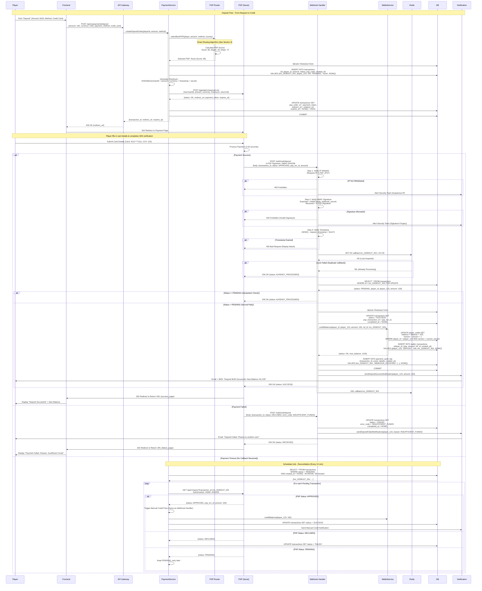
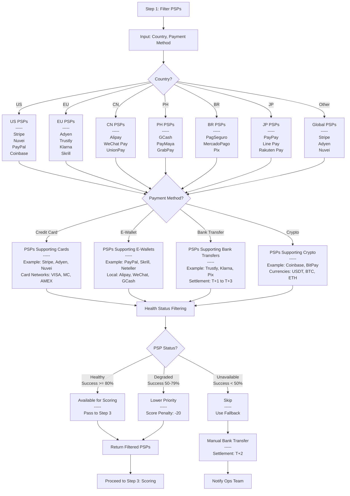
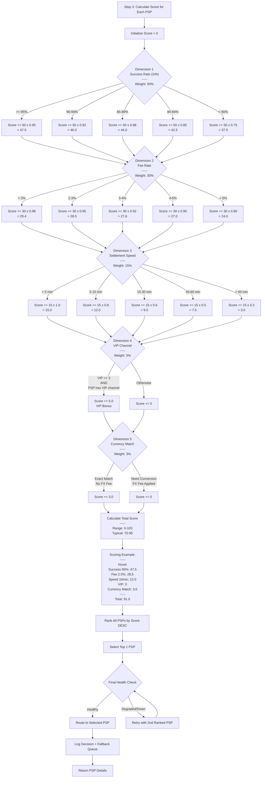
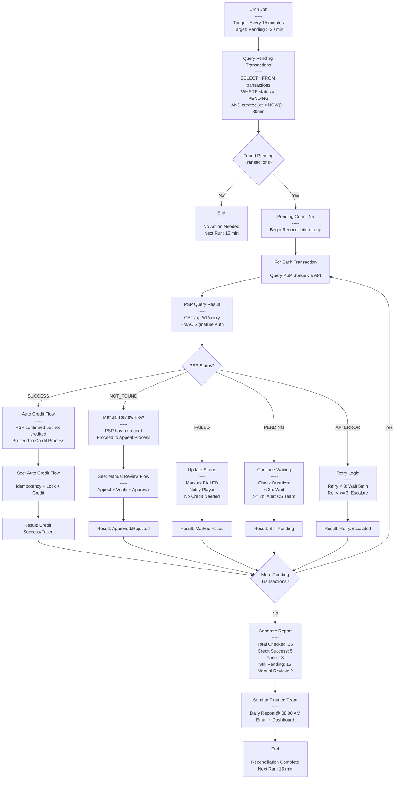
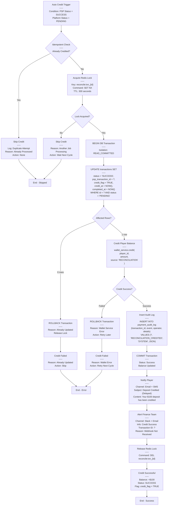

# Payment Gateway API

> **Canonical Source**: [source-archive/02_Finance_Center/02-02_Payment_Gateway_Integration.md](../../source-archive/02_Finance_Center/02-02_Payment_Gateway_Integration.md)
> **Audience**: Architects, Backend Developers
> **Business Requirements**: [Payment_Operations.md](../../requirements/02_Financial_Operations/Payment_Operations.md)
> **Last Synced**: 2026-02-08
> **Source Version**: 4.0.0

---

## 1. System Architecture Overview

The Payment Gateway integrates with multiple external PSPs (Payment Service Providers) to handle deposit and withdrawal transactions. Key architectural goals:

- Multi-PSP support with intelligent routing
- Fault-tolerant failover mechanism
- Idempotent transaction processing
- PCI-DSS compliant data handling

---

## 2. Deposit Flow Sequence

### 2.1 Complete Deposit Flow

The following sequence diagram shows the complete flow from player deposit initiation to balance crediting, including PSP routing, signature verification, callback handling, and idempotency protection:



### 2.2 Key Design Points

| Phase | Key Step | Security Mechanism | Performance Target |
|-------|----------|-------------------|-------------------|
| **1. PSP Routing** | Smart PSP selection | Multi-dimensional scoring (success rate, cost, speed) | < 100ms |
| **2. Order Creation** | Generate unique transaction_id | DB unique constraint prevents duplicates | < 50ms |
| **3. Signature Generation** | SHA256 checksum | Prevents request tampering | < 10ms |
| **4. PSP Request** | Obtain redirect_url | HTTPS + TLS 1.2+ | < 500ms |
| **5. Callback Verification** | 3-layer validation (IP, signature, timestamp) | Prevents forgery, replay attacks | < 50ms |
| **6. Idempotency** | Redis SET NX lock | Prevents duplicate callbacks | < 10ms |
| **7. Balance Update** | Optimistic locking (version) | Prevents concurrent conflicts | < 100ms |
| **8. Reconciliation** | Scheduled PSP status query | Prevents dropped transactions | Every 15 min |

---

## 3. Smart Routing Algorithm

### 3.1 Routing Architecture Overview

```mermaid
flowchart LR
    START[Player Deposit Request] --> INPUT["Input Parameters<br/>-----<br/>Amount: $1000<br/>Currency: USD<br/>Country: US<br/>Payment Method: Credit Card<br/>VIP Level: 2"]

    INPUT --> STEP1["Step 1<br/>Country & Payment<br/>Method Filtering<br/>-----<br/>Filter by Geography<br/>& Payment Type"]

    STEP1 --> CANDIDATES["Candidate PSPs<br/>-----<br/>Nuvei<br/>Adyen<br/>Stripe<br/>(3 candidates)"]

    CANDIDATES --> STEP2["Step 2<br/>Health Status Check<br/>-----<br/>Filter Unavailable PSPs"]

    STEP2 --> AVAILABLE["Available PSPs<br/>-----<br/>Nuvei: Healthy<br/>Adyen: Healthy<br/>Stripe: Degraded<br/>(2 healthy)"]

    AVAILABLE --> STEP3["Step 3<br/>Multi-Dimensional<br/>Scoring Algorithm<br/>-----<br/>5 Dimensions Evaluation"]

    STEP3 --> RANKED["Ranked PSPs<br/>-----<br/>1. Nuvei: 92.25<br/>2. Adyen: 78.0<br/>3. Stripe: 72.0"]

    RANKED --> STEP4["Step 4<br/>Final Health Check<br/>-----<br/>Verify Top PSP Status"]

    STEP4 --> DECISION{Top PSP Status?}

    DECISION -->|Healthy| ROUTE["Route to Nuvei<br/>-----<br/>Payment URL Generated<br/>Settlement ETA: 10 min"]
    DECISION -->|Degraded/Down| FALLBACK["Fallback to Adyen<br/>-----<br/>Retry with 2nd PSP"]

    FALLBACK --> DECISION

    ROUTE --> LOG["Log Routing Decision<br/>-----<br/>Selected: Nuvei<br/>Score: 92.25<br/>Fallback Queue: Adyen, Stripe"]

    LOG --> RETURN["Return to Gateway<br/>-----<br/>Redirect URL + ETA"]

    RETURN --> END1[End - Success]
```



### 3.2 Country & Payment Method Filtering



### 3.3 Multi-Dimensional Scoring Algorithm



### 3.4 Score Calculation Example

For a US player depositing $1000 via Credit Card:

```
Nuvei:
  Success Rate: 95% -> 95% x 50 = 47.5
  Fee: 2.5% -> (1 - 0.025) x 30 = 29.25
  Settlement: 10 min -> (1 - 10/60) x 15 = 12.5
  VIP Bonus: No -> 0
  Currency Match: USD -> +3
  Total Score: 92.25 (Selected)

Adyen:
  Success Rate: 92% -> 46.0
  Fee: 3.0% -> 29.1
  Settlement: 5 min -> 13.75
  VIP Bonus: No -> 0
  Currency Match: EUR (need convert) -> 0
  Total Score: 88.85

Stripe:
  Success Rate: 90% -> 45.0
  Fee: 2.9% -> 29.13
  Settlement: 15 min -> 11.25
  VIP Bonus: No -> 0
  Currency Match: USD -> +3
  Total Score: 88.38
```

**Decision**: Nuvei selected (92.25). Fallback queue: [Adyen, Stripe]

---

## 4. Reconciliation & Manual Credit Flow

### 4.1 Reconciliation Task Overview



### 4.2 Auto Credit Flow



### 4.3 Manual Review & Appeal Flow

```mermaid
flowchart TD
    START["Manual Review Trigger<br/>-----<br/>Condition: PSP Status = NOT_FOUND<br/>PSP has no transaction record"] --> SEVERITY{Amount Severity?}

    SEVERITY -->|>= $1000<br/>High Value| CRITICAL["CRITICAL Alert<br/>-----<br/>Notify: Finance + Security + CTO<br/>Priority: HIGH<br/>SLA: 2 hours"]

    SEVERITY -->|< $1000<br/>Low Value| STANDARD["STANDARD Alert<br/>-----<br/>Notify: CS Team<br/>Priority: MEDIUM<br/>SLA: 24 hours"]

    CRITICAL --> TICKET["Create Review Ticket<br/>-----<br/>System: Jira<br/>Type: Payment Investigation<br/>Assignee: Finance Team<br/>Fields: {txn_id, amount, player_id, psp}"]

    STANDARD --> TICKET

    TICKET --> APPEAL{"Player Appeals?<br/>-----<br/>Timeout: 7 days"}

    APPEAL -->|No - Timeout| TIMEOUT["Close Ticket<br/>-----<br/>Status: EXPIRED<br/>Reason: No Player Response<br/>Action: Mark as FAILED"]

    APPEAL -->|Yes - Upload Receipt| VERIFY["CS Agent Verifies Receipt<br/>-----<br/>Check:<br/>Bank Reference Number<br/>Transaction Amount<br/>Transaction Date<br/>Payment Method"]

    VERIFY --> CONTACT_PSP["Contact PSP Support<br/>-----<br/>Action: Submit Ticket to PSP<br/>Evidence: Bank Receipt<br/>Wait: 1-3 business days"]

    CONTACT_PSP --> PSP_CONFIRM{"PSP Confirms<br/>Payment?"}

    PSP_CONFIRM -->|No - Not Found| REJECT["Reject Appeal<br/>-----<br/>Status: REJECTED<br/>Reason: No Payment Proof from PSP<br/>Notify Player: Email"]

    PSP_CONFIRM -->|Yes - Confirmed| MANUAL_CREDIT["Manual Credit Request<br/>-----<br/>Operator: CS Agent<br/>Evidence: PSP Confirmation Email<br/>Audit Trail: Logged"]

    MANUAL_CREDIT --> APPROVAL{"Approval Required?<br/>-----<br/>Threshold: $1000"}

    APPROVAL -->|No<br/>(Amount < $1000)| EXECUTE["Execute Credit<br/>-----<br/>Same as Auto Credit Flow<br/>Operator: CS Agent"]

    APPROVAL -->|Yes<br/>(Amount >= $1000)| AWAIT["Await CFO Approval<br/>-----<br/>Approval System: Workflow<br/>Approver: CFO<br/>SLA: 24 hours"]

    AWAIT --> APPROVED{Approved?}

    APPROVED -->|No - Rejected| REJECT2["Reject Appeal<br/>-----<br/>Status: CFO_REJECTED<br/>Reason: Insufficient Evidence<br/>Notify Player + CS"]

    APPROVED -->|Yes - Approved| EXECUTE

    EXECUTE --> CREDIT_EXEC["Credit Player Balance<br/>-----<br/>Source: MANUAL_CREDIT<br/>Operator: {cs_agent_id}<br/>Approver: {cfo_id if required}"]

    CREDIT_EXEC --> CREDIT_CHECK{Credit Success?}

    CREDIT_CHECK -->|Failed| ERROR["Credit Failed<br/>-----<br/>Reason: Wallet Service Error<br/>Action: Escalate to Tech Team"]

    CREDIT_CHECK -->|Success| AUDIT_LOG["Insert Audit Log<br/>-----<br/>Event: MANUAL_CREDIT<br/>Evidence: {psp_confirmation, bank_receipt}<br/>Approver: {cfo_id}<br/>Compliance: 7-year retention"]

    AUDIT_LOG --> NOTIFY["Notify Stakeholders<br/>-----<br/>Player: Email + SMS<br/>Finance: Slack Alert<br/>Audit: Log to SIEM"]

    NOTIFY --> SUCCESS["Manual Credit Complete<br/>-----<br/>Status: SUCCESS<br/>Flag: manual_credit = TRUE<br/>Audit Trail: Complete"]

    TIMEOUT --> END1[End - Expired]
    REJECT --> END2[End - Rejected]
    REJECT2 --> END2
    SUCCESS --> END3[End - Success]
    ERROR --> END4[End - Error]
```

---

## 5. Security Implementation

### 5.1 Three-Layer Callback Verification

```
Layer 1: IP Whitelist Verification
  - Only accept requests from PSP designated IPs
  - Reject other IPs -> 403 Forbidden + Alert

Layer 2: HMAC Signature Verification
  - Expected = HMAC-SHA256(request_body, webhook_secret)
  - Received = X-PSP-Signature Header
  - Mismatch -> 403 Forbidden + Security Alert

Layer 3: Timestamp Verification (Replay Attack Prevention)
  - NOW() - request_timestamp < 5 minutes
  - Expired -> 400 Bad Request
```

### 5.2 Idempotency Protection

| Mechanism | Implementation | TTL | Purpose |
|-----------|---------------|-----|---------|
| **Redis Lock** | `SET NX callback:{txn_id} 1 EX 60` | 60 sec | Prevent concurrent callback processing |
| **Database Status** | `WHERE status = 'PENDING' AND UPDATE status = 'SUCCESS'` | N/A | Ensure unique state transition |
| **Unique Constraint** | `UNIQUE (transaction_id, psp_transaction_id)` | N/A | Prevent duplicate credits |

### 5.3 3D Secure Implementation

| Feature | 3DS 1.0 | 3DS 2.0 (EMV 3DS) |
|---------|---------|-------------------|
| User Experience | Redirect to bank page (high abandonment) | Native in-app verification |
| Data Transmission | Basic card info only | Device fingerprint, behavioral data |
| Risk Assessment | Issuer-only decision | Multi-party collaboration (Issuer+PSP+Merchant) |
| Applicable Scenario | Desktop | Mobile-first |

**PSD2 Exemptions**:
- Transaction amount < EUR 30
- Merchant has high risk score (low-risk merchant)
- Recurring payments (Subscription)

---

## 6. PSP Integration Examples

### 6.1 Nuvei (Formerly SafeCharge)

**API Endpoints**:
```
Production: https://ppp.nuvei.com/ppp/api/v1/payment.do
Sandbox: https://ppp-test.nuvei.com/ppp/api/v1/payment.do
```

**Deposit API Request**:
```json
POST /ppp/api/v1/payment.do
{
  "merchantId": "123456789",
  "merchantSiteId": "987654",
  "clientRequestId": "txn_202601271234",
  "amount": "100.00",
  "currency": "USD",
  "userId": "player_12345",
  "timeStamp": "2026-01-27 10:30:00",
  "checksum": "e7f8a1b2c3d4e5f6..."
}
```

**Checksum Generation**:
```
SHA256(merchantId + merchantSiteId + clientRequestId + amount + currency + timeStamp + secret)
```

### 6.2 Adyen

**3DS 2.0 Integration Flow**:
1. Frontend collects card number, CVV, cardholder name
2. Call Adyen `/payments` API, returns `action.type = "threeDS2"`
3. Frontend loads Adyen 3DS Component (iframe)
4. Player completes bank verification, call `/payments/details` for final result

**Payout API Request**:
```json
POST /pal/servlet/Payout/v68/payout
{
  "merchantAccount": "IGamingPlatformEU",
  "amount": {
    "currency": "EUR",
    "value": 5000
  },
  "reference": "withdrawal_98765",
  "shopperEmail": "player@example.com",
  "card": {
    "number": "4111111111111111",
    "expiryMonth": "03",
    "expiryYear": "2030",
    "holderName": "John Doe"
  }
}
```

**Note**: Adyen uses smallest currency unit (5000 = EUR 50.00)

---

## 7. API Specifications

### 7.1 Unified Deposit API

**Request**:
```http
POST /api/v1/payments/deposit
Content-Type: application/json
Authorization: Bearer <player_jwt_token>

{
  "amount": 100.00,
  "currency": "USD",
  "payment_method": "credit_card",
  "psp_code": "nuvei",
  "return_url": "https://platform.com/deposit/callback"
}
```

**Response**:
```json
{
  "code": 1000,
  "message": "Success",
  "data": {
    "transaction_id": "txn_202601271234",
    "redirect_url": "https://psp.com/payment?token=abc123",
    "expires_at": "2026-01-27T11:00:00Z"
  }
}
```

### 7.2 Webhook Callback Handler

**Security Requirements**:
1. IP Whitelist validation
2. HMAC-SHA256 signature verification
3. Timestamp validation (< 5 min)
4. Idempotency via Redis lock: `SET callback:{txn_id} 1 EX 60 NX`

---

## 8. Failover Strategy

### 8.1 Health Check Mechanism

**Periodic Health Probe** (every 5 minutes):
- Test small transaction capability
- Monitor success rate trends
- Update PSP status in cache

### 8.2 Automatic Switching

```
Primary PSP: Nuvei (Status: Unavailable)
    ↓ Automatic switch
Backup PSP: Adyen (Status: Healthy)
    ↓ If also fails
Fallback PSP: Manual Bank Transfer (Notify Finance Team)
```

### 8.3 Recovery Detection

- Test degraded PSP every 10 minutes
- Restore to `available` status after 3 consecutive successes

---

## 9. Error Handling Matrix

| Exception Type | Trigger Condition | Handling Strategy | Notification |
|---------------|-------------------|-------------------|--------------|
| **IP Not Whitelisted** | Request IP not in PSP_IPS | Reject + Security Alert | Security Team |
| **Signature Mismatch** | HMAC Mismatch | Reject + Security Alert | Security + CTO |
| **Duplicate Callback** | Redis Lock Failed | Return 200 OK (ALREADY_PROCESSED) | None (normal) |
| **Status Changed** | Status != PENDING | Return 200 OK (Idempotent) | None (normal) |
| **Callback Timeout** | No callback for 30 min | Query PSP status proactively | Tech Team |
| **Credit Failed** | PSP returns NOT_FOUND | Manual review + Player appeal | CS + Finance |

---

## 10. Related Technical Documentation

- [Data Security Standard](../../source-archive/12_System_Security/12-03_Data_Security_Standard.md) - Payment data encryption
- [API Design Principles](../../source-archive/09_Technical_Infrastructure/09-03-01_Design_Principles.md) - API specifications
- [Audit Log System](../../source-archive/06_Platform_Governance/06-03_Audit_Log.md) - Configuration change audit
- [Approval Workflow](../../source-archive/06_Platform_Governance/06-04_Approval_Workflow.md) - Configuration change approval

---

**Document Version**: 1.0.0
**Last Updated**: 2026-02-08
**Maintainer**: Backend Team
