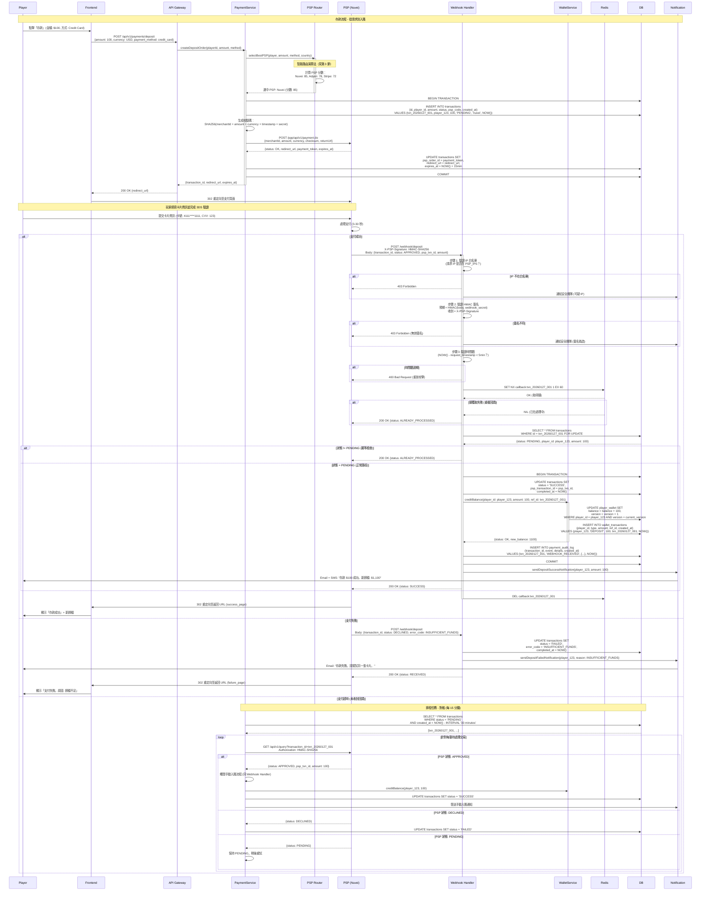
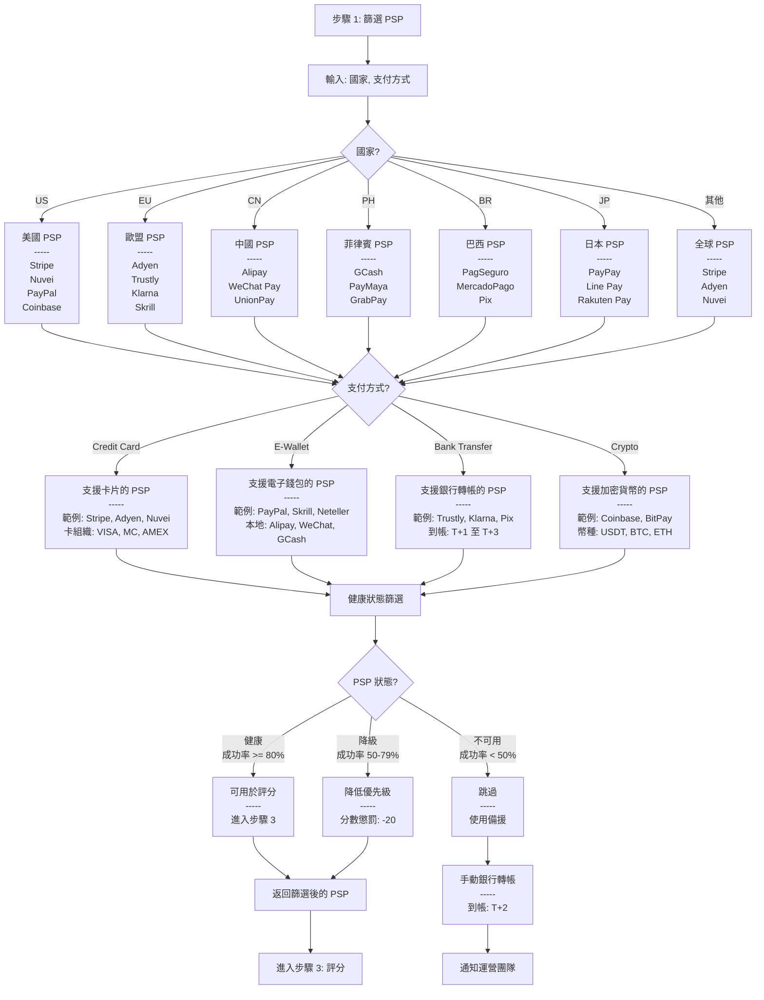
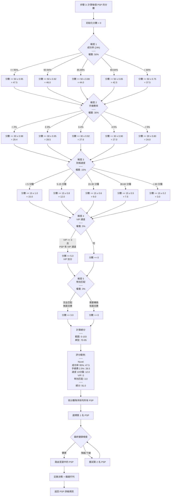
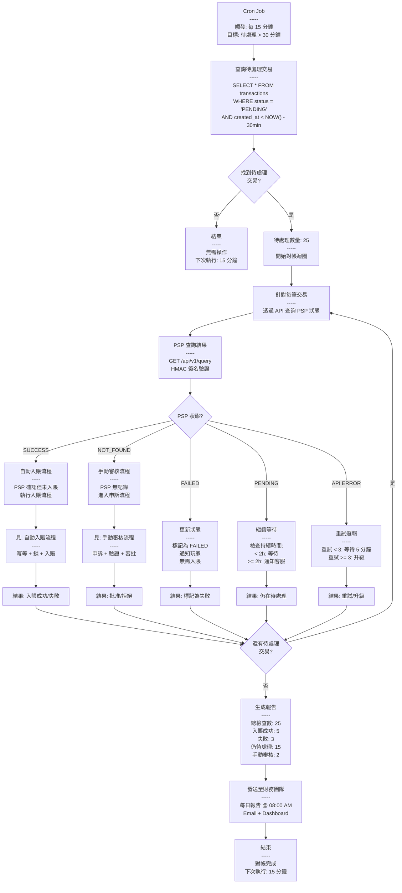
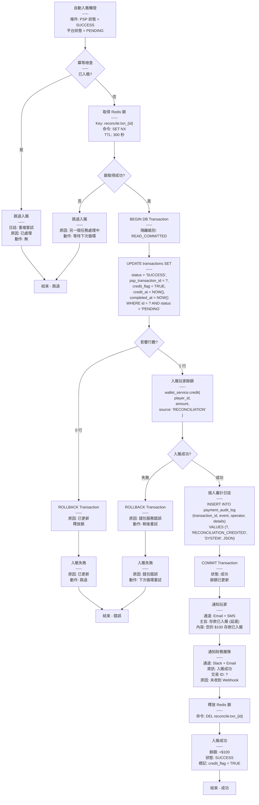

# 支付閘道 API（Payment Gateway API）

> **Canonical Source**: [source-archive/02_Finance_Center/02-02_Payment_Gateway_Integration.md](../../source-archive/02_Finance_Center/02-02_Payment_Gateway_Integration.md)
> **目標讀者（Audience）**: 架構師、後端開發人員
> **業務需求（Business Requirements）**: [Payment_Operations.md](../../requirements/02_Financial_Operations/Payment_Operations.md)
> **最後同步（Last Synced）**: 2026-02-08
> **來源版本（Source Version）**: 4.0.0

---

## 1. 系統架構概覽（System Architecture Overview）

Payment Gateway 整合多個外部 PSP (Payment Service Provider，支付服務提供商) 處理存款和提款交易。核心架構目標：

- 多 PSP 支援與智能路由
- 容錯式故障轉移機制
- 冪等交易處理
- PCI-DSS 合規的資料處理

---

## 2. 存款流程序列（Deposit Flow Sequence）

### 2.1 完整存款流程（Complete Deposit Flow）

以下序列圖展示從玩家發起存款到餘額入賬的完整流程，包含 PSP 路由、簽名驗證、回調處理及冪等保護：



### 2.2 關鍵設計要點（Key Design Points）

| 階段 | 關鍵步驟 | 安全機制 | 效能目標 |
|-------|----------|-------------------|-------------------|
| **1. PSP 路由** | 智能 PSP 選擇 | 多維度評分 (成功率、成本、速度) | < 100ms |
| **2. 訂單建立** | 生成唯一 transaction_id | 資料庫唯一約束防止重複 | < 50ms |
| **3. 簽名生成** | SHA256 校驗碼 | 防止請求篡改 | < 10ms |
| **4. PSP 請求** | 取得 redirect_url | HTTPS + TLS 1.2+ | < 500ms |
| **5. 回調驗證** | 三層驗證 (IP、簽名、時間戳) | 防止偽造、重放攻擊 | < 50ms |
| **6. 冪等性** | Redis SET NX 鎖 | 防止重複回調 | < 10ms |
| **7. 餘額更新** | 樂觀鎖 (version) | 防止並發衝突 | < 100ms |
| **8. 對帳** | 排程查詢 PSP 狀態 | 防止遺失交易 | 每 15 分鐘 |

---

## 2.3. 資料庫架構（Database Schema）

### 2.3.1 支付交易表（Payment Transactions Table）

```sql
CREATE TABLE t_payment_transaction (
    id                      BIGSERIAL PRIMARY KEY,
    transaction_id          VARCHAR(100) NOT NULL UNIQUE,  -- txn_20260127_001
    player_id               BIGINT NOT NULL,

    -- Transaction details
    type                    VARCHAR(20) NOT NULL,  -- DEPOSIT, WITHDRAWAL
    amount                  DECIMAL(18,2) NOT NULL,
    currency                VARCHAR(10) NOT NULL,  -- USD, EUR, GBP, etc.

    -- PSP details
    psp_code                VARCHAR(50) NOT NULL,  -- nuvei, adyen, stripe
    psp_order_id            VARCHAR(200),          -- PSP payment token
    psp_transaction_id      VARCHAR(200),          -- PSP final transaction ID
    payment_method          VARCHAR(50) NOT NULL,  -- credit_card, e_wallet, bank_transfer, crypto

    -- Status tracking
    status                  VARCHAR(20) NOT NULL,  -- PENDING, SUCCESS, FAILED, EXPIRED
    error_code              VARCHAR(50),           -- INSUFFICIENT_FUNDS, INVALID_CARD, etc.
    error_message           VARCHAR(500),

    -- URLs and expiry
    redirect_url            VARCHAR(500),
    return_url              VARCHAR(500),
    expires_at              TIMESTAMP,

    -- Timestamps
    created_at              TIMESTAMP NOT NULL DEFAULT NOW(),
    completed_at            TIMESTAMP,

    -- Audit fields
    ip_address              VARCHAR(45),
    user_agent              VARCHAR(500),
    device_fingerprint      VARCHAR(100),

    -- Credit tracking (for reconciliation)
    credit_flag             BOOLEAN DEFAULT FALSE,
    credit_at               TIMESTAMP,
    credit_source           VARCHAR(50),  -- WEBHOOK, RECONCILIATION, MANUAL_CREDIT

    -- Indexes
    CONSTRAINT fk_player FOREIGN KEY (player_id) REFERENCES t_player(id)
);

-- Performance indexes
CREATE INDEX idx_payment_txn_player_id ON t_payment_transaction(player_id);
CREATE INDEX idx_payment_txn_status ON t_payment_transaction(status);
CREATE INDEX idx_payment_txn_created_at ON t_payment_transaction(created_at DESC);
CREATE INDEX idx_payment_txn_psp_code ON t_payment_transaction(psp_code);

-- Reconciliation query optimization
CREATE INDEX idx_payment_txn_pending_old ON t_payment_transaction(created_at)
    WHERE status = 'PENDING';

-- Unique constraint to prevent duplicate PSP transactions
CREATE UNIQUE INDEX uk_payment_txn_psp ON t_payment_transaction(psp_code, psp_transaction_id)
    WHERE psp_transaction_id IS NOT NULL;
```

### 2.3.2 支付方式配置表（Payment Methods Configuration Table）

```sql
CREATE TABLE t_payment_method (
    id                      BIGSERIAL PRIMARY KEY,
    method_code             VARCHAR(50) NOT NULL UNIQUE,  -- credit_card, alipay, gcash, etc.
    method_name             VARCHAR(100) NOT NULL,
    method_type             VARCHAR(20) NOT NULL,  -- CARD, E_WALLET, BANK, CRYPTO

    -- Availability
    enabled                 BOOLEAN DEFAULT TRUE,
    supported_currencies    TEXT[] NOT NULL,  -- ARRAY['USD', 'EUR', 'GBP']
    supported_countries     TEXT[] NOT NULL,  -- ARRAY['US', 'UK', 'CA']

    -- Limits
    min_deposit_amount      DECIMAL(18,2),
    max_deposit_amount      DECIMAL(18,2),
    min_withdrawal_amount   DECIMAL(18,2),
    max_withdrawal_amount   DECIMAL(18,2),

    -- Fee configuration
    deposit_fee_type        VARCHAR(20),  -- FIXED, PERCENTAGE, NONE
    deposit_fee_value       DECIMAL(18,4),
    withdrawal_fee_type     VARCHAR(20),
    withdrawal_fee_value    DECIMAL(18,4),

    -- Processing time
    deposit_eta_minutes     INT,  -- Expected time to credit (5, 15, 30, etc.)
    withdrawal_eta_hours    INT,  -- Expected time to payout (1, 24, 72, etc.)

    -- Display configuration
    display_order           INT DEFAULT 0,
    icon_url                VARCHAR(500),
    description             VARCHAR(500),

    -- Audit fields
    created_at              TIMESTAMP NOT NULL DEFAULT NOW(),
    updated_at              TIMESTAMP NOT NULL DEFAULT NOW()
);

-- Insert example data
INSERT INTO t_payment_method (method_code, method_name, method_type, supported_currencies, supported_countries, min_deposit_amount, max_deposit_amount, deposit_fee_type, deposit_fee_value, deposit_eta_minutes, display_order) VALUES
('credit_card', 'Credit/Debit Card', 'CARD', ARRAY['USD', 'EUR', 'GBP'], ARRAY['US', 'UK', 'CA', 'AU'], 10.00, 10000.00, 'PERCENTAGE', 2.5, 5, 1),
('alipay', 'Alipay', 'E_WALLET', ARRAY['USD', 'CNY'], ARRAY['CN', 'HK', 'SG'], 5.00, 5000.00, 'FIXED', 1.00, 10, 2),
('gcash', 'GCash', 'E_WALLET', ARRAY['PHP', 'USD'], ARRAY['PH'], 50.00, 50000.00, 'PERCENTAGE', 1.5, 15, 3),
('bank_transfer', 'Bank Transfer', 'BANK', ARRAY['USD', 'EUR'], ARRAY['US', 'UK', 'EU'], 50.00, 50000.00, 'NONE', 0.00, 1440, 4),
('usdt_trc20', 'USDT (TRC20)', 'CRYPTO', ARRAY['USDT'], ARRAY['ALL'], 10.00, 100000.00, 'FIXED', 1.00, 30, 5);
```

### 2.3.3 支付審計日誌表（Payment Audit Log Table）

```sql
CREATE TABLE t_payment_audit_log (
    id                      BIGSERIAL PRIMARY KEY,
    transaction_id          VARCHAR(100) NOT NULL,
    event_type              VARCHAR(50) NOT NULL,  -- ORDER_CREATED, WEBHOOK_RECEIVED, CREDIT_SUCCESS, MANUAL_CREDIT, etc.
    event_data              JSONB,  -- Flexible event-specific data

    -- Operator tracking
    operator_type           VARCHAR(20),  -- SYSTEM, CS_AGENT, FINANCE_MANAGER
    operator_id             BIGINT,
    operator_name           VARCHAR(100),

    -- Request details (for webhook events)
    request_ip              VARCHAR(45),
    request_signature       VARCHAR(500),
    request_body            TEXT,

    -- Timestamps
    created_at              TIMESTAMP NOT NULL DEFAULT NOW(),

    -- Indexes
    CONSTRAINT fk_transaction FOREIGN KEY (transaction_id) REFERENCES t_payment_transaction(transaction_id)
);

CREATE INDEX idx_payment_audit_txn_id ON t_payment_audit_log(transaction_id);
CREATE INDEX idx_payment_audit_created_at ON t_payment_audit_log(created_at DESC);
CREATE INDEX idx_payment_audit_event_type ON t_payment_audit_log(event_type);

-- GIN index for JSONB queries
CREATE INDEX idx_payment_audit_event_data ON t_payment_audit_log USING GIN (event_data);
```

### 2.3.4 PSP 配置表（PSP Configuration Table）

```sql
CREATE TABLE t_psp_config (
    id                      BIGSERIAL PRIMARY KEY,
    psp_code                VARCHAR(50) NOT NULL UNIQUE,  -- nuvei, adyen, stripe
    psp_name                VARCHAR(100) NOT NULL,

    -- Status
    enabled                 BOOLEAN DEFAULT TRUE,
    health_status           VARCHAR(20) DEFAULT 'HEALTHY',  -- HEALTHY, DEGRADED, UNAVAILABLE
    last_health_check       TIMESTAMP,

    -- Routing configuration
    priority                INT DEFAULT 0,  -- Higher = preferred
    supported_methods       TEXT[] NOT NULL,  -- ARRAY['credit_card', 'alipay']
    supported_currencies    TEXT[] NOT NULL,
    supported_countries     TEXT[] NOT NULL,

    -- Fee configuration
    fee_percentage          DECIMAL(5,4),  -- 2.5% = 0.0250
    settlement_eta_minutes  INT,  -- Expected credit time

    -- API credentials (encrypted)
    merchant_id             VARCHAR(200),
    api_key_encrypted       VARCHAR(500),
    webhook_secret_encrypted VARCHAR(500),

    -- Health metrics (cached, updated by monitoring job)
    success_rate_24h        DECIMAL(5,4),  -- 0.9500 = 95%
    avg_response_time_ms    INT,

    -- VIP channel
    has_vip_channel         BOOLEAN DEFAULT FALSE,
    vip_min_level           INT,  -- Minimum VIP level required

    -- Audit fields
    created_at              TIMESTAMP NOT NULL DEFAULT NOW(),
    updated_at              TIMESTAMP NOT NULL DEFAULT NOW()
);

-- Insert example PSP configurations
INSERT INTO t_psp_config (psp_code, psp_name, enabled, priority, supported_methods, supported_currencies, supported_countries, fee_percentage, settlement_eta_minutes, success_rate_24h, has_vip_channel) VALUES
('nuvei', 'Nuvei', TRUE, 10, ARRAY['credit_card', 'bank_transfer'], ARRAY['USD', 'EUR', 'GBP'], ARRAY['US', 'UK', 'CA'], 0.0250, 10, 0.9500, TRUE),
('adyen', 'Adyen', TRUE, 8, ARRAY['credit_card', 'alipay', 'gcash'], ARRAY['USD', 'EUR', 'CNY', 'PHP'], ARRAY['US', 'EU', 'CN', 'PH'], 0.0300, 5, 0.9200, FALSE),
('stripe', 'Stripe', TRUE, 6, ARRAY['credit_card', 'bank_transfer'], ARRAY['USD', 'EUR'], ARRAY['US', 'UK'], 0.0290, 15, 0.9000, FALSE);
```

### 2.3.5 查詢範例（Query Examples）

**查找超過 30 分鐘的待處理交易（用於對帳）**:
```sql
SELECT
    t.transaction_id,
    t.player_id,
    t.amount,
    t.currency,
    t.psp_code,
    t.created_at,
    EXTRACT(EPOCH FROM (NOW() - t.created_at))/60 AS pending_minutes
FROM t_payment_transaction t
WHERE t.status = 'PENDING'
  AND t.created_at < NOW() - INTERVAL '30 minutes'
ORDER BY t.created_at ASC
LIMIT 100;
```

**計算 PSP 成功率用於智能路由**:
```sql
SELECT
    psp_code,
    COUNT(*) AS total_transactions,
    SUM(CASE WHEN status = 'SUCCESS' THEN 1 ELSE 0 END) AS success_count,
    ROUND(SUM(CASE WHEN status = 'SUCCESS' THEN 1 ELSE 0 END)::DECIMAL / COUNT(*), 4) AS success_rate,
    AVG(EXTRACT(EPOCH FROM (completed_at - created_at))) AS avg_processing_seconds
FROM t_payment_transaction
WHERE created_at >= NOW() - INTERVAL '24 hours'
  AND status IN ('SUCCESS', 'FAILED')
GROUP BY psp_code
ORDER BY success_rate DESC;
```

**查詢特定交易的審計日誌**:
```sql
SELECT
    event_type,
    event_data,
    operator_type,
    operator_name,
    created_at
FROM t_payment_audit_log
WHERE transaction_id = 'txn_20260127_001'
ORDER BY created_at ASC;
```

---

## 2.4. Java 實作範例（Java Implementation Example）

### 2.4.1 Service 層（Service Layer）

**PaymentService** - 存款訂單建立與 PSP 路由:

```java
package net.lab1024.sa.business.payment.service;

import io.vavr.control.Option;
import io.vavr.control.Try;
import lombok.RequiredArgsConstructor;
import lombok.extern.slf4j.Slf4j;
import net.lab1024.sa.business.payment.dao.PaymentTransactionDao;
import net.lab1024.sa.business.payment.domain.entity.PaymentTransactionEntity;
import net.lab1024.sa.business.payment.domain.form.DepositRequestForm;
import net.lab1024.sa.business.payment.domain.vo.DepositResponseVO;
import net.lab1024.sa.business.payment.manager.PaymentManager;
import net.lab1024.sa.business.payment.psp.PspRouter;
import net.lab1024.sa.common.core.domain.response.ResponseDTO;
import net.lab1024.sa.common.core.util.SmartBeanUtil;
import org.springframework.stereotype.Service;

import java.time.LocalDateTime;

/**
 * PaymentService - 支付服務層
 *
 * 職責：
 * - 存款訂單建立 (無 @Transactional，直接呼叫 Dao)
 * - PSP 智能路由選擇
 * - 對帳查詢 (委派至 Manager 執行交易)
 */
@Slf4j
@Service
@RequiredArgsConstructor
public class PaymentService {

    private final PaymentTransactionDao paymentTransactionDao;
    private final PaymentManager paymentManager;
    private final PspRouter pspRouter;

    /**
     * 建立存款訂單
     *
     * @param playerId 玩家 ID
     * @param form 存款請求表單
     * @return 存款回應 (redirect_url, transaction_id, expires_at)
     */
    public Option<DepositResponseVO> createDepositOrder(Long playerId, DepositRequestForm form) {
        return Try.of(() -> {
            // 步驟 1: 智能路由選擇 PSP
            String selectedPsp = pspRouter.selectBestPsp(
                playerId,
                form.getAmount(),
                form.getPaymentMethod(),
                form.getCurrency(),
                form.getCountryCode()
            ).getOrElse("nuvei");

            log.info("玩家 {} 存款 ${} {}，選中 PSP: {}",
                playerId, form.getAmount(), form.getCurrency(), selectedPsp);

            // 步驟 2: 建立 PENDING 訂單 (單表 INSERT，無需 @Transactional)
            PaymentTransactionEntity entity = SmartBeanUtil.copy(form, PaymentTransactionEntity.class);
            entity.setPlayerId(playerId);
            entity.setPspCode(selectedPsp);
            entity.setStatus("PENDING");
            entity.setType("DEPOSIT");
            entity.setTransactionId(generateTransactionId());
            entity.setExpiresAt(LocalDateTime.now().plusMinutes(15));

            paymentTransactionDao.insert(entity);

            // 步驟 3: 呼叫 PSP API (委派至 Manager - 包含 HTTP 呼叫 + UPDATE)
            return paymentManager.requestPspPayment(entity);

        }).toOption();
    }

    /**
     * 查詢超時交易用於對帳
     *
     * @param timeoutMinutes 超時分鐘數 (預設 30)
     * @return 待對帳交易列表
     */
    public List<PaymentTransactionEntity> findTimeoutTransactions(int timeoutMinutes) {
        LocalDateTime cutoffTime = LocalDateTime.now().minusMinutes(timeoutMinutes);
        return paymentTransactionDao.selectList(
            Wrappers.<PaymentTransactionEntity>lambdaQuery()
                .eq(PaymentTransactionEntity::getStatus, "PENDING")
                .lt(PaymentTransactionEntity::getCreatedAt, cutoffTime)
                .orderByAsc(PaymentTransactionEntity::getCreatedAt)
        );
    }

    private String generateTransactionId() {
        return "txn_" + LocalDateTime.now().format(DateTimeFormatter.ofPattern("yyyyMMddHHmmss"))
            + "_" + RandomStringUtils.randomNumeric(6);
    }
}
```

### 2.4.2 Manager 層（Manager Layer）

**PaymentManager** - 處理 PSP HTTP 呼叫與訂單更新 (需要 @Transactional):

```java
package net.lab1024.sa.business.payment.manager;

import lombok.RequiredArgsConstructor;
import lombok.extern.slf4j.Slf4j;
import net.lab1024.sa.business.payment.dao.PaymentTransactionDao;
import net.lab1024.sa.business.payment.dao.PaymentAuditLogDao;
import net.lab1024.sa.business.payment.domain.entity.PaymentTransactionEntity;
import net.lab1024.sa.business.payment.domain.entity.PaymentAuditLogEntity;
import net.lab1024.sa.business.payment.domain.vo.DepositResponseVO;
import net.lab1024.sa.business.payment.psp.NuveiClient;
import net.lab1024.sa.business.wallet.manager.WalletManager;
import net.lab1024.sa.common.core.util.SmartBeanUtil;
import org.springframework.stereotype.Component;
import org.springframework.transaction.annotation.Transactional;

import java.time.LocalDateTime;

/**
 * PaymentManager - 支付管理層
 *
 * 職責：
 * - PSP API 呼叫 + 訂單狀態更新 (@Transactional)
 * - Webhook 回調處理 + 餘額入賬 (@Transactional)
 * - 對帳自動入賬 (@Transactional)
 */
@Slf4j
@Component
@RequiredArgsConstructor
public class PaymentManager {

    private final PaymentTransactionDao paymentTransactionDao;
    private final PaymentAuditLogDao paymentAuditLogDao;
    private final WalletManager walletManager;
    private final NuveiClient nuveiClient;

    /**
     * 請求 PSP 支付 URL
     *
     * @param transaction 支付交易實體
     * @return 存款回應 VO (redirect_url, expires_at)
     */
    @Transactional(rollbackFor = Throwable.class)
    public DepositResponseVO requestPspPayment(PaymentTransactionEntity transaction) {
        // 步驟 1: 呼叫 PSP API 取得 redirect_url
        NuveiPaymentResponse pspResponse = nuveiClient.createPayment(
            transaction.getAmount(),
            transaction.getCurrency(),
            transaction.getTransactionId()
        );

        // 步驟 2: 更新訂單 (psp_order_id, redirect_url)
        transaction.setPspOrderId(pspResponse.getPaymentToken());
        transaction.setRedirectUrl(pspResponse.getRedirectUrl());
        paymentTransactionDao.updateById(transaction);

        // 步驟 3: 記錄審計日誌
        PaymentAuditLogEntity auditLog = new PaymentAuditLogEntity();
        auditLog.setTransactionId(transaction.getTransactionId());
        auditLog.setEventType("ORDER_CREATED");
        auditLog.setOperatorType("SYSTEM");
        paymentAuditLogDao.insert(auditLog);

        return SmartBeanUtil.copy(transaction, DepositResponseVO.class);
    }

    /**
     * 處理 Webhook 回調 - 入賬玩家餘額
     *
     * @param transactionId 交易 ID
     * @param pspTransactionId PSP 交易 ID
     * @return 是否成功入賬
     */
    @Transactional(rollbackFor = Throwable.class)
    public boolean processWebhookCallback(String transactionId, String pspTransactionId) {
        // 步驟 1: 冪等檢查 (FOR UPDATE 鎖定)
        PaymentTransactionEntity transaction = paymentTransactionDao.selectOne(
            Wrappers.<PaymentTransactionEntity>lambdaQuery()
                .eq(PaymentTransactionEntity::getTransactionId, transactionId)
        );

        if (transaction == null || !"PENDING".equals(transaction.getStatus())) {
            log.warn("交易 {} 狀態非 PENDING，跳過入賬", transactionId);
            return false;
        }

        // 步驟 2: 更新訂單狀態為 SUCCESS
        transaction.setStatus("SUCCESS");
        transaction.setPspTransactionId(pspTransactionId);
        transaction.setCompletedAt(LocalDateTime.now());
        transaction.setCreditFlag(true);
        transaction.setCreditAt(LocalDateTime.now());
        transaction.setCreditSource("WEBHOOK");
        paymentTransactionDao.updateById(transaction);

        // 步驟 3: 入賬玩家餘額 (委派至 WalletManager)
        walletManager.creditBalance(
            transaction.getPlayerId(),
            transaction.getAmount(),
            transactionId,
            "DEPOSIT"
        );

        // 步驟 4: 記錄審計日誌
        PaymentAuditLogEntity auditLog = new PaymentAuditLogEntity();
        auditLog.setTransactionId(transactionId);
        auditLog.setEventType("WEBHOOK_RECEIVED");
        auditLog.setOperatorType("SYSTEM");
        auditLog.setRequestBody(pspTransactionId);
        paymentAuditLogDao.insert(auditLog);

        log.info("交易 {} 入賬成功，金額: ${}", transactionId, transaction.getAmount());
        return true;
    }

    /**
     * 對帳自動入賬 (針對超時交易)
     *
     * @param transaction 交易實體
     * @param pspTransactionId PSP 確認的交易 ID
     * @return 是否入賬成功
     */
    @Transactional(rollbackFor = Throwable.class)
    public boolean reconcileAndCredit(PaymentTransactionEntity transaction, String pspTransactionId) {
        // 冪等檢查
        if (!"PENDING".equals(transaction.getStatus()) || transaction.getCreditFlag()) {
            log.warn("交易 {} 已入賬或非 PENDING 狀態", transaction.getTransactionId());
            return false;
        }

        // 更新訂單狀態
        transaction.setStatus("SUCCESS");
        transaction.setPspTransactionId(pspTransactionId);
        transaction.setCompletedAt(LocalDateTime.now());
        transaction.setCreditFlag(true);
        transaction.setCreditAt(LocalDateTime.now());
        transaction.setCreditSource("RECONCILIATION");
        paymentTransactionDao.updateById(transaction);

        // 入賬餘額
        walletManager.creditBalance(
            transaction.getPlayerId(),
            transaction.getAmount(),
            transaction.getTransactionId(),
            "DEPOSIT_RECONCILIATION"
        );

        // 審計日誌
        PaymentAuditLogEntity auditLog = new PaymentAuditLogEntity();
        auditLog.setTransactionId(transaction.getTransactionId());
        auditLog.setEventType("RECONCILIATION_CREDITED");
        auditLog.setOperatorType("SYSTEM");
        paymentAuditLogDao.insert(auditLog);

        log.info("對帳入賬成功: 交易 {}, 金額 ${}", transaction.getTransactionId(), transaction.getAmount());
        return true;
    }
}
```

**SmartAdmin 模式檢查點**:
- ✅ Constructor injection (`@RequiredArgsConstructor` + `private final`)
- ✅ Service 無 `@Transactional` (單表 CRUD 直接呼叫 Dao)
- ✅ Manager 使用 `@Transactional(rollbackFor = Throwable.class)` (多表操作 + HTTP 呼叫)
- ✅ Service 使用 Vavr `Option` + `Try` (非 `java.util.Optional`)
- ✅ SmartBeanUtil 用於 Entity ↔ VO 轉換

---

## 3. 智能路由演算法（Smart Routing Algorithm）

### 3.1 路由架構概覽（Routing Architecture Overview）

```mermaid
flowchart LR
    START[玩家存款請求] --> INPUT["輸入參數<br/>-----<br/>金額: $1000<br/>幣別: USD<br/>國家: US<br/>支付方式: Credit Card<br/>VIP 等級: 2"]

    INPUT --> STEP1["步驟 1<br/>國家與支付方式<br/>篩選<br/>-----<br/>地理位置與<br/>支付類型篩選"]

    STEP1 --> CANDIDATES["候選 PSP<br/>-----<br/>Nuvei<br/>Adyen<br/>Stripe<br/>(3 個候選)"]

    CANDIDATES --> STEP2["步驟 2<br/>健康狀態檢查<br/>-----<br/>過濾不可用 PSP"]

    STEP2 --> AVAILABLE["可用 PSP<br/>-----<br/>Nuvei: Healthy<br/>Adyen: Healthy<br/>Stripe: Degraded<br/>(2 個健康)"]

    AVAILABLE --> STEP3["步驟 3<br/>多維度<br/>評分演算法<br/>-----<br/>5 個維度評估"]

    STEP3 --> RANKED["排序後的 PSP<br/>-----<br/>1. Nuvei: 92.25<br/>2. Adyen: 78.0<br/>3. Stripe: 72.0"]

    RANKED --> STEP4["步驟 4<br/>最終健康檢查<br/>-----<br/>驗證首選 PSP 狀態"]

    STEP4 --> DECISION{首選 PSP 狀態?}

    DECISION -->|健康| ROUTE["路由至 Nuvei<br/>-----<br/>生成支付 URL<br/>入賬 ETA: 10 分鐘"]
    DECISION -->|降級/下線| FALLBACK["備援至 Adyen<br/>-----<br/>重試第 2 順位 PSP"]

    FALLBACK --> DECISION

    ROUTE --> LOG["記錄路由決策<br/>-----<br/>選中: Nuvei<br/>分數: 92.25<br/>備援佇列: Adyen, Stripe"]

    LOG --> RETURN["返回至 Gateway<br/>-----<br/>重定向 URL + ETA"]

    RETURN --> END1[結束 - 成功]
```



### 3.2 國家與支付方式篩選（Country & Payment Method Filtering）



### 3.3 多維度評分演算法（Multi-Dimensional Scoring Algorithm）



### 3.4 分數計算範例（Score Calculation Example）

美國玩家透過 Credit Card 存款 $1000：

```
Nuvei:
  成功率: 95% -> 95% x 50 = 47.5
  手續費: 2.5% -> (1 - 0.025) x 30 = 29.25
  到帳時間: 10 分鐘 -> (1 - 10/60) x 15 = 12.5
  VIP 加分: 無 -> 0
  幣別匹配: USD -> +3
  總分: 92.25 (選中)

Adyen:
  成功率: 92% -> 46.0
  手續費: 3.0% -> 29.1
  到帳時間: 5 分鐘 -> 13.75
  VIP 加分: 無 -> 0
  幣別匹配: EUR (需轉換) -> 0
  總分: 88.85

Stripe:
  成功率: 90% -> 45.0
  手續費: 2.9% -> 29.13
  到帳時間: 15 分鐘 -> 11.25
  VIP 加分: 無 -> 0
  幣別匹配: USD -> +3
  總分: 88.38
```

**決策結果**: 選中 Nuvei (92.25)。備援佇列: [Adyen, Stripe]

---

## 4. 對帳與手動入賬流程（Reconciliation & Manual Credit Flow）

### 4.1 對帳任務概覽（Reconciliation Task Overview）



### 4.2 自動入賬流程（Auto Credit Flow）



### 4.3 手動審核與申訴流程（Manual Review & Appeal Flow）

```mermaid
flowchart TD
    START["手動審核觸發<br/>-----<br/>條件: PSP 狀態 = NOT_FOUND<br/>PSP 無交易記錄"] --> SEVERITY{金額嚴重性?}

    SEVERITY -->|>= $1000<br/>高價值| CRITICAL["緊急警報<br/>-----<br/>通知: 財務 + 安全 + CTO<br/>優先級: 高<br/>SLA: 2 小時"]

    SEVERITY -->|< $1000<br/>低價值| STANDARD["標準警報<br/>-----<br/>通知: 客服團隊<br/>優先級: 中<br/>SLA: 24 小時"]

    CRITICAL --> TICKET["建立審核工單<br/>-----<br/>系統: Jira<br/>類型: 支付調查<br/>指派: 財務團隊<br/>欄位: {txn_id, amount, player_id, psp}"]

    STANDARD --> TICKET

    TICKET --> APPEAL{"玩家申訴?<br/>-----<br/>逾時: 7 天"}

    APPEAL -->|否 - 逾時| TIMEOUT["關閉工單<br/>-----<br/>狀態: 過期<br/>原因: 玩家無回應<br/>動作: 標記為 FAILED"]

    APPEAL -->|是 - 上傳收據| VERIFY["客服驗證收據<br/>-----<br/>檢查:<br/>銀行參考編號<br/>交易金額<br/>交易日期<br/>支付方式"]

    VERIFY --> CONTACT_PSP["聯繫 PSP 支援<br/>-----<br/>動作: 提交工單至 PSP<br/>證據: 銀行收據<br/>等待: 1-3 工作天"]

    CONTACT_PSP --> PSP_CONFIRM{"PSP 確認<br/>支付?"}

    PSP_CONFIRM -->|否 - 未找到| REJECT["拒絕申訴<br/>-----<br/>狀態: 拒絕<br/>原因: PSP 無支付證明<br/>通知玩家: Email"]

    PSP_CONFIRM -->|是 - 已確認| MANUAL_CREDIT["手動入賬請求<br/>-----<br/>操作員: 客服<br/>證據: PSP 確認郵件<br/>審計追蹤: 已記錄"]

    MANUAL_CREDIT --> APPROVAL{"需要審批?<br/>-----<br/>門檻: $1000"}

    APPROVAL -->|否<br/>(金額 < $1000)| EXECUTE["執行入賬<br/>-----<br/>同自動入賬流程<br/>操作員: 客服"]

    APPROVAL -->|是<br/>(金額 >= $1000)| AWAIT["等待 CFO 審批<br/>-----<br/>審批系統: 工作流<br/>審批者: CFO<br/>SLA: 24 小時"]

    AWAIT --> APPROVED{已批准?}

    APPROVED -->|否 - 拒絕| REJECT2["拒絕申訴<br/>-----<br/>狀態: CFO 拒絕<br/>原因: 證據不足<br/>通知玩家 + 客服"]

    APPROVED -->|是 - 批准| EXECUTE

    EXECUTE --> CREDIT_EXEC["入賬玩家餘額<br/>-----<br/>來源: MANUAL_CREDIT<br/>操作員: {cs_agent_id}<br/>審批者: {cfo_id if required}"]

    CREDIT_EXEC --> CREDIT_CHECK{入賬成功?}

    CREDIT_CHECK -->|失敗| ERROR["入賬失敗<br/>-----<br/>原因: 錢包服務錯誤<br/>動作: 升級至技術團隊"]

    CREDIT_CHECK -->|成功| AUDIT_LOG["插入審計日誌<br/>-----<br/>事件: MANUAL_CREDIT<br/>證據: {psp_confirmation, bank_receipt}<br/>審批者: {cfo_id}<br/>合規: 7 年保留"]

    AUDIT_LOG --> NOTIFY["通知利害關係人<br/>-----<br/>玩家: Email + SMS<br/>財務: Slack 警報<br/>審計: 記錄至 SIEM"]

    NOTIFY --> SUCCESS["手動入賬完成<br/>-----<br/>狀態: SUCCESS<br/>標記: manual_credit = TRUE<br/>審計追蹤: 完整"]

    TIMEOUT --> END1[結束 - 過期]
    REJECT --> END2[結束 - 拒絕]
    REJECT2 --> END2
    SUCCESS --> END3[結束 - 成功]
    ERROR --> END4[結束 - 錯誤]
```

---

## 5. 安全實作（Security Implementation）

### 5.1 三層回調驗證（Three-Layer Callback Verification）

```
第 1 層: IP 白名單驗證
  - 僅接受來自 PSP 指定 IP 的請求
  - 拒絕其他 IP -> 403 Forbidden + 警報

第 2 層: HMAC 簽名驗證
  - 預期 = HMAC-SHA256(request_body, webhook_secret)
  - 收到 = X-PSP-Signature Header
  - 不符 -> 403 Forbidden + 安全警報

第 3 層: 時間戳驗證（防重放攻擊）
  - NOW() - request_timestamp < 5 分鐘
  - 過期 -> 400 Bad Request
```

### 5.2 冪等保護（Idempotency Protection）

| 機制 | 實作 | TTL | 目的 |
|-----------|---------------|-----|---------|
| **Redis 鎖** | `SET NX callback:{txn_id} 1 EX 60` | 60 秒 | 防止並發回調處理 |
| **資料庫狀態** | `WHERE status = 'PENDING' AND UPDATE status = 'SUCCESS'` | N/A | 確保唯一狀態轉換 |
| **唯一約束** | `UNIQUE (transaction_id, psp_transaction_id)` | N/A | 防止重複入賬 |

### 5.3 3D Secure 實作（3D Secure Implementation）

| 功能 | 3DS 1.0 | 3DS 2.0 (EMV 3DS) |
|---------|---------|-------------------|
| 使用者體驗 | 重定向至銀行頁面（高放棄率） | 原生應用內驗證 |
| 資料傳輸 | 僅基本卡片資訊 | 裝置指紋、行為資料 |
| 風險評估 | 僅發卡行決定 | 多方協作（發卡行+PSP+商戶） |
| 適用場景 | 桌面端 | 行動優先 |

**PSD2 豁免規則**:
- 交易金額 < EUR 30
- 商戶有高風險評分（低風險商戶）
- 定期支付（訂閱）

---

## 6. PSP 整合範例（PSP Integration Examples）

### 6.1 Nuvei（原 SafeCharge）

**API Endpoints**:
```
Production: https://ppp.nuvei.com/ppp/api/v1/payment.do
Sandbox: https://ppp-test.nuvei.com/ppp/api/v1/payment.do
```

**存款 API 請求**:
```json
POST /ppp/api/v1/payment.do
{
  "merchantId": "123456789",
  "merchantSiteId": "987654",
  "clientRequestId": "txn_202601271234",
  "amount": "100.00",
  "currency": "USD",
  "userId": "player_12345",
  "timeStamp": "2026-01-27 10:30:00",
  "checksum": "e7f8a1b2c3d4e5f6..."
}
```

**校驗碼生成**:
```
SHA256(merchantId + merchantSiteId + clientRequestId + amount + currency + timeStamp + secret)
```

### 6.2 Adyen

**3DS 2.0 整合流程**:
1. Frontend 收集卡號、CVV、持卡人姓名
2. 呼叫 Adyen `/payments` API，返回 `action.type = "threeDS2"`
3. Frontend 載入 Adyen 3DS Component (iframe)
4. 玩家完成銀行驗證，呼叫 `/payments/details` 取得最終結果

**提款 API 請求**:
```json
POST /pal/servlet/Payout/v68/payout
{
  "merchantAccount": "IGamingPlatformEU",
  "amount": {
    "currency": "EUR",
    "value": 5000
  },
  "reference": "withdrawal_98765",
  "shopperEmail": "player@example.com",
  "card": {
    "number": "4111111111111111",
    "expiryMonth": "03",
    "expiryYear": "2030",
    "holderName": "John Doe"
  }
}
```

**注意**: Adyen 使用最小貨幣單位（5000 = EUR 50.00）

---

## 7. API 規格（API Specifications）

### 7.1 統一存款 API（Unified Deposit API）

**請求**:
```http
POST /api/v1/payments/deposit
Content-Type: application/json
Authorization: Bearer <player_jwt_token>

{
  "amount": 100.00,
  "currency": "USD",
  "payment_method": "credit_card",
  "psp_code": "nuvei",
  "return_url": "https://platform.com/deposit/callback"
}
```

**回應**:
```json
{
  "code": 1000,
  "message": "Success",
  "data": {
    "transaction_id": "txn_202601271234",
    "redirect_url": "https://psp.com/payment?token=abc123",
    "expires_at": "2026-01-27T11:00:00Z"
  }
}
```

### 7.2 Webhook 回調處理器（Webhook Callback Handler）

**安全要求**:
1. IP 白名單驗證
2. HMAC-SHA256 簽名驗證
3. 時間戳驗證（< 5 分鐘）
4. 透過 Redis 鎖實現冪等: `SET callback:{txn_id} 1 EX 60 NX`

---

## 8. 故障轉移策略（Failover Strategy）

### 8.1 健康檢查機制（Health Check Mechanism）

**定期健康探測**（每 5 分鐘）:
- 測試小額交易能力
- 監控成功率趨勢
- 更新 PSP 狀態至快取

### 8.2 自動切換（Automatic Switching）

```
主要 PSP: Nuvei (狀態: 不可用)
    ↓ 自動切換
備用 PSP: Adyen (狀態: 健康)
    ↓ 若也失敗
備援 PSP: 手動銀行轉帳 (通知財務團隊)
```

### 8.3 恢復檢測（Recovery Detection）

- 每 10 分鐘測試降級的 PSP
- 連續 3 次成功後恢復至 `available` 狀態

---

## 9. 錯誤處理矩陣（Error Handling Matrix）

| 異常類型 | 觸發條件 | 處理策略 | 通知對象 |
|---------------|-------------------|-------------------|--------------|
| **IP 不在白名單** | 請求 IP 不在 PSP_IPS | 拒絕 + 安全警報 | 安全團隊 |
| **簽名不符** | HMAC 不符 | 拒絕 + 安全警報 | 安全 + CTO |
| **重複回調** | Redis 鎖失敗 | 返回 200 OK (ALREADY_PROCESSED) | 無（正常） |
| **狀態已變更** | 狀態 != PENDING | 返回 200 OK（冪等） | 無（正常） |
| **回調超時** | 30 分鐘未收到回調 | 主動查詢 PSP 狀態 | 技術團隊 |
| **入賬失敗** | PSP 返回 NOT_FOUND | 手動審核 + 玩家申訴 | 客服 + 財務 |

---

## 10. 相關技術文件（Related Technical Documentation）

- [Data Security Standard](../../source-archive/12_System_Security/12-03_Data_Security_Standard.md) - 支付資料加密
- [API Design Principles](../../source-archive/09_Technical_Infrastructure/09-03-01_Design_Principles.md) - API 規格
- [Audit Log System](../../source-archive/06_Platform_Governance/06-03_Audit_Log.md) - 配置變更審計
- [Approval Workflow](../../source-archive/06_Platform_Governance/06-04_Approval_Workflow.md) - 配置變更審批

---

**Document Version**: 1.0.0
**Last Updated**: 2026-02-08
**Maintainer**: Backend Team
