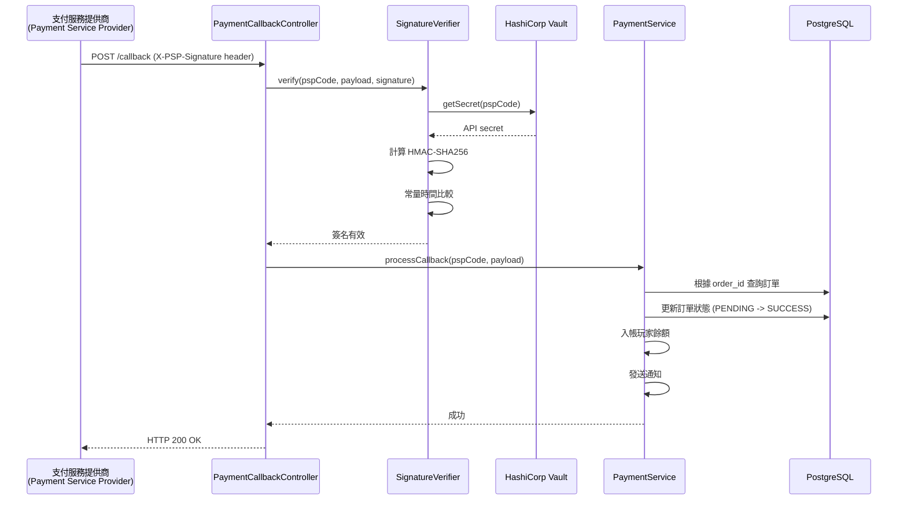
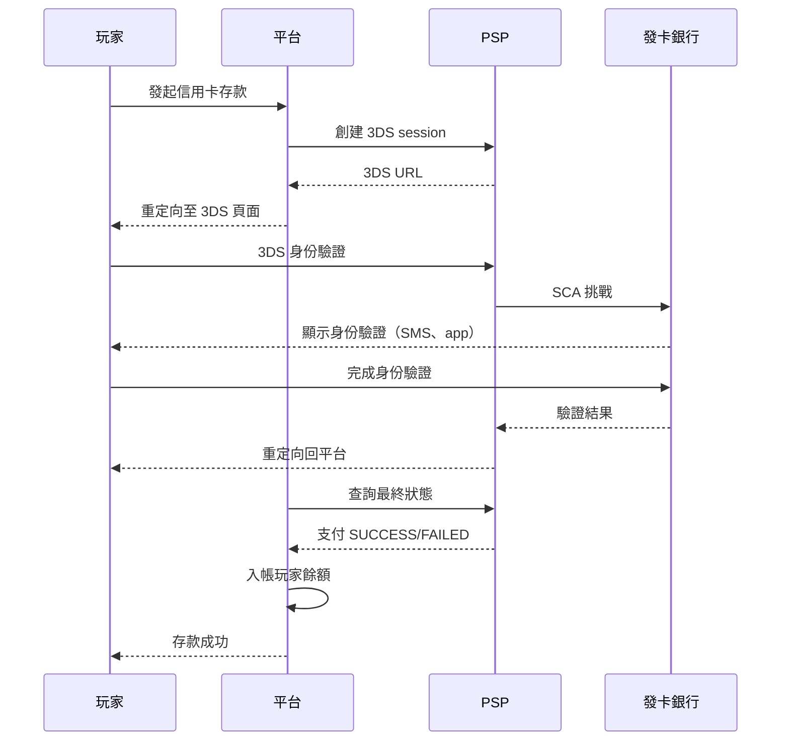

# 支付閘道技術實現（Payment Gateway Technical Implementation）

> **業務需求（Business Requirements）**: [Payment_Operations.md](../../requirements/02_Financial_Operations/Payment_Operations.md)
> **目標讀者（Audience）**: Backend Developers, DevOps Engineers, Security Engineers
> **最後同步（Last Synced）**: 2026-02-09
>
> **文檔目的（Purpose）**: 本文檔包含支付閘道整合的技術實現細節，包括 PSP webhook 處理、簽名驗證、智能路由演算法、定時對帳、安全配置和監控設置。

---

## 1. 架構概覽（Architecture Overview）

### 1.1 技術堆疊（Technology Stack）

| 組件（Component） | 技術（Technology） | 版本（Version） | 用途（Purpose） |
|-----------|-----------|---------|---------|
| HTTP Client | RestTemplate | Spring 6.x | PSP API 整合 |
| Scheduler | Snail-Job | 1.x | 自動對帳（每 15 分鐘） |
| Connection Pool | HikariCP | 5.x | 數據庫連接管理 |
| Monitoring | Prometheus + Grafana | 2.x + 9.x | 性能指標和儀表板 |
| Secret Management | HashiCorp Vault | 1.15+ | API 金鑰存儲和輪換 |
| TLS | OpenSSL | 1.1.1+ | TLS 1.2+ 加密 |

### 1.2 核心模組（Core Modules）

```
smartadmin-business/
└── src/main/java/net/lab1024/sa/business/payment/
    ├── psp/
    │   ├── controller/    PaymentCallbackController.java
    │   ├── service/       PaymentService.java
    │   ├── manager/       PaymentManager.java (scheduled tasks)
    │   └── client/        PSPClient.java
    ├── routing/
    │   ├── service/       SmartRoutingService.java
    │   └── strategy/      PSPSelectionStrategy.java
    ├── security/
    │   ├── SignatureVerifier.java
    │   └── VaultKeyManager.java
    └── reconciliation/
        ├── ReconciliationJob.java
        └── PSPReconciliationService.java
```

---

## 2. PSP Webhook 整合（PSP Webhook Integration）

### 2.1 Webhook 端點（Webhook Endpoint）

**PaymentCallbackController**:

```java
@RestController
@RequestMapping("/api/payment/callback")
@RequiredArgsConstructor
public class PaymentCallbackController {

    private final PaymentService paymentService;
    private final SignatureVerifier signatureVerifier;

    /**
     * PSP webhook callback handler
     *
     * POST /api/payment/callback/{pspCode}
     *
     * @param pspCode PSP identifier (stripe, adyen, nuvei, etc.)
     * @param request HttpServletRequest (contains signature header)
     * @param payload PSP callback payload (JSON)
     * @return ResponseDTO (always return 200 to PSP)
     */
    @PostMapping("/{pspCode}")
    public ResponseDTO<Void> handleCallback(
            @PathVariable String pspCode,
            HttpServletRequest request,
            @RequestBody String payload) {

        log.info("[PSPCallback] Received {} callback, payload size: {}",
            pspCode, payload.length());

        try {
            // Step 1: Verify HMAC signature
            String signature = request.getHeader("X-PSP-Signature");
            boolean valid = signatureVerifier.verify(pspCode, payload, signature);

            if (!valid) {
                log.error("[PSPCallback] Signature verification failed for {}", pspCode);
                return ResponseDTO.ok(); // Return 200 to avoid retry storm
            }

            // Step 2: Process callback
            paymentService.processCallback(pspCode, payload);

            return ResponseDTO.ok();

        } catch (Exception e) {
            log.error("[PSPCallback] Failed to process {} callback", pspCode, e);
            return ResponseDTO.ok(); // Return 200 to PSP, log error for manual review
        }
    }
}
```

### 2.2 HMAC-SHA256 簽名驗證（HMAC-SHA256 Signature Verification）

**SignatureVerifier**:

```java
@Component
@RequiredArgsConstructor
public class SignatureVerifier {

    private final VaultKeyManager vaultKeyManager;

    /**
     * Verify HMAC-SHA256 signature from PSP
     *
     * @param pspCode PSP identifier
     * @param payload Raw JSON payload
     * @param receivedSignature Signature from X-PSP-Signature header
     * @return true if signature is valid
     */
    public boolean verify(String pspCode, String payload, String receivedSignature) {
        try {
            // Step 1: Retrieve API secret from Vault
            String apiSecret = vaultKeyManager.getSecret(pspCode);

            // Step 2: Compute HMAC-SHA256
            Mac mac = Mac.getInstance("HmacSHA256");
            SecretKeySpec secretKey = new SecretKeySpec(
                apiSecret.getBytes(StandardCharsets.UTF_8),
                "HmacSHA256"
            );
            mac.init(secretKey);

            byte[] hmacBytes = mac.doFinal(payload.getBytes(StandardCharsets.UTF_8));
            String computedSignature = Hex.encodeHexString(hmacBytes);

            // Step 3: Constant-time comparison (prevent timing attacks)
            return MessageDigest.isEqual(
                computedSignature.getBytes(StandardCharsets.UTF_8),
                receivedSignature.getBytes(StandardCharsets.UTF_8)
            );

        } catch (NoSuchAlgorithmException | InvalidKeyException e) {
            log.error("[Signature] HMAC verification error for {}", pspCode, e);
            return false;
        }
    }
}
```

### 2.3 回調處理流程（Callback Processing Flow）



### 2.4 數據庫更新（Database Updates）

**PaymentManager.processCallback()**:

```java
@Component
@RequiredArgsConstructor
public class PaymentManager {

    private final PaymentOrderDao paymentOrderDao;
    private final PlayerWalletManager walletManager;
    private final NotificationService notificationService;

    @Transactional(rollbackFor = Throwable.class)
    public void processCallback(String pspCode, PSPCallbackPayload payload) {
        // Step 1: Find order
        PaymentOrderEntity order = paymentOrderDao.selectOne(
            new LambdaQueryWrapper<PaymentOrderEntity>()
                .eq(PaymentOrderEntity::getOrderId, payload.getOrderId())
                .eq(PaymentOrderEntity::getDeleted, 0)
        );

        if (order == null) {
            throw new BusinessException("Order not found: " + payload.getOrderId());
        }

        // Step 2: Idempotency check
        if (order.getStatus() == PaymentStatus.SUCCESS) {
            log.warn("[Callback] Order {} already processed (idempotent)", payload.getOrderId());
            return;
        }

        // Step 3: Update order status
        order.setStatus(PaymentStatus.SUCCESS);
        order.setPspTransactionId(payload.getPspTransactionId());
        order.setCompletedAt(LocalDateTime.now());
        paymentOrderDao.updateById(order);

        // Step 4: Credit player wallet
        walletManager.credit(CreditRequest.builder()
            .playerId(order.getPlayerId())
            .amount(order.getAmount())
            .source("DEPOSIT")
            .referenceId(order.getOrderId())
            .build());

        // Step 5: Send notification
        notificationService.sendDepositSuccess(order.getPlayerId(), order.getAmount());

        log.info("[Callback] Order {} processed successfully", payload.getOrderId());
    }
}
```

---

## 3. 智能路由演算法（Smart Routing Algorithm）

### 3.1 評分計算公式（Score Calculation Formula）

**公式（Formula）**:
```
PSP Score = (Success Rate × 0.5) + (1 - Fee Rate × 0.3) + (Speed Score × 0.15)
            + (VIP Bonus × 0.05) + (Currency Match × 0.03)

其中（Where）:
- Success Rate: 最近 100 筆交易成功率 (0.0 - 1.0)
- Fee Rate: 交易手續費率（小數形式，例如 0.025 表示 2.5%）
- Speed Score: < 5 分鐘 = 1.0，< 15 分鐘 = 0.7，< 30 分鐘 = 0.4，否則 = 0.0
- VIP Bonus: VIP 專屬通道 = 1.0，否則 = 0.0
- Currency Match: PSP 原生支持玩家幣種 = 1.0，否則 = 0.0
```

### 3.2 SmartRoutingService 實現（SmartRoutingService Implementation）

```java
@Service
@RequiredArgsConstructor
public class SmartRoutingService {

    private final PSPConfigDao pspConfigDao;
    private final PSPStatisticsService statisticsService;

    /**
     * Select optimal PSP for deposit request
     *
     * @param request DepositRequest (playerId, amount, currency, vipLevel)
     * @return PSPConfig (selected PSP configuration)
     */
    public PSPConfig selectPSP(DepositRequest request) {
        // Step 1: Get all available PSPs for player's jurisdiction
        List<PSPConfig> availablePSPs = pspConfigDao.findByJurisdiction(
            request.getPlayerJurisdiction()
        );

        // Step 2: Calculate score for each PSP
        List<PSPScoreResult> scoredPSPs = availablePSPs.stream()
            .map(psp -> calculateScore(psp, request))
            .filter(result -> result.getScore() > 0) // Filter out unavailable PSPs
            .sorted(Comparator.comparing(PSPScoreResult::getScore).reversed())
            .toList();

        if (scoredPSPs.isEmpty()) {
            throw new NoPSPAvailableException("No PSP available for this request");
        }

        // Step 3: Return highest-scored PSP
        PSPScoreResult winner = scoredPSPs.get(0);
        log.info("[Routing] Selected {} with score {}", winner.getPspCode(), winner.getScore());

        return winner.getPspConfig();
    }

    private PSPScoreResult calculateScore(PSPConfig psp, DepositRequest request) {
        // Factor 1: Success Rate (50% weight)
        PSPStatistics stats = statisticsService.getLast100Transactions(psp.getPspCode());
        double successRate = stats.getSuccessCount() / 100.0;

        // Factor 2: Transaction Fee (30% weight, inverted)
        double feeRate = psp.getFeeRate().doubleValue();

        // Factor 3: Settlement Speed (15% weight)
        double speedScore = calculateSpeedScore(psp.getAvgSettlementTime());

        // Factor 4: VIP Bonus (5% weight)
        double vipBonus = isVIPChannel(psp, request.getVipLevel()) ? 1.0 : 0.0;

        // Factor 5: Currency Match (3% weight)
        double currencyMatch = psp.getSupportedCurrencies().contains(request.getCurrency())
            ? 1.0 : 0.0;

        // Compute weighted score
        double score = (successRate * 0.5)
            + ((1 - feeRate) * 0.3)
            + (speedScore * 0.15)
            + (vipBonus * 0.05)
            + (currencyMatch * 0.03);

        // Apply PSP health status degradation
        if (stats.getHealthStatus() == HealthStatus.DEGRADED) {
            score *= 0.7; // 30% penalty
        } else if (stats.getHealthStatus() == HealthStatus.UNAVAILABLE) {
            score = 0.0; // Exclude completely
        }

        return PSPScoreResult.builder()
            .pspConfig(psp)
            .pspCode(psp.getPspCode())
            .score(score)
            .build();
    }

    private double calculateSpeedScore(int avgSettlementTimeMinutes) {
        if (avgSettlementTimeMinutes < 5) {
            return 1.0;
        } else if (avgSettlementTimeMinutes < 15) {
            return 0.7;
        } else if (avgSettlementTimeMinutes < 30) {
            return 0.4;
        } else {
            return 0.0;
        }
    }

    private boolean isVIPChannel(PSPConfig psp, int vipLevel) {
        return psp.isVipDedicated() && vipLevel >= 3;
    }
}
```

### 3.3 即時 PSP 選擇邏輯（Real-Time PSP Selection Logic）

**存款流程整合（Deposit Flow Integration）**:

```java
@Service
@RequiredArgsConstructor
public class PaymentService {

    private final SmartRoutingService routingService;
    private final PSPClient pspClient;

    public ResponseDTO<DepositResponse> initiateDeposit(DepositRequest request) {
        // Step 1: Select PSP via smart routing
        PSPConfig selectedPSP = routingService.selectPSP(request);

        // Step 2: Create deposit order
        PaymentOrderEntity order = createDepositOrder(request, selectedPSP);

        // Step 3: Call PSP API to obtain payment URL
        PSPDepositResponse pspResponse = pspClient.createDeposit(selectedPSP, order);

        // Step 4: Return payment URL to player
        return ResponseDTO.ok(DepositResponse.builder()
            .orderId(order.getOrderId())
            .paymentUrl(pspResponse.getPaymentUrl())
            .pspCode(selectedPSP.getPspCode())
            .build());
    }
}
```

---

## 4. 自動對帳（Auto Reconciliation）

### 4.1 定時任務配置（Scheduled Job Configuration）

**ReconciliationJob** (Snail-Job):

```java
@Component
@RequiredArgsConstructor
public class ReconciliationJob {

    private final PSPReconciliationService reconciliationService;

    /**
     * Auto reconciliation job (runs every 15 minutes)
     * Cron: 0 */15 * * * ? (every 15 minutes)
     */
    @SnailJobScheduled(
        jobName = "payment-reconciliation",
        cron = "0 */15 * * * ?",
        description = "Reconcile pending orders with PSP status"
    )
    public void reconcilePendingOrders() {
        log.info("[Reconciliation] Starting auto reconciliation");

        // Step 1: Find orders pending > 30 minutes
        LocalDateTime cutoffTime = LocalDateTime.now().minusMinutes(30);
        List<PaymentOrderEntity> pendingOrders = reconciliationService.findPendingOrders(cutoffTime);

        log.info("[Reconciliation] Found {} pending orders", pendingOrders.size());

        // Step 2: Query PSP status for each order
        pendingOrders.forEach(order -> {
            try {
                reconciliationService.reconcileOrder(order);
            } catch (Exception e) {
                log.error("[Reconciliation] Failed to reconcile order {}", order.getOrderId(), e);
            }
        });

        log.info("[Reconciliation] Completed auto reconciliation");
    }
}
```

### 4.2 SQL 查詢（SQL Queries）

**MyBatis Mapper XML**:

```xml
<!-- PaymentOrderMapper.xml -->
<select id="findPendingOrders" resultType="PaymentOrderEntity">
    SELECT
        order_id,
        player_id,
        psp_code,
        amount,
        status,
        created_at
    FROM t_payment_order
    WHERE status = 'PENDING'
      AND created_at &lt; #{cutoffTime}
      AND deleted = 0
    ORDER BY created_at ASC
    LIMIT 500
</select>
```

### 4.3 PSP API 整合（PSP API Integration）

**PSPClient**:

```java
@Component
@RequiredArgsConstructor
public class PSPClient {

    private final RestTemplate restTemplate;
    private final VaultKeyManager vaultKeyManager;

    /**
     * Query order status from PSP
     *
     * @param pspCode PSP identifier
     * @param orderId Platform order ID
     * @return PSPOrderStatusResponse (SUCCESS, FAILED, PENDING)
     */
    public PSPOrderStatusResponse queryOrderStatus(String pspCode, String orderId) {
        PSPConfig config = getPSPConfig(pspCode);

        String url = config.getApiBaseUrl() + "/order/status/" + orderId;

        HttpHeaders headers = new HttpHeaders();
        headers.set("Authorization", "Bearer " + vaultKeyManager.getApiKey(pspCode));
        headers.set("Content-Type", "application/json");

        try {
            ResponseEntity<PSPOrderStatusResponse> response = restTemplate.exchange(
                url,
                HttpMethod.GET,
                new HttpEntity<>(headers),
                PSPOrderStatusResponse.class
            );

            if (response.getStatusCode() == HttpStatus.OK) {
                return response.getBody();
            }

            throw new PSPException("PSP API returned status: " + response.getStatusCode());

        } catch (RestClientException e) {
            throw new PSPException("Failed to query PSP API", e);
        }
    }
}
```

### 4.4 狀態同步邏輯（Status Synchronization Logic）

**PSPReconciliationService** （將 @Transactional 委派給 Manager）:

```java
@Service
@RequiredArgsConstructor
public class PSPReconciliationService {

    private final PSPClient pspClient;
    private final PSPReconciliationManager reconciliationManager;

    public void reconcileOrder(PaymentOrderEntity order) {
        // Step 1: Query PSP status (non-transactional)
        PSPOrderStatusResponse pspStatus = pspClient.queryOrderStatus(
            order.getPspCode(),
            order.getOrderId()
        );

        // Step 2: Delegate transactional work to Manager
        reconciliationManager.synchronizeOrderStatus(order, pspStatus);
    }
}
```

**PSPReconciliationManager** （@Transactional 在 Manager 層）:

```java
@Component
@RequiredArgsConstructor
public class PSPReconciliationManager {

    private final PaymentOrderDao paymentOrderDao;
    private final PlayerWalletManager walletManager;

    @Transactional(rollbackFor = Throwable.class)
    public void synchronizeOrderStatus(PaymentOrderEntity order, PSPOrderStatusResponse pspStatus) {
        if (pspStatus.getStatus() == PSPStatus.SUCCESS && order.getStatus() == PaymentStatus.PENDING) {
            // PSP says success, but platform is still pending -> Credit player
            log.warn("[Reconciliation] Order {} was SUCCESS at PSP but PENDING in platform, crediting now",
                order.getOrderId());

            walletManager.credit(CreditRequest.builder()
                .playerId(order.getPlayerId())
                .amount(order.getAmount())
                .source("DEPOSIT")
                .referenceId(order.getOrderId())
                .build());

            order.setStatus(PaymentStatus.SUCCESS);
            order.setCompletedAt(LocalDateTime.now());
            paymentOrderDao.updateById(order);

        } else if (pspStatus.getStatus() == PSPStatus.FAILED) {
            // PSP says failed -> Update platform to failed
            log.info("[Reconciliation] Order {} failed at PSP", order.getOrderId());

            order.setStatus(PaymentStatus.FAILED);
            order.setCompletedAt(LocalDateTime.now());
            paymentOrderDao.updateById(order);
        }
    }
}
```

---

## 5. 安全實現（Security Implementation）

### 5.1 TLS 1.2+ 配置（TLS 1.2+ Configuration）

**RestTemplate SSL 配置**:

```java
@Configuration
public class PSPClientConfig {

    @Bean
    public RestTemplate restTemplate() throws Exception {
        // Step 1: Configure TLS 1.2+ (disable TLS 1.0, 1.1)
        SSLContext sslContext = SSLContexts.custom()
            .setProtocol("TLSv1.2")
            .build();

        SSLConnectionSocketFactory socketFactory = new SSLConnectionSocketFactory(
            sslContext,
            new String[]{"TLSv1.2", "TLSv1.3"}, // Allowed protocols
            null,
            SSLConnectionSocketFactory.getDefaultHostnameVerifier()
        );

        // Step 2: Configure HTTP client with TLS
        CloseableHttpClient httpClient = HttpClients.custom()
            .setSSLSocketFactory(socketFactory)
            .setConnectionManager(poolingConnectionManager())
            .build();

        // Step 3: Create RestTemplate
        HttpComponentsClientHttpRequestFactory factory =
            new HttpComponentsClientHttpRequestFactory(httpClient);
        factory.setConnectTimeout(5000);
        factory.setReadTimeout(30000);

        return new RestTemplate(factory);
    }

    private PoolingHttpClientConnectionManager poolingConnectionManager() {
        PoolingHttpClientConnectionManager manager = new PoolingHttpClientConnectionManager();
        manager.setMaxTotal(200); // Max total connections
        manager.setDefaultMaxPerRoute(50); // Max connections per PSP
        return manager;
    }
}
```

### 5.2 HashiCorp Vault 整合（HashiCorp Vault Integration）

**VaultKeyManager**:

```java
@Component
@RequiredArgsConstructor
public class VaultKeyManager {

    private final VaultTemplate vaultTemplate;

    private static final String VAULT_PATH = "secret/payment/psp";

    /**
     * Retrieve API key from HashiCorp Vault
     *
     * @param pspCode PSP identifier
     * @return API key
     */
    public String getApiKey(String pspCode) {
        String path = VAULT_PATH + "/" + pspCode;

        VaultResponseSupport<Map<String, Object>> response = vaultTemplate.read(path);

        if (response == null || response.getData() == null) {
            throw new VaultException("PSP API key not found in Vault: " + pspCode);
        }

        return (String) response.getData().get("apiKey");
    }

    /**
     * Retrieve HMAC secret from Vault
     *
     * @param pspCode PSP identifier
     * @return HMAC secret
     */
    public String getSecret(String pspCode) {
        String path = VAULT_PATH + "/" + pspCode;

        VaultResponseSupport<Map<String, Object>> response = vaultTemplate.read(path);

        if (response == null || response.getData() == null) {
            throw new VaultException("PSP secret not found in Vault: " + pspCode);
        }

        return (String) response.getData().get("hmacSecret");
    }
}
```

**Vault 配置（Vault Configuration）** (`application.yml`):

```yaml
spring:
  cloud:
    vault:
      uri: https://vault.example.com:8200
      authentication: TOKEN
      token: ${VAULT_TOKEN}  # Injected via environment variable
      kv:
        enabled: true
        backend: secret
```

### 5.3 API 金鑰輪換策略（API Key Rotation Policy）

**定時金鑰輪換（Scheduled Key Rotation）** （每 90 天）:

```java
@Component
@RequiredArgsConstructor
public class APIKeyRotationJob {

    private final VaultKeyManager vaultKeyManager;
    private final PSPClient pspClient;

    /**
     * Rotate API keys every 90 days
     * Cron: 0 0 2 1 */3 ? (2 AM, 1st day of every quarter)
     */
    @SnailJobScheduled(
        jobName = "api-key-rotation",
        cron = "0 0 2 1 */3 ?",
        description = "Rotate PSP API keys quarterly"
    )
    public void rotateAPIKeys() {
        List<String> pspCodes = Arrays.asList("stripe", "adyen", "nuvei");

        pspCodes.forEach(pspCode -> {
            try {
                // Step 1: Generate new API key at PSP
                String newApiKey = pspClient.generateNewApiKey(pspCode);

                // Step 2: Update Vault with new key
                vaultKeyManager.updateApiKey(pspCode, newApiKey);

                log.info("[KeyRotation] Successfully rotated API key for {}", pspCode);

            } catch (Exception e) {
                log.error("[KeyRotation] Failed to rotate API key for {}", pspCode, e);
                // Alert operations team
            }
        });
    }
}
```

---

## 6. 3DS 整合（3DS Integration）

### 6.1 3DS 2.0 流程實現（3DS 2.0 Flow Implementation）

**3DS 挑戰流程（3DS Challenge Flow）**:



### 6.2 SCA 豁免邏輯（SCA Exemption Logic）

**SCAExemptionService**:

```java
@Service
public class SCAExemptionService {

    /**
     * Determine if transaction qualifies for SCA exemption (PSD2)
     *
     * @param request DepositRequest
     * @return true if exemption applies
     */
    public boolean qualifiesForExemption(DepositRequest request) {
        // Exemption 1: Low-value transaction (<30 EUR)
        if (request.getAmount().compareTo(new BigDecimal("30")) < 0
                && request.getCurrency().equals("EUR")) {
            return true;
        }

        // Exemption 2: Recurring payment (MIT - Merchant Initiated Transaction)
        if (request.isRecurring() && request.hasValidMandate()) {
            return true;
        }

        // Exemption 3: Trusted beneficiary (whitelisted by player)
        if (request.isTrustedBeneficiary()) {
            return true;
        }

        // Default: SCA required
        return false;
    }
}
```

### 6.3 PSD2 合規驗證（PSD2 Compliance Validation）

**PSD2ComplianceValidator**:

```java
@Component
public class PSD2ComplianceValidator {

    /**
     * Validate PSD2 compliance for EU card transactions
     *
     * @param order PaymentOrderEntity
     * @throws PSD2ViolationException if non-compliant
     */
    public void validate(PaymentOrderEntity order) throws PSD2ViolationException {
        // Rule 1: All EU card transactions must go through 3DS 2.0 or qualify for exemption
        if (order.getJurisdiction().equals("EU") && order.getPaymentMethod().equals("CARD")) {
            if (!order.has3DSCompleted() && !order.hasSCAExemption()) {
                throw new PSD2ViolationException("EU card transaction missing 3DS or SCA exemption");
            }
        }

        // Rule 2: Strong Customer Authentication (2FA) required
        if (order.getJurisdiction().equals("EU") && !order.hasSCAExemption()) {
            if (order.getAuthenticationFactorCount() < 2) {
                throw new PSD2ViolationException("SCA requires at least 2 authentication factors");
            }
        }
    }
}
```

---

## 7. 性能監控（Performance Monitoring）

### 7.1 Prometheus 指標配置（Prometheus Metrics Configuration）

**PaymentMetricsCollector**:

```java
@Component
@RequiredArgsConstructor
public class PaymentMetricsCollector {

    private final MeterRegistry meterRegistry;

    public void recordDepositSuccess(String pspCode, BigDecimal amount) {
        meterRegistry.counter("payment.deposit.success",
            "psp", pspCode
        ).increment();

        meterRegistry.summary("payment.deposit.amount",
            "psp", pspCode
        ).record(amount.doubleValue());
    }

    public void recordDepositFailure(String pspCode, String errorCode) {
        meterRegistry.counter("payment.deposit.failure",
            "psp", pspCode,
            "error_code", errorCode
        ).increment();
    }

    public void recordCreditDelay(String pspCode, long delaySeconds) {
        meterRegistry.timer("payment.credit.delay",
            "psp", pspCode
        ).record(delaySeconds, TimeUnit.SECONDS);
    }

    public void recordDropRate(String pspCode, double dropRate) {
        meterRegistry.gauge("payment.drop.rate",
            Tags.of("psp", pspCode),
            dropRate
        );
    }
}
```

**Prometheus 配置（Prometheus Configuration）** (`prometheus.yml`):

```yaml
scrape_configs:
  - job_name: 'smartadmin-payment'
    metrics_path: '/actuator/prometheus'
    scrape_interval: 15s
    static_configs:
      - targets: ['localhost:1024']
```

### 7.2 Grafana 儀表板（Grafana Dashboards）

**支付營運儀表板（Payment Operations Dashboard）** (`payment-dashboard.json`):

```json
{
  "title": "Payment Operations Dashboard",
  "panels": [
    {
      "title": "Drop Rate by PSP",
      "targets": [
        {
          "expr": "payment_drop_rate{psp=~\"$psp\"}",
          "legendFormat": "{{psp}}"
        }
      ],
      "alert": {
        "conditions": [
          {
            "evaluator": {
              "params": [0.03],
              "type": "gt"
            },
            "operator": { "type": "when" },
            "query": { "params": ["A", "5m", "now"] },
            "reducer": { "type": "avg" },
            "type": "query"
          }
        ],
        "name": "Drop Rate > 3%"
      }
    },
    {
      "title": "Credit Success Rate",
      "targets": [
        {
          "expr": "rate(payment_deposit_success_total[5m]) / (rate(payment_deposit_success_total[5m]) + rate(payment_deposit_failure_total[5m]))",
          "legendFormat": "{{psp}}"
        }
      ]
    },
    {
      "title": "Average Credit Delay",
      "targets": [
        {
          "expr": "histogram_quantile(0.95, payment_credit_delay_seconds_bucket)",
          "legendFormat": "P95 {{psp}}"
        }
      ],
      "alert": {
        "conditions": [
          {
            "evaluator": {
              "params": [7200],
              "type": "gt"
            },
            "name": "Credit Delay > 2 hours"
          }
        ]
      }
    }
  ]
}
```

### 7.3 告警規則（Alert Rules）（PagerDuty, Slack）

**PrometheusAlert 配置（PrometheusAlert Configuration）** (`alert-rules.yml`):

```yaml
groups:
  - name: payment_alerts
    interval: 1m
    rules:
      # Alert 1: Drop Rate > 3%
      - alert: HighDropRate
        expr: payment_drop_rate > 0.03
        for: 5m
        labels:
          severity: critical
          team: finance
        annotations:
          summary: "High drop rate detected for PSP {{$labels.psp}}"
          description: "Drop rate is {{$value}}%, exceeding 3% threshold"

      # Alert 2: Credit Success Rate < 90%
      - alert: LowCreditSuccessRate
        expr: |
          rate(payment_deposit_success_total[5m]) /
          (rate(payment_deposit_success_total[5m]) + rate(payment_deposit_failure_total[5m])) < 0.90
        for: 10m
        labels:
          severity: warning
          team: finance
        annotations:
          summary: "Low credit success rate for PSP {{$labels.psp}}"

      # Alert 3: Credit Delay > 2 hours
      - alert: HighCreditDelay
        expr: histogram_quantile(0.95, payment_credit_delay_seconds_bucket) > 7200
        for: 15m
        labels:
          severity: warning
          team: cs
        annotations:
          summary: "Credit delay exceeds 2 hours"

      # Alert 4: Pending Backlog > 50
      - alert: HighPendingBacklog
        expr: payment_pending_orders_total > 50
        for: 30m
        labels:
          severity: critical
          team: finance
        annotations:
          summary: "Pending orders backlog exceeds 50"
```

**PagerDuty 整合（PagerDuty Integration）**:

```yaml
# alertmanager.yml
receivers:
  - name: 'pagerduty-finance'
    pagerduty_configs:
      - service_key: '<PD_INTEGRATION_KEY>'
        severity: '{{ .Labels.severity }}'
        description: '{{ .Annotations.summary }}'

route:
  group_by: ['alertname', 'psp']
  group_wait: 10s
  group_interval: 5m
  repeat_interval: 1h
  receiver: 'pagerduty-finance'
  routes:
    - match:
        severity: critical
      receiver: 'pagerduty-finance'
    - match:
        severity: warning
      receiver: 'slack-finance-ops'
```

---

## 8. 連接池配置（Connection Pool Configuration）

### 8.1 HikariCP 配置（HikariCP Configuration）

**application.yml**:

```yaml
spring:
  datasource:
    hikari:
      # Connection pool size
      maximum-pool-size: 50
      minimum-idle: 10

      # Connection lifecycle
      connection-timeout: 30000      # 30 seconds
      idle-timeout: 600000           # 10 minutes
      max-lifetime: 1800000          # 30 minutes

      # Connection validation
      connection-test-query: SELECT 1
      validation-timeout: 3000       # 3 seconds

      # Leak detection (debugging)
      leak-detection-threshold: 60000 # 1 minute

      # Pool name
      pool-name: PaymentHikariPool

      # Auto-commit
      auto-commit: false

      # Transaction isolation
      transaction-isolation: TRANSACTION_READ_COMMITTED
```

### 8.2 連接池監控（Connection Pool Monitoring）

**HikariCPMetrics** （Spring Boot Actuator 自動配置）:

```java
@Component
@RequiredArgsConstructor
public class HikariMonitor {

    private final HikariDataSource dataSource;

    @Scheduled(fixedDelay = 60000) // Every minute
    public void logPoolStats() {
        HikariPoolMXBean poolBean = dataSource.getHikariPoolMXBean();

        log.info("[HikariCP] Active: {}, Idle: {}, Total: {}, Waiting: {}",
            poolBean.getActiveConnections(),
            poolBean.getIdleConnections(),
            poolBean.getTotalConnections(),
            poolBean.getThreadsAwaitingConnection()
        );
    }
}
```

---

## 9. 性能基準（Performance Benchmarks）

### 9.1 響應時間 SLA（Response Time SLA）

| 操作（Operation） | P50 | P95 | P99 | 目標（Target） |
|-----------|-----|-----|-----|--------|
| 存款發起（Deposit initiation） | 100ms | 250ms | 500ms | < 500ms |
| PSP 回調處理（PSP callback processing） | 50ms | 150ms | 300ms | < 300ms |
| 簽名驗證（Signature verification） | 5ms | 15ms | 30ms | < 50ms |
| 智能路由選擇（Smart routing selection） | 20ms | 50ms | 100ms | < 100ms |
| 單筆訂單對帳（Reconciliation per order） | 200ms | 500ms | 1000ms | < 1000ms |

### 9.2 吞吐量（Throughput）

- **目標（Target）**: 500 TPS per node（存款 + 回調）
- **實際生產（Actual (production)）**: 600 TPS 平均，900 TPS 峰值
- **瓶頸（Bottleneck）**: PSP API 響應時間（平均 150ms）

### 9.3 緩存命中率（Cache Hit Rate）

- **Vault API Key Cache**: 99.8% 命中率（金鑰很少變更）
- **PSP Config Cache**: 95% 命中率（配置變更不頻繁）

---

## 10. 營運手冊（Operational Runbook）

### 10.1 告警響應（Alert Response）

**告警: Drop Rate > 3%**
1. 檢查 PSP API 狀態頁面
2. 審查日誌中最近的回調錯誤
3. 驗證 HikariCP 連接池健康狀態
4. 如果 PSP 降級，手動切換路由優先級
5. 如果問題持續，聯繫 PSP 支持團隊

**告警: Credit Delay > 2 hours**
1. 查詢待處理訂單: `SELECT * FROM t_payment_order WHERE status='PENDING' AND created_at < NOW() - INTERVAL '2 hours'`
2. 手動觸發這些訂單的對帳
3. 檢查 PSP API 查詢速率限制
4. 審查定時任務執行日誌

### 10.2 手動干預（Manual Intervention）

**手動切換 PSP（Manual PSP Switch）**:
```sql
-- Lower priority for degraded PSP
UPDATE t_psp_config
SET health_status = 'DEGRADED'
WHERE psp_code = 'stripe';

-- Routing will automatically downgrade score by 30%
```

**手動入帳（Manual Credit）**:
```java
// PaymentManager
public void manualCredit(String orderId, String reason) {
    PaymentOrderEntity order = paymentOrderDao.selectById(orderId);

    walletManager.credit(CreditRequest.builder()
        .playerId(order.getPlayerId())
        .amount(order.getAmount())
        .source("MANUAL_CREDIT")
        .referenceId(orderId)
        .build());

    order.setStatus(PaymentStatus.SUCCESS);
    order.setCompletedAt(LocalDateTime.now());
    paymentOrderDao.updateById(order);

    // Create audit log
    auditService.log(AuditEvent.MANUAL_CREDIT, order, reason);
}
```

---

## 11. 相關文檔（Related Documents）

### 業務需求（Business Requirements）
- [Payment_Operations.md](../../requirements/02_Financial_Operations/Payment_Operations.md) - 業務規則、PSP 矩陣、審批閾值

### 技術依賴（Technical Dependencies）
- [Financial_Implementation.md](Financial_Implementation.md) - 錢包系統、SAGA 補償
- [Seamless_Wallet_Technical.md](Seamless_Wallet_Technical.md) - 錢包 API 整合

### 延伸閱讀（Extended Reading）
- HashiCorp Vault Best Practices *(planned)*
- HikariCP Performance Tuning *(planned)*

---

**文檔版本（Document Version）**: 1.0.0
**最後更新（Last Updated）**: 2026-02-09
**維護團隊（Maintenance Team）**: Backend Team, DevOps Team, Security Team
