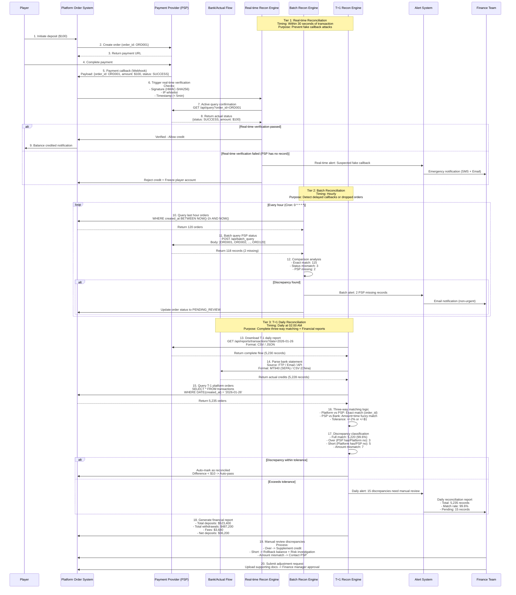
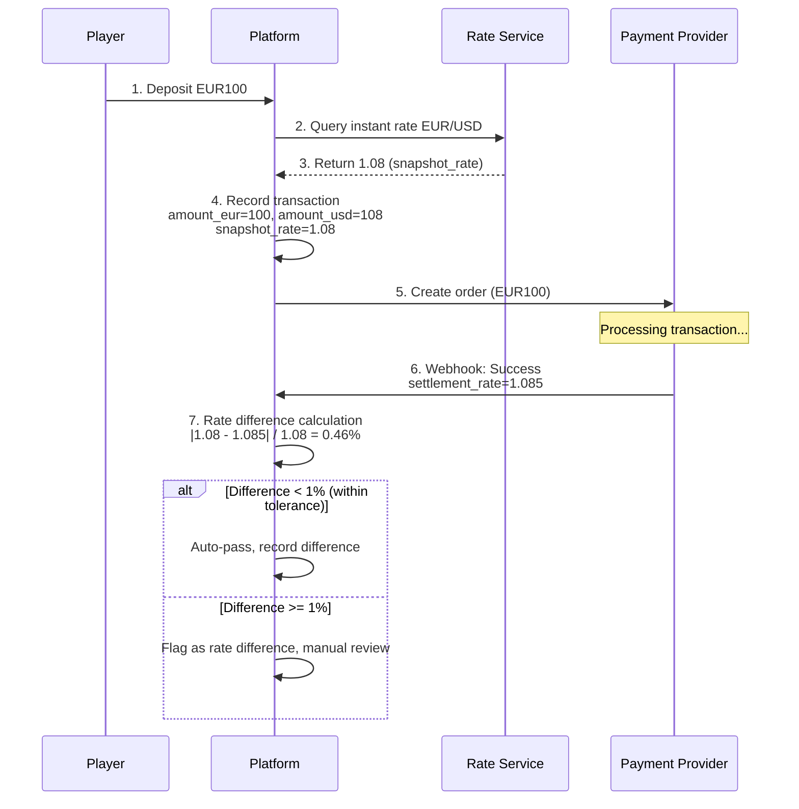
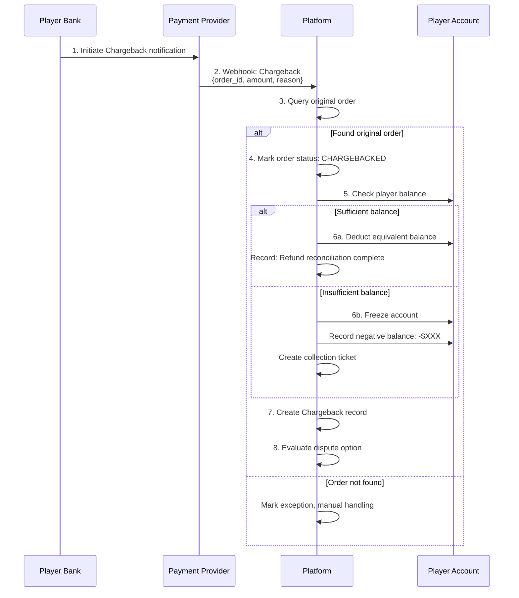
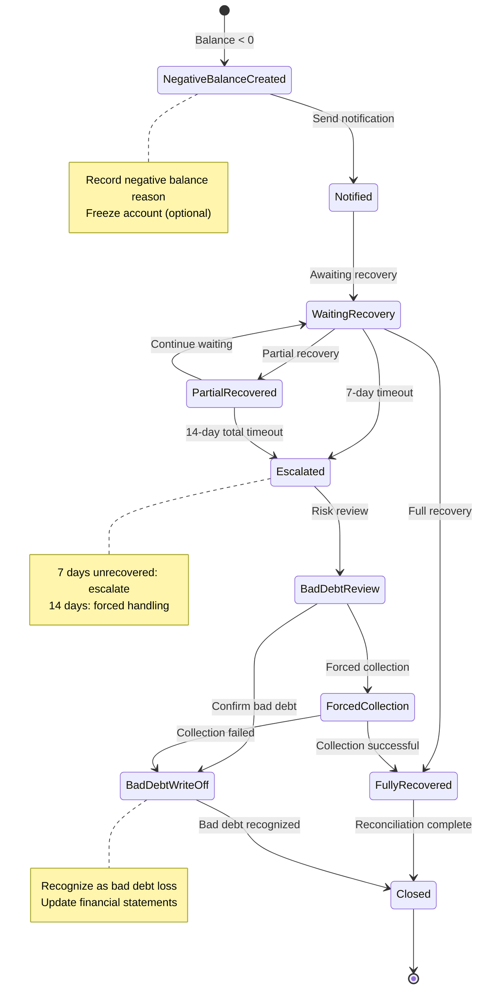
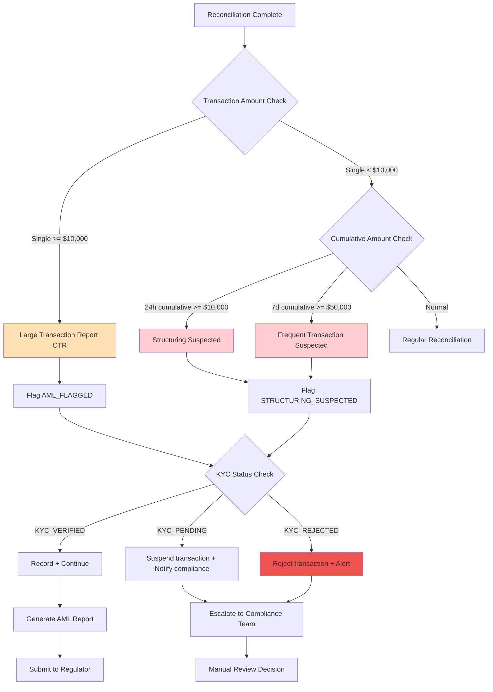
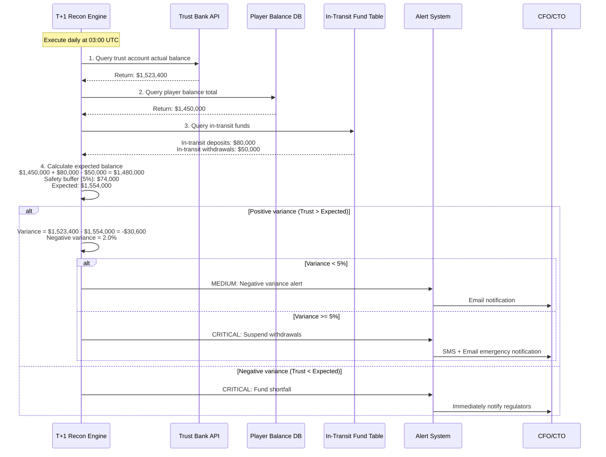
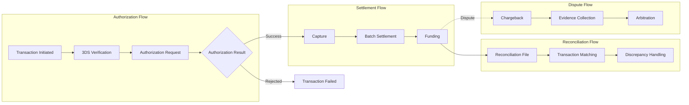
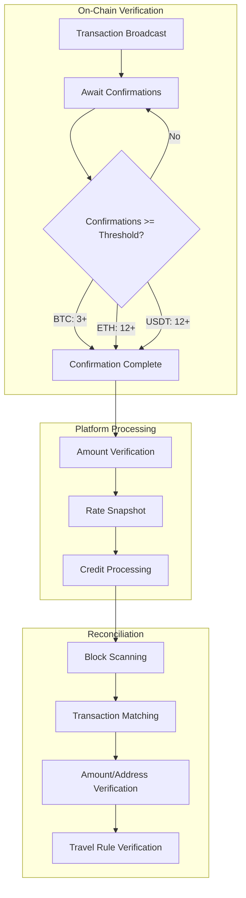

# Reconciliation System Technical Architecture

> **Canonical Source**: [02-03_Reconciliation_System.md](../../source/02_Finance_Center/02-03_Reconciliation_System.md)
> **Audience**: Architects, Backend Developers, DevOps Engineers, System Integration Engineers
> **Business Requirements**: [Reconciliation_Requirements.md](../../requirements/02_Financial_Operations/Reconciliation_Requirements.md)
> **Last Synced**: 2026-02-09
>
> **Technical Focus**: This document contains implementation details (PostgreSQL/S3 Glacier storage architecture, UTC timezone conversion algorithms, 3DS verification protocols, blockchain confirmation mechanisms) extracted from Requirements layer.

---

## 1. System Architecture Overview

The Reconciliation System implements a three-tier architecture for comparing internal ledger with external statements:

- **Tier 1 (Real-time)**: Transaction-level verification within 30 seconds
- **Tier 2 (Batch)**: Hourly batch reconciliation
- **Tier 3 (T+1 Daily)**: Complete three-way matching with financial reporting

---

## 2. Three-Tier Reconciliation Architecture

### 2.1 Architecture Diagram



---

## 3. Matching Algorithm

### 3.1 Matching Priority Levels

1. **Exact Match**:
   - Condition: `Platform.order_id = PSP.merchant_order_id`
   - Status: Auto-mark as reconciled

2. **Fuzzy Match (Amount + Time)**:
   - Condition: `ABS(Platform.amount - PSP.amount) < $1 AND ABS(Platform.time - PSP.time) < 10 minutes`
   - Status: Requires manual review confirmation

3. **Unmatched**:
   - Condition: No corresponding record found in PSP report
   - Status: Flag as discrepancy, trigger alert

### 3.2 SQL Implementation Example

```sql
-- Three-way matching query
SELECT
    p.order_id,
    p.amount AS platform_amount,
    p.status AS platform_status,
    p.created_at AS platform_time,
    psp.merchant_order_id,
    psp.amount AS psp_amount,
    psp.status AS psp_status,
    psp.transaction_time AS psp_time,
    CASE
        WHEN psp.id IS NULL THEN 'SHORT'
        WHEN ABS(p.amount - psp.amount) < 1.00 THEN 'MATCHED'
        WHEN ABS(p.amount - psp.amount) / p.amount < 0.02 THEN 'WITHIN_TOLERANCE'
        ELSE 'AMOUNT_MISMATCH'
    END AS match_status
FROM t_platform_order p
LEFT JOIN t_psp_transaction psp ON p.order_id = psp.merchant_order_id
WHERE p.created_at BETWEEN DATE_SUB(CURDATE(), INTERVAL 1 DAY) AND CURDATE();
```

---

## 4. Automated Reconciliation Scripts

### 4.1 Python Implementation (Daily T+1 Reconciliation)

```python
#!/usr/bin/env python3
"""
Daily T+1 Reconciliation Script
Execution: 02:00 UTC daily
Author: SmartAdmin Finance Team
"""

import asyncio
from datetime import date, timedelta
from decimal import Decimal
from typing import List, Tuple
import logging

from reconciliation import (
    PSPReportFetcher,
    PlatformOrderFetcher,
    BankStatementParser,
    ThreeWayMatcher,
    DiscrepancyHandler,
    ReconciliationReporter
)

logging.basicConfig(level=logging.INFO)
logger = logging.getLogger(__name__)

# Configuration
TOLERANCE_AMOUNT = Decimal("1.00")       # $1 tolerance
TOLERANCE_PERCENT = Decimal("0.02")      # 2% tolerance
AUTO_APPROVE_THRESHOLD = Decimal("10.00") # Auto-approve if diff < $10


async def run_daily_reconciliation() -> None:
    """Execute daily T+1 three-way reconciliation."""
    target_date = date.today() - timedelta(days=1)
    logger.info(f"Starting T+1 reconciliation for {target_date}")

    try:
        # Step 1: Fetch data from all sources concurrently
        platform_data, psp_data, bank_data = await asyncio.gather(
            PlatformOrderFetcher.fetch(target_date),
            PSPReportFetcher.fetch_all(target_date),
            BankStatementParser.parse(target_date)
        )

        logger.info(f"Fetched: Platform={len(platform_data)}, "
                   f"PSP={len(psp_data)}, Bank={len(bank_data)}")

        # Step 2: Three-way matching
        results = ThreeWayMatcher.match(
            platform=platform_data,
            psp=psp_data,
            bank=bank_data,
            tolerance={
                'amount': TOLERANCE_AMOUNT,
                'percent': TOLERANCE_PERCENT,
                'time_minutes': 10
            }
        )

        logger.info(f"Matching complete: {results.summary()}")

        # Step 3: Handle discrepancies
        for discrepancy in results.discrepancies:
            if discrepancy.amount < AUTO_APPROVE_THRESHOLD:
                await DiscrepancyHandler.auto_approve(discrepancy)
            else:
                await DiscrepancyHandler.queue_for_review(discrepancy)

        # Step 4: Generate report
        report = await ReconciliationReporter.generate_daily(
            target_date, results
        )
        logger.info(f"Report generated: {report.report_id}")

    except Exception as e:
        logger.error(f"Reconciliation failed: {e}")
        raise


if __name__ == "__main__":
    asyncio.run(run_daily_reconciliation())
```

### 4.2 Java Implementation (Daily T+1 Reconciliation)

```java
@Service
@RequiredArgsConstructor
@Slf4j
public class DailyReconciliationJob {

    private final PspReportService pspReportService;
    private final PlatformOrderService platformOrderService;
    private final ThreeWayMatchingService matchingService;
    private final DiscrepancyService discrepancyService;

    /**
     * Daily T+1 reconciliation task
     * Cron: 0 0 2 * * ? (Execute at 02:00 daily)
     */
    @Scheduled(cron = "0 0 2 * * ?")
    public void executeDailyReconciliation() {
        LocalDate targetDate = LocalDate.now().minusDays(1);
        log.info("Starting T+1 reconciliation for {}", targetDate);

        // 1. Fetch data
        List<PlatformOrder> platformOrders = platformOrderService.findByDate(targetDate);
        List<PspTransaction> pspTransactions = pspReportService.fetchAllPsp(targetDate);

        // 2. Execute three-way matching
        ReconciliationResult result = matchingService.threeWayMatch(
            platformOrders,
            pspTransactions,
            MatchingConfig.builder()
                .toleranceAmount(new BigDecimal("1.00"))
                .tolerancePercent(new BigDecimal("0.02"))
                .build()
        );

        // 3. Handle discrepancies
        for (Discrepancy disc : result.getDiscrepancies()) {
            discrepancyService.process(disc);
        }

        log.info("Reconciliation complete: matched={}, discrepancies={}",
            result.getMatchedCount(), result.getDiscrepancies().size());
    }
}
```

---

## 5. Discrepancy Handling Decision Matrix

```mermaid
flowchart TD
    START[Reconciliation Complete] --> ANALYZE{Discrepancy Analysis}

    ANALYZE -->|No discrepancy| PERFECT_MATCH[Full Match<br/>order_id consistent<br/>amount consistent<br/>status consistent]
    PERFECT_MATCH --> AUTO_MARK[Auto-mark: RECONCILED<br/>Update reconciliation_status]
    AUTO_MARK --> REPORT_OK[Count as success]

    ANALYZE -->|Has discrepancy| CLASSIFY{Classify Discrepancy Type}

    %% Type A: Over Payment
    CLASSIFY -->|Type A: Over| OVER_PAYMENT[Over Payment Detected<br/>PSP has record<br/>Platform has no order]

    OVER_PAYMENT --> OVER_AMOUNT{Amount Check}
    OVER_AMOUNT -->|Amount < $10| OVER_SMALL[Small over payment<br/>Possibly test transaction]
    OVER_SMALL --> VERIFY_TEST{Verify test env?}
    VERIFY_TEST -->|Is test| IGNORE[Ignore + Mark TEST<br/>Exclude from financial report]
    VERIFY_TEST -->|Not test| OVER_SMALL_REAL[Real small over]

    OVER_AMOUNT -->|$10 <= Amount < $1000| OVER_MEDIUM[Medium over<br/>Investigate but not urgent]
    OVER_AMOUNT -->|Amount >= $1000| OVER_LARGE[Large over<br/>High priority investigation]

    OVER_SMALL_REAL --> FIND_PLAYER{Query player info}
    OVER_MEDIUM --> FIND_PLAYER
    OVER_LARGE --> FIND_PLAYER

    FIND_PLAYER -->|Found player| CHECK_PENDING{Check pending orders?}
    CHECK_PENDING -->|Same amount pending| LIKELY_DROPPED[Suspected dropped order<br/>Time window: +/-30 min<br/>Amount matches]
    CHECK_PENDING -->|No matching order| MANUAL_CREDIT_NEEDED[Finance decides supplement]

    FIND_PLAYER -->|Player not found| UNKNOWN_SOURCE[Unknown source<br/>Possibly mis-transfer]

    LIKELY_DROPPED --> AUTO_CREDIT{Auto-supplement check}
    AUTO_CREDIT -->|Amount < $100 AND trusted player| AUTO_SUPPLEMENT[Auto-supplement<br/>Create manual_order<br/>Credit player balance<br/>Mark: AUTO_CREDITED]
    AUTO_CREDIT -->|Amount >= $100 OR risky player| MANUAL_REVIEW_OVER[Submit manual review<br/>Requires supporting docs]

    MANUAL_CREDIT_NEEDED --> MANUAL_REVIEW_OVER
    UNKNOWN_SOURCE --> MANUAL_REVIEW_OVER

    %% Type B: Short Payment
    CLASSIFY -->|Type B: Short| SHORT_PAYMENT[Short Payment Detected<br/>Platform has success order<br/>PSP has no record]

    SHORT_PAYMENT --> CRITICAL_ALERT[CRITICAL ALERT<br/>Possible fake callback attack<br/>Trigger P0 alert immediately]

    CRITICAL_ALERT --> FREEZE_ACCOUNT[1. Freeze player account<br/>UPDATE players SET status='frozen']
    FREEZE_ACCOUNT --> CHECK_CALLBACK{2. Check callback logs}

    CHECK_CALLBACK --> CALLBACK_ANALYSIS[Analyze callback data<br/>- IP source<br/>- Signature verification result<br/>- Timestamp<br/>- Request body]

    CALLBACK_ANALYSIS --> CONTACT_PSP[3. Emergency contact PSP<br/>Email + Phone<br/>Query actual order status]

    CONTACT_PSP --> PSP_RESPONSE{PSP response?}
    PSP_RESPONSE -->|Confirms no payment| CONFIRMED_FRAUD[Confirmed fraud<br/>Fake callback attack]
    PSP_RESPONSE -->|Confirms payment received| PSP_DATA_ISSUE[PSP data delay<br/>Need to sync report]
    PSP_RESPONSE -->|48h no response| TIMEOUT_ESCALATE[Escalate to senior management<br/>CTO + CFO involved]

    CONFIRMED_FRAUD --> ROLLBACK_FRAUD[4. Execute rollback<br/>wallet_service.debit<br/>Deduct credited amount]
    ROLLBACK_FRAUD --> RISK_ALERT_FRAUD[5. Trigger risk investigation<br/>risk_alert.create<br/>severity: CRITICAL]
    RISK_ALERT_FRAUD --> POLICE_REPORT{Amount > $10,000?}
    POLICE_REPORT -->|Yes| REPORT_TO_POLICE[6. File police report<br/>Prepare legal documents]
    POLICE_REPORT -->|No| BAN_PLAYER[6. Permanently ban player<br/>Add to blacklist]

    PSP_DATA_ISSUE --> WAIT_SYNC[Wait for PSP data sync<br/>24-48 hours]
    WAIT_SYNC --> RECHECK[Re-compare<br/>If still short -> Escalate]

    %% Type C: Amount Mismatch
    CLASSIFY -->|Type C: Amount Mismatch| AMOUNT_DIFF[Amount Mismatch Detected<br/>platform_amount != psp_amount]

    AMOUNT_DIFF --> CALC_DIFF[Calculate difference<br/>diff = |platform - psp|<br/>diff_pct = diff / platform * 100%]

    CALC_DIFF --> TOLERANCE_CHECK{Tolerance check}

    TOLERANCE_CHECK -->|diff < $1 OR diff_pct < 2%| WITHIN_TOLERANCE[Within tolerance<br/>Possibly rate fluctuation/fees]
    WITHIN_TOLERANCE --> AUTO_APPROVE_AMOUNT[Auto-pass<br/>Mark: AUTO_APPROVED<br/>Record difference amount]
    AUTO_APPROVE_AMOUNT --> REPORT_APPROVED[Include in financial report<br/>Note: Fee difference]

    TOLERANCE_CHECK -->|$1 <= diff < $10| SMALL_DIFF[Small difference<br/>Record but auto-adjust]
    TOLERANCE_CHECK -->|$10 <= diff < $100| MEDIUM_DIFF[Medium difference<br/>Needs manual review]
    TOLERANCE_CHECK -->|diff >= $100| LARGE_DIFF[Large difference<br/>Needs detailed investigation]

    SMALL_DIFF --> AUTO_ADJUST{Auto-adjust rule}
    AUTO_ADJUST -->|Platform more| ADJUST_DOWN[Auto-reduce<br/>UPDATE amount = psp_amount<br/>Record reason]
    AUTO_ADJUST -->|Platform less| ADJUST_UP[Auto-increase<br/>Credit difference to player]

    MEDIUM_DIFF --> MANUAL_REVIEW_AMOUNT[Finance specialist review]
    LARGE_DIFF --> MANUAL_REVIEW_AMOUNT

    %% Final summary
    REPORT_OK --> DAILY_SUMMARY[Daily Reconciliation Summary Report]
    REPORT_APPROVED --> DAILY_SUMMARY
    IGNORE --> DAILY_SUMMARY

    DAILY_SUMMARY --> EMAIL_FINANCE[Send to Finance Team<br/>- Total: 5,235<br/>- Success: 5,220 (99.7%)<br/>- Over pending: 3<br/>- Short investigating: 2<br/>- Amount diff: 10]

    style PERFECT_MATCH fill:#C8E6C9
    style OVER_PAYMENT fill:#FFF9C4
    style SHORT_PAYMENT fill:#FFCDD2
    style AMOUNT_DIFF fill:#E1BEE7
    style CRITICAL_ALERT fill:#FF5252
    style CONFIRMED_FRAUD fill:#D32F2F
    style AUTO_APPROVE_AMOUNT fill:#C8E6C9
    style AUTO_SUPPLEMENT fill:#C8E6C9
    style FREEZE_ACCOUNT fill:#FF6B6B
    style ROLLBACK_FRAUD fill:#FF6B6B
    style REPORT_TO_POLICE fill:#B71C1C
```

---

## 6. Database Schema

### 6.1 PSP Configuration Table

```sql
CREATE TABLE t_psp_config (
    id BIGINT PRIMARY KEY AUTO_INCREMENT,
    psp_code VARCHAR(50) NOT NULL UNIQUE COMMENT 'PSP code',
    psp_name VARCHAR(100) NOT NULL COMMENT 'PSP name',
    settlement_cycle INT NOT NULL DEFAULT 1 COMMENT 'Settlement cycle (days)',
    max_wait_days INT NOT NULL DEFAULT 10 COMMENT 'Max wait days',
    timezone VARCHAR(50) DEFAULT 'UTC' COMMENT 'PSP report timezone',
    report_available_time TIME DEFAULT '02:00:00' COMMENT 'Report available time',
    api_type ENUM('REST', 'SFTP', 'EMAIL') DEFAULT 'REST' COMMENT 'Report fetch method',
    is_active BOOLEAN DEFAULT TRUE,
    created_at DATETIME DEFAULT CURRENT_TIMESTAMP,
    updated_at DATETIME DEFAULT CURRENT_TIMESTAMP ON UPDATE CURRENT_TIMESTAMP,

    INDEX idx_settlement_cycle (settlement_cycle)
) COMMENT 'PSP Configuration Table';

-- Sample data
INSERT INTO t_psp_config (psp_code, psp_name, settlement_cycle, timezone) VALUES
('STRIPE', 'Stripe', 2, 'UTC'),
('PAYPAL', 'PayPal', 0, 'America/Los_Angeles'),
('ADYEN', 'Adyen', 3, 'Europe/Amsterdam'),
('ALIPAY', 'Alipay', 1, 'Asia/Shanghai');
```

### 6.2 Chargeback Record Table

```sql
CREATE TABLE t_chargeback_record (
    id BIGINT PRIMARY KEY AUTO_INCREMENT,
    original_order_id VARCHAR(64) NOT NULL COMMENT 'Original order ID',
    chargeback_id VARCHAR(64) NOT NULL UNIQUE COMMENT 'Chargeback ID',
    psp_code VARCHAR(50) NOT NULL,
    player_id BIGINT NOT NULL,

    -- Amount
    original_amount DECIMAL(18,4) NOT NULL COMMENT 'Original transaction amount',
    chargeback_amount DECIMAL(18,4) NOT NULL COMMENT 'Chargeback amount',
    currency VARCHAR(3) NOT NULL,

    -- Status
    status ENUM('PENDING', 'DEDUCTED', 'DISPUTED', 'WON', 'LOST') DEFAULT 'PENDING',
    reason_code VARCHAR(50) COMMENT 'Chargeback reason code',
    reason_description VARCHAR(500) COMMENT 'Reason description',

    -- Timestamps
    original_transaction_date DATETIME COMMENT 'Original transaction time',
    chargeback_date DATETIME NOT NULL COMMENT 'Chargeback occurrence time',
    dispute_deadline DATETIME COMMENT 'Dispute deadline',
    resolved_at DATETIME COMMENT 'Resolution time',

    -- Processing
    player_balance_deducted BOOLEAN DEFAULT FALSE COMMENT 'Balance deducted',
    dispute_submitted BOOLEAN DEFAULT FALSE COMMENT 'Dispute submitted',
    dispute_evidence TEXT COMMENT 'Dispute evidence',

    created_at DATETIME DEFAULT CURRENT_TIMESTAMP,
    updated_at DATETIME DEFAULT CURRENT_TIMESTAMP ON UPDATE CURRENT_TIMESTAMP,

    INDEX idx_player_id (player_id),
    INDEX idx_status (status),
    INDEX idx_chargeback_date (chargeback_date)
) COMMENT 'Chargeback Record Table';
```

### 6.3 Jackpot Reconciliation Table

```sql
CREATE TABLE t_jackpot_reconciliation (
    id BIGINT PRIMARY KEY AUTO_INCREMENT,
    jackpot_id VARCHAR(64) NOT NULL UNIQUE COMMENT 'Jackpot ID',
    player_id BIGINT NOT NULL,
    game_id VARCHAR(50) NOT NULL,
    round_id VARCHAR(64) NOT NULL,
    gp_code VARCHAR(50) NOT NULL COMMENT 'Game Provider code',

    -- Jackpot info
    jackpot_type ENUM('NETWORK', 'LOCAL', 'PROGRESSIVE') NOT NULL,
    amount DECIMAL(18,4) NOT NULL,
    currency VARCHAR(3) NOT NULL,

    -- Reconciliation status
    status ENUM('PENDING_VERIFICATION', 'VERIFIED', 'FUNDED', 'RELEASED', 'DISPUTED') DEFAULT 'PENDING_VERIFICATION',
    gp_report_received BOOLEAN DEFAULT FALSE,
    gp_report_date DATETIME,
    gp_payment_received BOOLEAN DEFAULT FALSE,
    gp_payment_date DATETIME,

    -- Verification result
    verification_result ENUM('MATCH', 'AMOUNT_MISMATCH', 'NOT_FOUND') DEFAULT NULL,
    amount_difference DECIMAL(18,4) COMMENT 'Difference amount (if any)',

    -- Timestamps
    win_time DATETIME NOT NULL COMMENT 'Win time',
    released_time DATETIME COMMENT 'Release time',

    created_at DATETIME DEFAULT CURRENT_TIMESTAMP,
    updated_at DATETIME DEFAULT CURRENT_TIMESTAMP ON UPDATE CURRENT_TIMESTAMP,

    INDEX idx_player_id (player_id),
    INDEX idx_status (status),
    INDEX idx_gp_code (gp_code)
) COMMENT 'Jackpot Reconciliation Record';
```

### 6.4 Negative Balance Tables

```sql
CREATE TABLE t_negative_balance_record (
    id BIGINT PRIMARY KEY AUTO_INCREMENT,
    player_id BIGINT NOT NULL,

    -- Negative balance info
    initial_amount DECIMAL(18,4) NOT NULL COMMENT 'Initial negative balance',
    current_amount DECIMAL(18,4) NOT NULL COMMENT 'Current negative balance',
    currency VARCHAR(3) NOT NULL DEFAULT 'USD',

    -- Source tracking
    source_type ENUM('CHARGEBACK', 'ROLLBACK', 'BONUS_CLAWBACK', 'SYSTEM_ERROR', 'FOREX_ADJUSTMENT') NOT NULL,
    source_id VARCHAR(64) COMMENT 'Source record ID',
    description VARCHAR(500) COMMENT 'Description',

    -- Status
    status ENUM('ACTIVE', 'PARTIAL_RECOVERED', 'FULLY_RECOVERED', 'ESCALATED', 'BAD_DEBT', 'CLOSED') DEFAULT 'ACTIVE',
    account_frozen BOOLEAN DEFAULT FALSE COMMENT 'Account frozen',

    -- Recovery tracking
    total_recovered DECIMAL(18,4) DEFAULT 0 COMMENT 'Total recovered amount',
    last_recovery_date DATETIME COMMENT 'Last recovery date',

    -- Timestamps
    created_at DATETIME DEFAULT CURRENT_TIMESTAMP,
    escalated_at DATETIME COMMENT 'Escalation time',
    closed_at DATETIME COMMENT 'Close time',

    -- Bad debt handling
    bad_debt_amount DECIMAL(18,4) COMMENT 'Bad debt amount',
    bad_debt_approved_by BIGINT COMMENT 'Bad debt approver',
    bad_debt_date DATETIME COMMENT 'Bad debt recognition date',

    updated_at DATETIME DEFAULT CURRENT_TIMESTAMP ON UPDATE CURRENT_TIMESTAMP,

    INDEX idx_player_id (player_id),
    INDEX idx_status (status),
    INDEX idx_created_at (created_at)
) COMMENT 'Negative Balance Record';

-- Recovery detail table
CREATE TABLE t_negative_balance_recovery (
    id BIGINT PRIMARY KEY AUTO_INCREMENT,
    negative_balance_id BIGINT NOT NULL,
    player_id BIGINT NOT NULL,

    recovery_amount DECIMAL(18,4) NOT NULL COMMENT 'Recovery amount',
    recovery_type ENUM('DEPOSIT', 'BONUS', 'MANUAL_ADJUSTMENT', 'FORCED_DEDUCTION') NOT NULL,
    source_transaction_id VARCHAR(64) COMMENT 'Source transaction ID',

    created_at DATETIME DEFAULT CURRENT_TIMESTAMP,

    FOREIGN KEY (negative_balance_id) REFERENCES t_negative_balance_record(id),
    INDEX idx_negative_balance_id (negative_balance_id)
) COMMENT 'Negative Balance Recovery Details';
```

### 6.5 Cross-Timezone Reconciliation Table

```sql
CREATE TABLE t_timezone_reconciliation (
    id BIGINT PRIMARY KEY AUTO_INCREMENT,
    order_id VARCHAR(64) NOT NULL,

    -- Platform time
    platform_time_utc DATETIME NOT NULL COMMENT 'Platform UTC time',
    platform_date DATE NOT NULL COMMENT 'Platform date (UTC)',

    -- PSP time
    psp_code VARCHAR(50) NOT NULL,
    psp_timezone VARCHAR(50) NOT NULL COMMENT 'PSP timezone',
    psp_time_local DATETIME COMMENT 'PSP local time',
    psp_time_utc DATETIME COMMENT 'PSP converted to UTC',
    psp_date DATE COMMENT 'PSP report date',

    -- Time difference analysis
    time_diff_minutes INT COMMENT 'Time difference (minutes)',
    is_cross_day BOOLEAN DEFAULT FALSE COMMENT 'Is cross-day',
    reconciliation_date DATE COMMENT 'Actual reconciliation date',

    status ENUM('PENDING', 'MATCHED', 'CROSS_DAY_PENDING', 'MATCHED_DELAYED') DEFAULT 'PENDING',

    created_at DATETIME DEFAULT CURRENT_TIMESTAMP,
    reconciled_at DATETIME,

    INDEX idx_platform_date (platform_date),
    INDEX idx_psp_code (psp_code),
    INDEX idx_is_cross_day (is_cross_day)
) COMMENT 'Cross-Timezone Reconciliation Record';
```

### 6.6 Reconciliation Record AML Extension

```sql
-- Add AML fields to reconciliation record
ALTER TABLE t_reconciliation_record ADD COLUMN IF NOT EXISTS (
    kyc_level ENUM('NONE', 'BASIC', 'ENHANCED', 'FULL') COMMENT 'KYC level',
    kyc_verified_at DATETIME COMMENT 'KYC verification time',
    aml_flag ENUM('NORMAL', 'CTR', 'STR', 'STRUCTURING', 'SANCTIONED') DEFAULT 'NORMAL',
    aml_reviewed BOOLEAN DEFAULT FALSE,
    aml_reviewed_by BIGINT COMMENT 'AML reviewer',
    aml_reviewed_at DATETIME COMMENT 'AML review time'
);

-- Multi-account extension fields
ALTER TABLE t_reconciliation_record ADD COLUMN IF NOT EXISTS (
    linked_account_ids JSON COMMENT 'Linked account list ["A001", "A002", "A003"]',
    account_group_id VARCHAR(64) COMMENT 'Account group ID',
    aggregation_role ENUM('MASTER', 'LINKED', 'NEUTRAL') COMMENT 'Group role',
    aggregation_source_type ENUM('LOSER', 'WINNER', 'NEUTRAL') COMMENT 'Fund aggregation role',
    total_linked_amount DECIMAL(18,4) COMMENT 'Total linked account amount',
    fraud_flag ENUM('NONE', 'SUSPECTED', 'CONFIRMED') DEFAULT 'NONE' COMMENT 'Fraud flag'
);
```

---

## 7. API Specifications

### 7.1 Fund Segregation Verification API

```http
GET /api/admin/fund-segregation/verify?date={yyyy-MM-dd}

Response:
{
  "code": 0,
  "data": {
    "verificationDate": "2026-02-07",
    "trustAccountBalance": 1523400.00,
    "playerTotalBalance": 1450000.00,
    "transitDeposits": 80000.00,
    "transitWithdrawals": 50000.00,
    "expectedMinimum": 1554000.00,
    "difference": -30600.00,
    "differencePercentage": -1.97,
    "status": "MEDIUM_ALERT",
    "lastVerifiedAt": "2026-02-07T03:00:00Z"
  }
}
```

### 7.2 Regulatory Report Generation API

```http
POST /api/admin/regulatory-report/generate
Request:
{
  "reportType": "MONTHLY_GGR",
  "jurisdiction": "UKGC",
  "period": "2026-02",
  "includeReconciliationData": true
}

Response:
{
  "code": 0,
  "data": {
    "reportId": "RPT-2026-02-UKGC-001",
    "status": "GENERATED",
    "reconciliationSummary": {
      "totalTransactions": 152340,
      "reconciledTransactions": 152289,
      "reconciliationRate": "99.97%",
      "ggrAmount": 1234567.89,
      "pendingDiscrepancies": 51
    },
    "dataConsistency": {
      "status": "PASSED",
      "difference": 0.008,
      "differencePercentage": "0.0006%"
    },
    "downloadUrl": "/reports/RPT-2026-02-UKGC-001.pdf",
    "submissionDeadline": "2026-03-15"
  }
}
```

### 7.3 Risk Control Integration API

```java
/**
 * Must check risk status before reconciliation processing
 */
public ResponseDTO<ReconciliationResult> processReconciliation(ReconciliationRequest request) {
    Long playerId = request.getPlayerId();

    // 1. Check SAR investigation status
    SarStatus sarStatus = riskService.getSarStatus(playerId);
    if (sarStatus == SarStatus.UNDER_INVESTIGATION) {
        return ResponseDTO.error("SAR under investigation, reconciliation suspended");
    }

    // 2. Check player risk status
    RiskStatus riskStatus = riskService.getPlayerRiskStatus(playerId);
    if (riskStatus == RiskStatus.FROZEN) {
        // Log only, don't execute
        reconciliationLogService.logPendingReconciliation(request, "Player frozen");
        return ResponseDTO.error("Player frozen, reconciliation pending");
    }

    // 3. Normal reconciliation processing
    return reconciliationService.execute(request);
}
```

---

## 8. Multi-Currency Exchange Rate Reconciliation

### 8.1 Exchange Rate Snapshot Flow



### 8.2 Daily Exchange Rate Report Query

```sql
-- Daily exchange rate difference report
SELECT
    DATE(created_at) AS trade_date,
    currency_pair,
    COUNT(*) AS total_transactions,
    AVG(ABS(snapshot_rate - settlement_rate) / snapshot_rate * 100) AS avg_deviation_pct,
    MAX(ABS(snapshot_rate - settlement_rate) / snapshot_rate * 100) AS max_deviation_pct,
    SUM(CASE WHEN ABS(snapshot_rate - settlement_rate) / snapshot_rate > 0.01 THEN 1 ELSE 0 END) AS flagged_count
FROM t_payment_transaction
WHERE created_at >= CURDATE() - INTERVAL 1 DAY
GROUP BY DATE(created_at), currency_pair;
```

---

## 9. Delayed Reconciliation Flow

```mermaid
graph TD
    A[T+1 Daily Reconciliation] --> B{Check PSP Settlement Cycle}
    B -->|T+0/T+1| C[Normal Reconciliation Flow]
    B -->|T+2~T+7| D[Mark as Pending]

    D --> E[Write to t_pending_reconciliation]
    E --> F[Record expected reconciliation date]

    G[Delayed Reconciliation Task<br/>Daily 03:00] --> H{Query due pending records}
    H -->|Has records| I[Execute reconciliation]
    I --> J{Reconciliation result}
    J -->|Match| K[Mark as reconciled]
    J -->|No match| L[Enter discrepancy handling]
    J -->|PSP no record| M[Extend wait +1 day]

    M --> N{Exceeded max wait period?}
    N -->|Yes (T+10)| O[Mark as exception, manual handling]
    N -->|No| P[Wait for next reconciliation]
```

---

## 10. Chargeback Reconciliation Flow



---

## 11. Negative Balance State Machine



---

## 12. AML Integration Flow



---

## 13. Fund Segregation Verification Flow



---

## 14. Monitoring and Observability

### 14.1 Grafana Dashboard Configuration

```yaml
dashboards:
  reconciliation-sla:
    panels:
      - title: "Real-time Match Rate (5min rolling)"
        query: |
          sum(reconciliation_matched_total) /
          sum(reconciliation_processed_total) * 100
        thresholds:
          - value: 95
            color: red
          - value: 99
            color: yellow
          - value: 99.5
            color: green

      - title: "Discrepancy Type Distribution"
        query: |
          sum by (discrepancy_type) (reconciliation_discrepancy_total)
        type: pie

      - title: "Resolution Time P50/P95/P99"
        query: |
          histogram_quantile(0.50, reconciliation_resolution_seconds_bucket)
          histogram_quantile(0.95, reconciliation_resolution_seconds_bucket)
          histogram_quantile(0.99, reconciliation_resolution_seconds_bucket)

      - title: "PSP Success Rate (by provider)"
        query: |
          sum by (psp_code) (reconciliation_psp_success_total) /
          sum by (psp_code) (reconciliation_psp_total) * 100
```

### 14.2 Alert Rules

```yaml
alerts:
  - name: reconciliation_latency_high
    condition: reconciliation_processing_latency_p99 > 500
    severity: WARNING
    notify: slack:#finance-ops

  - name: reconciliation_latency_critical
    condition: reconciliation_processing_latency_p99 > 1000
    severity: CRITICAL
    notify: pagerduty:finance-oncall

  - name: reconciliation_match_rate_low
    condition: reconciliation_match_rate < 0.99
    severity: WARNING
    notify: slack:#finance-ops

  - name: reconciliation_throughput_high
    condition: reconciliation_queue_depth > 10000
    severity: WARNING
    notify: slack:#finance-ops
```

---

## 15. Testing Strategy

### 15.1 Unit Test Coverage Requirements

| Component | Minimum Coverage | Test Location |
|-----------|------------------|---------------|
| Matching Algorithm | 95% | `smartadmin-app/src/test/java/.../reconciliation/` |
| Discrepancy Handler | 90% | Same |
| Report Generator | 85% | Same |
| Data Parser | 90% | Same |

### 15.2 Test Fixtures

```java
@Component
public class ReconciliationTestFixtures {

    /**
     * Create test platform order
     */
    public static PlatformOrder createOrder(BigDecimal amount) {
        return PlatformOrder.builder()
            .orderId("TEST_" + UUID.randomUUID().toString().substring(0, 8))
            .amount(amount)
            .currency("USD")
            .status(OrderStatus.SUCCESS)
            .pspCode("STRIPE")
            .createdAt(LocalDateTime.now())
            .build();
    }

    /**
     * Create matching PSP transaction
     */
    public static PspTransaction createMatchingPspTx(PlatformOrder order) {
        return PspTransaction.builder()
            .merchantOrderId(order.getOrderId())
            .amount(order.getAmount())
            .currency(order.getCurrency())
            .status("COMPLETED")
            .settlementRate(BigDecimal.ONE)
            .transactionTime(order.getCreatedAt())
            .build();
    }

    /**
     * Create short payment scenario (Platform has, PSP missing)
     */
    public static ReconciliationScenario shortPaymentScenario() {
        var order = createOrder(new BigDecimal("100.00"));
        return ReconciliationScenario.builder()
            .platformOrder(order)
            .pspTransaction(null)  // PSP missing
            .expectedResult(DiscrepancyType.SHORT)
            .build();
    }

    /**
     * Create over payment scenario (PSP has, Platform missing)
     */
    public static ReconciliationScenario overPaymentScenario() {
        var pspTx = PspTransaction.builder()
            .merchantOrderId("ORPHAN_" + UUID.randomUUID())
            .amount(new BigDecimal("50.00"))
            .build();
        return ReconciliationScenario.builder()
            .platformOrder(null)
            .pspTransaction(pspTx)
            .expectedResult(DiscrepancyType.OVER)
            .build();
    }

    /**
     * Create amount mismatch scenario
     */
    public static ReconciliationScenario amountMismatchScenario() {
        var order = createOrder(new BigDecimal("100.00"));
        var pspTx = createMatchingPspTx(order);
        pspTx.setAmount(new BigDecimal("97.10")); // Fee deducted
        return ReconciliationScenario.builder()
            .platformOrder(order)
            .pspTransaction(pspTx)
            .expectedResult(DiscrepancyType.AMOUNT_MISMATCH)
            .expectedVariance(new BigDecimal("2.90"))
            .build();
    }
}
```

### 15.3 Integration Tests

```java
@SpringBootTest
@Testcontainers
class ReconciliationIntegrationTest {

    @Container
    static PostgreSQLContainer<?> postgres = new PostgreSQLContainer<>("postgres:15");

    @Container
    static GenericContainer<?> redis = new GenericContainer<>("redis:7")
        .withExposedPorts(6379);

    @Autowired
    private ReconciliationService reconciliationService;

    @Test
    void shouldMatchPerfectTransactions() {
        // Given
        var order = ReconciliationTestFixtures.createOrder(new BigDecimal("100.00"));
        var pspTx = ReconciliationTestFixtures.createMatchingPspTx(order);

        // When
        var result = reconciliationService.reconcile(List.of(order), List.of(pspTx));

        // Then
        assertThat(result.getMatchedCount()).isEqualTo(1);
        assertThat(result.getDiscrepancies()).isEmpty();
    }

    @Test
    void shouldDetectShortPayment() {
        // Given
        var scenario = ReconciliationTestFixtures.shortPaymentScenario();

        // When
        var result = reconciliationService.reconcile(
            List.of(scenario.getPlatformOrder()),
            List.of()
        );

        // Then
        assertThat(result.getDiscrepancies()).hasSize(1);
        assertThat(result.getDiscrepancies().get(0).getType())
            .isEqualTo(DiscrepancyType.SHORT);
    }
}
```

---

## 16. Payment Method Specific Reconciliation

### 16.1 Card Payment Reconciliation



### 16.2 Card Payment Reconciliation Query

```sql
-- Card payment reconciliation query
SELECT
    pt.id AS platform_tx_id,
    pt.psp_reference,
    pt.amount AS platform_amount,
    pt.currency,
    pt.auth_code,
    pt.card_scheme,
    cs.amount AS settlement_amount,
    cs.interchange_fee,
    cs.scheme_fee,
    cs.acquirer_fee,
    cs.net_amount,
    CASE
        WHEN cs.id IS NULL THEN 'NOT_SETTLED'
        WHEN ABS(pt.amount - cs.amount) < 0.01 THEN 'MATCHED'
        ELSE 'VARIANCE'
    END AS reconciliation_status,
    -- Chargeback check
    cb.chargeback_amount,
    cb.reason_code,
    cb.dispute_status
FROM t_payment_transaction pt
LEFT JOIN t_card_settlement cs ON pt.psp_reference = cs.transaction_reference
    AND cs.settlement_date BETWEEN pt.created_at AND DATE_ADD(pt.created_at, INTERVAL 5 DAY)
LEFT JOIN t_chargeback cb ON pt.psp_reference = cb.original_reference
WHERE pt.payment_method = 'CARD'
  AND pt.created_at >= DATE_SUB(NOW(), INTERVAL 7 DAY);
```

### 16.3 Cryptocurrency Reconciliation



### 16.4 Cryptocurrency Reconciliation Query

```sql
-- Cryptocurrency reconciliation
SELECT
    cd.id,
    cd.tx_hash,
    cd.blockchain,
    cd.from_address,
    cd.to_address,
    cd.crypto_amount,
    cd.fiat_equivalent,
    cd.exchange_rate_at_confirmation,
    cd.confirmations,
    -- On-chain verification
    bc.block_number,
    bc.block_timestamp,
    bc.gas_fee,
    -- Travel Rule status
    tr.vasp_verified,
    tr.originator_name,
    tr.beneficiary_name,
    CASE
        WHEN cd.crypto_amount = bc.amount AND cd.to_address = bc.to_address THEN 'CHAIN_VERIFIED'
        WHEN cd.crypto_amount != bc.amount THEN 'AMOUNT_MISMATCH'
        ELSE 'ADDRESS_MISMATCH'
    END AS chain_reconciliation
FROM t_crypto_deposit cd
LEFT JOIN t_blockchain_confirmed bc ON cd.tx_hash = bc.tx_hash
LEFT JOIN t_travel_rule_record tr ON cd.tx_hash = tr.tx_hash
WHERE cd.created_at >= DATE_SUB(NOW(), INTERVAL 24 HOUR);
```

---

## 17. Report Queries

### 17.1 Daily Negative Balance Report

```sql
-- Daily negative balance report
SELECT
    DATE(created_at) AS report_date,
    source_type,
    COUNT(*) AS total_cases,
    SUM(initial_amount) AS total_negative_amount,
    SUM(total_recovered) AS total_recovered_amount,
    SUM(CASE WHEN status = 'BAD_DEBT' THEN bad_debt_amount ELSE 0 END) AS total_bad_debt,
    AVG(DATEDIFF(COALESCE(closed_at, NOW()), created_at)) AS avg_resolution_days
FROM t_negative_balance_record
WHERE created_at >= CURDATE() - INTERVAL 30 DAY
GROUP BY DATE(created_at), source_type
ORDER BY report_date DESC, source_type;
```

### 17.2 Daily AML Reconciliation Summary

```sql
-- Daily AML reconciliation summary report
SELECT
    DATE(created_at) AS report_date,
    aml_flag,
    COUNT(*) AS transaction_count,
    SUM(amount) AS total_amount,
    COUNT(DISTINCT player_id) AS unique_players,
    SUM(CASE WHEN aml_reviewed THEN 1 ELSE 0 END) AS reviewed_count,
    SUM(CASE WHEN aml_reviewed = FALSE THEN 1 ELSE 0 END) AS pending_review
FROM t_reconciliation_record
WHERE created_at >= CURDATE() - INTERVAL 1 DAY
  AND aml_flag != 'NORMAL'
GROUP BY DATE(created_at), aml_flag
ORDER BY report_date DESC, total_amount DESC;
```

### 17.3 Cross-Timezone Statistics

```sql
-- Cross-timezone reconciliation statistics
SELECT
    psp_code,
    psp_timezone,
    COUNT(*) AS total_transactions,
    SUM(CASE WHEN is_cross_day THEN 1 ELSE 0 END) AS cross_day_count,
    ROUND(SUM(CASE WHEN is_cross_day THEN 1 ELSE 0 END) * 100.0 / COUNT(*), 2) AS cross_day_pct,
    AVG(ABS(time_diff_minutes)) AS avg_time_diff_minutes
FROM t_timezone_reconciliation
WHERE created_at >= CURDATE() - INTERVAL 7 DAY
GROUP BY psp_code, psp_timezone
ORDER BY cross_day_count DESC;
```

### 17.4 Monthly Levy Calculation

```sql
-- Monthly Levy calculation (based on reconciliation GGR)
SELECT
    DATE_FORMAT(created_at, '%Y-%m') AS month,
    SUM(ggr_amount) AS monthly_ggr,
    CASE
        WHEN SUM(ggr_amount) <= 83333.33 THEN SUM(ggr_amount) * 0.001  -- 1M GBP/12
        WHEN SUM(ggr_amount) <= 4166666.67 THEN SUM(ggr_amount) * 0.0025  -- 50M GBP/12
        WHEN SUM(ggr_amount) <= 20833333.33 THEN SUM(ggr_amount) * 0.005  -- 250M GBP/12
        ELSE SUM(ggr_amount) * 0.011
    END AS estimated_levy
FROM t_reconciliation_record
WHERE reconciliation_status = 'COMPLETED'
  AND DATE_FORMAT(created_at, '%Y-%m') = '2026-02'
GROUP BY DATE_FORMAT(created_at, '%Y-%m');
```

---

## Related Documents

### Technical Architecture Reference
- [02-02 Payment Gateway Integration](../../source/02_Finance_Center/02-02_Payment_Gateway_Integration.md) - PSP transaction data source
- [02-04 Turnover and Game Reconciliation Analysis](../../source/02_Finance_Center/02-04_Turnover_and_Game_Reconciliation_Analysis.md) - Game reconciliation process
- [02-06 Wallet Architecture](../../source/02_Finance_Center/02-06_Wallet_Architecture.md) - Balance adjustment logic
- [06-03 Audit Log](../../source/06_Platform_Governance/06-03_Audit_Log.md) - Adjustment audit
- [06-04 Approval Workflow](../../source/06_Platform_Governance/06-04_Approval_Workflow.md) - Adjustment approval workflow
- [09-03-01 API Design Principles](../../source/09_Technical_Infrastructure/09-03-01_Design_Principles.md) - PSP API specification

### Business Requirements Reference
- [Reconciliation_Requirements.md](../../requirements/02_Financial_Operations/Reconciliation_Requirements.md) - Business requirements view

---

**Document Version**: 1.0.0
**Source Version**: 6.0.0
**Last Updated**: 2026-02-08
**Maintainer**: Backend Team & Finance Team

**Change Log**:
- v1.0.0 (2026-02-08): Initial split from canonical source, extracted technical architecture view
