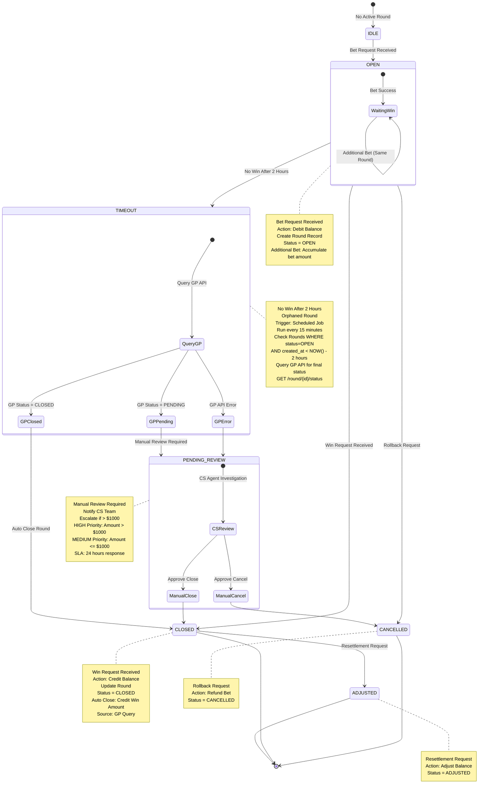
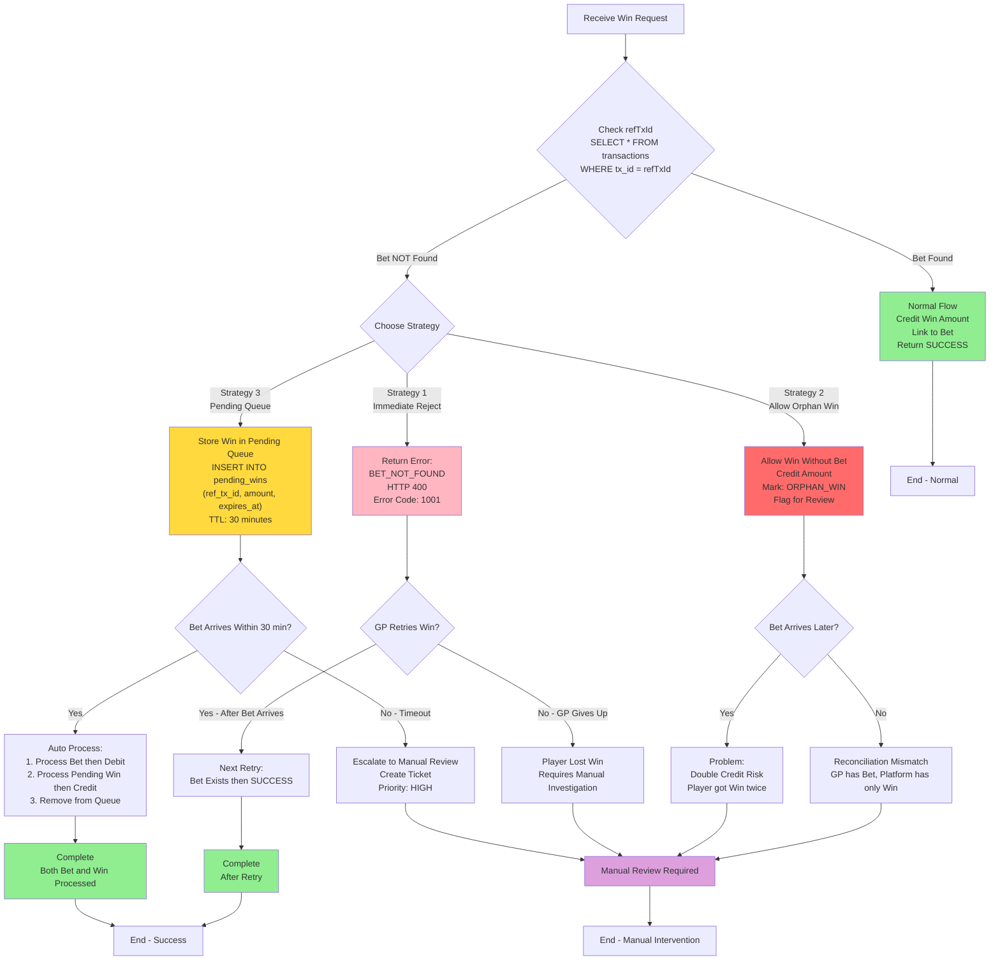
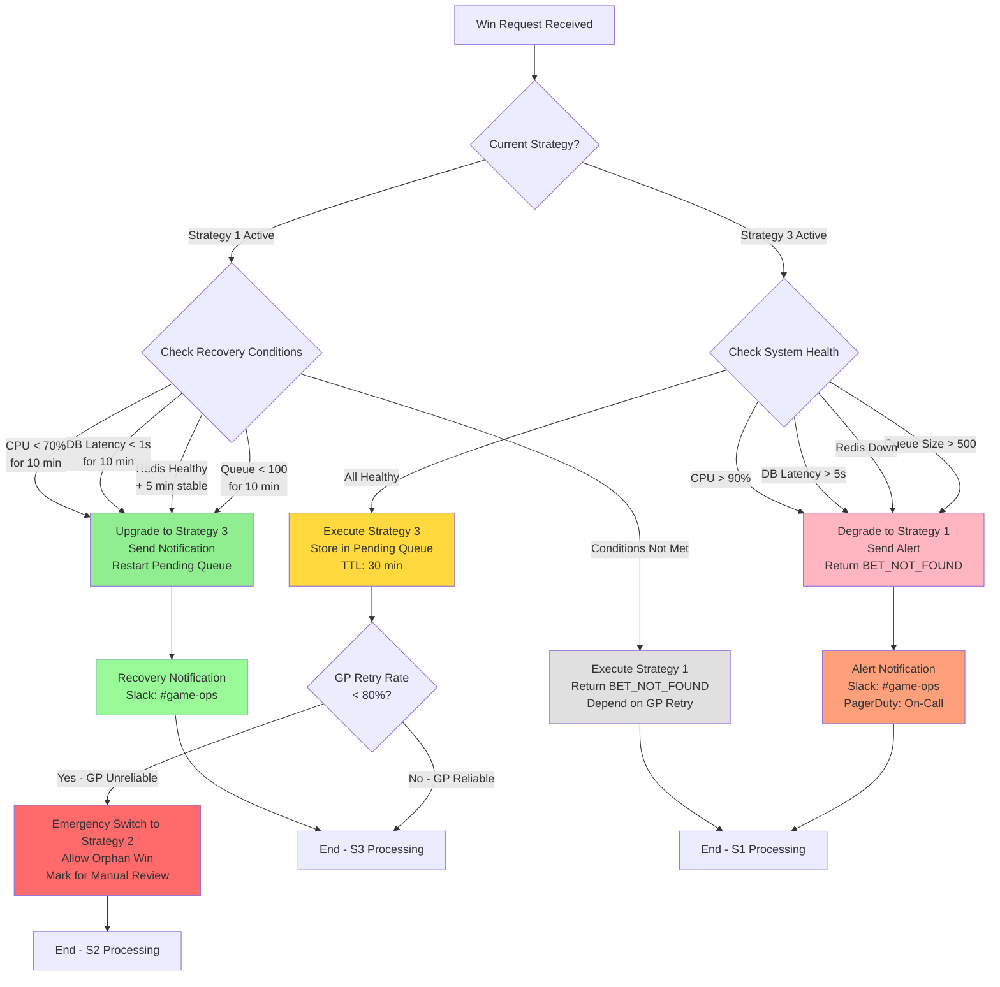
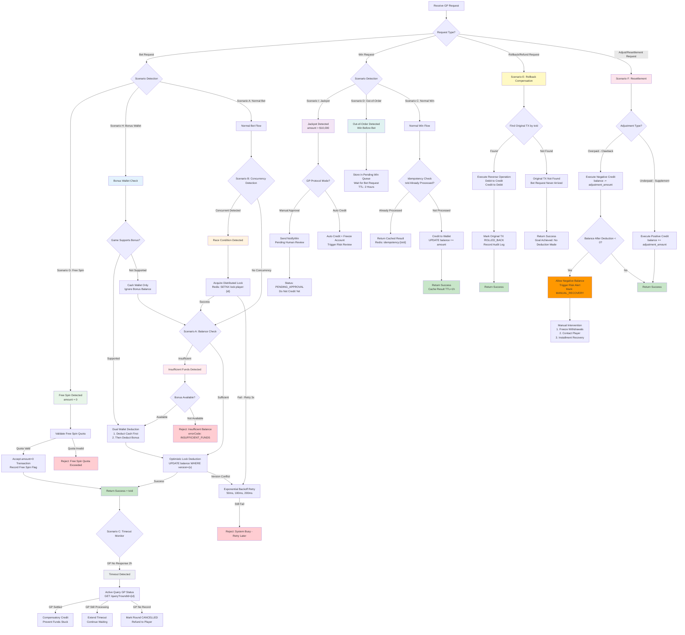
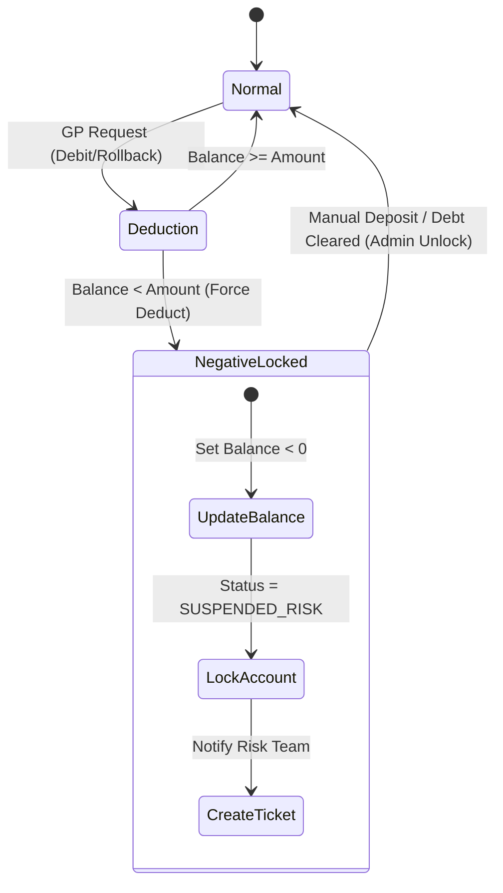
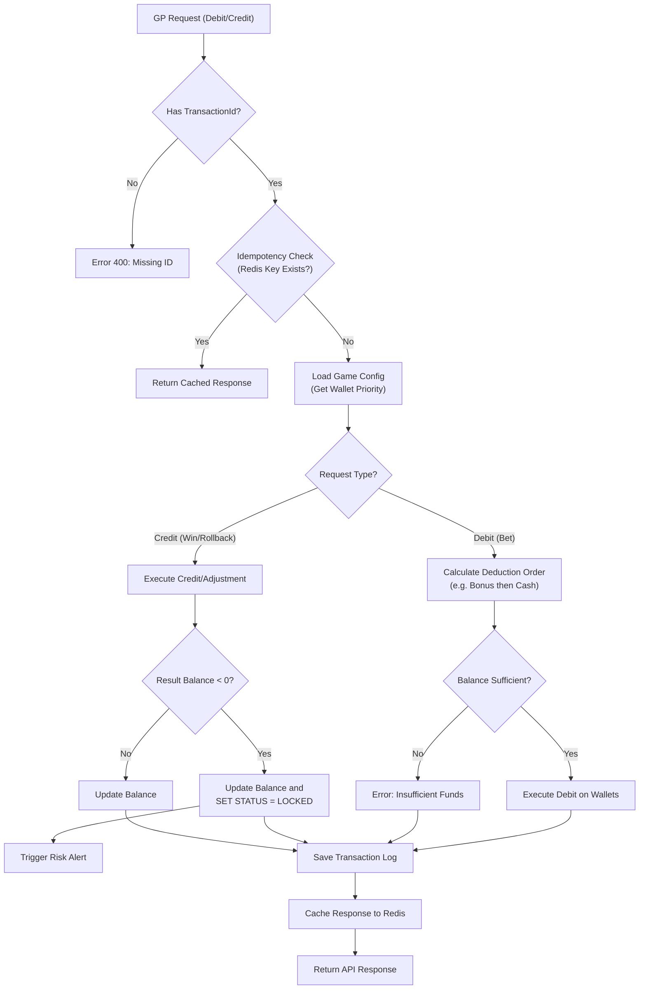

# Seamless Wallet Technical Architecture

> **Canonical Source**: [03-03_Seamless_Wallet_Analysis.md](../../source/03_Game_Center/03-03_Seamless_Wallet_Analysis.md)
> **Audience**: Architects, Backend Developers, DevOps
> **Related Doc**: [Seamless Wallet Requirements](../../requirements/02_Financial_Operations/Seamless_Wallet_Requirements.md)
> **Last Synced**: 2026-02-08

---

## 1. Overview

This document covers the technical architecture and implementation details for the Seamless Wallet integration system. It includes API specifications, concurrency control mechanisms, state machines, database schemas, monitoring configurations, and SmartAdmin architecture mapping.

---

## 2. Round-Based State Machine

### 2.1 State Diagram



---

## 3. Idempotency Implementation

### 3.1 Timeout & Retry Sequence Diagram

```mermaid
sequenceDiagram
    participant GP as Game Provider
    participant GW as API Gateway
    participant Platform as Wallet Service
    participant Redis as Redis Cache
    participant DB as Database

    Note over GP,DB: Scenario C: Timeout & Retry with Idempotency

    rect rgb(255, 230, 230)
        Note over GP,DB: First Attempt - Timeout Occurs

        GP->>GW: POST /debit<br/>{txId: "TX001", amount: 100}
        GW->>Platform: validateRequest(txId, amount)

        Platform->>Redis: GET idempotency:TX001
        Redis-->>Platform: null (Not Exists)

        Platform->>DB: BEGIN TRANSACTION

        Platform->>DB: SELECT balance FROM wallet<br/>WHERE player_id = ? FOR UPDATE
        DB-->>Platform: balance = 500

        Platform->>DB: UPDATE wallet<br/>SET balance = 400<br/>WHERE player_id = ?
        DB-->>Platform: OK (1 row affected)

        Platform->>DB: INSERT INTO transactions<br/>(tx_id, type, amount, balance_after)<br/>VALUES ('TX001', 'DEBIT', 100, 400)
        DB-->>Platform: OK

        Platform->>DB: COMMIT

        Platform->>Redis: SETEX idempotency:TX001<br/>value: {status: SUCCESS, balance: 400}<br/>TTL: 3600
        Redis-->>Platform: OK

        Platform->>GW: Response: {status: SUCCESS, balance: 400}

        Note over GW,GP: Network Error - Response Lost!
        GW-xGP: TCP Connection Reset / Timeout

        Note over GP: GP receives TIMEOUT<br/>Status Unknown<br/>Decide to RETRY
    end

    rect rgb(230, 255, 230)
        Note over GP,DB: Second Attempt - Idempotent Retry (Same txId)

        GP->>GW: POST /debit<br/>{txId: "TX001", amount: 100}<br/>SAME txId

        GW->>Platform: validateRequest(txId, amount)

        Platform->>Redis: GET idempotency:TX001
        Redis-->>Platform: {status: SUCCESS, balance: 400}<br/>EXISTS!

        Note over Platform: Idempotency Check PASSED<br/>Return Cached Response<br/>NO Database Operation!

        Platform-->>GW: Response: {status: SUCCESS, balance: 400}<br/>Source: CACHED

        GW-->>GP: Response: {status: SUCCESS, balance: 400}

        Note over GP: Retry SUCCESS<br/>Received Response<br/>Player Balance: 400
    end

    rect rgb(230, 230, 255)
        Note over GP,DB: Third Attempt - Different txId (New Transaction)

        GP->>GW: POST /debit<br/>{txId: "TX002", amount: 50}<br/>NEW txId

        GW->>Platform: validateRequest(txId, amount)

        Platform->>Redis: GET idempotency:TX002
        Redis-->>Platform: null (Not Exists)

        Platform->>DB: BEGIN TRANSACTION

        Platform->>DB: SELECT balance FROM wallet<br/>WHERE player_id = ? FOR UPDATE
        DB-->>Platform: balance = 400

        Platform->>DB: UPDATE wallet<br/>SET balance = 350<br/>WHERE player_id = ?
        DB-->>Platform: OK

        Platform->>DB: INSERT INTO transactions<br/>(tx_id, type, amount, balance_after)<br/>VALUES ('TX002', 'DEBIT', 50, 350)
        DB-->>Platform: OK

        Platform->>DB: COMMIT

        Platform->>Redis: SETEX idempotency:TX002<br/>value: {status: SUCCESS, balance: 350}<br/>TTL: 3600
        Redis-->>Platform: OK

        Platform->>GW: Response: {status: SUCCESS, balance: 350}
        GW-->>GP: Response: {status: SUCCESS, balance: 350}

        Note over GP: New Transaction SUCCESS<br/>Player Balance: 350
    end

    style Platform fill:#E6E6FA
    style Redis fill:#FFE4B5
    style DB fill:#ADD8E6
```

### 3.2 Idempotency Component Design

| Component | Strategy | Key Parameters |
|-----------|----------|---------------|
| **Uniqueness guarantee** | txId as Redis Key + DB unique constraint | `UNIQUE INDEX (tx_id)` |
| **Cache TTL** | Redis SETEX to avoid permanent memory occupation | 3600 seconds (1 hour) |
| **Response consistency** | Cache full response (balance, status) | JSON format storage |
| **Concurrency protection** | Redis SETNX or Lua Script | Atomic operation |
| **Cleanup strategy** | TTL auto-expiry + periodic batch cleanup | Daily cleanup of records older than 24 hours |

### 3.3 Error Handling

1. **Redis unavailable**: Degrade to DB unique constraint check only (performance degraded but correctness preserved)
2. **DB unique constraint conflict**: Catch exception, query original record, return original result
3. **txId format error**: 400 Bad Request, reject request

---

## 4. Out-of-Order Decision Tree

### 4.1 Strategy Decision Flowchart



### 4.2 Strategy Switching Decision Tree



---

## 5. Comprehensive Extreme Scenario Decision Matrix

### 5.1 Unified Exception Handling Flowchart



---

## 6. Negative Balance State Machine



---

## 7. Integrated Transaction Flow



---

## 8. Wallet Deduction Order Configuration

### 8.1 Game Configuration Schema

```json
{
  "game_code": "slot_001",
  "wallet_priority": ["BONUS_WALLET", "CASH_WALLET"],
  "use_system_default": false
}
```

### 8.2 Execution Flow

1. Receive Bet request
2. Check `game_config.wallet_priority` existence
3. If exists and `use_system_default = false`: use game configuration
4. If not exists: use system default (Bonus -> Cash -> Credit)
5. Deduct balance in priority order
6. If first-priority wallet has insufficient balance, allow mixed deduction (record split details)

---

## 9. Monitoring & Alerting Configuration

### 9.1 Prometheus AlertManager Rules

```yaml
# Prometheus AlertManager Rules
groups:
  - name: seamless_wallet_alerts
    rules:
      # Scenario A: Abnormal insufficient funds rate
      - alert: HighInsufficientFundsRate
        expr: (rate(bet_rejected_insufficient_funds_total[5m]) / rate(bet_requests_total[5m])) > 0.3
        for: 5m
        labels:
          severity: warning
        annotations:
          summary: "Insufficient funds rejection rate > 30%, possible player fund depletion or deposit anomaly"

      # Scenario B: High lock contention
      - alert: HighLockContentionRate
        expr: rate(redis_lock_timeout_total[5m]) > 10
        for: 2m
        labels:
          severity: critical
        annotations:
          summary: "Redis lock timeout frequency too high, system concurrency pressure excessive"

      # Scenario C: Abnormal GP timeout rate
      - alert: HighGPTimeoutRate
        expr: (rate(gp_timeout_total[1h]) / rate(bet_requests_total[1h])) > 0.01
        for: 10m
        labels:
          severity: warning
        annotations:
          summary: "GP timeout rate > 1%, check GP service health"

      # Scenario D: Out-of-order backlog
      - alert: PendingWinQueueBacklog
        expr: pending_win_queue_size > 100
        for: 5m
        labels:
          severity: warning
        annotations:
          summary: "Pending Win Queue backlog > 100, possible Bet request delay or loss"

      # Scenario F: Negative balance accumulation
      - alert: NegativeBalanceAccumulation
        expr: sum(player_negative_balance) < -10000
        for: 1m
        labels:
          severity: critical
        annotations:
          summary: "Negative balance accumulation exceeds $10,000, trigger financial risk control review"

      # Scenario I: Unusual jackpot frequency
      - alert: UnusualJackpotFrequency
        expr: rate(jackpot_win_total[1h]) > 5
        for: 5m
        labels:
          severity: critical
        annotations:
          summary: "Jackpot trigger > 5 times in 1 hour, suspected game logic anomaly or fraud"
```

### 9.2 Strategy Switching Alerts

```yaml
# Prometheus AlertManager Rules
alerts:
  - name: out_of_order_strategy_degraded
    expr: out_of_order_strategy != 3
    for: 5m
    labels:
      severity: warning
    annotations:
      summary: "Out-of-Order strategy degraded to Strategy {{ $value }}"
      description: "Current strategy: {{ if eq $value 1 }}Immediate Reject{{ else if eq $value 2 }}Orphan Win (Emergency){{ end }}"

  - name: out_of_order_emergency_mode
    expr: out_of_order_strategy == 2
    for: 1m
    labels:
      severity: critical
    annotations:
      summary: "Out-of-Order entered emergency mode (Strategy 2 - Orphan Win)"
      description: "GP retry rate too low, allowing orphan wins, immediate manual intervention required"
```

---

## 10. SmartAdmin Architecture Mapping

### 10.1 Five-Layer Module Design

| Layer | Class Pattern | Responsibility | Annotation Restrictions |
|-------|--------------|---------------|----------------------|
| **Controller** | `SeamlessWalletController` | Receive GP HTTP requests, parameter validation, return ResponseDTO | No @Transactional |
| **Service** | `SeamlessWalletService` | Business coordination, idempotency checks, call Manager | No @Transactional |
| **Manager** | `SeamlessWalletTransactionManager` | Transaction management, distributed locks, wallet debit/credit | @Transactional allowed ONLY here |
| **Dao** | `GameTransactionRecordDao` | Database CRUD, MyBatis Mapper | No business logic |
| **Entity** | `GameTransactionRecordEntity` | Data model, maps to table structure | No business logic |

### 10.2 Dependency Rules (Enforced by ArchitectureTest)

```text
Controller -> Service (ALLOWED)
Service -> Dao      (ALLOWED - for idempotency record queries)
Service -> Manager  (ALLOWED - when @Transactional needed)
Manager -> Dao      (ALLOWED)

Controller -> Dao   (FORBIDDEN - violates layering)
Controller -> Manager (FORBIDDEN - violates layering)
```

### 10.3 Entity Layer

**GameTransactionRecordEntity.java** - Maps to the game transaction record table, tracking all Debit/Credit/Rollback/Adjust operations with txId, roundId, type, amount, balance_after, and status fields.

**RoundStateEntity.java** - Maps to the round state table for Round-Based GP integrations, tracking roundId, status (OPEN/CLOSED/CANCELLED/ADJUSTED/TIMEOUT/PENDING_REVIEW), total bet amount, total win amount, and timestamps.

### 10.4 DAO Layer

**GameTransactionRecordDao.java** - MyBatis Mapper for game transaction CRUD operations, including queries by txId for idempotency checks and batch queries for reconciliation.

**RoundStateDao.java** - MyBatis Mapper for round state management, including queries for orphaned rounds (status=OPEN and created_at older than threshold).

### 10.5 Manager Layer

**SeamlessWalletTransactionManager.java** - Handles all transactional operations:
- `processBet()`: Distributed lock acquisition, balance check, debit execution within @Transactional
- `processWin()`: Credit execution, round closure within @Transactional
- `processRollback()`: Reverse operation execution within @Transactional
- `processAdjustment()`: Resettlement handling with negative balance support within @Transactional

### 10.6 Service Layer

**SeamlessWalletService.java** - Orchestrates business logic:
- Idempotency check via Redis cache lookup
- Delegates to Manager for transactional operations
- Handles out-of-order pending queue logic
- Coordinates with Risk Engine for anomaly detection

### 10.7 Controller Layer

**SeamlessWalletController.java** - HTTP interface:
- Receives GP requests (Debit, Credit, Rollback, Adjust, GetBalance)
- Parameter validation
- Returns ResponseDTO with standardized error codes

### 10.8 Foundation Module Dependencies

| Foundation Module | Purpose | Reference Location |
|------------------|---------|-------------------|
| **foundation.redis-lock** | Distributed locks to prevent concurrent deduction (Scenario B) | SeamlessWalletTransactionManager.processBet/processWin/processRollback() |
| **foundation.cache** | Caffeine + Redis cache for idempotency | SeamlessWalletService.checkIdempotency() |
| **foundation.audit-log** | Audit log recording | Auto-recorded after all transactions |
| **foundation.retry** | Failure retry strategy | GP API call failure retries |

### 10.9 Idempotency TTL Standardization

From v2.0.0, unified idempotency TTL is **3600 seconds (1 hour)**, consistent with the Turnover Calculation module for operational and monitoring alignment.

---

## 11. Architecture Impact Analysis

1. **Game Config Service**: Schema must be extended to support `wallet_priority` configuration
2. **Wallet Service**:
   - `debit()` method must support accepting a `priority_list` parameter
   - Must handle "Split Transaction" (e.g., 20 from Bonus, 80 from Cash)
3. **Risk Engine**: Must listen to `BALANCE_CHANGE` events and trigger account lock when `NewBalance < 0`

---

## 12. Key Implementation Notes

1. **Scenario priority**: Decision tree processes P0 -> P1 -> P2 order, ensuring high-priority scenarios are handled first
2. **Idempotency protection**: All Credit/Debit operations must pass through `idempotency:{txId}` check
3. **Distributed locks**: Concurrency scenarios use Redis SETNX + TTL=5s to prevent permanent lock hold
4. **Degradation strategy**: When Redis/GP unavailable, prioritize fund safety (reject rather than incorrectly deduct)
5. **Audit logs**: All exception scenarios (negative balance, jackpot, rollback) must record complete audit logs
6. **Manual intervention**: Clearly predefined manual intervention thresholds to prevent automated decision runaway

---

## 13. Related Documents

### Upstream Architecture
- **Unified Wallet Model** - Overall wallet architecture, bettable balance formula
- **Transaction Processing Flow** - Event-driven architecture, Outbox Pattern

### Deep Technical Analysis
Detailed seamless wallet topic analyses (13 topics) providing fine-grained implementation guidance:

- **Seamless Wallet Topic Index** - Complete navigation and learning path
  - Token Verification - API authentication decision tree (Bet vs Result API verification strategy)
  - Idempotency Design - Three-layer protection (Redis -> DB -> Distributed Lock), anti-duplicate deduction
  - Sports Betting Logic - Valid Bet calculation, HALF WIN/LOSS handling
  - Turnover Concurrency Accumulation - Lua script atomicity, TOCTOU attack protection
  - Error Recovery - Exception handling, compensating transactions, rollback strategies

### Risk Integration
- **Risk Framework** - Transaction risk checks, hedging detection

---

## 14. Change Log

### v2.0.0 (2026-01-29)

**Major Changes**:
1. Added SmartAdmin Architecture Mapping (Section 10)
   - Complete five-layer architecture (Entity/Dao/Manager/Service/Controller)
   - Seamless wallet core logic implementation (Bet/Win/Rollback)
   - Distributed lock (RedisLock) and idempotency (Redis Cache) integration
   - Round state management (Round-Based GP support)
   - Foundation module dependency documentation (redis-lock, cache, audit-log, retry)
   - ArchitectureTest validation rules

2. Unified idempotency TTL to 3600 seconds (1 hour)
   - Consistent with Turnover Calculation module
   - Removed inconsistent descriptions (1-2h)

### v1.0.0 (2026-01-28)

**Initial Version**:
- Seamless wallet integration scenario analysis (Sections 1-2)
- 9 extreme scenario comprehensive decision matrix (Section 5)
- Idempotency, concurrency control, out-of-order handling (Sections 3-4)
- Round-Based state machine (Section 2)
- Negative balance handling, wallet deduction order (Section 6-8)
