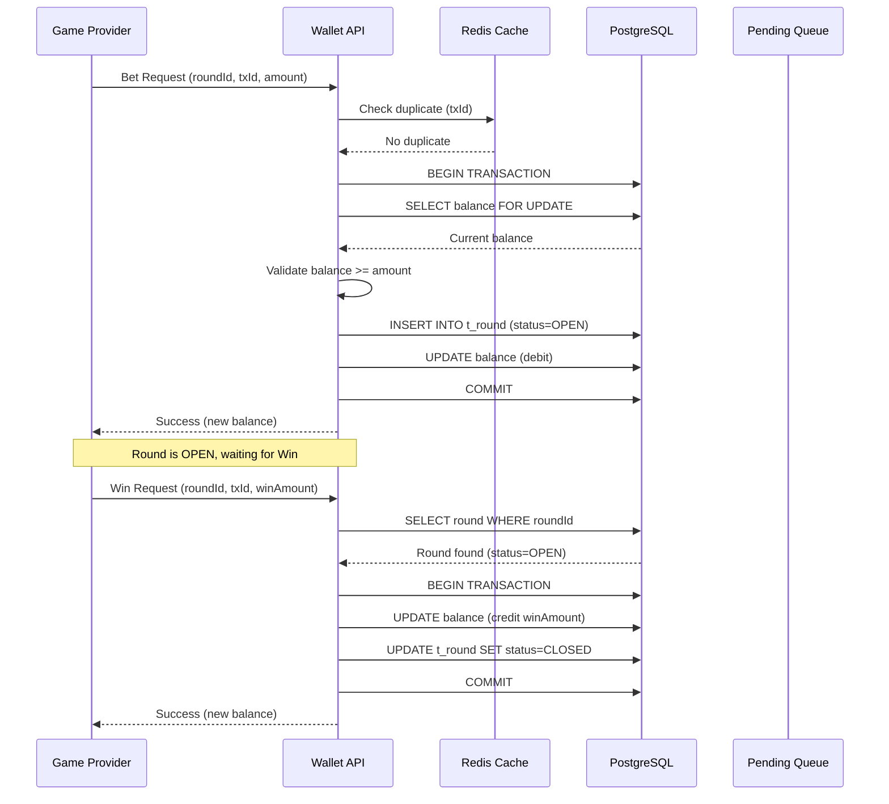

# Seamless Wallet Technical Implementation

> **Business Requirements**: [Seamless_Wallet_Requirements.md](../../requirements/02_Financial_Operations/Seamless_Wallet_Requirements.md)
> **Audience**: Architects, Backend Developers, DevOps Engineers
> **Last Synced**: 2026-02-09

---

## 1. Architecture Overview

The Seamless Wallet technical implementation provides real-time transaction processing between the platform and Game Providers (GP), ensuring atomicity, idempotency, and concurrency safety.

**Key Technical Components**:
- Round-Based State Machine for transaction lifecycle
- Three-layer idempotency defense (Redis + DB + Distributed Lock)
- Orphaned round detection and auto-recovery
- Negative balance handling with automatic account locking
- Out-of-order request handling with pending queue
- Strategy switching for system pressure management

---

## 2. Round-Based State Machine

### 2.1 State Transition Diagram



### 2.2 State Definitions

| State | Description | Entry Condition | Exit Condition |
|-------|-------------|----------------|----------------|
| **OPEN** | Bet deducted, awaiting win | Bet request succeeds | Win request arrives OR timeout |
| **CLOSED** | Round completed normally | Win request succeeds | N/A (terminal state) |
| **TIMEOUT** | No win received within 2 hours | System scheduled check | GP status query OR manual review |
| **PENDING_REVIEW** | GP status unknown, manual intervention required | GP query fails | CS agent closes OR cancels |
| **CANCELLED** | Round cancelled, bet refunded | Rollback request OR manual cancellation | N/A (terminal state) |
| **ADJUSTED** | Resettlement applied | Adjust request from GP | N/A (terminal state) |

### 2.3 Implementation (Java)

```java
@Service
@RequiredArgsConstructor
public class RoundLifecycleManager {

    private final RoundRepository roundRepository;
    private final WalletService walletService;
    private final RedissonClient redissonClient;

    @Transactional(rollbackFor = Throwable.class)
    public WalletResponse processBet(BetRequest request) {
        String lockKey = "round:lock:" + request.getPlayerId();
        RLock lock = redissonClient.getLock(lockKey);

        try {
            if (!lock.tryLock(3, 10, TimeUnit.SECONDS)) {
                throw new BusinessException(ErrorCode.SYSTEM_BUSY);
            }

            // Create round record
            Round round = Round.builder()
                .roundId(request.getRoundId())
                .playerId(request.getPlayerId())
                .gpId(request.getGpId())
                .betAmount(request.getAmount())
                .status(RoundStatus.OPEN)
                .createdAt(LocalDateTime.now())
                .build();

            roundRepository.save(round);

            // Debit wallet
            WalletResponse response = walletService.debit(
                request.getPlayerId(),
                request.getAmount(),
                request.getTxId()
            );

            return response;

        } catch (InterruptedException e) {
            Thread.currentThread().interrupt();
            throw new BusinessException(ErrorCode.LOCK_TIMEOUT);
        } finally {
            if (lock.isHeldByCurrentThread()) {
                lock.unlock();
            }
        }
    }
}
```

---

## 3. Orphaned Round Detection

### 3.1 Detection SQL

**Scheduled Task** (every 15 minutes):

```sql
-- Detect orphaned rounds (open for > 2 hours)
SELECT
    round_id,
    player_id,
    gp_id,
    bet_amount,
    created_at,
    EXTRACT(EPOCH FROM (NOW() - created_at)) / 3600 AS hours_open
FROM t_round
WHERE status = 'OPEN'
  AND created_at < NOW() - INTERVAL '2 hours'
ORDER BY created_at ASC
LIMIT 100;
```

### 3.2 Auto-Recovery Implementation

```java
@Scheduled(cron = "0 */15 * * * *") // Every 15 minutes
public void detectOrphanedRounds() {
    List<Round> orphanedRounds = roundRepository.findOrphanedRounds(
        LocalDateTime.now().minusHours(2)
    );

    for (Round round : orphanedRounds) {
        try {
            // Query GP for final round status
            GPRoundStatus gpStatus = gpClient.queryRoundStatus(
                round.getGpId(),
                round.getRoundId()
            );

            if (gpStatus == GPRoundStatus.COMPLETED) {
                // Close round with actual win amount
                closeRound(round.getRoundId(), gpStatus.getWinAmount());
            } else if (gpStatus == GPRoundStatus.CANCELLED) {
                // Refund bet
                cancelRound(round.getRoundId());
            } else {
                // GP status unknown, escalate to manual review
                escalateToManualReview(round);
            }

        } catch (GPQueryException e) {
            // GP query failed, escalate immediately
            escalateToManualReview(round);
        }
    }
}
```

---

## 4. Idempotency Three-Layer Defense

### 4.1 Architecture Diagram

```
Request with txId
       ↓
[Layer 1: Redis Cache]
   - 1-hour TTL
   - O(1) lookup
   - Fast path (< 5ms)
       ↓ Cache miss
[Layer 2: DB Unique Constraint]
   - t_transaction.tx_id UNIQUE
   - UPSERT with ON CONFLICT
   - Medium path (< 50ms)
       ↓ Constraint violation
[Layer 3: Fallback Query]
   - SELECT FROM t_transaction WHERE tx_id
   - Return stored response
   - Slow path (< 100ms)
```

### 4.2 Implementation

```java
@Service
@RequiredArgsConstructor
public class IdempotencyGuard {

    private final StringRedisTemplate redisTemplate;
    private final TransactionRepository transactionRepository;

    public <T> T executeIdempotent(String txId, Supplier<T> action) {
        // Layer 1: Redis cache check
        String cacheKey = "tx:response:" + txId;
        String cachedResponse = redisTemplate.opsForValue().get(cacheKey);
        if (cachedResponse != null) {
            return deserialize(cachedResponse);
        }

        // Layer 2: DB unique constraint check
        Optional<Transaction> existing = transactionRepository.findByTxId(txId);
        if (existing.isPresent()) {
            T response = deserialize(existing.get().getResponse());
            // Populate cache for next request
            redisTemplate.opsForValue().set(cacheKey, serialize(response), 1, TimeUnit.HOURS);
            return response;
        }

        // Execute business logic
        T response = action.get();

        // Store response in DB and cache
        Transaction tx = Transaction.builder()
            .txId(txId)
            .response(serialize(response))
            .createdAt(LocalDateTime.now())
            .build();
        transactionRepository.save(tx);

        redisTemplate.opsForValue().set(cacheKey, serialize(response), 1, TimeUnit.HOURS);

        return response;
    }
}
```

---

## 5. Concurrent Processing (Redisson Distributed Lock)

### 5.1 Lock Configuration

```yaml
# application.yml
redisson:
  single-server-config:
    address: redis://localhost:6379
    connection-pool-size: 64
    connection-minimum-idle-size: 10
  lock:
    wait-time: 3000  # 3 seconds
    lease-time: 10000 # 10 seconds
```

### 5.2 Lock Implementation

```java
@Service
@RequiredArgsConstructor
public class ConcurrencyManager {

    private final RedissonClient redissonClient;

    @Transactional(rollbackFor = Throwable.class)
    public WalletResponse debitWithLock(Long playerId, BigDecimal amount, String txId) {
        String lockKey = "wallet:lock:" + playerId;
        RLock lock = redissonClient.getLock(lockKey);

        try {
            // Try to acquire lock (wait 3s, hold max 10s)
            boolean acquired = lock.tryLock(3, 10, TimeUnit.SECONDS);
            if (!acquired) {
                throw new BusinessException(ErrorCode.SYSTEM_BUSY_RETRY_LATER);
            }

            // Critical section: balance check + debit
            Wallet wallet = walletRepository.findByPlayerIdForUpdate(playerId)
                .orElseThrow(() -> new BusinessException(ErrorCode.WALLET_NOT_FOUND));

            if (wallet.getBalance().compareTo(amount) < 0) {
                throw new BusinessException(ErrorCode.INSUFFICIENT_FUNDS);
            }

            wallet.setBalance(wallet.getBalance().subtract(amount));
            walletRepository.save(wallet);

            return WalletResponse.ok(wallet.getBalance());

        } catch (InterruptedException e) {
            Thread.currentThread().interrupt();
            throw new BusinessException(ErrorCode.LOCK_INTERRUPTED);
        } finally {
            if (lock.isHeldByCurrentThread()) {
                lock.unlock();
            }
        }
    }
}
```

---

## 6. Negative Balance Handling

### 6.1 Resettlement Flow

```java
@Service
@RequiredArgsConstructor
public class ResettlementService {

    private final WalletService walletService;
    private final PlayerAccountService accountService;
    private final AlertService alertService;

    @Transactional(rollbackFor = Throwable.class)
    public void processResettlement(ResettlementRequest request) {
        BigDecimal adjustAmount = request.getAdjustAmount(); // Can be negative

        // Apply adjustment (may result in negative balance)
        WalletResponse response = walletService.adjust(
            request.getPlayerId(),
            adjustAmount,
            request.getTxId()
        );

        // Check for negative balance
        if (response.getNewBalance().compareTo(BigDecimal.ZERO) < 0) {
            // Lock account immediately
            accountService.lockAccount(
                request.getPlayerId(),
                AccountLockReason.NEGATIVE_BALANCE,
                "Balance: " + response.getNewBalance()
            );

            // Trigger high-priority alert
            alertService.sendAlert(
                AlertLevel.CRITICAL,
                "Negative Balance Alert",
                "Player " + request.getPlayerId() + " balance: " + response.getNewBalance()
            );
        }
    }
}
```

### 6.2 Account Lock Implementation

```sql
-- Lock account and block all operations
UPDATE t_player_account
SET status = 'LOCKED',
    lock_reason = 'NEGATIVE_BALANCE',
    lock_details = 'Balance: -$123.45',
    locked_at = NOW(),
    updated_at = NOW()
WHERE player_id = ?;

-- Prevent all new bets, deposits, withdrawals
-- (checked in WalletService before every operation)
```

---

## 7. Out-of-Order Handling

### 7.1 Pending Queue Architecture

```java
@Component
@RequiredArgsConstructor
public class OutOfOrderHandler {

    private final StringRedisTemplate redisTemplate;
    private final RoundRepository roundRepository;

    /**
     * Strategy 3: Temporary Storage (30-minute expiry)
     * When Win arrives before Bet, store in pending queue
     */
    public void handleOrphanWin(WinRequest request) {
        String pendingKey = "pending:win:" + request.getRoundId();

        // Store win request in Redis (30-minute TTL)
        redisTemplate.opsForValue().set(
            pendingKey,
            serialize(request),
            30,
            TimeUnit.MINUTES
        );

        // Schedule retry after 5 minutes
        scheduleRetry(request.getRoundId(), 5);
    }

    @Scheduled(fixedDelay = 60000) // Every 1 minute
    public void processPendingWins() {
        Set<String> pendingKeys = redisTemplate.keys("pending:win:*");

        for (String key : pendingKeys) {
            String roundId = key.replace("pending:win:", "");

            // Check if Bet has arrived
            Optional<Round> round = roundRepository.findByRoundId(roundId);
            if (round.isPresent() && round.get().getStatus() == RoundStatus.OPEN) {
                // Bet arrived, process pending Win
                WinRequest winRequest = deserialize(redisTemplate.opsForValue().get(key));
                processWin(winRequest);
                redisTemplate.delete(key);
            }
        }
    }
}
```

### 7.2 Strategy Switching

```java
@Component
public class StrategyManager {

    private final AtomicInteger pendingQueueSize = new AtomicInteger(0);

    public WinResponse handleWin(WinRequest request) {
        // Check if Bet exists
        Optional<Round> round = roundRepository.findByRoundId(request.getRoundId());

        if (round.isEmpty()) {
            // Out-of-order detected
            if (pendingQueueSize.get() > 100) {
                // Strategy 1: Immediate Reject (degraded mode)
                throw new BusinessException(ErrorCode.BET_NOT_FOUND);
            } else {
                // Strategy 3: Temporary Storage (normal mode)
                handleOrphanWin(request);
                pendingQueueSize.incrementAndGet();
                return WinResponse.pending();
            }
        }

        // Normal flow: Bet exists
        return processWin(request);
    }
}
```

---

## 8. Exception Handling

### 8.1 Redis Connection Failure

```java
@Service
@RequiredArgsConstructor
public class ResilientCacheService {

    private final StringRedisTemplate redisTemplate;
    private final CircuitBreaker circuitBreaker;

    public Optional<String> get(String key) {
        try {
            return circuitBreaker.executeSupplier(() ->
                Optional.ofNullable(redisTemplate.opsForValue().get(key))
            );
        } catch (CallNotPermittedException e) {
            // Circuit open, bypass cache
            return Optional.empty();
        } catch (RedisConnectionException e) {
            // Connection failed, degrade gracefully
            return Optional.empty();
        }
    }
}
```

### 8.2 Database Latency P99 Degradation

```java
@Component
public class LatencyMonitor {

    private final MeterRegistry meterRegistry;

    @Around("@annotation(Monitored)")
    public Object monitorLatency(ProceedingJoinPoint joinPoint) throws Throwable {
        Timer.Sample sample = Timer.start(meterRegistry);
        try {
            return joinPoint.proceed();
        } finally {
            sample.stop(Timer.builder("db.query.latency")
                .tag("method", joinPoint.getSignature().getName())
                .register(meterRegistry));
        }
    }
}
```

---

## 9. Monitoring Metrics

### 9.1 Prometheus Metrics

```java
@Component
@RequiredArgsConstructor
public class WalletMetrics {

    private final MeterRegistry meterRegistry;

    public void recordTransaction(TransactionType type, boolean success) {
        meterRegistry.counter("wallet.transaction.total",
            "type", type.name(),
            "status", success ? "success" : "failure"
        ).increment();
    }

    public void recordOutOfOrderEvent() {
        meterRegistry.counter("wallet.out_of_order.total").increment();
    }

    public void recordNegativeBalance(BigDecimal balance) {
        meterRegistry.gauge("wallet.negative_balance.amount", balance.doubleValue());
    }
}
```

---

## 10. Configuration Reference

### 10.1 Redis Configuration

```yaml
spring:
  redis:
    host: localhost
    port: 6379
    password: ${REDIS_PASSWORD}
    timeout: 2000ms
    lettuce:
      pool:
        max-active: 8
        max-idle: 8
        min-idle: 2
```

### 10.2 Database Configuration

```yaml
spring:
  datasource:
    hikari:
      maximum-pool-size: 20
      minimum-idle: 5
      connection-timeout: 3000
      idle-timeout: 600000
      max-lifetime: 1800000
```

---

**Document Version**: 1.0.0
**Last Updated**: 2026-02-09
**Maintainer**: Backend Team
