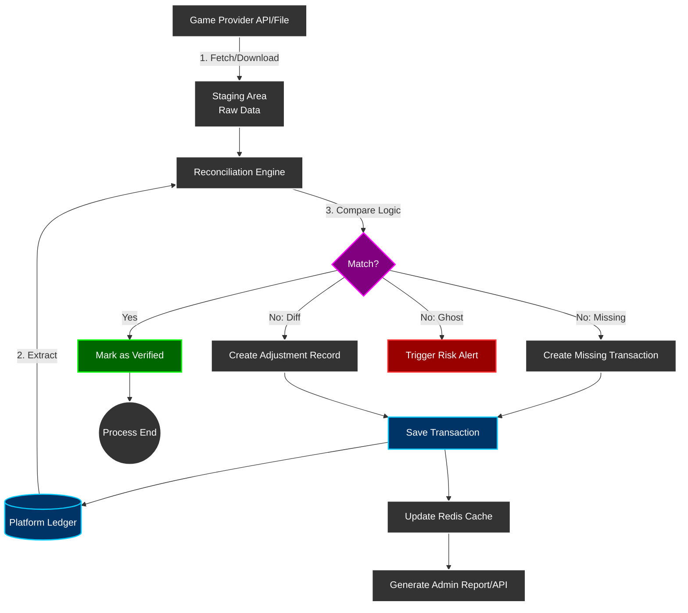
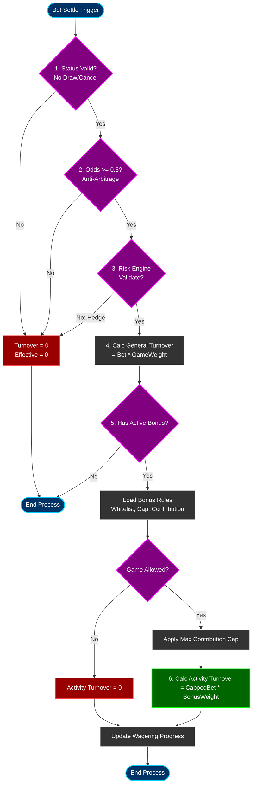

# Turnover Calculation Architecture

> **Canonical Source**: [source/02_Finance_Center/02-04_Turnover_and_Game_Reconciliation_Analysis.md](../../source/02_Finance_Center/02-04_Turnover_and_Game_Reconciliation_Analysis.md)
> **Audience**: Architects, Backend Developers, Risk Engineers
> **Business Requirements**: [Turnover_Reconciliation_Requirements.md](../../requirements/02_Financial_Operations/Turnover_Reconciliation_Requirements.md)
> **Last Synced**: 2026-02-09
>
> **Technical Focus**: This document contains implementation details (three-layer validation architecture, Mermaid flowcharts, short-circuit optimization) extracted from Requirements layer.

---

## 1. Three-Layer Validation Architecture

### 1.1 Architecture Overview

The turnover calculation system is positioned at **Layer 2 - Financial Status Factor** within the three-layer risk control stack. It calculates valid turnover status factors based on game results (WIN/LOSS/DRAW) after Layer 1 (Risk Engine) validation has passed.

```
+-----------------------------------------------------------------------------+
|                   Unified Turnover Validation Stack                          |
+-----------------------------------------------------------------------------+
|                                                                              |
|  Layer 1: Risk Validation (Risk Engine - 05-01)                             |
|  +-------------------------------------------------------------+           |
|  | Responsibility: Rejection Decision                            |           |
|  | Checks: Hedge/Arbitrage/Low Odds/Same-IP Hedging             |           |
|  | Output: { is_valid: boolean, effective_turnover_base: number }|           |
|  |                                                               |           |
|  | X is_valid = false -> Return 0 immediately (skip Layer 2/3)  |           |
|  | V is_valid = true  -> Return effective_turnover_base          |           |
|  +-------------------------------------------------------------+           |
|                           | (only when is_valid = true)                      |
|  Layer 2: Finance Layer (THIS MODULE - 02-04)                               |
|  +-------------------------------------------------------------+           |
|  | Responsibility: Status Factor Adjustment                      |           |
|  | Checks: WIN/LOSS/DRAW/CANCEL/HALF_WIN/HALF_LOSS              |           |
|  | Output: valid_turnover_finance                                |           |
|  |     = effective_turnover_base x status_factor                 |           |
|  |                                                               |           |
|  | WARNING: No Rejection Logic Here                              |           |
|  +-------------------------------------------------------------+           |
|                           |                                                  |
|  Layer 3: Activity Layer (04-01)                                            |
|  +-------------------------------------------------------------+           |
|  | Responsibility: Game Weight Adjustment                        |           |
|  | Checks: SLOTS/SPORTS/BACCARAT/LOTTERY etc.                   |           |
|  | Output: activity_valid_turnover                               |           |
|  |     = valid_turnover_finance x game_weight                    |           |
|  |                                                               |           |
|  | WARNING: No Rejection Logic Here                              |           |
|  +-------------------------------------------------------------+           |
|                                                                              |
+-----------------------------------------------------------------------------+
```

### 1.2 Responsibility Matrix

| Responsibility | Layer 1 (Risk Engine) | Layer 2 (Finance) | Layer 3 (Activity) |
|---------------|----------------------|-------------------|-------------------|
| **Rejection Decision** | Solely responsible | Not involved | Not involved |
| **Status Factor Adjustment** | Not involved | Solely responsible | Not involved |
| **Game Weight Application** | Not involved | Not involved | Solely responsible |
| **Short-circuit Return** | is_valid=false returns 0 | Trusts Layer 1 result | Trusts Layer 2 result |
| **Performance Impact** | Executes for all bets | Only bets passing Layer 1 (~95%) | Only bets with active bonuses |

---

## 2. Layer Processing Implementation

### 2.1 Step 1: Layer 1 Risk Engine Validation

**Responsibility**: Rejection decisions (Hedge/Arbitrage/Low Odds)

```typescript
/**
 * Layer 1: Risk Engine Validation (v2.1.0 config-driven update)
 * Responsibility: Rejection decision + risk flagging
 * Returns: {
 *   is_valid: boolean,
 *   action_type: 'BLOCK' | 'FLAG' | 'PASS',
 *   matched_rules: string[],
 *   risk_proposal_id: string | null,
 *   effective_turnover_base: number
 * }
 */
const riskValidation = await RiskEngine.validateTurnover({
  bet_id: bet.id,
  player_id: bet.player_id,
  game_type: bet.game_type,
  bet_amount: bet.amount,
  odds: bet.odds,
  odds_type: bet.odds_type
});

// BLOCK rule rejection -> short-circuit return (skip Layer 2/3)
if (!riskValidation.is_valid && riskValidation.action_type === 'BLOCK') {
  log.info(`[BLOCK] bet_id=${bet.id}, rules=${riskValidation.matched_rules}`);

  // Return all zeros, do not call Layer 2/3
  return {
    bet_id: bet.id,
    player_id: bet.player_id,
    effective_turnover_base: 0,
    valid_turnover_finance: 0,
    activity_valid_turnover: 0,
    rejected_by: 'RISK_ENGINE',       // Mark rejection source
    action_type: 'BLOCK',
    matched_rules: riskValidation.matched_rules,
    calculated_at: new Date()
  };
}

// FLAG rule: mark but allow (v2.1.0 core feature)
if (riskValidation.is_valid && riskValidation.action_type === 'FLAG') {
  log.info(`[FLAG] bet_id=${bet.id}, proposal_id=${riskValidation.risk_proposal_id}`);

  // FLAG rules calculate turnover normally, but mark risk proposal
  const effective_turnover_base = riskValidation.effective_turnover_base;

  // Record risk flag
  await db.insert('bet_risk_flag').values({
    bet_id: bet.id,
    action_type: 'FLAG',
    matched_rules: riskValidation.matched_rules,
    risk_proposal_id: riskValidation.risk_proposal_id,
    flagged_at: new Date()
  });

  // Continue to Layer 2 (turnover calculated normally)
}

// PASS rule: normal flow, get base turnover (enter Layer 2)
const effective_turnover_base = riskValidation.effective_turnover_base;
log.info(`[Layer 1 Passed] bet_id=${bet.id}, action_type=${riskValidation.action_type}, effective_turnover_base=${effective_turnover_base}`);
```

### 2.2 Step 2: Layer 2 Finance Status Factor Adjustment

**Responsibility**: Only status factor adjustment -- no rejection decisions.

```typescript
/**
 * Layer 2: Finance Layer Status Factor Adjustment
 * Responsibility: WIN/LOSS/DRAW/CANCEL status factor application
 * Pre-condition: Layer 1 has passed validation (is_valid = true)
 *
 * WARNING: This layer does NOT make rejection decisions; it trusts Layer 1 results
 */
const status_factor = getStatusFactor(bet.status);
const valid_turnover_finance = effective_turnover_base * status_factor;

log.info(`[Layer 2] bet_id=${bet.id}, status=${bet.status}, status_factor=${status_factor}, valid_turnover_finance=${valid_turnover_finance}`);

/**
 * Status Factor Mapping
 * v2.0.0: HALF_WIN/HALF_LOSS = 1.0 (standard principal method)
 */
function getStatusFactor(status: BetStatus): number {
  const STATUS_FACTORS = {
    'WIN': 1.0,        // Player wins - full turnover
    'LOSS': 1.0,       // Player loses - full turnover
    'DRAW': 0.0,       // Draw - no risk, no turnover
    'TIE': 0.0,        // Push - same as draw
    'VOID': 0.0,       // Voided - bet invalid
    'CANCEL': 0.0,     // Cancelled - bet invalid
    'HALF_WIN': 1.0,   // v2.0.0: Half win - full turnover (standard principal method)
    'HALF_LOSS': 1.0,  // v2.0.0: Half loss - full turnover (standard principal method)
    'RUNNING': 0.0     // In progress - unsettled, not counted
  };
  return STATUS_FACTORS[status] ?? 0.0;
}
```

### 2.3 Step 3: Record All Layers

**Purpose**: Record each layer's calculation result for audit and reconciliation.

```typescript
/**
 * Step 3: Record three-layer turnover (for audit and reconciliation)
 * - effective_turnover_base: Layer 1 result
 * - valid_turnover_finance:  Layer 2 result
 * - activity_valid_turnover: Layer 3 result (if applicable)
 */
await db.transaction(async (tx) => {
  await tx.insertInto('bet_turnover_record').values({
    bet_id: bet.id,
    player_id: bet.player_id,
    game_type: bet.game_type,

    // Layer 1 result (v2.1.0 update)
    effective_turnover_base: effective_turnover_base,
    action_type: riskValidation.action_type,
    matched_rules: riskValidation.matched_rules,
    risk_proposal_id: riskValidation.risk_proposal_id,

    // Layer 2 result
    status: bet.status,
    status_factor: status_factor,
    valid_turnover_finance: valid_turnover_finance,

    // Layer 3 result (if applicable)
    activity_valid_turnover: activity_valid_turnover ?? 0,
    game_weight: game_weight ?? 1.0,

    calculated_at: new Date(),
    layer_breakdown: JSON.stringify({
      layer1: {
        effective_turnover_base,
        action_type: riskValidation.action_type,
        matched_rules: riskValidation.matched_rules,
        risk_proposal_id: riskValidation.risk_proposal_id
      },
      layer2: { status_factor, valid_turnover_finance },
      layer3: { game_weight, activity_valid_turnover }
    })
  });
});

log.info(`[All Layers Recorded] bet_id=${bet.id}`);
```

### 2.4 Performance Optimization (v2.0.0)

**Before (v1.x)**:
- Layer 1 rejection still triggered Layer 2 calculation logic
- Performance impact: 100% of bets executed Layer 2 code

**After (v2.0.0)**:
- Layer 1 rejection causes immediate short-circuit return
- Performance impact: Only bets passing Layer 1 (~95%) execute Layer 2
- **Savings**: ~5% CPU and DB queries

---

## 3. Event-Driven Data Exchange

### 3.1 Publishing Finance Turnover to Event Bus

```typescript
// Publish finance turnover result to Kafka
await kafkaProducer.send({
  topic: 'finance.turnover.calculated',
  messages: [{
    key: bet.player_id,
    value: JSON.stringify({
      bet_id: bet.id,
      player_id: bet.player_id,
      game_type: bet.game_type,
      effective_turnover_base: effective_turnover_base,
      valid_turnover_finance: valid_turnover_finance,
      status: bet.status,
      status_factor: status_factor,
      timestamp: new Date().toISOString()
    })
  }]
});
```

### 3.2 Activity System Consumption

The Activity System subscribes to this event and applies game weight on top of `valid_turnover_finance`:

```typescript
// Activity System consumes this event
const activity_valid_turnover = message.valid_turnover_finance * GAME_WEIGHTS[message.game_type];
```

---

## 4. Free Spins GGR Calculation Implementation

```typescript
/**
 * Calculate GGR (including free spins cost)
 */
public calculateGGR(date: LocalDate): GgrReport {
    const transactions = this.transactionRepository.findByDate(date);

    let totalTurnover = 0;
    let totalPayout = 0;
    let freespinTurnover = 0;  // Promotional cost tracking

    for (const tx of transactions) {
        // Turnover calculation (including free spin face values)
        if (tx.transactionType.endsWith('_BET')) {
            totalTurnover += tx.turnover;

            if (tx.isFreeRpin) {
                freespinTurnover += tx.turnover;  // Record promotional cost
            }
        }

        // Payout calculation
        if (tx.transactionType.endsWith('_WIN')) {
            totalPayout += tx.amount;
        }
    }

    // GGR = Turnover - Payout
    const ggr = totalTurnover - totalPayout;

    return {
        date,
        totalTurnover,
        freespinTurnover,      // Promotional cost
        cashTurnover: totalTurnover - freespinTurnover,
        totalPayout,
        ggr
    };
}
```

---

## 5. Daily Reconciliation Auto-Correction System

### 5.1 Auto-Correction Implementation

```typescript
/**
 * Auto-correction flow (low-risk deviations only)
 */
async function autoCorrectDeviation(reconciliationRecord: ReconciliationRecord): Promise<boolean> {
    // Step 1: Analyze deviation cause
    const rootCause = analyzeDeviationCause(reconciliationRecord);

    if (rootCause.type === 'GAME_WEIGHT_CONFIG_CHANGE') {
        // Game weight config changed -> recalculate Activity Turnover
        await recalculateActivityTurnover(
            reconciliationRecord.playerId,
            reconciliationRecord.date,
            rootCause.newGameWeight
        );

        log.info('[Auto-Correction] Game weight config updated, recalculated activity turnover');
        return true;
    }

    if (rootCause.type === 'STATUS_FACTOR_MISMATCH') {
        // Status factor error -> recalculate Finance Turnover
        await recalculateFinanceTurnover(
            reconciliationRecord.playerId,
            reconciliationRecord.date,
            rootCause.correctStatusFactor
        );

        log.info('[Auto-Correction] Status factor corrected, recalculated finance turnover');
        return true;
    }

    if (rootCause.type === 'TIMEZONE_BOUNDARY_ISSUE') {
        // Timezone boundary issue -> adjust reconciliation time window
        await adjustReconciliationTimeWindow(
            reconciliationRecord.playerId,
            reconciliationRecord.date
        );

        log.info('[Auto-Correction] Timezone boundary adjusted');
        return true;
    }

    // Cannot auto-correct, escalate to manual review
    log.warn('[Auto-Correction Failed] Root cause not auto-correctable, escalating to manual review');
    return false;
}
```

### 5.2 Compensation Execution Flow

```typescript
/**
 * Compensation execution flow
 */
async function executeCompensation(deviation: DeviationRecord): Promise<CompensationResult> {
    const compensationType = determineCompensationType(deviation);

    // Step 1: Create compensation record
    const compensation = await db.insert('compensation_records').values({
        deviation_id: deviation.id,
        player_id: deviation.playerId,
        compensation_type: compensationType,
        original_amount: deviation.originalAmount,
        corrected_amount: deviation.correctedAmount,
        compensation_amount: Math.abs(deviation.originalAmount - deviation.correctedAmount),
        status: 'PENDING_APPROVAL',
        created_at: new Date()
    });

    // Step 2: Determine auto or manual based on type
    if (compensationType === 'AUTO_ADJUST_FINANCE' || compensationType === 'AUTO_ADJUST_ACTIVITY') {
        // Auto compensation (internal turnover adjustments only)
        await adjustTurnoverRecord(deviation.playerId, deviation.date, compensation.compensationAmount);

        compensation.status = 'COMPLETED';
        compensation.approved_at = new Date();
        compensation.approved_by = 'SYSTEM_AUTO';

        log.info('[Compensation] Auto-adjusted turnover for player_id={}, amount={}',
            deviation.playerId, compensation.compensationAmount);

    } else {
        // Requires manual approval (involves wallet balance changes)
        await createApprovalWorkflow(compensation);

        await notifyFinanceTeam({
            type: 'COMPENSATION_APPROVAL_REQUIRED',
            compensationId: compensation.id,
            playerId: deviation.playerId,
            amount: compensation.compensationAmount,
            priority: compensation.compensationAmount > 1000 ? 'HIGH' : 'MEDIUM'
        });

        log.info('[Compensation] Pending approval for player_id={}, amount={}',
            deviation.playerId, compensation.compensationAmount);
    }

    return compensation;
}
```

---

## 6. Reconciliation Report Data Model

```typescript
interface DailyReconciliationReport {
  date: string;
  total_bets_processed: number;
  total_finance_turnover: number;
  total_activity_turnover: number;
  expected_ratio: number;
  actual_ratio: number;
  deviation_percentage: number;
  mismatched_players: {
    player_id: string;
    finance_turnover: number;
    activity_turnover: number;
    deviation: number;
  }[];
  status: 'VERIFIED' | 'WARNING' | 'CRITICAL';
}
```

---

## 7. Alert Configuration

```yaml
alerts:
  - name: turnover_calculation_latency_high
    condition: finance.turnover.calculation.latency_p99 > 500ms
    severity: WARNING
    notify: slack:#finance-ops

  - name: risk_engine_call_failure
    condition: finance.turnover.risk_engine.call.success_rate < 99%
    severity: CRITICAL
    notify: pagerduty:finance-oncall

  - name: daily_reconciliation_deviation
    condition: finance.turnover.daily_reconciliation.deviation_rate > 0.01
    severity: WARNING
    notify: slack:#finance-ops, email:finance-team@company.com

  - name: event_publish_failure
    condition: finance.turnover.event_publish.success_rate < 99.9
    severity: CRITICAL
    notify: pagerduty:finance-oncall
```

---

## 8. Game Reconciliation Data Flow



---

## 9. Turnover Calculation Flow

This diagram shows how a single bet simultaneously calculates general turnover and activity turnover:



---

## 10. SmartAdmin Architecture Mapping

### 10.1 Module Layered Design

SmartAdmin uses a strict five-layer architecture for the turnover calculation module:

| Layer | Class Name Pattern | Responsibility | Annotation Restriction |
|-------|-------------------|----------------|----------------------|
| **Controller** | `TurnoverController` | Receive HTTP requests, parameter validation, return ResponseDTO | No @Transactional |
| **Service** | `TurnoverService` | Business coordination, call Manager/Dao, return Option/Try | No @Transactional |
| **Manager** | `TurnoverCalculationManager` | Transaction management, cross-table operations, cache control | @Transactional only here |
| **Dao** | `BetTurnoverRecordDao` | Database CRUD, MyBatis Mapper | No business logic |
| **Entity** | `BetTurnoverRecordEntity` | Data model, 1:1 mapping with table structure | No business logic |

### 10.2 Dependency Rules (Enforced by ArchitectureTest)

```text
Controller -> Service (allowed)
Service -> Dao      (allowed, single-table CRUD)
Service -> Manager  (allowed, when @Transactional needed)
Manager -> Dao      (allowed)

Controller -> Dao   (FORBIDDEN, violates layering)
Controller -> Manager (FORBIDDEN, violates layering)
```

### 10.3 DAO Layer - MyBatis Mapper

```xml
<?xml version="1.0" encoding="UTF-8"?>
<!DOCTYPE mapper PUBLIC "-//mybatis.org//DTD Mapper 3.0//EN"
        "http://mybatis.org/dtd/mybatis-3-mapper.dtd">
<mapper namespace="net.lab1024.sa.admin.module.business.finance.turnover.dao.BetTurnoverRecordDao">

    <!-- Query turnover records by player ID and date -->
    <select id="selectByPlayerIdAndDate" resultType="net.lab1024.sa.admin.module.business.finance.turnover.domain.entity.BetTurnoverRecordEntity">
        SELECT *
        FROM t_bet_turnover_record
        WHERE player_id = #{playerId}
          AND DATE(calculated_at) = #{date}
          AND deleted = 0
        ORDER BY calculated_at DESC
    </select>

    <!-- Query turnover record by bet ID -->
    <select id="selectByBetId" resultType="net.lab1024.sa.admin.module.business.finance.turnover.domain.entity.BetTurnoverRecordEntity">
        SELECT *
        FROM t_bet_turnover_record
        WHERE bet_id = #{betId}
          AND deleted = 0
        LIMIT 1
    </select>
</mapper>
```

### 10.4 Foundation Module Dependencies

The turnover calculation module depends on the following SmartAdmin Foundation modules:

| Foundation Module | Usage | Reference Location |
|------------------|-------|-------------------|
| **foundation.redis-lock** | Distributed lock, prevent duplicate calculations | TurnoverCalculationManager |
| **foundation.cache** | Caffeine + Redis caching | TurnoverCalculationManager.getTurnoverByBetId() |
| **foundation.audit-log** | Audit log recording | Auto-recorded after turnover calculation |
| **foundation.mq** | Kafka event publishing | Publishes finance.turnover.calculated event |
| **foundation.retry** | Failure retry strategy | Risk Engine call failure retry |

### 10.5 Configuration Definitions

**Odds Thresholds** (defined by Risk Engine):
```json
{
  "odds_thresholds": {
    "EUR": 1.5,
    "HK": 0.5,
    "MY": 0.5,
    "ID": 1.2
  }
}
```

**Game Weights** (defined by Activity module):
```json
{
  "game_weights": {
    "SLOTS": 1.0,
    "SPORTS": 1.0,
    "BACCARAT": 0.15,
    "BLACKJACK": 0.10,
    "ROULETTE": 0.20,
    "VIDEO_POKER": 0.15,
    "LOTTERY": 0.10,
    "PVP": 0.0
  }
}
```

**Status Factors** (defined by Finance module):
```json
{
  "status_factors": {
    "WIN": 1.0,
    "LOSS": 1.0,
    "DRAW": 0.0,
    "TIE": 0.0,
    "VOID": 0.0,
    "CANCEL": 0.0,
    "HALF_WIN": 0.5,
    "HALF_LOSS": 0.5,
    "RUNNING": 0.0
  }
}
```

---

## 11. Data Model Changes (v2.1.0)

**New fields added to `bet_turnover_record` table**:
- `action_type VARCHAR(20)` - Risk control action type (BLOCK/FLAG/PASS)
- `matched_rules JSON` - List of matched rules
- `risk_proposal_id VARCHAR(50)` - Risk proposal ID

**Backward Compatibility**:
- Layer 2/3 processing flow remains unchanged
- Only Layer 1 API changed (internal implementation)

---

## 12. Change Log

### v2.1.0 (2026-02-02)

**Major Changes**:
1. Updated Layer 1 processing to support configuration-driven risk control
   - Added action_type (BLOCK/FLAG/PASS) support
   - BLOCK rules block in real-time (returns turnover = 0)
   - FLAG rules mark but allow (normal turnover calculation + risk proposal generated)
   - Updated return structure: `matched_rules[]` replaces `risk_code`
   - Added `risk_proposal_id` field for risk proposal tracking

2. Integration with risk control system v2.1.0 configuration-driven architecture
   - Supports t_risk_rule_config configuration table driven rules
   - Supports multi-dimensional risk rules (game type, individual game, individual player)

### v2.0.0 (2026-01-29)

**Major Changes**:
1. Clarified three-layer validation architecture responsibilities
   - Layer 1 rejection causes immediate short-circuit return
   - Clear responsibility matrix: Layer 1 = Rejection, Layer 2 = Status Adjustment, Layer 3 = Weight Application
   - Performance optimization: ~5% CPU and DB query savings

2. Added SmartAdmin architecture mapping (Section 10)
   - Complete five-layer architecture code examples
   - Foundation module dependency documentation
   - ArchitectureTest verification rules

### v1.0.0 (2026-01-28)

**Initial Version**:
- Turnover calculation logic
- Game reconciliation logic
- Flowcharts and data flow diagrams

---

**Document Version**: 4.0.0
**Last Updated**: 2026-02-08
**Maintenance Team**: Finance Team & Backend Team & Risk Team
