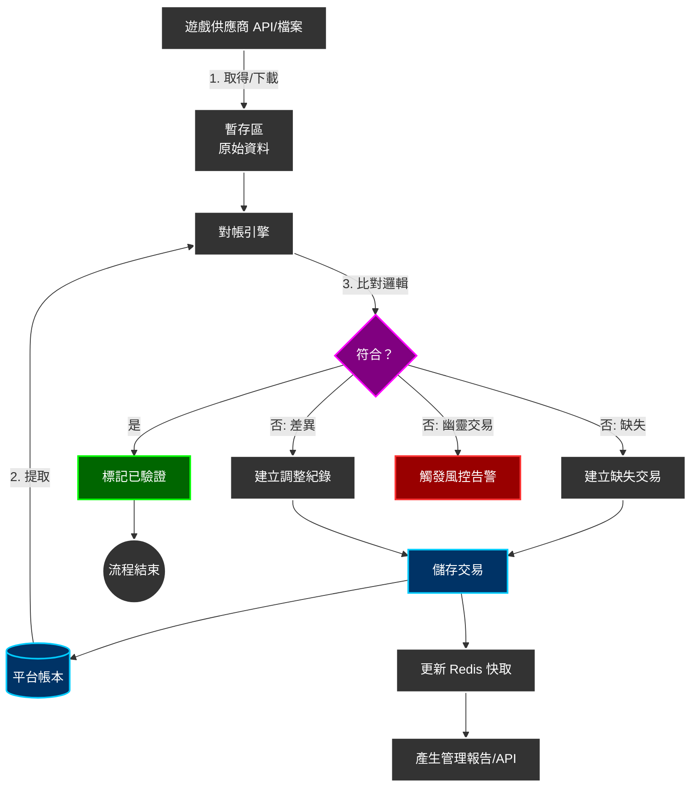
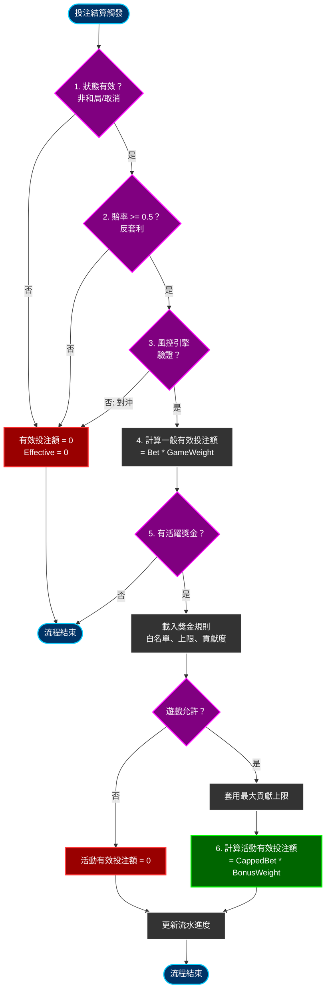

# 有效投注額計算架構

> **規範來源**: [source-archive/02_Finance_Center/02-04_Turnover_and_Game_Reconciliation_Analysis.md](../../source-archive/02_Finance_Center/02-04_Turnover_and_Game_Reconciliation_Analysis.md)
> **目標讀者**: 架構師、後端開發者、風控工程師
> **業務需求**: [Turnover_Reconciliation_Requirements.md](../../requirements/02_Financial_Operations/Turnover_Reconciliation_Requirements.md)
> **同步時間**: 2026-02-09
>
> **技術重點**: 本文檔包含從需求層提取的實作細節（三層驗證架構、Mermaid 流程圖、短路優化）。

---

## 1. 三層驗證架構

### 1.1 架構概述

有效投注額 (Valid Turnover) 計算系統位於三層風控堆疊中的**第 2 層 - 財務狀態因子**。它根據遊戲結果（WIN/LOSS/DRAW）計算有效投注額狀態因子，前提是第 1 層（風控引擎）驗證已通過。

```
+-----------------------------------------------------------------------------+
|                   統一有效投注額驗證堆疊                                      |
+-----------------------------------------------------------------------------+
|                                                                              |
|  第 1 層：風控驗證（Risk Engine - 05-01）                                     |
|  +-------------------------------------------------------------+           |
|  | 職責：拒絕決策                                                 |           |
|  | 檢查：對沖/套利/低賠率/同 IP 對沖                                |           |
|  | 輸出：{ is_valid: boolean, effective_turnover_base: number }   |           |
|  |                                                               |           |
|  | X is_valid = false -> 立即回傳 0（跳過第 2/3 層）               |           |
|  | V is_valid = true  -> 回傳 effective_turnover_base             |           |
|  +-------------------------------------------------------------+           |
|                           | (僅當 is_valid = true)                          |
|  第 2 層：財務層（本模組 - 02-04）                                            |
|  +-------------------------------------------------------------+           |
|  | 職責：狀態因子調整                                              |           |
|  | 檢查：WIN/LOSS/DRAW/CANCEL/HALF_WIN/HALF_LOSS                  |           |
|  | 輸出：valid_turnover_finance                                   |           |
|  |     = effective_turnover_base x status_factor                  |           |
|  |                                                               |           |
|  | 警告：此層不做拒絕邏輯                                           |           |
|  +-------------------------------------------------------------+           |
|                           |                                                  |
|  第 3 層：活動層（04-01）                                                     |
|  +-------------------------------------------------------------+           |
|  | 職責：遊戲權重調整                                              |           |
|  | 檢查：SLOTS/SPORTS/BACCARAT/LOTTERY 等                         |           |
|  | 輸出：activity_valid_turnover                                  |           |
|  |     = valid_turnover_finance x game_weight                     |           |
|  |                                                               |           |
|  | 警告：此層不做拒絕邏輯                                           |           |
|  +-------------------------------------------------------------+           |
|                                                                              |
+-----------------------------------------------------------------------------+
```

### 1.2 職責矩陣

| 職責 | 第 1 層（風控引擎） | 第 2 層（財務） | 第 3 層（活動） |
|---------------|----------------------|-------------------|-------------------|
| **拒絕決策** | 唯一負責 | 不涉及 | 不涉及 |
| **狀態因子調整** | 不涉及 | 唯一負責 | 不涉及 |
| **遊戲權重套用** | 不涉及 | 不涉及 | 唯一負責 |
| **短路回傳** | is_valid=false 回傳 0 | 信任第 1 層結果 | 信任第 2 層結果 |
| **效能影響** | 所有投注執行 | 僅通過第 1 層的投注（~95%）| 僅有活躍獎金的投注 |

---

## 2. 分層處理實作

### 2.1 步驟 1：第 1 層風控引擎驗證

**職責**：拒絕決策（對沖/套利/低賠率）

```typescript
/**
 * 第 1 層：風控引擎驗證（v2.1.0 配置驅動更新）
 * 職責：拒絕決策 + 風險標記
 * 回傳：{
 *   is_valid: boolean,
 *   action_type: 'BLOCK' | 'FLAG' | 'PASS',
 *   matched_rules: string[],
 *   risk_proposal_id: string | null,
 *   effective_turnover_base: number
 * }
 */
const riskValidation = await RiskEngine.validateTurnover({
  bet_id: bet.id,
  player_id: bet.player_id,
  game_type: bet.game_type,
  bet_amount: bet.amount,
  odds: bet.odds,
  odds_type: bet.odds_type
});

// BLOCK 規則拒絕 -> 短路回傳（跳過第 2/3 層）
if (!riskValidation.is_valid && riskValidation.action_type === 'BLOCK') {
  log.info(`[BLOCK] bet_id=${bet.id}, rules=${riskValidation.matched_rules}`);

  // 回傳全零，不呼叫第 2/3 層
  return {
    bet_id: bet.id,
    player_id: bet.player_id,
    effective_turnover_base: 0,
    valid_turnover_finance: 0,
    activity_valid_turnover: 0,
    rejected_by: 'RISK_ENGINE',       // 標記拒絕來源
    action_type: 'BLOCK',
    matched_rules: riskValidation.matched_rules,
    calculated_at: new Date()
  };
}

// FLAG 規則：標記但允許（v2.1.0 核心功能）
if (riskValidation.is_valid && riskValidation.action_type === 'FLAG') {
  log.info(`[FLAG] bet_id=${bet.id}, proposal_id=${riskValidation.risk_proposal_id}`);

  // FLAG 規則正常計算有效投注額，但標記風險提案
  const effective_turnover_base = riskValidation.effective_turnover_base;

  // 記錄風險標記
  await db.insert('bet_risk_flag').values({
    bet_id: bet.id,
    action_type: 'FLAG',
    matched_rules: riskValidation.matched_rules,
    risk_proposal_id: riskValidation.risk_proposal_id,
    flagged_at: new Date()
  });

  // 繼續至第 2 層（有效投注額正常計算）
}

// PASS 規則：正常流程，取得基礎有效投注額（進入第 2 層）
const effective_turnover_base = riskValidation.effective_turnover_base;
log.info(`[第 1 層通過] bet_id=${bet.id}, action_type=${riskValidation.action_type}, effective_turnover_base=${effective_turnover_base}`);
```

### 2.2 步驟 2：第 2 層財務狀態因子調整

**職責**：僅狀態因子調整 -- 不做拒絕決策。

```typescript
/**
 * 第 2 層：財務層狀態因子調整
 * 職責：WIN/LOSS/DRAW/CANCEL 狀態因子套用
 * 前提：第 1 層已通過驗證（is_valid = true）
 *
 * 警告：此層不做拒絕決策；信任第 1 層結果
 */
const status_factor = getStatusFactor(bet.status);
const valid_turnover_finance = effective_turnover_base * status_factor;

log.info(`[第 2 層] bet_id=${bet.id}, status=${bet.status}, status_factor=${status_factor}, valid_turnover_finance=${valid_turnover_finance}`);

/**
 * 狀態因子對應
 * v2.0.0: HALF_WIN/HALF_LOSS = 1.0（標準本金法）
 */
function getStatusFactor(status: BetStatus): number {
  const STATUS_FACTORS = {
    'WIN': 1.0,        // 玩家贏 - 全額有效投注額
    'LOSS': 1.0,       // 玩家輸 - 全額有效投注額
    'DRAW': 0.0,       // 和局 - 無風險，無有效投注額
    'TIE': 0.0,        // 推 - 同和局
    'VOID': 0.0,       // 無效 - 投注無效
    'CANCEL': 0.0,     // 取消 - 投注無效
    'HALF_WIN': 1.0,   // v2.0.0: 半贏 - 全額有效投注額（標準本金法）
    'HALF_LOSS': 1.0,  // v2.0.0: 半輸 - 全額有效投注額（標準本金法）
    'RUNNING': 0.0     // 進行中 - 未結算，不計
  };
  return STATUS_FACTORS[status] ?? 0.0;
}
```

### 2.3 步驟 3：記錄所有層級

**用途**：記錄各層計算結果，用於審計和對帳。

```typescript
/**
 * 步驟 3：記錄三層有效投注額（用於審計和對帳）
 * - effective_turnover_base: 第 1 層結果
 * - valid_turnover_finance:  第 2 層結果
 * - activity_valid_turnover: 第 3 層結果（如適用）
 */
await db.transaction(async (tx) => {
  await tx.insertInto('bet_turnover_record').values({
    bet_id: bet.id,
    player_id: bet.player_id,
    game_type: bet.game_type,

    // 第 1 層結果（v2.1.0 更新）
    effective_turnover_base: effective_turnover_base,
    action_type: riskValidation.action_type,
    matched_rules: riskValidation.matched_rules,
    risk_proposal_id: riskValidation.risk_proposal_id,

    // 第 2 層結果
    status: bet.status,
    status_factor: status_factor,
    valid_turnover_finance: valid_turnover_finance,

    // 第 3 層結果（如適用）
    activity_valid_turnover: activity_valid_turnover ?? 0,
    game_weight: game_weight ?? 1.0,

    calculated_at: new Date(),
    layer_breakdown: JSON.stringify({
      layer1: {
        effective_turnover_base,
        action_type: riskValidation.action_type,
        matched_rules: riskValidation.matched_rules,
        risk_proposal_id: riskValidation.risk_proposal_id
      },
      layer2: { status_factor, valid_turnover_finance },
      layer3: { game_weight, activity_valid_turnover }
    })
  });
});

log.info(`[所有層級已記錄] bet_id=${bet.id}`);
```

### 2.4 效能優化（v2.0.0）

**之前（v1.x）**：
- 第 1 層拒絕仍會觸發第 2 層計算邏輯
- 效能影響：100% 的投注執行第 2 層程式碼

**之後（v2.0.0）**：
- 第 1 層拒絕導致立即短路回傳
- 效能影響：僅通過第 1 層的投注（~95%）執行第 2 層
- **節省**：~5% CPU 和資料庫查詢

---

## 3. 事件驅動資料交換

### 3.1 發布財務有效投注額至事件匯流排

```typescript
// 發布財務有效投注額結果至 Kafka
await kafkaProducer.send({
  topic: 'finance.turnover.calculated',
  messages: [{
    key: bet.player_id,
    value: JSON.stringify({
      bet_id: bet.id,
      player_id: bet.player_id,
      game_type: bet.game_type,
      effective_turnover_base: effective_turnover_base,
      valid_turnover_finance: valid_turnover_finance,
      status: bet.status,
      status_factor: status_factor,
      timestamp: new Date().toISOString()
    })
  }]
});
```

### 3.2 活動系統消費

活動系統訂閱此事件，並在 `valid_turnover_finance` 上套用遊戲權重：

```typescript
// 活動系統消費此事件
const activity_valid_turnover = message.valid_turnover_finance * GAME_WEIGHTS[message.game_type];
```

---

## 4. 免費旋轉 GGR 計算實作

```typescript
/**
 * 計算 GGR（包含免費旋轉成本）
 */
public calculateGGR(date: LocalDate): GgrReport {
    const transactions = this.transactionRepository.findByDate(date);

    let totalTurnover = 0;
    let totalPayout = 0;
    let freespinTurnover = 0;  // 促銷成本追蹤

    for (const tx of transactions) {
        // 有效投注額計算（包含免費旋轉面值）
        if (tx.transactionType.endsWith('_BET')) {
            totalTurnover += tx.turnover;

            if (tx.isFreeRpin) {
                freespinTurnover += tx.turnover;  // 記錄促銷成本
            }
        }

        // 派彩計算
        if (tx.transactionType.endsWith('_WIN')) {
            totalPayout += tx.amount;
        }
    }

    // GGR = 有效投注額 - 派彩
    const ggr = totalTurnover - totalPayout;

    return {
        date,
        totalTurnover,
        freespinTurnover,      // 促銷成本
        cashTurnover: totalTurnover - freespinTurnover,
        totalPayout,
        ggr
    };
}
```

---

## 5. 每日對帳自動修正系統

### 5.1 自動修正實作

```typescript
/**
 * 自動修正流程（僅限低風險偏差）
 */
async function autoCorrectDeviation(reconciliationRecord: ReconciliationRecord): Promise<boolean> {
    // 步驟 1：分析偏差原因
    const rootCause = analyzeDeviationCause(reconciliationRecord);

    if (rootCause.type === 'GAME_WEIGHT_CONFIG_CHANGE') {
        // 遊戲權重配置變更 -> 重新計算活動有效投注額
        await recalculateActivityTurnover(
            reconciliationRecord.playerId,
            reconciliationRecord.date,
            rootCause.newGameWeight
        );

        log.info('[自動修正] 遊戲權重配置已更新，重新計算活動有效投注額');
        return true;
    }

    if (rootCause.type === 'STATUS_FACTOR_MISMATCH') {
        // 狀態因子錯誤 -> 重新計算財務有效投注額
        await recalculateFinanceTurnover(
            reconciliationRecord.playerId,
            reconciliationRecord.date,
            rootCause.correctStatusFactor
        );

        log.info('[自動修正] 狀態因子已修正，重新計算財務有效投注額');
        return true;
    }

    if (rootCause.type === 'TIMEZONE_BOUNDARY_ISSUE') {
        // 時區邊界問題 -> 調整對帳時間視窗
        await adjustReconciliationTimeWindow(
            reconciliationRecord.playerId,
            reconciliationRecord.date
        );

        log.info('[自動修正] 時區邊界已調整');
        return true;
    }

    // 無法自動修正，升級至人工審核
    log.warn('[自動修正失敗] 根本原因無法自動修正，升級至人工審核');
    return false;
}
```

### 5.2 補償執行流程

```typescript
/**
 * 補償執行流程
 */
async function executeCompensation(deviation: DeviationRecord): Promise<CompensationResult> {
    const compensationType = determineCompensationType(deviation);

    // 步驟 1：建立補償紀錄
    const compensation = await db.insert('compensation_records').values({
        deviation_id: deviation.id,
        player_id: deviation.playerId,
        compensation_type: compensationType,
        original_amount: deviation.originalAmount,
        corrected_amount: deviation.correctedAmount,
        compensation_amount: Math.abs(deviation.originalAmount - deviation.correctedAmount),
        status: 'PENDING_APPROVAL',
        created_at: new Date()
    });

    // 步驟 2：根據類型決定自動或手動
    if (compensationType === 'AUTO_ADJUST_FINANCE' || compensationType === 'AUTO_ADJUST_ACTIVITY') {
        // 自動補償（僅內部有效投注額調整）
        await adjustTurnoverRecord(deviation.playerId, deviation.date, compensation.compensationAmount);

        compensation.status = 'COMPLETED';
        compensation.approved_at = new Date();
        compensation.approved_by = 'SYSTEM_AUTO';

        log.info('[補償] 自動調整玩家 player_id={} 的有效投注額，金額={}',
            deviation.playerId, compensation.compensationAmount);

    } else {
        // 需要人工核准（涉及錢包餘額變更）
        await createApprovalWorkflow(compensation);

        await notifyFinanceTeam({
            type: 'COMPENSATION_APPROVAL_REQUIRED',
            compensationId: compensation.id,
            playerId: deviation.playerId,
            amount: compensation.compensationAmount,
            priority: compensation.compensationAmount > 1000 ? 'HIGH' : 'MEDIUM'
        });

        log.info('[補償] 等待核准，玩家 player_id={}，金額={}',
            deviation.playerId, compensation.compensationAmount);
    }

    return compensation;
}
```

---

## 6. 對帳報告資料模型

```typescript
interface DailyReconciliationReport {
  date: string;
  total_bets_processed: number;
  total_finance_turnover: number;
  total_activity_turnover: number;
  expected_ratio: number;
  actual_ratio: number;
  deviation_percentage: number;
  mismatched_players: {
    player_id: string;
    finance_turnover: number;
    activity_turnover: number;
    deviation: number;
  }[];
  status: 'VERIFIED' | 'WARNING' | 'CRITICAL';
}
```

---

## 7. 告警配置

```yaml
alerts:
  - name: turnover_calculation_latency_high
    condition: finance.turnover.calculation.latency_p99 > 500ms
    severity: WARNING
    notify: slack:#finance-ops

  - name: risk_engine_call_failure
    condition: finance.turnover.risk_engine.call.success_rate < 99%
    severity: CRITICAL
    notify: pagerduty:finance-oncall

  - name: daily_reconciliation_deviation
    condition: finance.turnover.daily_reconciliation.deviation_rate > 0.01
    severity: WARNING
    notify: slack:#finance-ops, email:finance-team@company.com

  - name: event_publish_failure
    condition: finance.turnover.event_publish.success_rate < 99.9
    severity: CRITICAL
    notify: pagerduty:finance-oncall
```

---

## 8. 遊戲對帳資料流



---

## 9. 有效投注額計算流程

此圖表顯示單筆投注如何同時計算一般有效投注額和活動有效投注額：



---

## 10. SmartAdmin 架構對應

### 10.1 模組分層設計

SmartAdmin 對有效投注額計算模組使用嚴格的五層架構：

| 層級 | 類別名稱模式 | 職責 | 註解限制 |
|-------|-------------------|----------------|----------------------|
| **Controller** | `TurnoverController` | 接收 HTTP 請求，參數驗證，回傳 ResponseDTO | 禁用 @Transactional |
| **Service** | `TurnoverService` | 業務協調，呼叫 Manager/Dao，回傳 Option/Try | 禁用 @Transactional |
| **Manager** | `TurnoverCalculationManager` | 交易管理，跨表操作，快取控制 | **僅此層** @Transactional |
| **Dao** | `BetTurnoverRecordDao` | 資料庫 CRUD，MyBatis Mapper | 無業務邏輯 |
| **Entity** | `BetTurnoverRecordEntity` | 資料模型，1:1 對應表結構 | 無業務邏輯 |

### 10.2 依賴規則（由 ArchitectureTest 強制）

```text
Controller -> Service (允許)
Service -> Dao      (允許, 單表 CRUD)
Service -> Manager  (允許, 需要 @Transactional 時)
Manager -> Dao      (允許)

Controller -> Dao   (禁止, 違反分層)
Controller -> Manager (禁止, 違反分層)
```

### 10.3 DAO 層 - MyBatis Mapper

```xml
<?xml version="1.0" encoding="UTF-8"?>
<!DOCTYPE mapper PUBLIC "-//mybatis.org//DTD Mapper 3.0//EN"
        "http://mybatis.org/dtd/mybatis-3-mapper.dtd">
<mapper namespace="net.lab1024.sa.admin.module.business.finance.turnover.dao.BetTurnoverRecordDao">

    <!-- 依玩家 ID 和日期查詢有效投注額紀錄 -->
    <select id="selectByPlayerIdAndDate" resultType="net.lab1024.sa.admin.module.business.finance.turnover.domain.entity.BetTurnoverRecordEntity">
        SELECT *
        FROM t_bet_turnover_record
        WHERE player_id = #{playerId}
          AND DATE(calculated_at) = #{date}
          AND deleted = 0
        ORDER BY calculated_at DESC
    </select>

    <!-- 依投注 ID 查詢有效投注額紀錄 -->
    <select id="selectByBetId" resultType="net.lab1024.sa.admin.module.business.finance.turnover.domain.entity.BetTurnoverRecordEntity">
        SELECT *
        FROM t_bet_turnover_record
        WHERE bet_id = #{betId}
          AND deleted = 0
        LIMIT 1
    </select>
</mapper>
```

### 10.4 基礎模組依賴

有效投注額計算模組依賴以下 SmartAdmin 基礎模組：

| 基礎模組 | 用途 | 參考位置 |
|------------------|-------|-------------------|
| **foundation.redis-lock** | 分佈式鎖，防止重複計算 | TurnoverCalculationManager |
| **foundation.cache** | Caffeine + Redis 快取 | TurnoverCalculationManager.getTurnoverByBetId() |
| **foundation.audit-log** | 審計日誌記錄 | 有效投注額計算後自動記錄 |
| **foundation.mq** | Kafka 事件發布 | 發布 finance.turnover.calculated 事件 |
| **foundation.retry** | 失敗重試策略 | 風控引擎呼叫失敗重試 |

### 10.4.1 SmartAdmin Java 實作

```java
@Service
@RequiredArgsConstructor
public class TurnoverService {

    private final BetTurnoverRecordDao turnoverDao;
    private final TurnoverCalculationManager turnoverManager;
    private final RiskEngineClient riskEngineClient;

    /**
     * 使用 Vavr Option 依投注 ID 查詢有效投注額紀錄。
     * Service 層可直接呼叫 Dao 進行簡單查詢。
     */
    public Option<TurnoverRecordVO> getTurnoverByBetId(String betId) {
        return Option.of(turnoverDao.selectByBetId(betId))
            .map(entity -> SmartBeanUtil.copy(entity, TurnoverRecordVO.class));
    }

    /**
     * 使用三層驗證計算投注的有效投注額。
     * 委派 Manager 進行交易操作。
     */
    public ResponseDTO<TurnoverResult> calculateTurnover(BetSettleForm form) {
        // 第 1 層：風控引擎驗證（BLOCK 時短路）
        RiskValidationResult riskResult = riskEngineClient.validateTurnover(form);
        if (!riskResult.isValid() && riskResult.getActionType() == ActionType.BLOCK) {
            return ResponseDTO.ok(TurnoverResult.blocked(riskResult.getMatchedRules()));
        }

        // 第 2 層和第 3 層：委派 Manager 進行交易計算
        return turnoverManager.calculateAndRecordTurnover(form, riskResult);
    }
}

@Component
@RequiredArgsConstructor
public class TurnoverCalculationManager {

    private final BetTurnoverRecordDao turnoverDao;
    private final KafkaTemplate<String, String> kafkaTemplate;

    private static final Map<String, BigDecimal> STATUS_FACTORS = Map.of(
        "WIN", BigDecimal.ONE,
        "LOSS", BigDecimal.ONE,
        "DRAW", BigDecimal.ZERO,
        "CANCEL", BigDecimal.ZERO,
        "HALF_WIN", BigDecimal.ONE,
        "HALF_LOSS", BigDecimal.ONE
    );

    /**
     * 使用交易支援計算並記錄有效投注額。
     * 依 SmartAdmin 架構，@Transactional 僅允許在 Manager 層使用。
     */
    @Transactional(rollbackFor = Throwable.class)
    public ResponseDTO<TurnoverResult> calculateAndRecordTurnover(
            BetSettleForm form, RiskValidationResult riskResult) {

        // 第 2 層：套用狀態因子
        BigDecimal statusFactor = STATUS_FACTORS.getOrDefault(form.getStatus(), BigDecimal.ZERO);
        BigDecimal validTurnover = riskResult.getEffectiveTurnoverBase()
            .multiply(statusFactor);

        // 記錄有效投注額
        BetTurnoverRecordEntity record = new BetTurnoverRecordEntity();
        record.setBetId(form.getBetId());
        record.setPlayerId(form.getPlayerId());
        record.setEffectiveTurnoverBase(riskResult.getEffectiveTurnoverBase());
        record.setStatusFactor(statusFactor);
        record.setValidTurnoverFinance(validTurnover);
        record.setActionType(riskResult.getActionType().name());
        turnoverDao.insert(record);

        // 發布事件給活動層（第 3 層）
        publishTurnoverEvent(record);

        return ResponseDTO.ok(TurnoverResult.success(validTurnover));
    }

    private void publishTurnoverEvent(BetTurnoverRecordEntity record) {
        TurnoverCalculatedEvent event = SmartBeanUtil.copy(record, TurnoverCalculatedEvent.class);
        kafkaTemplate.send("finance.turnover.calculated", record.getPlayerId().toString(),
            JSON.toJSONString(event));
    }
}
```

### 10.5 配置定義

**賠率閾值**（由風控引擎定義）：
```json
{
  "odds_thresholds": {
    "EUR": 1.5,
    "HK": 0.5,
    "MY": 0.5,
    "ID": 1.2
  }
}
```

**遊戲權重**（由活動模組定義）：
```json
{
  "game_weights": {
    "SLOTS": 1.0,
    "SPORTS": 1.0,
    "BACCARAT": 0.15,
    "BLACKJACK": 0.10,
    "ROULETTE": 0.20,
    "VIDEO_POKER": 0.15,
    "LOTTERY": 0.10,
    "PVP": 0.0
  }
}
```

**狀態因子**（由財務模組定義）：
```json
{
  "status_factors": {
    "WIN": 1.0,
    "LOSS": 1.0,
    "DRAW": 0.0,
    "TIE": 0.0,
    "VOID": 0.0,
    "CANCEL": 0.0,
    "HALF_WIN": 0.5,
    "HALF_LOSS": 0.5,
    "RUNNING": 0.0
  }
}
```

---

## 11. 資料模型變更（v2.1.0）

**`bet_turnover_record` 表新增欄位**：
- `action_type VARCHAR(20)` - 風控動作類型（BLOCK/FLAG/PASS）
- `matched_rules JSON` - 匹配規則列表
- `risk_proposal_id VARCHAR(50)` - 風控提案 ID

**向後相容**：
- 第 2/3 層處理流程保持不變
- 僅第 1 層 API 變更（內部實作）

### 11.1 完整資料庫結構

```sql
-- 三層驗證的投注有效投注額紀錄表
CREATE TABLE t_bet_turnover_record (
    id                      BIGSERIAL PRIMARY KEY,
    tenant_id               BIGINT NOT NULL,
    bet_id                  VARCHAR(100) NOT NULL,
    player_id               BIGINT NOT NULL,
    game_type               VARCHAR(50) NOT NULL,

    -- 第 1 層：風控引擎結果
    effective_turnover_base DECIMAL(18, 4) NOT NULL DEFAULT 0,
    action_type             VARCHAR(20) NOT NULL DEFAULT 'PASS',
    matched_rules           JSONB,
    risk_proposal_id        VARCHAR(50),

    -- 第 2 層：財務狀態結果
    status                  VARCHAR(20) NOT NULL,
    status_factor           DECIMAL(5, 4) NOT NULL DEFAULT 1.0000,
    valid_turnover_finance  DECIMAL(18, 4) NOT NULL DEFAULT 0,

    -- 第 3 層：活動權重結果
    game_weight             DECIMAL(5, 4) NOT NULL DEFAULT 1.0000,
    activity_valid_turnover DECIMAL(18, 4) NOT NULL DEFAULT 0,

    layer_breakdown         JSONB,
    calculated_at           TIMESTAMP NOT NULL DEFAULT NOW(),
    created_at              TIMESTAMP NOT NULL DEFAULT NOW(),
    updated_at              TIMESTAMP NOT NULL DEFAULT NOW(),
    deleted                 BOOLEAN NOT NULL DEFAULT FALSE,
    CONSTRAINT uk_bet_turnover UNIQUE (tenant_id, bet_id)
);

CREATE INDEX idx_turnover_player ON t_bet_turnover_record(tenant_id, player_id, calculated_at DESC);
CREATE INDEX idx_turnover_action ON t_bet_turnover_record(tenant_id, action_type, calculated_at)
    WHERE action_type IN ('BLOCK', 'FLAG');
CREATE INDEX idx_turnover_date ON t_bet_turnover_record(tenant_id, DATE(calculated_at));

-- 每日對帳報告表
CREATE TABLE t_daily_reconciliation_report (
    id                      BIGSERIAL PRIMARY KEY,
    tenant_id               BIGINT NOT NULL,
    report_date             DATE NOT NULL,
    total_bets_processed    INTEGER NOT NULL DEFAULT 0,
    total_finance_turnover  DECIMAL(18, 4) NOT NULL DEFAULT 0,
    total_activity_turnover DECIMAL(18, 4) NOT NULL DEFAULT 0,
    expected_ratio          DECIMAL(10, 6),
    actual_ratio            DECIMAL(10, 6),
    deviation_percentage    DECIMAL(10, 6),
    status                  VARCHAR(20) NOT NULL DEFAULT 'PENDING',
    mismatched_players      JSONB,
    created_at              TIMESTAMP NOT NULL DEFAULT NOW(),
    updated_at              TIMESTAMP NOT NULL DEFAULT NOW(),
    CONSTRAINT uk_reconciliation_date UNIQUE (tenant_id, report_date)
);

CREATE INDEX idx_reconciliation_status ON t_daily_reconciliation_report(tenant_id, status, report_date DESC);
```

---

## 12. 變更日誌

### v2.1.0 (2026-02-02)

**重大變更**：
1. 更新第 1 層處理以支援配置驅動風控
   - 新增 action_type (BLOCK/FLAG/PASS) 支援
   - BLOCK 規則即時阻擋（回傳有效投注額 = 0）
   - FLAG 規則標記但允許（正常有效投注額計算 + 產生風控提案）
   - 更新回傳結構：`matched_rules[]` 取代 `risk_code`
   - 新增 `risk_proposal_id` 欄位用於風控提案追蹤

2. 與風控系統 v2.1.0 配置驅動架構整合
   - 支援 t_risk_rule_config 配置表驅動規則
   - 支援多維度風控規則（遊戲類型、單一遊戲、單一玩家）

### v2.0.0 (2026-01-29)

**重大變更**：
1. 釐清三層驗證架構職責
   - 第 1 層拒絕導致立即短路回傳
   - 清楚的職責矩陣：第 1 層 = 拒絕，第 2 層 = 狀態調整，第 3 層 = 權重套用
   - 效能優化：~5% CPU 和資料庫查詢節省

2. 新增 SmartAdmin 架構對應（第 10 節）
   - 完整五層架構程式碼範例
   - 基礎模組依賴文檔
   - ArchitectureTest 驗證規則

### v1.0.0 (2026-01-28)

**初始版本**：
- 有效投注額計算邏輯
- 遊戲對帳邏輯
- 流程圖和資料流圖

---

**文檔版本**: 4.0.0
**最後更新**: 2026-02-08
**維護團隊**: 財務團隊 & 後端團隊 & 風控團隊
