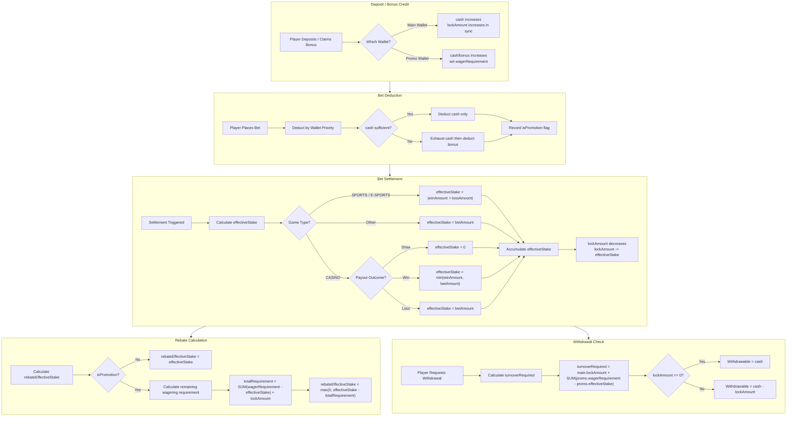
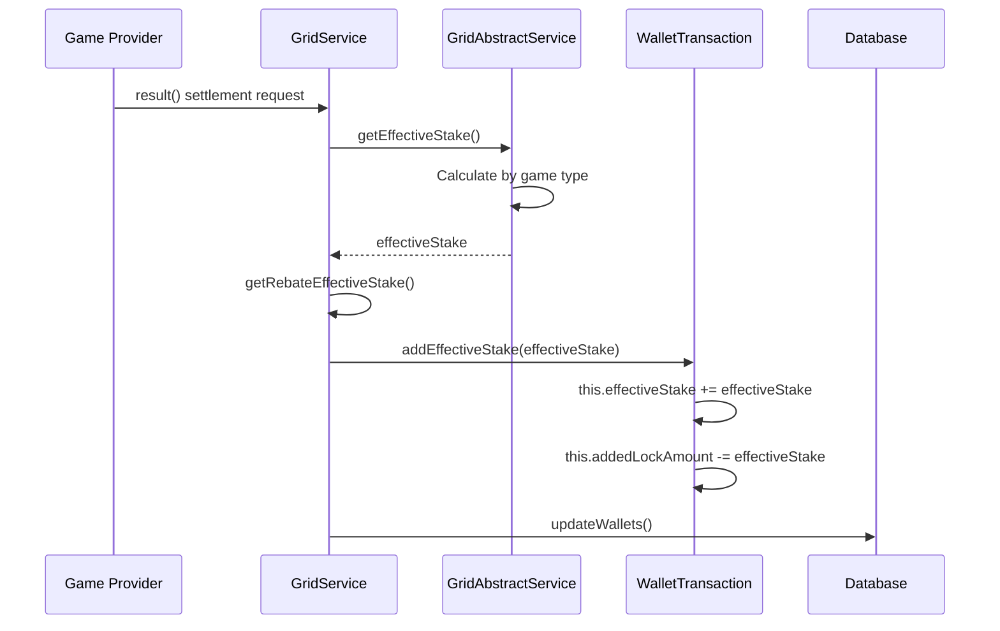
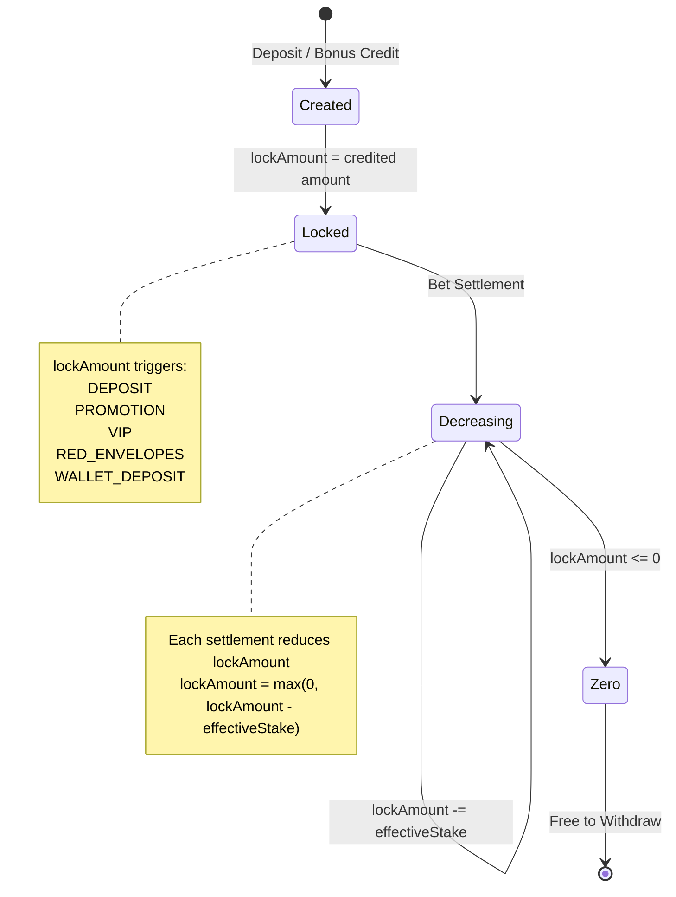
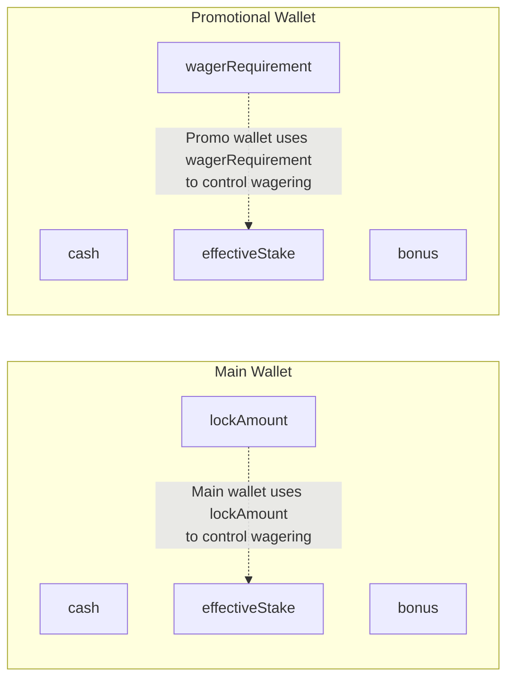
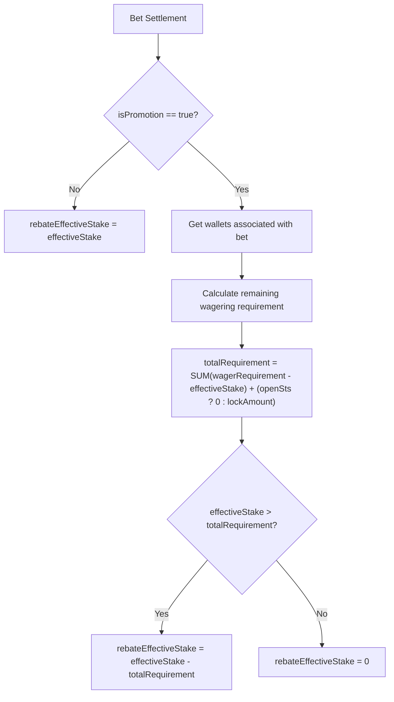
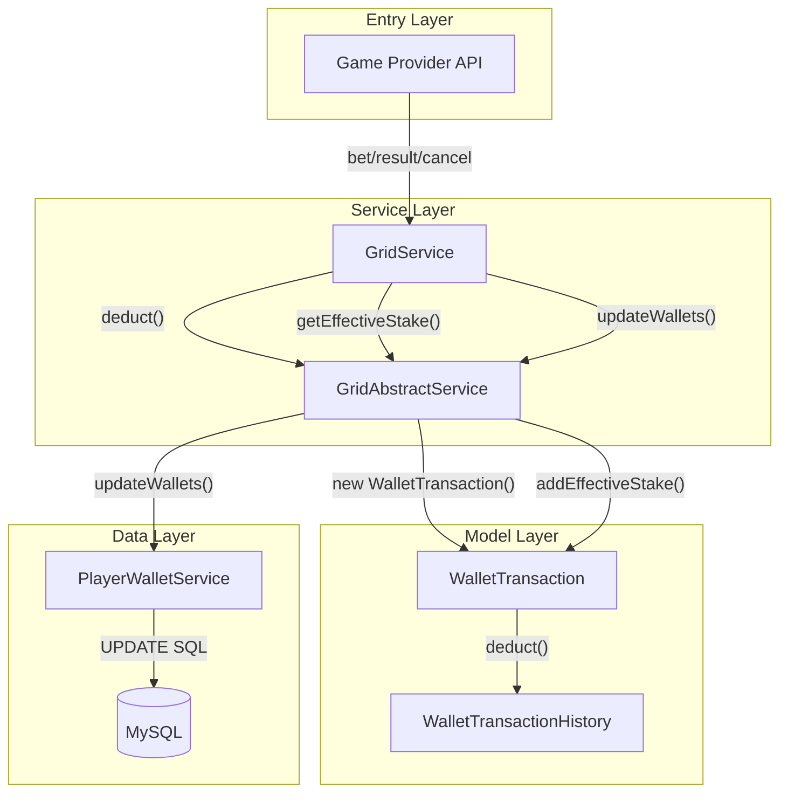

# Turnover Calculation Logic Detail

> **Canonical Source**: [02-04-02_Calculation_Logic.md](../../source/02_Finance_Center/02-04-diagrams/02-04-02_Calculation_Logic.md)
> **Audience**: Architects, Backend Developers
> **Business Requirements**: None
> **Last Synced**: 2026-02-08

---

## 1. Core Concept Definitions

| Term | Description | Storage Location |
|------|------|----------|
| **effectiveStake** | Key metric for determining whether player meets wagering requirements | `player_wallet.effective_stake` |
| **lockAmount** | Non-withdrawable amount in main wallet, unlocked via effective stakes | `player_wallet.lock_amount` (main wallet only) |
| **wagerRequirement** | Wagering threshold that must be met for promotional wallet | `player_wallet.wager_requirement` (promo wallet only) |
| **turnoverRequired** | Total turnover player must complete = main wallet lockAmount + SUM(promo wallet wagerRequirement - effectiveStake) | Calculated value, not a DB column |
| **rebateEffectiveStake** | Effective stake eligible for rebate calculation | `transaction.rebate_effective_stake` |

---

## 2. Complete Turnover Calculation Flow

### 2.1 End-to-End Process



---

## 3. Effective Stake (effectiveStake) Calculation

### 3.1 Calculation Trigger Sequence



### 3.2 Formulas by Game Type

| Game Type | Condition | effectiveStake Formula |
|----------|------|---------------------|
| **SPORTS / E-SPORTS** | All outcomes | `abs(winAmount + lossAmount)` |
| **CASINO** | Draw (payout == betAmount) | `0` |
| **CASINO** | Win (winAmount > 0) | `min(winAmount, betAmount)` |
| **CASINO** | Loss (winAmount == 0) | `betAmount` |
| **Other Types** | All outcomes | `betAmount` |

### 3.3 Code References

```java
// GridAbstractService.java:171-193
protected long getEffectiveStake(GameType gameType, long betAmount, long winAmount, long lossAmount) {
    return switch (gameType) {
        case SPORTS, E_SPORTS -> Math.abs(winAmount + lossAmount);
        case CASINO -> {
            if (winAmount == betAmount) yield 0L;          // Draw
            else if (winAmount > 0) yield Math.min(winAmount, betAmount); // Win
            else yield betAmount;                            // Loss
        }
        default -> betAmount;
    };
}
```

```java
// WalletTransaction.java:119-125
public void addEffectiveStake(long effectiveStake) {
    this.effectiveStake += effectiveStake;
    this.addedLockAmount -= effectiveStake;
}
```

---

## 4. lockAmount Lifecycle

### 4.1 State Diagram



### 4.2 lockAmount Change Events

| Operation | lockAmount Change | Description |
|------|-----------------|------|
| Deposit Credit | **+amount** | Must complete wagering before withdrawal |
| Claim Bonus | **+amount** | Same as above |
| VIP Reward | **+amount** | Same as above |
| Place Bet | **No change** | Only deducts funds, does not affect lockAmount |
| Bet Settlement | **-effectiveStake** | Unlocks equivalent amount |
| Bet Cancellation | **+effectiveStake** | Restores original lock |

### 4.3 Code References

- **Increase logic**: `WalletTransaction.java:52-101`
- **Decrease logic**: `WalletTransaction.java:119-125`

---

## 5. Promotional Wallet Wagering Logic

### 5.1 Main Wallet vs. Promotional Wallet



### 5.2 Promo Wallet Completion Check

```
Promotional wallet wagering met = (effectiveStake >= wagerRequirement)
```

### 5.3 Promo-to-Main Transfer Wagering Calculation

When transferring out of a promotional wallet, remaining wagering requirement transfers proportionally:

```
transferWagerRequirement = (wagerRequirement - effectiveStake) * (transferAmount / (cash + bonus))
```

---

## 6. Rebate Effective Stake (rebateEffectiveStake) Calculation

### 6.1 Flow



### 6.2 Key Logic Summary

| Bet Type | Condition | rebateEffectiveStake |
|----------|------|----------------------|
| Non-promotional bet | isPromotion = false | `effectiveStake` |
| Promotional bet | Wagering completed | `effectiveStake` |
| Promotional bet | Wagering incomplete | `max(0, effectiveStake - remainingRequirement)` |

### 6.3 Code Reference

- `GridAbstractService.java:195-239`

---

## 7. Withdrawal Turnover Requirement (turnoverRequired)

### 7.1 Formula

```
turnoverRequired = main.lockAmount + SUM(promo.wagerRequirement - promo.effectiveStake)
```

Where:
- `main.lockAmount`: Main wallet locked amount
- `SUM(...)`: Sum of remaining wagering requirements across all **active** promotional wallets

### 7.2 Code Reference

- `PlayerManager.java:709-718`

---

## 8. Database Update Logic

### 8.1 Wallet Update SQL

```sql
UPDATE player_wallet
SET
    cash = cash + #{cashDelta},
    bonus = bonus + #{bonusDelta},
    clean_amount = GREATEST(clean_amount + #{cleanDelta}, 0),
    lock_amount = GREATEST(lock_amount + #{lockDelta}, 0),
    effective_stake = effective_stake + #{effectiveStakeDelta}
WHERE
    id = #{walletId}
    AND cash + #{cashDelta} >= 0
    AND bonus + #{bonusDelta} >= 0;
```

> **Note**: `GREATEST(..., 0)` ensures `clean_amount` and `lock_amount` never go below 0.

---

## 9. Complete Data Flow



---

## 10. Verification Checklist

### 10.1 Effective Stake Calculation

- [ ] SPORTS/E-SPORTS uses `abs(winAmount + lossAmount)` -- confirm correctness
- [ ] CASINO draw: effectiveStake = 0 -- confirm expected behavior
- [ ] CASINO win: `min(winAmount, betAmount)` -- confirm logic

### 10.2 lockAmount Logic

- [ ] Only main wallet has lockAmount -- confirm correctness
- [ ] lockAmount trigger types (DEPOSIT, PROMOTION, VIP, RED_ENVELOPES) -- confirm completeness
- [ ] lockAmount minimum is 0 (never negative) -- confirm correctness

### 10.3 Rebate Calculation

- [ ] Promotional bets require completed wagering for rebate eligibility -- confirm expected behavior
- [ ] `REBATE_BETTING_LOCKED` switch logic -- confirm if adjustments needed

### 10.4 Withdrawal Turnover

- [ ] turnoverRequired formula correctness -- confirm
- [ ] Only counting "active" promotional wallets -- confirm correctness

---

## 11. Code Index

| Function | File | Method |
|------|------|----------|
| Bet Deduction | GridAbstractService.java | `deduct()` |
| Effective Stake Calculation | GridAbstractService.java | `getEffectiveStake()` |
| Rebate Effective Stake | GridAbstractService.java | `getRebateEffectiveStake()` |
| Wallet Transaction Processing | WalletTransaction.java | `deduct()`, `addEffectiveStake()` |
| Bet Settlement | GridService.java | `result()` |
| Withdrawal Turnover Query | PlayerManager.java | `getBalance()` |
| Database Update | PlayerWalletServiceImpl.java | Lines 69-86 |

---

**Document Version**: 1.0.0
**Last Updated**: 2026-02-08
**Maintainer**: Finance Team & Backend Team
