# 有效投注額計算流程圖與時序圖

> **Canonical Source**: [source-archive/02_Finance_Center/02-04-diagrams/02-04-01_Flowcharts_and_Sequences.md](../../source-archive/02_Finance_Center/02-04-diagrams/02-04-01_Flowcharts_and_Sequences.md)
> **Audience**: 架構師、後端開發人員、數據工程師
> **Business Requirements**: [Turnover_Business_Rules.md](../../requirements/03_Gaming_Operations/Turnover_Business_Rules.md)
> **Last Synced**: 2026-02-08

---

## 文件目的

本文件提供 iGaming 平台有效投注額 (Valid Turnover) 計算系統的技術視覺化呈現，包括三層驗證架構、詳細時序圖、各層流程圖，以及投注生命週期狀態機。所有圖表均供實作或維護有效投注額計算管線的工程團隊使用。

**版本歷史**:
- v4.0.0 (2026-01-28): 修正 Layer 2 邏輯——移除錯誤的 `status_factor` 動態修改 `valid_bet`；採用標準本金法 (Standard Principal Method)；新增風險標記機制與稽核追溯支援
- v3.0.0 (2026-01-27): 初始建立

**關鍵設計決策**:
- Layer 1 (風控引擎 Risk Engine) 一次性決定 `valid_bet`
- Layer 2 (財務中心 Finance Center) 僅記錄結算狀態——**不修改** `valid_bet`
- Layer 3 (活動系統 Activity System) 應用遊戲權重計算活動貢獻

**參考文件**:
- 術語標準 *(規劃中 - source-archive/00_Foundation/00-03_Terminology_Standards)*
- [Risk Framework](../../source-archive/05_Risk_Control/05-01_Risk_Framework.md)
- [Turnover and Reconciliation Analysis](../../source-archive/02_Finance_Center/02-04_Turnover_and_Game_Reconciliation_Analysis.md)
- [Activity Bonus](../../source-archive/04_Activity_Center/04-04_Activity_Bonus.md)

---

## 目錄

1. [架構概覽](#1-架構概覽)
2. [端對端時序圖](#2-端對端時序圖)
3. [主流程圖](#3-主流程圖)
4. [Layer 1: 風控引擎驗證](#4-layer-1-風控引擎驗證)
5. [Layer 2: 財務結算記錄](#5-layer-2-財務結算記錄)
6. [Layer 3: 活動權重應用](#6-layer-3-活動權重應用)
7. [投注生命週期狀態機](#7-投注生命週期狀態機)
8. [計算範例](#8-計算範例)
9. [風險標記機制](#9-風險標記機制)
10. [設計原則：Layer 2 不修改 Valid Bet](#10-設計原則layer-2-不修改-valid-bet)

---

## 1. 架構概覽

### 1.1 三層驗證架構

有效投注額計算系統採用三層驗證架構。資料從玩家投注開始，依序流經 Layer 1 (風控)、Layer 2 (財務)、Layer 3 (活動)，最後到達應用場景。

> **圖表複雜度**: 24 個節點（透過 subgraph 分組優化）
> **閱讀指南**: 按資料流順序閱讀（玩家投注 -> Layer 1 -> Layer 2 -> Layer 3 -> 應用場景）
> **關鍵要點**:
> - Layer 1 風控驗證決定 `valid_bet`
> - Layer 2 僅記錄狀態，**不修改** `valid_bet`
> - Layer 3 應用遊戲權重計算活動貢獻

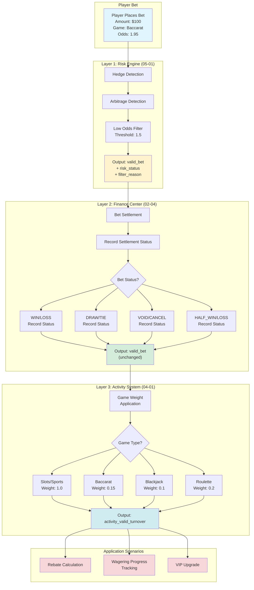

---

## 2. 端對端時序圖

### 2.1 完整有效投注額計算時序

此時序圖展示投注從下注到結算、三層驗證、派彩及稽核日誌的完整生命週期。

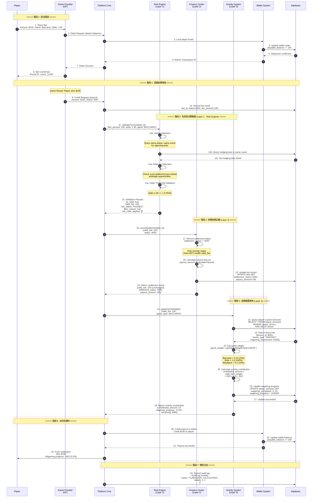

---

## 3. 主流程圖

### 3.1 主流程

> **圖表複雜度**: 26 個節點（透過 subgraph 分組優化）
> **閱讀指南**: 按三層架構順序閱讀（輸入 -> Layer 1 -> Layer 2 -> Layer 3 -> 更新）
> **關鍵決策點**:
> - Layer 1: 對沖/套利/低賠率 -> 決定 `valid_bet` 是否為 0
> - Layer 2: 投注狀態分支 (WIN/LOSS/DRAW/VOID/HALF) -> 僅記錄狀態
> - Layer 3: 遊戲類型分支 (Slots/Baccarat/Blackjack/Roulette) -> 應用對應權重
> - 更新: 是否達成流水要求？ -> 決定是否解鎖提款

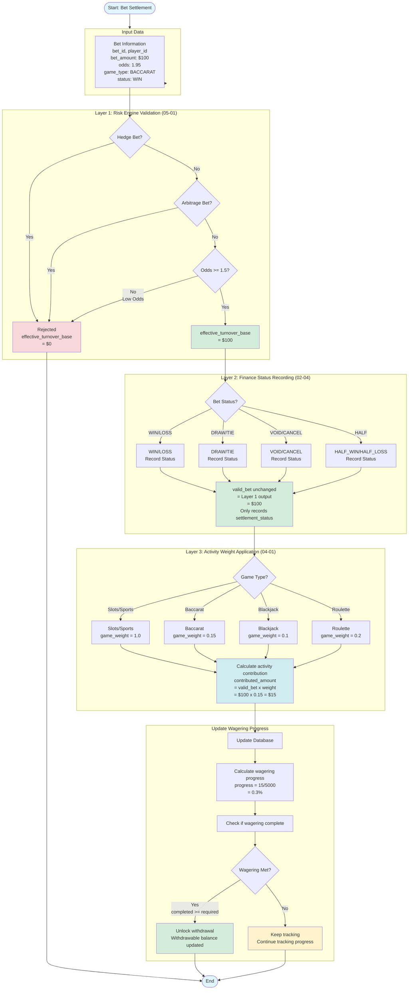

---

## 4. Layer 1: 風控引擎驗證

### 4.1 對沖偵測流程

對沖偵測流程識別玩家在同一遊戲局中下注對立選項的情況（例如：在百家樂中同時投注莊家和閒家）。


### 4.2 賠率門檻檢查

低賠率投注被過濾，以防止玩家利用幾乎必贏的結果來完成流水要求 (Wagering Requirement)。

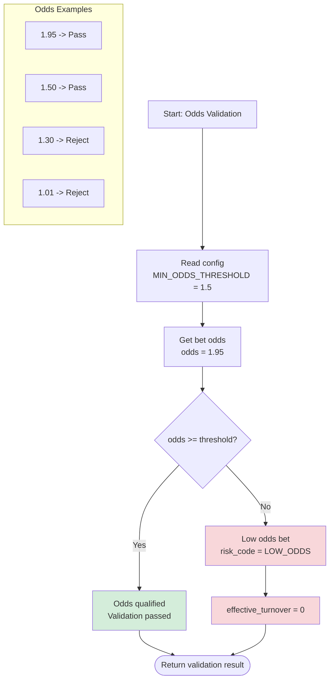

---

## 5. Layer 2: 財務結算記錄

### 5.1 結算狀態記錄流程

Layer 2 接收 Layer 1 輸出的 `valid_bet` 值作為不可變輸入。它記錄結算狀態並計算派彩金額，但**永不修改** `valid_bet` 值。


### 5.2 結算狀態與 Valid Bet 對照表

**核心原則**: `valid_bet` 由 Layer 1 (風控引擎) 一次性決定。Layer 2 僅記錄結算狀態，**不修改** `valid_bet` 值。

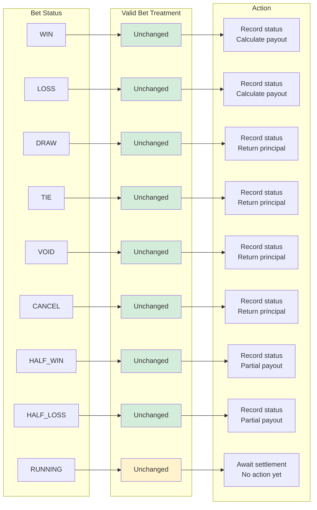

---

## 6. Layer 3: 活動權重應用

### 6.1 遊戲權重應用流程

Layer 3 接收管線驗證後的 `valid_bet`，並應用遊戲特定權重計算活動貢獻金額。

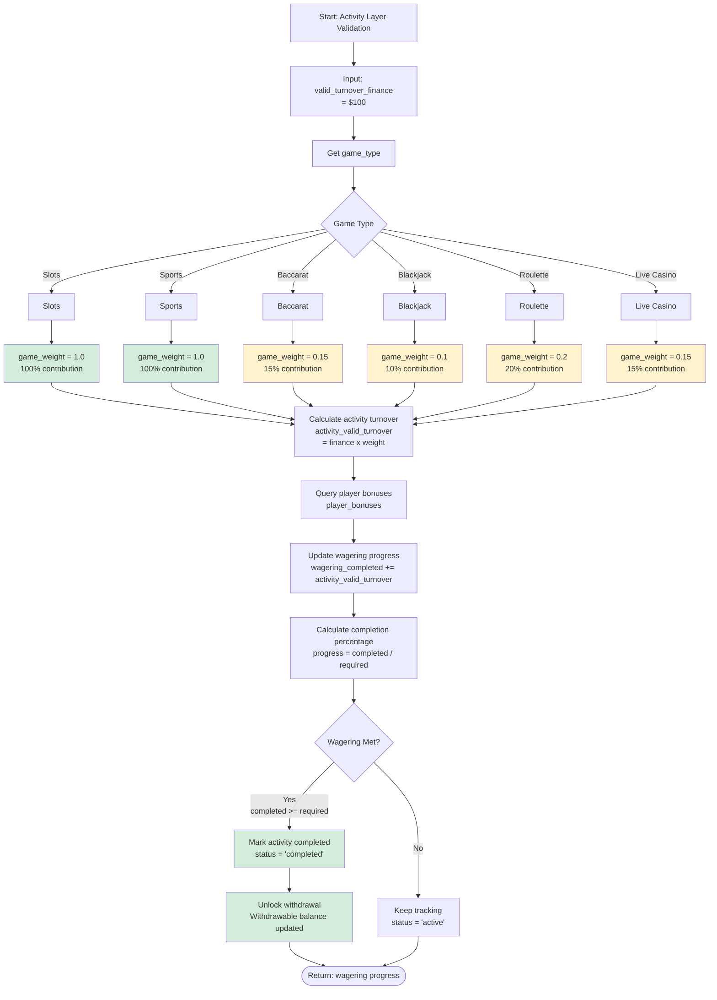

### 6.2 遊戲權重配置表

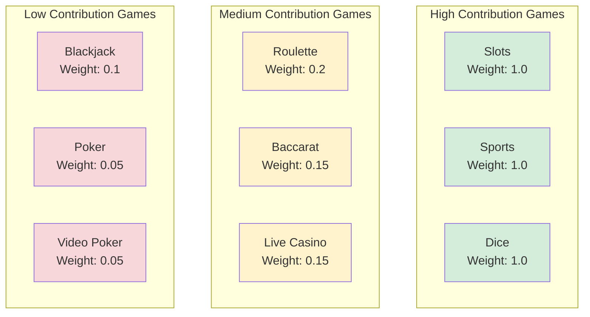

---

## 7. 投注生命週期狀態機

### 7.1 投注生命週期（狀態機）

此狀態圖模擬投注從下注到結算及有效投注額計算的完整生命週期。

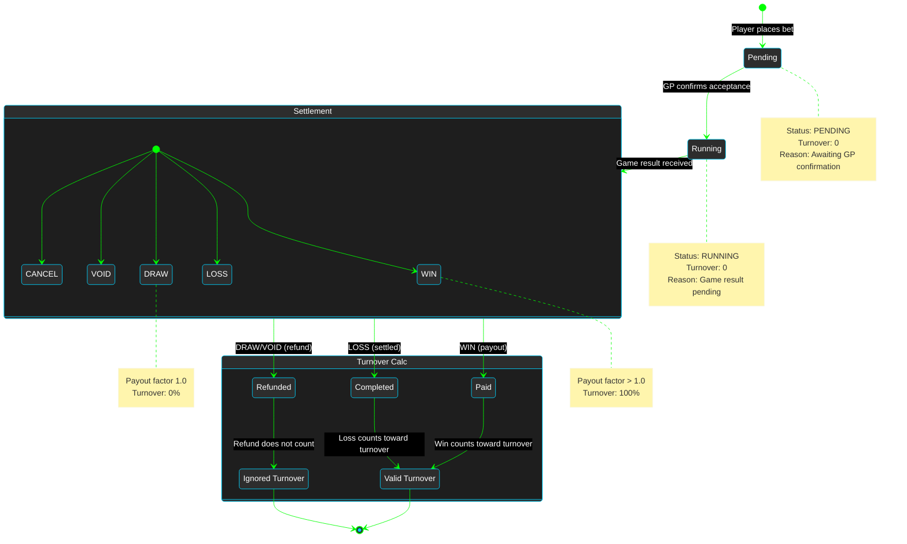

---

## 8. 計算範例

### 8.1 範例 1：百家樂投注

**情境**: 玩家參與「100% 首存優惠」活動，流水要求 (Wagering Requirement) 為 5 倍。

**投注詳情**:
- 存款: $1,000
- 獎金: $1,000（100% 匹配）
- 流水要求: ($1,000 + $1,000) x 5 = **$10,000**
- 本次投注: 百家樂 $100，賠率 1.95，結果：贏

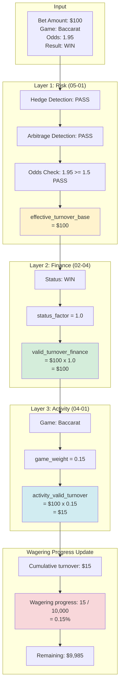

**結論**:
- 風控驗證：通過
- 財務有效投注額：$100
- 活動有效投注額：$15（因百家樂權重僅 15%）
- 需要更多投注才能達成流水要求

### 8.2 範例 2：老虎機投注

**情境**: 同一玩家改玩老虎機以更快完成流水。

**投注詳情**:
- 目前流水進度: $15 / $10,000 (0.15%)
- 本次投注: 老虎機 $100，結果：輸

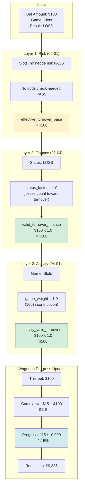

**比較分析**:

| 維度 | 百家樂 | 老虎機 |
|------|--------|--------|
| 投注金額 | $100 | $100 |
| 風控驗證 | 需對沖/賠率檢查 | 簡化驗證 |
| 財務有效投注額 | $100 | $100 |
| 遊戲權重 | 0.15 (15%) | 1.0 (100%) |
| **活動有效投注額** | **$15** | **$100** |
| 流水效率 | 低（需 6.67 倍投注才能完成） | 高（1 倍投注即完成） |

### 8.3 範例 3：對沖投注被拒絕

**情境**: 玩家嘗試在同一百家樂局中同時投注莊家和閒家。

**投注詳情**:
- 投注 1: 莊家 $1,000（賠率 1.95）
- 投注 2: 閒家 $950（賠率 2.00）
- 遊戲結果：莊家贏

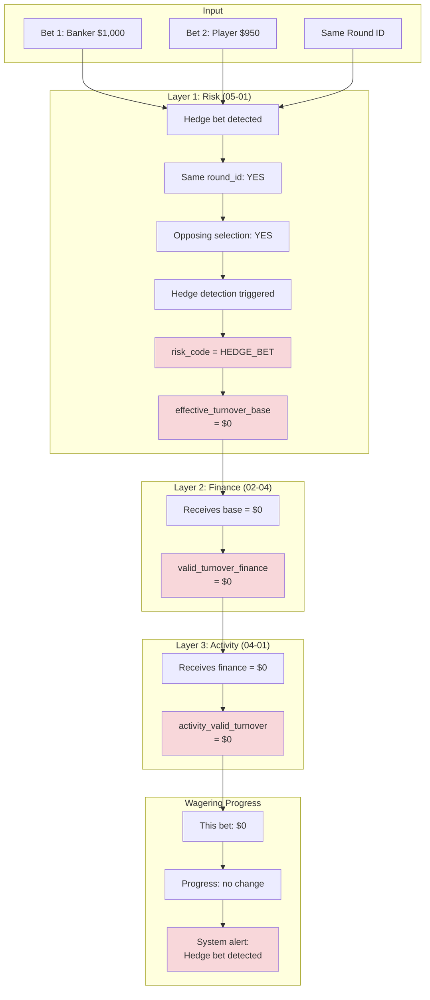

**結論**:
- 對沖投注被風控引擎拒絕
- 兩筆投注的有效投注額均為 $0
- 可能觸發風險標籤：`HEDGE_BETTOR`

---

## 9. 風險標記機制

### 9.1 為何需要風險標記

風險標記機制為每個有效投注額計算決策提供稽核追溯。若無此機制，將無法記錄特定 `valid_bet` 值為何被指派。

**解決方案**: 為每筆投注記錄新增四個風險標記欄位。

### 9.2 風險標記欄位定義

#### 9.2.1 risk_status

| 狀態 | 說明 | valid_bet | 使用情境 |
|------|------|-----------|----------|
| **PASSED** | 風控檢查通過 | = bet_amount | 正常投注 |
| **FILTERED** | 被風控過濾器拒絕 | = 0 | 對沖、套利、低賠率 |
| **PENDING** | 等待人工審核 | = 0（尚未計算） | 可疑交易、高額投注 |

#### 9.2.2 filter_reason

| risk_status | filter_reason 範例 | 說明 |
|-------------|-------------------|------|
| PASSED | null | 無過濾 |
| FILTERED | "Hedge bet: simultaneous Banker/Player bet" | 具體原因 |
| FILTERED | "Low odds bet: odds=1.30 < threshold 1.50" | 具體原因 |
| FILTERED | "Arbitrage bet: cross-platform odds difference > 5%" | 具體原因 |
| PENDING | "High-value bet requires manual review: amount > $10,000" | 等待審核 |

#### 9.2.3 risk_rules_applied (JSON 陣列)

```json
{
  "risk_rules_applied": [
    {
      "rule_id": "HEDGE_001",
      "rule_name": "Baccarat Hedge Detection",
      "action": "FILTER",
      "confidence": 0.95
    },
    {
      "rule_id": "ODDS_001",
      "rule_name": "Odds Threshold Check",
      "action": "PASS",
      "threshold": 1.5,
      "actual_odds": 1.95
    }
  ]
}
```

#### 9.2.4 calculation_version

支援規則調整後的重新計算。

| 版本 | 變更 | 生效日期 |
|------|------|----------|
| v1.0.0 | 初始版本，使用實際風險法 | 2026-01-01 |
| v1.1.0 | 修正為標準本金法 | 2026-01-28 |
| v1.2.0 | 調整賠率門檻 1.3 -> 1.5 | 2026-02-01 |

### 9.3 稽核追蹤範例

**查詢：為何這筆投注的 valid_bet = 0？**

```
bet_id: BET_12345
bet_amount: 100.00
valid_bet: 0.00
risk_status: FILTERED
filter_reason: "Hedge bet: simultaneous Banker ($1000) and Player ($950) bet"
risk_rules_applied: [{"rule_id": "HEDGE_001", "action": "FILTER"}]
```

**結論**：該投注被風控引擎識別為對沖投注，因此 `valid_bet = 0`。

### 9.4 重新計算支援

當風控規則調整時，`calculation_version` 欄位支援歷史資料重新計算。系統可查詢所有使用特定版本計算的投注，並以更新的規則重新處理。

---

## 10. 設計原則：Layer 2 不修改 Valid Bet

### 10.1 核心原則

> **關鍵設計決策**: Layer 2 (財務中心) 僅記錄結算狀態，**不修改** Layer 1 (風控引擎) 決定的 `valid_bet` 值。

### 10.2 為何財務層不應修改 Valid Bet

#### 10.2.1 違反「風控獨立性」原則

如果 Layer 1 已決定 `valid_bet`，那麼 Layer 2 根據結算狀態動態修改它，就意味著風控決定不是最終決策——這造成邏輯矛盾。

**正確做法**:
```
Layer 1 (Risk Engine): 一次性決定 valid_bet
  +-- 通過 -> valid_bet = bet_amount, risk_status = "PASSED"
  +-- 拒絕 -> valid_bet = 0, risk_status = "FILTERED", reason = "hedge bet"

Layer 2 (Finance Center): 僅記錄結算狀態，不修改 valid_bet
  +-- settlement_status = "WIN/LOSS/HALF_WIN/HALF_LOSS/DRAW"
  +-- payout_amount = calculatePayout(bet, status)
```

#### 10.2.2 違反公平性原則

**問題情境**:
```
兩位玩家同樣投注 $100 於體育博彩「讓分 -0.25」:
- 玩家 A 結果：全贏 -> valid_bet = $100（正確）
- 玩家 B 結果：和局（半輸）-> valid_bet = $50（舊方法下錯誤）

矛盾：
- 相同投注行為
- 相同風險敞口（$100）
- 但不同 valid_bet -> 違反公平性原則
```

**正確做法（標準本金法 - 行業標準）**:
```
玩家 A: 投注 $100 -> 全贏 -> valid_bet = $100
玩家 B: 投注 $100 -> 半輸 -> valid_bet = $100（不是 $50！）

理由：
- 兩位玩家在投注時都承擔 $100 風險
- Valid Bet 應反映投注行為，而非結算結果
- 簡化計算——無需等待結算即可知道 valid_bet
```

#### 10.2.3 行業標準比較

| 營運商 | Valid Bet 方法 | 結算影響 | 備註 |
|--------|---------------|---------|------|
| **Pinnacle** | 標準本金法 | 無 | valid_bet = 投注本金 |
| **Betfair** | 標準本金法 | 無 | 全額計算不論結果 |
| **Pragmatic Play** | 標準本金法 | 無 | 行業遊戲供應商標準 |
| **Evolution Gaming** | 標準本金法 | 無 | 真人賭場行業標準 |
| **實際風險法** | 動態調整 | 受影響 | 已棄用，違反公平性 |

### 10.3 結算狀態與 Valid Bet 分離

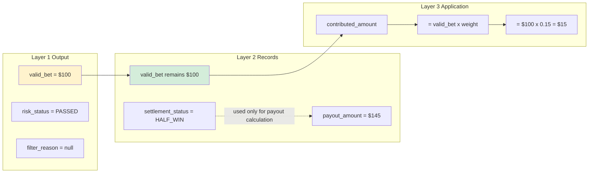

---

## 11. SmartAdmin 實作

### 11.1 Service 層實作

```java
@Service
@RequiredArgsConstructor
public class TurnoverValidationService {

    private final TurnoverRecordDao turnoverRecordDao;
    private final TurnoverValidationManager validationManager;
    private final RiskEngineClient riskEngineClient;

    /**
     * Execute three-layer validation for a settled bet.
     * Uses Vavr Option for null-safety per SmartAdmin patterns.
     */
    public ResponseDTO<TurnoverValidationResult> validateTurnover(BetSettleEvent event) {
        // Layer 1: Risk Engine validation
        RiskValidationResult riskResult = riskEngineClient.validate(event);
        if (riskResult.getActionType() == ActionType.BLOCK) {
            return ResponseDTO.ok(TurnoverValidationResult.rejected(riskResult));
        }

        // Layer 2 & 3: Delegate to Manager for transactional operations
        return validationManager.processFinanceAndActivity(event, riskResult);
    }

    /**
     * Query turnover record by bet ID.
     */
    public Option<TurnoverRecordVO> getTurnoverByBetId(String betId) {
        return Option.of(turnoverRecordDao.selectByBetId(betId))
            .map(entity -> SmartBeanUtil.copy(entity, TurnoverRecordVO.class));
    }
}
```

### 11.2 Manager 層實作

```java
@Component
@RequiredArgsConstructor
public class TurnoverValidationManager {

    private final TurnoverRecordDao turnoverRecordDao;
    private final WageringProgressDao wageringProgressDao;
    private final KafkaTemplate<String, String> kafkaTemplate;

    /**
     * Process Layer 2 (Finance) and Layer 3 (Activity) with transaction support.
     * @Transactional only allowed in Manager layer per SmartAdmin architecture.
     */
    @Transactional(rollbackFor = Throwable.class)
    public ResponseDTO<TurnoverValidationResult> processFinanceAndActivity(
            BetSettleEvent event, RiskValidationResult riskResult) {

        BigDecimal effectiveBase = riskResult.getEffectiveTurnoverBase();

        // Layer 2: Record settlement status (does NOT modify valid_bet)
        BigDecimal validTurnoverFinance = effectiveBase;

        // Layer 3: Apply game weight for activity contribution
        BigDecimal gameWeight = getGameWeight(event.getGameType());
        BigDecimal activityContribution = validTurnoverFinance.multiply(gameWeight);

        // Save turnover record
        TurnoverRecordEntity record = buildTurnoverRecord(event, riskResult,
            validTurnoverFinance, gameWeight, activityContribution);
        turnoverRecordDao.insert(record);

        // Update wagering progress if player has active bonus
        updateWageringProgress(event.getPlayerId(), activityContribution);

        return ResponseDTO.ok(TurnoverValidationResult.success(record));
    }

    private BigDecimal getGameWeight(String gameType) {
        return switch (gameType) {
            case "SLOTS", "SPORTS" -> BigDecimal.ONE;
            case "BACCARAT", "LIVE_CASINO" -> new BigDecimal("0.15");
            case "BLACKJACK" -> new BigDecimal("0.10");
            case "ROULETTE" -> new BigDecimal("0.20");
            default -> BigDecimal.ONE;
        };
    }
}
```

### 11.3 資料庫結構

```sql
-- Wagering progress table for bonus tracking
CREATE TABLE t_wagering_progress (
    id                      BIGSERIAL PRIMARY KEY,
    tenant_id               BIGINT NOT NULL,
    player_id               BIGINT NOT NULL,
    bonus_id                BIGINT NOT NULL,
    wagering_requirement    DECIMAL(18, 4) NOT NULL,
    wagering_completed      DECIMAL(18, 4) NOT NULL DEFAULT 0,
    progress_percentage     DECIMAL(5, 2) NOT NULL DEFAULT 0,
    status                  VARCHAR(20) NOT NULL DEFAULT 'ACTIVE',
    completed_at            TIMESTAMP,
    created_at              TIMESTAMP NOT NULL DEFAULT NOW(),
    updated_at              TIMESTAMP NOT NULL DEFAULT NOW(),
    CONSTRAINT uk_wagering_progress UNIQUE (tenant_id, player_id, bonus_id)
);

CREATE INDEX idx_wagering_player ON t_wagering_progress(tenant_id, player_id, status);
CREATE INDEX idx_wagering_status ON t_wagering_progress(tenant_id, status, updated_at DESC)
    WHERE status = 'ACTIVE';
```

---

## 摘要

### 核心設計原則

1. **三層驗證架構**
   - Layer 1 (風控引擎)：一次性決定 `valid_bet`，標記 `risk_status`
   - Layer 2 (財務中心)：僅記錄結算狀態，**不修改** `valid_bet`
   - Layer 3 (活動系統)：應用遊戲權重，計算活動貢獻

2. **風控獨立性原則**
   - Layer 1 決定 `valid_bet` 後，後續層級不修改
   - 採用「標準本金法」：`valid_bet = bet_amount`（不論結果）
   - 結算狀態僅用於派彩計算，與有效投注額計算分離

3. **關注點分離**
   - 風控專注於：對沖偵測、套利偵測、賠率過濾
   - 財務專注於：結算狀態、派彩金額計算
   - 活動專注於：遊戲權重應用

4. **稽核追溯**
   - 記錄原始資料 + 計算結果 + 版本號
   - 提供重新計算介面
   - 完整風險標記（`risk_status`、`filter_reason`）

### 關鍵術語

| 術語 | 定義 | 單位 | 用途 |
|------|------|------|------|
| **Bet Amount** (投注額) | 單筆原始投注金額 | 每筆 | API 互動、資金扣款 |
| **Turnover** (流水) | 一段時間內投注金額的累計總和 | 累計 | GGR 計算、財務報表 |
| **Valid Bet** (有效投注額) | 經風控過濾後的單筆投注金額 | 每筆 | 流水要求、返水、VIP |
| **Wagering Requirement** (流水要求) | 所需的有效投注額累計總額 | 累計 | 活動驗證、提款限制 |

### 資料流關鍵指標

| 階段 | 指標 | 公式 | 說明 |
|------|------|------|------|
| **Layer 1 輸出** | valid_bet | 風控決定（bet_amount 或 0） | 一次性、不可變 |
| **Layer 2 記錄** | settlement_status | 記錄結算狀態 | 不影響 valid_bet |
| **Layer 3 輸出** | contributed_amount | valid_bet x game_weight | 活動貢獻金額 |
| **進度追蹤** | wagering_progress | sum(contributed) / requirement x 100% | 流水完成百分比 |

### 常見問答

**Q1: 為何 DRAW/TIE 不計入流水？**
- A: 和局時玩家本金歸還，無實際風險，因此不計入流水要求。

**Q2: 為何百家樂權重僅 15%？**
- A: 百家樂 RTP 高（98.94%），平台風險低。較低權重防止玩家利用它來滿足流水要求。

**Q3: 如何偵測對沖投注？**
- A: 系統檢查同一玩家在同一遊戲局中是否有對立投注（例如同時投注莊家和閒家）。

**Q4: 有效投注額計算是即時的嗎？**
- A: 是的，每筆投注結算後立即計算有效投注額並更新進度。

---

**文件版本**: 4.0.0
**建立日期**: 2026-01-27
**維護團隊**: 產品團隊 & 技術架構團隊
