# Turnover Calculation Flowcharts and Sequence Diagrams

> **Canonical Source**: [source-archive/02_Finance_Center/02-04-diagrams/02-04-01_Flowcharts_and_Sequences.md](../../source-archive/02_Finance_Center/02-04-diagrams/02-04-01_Flowcharts_and_Sequences.md)
> **Audience**: Architects, Backend Developers, Data Engineers
> **Business Requirements**: [Turnover_Business_Rules.md](../../requirements/03_Gaming_Operations/Turnover_Business_Rules.md)
> **Last Synced**: 2026-02-08

---

## Document Purpose

This document provides the technical visualization of the iGaming platform's turnover calculation system, including the Three-Layer Validation Architecture, detailed sequence diagrams, flowcharts for each layer, and the bet lifecycle state machine. All diagrams are intended for engineering teams implementing or maintaining the turnover calculation pipeline.

**Version History**:
- v4.0.0 (2026-01-28): Corrected Layer 2 logic -- removed erroneous `status_factor` dynamic modification of `valid_bet`; adopted Standard Principal Method; added risk marking mechanism and audit traceability support
- v3.0.0 (2026-01-27): Initial creation

**Key Design Decisions**:
- Layer 1 (Risk Engine) makes the one-time determination of `valid_bet`
- Layer 2 (Finance Center) only records settlement status -- it does NOT modify `valid_bet`
- Layer 3 (Activity System) applies game weights for activity contribution calculation

**Reference Documents**:
- Terminology Standards *(planned - source-archive/00_Foundation/00-03_Terminology_Standards)*
- [Risk Framework](../../source-archive/05_Risk_Control/05-01_Risk_Framework.md)
- [Turnover and Reconciliation Analysis](../../source-archive/02_Finance_Center/02-04_Turnover_and_Game_Reconciliation_Analysis.md)
- [Activity Bonus](../../source-archive/04_Activity_Center/04-04_Activity_Bonus.md)

---

## Table of Contents

1. [Architecture Overview](#1-architecture-overview)
2. [End-to-End Sequence Diagram](#2-end-to-end-sequence-diagram)
3. [Main Turnover Calculation Flowchart](#3-main-turnover-calculation-flowchart)
4. [Layer 1: Risk Engine Validation](#4-layer-1-risk-engine-validation)
5. [Layer 2: Finance Settlement Recording](#5-layer-2-finance-settlement-recording)
6. [Layer 3: Activity Weight Application](#6-layer-3-activity-weight-application)
7. [Bet Lifecycle State Machine](#7-bet-lifecycle-state-machine)
8. [Calculation Examples](#8-calculation-examples)
9. [Risk Marking Mechanism](#9-risk-marking-mechanism)
10. [Design Principles: Layer 2 Does Not Modify Valid Bet](#10-design-principles-layer-2-does-not-modify-valid-bet)

---

## 1. Architecture Overview

### 1.1 Three-Layer Validation Architecture

The turnover calculation system uses a three-layer validation architecture. Data flows sequentially from player bet through Layer 1 (Risk), Layer 2 (Finance), and Layer 3 (Activity) before reaching application scenarios.

> **Diagram Complexity**: 24 nodes (optimized with subgraph grouping)
> **Reading Guide**: Follow the data flow order (Player Bet -> Layer 1 -> Layer 2 -> Layer 3 -> Application Scenarios)
> **Key Points**:
> - Layer 1 Risk Validation determines `valid_bet`
> - Layer 2 only records status, does NOT modify `valid_bet`
> - Layer 3 applies game weights for activity contribution

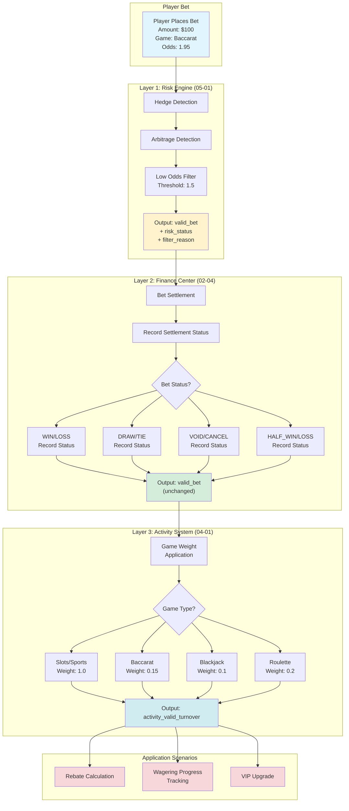

---

## 2. End-to-End Sequence Diagram

### 2.1 Complete Turnover Calculation Sequence

This sequence diagram shows the full lifecycle of a bet from placement through settlement, three-layer validation, payout, and audit logging.

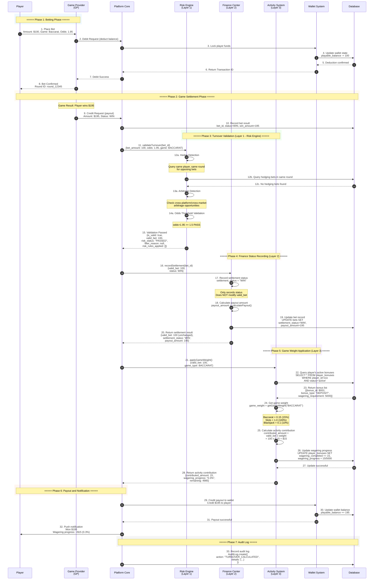

---

## 3. Main Turnover Calculation Flowchart

### 3.1 Main Flow

> **Diagram Complexity**: 26 nodes (optimized with subgraph grouping)
> **Reading Guide**: Follow the three-layer architecture order (Input -> Layer 1 -> Layer 2 -> Layer 3 -> Update)
> **Key Decision Points**:
> - Layer 1: Hedge/Arbitrage/Low Odds -> determines whether `valid_bet` is 0
> - Layer 2: Bet status branch (WIN/LOSS/DRAW/VOID/HALF) -> records status only
> - Layer 3: Game type branch (Slots/Baccarat/Blackjack/Roulette) -> applies corresponding weight
> - Update: Wagering met? -> determines whether to unlock withdrawal


---

## 4. Layer 1: Risk Engine Validation

### 4.1 Hedge Detection Flow

The hedge detection process identifies when a player places opposing bets within the same game round (e.g., betting on both Banker and Player in Baccarat).

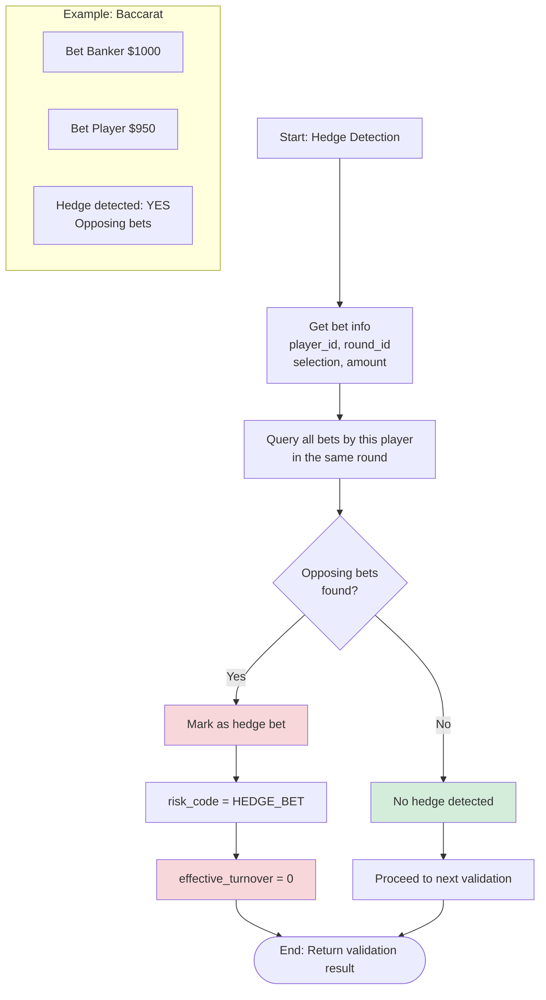

### 4.2 Odds Threshold Check

Low-odds bets are filtered to prevent exploitation of near-certain outcomes for wagering requirement completion.


---

## 5. Layer 2: Finance Settlement Recording

### 5.1 Settlement Status Recording Flow

Layer 2 receives the `valid_bet` value from Layer 1 as an immutable input. It records the settlement status and calculates payout amounts, but **never modifies** the `valid_bet` value.

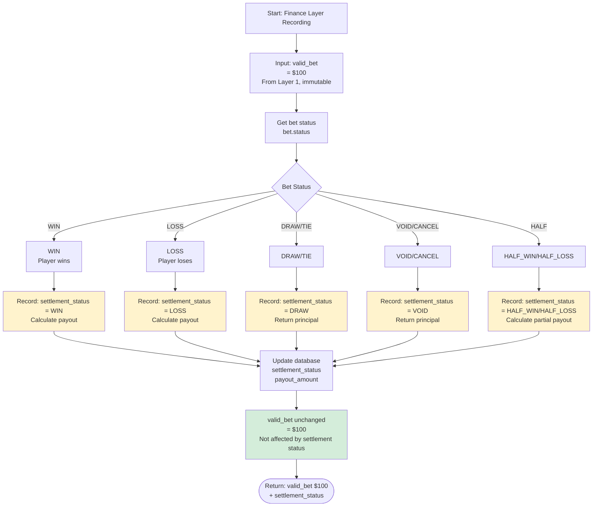

### 5.2 Settlement Status vs Valid Bet Reference Table

**Core Principle**: `valid_bet` is determined once by Layer 1 (Risk Engine). Layer 2 only records settlement status and **does not modify** the `valid_bet` value.

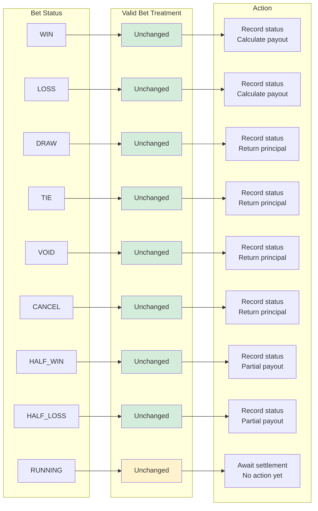

---

## 6. Layer 3: Activity Weight Application

### 6.1 Game Weight Application Flow

Layer 3 receives the validated `valid_bet` from the pipeline and applies game-specific weights to calculate the activity contribution amount.


### 6.2 Game Weight Configuration Table

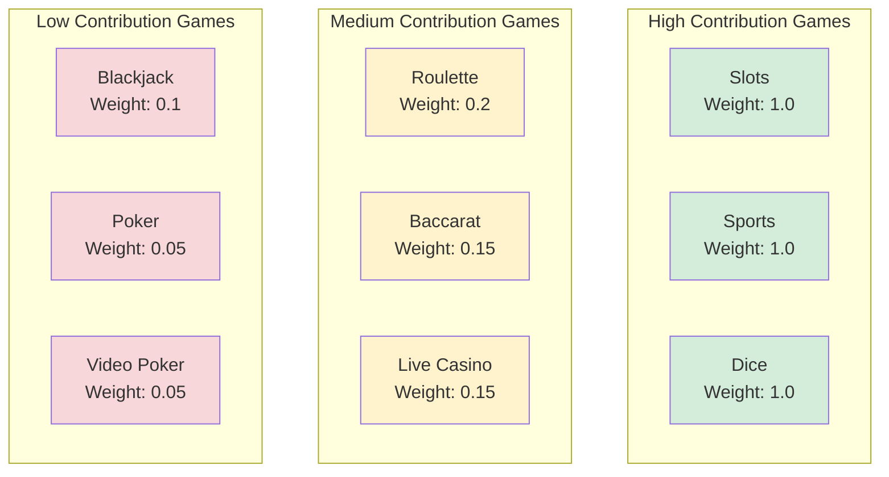

---

## 7. Bet Lifecycle State Machine

### 7.1 Bet Lifecycle (State Machine)

This state diagram models the full lifecycle of a bet from placement through settlement and turnover calculation.

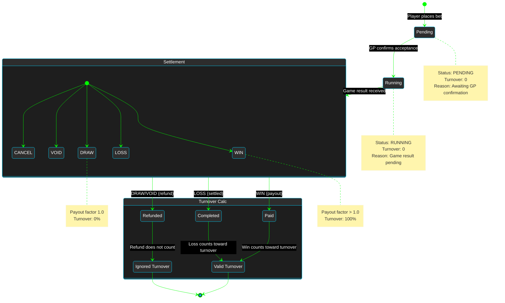

---

## 8. Calculation Examples

### 8.1 Example 1: Baccarat Bet

**Scenario**: Player participates in a "100% First Deposit Bonus" activity with a 5x wagering requirement.

**Bet Details**:
- Deposit: $1,000
- Bonus: $1,000 (100% Match)
- Wagering Requirement: ($1,000 + $1,000) x 5 = **$10,000**
- Current Bet: Baccarat $100, odds 1.95, result: WIN

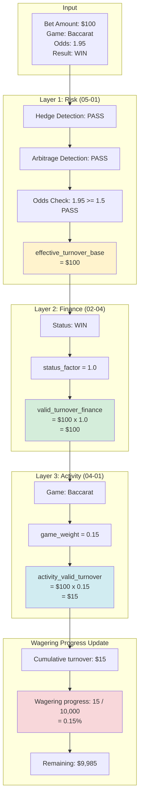

**Conclusion**:
- Risk validation: PASSED
- Finance turnover: $100
- Activity turnover: $15 (only 15% contribution due to Baccarat weight)
- More bets needed to meet wagering requirement

### 8.2 Example 2: Slots Bet

**Scenario**: Same player switches to Slots for faster wagering completion.

**Bet Details**:
- Current wagering progress: $15 / $10,000 (0.15%)
- Current bet: Slots $100, result: LOSS

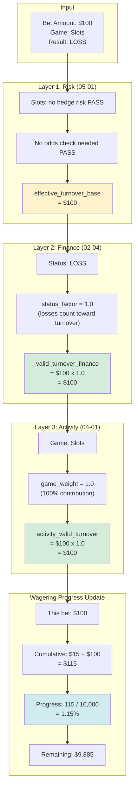

**Comparison Analysis**:

| Dimension | Baccarat | Slots |
|-----------|----------|-------|
| Bet Amount | $100 | $100 |
| Risk Validation | Hedge/Odds checks required | Simplified validation |
| Finance Turnover | $100 | $100 |
| Game Weight | 0.15 (15%) | 1.0 (100%) |
| **Activity Turnover** | **$15** | **$100** |
| Wagering Efficiency | Low (6.67x bets to complete) | High (1x bet to complete) |

### 8.3 Example 3: Hedge Bet Rejected

**Scenario**: Player attempts to bet on both Banker and Player in the same Baccarat round.

**Bet Details**:
- Bet 1: Banker $1,000 (odds 1.95)
- Bet 2: Player $950 (odds 2.00)
- Game Result: Banker wins

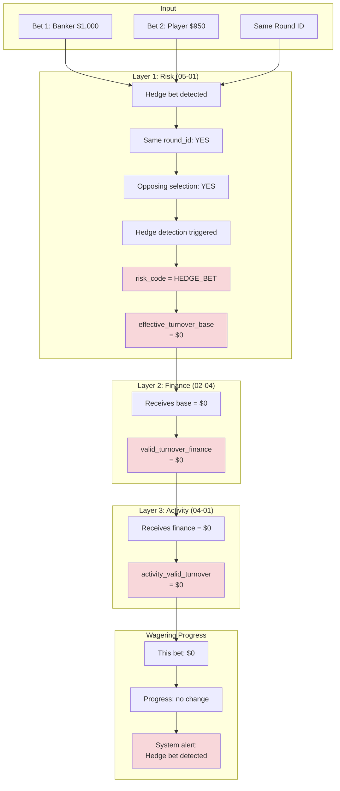

**Conclusion**:
- Hedge bet rejected by risk engine
- Both bets receive $0 turnover
- May trigger risk tag: `HEDGE_BETTOR`

---

## 9. Risk Marking Mechanism

### 9.1 Why Risk Marking is Needed

The risk marking mechanism provides audit traceability for every turnover calculation decision. Without it, there is no record of _why_ a particular `valid_bet` value was assigned.

**Solution**: Four risk marking fields are added to each bet record.

### 9.2 Risk Marking Field Definitions

#### 9.2.1 risk_status

| Status | Description | valid_bet | Use Case |
|--------|-------------|-----------|----------|
| **PASSED** | Risk check passed | = bet_amount | Normal bet |
| **FILTERED** | Risk filter rejected | = 0 | Hedge, arbitrage, low odds |
| **PENDING** | Awaiting manual review | = 0 (not counted yet) | Suspicious transaction, high-value bet |

#### 9.2.2 filter_reason

| risk_status | filter_reason Example | Description |
|-------------|----------------------|-------------|
| PASSED | null | No filtering |
| FILTERED | "Hedge bet: simultaneous Banker/Player bet" | Specific reason |
| FILTERED | "Low odds bet: odds=1.30 < threshold 1.50" | Specific reason |
| FILTERED | "Arbitrage bet: cross-platform odds difference > 5%" | Specific reason |
| PENDING | "High-value bet requires manual review: amount > $10,000" | Awaiting review |

#### 9.2.3 risk_rules_applied (JSON Array)

```json
{
  "risk_rules_applied": [
    {
      "rule_id": "HEDGE_001",
      "rule_name": "Baccarat Hedge Detection",
      "action": "FILTER",
      "confidence": 0.95
    },
    {
      "rule_id": "ODDS_001",
      "rule_name": "Odds Threshold Check",
      "action": "PASS",
      "threshold": 1.5,
      "actual_odds": 1.95
    }
  ]
}
```

#### 9.2.4 calculation_version

Supports recalculation when rules are adjusted.

| Version | Change | Effective Date |
|---------|--------|---------------|
| v1.0.0 | Initial version, using actual risk method | 2026-01-01 |
| v1.1.0 | Corrected to Standard Principal Method | 2026-01-28 |
| v1.2.0 | Adjusted odds threshold 1.3 -> 1.5 | 2026-02-01 |

### 9.3 Audit Trail Example

**Query: Why is this bet's valid_bet = 0?**

```
bet_id: BET_12345
bet_amount: 100.00
valid_bet: 0.00
risk_status: FILTERED
filter_reason: "Hedge bet: simultaneous Banker ($1000) and Player ($950) bet"
risk_rules_applied: [{"rule_id": "HEDGE_001", "action": "FILTER"}]
```

**Conclusion**: The bet was identified as a hedge bet by the risk engine, resulting in `valid_bet = 0`.

### 9.4 Recalculation Support

When risk rules are adjusted, the `calculation_version` field enables historical data recalculation. The system can query all bets calculated under a specific version and reprocess them with updated rules.

---

## 10. Design Principles: Layer 2 Does Not Modify Valid Bet

### 10.1 Core Principle

> **Key Design Decision**: Layer 2 (Finance Center) only records settlement status and **does not modify** the `valid_bet` value determined by Layer 1 (Risk Engine).

### 10.2 Why Finance Layer Should Not Modify Valid Bet

#### 10.2.1 Violation of "Risk Independence" Principle

If Layer 1 has already determined `valid_bet`, then Layer 2 dynamically modifying it based on settlement status would mean the risk determination is not the final decision -- creating a logical contradiction.

**Correct Approach**:
```
Layer 1 (Risk Engine): One-time determination of valid_bet
  +-- Pass -> valid_bet = bet_amount, risk_status = "PASSED"
  +-- Reject -> valid_bet = 0, risk_status = "FILTERED", reason = "hedge bet"

Layer 2 (Finance Center): Only records settlement status, does NOT modify valid_bet
  +-- settlement_status = "WIN/LOSS/HALF_WIN/HALF_LOSS/DRAW"
  +-- payout_amount = calculatePayout(bet, status)
```

#### 10.2.2 Violation of Fairness Principle

**Problem Scenario**:
```
Two players both bet $100 on sports betting "Handicap -0.25":
- Player A result: Full win -> valid_bet = $100 (correct)
- Player B result: Draw (half loss) -> valid_bet = $50 (INCORRECT under old method)

Contradiction:
- Same betting behavior
- Same risk exposure ($100)
- But different valid_bet -> violates fairness principle
```

**Correct Approach (Standard Principal Method - Industry Standard)**:
```
Player A: Bet $100 -> Full win -> valid_bet = $100
Player B: Bet $100 -> Half loss -> valid_bet = $100 (NOT $50!)

Rationale:
- Both players assumed $100 risk at the time of betting
- Valid Bet should reflect betting behavior, not settlement outcome
- Simplifies calculation -- no need to wait for settlement to know valid_bet
```

#### 10.2.3 Industry Standard Comparison

| Operator | Valid Bet Method | Settlement Impact | Notes |
|----------|-----------------|-------------------|-------|
| **Pinnacle** | Standard Principal | None | valid_bet = bet principal |
| **Betfair** | Standard Principal | None | Full amount regardless of outcome |
| **Pragmatic Play** | Standard Principal | None | Industry game provider standard |
| **Evolution Gaming** | Standard Principal | None | Live casino industry standard |
| **Actual Risk Method** | Dynamic adjustment | Affected | Deprecated, violates fairness |

### 10.3 Settlement Status and Valid Bet Separation

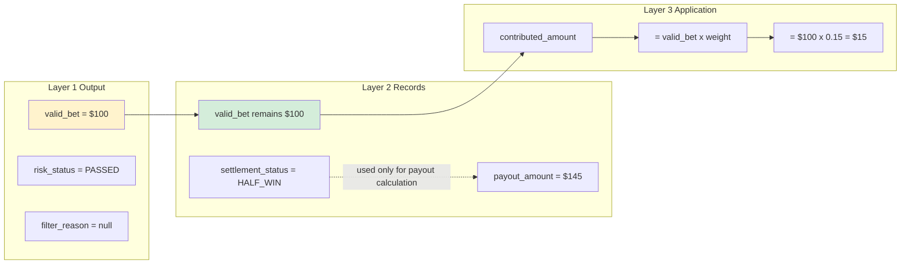

---

## Summary

### Core Design Principles

1. **Three-Layer Validation Architecture**
   - Layer 1 (Risk Engine): One-time determination of `valid_bet`, marks `risk_status`
   - Layer 2 (Finance Center): Only records settlement status, **does not modify** `valid_bet`
   - Layer 3 (Activity System): Applies game weights, calculates activity contribution

2. **Risk Independence Principle**
   - After Layer 1 determines `valid_bet`, subsequent layers do not modify it
   - Uses "Standard Principal Method": `valid_bet = bet_amount` (regardless of outcome)
   - Settlement status is only used for payout calculation, separated from turnover calculation

3. **Separation of Concerns**
   - Risk focuses on: hedge detection, arbitrage detection, odds filtering
   - Finance focuses on: settlement status, payout amount calculation
   - Activity focuses on: game weight application

4. **Audit Traceability**
   - Records original data + calculation results + version number
   - Provides recalculation interface
   - Complete risk marking (`risk_status`, `filter_reason`)

### Key Terminology

| Term | Definition | Unit | Usage |
|------|-----------|------|-------|
| **Bet Amount** | Single original bet amount | Per bet | API interaction, fund deduction |
| **Turnover** | Time-accumulated sum of bet amounts | Cumulative | GGR calculation, financial reports |
| **Valid Bet** | Risk-filtered single bet amount | Per bet | Wagering requirements, rebates, VIP |
| **Wagering Requirement** | Required total valid bet amount | Cumulative | Activity verification, withdrawal limits |

### Data Flow Key Metrics

| Phase | Metric | Formula | Description |
|-------|--------|---------|-------------|
| **Layer 1 Output** | valid_bet | Risk determination (bet_amount or 0) | One-time, immutable |
| **Layer 2 Record** | settlement_status | Records settlement status | Does not affect valid_bet |
| **Layer 3 Output** | contributed_amount | valid_bet x game_weight | Activity contribution amount |
| **Progress Tracking** | wagering_progress | sum(contributed) / requirement x 100% | Wagering completion percentage |

### FAQ

**Q1: Why doesn't DRAW/TIE count toward turnover?**
- A: In a draw, the player's principal is returned with no actual risk, so it does not count toward wagering requirements.

**Q2: Why is Baccarat weight only 15%?**
- A: Baccarat has a high RTP (98.94%), low platform risk. The lower weight prevents wagering requirement exploitation.

**Q3: How is hedge betting detected?**
- A: The system checks whether the same player has opposing bets in the same game round (e.g., betting on both Banker and Player simultaneously).

**Q4: Is turnover calculation real-time?**
- A: Yes, turnover is calculated and progress updated immediately after each bet settlement.

---

**Document Version**: 4.0.0
**Created**: 2026-01-27
**Maintained by**: Product Team & Tech Architecture Team
