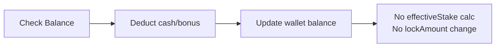

# Turnover Implementation Details: LockAmount & Effective Stake

> **Canonical Source**: [02-04-03_Implementation_Details.md](../../source/02_Finance_Center/02-04-diagrams/02-04-03_Implementation_Details.md)
> **Audience**: Architects, Backend Developers, DevOps
> **Business Requirements**: None (pure technical content, no requirements counterpart)
> **Last Synced**: 2026-02-08

---

## 1. Core Services and Class Map

### 1.1 Service Dependencies

```
GridService (betting core)
  ├── GridAbstractService (shared calculation logic)
  │     ├── getEffectiveStake()
  │     ├── getRebateEffectiveStake()
  │     └── deduct() / updateWallets()
  ├── WalletTransaction (per-tx wallet delta model)
  ├── PlayerWallet (wallet entity)
  └── Transaction (bet record entity)

PromotionService (promotion lifecycle)
  ├── promotionApply()
  └── promotionApprove()

WalletTransactionService (deposit / withdraw / VIP)
  └── deposit()
```

### 1.2 Source File Index

| Class | Path | Responsibility |
|-------|------|----------------|
| `GridService` | `transaction-service/.../service/GridService.java` | Bet placement, settlement, cancel, rollback |
| `GridAbstractService` | `transaction-service/.../service/GridAbstractService.java` | Effective stake calc, rebate calc, shared deduction |
| `WalletTransaction` | `transaction-service/.../model/WalletTransaction.java` | Per-transaction wallet delta tracking |
| `PlayerWallet` | `common-lib/.../db/domain/PlayerWallet.java` | Wallet entity: cash, bonus, cleanAmount, lockAmount, effectiveStake, wagerRequirement |
| `Transaction` | `common-lib/.../db/domain/Transaction.java` | Bet record: betAmount, payout, effectiveStake, rebateEffectiveStake |
| `PromotionService` | `transaction-service/.../service/PromotionService.java` | Promotion apply / approve logic |
| `PlayerWalletServiceImpl` | `data-mysql/.../service/impl/PlayerWalletServiceImpl.java` | Wallet DB operations |

---

## 2. Wallet Deduction Algorithm

**Source**: `GridAbstractService.java` (lines 116-168)

### 2.1 Deduction Priority Order

```
1. Cash first   -> deduct from wallet.cash
2. Bonus second -> deduct from wallet.bonus (when cash insufficient)
3. Multi-wallet -> iterate wallets by priority
4. Main wallet  -> allows overdraft (negative balance) as last resort
```

### 2.2 Deduction Examples

**Example 1: Cash sufficient**

```yaml
Before: { cash: 1000, bonus: 500, lockAmount: 300, effectiveStake: 0 }
Bet:    100
Deduct: { deductCash: -100, deductBonus: 0 }
After:  { cash: 900, bonus: 500, lockAmount: 300, effectiveStake: 0 }
```

**Example 2: Cash insufficient, bonus used**

```yaml
Before: { cash: 50, bonus: 500, lockAmount: 20, effectiveStake: 0 }
Bet:    100
Deduct: { deductCash: -50, deductBonus: -50 }
After:  { cash: 0, bonus: 450, lockAmount: 20, effectiveStake: 0 }
```

**Example 3: Cross-wallet deduction**

```yaml
# Promotion wallet (priority 1)
Before: { cash: 30, bonus: 100, wagerRequirement: 500, effectiveStake: 0 }
# Main wallet (priority 2)
Before: { cash: 50, bonus: 0, lockAmount: 20, effectiveStake: 0 }

Bet: 150
Step 1: Promotion wallet deducts cash=30 + bonus=100 = 130
Step 2: Main wallet deducts remaining cash=20

After (Promotion): { cash: 0, bonus: 0 }
After (Main):      { cash: 30, bonus: 0, lockAmount: 20 }
```

---

## 3. Effective Stake Calculation

### 3.1 Calculation Timing

**Source**: `GridService.java` (lines 356-430)

Effective stake is computed **only at settlement**, never at bet placement.

| Event | effectiveStake Action |
|-------|----------------------|
| Bet Placement | No calculation |
| Settlement (SETTLE) | Calculate and accumulate |
| Partial Payout (PARTIAL_PAYOUT) | Calculate delta and accumulate |
| Cancellation (CANCEL) | Subtract previously accumulated value |

### 3.2 Formulas by Game Type

**Source**: `GridAbstractService.java` (lines 170-192)

#### Sports / E-Sports

```
effectiveStake = |winAmount + lossAmount|
```

| betAmount | payout | winAmount | lossAmount | effectiveStake |
|-----------|--------|-----------|------------|----------------|
| 100 | 180 | 80 | 0 | 80 |
| 100 | 0 | 0 | 100 | 100 |

#### Casino

```
if payout == betAmount (tie):     effectiveStake = 0
if winAmount > 0 (win):           effectiveStake = min(winAmount, betAmount)
if winAmount == 0 (loss):         effectiveStake = betAmount
```

| betAmount | payout | winAmount | Result | effectiveStake |
|-----------|--------|-----------|--------|----------------|
| 100 | 100 | 0 | Tie | 0 |
| 100 | 180 | 80 | Win | min(80,100) = 80 |
| 100 | 200 | 100 | Win | min(100,100) = 100 |
| 100 | 0 | 0 | Loss | 100 |

#### Other Game Types

```
effectiveStake = betAmount
```

### 3.3 Effective Stake / LockAmount Relationship

**Source**: `WalletTransaction.java` (lines 119-125)

```
Rule: lockAmount -= effectiveStake  (when effectiveStake >= 0)
Constraint: lockAmount = GREATEST(lockAmount + delta, 0)  -- never below zero
```

```yaml
Before: { lockAmount: 500, effectiveStake: 100 }
Settlement produces: effectiveStake = 200
After:  { lockAmount: 300, effectiveStake: 300 }
```

---

## 4. Bet Lifecycle & LockAmount State Transitions

### 4.1 Bet Placement

**Source**: `GridService.bet()` (lines 65-84)

- LockAmount change: **None**
- effectiveStake: **Not calculated**



### 4.2 Settlement - Win

**Source**: `GridService.result()` (lines 125-143)

- LockAmount change: **Decreases** by effectiveStake

```yaml
Before:     { cash: 900, lockAmount: 500, effectiveStake: 0 }
Settlement: payout=180, effectiveStake=80
After:      { cash: 1080, lockAmount: 420, effectiveStake: 80 }
```

### 4.3 Settlement - Loss

**Source**: `GridService.result()`

- LockAmount change: **Decreases** by effectiveStake (loss still generates effective stake)

```yaml
Before:     { cash: 900, lockAmount: 500, effectiveStake: 0 }
Settlement: payout=0, effectiveStake=100
After:      { cash: 900, lockAmount: 400, effectiveStake: 100 }
```

### 4.4 Cancellation

**Source**: `GridService.result()` with `TxType.CANCEL` (lines 403-409)

- LockAmount change: **Increases** (reversal of previously accumulated effectiveStake)

```java
// Negate effective stake on cancel
wallet.addEffectiveStake(bet.getEffectiveStake().negate());
// lockAmount += |effectiveStake| (since effectiveStake delta is negative)
```

```yaml
Before (settled): { cash: 1080, lockAmount: 420, effectiveStake: 80 }
Cancel:           refund betAmount=100, effectiveStake=-80
After:            { cash: 980, lockAmount: 500, effectiveStake: 0 }
```

### 4.5 Void

**Source**: `GridService.internalVoid()` (lines 229-264)

- LockAmount change: **Restores** to pre-bet state

```java
// Void: refund (betAmount - payout), negate effectiveStake
wallet.addEffectiveStake(tx.getEffectiveStake().negate());
```

```yaml
Before (settled): { cash: 1080, lockAmount: 420, effectiveStake: 80, payout: 180 }
Void:             refund (100-180)=-80, effectiveStake=-80
After:            { cash: 1000, lockAmount: 500, effectiveStake: 0 }
```

### 4.6 Partial Settlement

**Source**: `GridService.singleBetMultipleResult()` (lines 147-162, 436-490)

- LockAmount change: **Only when status transitions to SETTLE**

```yaml
# First payout: status remains UNSETTLE
Payout: 50, effectiveStake: unchanged, lockAmount: unchanged

# Second payout: status transitions to SETTLE
Payout: 100 (cumulative 150), effectiveStake: 100, lockAmount -= 100
```

---

## 5. Scenario Walkthroughs

### 5.1 Main Wallet Without LockAmount

```yaml
# Initial
Main: { cash: 1000, lockAmount: 0, cleanAmount: 1000, effectiveStake: 0 }

# Step 1: Bet 100
Main: { cash: 900, lockAmount: 0, cleanAmount: 900, effectiveStake: 0 }

# Step 2a: Settle WIN (CASINO, payout=180, win=80)
#   effectiveStake = min(80, 100) = 80
#   lockAmount = GREATEST(0 - 80, 0) = 0
Main: { cash: 1080, lockAmount: 0, cleanAmount: 1080, effectiveStake: 80 }

# Step 2b: Settle LOSS (payout=0, loss=100)
#   effectiveStake = 100
#   lockAmount = GREATEST(0 - 100, 0) = 0
Main: { cash: 900, lockAmount: 0, cleanAmount: 900, effectiveStake: 100 }
```

### 5.2 Promotion Wallet (wagerRequirement)

```yaml
# Initial
Promo: { cash: 100, bonus: 200, wagerRequirement: 1500, effectiveStake: 0 }

# Step 1: Bet 100
Promo: { cash: 0, bonus: 200, wagerRequirement: 1500, effectiveStake: 0 }

# Step 2: Settle WIN (payout=150, win=50)
#   effectiveStake = min(50, 100) = 50
Promo: { cash: 150, bonus: 200, wagerRequirement: 1500, effectiveStake: 50 }
# Remaining wager: 1500 - 50 = 1450
```

### 5.3 Main Wallet With LockAmount

```yaml
# Initial (deposit bonus applied)
Main: { cash: 1000, lockAmount: 500, cleanAmount: 500, effectiveStake: 0 }

# Step 1: Bet 200
Main: { cash: 800, lockAmount: 500, cleanAmount: 300, effectiveStake: 0 }

# Step 2: Settle WIN (payout=300, win=100)
#   effectiveStake = min(100, 200) = 100
#   lockAmount = 500 - 100 = 400
Main: { cash: 1100, lockAmount: 400, cleanAmount: 700, effectiveStake: 100 }
```

### 5.4 Cross-Wallet Bet (Cash + Bonus)

```yaml
# Initial
Promo: { cash: 50, bonus: 300, wagerRequirement: 1000, effectiveStake: 0 }
Main:  { cash: 200, bonus: 0, lockAmount: 100, effectiveStake: 0 }

# Step 1: Bet 500
#   Promo deducts: cash=50 + bonus=300 = 350
#   Main deducts: cash=150 (remaining)
Promo: { cash: 0, bonus: 0 }
Main:  { cash: 50, lockAmount: 100, effectiveStake: 0 }

# Step 2: Settle WIN (payout=600, win=100, effectiveStake=100)
#   Payout routed to promo wallet (getBetResultWallet logic)
Promo: { cash: 600, bonus: 0, wagerRequirement: 1000, effectiveStake: 100 }
Main:  { cash: 50, lockAmount: 100, effectiveStake: 0 }
```

---

## 6. Rebate Effective Stake Calculation

**Source**: `GridAbstractService.getRebateEffectiveStake()` (lines 194-238)

### 6.1 Formula

```
Non-promotion bet:
  rebateEffectiveStake = effectiveStake

Promotion bet:
  totalRequirement = SUM(wagerRequirement - effectiveStake) + (openSts ? 0 : lockAmount)
  rebateEffectiveStake = MAX(0, effectiveStake - totalRequirement)
```

### 6.2 Examples

**Example 1: Promotion wallet wager incomplete**

```yaml
effectiveStake: 100
Promo wallet: { wagerRequirement: 1000, effectiveStake: 50 }  # remaining: 950
Main wallet:  { lockAmount: 200 }  # openSts = false
totalRequirement: 950 + 200 = 1150
rebateEffectiveStake: MAX(0, 100 - 1150) = 0  # no rebate
```

**Example 2: Promotion wallet wager complete**

```yaml
effectiveStake: 100
Promo wallet: { wagerRequirement: 500, effectiveStake: 500 }  # remaining: 0
Main wallet:  { lockAmount: 0 }
totalRequirement: 0 + 0 = 0
rebateEffectiveStake: MAX(0, 100 - 0) = 100  # full rebate
```

### 6.3 System Configuration

| Config Key | Purpose |
|------------|---------|
| `REBATE_BETTING_LOCKED` | Whether to include lockAmount in rebate totalRequirement calculation |

---

## 7. Database Update Logic

### 7.1 PlayerWallet Update SQL

**Source**: `PlayerWalletServiceImpl.java` (lines 69-86)

```sql
UPDATE player_wallet SET
    cash = ?,
    bonus = ?,
    clean_amount = GREATEST(clean_amount + ?, 0),
    lock_amount = GREATEST(lock_amount + ?, 0),
    effective_stake = ?
WHERE id = ?
```

Key constraints:
- `cleanAmount` and `lockAmount` use `GREATEST(..., 0)` to enforce non-negative
- `effectiveStake` is set as absolute value (not delta)
- `cash` and `bonus` are set as absolute values

### 7.2 WalletTransaction to PlayerWallet Field Mapping

**Source**: `GridAbstractService.java` (lines 75-114)

| WalletTransaction Field | DB Update Mode | Notes |
|------------------------|----------------|-------|
| `cleanAmount` | **Delta** (+ or -) | Protected by `GREATEST(..., 0)` |
| `lockAmount` | **Delta** (+ or -) | Protected by `GREATEST(..., 0)` |
| `effectiveStake` | **Absolute value** | Direct set |
| `cash` | **Absolute value** | Direct set |
| `bonus` | **Absolute value** | Direct set |

---

## 8. End-to-End Walkthrough: Promotion Wallet Turnover Completion

### 8.1 Initial State

```yaml
Main: { cash: 500, bonus: 0, lockAmount: 0, cleanAmount: 500, effectiveStake: 0 }
```

### 8.2 Step 1: Promotion Apply

**Source**: `PromotionService.java` (lines 69-136)

Player deposits 200, receives 100 bonus, wager requirement = 5x (5 * 300 = 1500).

```yaml
# Main wallet: deduct 200, add lockAmount 200 (PROMOTION type deduct)
Main:  { cash: 300, lockAmount: 200, cleanAmount: 100, effectiveStake: 0 }
# New promotion wallet created
Promo: { cash: 200, bonus: 100, wagerRequirement: 1500, effectiveStake: 0, isClosed: false }
```

### 8.3 Step 2: Bet #1 (Promotion Wallet)

```yaml
Bet: 150 from promo wallet
Promo: { cash: 50, bonus: 100, wagerRequirement: 1500, effectiveStake: 0 }
```

### 8.4 Step 3: Settle #1

```yaml
Settlement: payout=200 (win 50), effectiveStake=100
Promo: { cash: 250, bonus: 100, wagerRequirement: 1500, effectiveStake: 100 }
# Remaining wager: 1400
```

### 8.5 Steps 4-15: Continued Betting

```yaml
# After multiple rounds of betting and settlement
Total bets placed: 2000
Total effectiveStake accumulated: 1500

Promo: { cash: 280, bonus: 120, wagerRequirement: 1500, effectiveStake: 1500 }
# Remaining wager: 0 (COMPLETE)
```

### 8.6 Step 16: Promotion Wallet Close & Transfer

When `effectiveStake >= wagerRequirement`, the promotion wallet is closed and balance transferred back to main wallet.

```yaml
# Close promotion wallet
Promo: { isClosed: true, cash: 0, bonus: 0 }

# Transfer to main wallet, reduce lockAmount
Main: { cash: 700, lockAmount: 0, cleanAmount: 700, effectiveStake: 0 }
# lockAmount: 200 - 200 = 0 (wager requirement fulfilled)
```

---

## 9. Special Cases

### 9.1 Fee / Commission Handling

- Fees recorded in `Transaction.ante` (ante) and `Transaction.tip` (tip)
- Fees **do not affect** effectiveStake calculation
- Fees reduce actual payout amount

### 9.2 Payout Wallet Routing (Cross-Wallet Bets)

The `getBetResultWallet` method determines payout destination:

```
Priority:
  1. Open (unclosed) promotion wallet -> payout to promotion wallet
  2. No open promotion wallet         -> payout to main wallet
```

effectiveStake is **not split proportionally** across wallets; it is fully accumulated in the payout-receiving wallet.

---

## 10. Method Reference Index

| Method | Source:Line | Purpose |
|--------|-----------|---------|
| `bet(Transaction bet)` | GridService.java:65-84 | Bet placement |
| `result(Transaction tx, Transaction originBet)` | GridService.java:125-143 | Bet settlement |
| `internalVoid(Transaction tx)` | GridService.java:229-264 | Bet void |
| `rollback(Transaction rollback, Transaction bet)` | GridService.java:164-208 | Bet rollback |
| `singleBetMultipleResult()` | GridService.java:147-162, 436-490 | Partial settlement |
| `deduct(...)` | GridAbstractService.java:116-168 | Wallet deduction |
| `getEffectiveStake(...)` | GridAbstractService.java:170-192 | Effective stake calculation |
| `getRebateEffectiveStake(...)` | GridAbstractService.java:194-238 | Rebate effective stake calculation |
| `addEffectiveStake(BigDecimal)` | WalletTransaction.java:119-125 | Accumulate effective stake, adjust lockAmount |
| `updateWallets(...)` | GridAbstractService.java:75-114 | Persist wallet changes to DB |
| `promotionApply(...)` | PromotionService.java:69-136 | Promotion application |
| `promotionApprove(...)` | PromotionService.java:139-224 | Promotion approval |
| `deposit(...)` | WalletTransactionService.java:62-101 | Deposit processing |

---

## 11. Business Rules Summary (Technical Reference)

### 11.1 LockAmount Rules

| Rule | Description |
|------|-------------|
| **Generation** | Increases when main wallet receives DEPOSIT, PROMOTION, VIP, RED_ENVELOPES funds |
| **Reduction** | `lockAmount -= effectiveStake` on settlement |
| **Restoration** | `lockAmount += effectiveStake` on cancel/void |
| **Floor** | `GREATEST(lock_amount + delta, 0)` -- never below zero |
| **Withdrawal** | Withdrawable = `cash - lockAmount` (i.e., `cleanAmount`) |

### 11.2 EffectiveStake Rules

| Rule | Description |
|------|-------------|
| **Timing** | Calculated only at settlement, never at bet placement |
| **Sports** | `\|winAmount + lossAmount\|` |
| **Casino (tie)** | `0` |
| **Casino (win)** | `min(winAmount, betAmount)` |
| **Casino (loss)** | `betAmount` |
| **Other** | `betAmount` |
| **Accumulation** | `effectiveStake += calculated_value` on settle |
| **Reversal** | `effectiveStake -= original_value` on cancel |
| **Wager check** | Promotion complete when `effectiveStake >= wagerRequirement` |

### 11.3 Rebate Rules

| Rule | Description |
|------|-------------|
| **Non-promotion** | `rebateEffectiveStake = effectiveStake` |
| **Promotion** | `rebateEffectiveStake = MAX(0, effectiveStake - totalRequirement)` |
| **totalRequirement** | `SUM(wagerReq - effectiveStake) + (openSts ? 0 : lockAmount)` |
| **Config** | `REBATE_BETTING_LOCKED` controls lockAmount inclusion |
