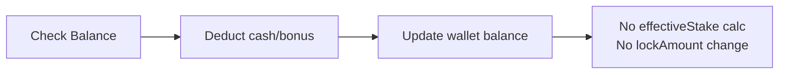

# 有效投注額實作細節：LockAmount 與 Effective Stake

> **Canonical Source**: [02-04-03_Implementation_Details.md](../../source-archive/02_Finance_Center/02-04-diagrams/02-04-03_Implementation_Details.md)
> **Audience**: 架構師、後端開發人員、DevOps
> **Business Requirements**: 無（純技術內容，無對應需求文件）
> **Last Synced**: 2026-02-08

---

## 1. 核心服務與類別對照

### 1.1 服務依賴關係

```
GridService (betting core)
  ├── GridAbstractService (shared calculation logic)
  │     ├── getEffectiveStake()
  │     ├── getRebateEffectiveStake()
  │     └── deduct() / updateWallets()
  ├── WalletTransaction (per-tx wallet delta model)
  ├── PlayerWallet (wallet entity)
  └── Transaction (bet record entity)

PromotionService (promotion lifecycle)
  ├── promotionApply()
  └── promotionApprove()

WalletTransactionService (deposit / withdraw / VIP)
  └── deposit()
```

### 1.2 原始碼檔案索引

| 類別 | 路徑 | 職責 |
|------|------|------|
| `GridService` | `transaction-service/.../service/GridService.java` | 投注、結算、取消、回滾 |
| `GridAbstractService` | `transaction-service/.../service/GridAbstractService.java` | 有效投注額計算、返水計算、共享扣款邏輯 |
| `WalletTransaction` | `transaction-service/.../model/WalletTransaction.java` | 單筆交易錢包變動追蹤 |
| `PlayerWallet` | `common-lib/.../db/domain/PlayerWallet.java` | 錢包實體：cash、bonus、cleanAmount、lockAmount、effectiveStake、wagerRequirement |
| `Transaction` | `common-lib/.../db/domain/Transaction.java` | 投注記錄：betAmount、payout、effectiveStake、rebateEffectiveStake |
| `PromotionService` | `transaction-service/.../service/PromotionService.java` | 優惠申請/核准邏輯 |
| `PlayerWalletServiceImpl` | `data-mysql/.../service/impl/PlayerWalletServiceImpl.java` | 錢包資料庫操作 |

---

## 2. 錢包扣款演算法

**來源**: `GridAbstractService.java`（第 116-168 行）

### 2.1 扣款優先順序

```
1. Cash first   -> deduct from wallet.cash
2. Bonus second -> deduct from wallet.bonus (when cash insufficient)
3. Multi-wallet -> iterate wallets by priority
4. Main wallet  -> allows overdraft (negative balance) as last resort
```

### 2.2 扣款範例

**範例 1：現金充足**

```yaml
Before: { cash: 1000, bonus: 500, lockAmount: 300, effectiveStake: 0 }
Bet:    100
Deduct: { deductCash: -100, deductBonus: 0 }
After:  { cash: 900, bonus: 500, lockAmount: 300, effectiveStake: 0 }
```

**範例 2：現金不足，使用獎金**

```yaml
Before: { cash: 50, bonus: 500, lockAmount: 20, effectiveStake: 0 }
Bet:    100
Deduct: { deductCash: -50, deductBonus: -50 }
After:  { cash: 0, bonus: 450, lockAmount: 20, effectiveStake: 0 }
```

**範例 3：跨錢包扣款**

```yaml
# Promotion wallet (priority 1)
Before: { cash: 30, bonus: 100, wagerRequirement: 500, effectiveStake: 0 }
# Main wallet (priority 2)
Before: { cash: 50, bonus: 0, lockAmount: 20, effectiveStake: 0 }

Bet: 150
Step 1: Promotion wallet deducts cash=30 + bonus=100 = 130
Step 2: Main wallet deducts remaining cash=20

After (Promotion): { cash: 0, bonus: 0 }
After (Main):      { cash: 30, bonus: 0, lockAmount: 20 }
```

---

## 3. 有效投注額計算

### 3.1 計算時機

**來源**: `GridService.java`（第 356-430 行）

有效投注額 (Effective Stake) **僅在結算時**計算，投注下單時不計算。

| 事件 | effectiveStake 操作 |
|------|---------------------|
| 投注下單 | 不計算 |
| 結算 (SETTLE) | 計算並累加 |
| 部分派彩 (PARTIAL_PAYOUT) | 計算差額並累加 |
| 取消 (CANCEL) | 扣除先前累加值 |

### 3.2 各遊戲類型公式

**來源**: `GridAbstractService.java`（第 170-192 行）

#### 體育博彩 / 電子競技

```
effectiveStake = |winAmount + lossAmount|
```

| betAmount | payout | winAmount | lossAmount | effectiveStake |
|-----------|--------|-----------|------------|----------------|
| 100 | 180 | 80 | 0 | 80 |
| 100 | 0 | 0 | 100 | 100 |

#### 賭場遊戲

```
if payout == betAmount (tie):     effectiveStake = 0
if winAmount > 0 (win):           effectiveStake = min(winAmount, betAmount)
if winAmount == 0 (loss):         effectiveStake = betAmount
```

| betAmount | payout | winAmount | 結果 | effectiveStake |
|-----------|--------|-----------|------|----------------|
| 100 | 100 | 0 | 和局 | 0 |
| 100 | 180 | 80 | 贏 | min(80,100) = 80 |
| 100 | 200 | 100 | 贏 | min(100,100) = 100 |
| 100 | 0 | 0 | 輸 | 100 |

#### 其他遊戲類型

```
effectiveStake = betAmount
```

### 3.3 Effective Stake / LockAmount 關係

**來源**: `WalletTransaction.java`（第 119-125 行）

```
Rule: lockAmount -= effectiveStake  (when effectiveStake >= 0)
Constraint: lockAmount = GREATEST(lockAmount + delta, 0)  -- never below zero
```

```yaml
Before: { lockAmount: 500, effectiveStake: 100 }
Settlement produces: effectiveStake = 200
After:  { lockAmount: 300, effectiveStake: 300 }
```

---

## 4. 投注生命週期與 LockAmount 狀態轉換

### 4.1 投注下單

**來源**: `GridService.bet()`（第 65-84 行）

- LockAmount 變化: **無**
- effectiveStake: **不計算**



### 4.2 結算 - 贏

**來源**: `GridService.result()`（第 125-143 行）

- LockAmount 變化: 減少 effectiveStake

```yaml
Before:     { cash: 900, lockAmount: 500, effectiveStake: 0 }
Settlement: payout=180, effectiveStake=80
After:      { cash: 1080, lockAmount: 420, effectiveStake: 80 }
```

### 4.3 結算 - 輸

**來源**: `GridService.result()`

- LockAmount 變化: 減少 effectiveStake（輸也會產生有效投注額）

```yaml
Before:     { cash: 900, lockAmount: 500, effectiveStake: 0 }
Settlement: payout=0, effectiveStake=100
After:      { cash: 900, lockAmount: 400, effectiveStake: 100 }
```

### 4.4 取消

**來源**: `GridService.result()` with `TxType.CANCEL`（第 403-409 行）

- LockAmount 變化: 增加（回復先前累加的 effectiveStake）

```java
// Negate effective stake on cancel
wallet.addEffectiveStake(bet.getEffectiveStake().negate());
// lockAmount += |effectiveStake| (since effectiveStake delta is negative)
```

```yaml
Before (settled): { cash: 1080, lockAmount: 420, effectiveStake: 80 }
Cancel:           refund betAmount=100, effectiveStake=-80
After:            { cash: 980, lockAmount: 500, effectiveStake: 0 }
```

### 4.5 作廢

**來源**: `GridService.internalVoid()`（第 229-264 行）

- LockAmount 變化: 回復到投注前狀態

```java
// Void: refund (betAmount - payout), negate effectiveStake
wallet.addEffectiveStake(tx.getEffectiveStake().negate());
```

```yaml
Before (settled): { cash: 1080, lockAmount: 420, effectiveStake: 80, payout: 180 }
Void:             refund (100-180)=-80, effectiveStake=-80
After:            { cash: 1000, lockAmount: 500, effectiveStake: 0 }
```

### 4.6 部分結算

**來源**: `GridService.singleBetMultipleResult()`（第 147-162、436-490 行）

- LockAmount 變化: **僅在狀態轉為 SETTLE 時**

```yaml
# First payout: status remains UNSETTLE
Payout: 50, effectiveStake: unchanged, lockAmount: unchanged

# Second payout: status transitions to SETTLE
Payout: 100 (cumulative 150), effectiveStake: 100, lockAmount -= 100
```

---

## 5. 情境演練

### 5.1 主錢包無 LockAmount

```yaml
# Initial
Main: { cash: 1000, lockAmount: 0, cleanAmount: 1000, effectiveStake: 0 }

# Step 1: Bet 100
Main: { cash: 900, lockAmount: 0, cleanAmount: 900, effectiveStake: 0 }

# Step 2a: Settle WIN (CASINO, payout=180, win=80)
#   effectiveStake = min(80, 100) = 80
#   lockAmount = GREATEST(0 - 80, 0) = 0
Main: { cash: 1080, lockAmount: 0, cleanAmount: 1080, effectiveStake: 80 }

# Step 2b: Settle LOSS (payout=0, loss=100)
#   effectiveStake = 100
#   lockAmount = GREATEST(0 - 100, 0) = 0
Main: { cash: 900, lockAmount: 0, cleanAmount: 900, effectiveStake: 100 }
```

### 5.2 優惠錢包 (wagerRequirement)

```yaml
# Initial
Promo: { cash: 100, bonus: 200, wagerRequirement: 1500, effectiveStake: 0 }

# Step 1: Bet 100
Promo: { cash: 0, bonus: 200, wagerRequirement: 1500, effectiveStake: 0 }

# Step 2: Settle WIN (payout=150, win=50)
#   effectiveStake = min(50, 100) = 50
Promo: { cash: 150, bonus: 200, wagerRequirement: 1500, effectiveStake: 50 }
# Remaining wager: 1500 - 50 = 1450
```

### 5.3 主錢包有 LockAmount

```yaml
# Initial (deposit bonus applied)
Main: { cash: 1000, lockAmount: 500, cleanAmount: 500, effectiveStake: 0 }

# Step 1: Bet 200
Main: { cash: 800, lockAmount: 500, cleanAmount: 300, effectiveStake: 0 }

# Step 2: Settle WIN (payout=300, win=100)
#   effectiveStake = min(100, 200) = 100
#   lockAmount = 500 - 100 = 400
Main: { cash: 1100, lockAmount: 400, cleanAmount: 700, effectiveStake: 100 }
```

### 5.4 跨錢包投注（Cash + Bonus）

```yaml
# Initial
Promo: { cash: 50, bonus: 300, wagerRequirement: 1000, effectiveStake: 0 }
Main:  { cash: 200, bonus: 0, lockAmount: 100, effectiveStake: 0 }

# Step 1: Bet 500
#   Promo deducts: cash=50 + bonus=300 = 350
#   Main deducts: cash=150 (remaining)
Promo: { cash: 0, bonus: 0 }
Main:  { cash: 50, lockAmount: 100, effectiveStake: 0 }

# Step 2: Settle WIN (payout=600, win=100, effectiveStake=100)
#   Payout routed to promo wallet (getBetResultWallet logic)
Promo: { cash: 600, bonus: 0, wagerRequirement: 1000, effectiveStake: 100 }
Main:  { cash: 50, lockAmount: 100, effectiveStake: 0 }
```

---

## 6. 返水有效投注額計算

**來源**: `GridAbstractService.getRebateEffectiveStake()`（第 194-238 行）

### 6.1 公式

```
Non-promotion bet:
  rebateEffectiveStake = effectiveStake

Promotion bet:
  totalRequirement = SUM(wagerRequirement - effectiveStake) + (openSts ? 0 : lockAmount)
  rebateEffectiveStake = MAX(0, effectiveStake - totalRequirement)
```

### 6.2 範例

**範例 1：優惠錢包流水未完成**

```yaml
effectiveStake: 100
Promo wallet: { wagerRequirement: 1000, effectiveStake: 50 }  # remaining: 950
Main wallet:  { lockAmount: 200 }  # openSts = false
totalRequirement: 950 + 200 = 1150
rebateEffectiveStake: MAX(0, 100 - 1150) = 0  # no rebate
```

**範例 2：優惠錢包流水已完成**

```yaml
effectiveStake: 100
Promo wallet: { wagerRequirement: 500, effectiveStake: 500 }  # remaining: 0
Main wallet:  { lockAmount: 0 }
totalRequirement: 0 + 0 = 0
rebateEffectiveStake: MAX(0, 100 - 0) = 100  # full rebate
```

### 6.3 系統配置

| 配置項 | 用途 |
|--------|------|
| `REBATE_BETTING_LOCKED` | 是否將 lockAmount 納入返水 totalRequirement 計算 |

---

## 7. 資料庫更新邏輯

### 7.1 PlayerWallet 更新 SQL

**來源**: `PlayerWalletServiceImpl.java`（第 69-86 行）

```sql
UPDATE player_wallet SET
    cash = ?,
    bonus = ?,
    clean_amount = GREATEST(clean_amount + ?, 0),
    lock_amount = GREATEST(lock_amount + ?, 0),
    effective_stake = ?
WHERE id = ?
```

關鍵限制：
- `cleanAmount` 和 `lockAmount` 使用 `GREATEST(..., 0)` 確保非負
- `effectiveStake` 設定為絕對值（非差額）
- `cash` 和 `bonus` 設定為絕對值

### 7.2 WalletTransaction 對 PlayerWallet 欄位對映

**來源**: `GridAbstractService.java`（第 75-114 行）

| WalletTransaction 欄位 | 資料庫更新模式 | 備註 |
|------------------------|----------------|------|
| `cleanAmount` | **差額** (+ 或 -) | 受 `GREATEST(..., 0)` 保護 |
| `lockAmount` | **差額** (+ 或 -) | 受 `GREATEST(..., 0)` 保護 |
| `effectiveStake` | **絕對值** | 直接設定 |
| `cash` | **絕對值** | 直接設定 |
| `bonus` | **絕對值** | 直接設定 |

---

## 8. 端對端演練：優惠錢包流水完成

### 8.1 初始狀態

```yaml
Main: { cash: 500, bonus: 0, lockAmount: 0, cleanAmount: 500, effectiveStake: 0 }
```

### 8.2 步驟 1：申請優惠

**來源**: `PromotionService.java`（第 69-136 行）

玩家存款 200，獲得 100 獎金，流水要求 = 5 倍（5 * 300 = 1500）。

```yaml
# Main wallet: deduct 200, add lockAmount 200 (PROMOTION type deduct)
Main:  { cash: 300, lockAmount: 200, cleanAmount: 100, effectiveStake: 0 }
# New promotion wallet created
Promo: { cash: 200, bonus: 100, wagerRequirement: 1500, effectiveStake: 0, isClosed: false }
```

### 8.3 步驟 2：投注 #1（優惠錢包）

```yaml
Bet: 150 from promo wallet
Promo: { cash: 50, bonus: 100, wagerRequirement: 1500, effectiveStake: 0 }
```

### 8.4 步驟 3：結算 #1

```yaml
Settlement: payout=200 (win 50), effectiveStake=100
Promo: { cash: 250, bonus: 100, wagerRequirement: 1500, effectiveStake: 100 }
# Remaining wager: 1400
```

### 8.5 步驟 4-15：持續投注

```yaml
# After multiple rounds of betting and settlement
Total bets placed: 2000
Total effectiveStake accumulated: 1500

Promo: { cash: 280, bonus: 120, wagerRequirement: 1500, effectiveStake: 1500 }
# Remaining wager: 0 (COMPLETE)
```

### 8.6 步驟 16：優惠錢包關閉與轉移

當 `effectiveStake >= wagerRequirement` 時，優惠錢包關閉並將餘額轉回主錢包。

```yaml
# Close promotion wallet
Promo: { isClosed: true, cash: 0, bonus: 0 }

# Transfer to main wallet, reduce lockAmount
Main: { cash: 700, lockAmount: 0, cleanAmount: 700, effectiveStake: 0 }
# lockAmount: 200 - 200 = 0 (wager requirement fulfilled)
```

---

## 9. 特殊情況

### 9.1 手續費 / 佣金處理

- 手續費記錄於 `Transaction.ante`（前置費）和 `Transaction.tip`（小費）
- 手續費**不影響** effectiveStake 計算
- 手續費會減少實際派彩金額

### 9.2 派彩錢包路由（跨錢包投注）

`getBetResultWallet` 方法決定派彩目的地：

```
Priority:
  1. Open (unclosed) promotion wallet -> payout to promotion wallet
  2. No open promotion wallet         -> payout to main wallet
```

effectiveStake **不會**按比例分配到各錢包；它會完整累加到接收派彩的錢包。

---

## 10. 方法參考索引

| 方法 | 來源:行號 | 用途 |
|------|-----------|------|
| `bet(Transaction bet)` | GridService.java:65-84 | 投注下單 |
| `result(Transaction tx, Transaction originBet)` | GridService.java:125-143 | 投注結算 |
| `internalVoid(Transaction tx)` | GridService.java:229-264 | 投注作廢 |
| `rollback(Transaction rollback, Transaction bet)` | GridService.java:164-208 | 投注回滾 |
| `singleBetMultipleResult()` | GridService.java:147-162, 436-490 | 部分結算 |
| `deduct(...)` | GridAbstractService.java:116-168 | 錢包扣款 |
| `getEffectiveStake(...)` | GridAbstractService.java:170-192 | 有效投注額計算 |
| `getRebateEffectiveStake(...)` | GridAbstractService.java:194-238 | 返水有效投注額計算 |
| `addEffectiveStake(BigDecimal)` | WalletTransaction.java:119-125 | 累加有效投注額，調整 lockAmount |
| `updateWallets(...)` | GridAbstractService.java:75-114 | 將錢包變更持久化到資料庫 |
| `promotionApply(...)` | PromotionService.java:69-136 | 優惠申請 |
| `promotionApprove(...)` | PromotionService.java:139-224 | 優惠核准 |
| `deposit(...)` | WalletTransactionService.java:62-101 | 存款處理 |

---

## 11. 業務規則摘要（技術參考）

### 11.1 LockAmount 規則

| 規則 | 說明 |
|------|------|
| **產生** | 主錢包收到 DEPOSIT、PROMOTION、VIP、RED_ENVELOPES 資金時增加 |
| **減少** | 結算時 `lockAmount -= effectiveStake` |
| **回復** | 取消/作廢時 `lockAmount += effectiveStake` |
| **下限** | `GREATEST(lock_amount + delta, 0)` — 永不低於零 |
| **提款** | 可提款金額 = `cash - lockAmount`（即 `cleanAmount`）|

### 11.2 EffectiveStake 規則

| 規則 | 說明 |
|------|------|
| **計算時機** | 僅在結算時計算，投注下單時不計算 |
| **體育博彩** | `\|winAmount + lossAmount\|` |
| **賭場（和局）** | `0` |
| **賭場（贏）** | `min(winAmount, betAmount)` |
| **賭場（輸）** | `betAmount` |
| **其他** | `betAmount` |
| **累加** | 結算時 `effectiveStake += calculated_value` |
| **回復** | 取消時 `effectiveStake -= original_value` |
| **流水檢查** | 優惠完成條件：`effectiveStake >= wagerRequirement` |

### 11.3 返水規則

| 規則 | 說明 |
|------|------|
| **非優惠投注** | `rebateEffectiveStake = effectiveStake` |
| **優惠投注** | `rebateEffectiveStake = MAX(0, effectiveStake - totalRequirement)` |
| **totalRequirement** | `SUM(wagerReq - effectiveStake) + (openSts ? 0 : lockAmount)` |
| **配置** | `REBATE_BETTING_LOCKED` 控制是否納入 lockAmount |
