# 遊戲整合安全技術實作（Game Integration Security Technical Implementation）

> **業務需求**: [Game_Integration_Requirements.md](../../requirements/03_Gaming_Operations/02_Game_Integration_Requirements.md)
> **目標讀者**: 架構師、後端開發、安全工程師
> **最後同步**: 2026-02-09

---

## 1. 架構概覽（Architecture Overview）

遊戲整合安全系統提供 iGaming 平台與遊戲供應商（Game Providers, GPs）之間的安全通訊和交易完整性保障。系統實作深度防禦架構，透過多層安全機制防護重放攻擊、數據篡改和未授權存取。

**核心技術組件**：
- 基於 HMAC-SHA256 簽章的 Token 驗證機制
- 三層冪等防禦（Redis + 資料庫 + 分散式鎖）
- 基於 Redis 黑名單的防重放保護
- 基於排程任務的停滯交易自動恢復
- 使用 Redisson 實作的速率限制
- 與 Nginx 整合的 IP 白名單

### 1.1 安全驗證層級（Security Verification Layers）

下圖展示深度防禦安全架構的多層驗證機制：

```mermaid
graph TB
    Request[遊戲供應商請求]

    subgraph "Layer 1: Network Security"
        Nginx[Nginx IP 白名單<br/>- 檢查來源 IP 是否在 GP 白名單中<br/>- 若不在白名單則拒絕 403]
        RateLimit[速率限制器<br/>- 全域限制: 1000 req/s<br/>- 單一 GP 限制: 100 req/s<br/>- 超過限制返回 429]
    end

    subgraph "Layer 2: Authentication"
        APIKey[API Key 驗證<br/>- 提取 X-GP-ID header<br/>- 驗證 GP 註冊資訊<br/>- 檢查 GP 狀態為 ACTIVE]
        Token[Token 驗證<br/>- Base64 解碼 token<br/>- 驗證 HMAC-SHA256 簽章<br/>- 檢查 5 分鐘有效期<br/>- 常數時間比對]
    end

    subgraph "Layer 3: Anti-Replay"
        Replay[Redis 黑名單檢查<br/>- SHA256 雜湊 token<br/>- 檢查 redis token:blacklist:*<br/>- 若存在則拒絕 TTL=5min]
    end

    subgraph "Layer 4: Idempotency"
        Cache[Redis 快取檢查<br/>- game:tx:response:txId<br/>- 若存在則返回快取結果]
        DB[資料庫唯一約束<br/>- t_game_transaction.tx_id UNIQUE<br/>- ON CONFLICT DO NOTHING]
        Lock[分散式鎖<br/>- Redisson RLock per player<br/>- 防止競態條件]
    end

    Execute[執行業務邏輯<br/>錢包扣款/加款]
    Response[返回回應 + 快取]

    Request --> Nginx
    Nginx -->|IP Whitelisted| RateLimit
    Nginx -->|IP Not Whitelisted| Reject1[403 Forbidden]

    RateLimit -->|Within Limit| APIKey
    RateLimit -->|Exceeded| Reject2[429 Too Many Requests]

    APIKey -->|Valid GP| Token
    APIKey -->|Invalid GP| Reject3[401 Unauthorized]

    Token -->|Valid Signature| Replay
    Token -->|Invalid/Expired| Reject4[401 Invalid Token]

    Replay -->|First Use| Cache
    Replay -->|Already Used| Reject5[409 Replay Attack]

    Cache -->|Cache Hit| Response
    Cache -->|Cache Miss| DB

    DB -->|Exists| Response
    DB -->|New Transaction| Lock

    Lock -->|Lock Acquired| Execute
    Lock -->|Lock Timeout| Reject6[503 System Busy]

    Execute --> Response

    style Nginx fill:#e1f5ff
    style RateLimit fill:#e1f5ff
    style APIKey fill:#fff4e6
    style Token fill:#fff4e6
    style Replay fill:#ffe6e6
    style Cache fill:#e6ffe6
    style DB fill:#e6ffe6
    style Lock fill:#e6ffe6
    style Execute fill:#f3e5f5
    style Response fill:#f3e5f5
```



**安全層職責**：

1. **網路安全層（Layer 1）**：
   - IP 白名單：Nginx `geo` 模組阻擋未授權來源 IP
   - 速率限制：Redisson 速率限制器防止 DDoS 和濫用

2. **身份驗證層（Layer 2）**：
   - API Key：透過 `X-GP-ID` header 驗證 GP 身份
   - Token：HMAC-SHA256 簽章驗證，採用常數時間比對

3. **防重放層（Layer 3）**：
   - Redis 黑名單防止 token 在 5 分鐘有效期內重複使用
   - SHA256 token 雜湊減少 Redis key 大小

4. **冪等層（Layer 4）**：
   - Redis 快取：O(1) 查詢重複請求（< 5ms）
   - 資料庫唯一約束：在資料庫層級防止重複執行
   - 分散式鎖：防止首次並發執行的競態條件

**效能特性**：
- 快取命中（Layer 4.1）：約 5ms 回應時間
- 資料庫命中（Layer 4.2）：約 15ms 回應時間
- 新交易（Layer 4.3）：約 50-100ms（包含鎖獲取 + 業務邏輯）

---

## 2. Token 驗證機制（Token-Based Authentication）

### 2.1 Token 生成（Token Generation）

**Token 組成結構**：
```
Base64(playerId|tenantId|timestamp|signature)
```

**HMAC-SHA256 簽章演算法**：

```java
@Service
@RequiredArgsConstructor
public class GameTokenService {

    private final VaultKeyManager vaultKeyManager;
    private final StringRedisTemplate redisTemplate;

    private static final int TOKEN_VALIDITY_SECONDS = 300; // 5 minutes

    /**
     * Generate secure game token with HMAC-SHA256 signature
     */
    public String generateToken(Long playerId, Long tenantId) {
        long timestamp = System.currentTimeMillis() / 1000L;
        String apiSecret = vaultKeyManager.getGPApiSecret(tenantId);

        // Build signature payload
        String payload = String.format("%d|%d|%d", playerId, tenantId, timestamp);

        // Generate HMAC-SHA256 signature
        String signature = generateHMAC(payload, apiSecret);

        // Combine and encode
        String tokenData = String.format("%s|%s", payload, signature);
        String token = Base64.getEncoder().encodeToString(
            tokenData.getBytes(StandardCharsets.UTF_8)
        );

        return token;
    }

    /**
     * HMAC-SHA256 signature generation
     */
    private String generateHMAC(String data, String secret) {
        try {
            Mac mac = Mac.getInstance("HmacSHA256");
            SecretKeySpec secretKey = new SecretKeySpec(
                secret.getBytes(StandardCharsets.UTF_8),
                "HmacSHA256"
            );
            mac.init(secretKey);

            byte[] hmacBytes = mac.doFinal(data.getBytes(StandardCharsets.UTF_8));
            return bytesToHex(hmacBytes);

        } catch (NoSuchAlgorithmException | InvalidKeyException e) {
            throw new BusinessException(ErrorCode.HMAC_GENERATION_FAILED, e);
        }
    }

    /**
     * Convert byte array to hex string
     */
    private String bytesToHex(byte[] bytes) {
        StringBuilder hexString = new StringBuilder(bytes.length * 2);
        for (byte b : bytes) {
            String hex = Integer.toHexString(0xff & b);
            if (hex.length() == 1) {
                hexString.append('0');
            }
            hexString.append(hex);
        }
        return hexString.toString();
    }
}
```

### 2.2 Token 驗證（Token Validation）

```java
@Service
@RequiredArgsConstructor
public class GameTokenValidator {

    private final VaultKeyManager vaultKeyManager;
    private final StringRedisTemplate redisTemplate;

    private static final int TOKEN_VALIDITY_SECONDS = 300;
    private static final String BLACKLIST_PREFIX = "token:blacklist:";

    /**
     * Validate game token (signature, expiry, anti-replay)
     */
    public TokenValidationResult validateToken(String token, Long tenantId) {
        // Step 1: Base64 decode
        String decoded;
        try {
            byte[] decodedBytes = Base64.getDecoder().decode(token);
            decoded = new String(decodedBytes, StandardCharsets.UTF_8);
        } catch (IllegalArgumentException e) {
            return TokenValidationResult.invalid("Invalid Base64 encoding");
        }

        // Step 2: Parse token components
        String[] parts = decoded.split("\\|");
        if (parts.length != 4) {
            return TokenValidationResult.invalid("Invalid token format");
        }

        Long playerId = Long.parseLong(parts[0]);
        Long tokenTenantId = Long.parseLong(parts[1]);
        long timestamp = Long.parseLong(parts[2]);
        String receivedSignature = parts[3];

        // Step 3: Validate tenant ID
        if (!tokenTenantId.equals(tenantId)) {
            return TokenValidationResult.invalid("Tenant ID mismatch");
        }

        // Step 4: Validate expiry (5-minute window)
        long currentTime = System.currentTimeMillis() / 1000L;
        if (currentTime - timestamp > TOKEN_VALIDITY_SECONDS) {
            return TokenValidationResult.expired("Token expired");
        }

        // Step 5: Anti-replay check (Redis blacklist)
        String blacklistKey = BLACKLIST_PREFIX + token;
        if (Boolean.TRUE.equals(redisTemplate.hasKey(blacklistKey))) {
            return TokenValidationResult.replayDetected("Token already used");
        }

        // Step 6: Verify HMAC signature
        String apiSecret = vaultKeyManager.getGPApiSecret(tenantId);
        String payload = String.format("%d|%d|%d", playerId, tokenTenantId, timestamp);
        String expectedSignature = generateHMAC(payload, apiSecret);

        if (!constantTimeEquals(receivedSignature, expectedSignature)) {
            return TokenValidationResult.invalid("Invalid signature");
        }

        // Step 7: Add to blacklist (prevent replay)
        long ttl = TOKEN_VALIDITY_SECONDS - (currentTime - timestamp);
        redisTemplate.opsForValue().set(blacklistKey, "1", ttl, TimeUnit.SECONDS);

        return TokenValidationResult.valid(playerId);
    }

    /**
     * Constant-time string comparison (prevents timing attacks)
     */
    private boolean constantTimeEquals(String a, String b) {
        if (a.length() != b.length()) {
            return false;
        }

        int result = 0;
        for (int i = 0; i < a.length(); i++) {
            result |= a.charAt(i) ^ b.charAt(i);
        }
        return result == 0;
    }

    private String generateHMAC(String data, String secret) {
        // Same implementation as in GameTokenService
        // ... (omitted for brevity)
    }
}
```

### 2.3 Token 驗證結果（Token Validation Result）

```java
@Getter
@AllArgsConstructor
public class TokenValidationResult {
    private final boolean valid;
    private final Long playerId;
    private final String errorMessage;
    private final ValidationFailureReason failureReason;

    public static TokenValidationResult valid(Long playerId) {
        return new TokenValidationResult(true, playerId, null, null);
    }

    public static TokenValidationResult invalid(String message) {
        return new TokenValidationResult(false, null, message,
            ValidationFailureReason.INVALID_FORMAT);
    }

    public static TokenValidationResult expired(String message) {
        return new TokenValidationResult(false, null, message,
            ValidationFailureReason.EXPIRED);
    }

    public static TokenValidationResult replayDetected(String message) {
        return new TokenValidationResult(false, null, message,
            ValidationFailureReason.REPLAY_ATTACK);
    }

    public enum ValidationFailureReason {
        INVALID_FORMAT,
        EXPIRED,
        REPLAY_ATTACK,
        SIGNATURE_MISMATCH
    }
}
```

---

## 3. 防重放保護（Anti-Replay Protection）

### 3.1 Redis 黑名單實作（Redis Blacklist Implementation）

**架構**：
```
Token → SHA256 Hash → Redis Blacklist (TTL = Token Validity)
```

**實作**：

```java
@Service
@RequiredArgsConstructor
public class AntiReplayService {

    private final StringRedisTemplate redisTemplate;

    private static final String BLACKLIST_PREFIX = "token:blacklist:";
    private static final int TOKEN_VALIDITY_SECONDS = 300;

    /**
     * Check if token has been used before
     */
    public boolean isTokenUsed(String token) {
        String key = BLACKLIST_PREFIX + hashToken(token);
        return Boolean.TRUE.equals(redisTemplate.hasKey(key));
    }

    /**
     * Mark token as used
     */
    public void markTokenAsUsed(String token) {
        String key = BLACKLIST_PREFIX + hashToken(token);

        // Store with TTL = token validity window
        redisTemplate.opsForValue().set(
            key,
            String.valueOf(System.currentTimeMillis()),
            TOKEN_VALIDITY_SECONDS,
            TimeUnit.SECONDS
        );
    }

    /**
     * SHA256 hash for token (reduce Redis key size)
     */
    private String hashToken(String token) {
        try {
            MessageDigest digest = MessageDigest.getInstance("SHA-256");
            byte[] hash = digest.digest(token.getBytes(StandardCharsets.UTF_8));
            return bytesToHex(hash);
        } catch (NoSuchAlgorithmException e) {
            throw new BusinessException(ErrorCode.HASH_FAILED, e);
        }
    }

    private String bytesToHex(byte[] bytes) {
        // Same implementation as in GameTokenService
        // ... (omitted for brevity)
    }
}
```

### 3.2 黑名單監控（Blacklist Monitoring）

```java
@Component
@RequiredArgsConstructor
public class BlacklistMetrics {

    private final MeterRegistry meterRegistry;
    private final StringRedisTemplate redisTemplate;

    @Scheduled(fixedDelay = 60000) // Every 1 minute
    public void recordBlacklistSize() {
        Set<String> keys = redisTemplate.keys(BLACKLIST_PREFIX + "*");
        int size = (keys != null) ? keys.size() : 0;

        meterRegistry.gauge("game.token.blacklist.size", size);
    }
}
```

---

## 4. 冪等三層防禦（Idempotency Three-Layer Defense）

### 4.1 架構圖（Architecture Diagram）

```
Request (txId)
     ↓
[Layer 1: Redis Cache]
   - O(1) lookup (< 5ms)
   - 1-hour TTL
     ↓ Cache miss
[Layer 2: DB Unique Constraint]
   - t_game_transaction.tx_id UNIQUE
   - ON CONFLICT DO NOTHING
     ↓ New transaction
[Layer 3: Distributed Lock]
   - Redisson RLock per player
   - Prevents race conditions
     ↓
Execute Business Logic
```

### 4.2 實作（Implementation）

```java
@Service
@RequiredArgsConstructor
public class GameIdempotencyGuard {

    private final StringRedisTemplate redisTemplate;
    private final GameTransactionRepository transactionRepository;
    private final RedissonClient redissonClient;

    private static final String RESPONSE_CACHE_PREFIX = "game:tx:response:";
    private static final int CACHE_TTL_HOURS = 1;

    /**
     * Execute game transaction with three-layer idempotency
     */
    public <T> T executeIdempotent(String txId, Long playerId, Supplier<T> action) {
        // Layer 1: Redis cache check (fast path)
        String cacheKey = RESPONSE_CACHE_PREFIX + txId;
        String cachedResponse = redisTemplate.opsForValue().get(cacheKey);
        if (cachedResponse != null) {
            return deserialize(cachedResponse);
        }

        // Layer 2: DB unique constraint check
        Optional<GameTransaction> existing = transactionRepository.findByTxId(txId);
        if (existing.isPresent()) {
            T response = deserialize(existing.get().getResponseData());
            // Populate cache for next request
            cacheResponse(txId, response);
            return response;
        }

        // Layer 3: Distributed lock (prevent concurrent first-time execution)
        String lockKey = "game:lock:player:" + playerId;
        RLock lock = redissonClient.getLock(lockKey);

        try {
            // Try to acquire lock (wait 3s, hold max 10s)
            if (!lock.tryLock(3, 10, TimeUnit.SECONDS)) {
                throw new BusinessException(ErrorCode.SYSTEM_BUSY_RETRY);
            }

            // Double-check after acquiring lock
            existing = transactionRepository.findByTxId(txId);
            if (existing.isPresent()) {
                T response = deserialize(existing.get().getResponseData());
                cacheResponse(txId, response);
                return response;
            }

            // Execute business logic
            T response = action.get();

            // Store response in DB and cache
            storeTransaction(txId, playerId, response);
            cacheResponse(txId, response);

            return response;

        } catch (InterruptedException e) {
            Thread.currentThread().interrupt();
            throw new BusinessException(ErrorCode.LOCK_INTERRUPTED, e);
        } finally {
            if (lock.isHeldByCurrentThread()) {
                lock.unlock();
            }
        }
    }

    private void storeTransaction(String txId, Long playerId, Object response) {
        GameTransaction tx = GameTransaction.builder()
            .txId(txId)
            .playerId(playerId)
            .responseData(serialize(response))
            .createdAt(LocalDateTime.now())
            .build();
        transactionRepository.save(tx);
    }

    private void cacheResponse(String txId, Object response) {
        String cacheKey = RESPONSE_CACHE_PREFIX + txId;
        redisTemplate.opsForValue().set(
            cacheKey,
            serialize(response),
            CACHE_TTL_HOURS,
            TimeUnit.HOURS
        );
    }

    private String serialize(Object obj) {
        // JSON serialization implementation
        // ... (omitted for brevity)
    }

    private <T> T deserialize(String json) {
        // JSON deserialization implementation
        // ... (omitted for brevity)
    }
}
```

### 4.3 資料庫模式（Database Schema）

```sql
CREATE TABLE t_game_transaction (
    id BIGSERIAL PRIMARY KEY,
    tx_id VARCHAR(64) NOT NULL UNIQUE,  -- Layer 2: Unique constraint
    player_id BIGINT NOT NULL,
    gp_id BIGINT NOT NULL,
    transaction_type VARCHAR(20) NOT NULL,  -- BET, WIN, CANCEL
    amount DECIMAL(19, 4),
    response_data JSONB NOT NULL,  -- Cached response
    created_at TIMESTAMP NOT NULL DEFAULT NOW(),
    updated_at TIMESTAMP NOT NULL DEFAULT NOW()
);

-- Index for player query
CREATE INDEX idx_game_tx_player_created ON t_game_transaction(player_id, created_at DESC);

-- Index for GP reconciliation
CREATE INDEX idx_game_tx_gp_created ON t_game_transaction(gp_id, created_at DESC);
```

---

## 5. 停滯交易自動恢復（Stalled Transaction Auto-Recovery）

### 5.1 偵測 SQL（Detection SQL）

**排程任務**（每 10 分鐘執行）：

```sql
-- Detect stalled transactions (created > 10 minutes ago, no response)
SELECT
    tx_id,
    player_id,
    gp_id,
    transaction_type,
    amount,
    created_at,
    EXTRACT(EPOCH FROM (NOW() - created_at)) / 60 AS minutes_stalled
FROM t_game_transaction
WHERE status = 'PENDING'
  AND created_at < NOW() - INTERVAL '10 minutes'
ORDER BY created_at ASC
LIMIT 100;
```

### 5.2 自動恢復實作（Auto-Recovery Implementation）

```java
@Component
@RequiredArgsConstructor
public class StalledTransactionRecoveryJob {

    private final GameTransactionRepository transactionRepository;
    private final GameProviderClient gpClient;
    private final WalletService walletService;
    private final AlertService alertService;

    @Scheduled(cron = "0 */10 * * * *") // Every 10 minutes
    public void recoverStalledTransactions() {
        List<GameTransaction> stalledTxs = transactionRepository.findStalledTransactions(
            LocalDateTime.now().minusMinutes(10)
        );

        for (GameTransaction tx : stalledTxs) {
            try {
                recoverTransaction(tx);
            } catch (Exception e) {
                log.error("Failed to recover transaction: {}", tx.getTxId(), e);
            }
        }
    }

    private void recoverTransaction(GameTransaction tx) {
        // Query GP for authoritative transaction status
        GPTransactionStatus gpStatus;
        try {
            gpStatus = gpClient.queryTransactionStatus(
                tx.getGpId(),
                tx.getTxId()
            );
        } catch (GPQueryException e) {
            // GP query failed, treat as FAILED and refund
            handleGPQueryFailure(tx);
            return;
        }

        switch (gpStatus.getStatus()) {
            case SUCCESS:
                // GP says transaction succeeded
                confirmTransaction(tx, gpStatus);
                break;

            case FAILED:
            case NOT_FOUND:
                // GP says transaction failed or doesn't exist, refund player
                refundTransaction(tx);
                break;

            case PENDING:
                // GP still processing, retry later
                log.info("Transaction still pending at GP: {}", tx.getTxId());
                break;

            default:
                escalateToManualReview(tx, "Unknown GP status: " + gpStatus.getStatus());
        }
    }

    private void confirmTransaction(GameTransaction tx, GPTransactionStatus gpStatus) {
        tx.setStatus(TransactionStatus.SUCCESS);
        tx.setGpResponse(serialize(gpStatus));
        tx.setUpdatedAt(LocalDateTime.now());
        transactionRepository.save(tx);

        log.info("Stalled transaction confirmed: {} (GP says SUCCESS)", tx.getTxId());
    }

    private void refundTransaction(GameTransaction tx) {
        if (tx.getTransactionType() == TransactionType.BET) {
            // Refund bet amount to player wallet
            walletService.credit(
                tx.getPlayerId(),
                tx.getAmount(),
                "Refund for stalled transaction: " + tx.getTxId()
            );

            tx.setStatus(TransactionStatus.REFUNDED);
            tx.setUpdatedAt(LocalDateTime.now());
            transactionRepository.save(tx);

            // Send alert for audit trail
            alertService.sendAlert(
                AlertLevel.WARNING,
                "Stalled Transaction Refunded",
                String.format("TxId: %s, PlayerId: %d, Amount: %s",
                    tx.getTxId(), tx.getPlayerId(), tx.getAmount())
            );
        }
    }

    private void handleGPQueryFailure(GameTransaction tx) {
        // GP query failed (network timeout, 500 error, etc.)
        // Conservative approach: treat as FAILED and refund
        refundTransaction(tx);

        alertService.sendAlert(
            AlertLevel.HIGH,
            "GP Query Failed for Stalled Transaction",
            String.format("TxId: %s, GP: %d - Unable to verify status, refunded to player",
                tx.getTxId(), tx.getGpId())
        );
    }

    private void escalateToManualReview(GameTransaction tx, String reason) {
        tx.setStatus(TransactionStatus.MANUAL_REVIEW);
        tx.setReviewReason(reason);
        tx.setUpdatedAt(LocalDateTime.now());
        transactionRepository.save(tx);

        alertService.sendAlert(
            AlertLevel.CRITICAL,
            "Stalled Transaction Escalated to Manual Review",
            String.format("TxId: %s, Reason: %s", tx.getTxId(), reason)
        );
    }

    private String serialize(Object obj) {
        // JSON serialization implementation
        // ... (omitted for brevity)
    }
}
```

---

## 6. 速率限制（Rate Limiting）

### 6.1 Redisson 速率限制器配置（Redisson Rate Limiter Configuration）

```java
@Configuration
public class RateLimitConfig {

    @Bean
    public RateLimiter gameApiRateLimiter(RedissonClient redissonClient) {
        RRateLimiter rateLimiter = redissonClient.getRateLimiter("game:api:global");

        // Global rate limit: 1,000 requests per second
        rateLimiter.trySetRate(RateType.OVERALL, 1000, 1, RateIntervalUnit.SECONDS);

        return new RedissonRateLimiter(rateLimiter);
    }

    @Bean
    public RateLimiter perGPRateLimiter(RedissonClient redissonClient) {
        // Per-GP rate limit: 100 requests per second
        // Dynamic creation per GP ID
        return new DynamicRedissonRateLimiter(redissonClient, 100, 1, RateIntervalUnit.SECONDS);
    }
}
```

### 6.2 速率限制攔截器（Rate Limiter Interceptor）

```java
@Component
@RequiredArgsConstructor
public class GameAPIRateLimitInterceptor implements HandlerInterceptor {

    private final RateLimiter gameApiRateLimiter;
    private final RateLimiter perGPRateLimiter;

    @Override
    public boolean preHandle(HttpServletRequest request, HttpServletResponse response,
                            Object handler) throws Exception {

        // Extract GP ID from request
        Long gpId = extractGPId(request);

        // Check global rate limit
        if (!gameApiRateLimiter.tryAcquire()) {
            response.setStatus(HttpStatus.TOO_MANY_REQUESTS.value());
            response.getWriter().write("{\"error\":\"Global rate limit exceeded\"}");
            return false;
        }

        // Check per-GP rate limit
        if (!perGPRateLimiter.tryAcquire("gp:" + gpId)) {
            response.setStatus(HttpStatus.TOO_MANY_REQUESTS.value());
            response.getWriter().write("{\"error\":\"GP rate limit exceeded\"}");
            return false;
        }

        return true;
    }

    private Long extractGPId(HttpServletRequest request) {
        String gpIdHeader = request.getHeader("X-GP-ID");
        if (gpIdHeader == null) {
            throw new BusinessException(ErrorCode.MISSING_GP_ID);
        }
        return Long.parseLong(gpIdHeader);
    }
}
```

### 6.3 速率限制回應（Rate Limit Response）

```java
@Getter
@AllArgsConstructor
public class RateLimitResponse {
    private final boolean allowed;
    private final long retryAfterMs;
    private final String limitType;  // "global" or "per-gp"

    public static RateLimitResponse allowed() {
        return new RateLimitResponse(true, 0, null);
    }

    public static RateLimitResponse globalLimitExceeded(long retryAfterMs) {
        return new RateLimitResponse(false, retryAfterMs, "global");
    }

    public static RateLimitResponse gpLimitExceeded(long retryAfterMs) {
        return new RateLimitResponse(false, retryAfterMs, "per-gp");
    }
}
```

---

## 7. IP 白名單（IP Whitelisting）

### 7.1 Nginx 配置（Nginx Configuration）

**檔案**：`/etc/nginx/conf.d/game-api-ip-whitelist.conf`

```nginx
# IP Whitelist for Game Provider APIs
geo $gp_whitelist {
    default 0;

    # GP #1: Evolution Gaming
    185.148.160.0/24 1;  # Evolution Gaming EU datacenter
    52.18.0.0/16 1;      # Evolution Gaming AWS Ireland

    # GP #2: Pragmatic Play
    104.26.0.0/20 1;     # Pragmatic Play Cloudflare
    172.64.0.0/13 1;     # Pragmatic Play primary

    # GP #3: NetEnt
    195.88.0.0/16 1;     # NetEnt Sweden

    # Internal testing
    127.0.0.1 1;         # Localhost
    10.0.0.0/8 1;        # Internal network
}

server {
    listen 443 ssl http2;
    server_name game-api.example.com;

    # SSL configuration
    ssl_certificate /etc/nginx/ssl/game-api.crt;
    ssl_certificate_key /etc/nginx/ssl/game-api.key;
    ssl_protocols TLSv1.2 TLSv1.3;

    location /api/game/ {
        # IP whitelist check
        if ($gp_whitelist = 0) {
            return 403 '{"error":"IP not whitelisted"}';
        }

        # Pass to Spring Boot application
        proxy_pass http://localhost:1024;
        proxy_set_header X-Real-IP $remote_addr;
        proxy_set_header X-Forwarded-For $proxy_add_x_forwarded_for;
        proxy_set_header X-Forwarded-Proto $scheme;
    }
}
```

### 7.2 資料庫驅動的 IP 白名單（Database-Driven IP Whitelist）

**資料庫模式**：

```sql
CREATE TABLE t_gp_ip_whitelist (
    id BIGSERIAL PRIMARY KEY,
    gp_id BIGINT NOT NULL,
    ip_address VARCHAR(45) NOT NULL,  -- Supports IPv4 and IPv6
    ip_range VARCHAR(50),              -- CIDR notation (e.g., "185.148.160.0/24")
    description VARCHAR(255),
    enabled BOOLEAN NOT NULL DEFAULT TRUE,
    created_at TIMESTAMP NOT NULL DEFAULT NOW(),
    updated_at TIMESTAMP NOT NULL DEFAULT NOW()
);

-- Index for GP lookup
CREATE INDEX idx_gp_ip_whitelist_gp ON t_gp_ip_whitelist(gp_id);

-- Index for IP lookup
CREATE INDEX idx_gp_ip_whitelist_ip ON t_gp_ip_whitelist(ip_address, enabled);
```

**實作**：

```java
@Service
@RequiredArgsConstructor
public class IPWhitelistService {

    private final GPIPWhitelistRepository whitelistRepository;
    private final LoadingCache<Long, List<IPRange>> whitelistCache;

    /**
     * Check if IP is whitelisted for GP
     */
    public boolean isIPWhitelisted(Long gpId, String ipAddress) {
        List<IPRange> allowedRanges = whitelistCache.get(gpId);

        try {
            InetAddress ip = InetAddress.getByName(ipAddress);

            for (IPRange range : allowedRanges) {
                if (range.contains(ip)) {
                    return true;
                }
            }

            return false;

        } catch (UnknownHostException e) {
            log.error("Invalid IP address: {}", ipAddress, e);
            return false;
        }
    }

    /**
     * Refresh whitelist cache from database
     */
    @Scheduled(fixedDelay = 300000) // Every 5 minutes
    public void refreshWhitelistCache() {
        whitelistCache.invalidateAll();
    }
}
```

---

## 8. 配置參考（Configuration Reference）

### 8.1 Redis 配置（Redis Configuration）

```yaml
spring:
  redis:
    host: localhost
    port: 6379
    password: ${REDIS_PASSWORD}
    timeout: 2000ms
    lettuce:
      pool:
        max-active: 16
        max-idle: 8
        min-idle: 2
```

### 8.2 Redisson 配置（Redisson Configuration）

```yaml
# application.yml
redisson:
  single-server-config:
    address: redis://localhost:6379
    password: ${REDIS_PASSWORD}
    connection-pool-size: 64
    connection-minimum-idle-size: 10
  lock:
    wait-time: 3000    # 3 seconds
    lease-time: 10000  # 10 seconds
```

### 8.3 速率限制配置（Rate Limiting Configuration）

```yaml
# application.yml
game:
  rate-limit:
    global:
      requests-per-second: 1000
    per-gp:
      requests-per-second: 100
```

---

## 9. 監控指標（Monitoring Metrics）

### 9.1 Prometheus 指標（Prometheus Metrics）

```java
@Component
@RequiredArgsConstructor
public class GameSecurityMetrics {

    private final MeterRegistry meterRegistry;

    public void recordTokenValidation(boolean success, String failureReason) {
        meterRegistry.counter("game.token.validation.total",
            "status", success ? "success" : "failure",
            "reason", failureReason != null ? failureReason : "none"
        ).increment();
    }

    public void recordReplayAttempt(Long gpId) {
        meterRegistry.counter("game.token.replay.attempts",
            "gp_id", gpId.toString()
        ).increment();
    }

    public void recordRateLimitHit(String limitType) {
        meterRegistry.counter("game.api.rate_limit.hits",
            "type", limitType  // "global" or "per-gp"
        ).increment();
    }

    public void recordIPWhitelistRejection(Long gpId, String ipAddress) {
        meterRegistry.counter("game.api.ip_whitelist.rejections",
            "gp_id", gpId.toString()
        ).increment();
    }

    public void recordStalledTransactionRecovery(String result) {
        meterRegistry.counter("game.transaction.stalled.recovery",
            "result", result  // "confirmed", "refunded", "escalated"
        ).increment();
    }
}
```

### 9.2 Grafana 儀表板查詢範例（Grafana Dashboard Query Examples）

**Token 驗證成功率**：
```promql
sum(rate(game_token_validation_total{status="success"}[5m])) /
sum(rate(game_token_validation_total[5m])) * 100
```

**重放攻擊偵測率**：
```promql
rate(game_token_replay_attempts[5m])
```

**速率限制命中率**：
```promql
sum(rate(game_api_rate_limit_hits[5m])) by (type)
```

**IP 白名單拒絕率**：
```promql
sum(rate(game_api_ip_whitelist_rejections[5m])) by (gp_id)
```

---

## 10. 安全最佳實踐（Security Best Practices）

### 10.1 HMAC 金鑰輪換（HMAC Secret Rotation）

**輪換策略**：
- 每 90 天輪換 GP API 金鑰
- 輪換期間支援雙金鑰寬限期（7 天）
- 金鑰儲存於 HashiCorp Vault（絕不在程式碼或資料庫中儲存）

**實作**：

```java
/**
 * Manager class for secret rotation operations (handles @Transactional).
 * SmartAdmin Pattern: @Transactional only in Manager layer.
 */
@Component
@RequiredArgsConstructor
public class SecretRotationManager {

    private final VaultKeyManager vaultKeyManager;
    private final GPConfigRepository configRepository;

    /**
     * Rotate GP API secret with grace period
     */
    @Transactional(rollbackFor = Throwable.class)
    public void rotateGPSecret(Long gpId, String newSecret) {
        // Store new secret in Vault
        vaultKeyManager.storeGPApiSecret(gpId, newSecret);

        // Update DB with rotation timestamp
        GPConfig config = configRepository.findByGpId(gpId)
            .orElseThrow(() -> new BusinessException(ErrorCode.GP_NOT_FOUND));

        config.setSecretRotatedAt(LocalDateTime.now());
        config.setGracePeriodEndAt(LocalDateTime.now().plusDays(7));
        configRepository.save(config);

        log.info("Rotated API secret for GP {}, grace period until {}",
            gpId, config.getGracePeriodEndAt());
    }
}

/**
 * Service class for secret rotation orchestration.
 * Delegates transactional operations to SecretRotationManager.
 */
@Service
@RequiredArgsConstructor
public class SecretRotationService {

    private final SecretRotationManager secretRotationManager;

    /**
     * Rotate GP API secret with grace period
     */
    public void rotateGPSecret(Long gpId) {
        // Generate new secret
        String newSecret = generateSecureSecret();

        // Delegate transactional operation to Manager
        secretRotationManager.rotateGPSecret(gpId, newSecret);
    }

    private String generateSecureSecret() {
        SecureRandom random = new SecureRandom();
        byte[] bytes = new byte[32];  // 256 bits
        random.nextBytes(bytes);
        return Base64.getEncoder().encodeToString(bytes);
    }
}
```

### 10.2 時序攻擊防護（Timing Attack Prevention）

**所有密碼學運算必須使用常數時間比對**：

```java
/**
 * Constant-time string comparison (prevents timing attacks)
 *
 * IMPORTANT: Never use String.equals() or MessageDigest.isEqual()
 * for signature verification, as they are vulnerable to timing attacks.
 */
private boolean constantTimeEquals(String a, String b) {
    if (a.length() != b.length()) {
        return false;
    }

    int result = 0;
    for (int i = 0; i < a.length(); i++) {
        result |= a.charAt(i) ^ b.charAt(i);
    }
    return result == 0;
}
```

### 10.3 Redis 安全（Redis Security）

**配置**：
```yaml
spring:
  redis:
    password: ${REDIS_PASSWORD}  # NEVER hardcode
    ssl: true                     # Use TLS for Redis connections
```

**Redis ACL**（Redis 6.0+）：
```redis
# Create dedicated user for game integration
ACL SETUSER game_integration on >strong_password ~token:* ~game:* +@read +@write +setex +del
```

---

## 相關文檔

- [Game_Integration_Requirements.md](../../requirements/03_Gaming_Operations/02_Game_Integration_Requirements.md) - 遊戲整合業務需求
- [Seamless_Wallet_Technical.md](../02_Finance_Service/03_Seamless_Wallet_Technical.md) - 錢包 API 技術實作
- [Game_Integration_Implementation.md](./02_Game_Integration_Implementation.md) - 全端整合指南

---

**文檔版本**: 1.0.0
**最後更新**: 2026-02-09
**維護團隊**: Backend Team & Security Team
