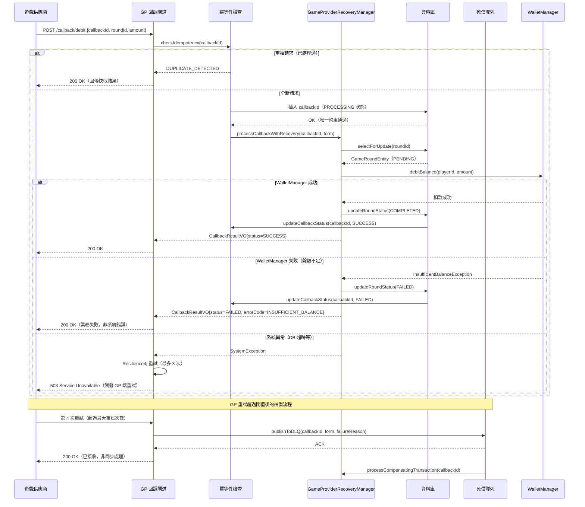

# 遊戲供應商錯誤恢復架構（Game Provider Error Recovery Architecture）

> **XREF（交叉引用）**: 業務需求詳見 [GP 錯誤處理需求](../../requirements/03_Gaming_Operations/05_Game_Provider_Error_Handling.md)
> **目標讀者**: 系統架構師、後端開發人員
> **最後更新**: 2026-04-02

---

## 1. 概述

遊戲供應商（GP, Game Provider）回調（Callback）錯誤恢復架構確保每一筆遊戲回合（Game Round）的財務結算在發生網路中斷、GP 系統異常或超時情況下，仍能維持完整性與一致性。

核心設計原則：

- **冪等性三層防線（Idempotency Three-Layer Defense）**: 請求去重（Request Deduplication）→ 資料庫唯一約束（DB Unique Constraint）→ 樂觀鎖（Optimistic Lock），確保同一回調只處理一次
- **MGA Technical Standards Art. 3.2 合規**: 遊戲回合必須有明確的完成（Completed）或撤銷（Rolled Back）狀態，不允許長期停留於中間狀態
- **指數退避重試（Exponential Backoff Retry）**: 使用 Resilience4j 實作智慧重試，避免對 GP 系統造成額外壓力
- **死信隊列（Dead Letter Queue）**: 超過最大重試次數的回調進入 DLQ，由人工或補償機制處理

---

## 2. GP Callback 錯誤恢復流程



---

## 3. 錯誤分類表

| HTTP 狀態碼 | 錯誤類型 | 分類 | 重試策略 | 補償動作 |
|------------|---------|------|---------|---------|
| 200 OK | 業務成功 | 正常 | 不重試 | 無 |
| 200 OK（業務失敗） | 餘額不足、帳戶鎖定 | FatalError | 不重試 | 記錄失敗原因，通知玩家 |
| 400 Bad Request | 請求格式錯誤 | FatalError | 不重試（請求本身有問題） | 記錄錯誤，人工審查 |
| 401 Unauthorized | 簽名驗證失敗 | FatalError | 不重試 | 觸發安全告警 |
| 409 Conflict | 重複 callbackId | Idempotent | 不重試 | 回傳已快取的成功結果 |
| 422 Unprocessable | 業務規則違反 | FatalError | 不重試 | 記錄詳細原因 |
| 429 Too Many Requests | 限流 | RetryableError | 指數退避（60s 起始） | 等待 GP 限流解除 |
| 500 Internal Server Error | 平台系統錯誤 | RetryableError | 指數退避（1s/2s/4s） | 超過 3 次 → DLQ |
| 503 Service Unavailable | 服務不可用 | RetryableError | 指數退避（1s/2s/4s） | 超過 3 次 → DLQ |
| 網路超時（> 5s） | 連線超時 | RetryableError | 指數退避（含冪等性保護） | 超過 3 次 → DLQ |

---

## 4. GameProviderRecoveryManager 實作

```java
/**
 * 遊戲供應商回調恢復管理器
 * 實作冪等性三層防線 + Resilience4j 重試 + 補償事務
 * 所有狀態變更操作必須在 Manager 層以 @Transactional 執行
 */
@Component
@RequiredArgsConstructor
public class GameProviderRecoveryManager {

    private final GameRoundDao gameRoundDao;
    private final WalletManager walletManager;
    private final CallbackIdempotencyDao callbackIdempotencyDao;
    private final DlqPublisher dlqPublisher;

    /**
     * 處理 GP 回調（含冪等性檢查 + 補償邏輯）
     *
     * @param callbackId 回調唯一識別碼（由 GP 生成）
     * @param form       回調請求資料
     */
    @Transactional(rollbackFor = Throwable.class)
    public Option<CallbackResultVO> processCallbackWithRecovery(
            String callbackId,
            GameCallbackForm form) {

        // === 第一層：請求去重（Request Deduplication） ===
        Option<CallbackIdempotencyEntity> existingOpt =
            Option.of(callbackIdempotencyDao.findByCallbackId(callbackId));

        if (existingOpt.isDefined()) {
            CallbackIdempotencyEntity existing = existingOpt.get();
            if (existing.getStatus() == CallbackStatus.SUCCESS) {
                // 已成功處理，直接回傳快取結果
                return Option.of(existing.getCachedResult());
            }
            if (existing.getStatus() == CallbackStatus.PROCESSING) {
                // 正在處理中（可能是並發請求），回傳處理中狀態
                return Option.of(CallbackResultVO.processing(callbackId));
            }
        }

        // === 第二層：資料庫唯一約束（DB Unique Constraint） ===
        // 插入冪等性記錄（callbackId 有 UNIQUE 約束，並發重複請求會觸發例外）
        CallbackIdempotencyEntity idempotencyRecord = new CallbackIdempotencyEntity();
        idempotencyRecord.setCallbackId(callbackId);
        idempotencyRecord.setStatus(CallbackStatus.PROCESSING);
        idempotencyRecord.setRequestPayload(form.toJsonString());
        idempotencyRecord.setCreatedAt(LocalDateTime.now());
        idempotencyRecord.setDeleted(false);
        callbackIdempotencyDao.insert(idempotencyRecord); // 若重複會拋 DuplicateKeyException

        // === 第三層：樂觀鎖（Optimistic Lock） ===
        Option<GameRoundEntity> roundOpt =
            Option.of(gameRoundDao.selectForUpdate(form.getRoundId()));
        if (roundOpt.isEmpty()) {
            callbackIdempotencyDao.updateStatus(callbackId, CallbackStatus.FAILED, "ROUND_NOT_FOUND");
            return Option.none();
        }

        GameRoundEntity round = roundOpt.get();
        if (round.getStatus() == GameRoundStatus.COMPLETED) {
            // 回合已完成（樂觀鎖檢測到重複處理）
            callbackIdempotencyDao.updateStatus(callbackId, CallbackStatus.SUCCESS, null);
            return Option.of(CallbackResultVO.alreadyCompleted(callbackId));
        }

        // === 執行業務邏輯 ===
        try {
            CallbackResultVO result = executeCallbackBusiness(form, round);

            // 更新回合狀態為完成（MGA Technical Standards Art. 3.2）
            gameRoundDao.updateStatus(round.getRoundId(), GameRoundStatus.COMPLETED);

            // 記錄冪等性成功結果（供後續重複請求使用）
            callbackIdempotencyDao.updateStatusWithResult(callbackId, CallbackStatus.SUCCESS, result);

            return Option.of(result);

        } catch (InsufficientBalanceException e) {
            // 業務失敗（非系統錯誤），標記為已處理
            gameRoundDao.updateStatus(round.getRoundId(), GameRoundStatus.FAILED);
            callbackIdempotencyDao.updateStatus(callbackId, CallbackStatus.FAILED, e.getMessage());
            return Option.of(CallbackResultVO.businessFailed(callbackId, "INSUFFICIENT_BALANCE"));
        }
    }

    /**
     * 補償事務（Compensating Transaction）
     * 當 DLQ 消費者觸發補償時執行，確保遊戲回合最終一致性
     */
    @Transactional(rollbackFor = Throwable.class)
    public Option<CompensationResultVO> processCompensatingTransaction(String callbackId) {
        Option<CallbackIdempotencyEntity> recordOpt =
            Option.of(callbackIdempotencyDao.findByCallbackId(callbackId));
        if (recordOpt.isEmpty()) {
            return Option.none();
        }

        CallbackIdempotencyEntity record = recordOpt.get();
        GameCallbackForm originalForm = GameCallbackForm.fromJson(record.getRequestPayload());

        // 查詢回合當前狀態，決定補償策略
        Option<GameRoundEntity> roundOpt =
            Option.of(gameRoundDao.selectById(originalForm.getRoundId()));
        if (roundOpt.isEmpty()) {
            return Option.none();
        }

        GameRoundEntity round = roundOpt.get();
        if (round.getStatus() == GameRoundStatus.PENDING) {
            // 回合仍在 PENDING → 標記為 ROLLED_BACK（符合 MGA Art. 3.2）
            gameRoundDao.updateStatus(round.getRoundId(), GameRoundStatus.ROLLED_BACK);
            walletManager.rollbackGameRound(round.getPlayerId(), round.getRoundId());
            callbackIdempotencyDao.updateStatus(callbackId, CallbackStatus.COMPENSATED, "ROLLBACK_APPLIED");
        }

        CompensationResultVO result = new CompensationResultVO();
        result.setCallbackId(callbackId);
        result.setRoundId(originalForm.getRoundId());
        result.setCompensationType(CompensationType.ROLLBACK);
        result.setCompensatedAt(LocalDateTime.now());
        return Option.of(result);
    }

    private CallbackResultVO executeCallbackBusiness(GameCallbackForm form, GameRoundEntity round) {
        return switch (form.getCallbackType()) {
            case DEBIT -> {
                walletManager.debitBalance(round.getPlayerId(), form.getAmount(), round.getRoundId());
                yield CallbackResultVO.success(form.getCallbackId(), form.getAmount());
            }
            case CREDIT -> {
                walletManager.creditBalance(round.getPlayerId(), form.getAmount(), round.getRoundId());
                yield CallbackResultVO.success(form.getCallbackId(), form.getAmount());
            }
            case ROLLBACK -> {
                walletManager.rollbackGameRound(round.getPlayerId(), round.getRoundId());
                yield CallbackResultVO.success(form.getCallbackId(), BigDecimal.ZERO);
            }
        };
    }
}
```

---

## 5. Resilience4j 重試配置

```yaml
# application.yml - Resilience4j GP 回調重試配置
resilience4j:
  retry:
    instances:
      gp-callback:
        max-attempts: 3
        wait-duration: 1s
        enable-exponential-backoff: true
        exponential-backoff-multiplier: 2.0    # 1s → 2s → 4s
        retry-exceptions:
          - java.net.SocketTimeoutException
          - org.springframework.dao.TransientDataAccessException
        ignore-exceptions:
          - net.lab1024.sa.igaming.exception.InsufficientBalanceException
          - net.lab1024.sa.igaming.exception.DuplicateCallbackException
  circuitbreaker:
    instances:
      gp-callback:
        sliding-window-size: 10
        failure-rate-threshold: 50            # 10 次中 5 次失敗則開啟熔斷
        wait-duration-in-open-state: 30s
        permitted-calls-in-half-open-state: 3
```

---

## 6. 冪等性資料表設計

```sql
-- GP 回調冪等性記錄表
CREATE TABLE t_callback_idempotency (
    callback_id         VARCHAR(128)    NOT NULL,
    status              SMALLINT        NOT NULL DEFAULT 0,  -- 0=PROCESSING, 1=SUCCESS, 2=FAILED, 3=COMPENSATED
    request_payload     TEXT,
    cached_result       TEXT,
    failure_reason      VARCHAR(512),
    created_at          TIMESTAMP WITH TIME ZONE NOT NULL DEFAULT NOW(),
    updated_at          TIMESTAMP WITH TIME ZONE NOT NULL DEFAULT NOW(),
    deleted             SMALLINT        NOT NULL DEFAULT 0,
    CONSTRAINT pk_callback_idempotency PRIMARY KEY (callback_id)
);

COMMENT ON TABLE t_callback_idempotency IS 'GP 回調冪等性記錄';
COMMENT ON COLUMN t_callback_idempotency.callback_id IS '回調唯一識別碼（由 GP 生成）';
COMMENT ON COLUMN t_callback_idempotency.status IS '處理狀態：0=處理中, 1=成功, 2=失敗, 3=已補償';
COMMENT ON COLUMN t_callback_idempotency.cached_result IS '成功結果快取（JSON），供重複請求使用';

CREATE INDEX idx_callback_idempotency_created_at ON t_callback_idempotency (created_at);
```

---

## 7. 合規要求對應

| 法規 | 條款 | 要求 | 系統實作 |
|------|------|------|---------|
| MGA Technical Standards | Art. 3.2 | 遊戲回合必須有確定的完成或撤銷狀態 | `GameRoundStatus.COMPLETED / ROLLED_BACK` 強制終態 |
| MGA Technical Standards | Art. 3.2 | 回合結算記錄不可篡改 | 樂觀鎖 + 審計日誌防止重複結算 |
| MGA Technical Standards | Art. 5.1 | 系統可用性 99.9% | Resilience4j 熔斷器 + DLQ 保障最終一致性 |
| UKGC LCCP | Condition 8.1 | 遊戲交易完整性 | 三層冪等性防線確保不重複記帳 |
| UKGC LCCP | Condition 8.2 | 異常交易處理流程 | 補償事務 + DLQ 人工審查機制 |
| PCI DSS 4.0 | Req 10.2 | 記錄所有財務相關操作事件 | `CallbackIdempotencyDao` 完整請求日誌 |

---

## 8. 相關文件 XREF

- **業務需求**: [GP 錯誤處理需求](../../requirements/03_Gaming_Operations/05_Game_Provider_Error_Handling.md)
- **遊戲整合協議**: [Game Integration Protocols](01_Game_Integration_Protocols.md)
- **遊戲整合實作**: [Game Integration Implementation](02_Game_Integration_Implementation.md)
- **遊戲整合安全**: [Game Integration Security](03_Game_Integration_Security.md)
- **有效投注額計算**: [Turnover 計算邏輯](04_Turnover_Calculation_Logic.md)
- **無縫錢包技術**: [Finance Service - Seamless Wallet Technical](../02_Finance_Service/03_Seamless_Wallet_Technical.md)
