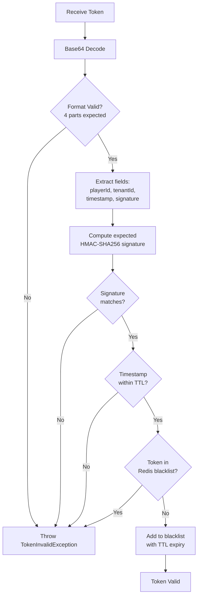
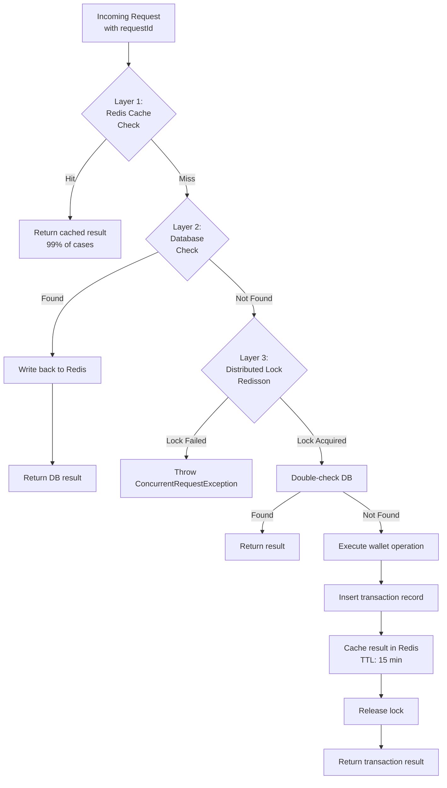
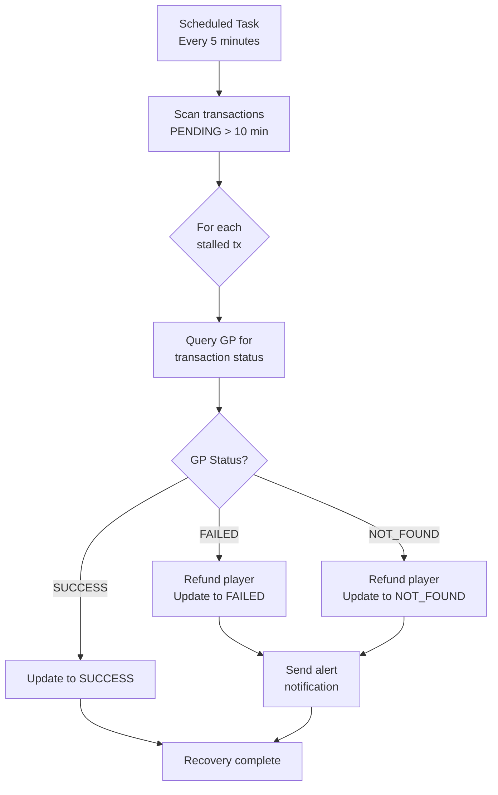

# Game Integration Implementation

> **Canonical Source**: [source-archive/00_Foundation/guides/00-12_Game_Integration_Implementation.md](../../source-archive/00_Foundation/guides/00-12_Game_Integration_Implementation.md)
> **Audience**: Architects, Backend Developers
> **Business Requirements**: [Game Integration Requirements](../../requirements/03_Gaming_Operations/Game_Integration_Requirements.md)
> **Last Synced**: 2026-02-08

---

## 1. Overview

This document covers the technical implementation details for integrating Game Providers (GPs) into the iGaming platform, including the Seamless Wallet API, token verification, idempotency handling, concurrency control, and error recovery mechanisms.

**Implementation Scope** (Section 5 of the source is fully implemented; Sections 6-7 are planned):

| Task | Status | Description |
|------|--------|-------------|
| GP Onboarding via Seamless Wallet | Complete | Full implementation with code examples |
| Seamless Wallet API Advanced | Planned | Phase 5+ |
| Turnover Calculation Logic | Planned | Phase 5+ |

---

## 2. Seamless Wallet API Controller

The Seamless Wallet API exposes four standard endpoints for GP interaction. All endpoints follow the SmartAdmin `ResponseDTO` pattern.

```java
/**
 * Seamless Wallet API Controller
 *
 * Standard endpoints:
 * 1. /api/game/debit  - Bet deduction
 * 2. /api/game/credit - Win payout
 * 3. /api/game/cancel - Transaction cancellation
 * 4. /api/game/balance - Balance inquiry
 */
@RestController
@RequestMapping("/api/game")
@RequiredArgsConstructor
public class SeamlessWalletController {

    private final SeamlessWalletService seamlessWalletService;
    private final TokenVerificationService tokenVerificationService;

    /**
     * Bet deduction
     */
    @PostMapping("/debit")
    public ResponseDTO<DebitResponse> debit(@RequestBody @Valid DebitRequest request) {
        // 1. Verify Token
        tokenVerificationService.verifyToken(request.getToken());

        // 2. Execute bet deduction
        DebitResponse response = seamlessWalletService.debit(request);

        return ResponseDTO.ok(response);
    }

    /**
     * Win payout
     */
    @PostMapping("/credit")
    public ResponseDTO<CreditResponse> credit(@RequestBody @Valid CreditRequest request) {
        tokenVerificationService.verifyToken(request.getToken());
        CreditResponse response = seamlessWalletService.credit(request);
        return ResponseDTO.ok(response);
    }

    /**
     * Transaction cancellation
     */
    @PostMapping("/cancel")
    public ResponseDTO<CancelResponse> cancel(@RequestBody @Valid CancelRequest request) {
        tokenVerificationService.verifyToken(request.getToken());
        CancelResponse response = seamlessWalletService.cancel(request);
        return ResponseDTO.ok(response);
    }

    /**
     * Balance inquiry
     */
    @PostMapping("/balance")
    public ResponseDTO<BalanceResponse> getBalance(@RequestBody @Valid BalanceRequest request) {
        tokenVerificationService.verifyToken(request.getToken());
        BalanceResponse response = seamlessWalletService.getBalance(request);
        return ResponseDTO.ok(response);
    }
}
```

---

## 3. Token Verification Service

### 3.1 Token Structure

```text
Token = Base64( player_id | tenant_id | timestamp | signature )
Signature = HMAC-SHA256( player_id + "|" + tenant_id + "|" + timestamp, secret_key )
```

### 3.2 Verification Flow



### 3.3 Implementation

```java
/**
 * Token Verification Service
 *
 * Token structure: player_id|tenant_id|timestamp|signature
 * Signature: HMAC-SHA256(player_id + tenant_id + timestamp, secret_key)
 */
@Service
@RequiredArgsConstructor
public class TokenVerificationService {

    @Value("${game.api.secret-key}")
    private String secretKey;

    @Value("${game.api.token-ttl:300}") // 5 minutes
    private int tokenTtl;

    private final RedisTemplate<String, String> redisTemplate;

    /**
     * Generate token for a player session.
     */
    public String generateToken(Long playerId, String tenantId) {
        long timestamp = System.currentTimeMillis() / 1000;
        String data = playerId + "|" + tenantId + "|" + timestamp;

        // HMAC-SHA256 signature
        String signature = HmacUtils.hmacSha256Hex(secretKey, data);

        // Assemble token
        String token = data + "|" + signature;

        // Base64 encode
        return Base64.getEncoder().encodeToString(token.getBytes());
    }

    /**
     * Verify token validity.
     *
     * Checks: format, signature, expiry, replay protection (Redis blacklist)
     */
    public void verifyToken(String token) {
        try {
            // 1. Base64 decode
            String decoded = new String(Base64.getDecoder().decode(token));

            // 2. Parse token
            String[] parts = decoded.split("\\|");
            if (parts.length != 4) {
                throw new TokenInvalidException("Invalid token format");
            }

            String playerId = parts[0];
            String tenantId = parts[1];
            long timestamp = Long.parseLong(parts[2]);
            String signature = parts[3];

            // 3. Verify signature
            String expectedSignature = HmacUtils.hmacSha256Hex(
                secretKey,
                playerId + "|" + tenantId + "|" + timestamp
            );

            if (!MessageDigest.isEqual(
                    signature.getBytes(), expectedSignature.getBytes())) {
                throw new TokenInvalidException("Invalid token signature");
            }

            // 4. Verify expiry
            long now = System.currentTimeMillis() / 1000;
            if (now - timestamp > tokenTtl) {
                throw new TokenInvalidException("Token expired");
            }

            // 5. Anti-replay (Redis blacklist)
            String blacklistKey = "token:blacklist:" + token;
            if (Boolean.TRUE.equals(redisTemplate.hasKey(blacklistKey))) {
                throw new TokenInvalidException("Token already used");
            }

            // 6. Add to blacklist (TTL = token validity period)
            redisTemplate.opsForValue().set(
                blacklistKey,
                "1",
                tokenTtl,
                TimeUnit.SECONDS
            );

        } catch (IllegalArgumentException e) {
            throw new TokenInvalidException("Token decode failed", e);
        }
    }
}
```

---

## 4. Idempotent Transaction Processing (Three-Layer Defense)

### 4.1 Architecture Overview



### 4.2 Service Implementation

```java
/**
 * Seamless Wallet Service
 *
 * Three-layer idempotency defense:
 * 1. Redis fast check (99% of cases)
 * 2. Database check (Redis miss)
 * 3. Distributed lock (extreme concurrency)
 */
@Service
@RequiredArgsConstructor
public class SeamlessWalletService {

    private final WalletService walletService;
    private final GameTransactionDao gameTransactionDao;
    private final RedisTemplate<String, GameTransactionResult> redisTemplate;
    private final RedissonClient redissonClient;

    /**
     * Debit (bet deduction) with idempotency guarantee.
     */
    public DebitResponse debit(DebitRequest request) {
        String requestId = request.getRequestId();

        // Layer 1: Redis fast check (99% of cases)
        String cacheKey = "game:tx:" + requestId;
        GameTransactionResult cached = redisTemplate.opsForValue().get(cacheKey);

        if (cached != null) {
            log.info("Request {} already processed (cached)", requestId);
            return DebitResponse.fromCachedResult(cached);
        }

        // Layer 2: Database check (Redis miss)
        GameTransaction existing = gameTransactionDao.findByRequestId(requestId);

        if (existing != null) {
            log.info("Request {} already processed (db)", requestId);

            // Write back to Redis
            GameTransactionResult result = GameTransactionResult.from(existing);
            redisTemplate.opsForValue().set(cacheKey, result, 15, TimeUnit.MINUTES);

            return DebitResponse.fromDbRecord(existing);
        }

        // Layer 3: Distributed lock (extreme concurrency)
        String lockKey = "game:lock:" + requestId;
        RLock lock = redissonClient.getLock(lockKey);

        try {
            // Attempt lock (wait 3s, hold 10s)
            boolean locked = lock.tryLock(3, 10, TimeUnit.SECONDS);

            if (!locked) {
                throw new ConcurrentRequestException(
                    "Request in progress, please retry");
            }

            // Double-check after lock acquired
            GameTransaction doubleCheck =
                gameTransactionDao.findByRequestId(requestId);
            if (doubleCheck != null) {
                log.info("Request {} already processed (double check)",
                    requestId);
                return DebitResponse.fromDbRecord(doubleCheck);
            }

            // Execute debit
            walletService.debitWallet(
                request.getPlayerId(),
                request.getAmount(),
                "GAME_BET:" + requestId
            );

            // Record transaction
            GameTransaction transaction = GameTransaction.builder()
                .requestId(requestId)
                .playerId(request.getPlayerId())
                .tenantId(request.getTenantId())
                .transactionType(TransactionType.DEBIT)
                .amount(request.getAmount())
                .gameId(request.getGameId())
                .roundId(request.getRoundId())
                .status(TransactionStatus.SUCCESS)
                .createdAt(LocalDateTime.now())
                .build();

            gameTransactionDao.insert(transaction);

            // Cache result (15 minutes)
            GameTransactionResult result =
                GameTransactionResult.from(transaction);
            redisTemplate.opsForValue().set(
                cacheKey, result, 15, TimeUnit.MINUTES);

            return DebitResponse.fromTransaction(transaction);

        } catch (InterruptedException e) {
            Thread.currentThread().interrupt();
            throw new SystemException("Lock acquisition interrupted", e);

        } finally {
            if (lock.isHeldByCurrentThread()) {
                lock.unlock();
            }
        }
    }

    /**
     * Credit (win payout) with idempotency guarantee.
     * Implementation follows the same three-layer pattern as debit().
     */
    public CreditResponse credit(CreditRequest request) {
        // Same three-layer idempotency pattern as debit()
        // ...
    }

    /**
     * Cancel transaction with idempotency guarantee.
     */
    public CancelResponse cancel(CancelRequest request) {
        String originalRequestId = request.getOriginalRequestId();

        // 1. Query original transaction
        GameTransaction original =
            gameTransactionDao.findByRequestId(originalRequestId);

        if (original == null) {
            throw new TransactionNotFoundException(
                "Original transaction not found: " + originalRequestId);
        }

        if (original.getStatus() == TransactionStatus.CANCELLED) {
            log.info("Transaction {} already cancelled", originalRequestId);
            return CancelResponse.alreadyCancelled();
        }

        // 2. Refund
        walletService.creditWallet(
            original.getPlayerId(),
            original.getAmount(),
            "GAME_CANCEL:" + request.getRequestId()
        );

        // 3. Update original transaction status
        original.setStatus(TransactionStatus.CANCELLED);
        original.setCancelledAt(LocalDateTime.now());
        gameTransactionDao.update(original);

        // 4. Clear cache
        redisTemplate.delete("game:tx:" + originalRequestId);

        return CancelResponse.success();
    }
}
```

---

## 5. Error Recovery Service

### 5.1 Recovery Architecture



### 5.2 Implementation

```java
/**
 * Game Transaction Recovery Service
 *
 * Handles:
 * 1. Network timeout causing stalled transactions
 * 2. System exception causing inconsistent state
 * 3. GP callback failure
 */
@Service
@RequiredArgsConstructor
public class GameTransactionRecoveryService {

    private final GameTransactionDao gameTransactionDao;
    private final WalletService walletService;
    private final GameProviderService gameProviderService;

    /**
     * Scan stalled transactions.
     *
     * Schedule: every 5 minutes
     * Stalled definition: created > 10 minutes ago AND status = PENDING
     */
    @Scheduled(fixedDelay = 300000)
    public void scanPendingTransactions() {
        LocalDateTime threshold = LocalDateTime.now().minusMinutes(10);

        List<GameTransaction> pending =
            gameTransactionDao.findPendingBefore(threshold);

        for (GameTransaction tx : pending) {
            try {
                recoverTransaction(tx);
            } catch (Exception e) {
                log.error("Failed to recover transaction {}",
                    tx.getRequestId(), e);
            }
        }
    }

    /**
     * Recover a single transaction.
     *
     * Strategy:
     * 1. Query GP for authoritative transaction status
     * 2. Adjust system state based on GP result
     * 3. Compensate wallet balance as needed
     */
    private void recoverTransaction(GameTransaction tx) {
        // 1. Query GP
        GameProviderTransactionStatus providerStatus =
            gameProviderService.queryTransactionStatus(tx.getRoundId());

        // 2. Recovery action based on GP status
        switch (providerStatus) {
            case SUCCESS -> {
                // GP success, update system to success
                tx.setStatus(TransactionStatus.SUCCESS);
                gameTransactionDao.update(tx);
                log.info("Transaction {} recovered: SUCCESS",
                    tx.getRequestId());
            }

            case FAILED -> {
                // GP failed, refund player
                if (tx.getTransactionType() == TransactionType.DEBIT) {
                    walletService.creditWallet(
                        tx.getPlayerId(),
                        tx.getAmount(),
                        "RECOVERY:" + tx.getRequestId()
                    );
                }

                tx.setStatus(TransactionStatus.FAILED);
                gameTransactionDao.update(tx);
                log.info("Transaction {} recovered: FAILED",
                    tx.getRequestId());
            }

            case NOT_FOUND -> {
                // GP has no record, treat as failed
                if (tx.getTransactionType() == TransactionType.DEBIT) {
                    walletService.creditWallet(
                        tx.getPlayerId(),
                        tx.getAmount(),
                        "RECOVERY:" + tx.getRequestId()
                    );
                }

                tx.setStatus(TransactionStatus.NOT_FOUND);
                gameTransactionDao.update(tx);
                log.warn("Transaction {} not found in provider",
                    tx.getRequestId());
            }
        }

        // 3. Send alert for abnormal states
        if (tx.getStatus() == TransactionStatus.FAILED ||
            tx.getStatus() == TransactionStatus.NOT_FOUND) {
            alertService.sendTransactionRecoveryAlert(tx);
        }
    }
}
```

---

## 6. Planned: Seamless Wallet API (Phase 5+)

**Status**: PLANNED

**Reading Order for Implementation**:

| Order | Document | Section | Estimated Time | Key Content |
|-------|----------|---------|---------------|-------------|
| 1 | Seamless Wallet Analysis | API Design | 15 min | Token verification, idempotency |
| 2 | Seamless Wallet Analysis | Concurrency Control | 10 min | Redis distributed lock |
| 3 | Wallet Architecture | Error Recovery | 12 min | Saga pattern |

---

## 7. Planned: Turnover Calculation Logic (Phase 5+)

**Status**: PLANNED

**Reading Order for Implementation**:

| Order | Document | Section | Estimated Time | Key Content |
|-------|----------|---------|---------------|-------------|
| 1 | Turnover Calculation | Three-Layer Validation | 20 min | Layer 1/2/3 architecture |
| 2 | Turnover Calculation | Game Weights | 10 min | Free spin handling |
| 3 | Activity System | Wagering Requirements | 15 min | Wagering calculation |

**Key Implementation Concerns**:
- Free spins are typically excluded from turnover calculation
- Sports betting and slot game weights differ significantly
- Cross-module consistency: wallet, activity, and reconciliation must use the same algorithm

---

## Related Documents

- [Game Integration Requirements](../../requirements/03_Gaming_Operations/Game_Integration_Requirements.md) - Business requirements
- [Turnover Calculation Logic](./Turnover_Calculation_Logic.md) - Turnover technical design
- [Wallet Architecture](../02_Finance_Service/Wallet_Architecture.md) - Wallet system design

---

**Document Version**: 4.0.0
**Last Updated**: 2026-02-08
**Maintainers**: Game Integration Team & Backend Team
