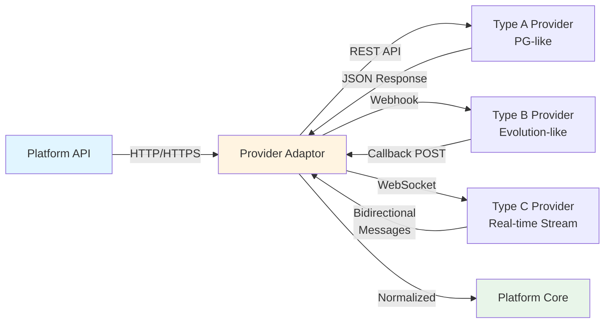

# Game Integration Protocols

> **Canonical Source**: [03-01_Game_Integration_Standard.md](../../source-archive/03_Game_Center/03-01_Game_Integration_Standard.md)
> **Audience**: Architects, Backend Engineers, Integration Engineers
> **Business Requirements**: [Game Integration Standards](../../requirements/03_Gaming_Operations/Game_Integration_Standards.md)
> **Last Synced**: 2026-02-09
>
> **Technical Focus**: This document contains implementation details (HMAC-SHA256 algorithms, TLS configuration, Provider Type A/B/C classifications, HTTP status codes) extracted from Requirements layer.

---

## 1. Integration Architecture Overview

The platform integrates with external Game Providers (GP) using a **Seamless Wallet (Single Wallet)** architecture via RESTful APIs with JSON payloads.

### 1.1 Communication Protocol

| Layer | Specification |
|-------|---------------|
| Transport | HTTPS (TLS 1.2+) mandatory |
| Authentication | HMAC-SHA256 signature verification |
| Network Security | IP whitelist enforcement |
| Data Format | JSON request/response bodies |
| Idempotency | Transaction ID-based deduplication |

### 1.2 Protocol Message Flow

The platform supports three communication patterns for Game Provider integration:



**Communication Patterns**:
- **HTTP/REST**: Type A providers (polling, request-response)
- **Webhook**: Type B providers (callback-based, async)
- **WebSocket**: Type C providers (persistent connection, real-time)

---

## 2. Core API Specifications

The platform exposes the following APIs for GP consumption:

### 2.1 GetBalance

Queries the player's current wallet balance. Called by the GP before/after transactions.

### 2.2 Transaction (Bet/Win)

Processes wagers and payouts with the following guarantees:

- **Atomicity**: Bet and Win must be processed within a single transaction (for providers that require it), or support rollback
- **Idempotency**: Duplicate requests with the same `transaction_id` must return success without re-processing

### 2.3 CheckToken

Validates the player's login token. Used by the GP to verify session validity before launching a game.

### 2.4 Game Launch Flow

```
Frontend                  Backend                  Game Provider
   │                         │                          │
   │─── Request Launch URL ──>│                          │
   │                         │── Get Token & URL ───────>│
   │                         │<── Token + Game URL ──────│
   │<── Launch URL + Token ──│                          │
   │                         │                          │
   │═══ iframe / new window ═══════════════════════════>│
```

**Required Launch Parameters**: `token`, `language`, `currency`, `lobby_url` (return to lobby).

---

## 3. Seamless Wallet Edge Case Matrix

| Scenario | Technical Strategy | Implementation Detail |
|----------|--------------------|-----------------------|
| **API Timeout** (platform debit succeeds, GP response times out) | Pending mechanism | Mark transaction as "Pending", initiate `QueryStatus` to determine final state. **Never** roll back directly. |
| **Rollback / Cancel** (GP cancels due to system error or event cancellation) | Balance check + negative balance tolerance | If player balance >= refund amount, credit directly. If insufficient (already withdrawn), allow **negative balance** and flag for manual recovery. |
| **Race Condition** (concurrent bet requests) | Optimistic locking | Use `version` field or **Redis Lua** script for atomic balance deduction. Prevents balance going negative. |
| **Idempotency** (GP retries same webhook) | Unique key constraint | Use `transaction_id` as deduplication key. If already exists, return `Success` without re-processing. |

---

## 4. Provider Adaptor Layer

A middleware adaptation layer normalizes different GP API styles into a unified platform interface.

### 4.1 Provider Type Mapping

| Provider Type | API Pattern | Adaptation Strategy |
|---------------|-------------|---------------------|
| **Type A** (PG-like) | Single `TransferWallet` endpoint handles both Bet and Win | Direct processing, no state management needed |
| **Type B** (Evolution-like) | Separate `Debit` (Bet) and `Credit` (Win) endpoints | Maintain **Round state** to correlate Debit/Credit pairs |
| **Type C** (Seamless) | Platform exposes `GetBalance` only; all mutations initiated by GP | Implement **webhook receiver** to process GP-initiated transactions |

### 4.2 Data Normalization

```
GP Response                    Adaptor Layer                  Platform Standard
─────────────────────────────────────────────────────────────────────────────
GameType: "video_slot"    ──>  normalize()            ──>   GameType: "SLOT"
GameType: "live_baccarat" ──>  normalize()            ──>   GameType: "LIVE"
GameType: "sportsbook"    ──>  normalize()            ──>   GameType: "SPORT"

Currency: cents (100)     ──>  convertCurrency()      ──>   Currency: USD (1.00)
Currency: VND (23000)     ──>  convertCurrency()      ──>   Currency: USD (1.00)
```

All GP `GameType` values are mapped to platform standard categories: `LIVE`, `SLOT`, `SPORT`.
All currency units are normalized (e.g., GP uses cents -> platform converts to base currency).

### 4.3 Protocol Persistence Layer

The platform persists provider protocol configurations and message logs for debugging and audit purposes.

#### 4.3.1 Provider Protocol Configuration

```sql
CREATE TABLE game_provider_protocols (
    protocol_id BIGSERIAL PRIMARY KEY,
    provider_code VARCHAR(50) NOT NULL UNIQUE,
    provider_name VARCHAR(100) NOT NULL,
    provider_type CHAR(1) NOT NULL CHECK (provider_type IN ('A', 'B', 'C')),
    api_endpoint VARCHAR(255) NOT NULL,
    communication_method VARCHAR(20) NOT NULL CHECK (communication_method IN ('HTTP', 'HTTPS', 'WEBHOOK', 'WEBSOCKET')),
    auth_method VARCHAR(50) NOT NULL DEFAULT 'HMAC-SHA256',
    ip_whitelist TEXT[], -- Array of whitelisted IP addresses
    tls_version VARCHAR(10) NOT NULL DEFAULT 'TLS 1.2',
    timeout_seconds INT NOT NULL DEFAULT 30,
    retry_policy JSONB NOT NULL DEFAULT '{"max_retries": 3, "backoff_multiplier": 2}',
    is_active BOOLEAN NOT NULL DEFAULT true,
    created_at TIMESTAMP NOT NULL DEFAULT CURRENT_TIMESTAMP,
    updated_at TIMESTAMP NOT NULL DEFAULT CURRENT_TIMESTAMP,
    created_by VARCHAR(50) NOT NULL,
    updated_by VARCHAR(50) NOT NULL
);

CREATE INDEX idx_game_provider_protocols_provider_code ON game_provider_protocols(provider_code);
CREATE INDEX idx_game_provider_protocols_provider_type ON game_provider_protocols(provider_type);
CREATE INDEX idx_game_provider_protocols_is_active ON game_provider_protocols(is_active);

COMMENT ON TABLE game_provider_protocols IS 'Game provider integration protocol configurations (Type A/B/C mapping, communication method, auth settings)';
COMMENT ON COLUMN game_provider_protocols.provider_type IS 'A=PG-like single endpoint, B=Evolution-like Debit/Credit, C=Seamless webhook';
COMMENT ON COLUMN game_provider_protocols.retry_policy IS 'JSON configuration for retry behavior (max_retries, backoff_multiplier, timeout)';
```

#### 4.3.2 Protocol Message Logs

```sql
CREATE TABLE protocol_message_logs (
    log_id BIGSERIAL PRIMARY KEY,
    protocol_id BIGINT NOT NULL REFERENCES game_provider_protocols(protocol_id),
    transaction_id VARCHAR(100), -- Nullable for non-transactional messages (e.g., CheckToken)
    message_type VARCHAR(50) NOT NULL, -- GetBalance, Transaction, CheckToken, Callback, etc.
    direction VARCHAR(10) NOT NULL CHECK (direction IN ('REQUEST', 'RESPONSE', 'CALLBACK')),
    http_method VARCHAR(10), -- GET, POST, etc. (nullable for WebSocket)
    http_status_code INT, -- HTTP response code (nullable for WebSocket)
    request_payload TEXT NOT NULL,
    response_payload TEXT,
    processing_time_ms INT,
    error_code VARCHAR(50),
    error_message TEXT,
    client_ip VARCHAR(45), -- IPv4 or IPv6
    created_at TIMESTAMP NOT NULL DEFAULT CURRENT_TIMESTAMP
);

CREATE INDEX idx_protocol_message_logs_protocol_id ON protocol_message_logs(protocol_id);
CREATE INDEX idx_protocol_message_logs_transaction_id ON protocol_message_logs(transaction_id);
CREATE INDEX idx_protocol_message_logs_message_type ON protocol_message_logs(message_type);
CREATE INDEX idx_protocol_message_logs_created_at ON protocol_message_logs(created_at DESC);
CREATE INDEX idx_protocol_message_logs_error_code ON protocol_message_logs(error_code) WHERE error_code IS NOT NULL;

COMMENT ON TABLE protocol_message_logs IS 'Complete audit trail of all Game Provider API interactions (request/response/callback messages)';
COMMENT ON COLUMN protocol_message_logs.direction IS 'REQUEST=platform→GP, RESPONSE=GP→platform, CALLBACK=GP→platform (webhook/WebSocket)';
COMMENT ON COLUMN protocol_message_logs.processing_time_ms IS 'API call duration in milliseconds (for performance monitoring)';
```

**Usage Example**:
```sql
-- Query all failed messages for a specific provider in the last hour
SELECT
    pml.transaction_id,
    pml.message_type,
    pml.http_status_code,
    pml.error_message,
    pml.processing_time_ms,
    pml.created_at
FROM protocol_message_logs pml
JOIN game_provider_protocols gpp ON pml.protocol_id = gpp.protocol_id
WHERE gpp.provider_code = 'PGSoft'
  AND pml.error_code IS NOT NULL
  AND pml.created_at > NOW() - INTERVAL '1 hour'
ORDER BY pml.created_at DESC;
```

---

## 5. Jackpot Transaction Handling

### 5.1 Win Type Discrimination

The Transaction API must distinguish win types to route funding correctly:

```json
{
  "transaction_id": "tx_123",
  "type": "WIN",
  "amount": 1000000.00,
  "is_jackpot": true,
  "jackpot_type": "NETWORK",
  "currency": "USD"
}
```

| Field | Type | Description |
|-------|------|-------------|
| `transaction_id` | String | Unique transaction identifier |
| `type` | Enum | `BET`, `WIN`, `ROLLBACK` |
| `amount` | Decimal | Transaction amount in base currency |
| `is_jackpot` | Boolean | Whether this is a jackpot win |
| `jackpot_type` | Enum | `NETWORK` (GP-funded) or `LOCAL` (merchant-funded) |
| `currency` | String | ISO 4217 currency code |

### 5.2 Processing Flow

```
GP sends WIN with is_jackpot=true
        │
        ▼
┌─────────────────────────┐
│ 1. Identify Jackpot Win │
│    (is_jackpot == true)  │
└──────────┬──────────────┘
           │
           ▼
┌─────────────────────────────────┐
│ 2. Freeze in Jackpot Wallet     │
│    (NOT credited to Cash Wallet) │
└──────────┬──────────────────────┘
           │
           ▼
┌─────────────────────────────────┐
│ 3. Alert Risk Control & Finance │
│    (automated notification)      │
└──────────┬──────────────────────┘
           │
           ▼
┌─────────────────────────────────────┐
│ 4. Await GP Jackpot Verification    │
│    Report                           │
└──────────┬──────────────────────────┘
           │
           ▼
┌─────────────────────────────────────┐
│ 5. Confirm GP fund transfer         │
│    to platform                      │
└──────────┬──────────────────────────┘
           │
           ▼
┌─────────────────────────────────────┐
│ 6. Unfreeze → Credit player balance │
└─────────────────────────────────────┘
```

---

## 6. RTP Circuit Breaker Implementation

### 6.1 Monitoring Architecture

The system monitors each `provider` + `game_id` combination using a **5-minute sliding window**:

| Metric | Formula |
|--------|---------|
| Total Bet | SUM(bet_amount) within window |
| Total Win | SUM(win_amount) within window |
| RTP | (Total Win / Total Bet) x 100% |
| Net Loss | Total Win - Total Bet |

### 6.2 Threshold Configuration

| Level | Condition (5-min window) | Automated Action | Recovery |
|-------|--------------------------|-------------------|----------|
| **Warning** | RTP > 120% AND Net Loss > $5,000 | Alert to Slack/Telegram risk group | Automatic (if next period normalizes) |
| **Critical** | RTP > 200% AND Net Loss > $10,000 | Auto-disable game/GP (HTTP 503) | Manual: CTO/Risk Director unlock |

### 6.3 Circuit Breaker Alert Payload

When the circuit breaker triggers, the system sends the following JSON to Slack/Telegram:

```json
{
  "alert_level": "CRITICAL",
  "event": "CIRCUIT_BREAKER_TRIGGERED",
  "data": {
    "provider": "PGSoft",
    "game_id": "mahjong-ways-2",
    "window_minutes": 5,
    "total_bet": 15000.00,
    "total_win": 45000.00,
    "rtp": 300.0,
    "net_loss": 30000.00
  },
  "action_taken": "AUTO_DISABLE_GAME",
  "timestamp": "2026-01-27T12:00:00Z"
}
```

### 6.4 Player Impact Handling

**Players currently in-game**:
- Next Spin/Bet request returns `HTTP 503 Service Unavailable`
- Frontend displays: "Game under temporary maintenance (Error: G-503)"
- Balance automatically syncs back to main wallet

**Players in the lobby**:
- Game icon greyed out with "Maintenance" label
- Click opens maintenance announcement

### 6.5 Manual Recovery Sequence

```
Circuit Breaker Triggered
        │
        ▼
┌──────────────────────────────┐
│ 1. Risk team analyzes game   │
│    logs (bug vs. player luck) │
└──────────┬───────────────────┘
           │
     ┌─────┴─────┐
     │            │
     ▼            ▼
 [False         [Confirmed
  Positive]      Bug]
     │            │
     ▼            ▼
 Admin:        Maintain
 "Reset &      block until
  Resume"      GP patch
```

---

## 7. Dynamic Configuration

### 7.1 GP Maintenance Workflow

Emergency provider disconnection follows an approval chain:
1. Operations Engineer initiates "GP Maintenance" request
2. CTO approves
3. System hides all GP entry points platform-wide (immediate effect)

### 7.2 Bet Limit Configuration

- Configure Min/Max bet per currency and per merchant
- Changes require Risk Management department approval
- Stored as dynamic configuration, applied without deployment

---

## Related Documents

### Core Dependencies
- [Wallet Architecture](../../source-archive/02_Finance_Center/02-06_Wallet_Architecture.md) - Game wallet transfer logic
- [Seamless Wallet Analysis](../../source-archive/03_Game_Center/03-03_Seamless_Wallet_Analysis.md) - GP edge case handling details

### Technical References
- [Gateway Architecture](../../source-archive/09_Technical_Infrastructure/09-02-01_Gateway_Core.md) - API security, HMAC signature verification
- [Maintenance Procedures](../../source-archive/09_Technical_Infrastructure/09-05_Maintenance.md) - Game maintenance workflows

### Business Integration
- [Turnover and Reconciliation](../../source-archive/02_Finance_Center/02-04_Turnover_and_Game_Reconciliation_Analysis.md) - Game reconciliation and turnover calculation
- [Game Lobby Management](../../source-archive/03_Game_Center/03-02_Game_Lobby_Management.md) - Game metadata sync and lobby configuration
- [Risk Framework](../../source-archive/05_Risk_Control/05-01_Risk_Framework.md) - Game risk detection and circuit breaker policies

---

**Document Version**: 1.0.0
**Last Updated**: 2026-02-08
**Maintainer**: Integration Team & Backend Team
