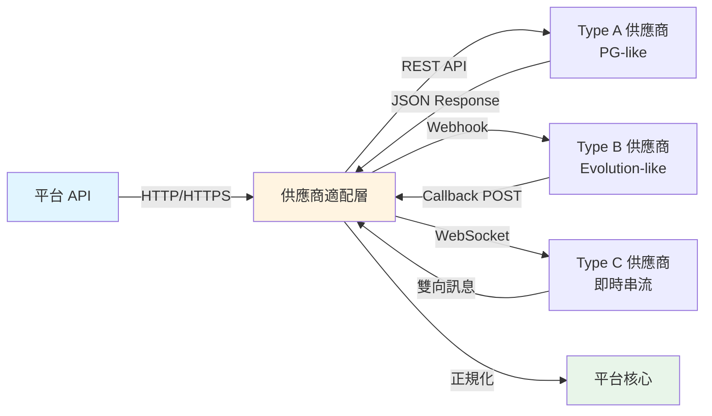

# 遊戲整合協定

> **標準來源**: [03-01_Game_Integration_Standard.md](../../source-archive/03_Game_Center/03-01_Game_Integration_Standard.md)
> **目標讀者**: 架構師、後端工程師、整合工程師
> **業務需求**: [Game Integration Standards](../../requirements/03_Gaming_Operations/Game_Integration_Standards.md)
> **最後同步**: 2026-02-09
>
> **技術焦點**: 本文件包含從需求層萃取的實作細節（HMAC-SHA256 演算法、TLS 設定、供應商類型 A/B/C 分類、HTTP 狀態碼）。

---

## 1. 整合架構概述

平台透過 RESTful API 搭配 JSON 格式，使用**無縫錢包 (Seamless Wallet / Single Wallet)** 架構與外部遊戲供應商 (Game Provider, GP) 整合。

### 1.1 通訊協定

| 層級 | 規格 |
|------|------|
| 傳輸層 | HTTPS (TLS 1.2+) 強制使用 |
| 驗證方式 | HMAC-SHA256 簽章驗證 |
| 網路安全 | IP 白名單機制 |
| 資料格式 | JSON 請求/回應本體 |
| 冪等性 | 基於 Transaction ID 的重複請求過濾 |

### 1.2 協定訊息流程

平台支援三種通訊模式用於遊戲供應商整合：



**通訊模式**：
- **HTTP/REST**：Type A 供應商（輪詢、請求-回應）
- **Webhook**：Type B 供應商（回呼機制、非同步）
- **WebSocket**：Type C 供應商（持久連線、即時）

---

## 2. 核心 API 規格

平台向 GP 提供以下 API：

### 2.1 GetBalance

查詢玩家目前錢包餘額。GP 在交易前後呼叫此 API。

### 2.2 Transaction（投注/派彩）

處理投注與派彩，提供以下保證：

- **原子性 (Atomicity)**：Bet 與 Win 必須在單一交易中處理（對於需要的供應商），或支援回滾
- **冪等性 (Idempotency)**：相同 `transaction_id` 的重複請求必須回傳成功但不重複處理

### 2.3 CheckToken

驗證玩家登入 Token。GP 在啟動遊戲前使用此 API 驗證會話有效性。

### 2.4 遊戲啟動流程

```
Frontend                  Backend                  Game Provider
   │                         │                          │
   │─── Request Launch URL ──>│                          │
   │                         │── Get Token & URL ───────>│
   │                         │<── Token + Game URL ──────│
   │<── Launch URL + Token ──│                          │
   │                         │                          │
   │═══ iframe / new window ═══════════════════════════>│
```

**必要啟動參數**：`token`、`language`、`currency`、`lobby_url`（返回大廳連結）。

---

## 3. 無縫錢包邊界情境矩陣

| 情境 | 技術策略 | 實作細節 |
|------|----------|----------|
| **API 逾時**（平台扣款成功，GP 回應逾時） | Pending 機制 | 將交易標記為「Pending」，啟動 `QueryStatus` 確認最終狀態。**絕不**直接回滾。 |
| **回滾/取消**（GP 因系統錯誤或事件取消而取消） | 餘額檢查 + 負餘額容忍 | 若玩家餘額 >= 退款金額，直接入帳。若不足（已提領），允許**負餘額**並標記人工處理。 |
| **競態條件 (Race Condition)**（並發投注請求） | 樂觀鎖 | 使用 `version` 欄位或 **Redis Lua** 腳本進行原子性餘額扣減。防止餘額變為負數。 |
| **冪等性**（GP 重試相同 Webhook） | 唯一鍵約束 | 使用 `transaction_id` 作為重複過濾鍵。若已存在，回傳 `Success` 但不重新處理。 |

---

## 4. 供應商適配層

中介適配層將不同 GP API 風格正規化為統一的平台介面。

### 4.1 供應商類型對映

| 供應商類型 | API 模式 | 適配策略 |
|------------|----------|----------|
| **Type A**（PG-like） | 單一 `TransferWallet` 端點處理 Bet 與 Win | 直接處理，無需狀態管理 |
| **Type B**（Evolution-like） | 分離的 `Debit`（Bet）與 `Credit`（Win）端點 | 維護 **Round 狀態**以關聯 Debit/Credit 配對 |
| **Type C**（Seamless） | 平台僅公開 `GetBalance`；所有變動由 GP 發起 | 實作 **Webhook 接收器**處理 GP 發起的交易 |

### 4.2 資料正規化

```
GP Response                    Adaptor Layer                  Platform Standard
─────────────────────────────────────────────────────────────────────────────
GameType: "video_slot"    ──>  normalize()            ──>   GameType: "SLOT"
GameType: "live_baccarat" ──>  normalize()            ──>   GameType: "LIVE"
GameType: "sportsbook"    ──>  normalize()            ──>   GameType: "SPORT"

Currency: cents (100)     ──>  convertCurrency()      ──>   Currency: USD (1.00)
Currency: VND (23000)     ──>  convertCurrency()      ──>   Currency: USD (1.00)
```

所有 GP `GameType` 值對映至平台標準類別：`LIVE`、`SLOT`、`SPORT`。
所有貨幣單位正規化（例如：GP 使用分 -> 平台轉換為基礎貨幣）。

### 4.3 協定持久層

平台保存供應商協定設定與訊息日誌，用於除錯與稽核。

#### 4.3.1 供應商協定設定

```sql
CREATE TABLE game_provider_protocols (
    protocol_id BIGSERIAL PRIMARY KEY,
    provider_code VARCHAR(50) NOT NULL UNIQUE,
    provider_name VARCHAR(100) NOT NULL,
    provider_type CHAR(1) NOT NULL CHECK (provider_type IN ('A', 'B', 'C')),
    api_endpoint VARCHAR(255) NOT NULL,
    communication_method VARCHAR(20) NOT NULL CHECK (communication_method IN ('HTTP', 'HTTPS', 'WEBHOOK', 'WEBSOCKET')),
    auth_method VARCHAR(50) NOT NULL DEFAULT 'HMAC-SHA256',
    ip_whitelist TEXT[], -- Array of whitelisted IP addresses
    tls_version VARCHAR(10) NOT NULL DEFAULT 'TLS 1.2',
    timeout_seconds INT NOT NULL DEFAULT 30,
    retry_policy JSONB NOT NULL DEFAULT '{"max_retries": 3, "backoff_multiplier": 2}',
    is_active BOOLEAN NOT NULL DEFAULT true,
    created_at TIMESTAMP NOT NULL DEFAULT CURRENT_TIMESTAMP,
    updated_at TIMESTAMP NOT NULL DEFAULT CURRENT_TIMESTAMP,
    created_by VARCHAR(50) NOT NULL,
    updated_by VARCHAR(50) NOT NULL
);

CREATE INDEX idx_game_provider_protocols_provider_code ON game_provider_protocols(provider_code);
CREATE INDEX idx_game_provider_protocols_provider_type ON game_provider_protocols(provider_type);
CREATE INDEX idx_game_provider_protocols_is_active ON game_provider_protocols(is_active);

COMMENT ON TABLE game_provider_protocols IS '遊戲供應商整合協定設定（Type A/B/C 對映、通訊方式、驗證設定）';
COMMENT ON COLUMN game_provider_protocols.provider_type IS 'A=PG-like 單一端點, B=Evolution-like Debit/Credit, C=Seamless Webhook';
COMMENT ON COLUMN game_provider_protocols.retry_policy IS '重試行為的 JSON 設定（max_retries、backoff_multiplier、timeout）';
```

#### 4.3.2 協定訊息日誌

```sql
CREATE TABLE protocol_message_logs (
    log_id BIGSERIAL PRIMARY KEY,
    protocol_id BIGINT NOT NULL REFERENCES game_provider_protocols(protocol_id),
    transaction_id VARCHAR(100), -- Nullable for non-transactional messages (e.g., CheckToken)
    message_type VARCHAR(50) NOT NULL, -- GetBalance, Transaction, CheckToken, Callback, etc.
    direction VARCHAR(10) NOT NULL CHECK (direction IN ('REQUEST', 'RESPONSE', 'CALLBACK')),
    http_method VARCHAR(10), -- GET, POST, etc. (nullable for WebSocket)
    http_status_code INT, -- HTTP response code (nullable for WebSocket)
    request_payload TEXT NOT NULL,
    response_payload TEXT,
    processing_time_ms INT,
    error_code VARCHAR(50),
    error_message TEXT,
    client_ip VARCHAR(45), -- IPv4 or IPv6
    created_at TIMESTAMP NOT NULL DEFAULT CURRENT_TIMESTAMP
);

CREATE INDEX idx_protocol_message_logs_protocol_id ON protocol_message_logs(protocol_id);
CREATE INDEX idx_protocol_message_logs_transaction_id ON protocol_message_logs(transaction_id);
CREATE INDEX idx_protocol_message_logs_message_type ON protocol_message_logs(message_type);
CREATE INDEX idx_protocol_message_logs_created_at ON protocol_message_logs(created_at DESC);
CREATE INDEX idx_protocol_message_logs_error_code ON protocol_message_logs(error_code) WHERE error_code IS NOT NULL;

COMMENT ON TABLE protocol_message_logs IS '遊戲供應商 API 互動的完整稽核軌跡（請求/回應/回呼訊息）';
COMMENT ON COLUMN protocol_message_logs.direction IS 'REQUEST=平台→GP, RESPONSE=GP→平台, CALLBACK=GP→平台 (Webhook/WebSocket)';
COMMENT ON COLUMN protocol_message_logs.processing_time_ms IS 'API 呼叫持續時間（毫秒）用於效能監控';
```

**使用範例**：
```sql
-- 查詢特定供應商在過去一小時內的所有失敗訊息
SELECT
    pml.transaction_id,
    pml.message_type,
    pml.http_status_code,
    pml.error_message,
    pml.processing_time_ms,
    pml.created_at
FROM protocol_message_logs pml
JOIN game_provider_protocols gpp ON pml.protocol_id = gpp.protocol_id
WHERE gpp.provider_code = 'PGSoft'
  AND pml.error_code IS NOT NULL
  AND pml.created_at > NOW() - INTERVAL '1 hour'
ORDER BY pml.created_at DESC;
```

---

## 5. 彩金交易處理

### 5.1 獎金類型辨識

Transaction API 必須區分獎金類型以正確路由資金：

```json
{
  "transaction_id": "tx_123",
  "type": "WIN",
  "amount": 1000000.00,
  "is_jackpot": true,
  "jackpot_type": "NETWORK",
  "currency": "USD"
}
```

| 欄位 | 類型 | 說明 |
|------|------|------|
| `transaction_id` | String | 唯一交易識別碼 |
| `type` | Enum | `BET`、`WIN`、`ROLLBACK` |
| `amount` | Decimal | 以基礎貨幣計價的交易金額 |
| `is_jackpot` | Boolean | 是否為彩金獎 |
| `jackpot_type` | Enum | `NETWORK`（GP 資金）或 `LOCAL`（商戶資金） |
| `currency` | String | ISO 4217 貨幣代碼 |

### 5.2 處理流程

```
GP 發送 WIN 且 is_jackpot=true
        │
        ▼
┌─────────────────────────┐
│ 1. 識別彩金獎           │
│    (is_jackpot == true)  │
└──────────┬──────────────┘
           │
           ▼
┌─────────────────────────────────┐
│ 2. 凍結至彩金錢包               │
│    （不入帳至現金錢包）          │
└──────────┬──────────────────────┘
           │
           ▼
┌─────────────────────────────────┐
│ 3. 警示風控與財務團隊           │
│    （自動化通知）               │
└──────────┬──────────────────────┘
           │
           ▼
┌─────────────────────────────────────┐
│ 4. 等待 GP 彩金驗證報告             │
└──────────┬──────────────────────────┘
           │
           ▼
┌─────────────────────────────────────┐
│ 5. 確認 GP 資金轉入平台             │
└──────────┬──────────────────────────┘
           │
           ▼
┌─────────────────────────────────────┐
│ 6. 解凍 → 入帳玩家餘額              │
└─────────────────────────────────────┘
```

---

## 6. RTP 熔斷器實作

### 6.1 監控架構

系統使用 **5 分鐘滑動視窗**監控每個 `provider` + `game_id` 組合：

| 指標 | 公式 |
|------|------|
| 總投注額 | SUM(bet_amount) within window |
| 總派彩額 | SUM(win_amount) within window |
| RTP | (總派彩額 / 總投注額) x 100% |
| 淨虧損 | 總派彩額 - 總投注額 |

### 6.2 閾值設定

| 等級 | 條件（5 分鐘視窗） | 自動化動作 | 恢復方式 |
|------|-------------------|-----------|----------|
| **警告** | RTP > 120% 且淨虧損 > $5,000 | 警示至 Slack/Telegram 風控群組 | 自動（若下一期間正常化） |
| **嚴重** | RTP > 200% 且淨虧損 > $10,000 | 自動停用遊戲/GP（HTTP 503） | 人工：CTO/風控總監解鎖 |

### 6.3 熔斷器警示 Payload

當熔斷器觸發時，系統發送以下 JSON 至 Slack/Telegram：

```json
{
  "alert_level": "CRITICAL",
  "event": "CIRCUIT_BREAKER_TRIGGERED",
  "data": {
    "provider": "PGSoft",
    "game_id": "mahjong-ways-2",
    "window_minutes": 5,
    "total_bet": 15000.00,
    "total_win": 45000.00,
    "rtp": 300.0,
    "net_loss": 30000.00
  },
  "action_taken": "AUTO_DISABLE_GAME",
  "timestamp": "2026-01-27T12:00:00Z"
}
```

### 6.4 玩家影響處理

**遊戲中的玩家**：
- 下一次 Spin/Bet 請求回傳 `HTTP 503 Service Unavailable`
- 前端顯示：「遊戲暫時維護中（錯誤碼：G-503）」
- 餘額自動同步回主錢包

**大廳中的玩家**：
- 遊戲圖示變灰並顯示「維護中」標籤
- 點擊後開啟維護公告

### 6.5 人工恢復流程

```
熔斷器觸發
        │
        ▼
┌──────────────────────────────┐
│ 1. 風控團隊分析遊戲日誌     │
│    （Bug 或玩家運氣）        │
└──────────┬───────────────────┘
           │
     ┌─────┴─────┐
     │            │
     ▼            ▼
 [誤報]         [確認 Bug]
     │            │
     ▼            ▼
 管理員:        維持封鎖
 「重置並        直到 GP
  恢復」         修補
```

---

## 7. 動態設定

### 7.1 GP 維護流程

緊急供應商斷線依循審核鏈：
1. 維運工程師發起「GP 維護」請求
2. CTO 核准
3. 系統隱藏所有 GP 入口（全平台立即生效）

### 7.2 投注限額設定

- 依貨幣與商戶設定最小/最大投注額
- 變更需風控管理部門核准
- 儲存為動態設定，無需部署即可套用

---

## 相關文件

### 核心依賴
- [Wallet Architecture](../../source-archive/02_Finance_Center/02-06_Wallet_Architecture.md) - 遊戲錢包轉帳邏輯
- [Seamless Wallet Analysis](../../source-archive/03_Game_Center/03-03_Seamless_Wallet_Analysis.md) - GP 邊界情境處理細節

### 技術參考
- [Gateway Architecture](../../source-archive/09_Technical_Infrastructure/09-02-01_Gateway_Core.md) - API 安全、HMAC 簽章驗證
- [Maintenance Procedures](../../source-archive/09_Technical_Infrastructure/09-05_Maintenance.md) - 遊戲維護流程

### 業務整合
- [Turnover and Reconciliation](../../source-archive/02_Finance_Center/02-04_Turnover_and_Game_Reconciliation_Analysis.md) - 遊戲對帳與有效投注額計算
- [Game Lobby Management](../../source-archive/03_Game_Center/03-02_Game_Lobby_Management.md) - 遊戲 Metadata 同步與大廳設定
- [Risk Framework](../../source-archive/05_Risk_Control/05-01_Risk_Framework.md) - 遊戲風險偵測與熔斷政策

---

**文件版本**: 1.0.0
**最後更新**: 2026-02-08
**維護者**: 整合團隊 & 後端團隊
