# 遊戲大廳系統（Game Lobby System）

> **規範來源**: [03-02_Game_Lobby_Management.md](../../source-archive/03_Game_Center/03-02_Game_Lobby_Management.md)
> **目標讀者**: 架構師、後端工程師、前端工程師、搜尋工程師
> **業務需求**: [遊戲大廳需求](../../requirements/03_Gaming_Operations/Game_Lobby_Requirements.md)
> **最後同步**: 2026-02-08

---

## 1. 系統概覽（System Overview）

遊戲大廳服務（Game Lobby Service）管理面向玩家的遊戲目錄，包括元數據管理、分類、搜尋、個人化推薦以及多租戶遊戲篩選。該系統設計為高讀取、低寫入的工作負載，並採用積極的快取策略。

### 遊戲啟動互動流程

```mermaid
sequenceDiagram
    participant P as 玩家
    participant L as Lobby Service
    participant C as Redis 快取
    participant GP as Game Provider
    participant W as Wallet Service

    P->>L: GET /games?category=HOT
    L->>C: 檢查快取遊戲列表
    alt 快取命中
        C-->>L: 返回快取列表
    else 快取未命中
        L->>L: 查詢 DB + 建立列表
        L->>C: 存儲至快取 (TTL 15m)
    end
    L-->>P: 遊戲列表 (ResponseDTO.ok)

    P->>L: POST /games/{gameId}/launch
    L->>W: 檢查玩家餘額
    W-->>L: 餘額充足
    L->>GP: 建立遊戲會話
    GP-->>L: 會話 URL + Token
    L-->>P: 重導向至遊戲 URL
```



---

## 2. 遊戲元數據同步架構（Game Metadata Sync Architecture）

### 2.1 自動同步任務

定時任務 `GameDiscoveryJob` 每 4 小時執行一次，從所有整合的供應商同步遊戲目錄：

```
GameDiscoveryJob (每 4 小時)
        │
        ▼
┌──────────────────────────┐
│ 1. 為每個供應商調用        │
│    GP GetGameList API     │
└──────────┬───────────────┘
           │
           ▼
┌──────────────────────────┐
│ 2. 與本地 DB 進行差異比對  │
│    識別 [新] 遊戲          │
└──────────┬───────────────┘
           │
           ▼
┌──────────────────────────────┐
│ 3. 下載遊戲資源                │
│    上傳至平台 CDN              │
└──────────┬───────────────────┘
           │
           ▼
┌──────────────────────────────┐
│ 4. 插入記錄，狀態設為          │
│    DISABLED (等待審核)         │
└──────────┬───────────────────┘
           │
           ▼
┌──────────────────────────────┐
│ 5. 發送「偵測到新遊戲」        │
│    通知給運營團隊              │
└──────────────────────────────┘
```

### 2.2 遊戲元數據模式

**每筆遊戲記錄的核心屬性**：
- `game_id` (String, 唯一) - 供應商前綴標識符 (例如：`pg_fortune_tiger`)
- `game_name` (JSON) - 多語言映射：`{"zh": "招財虎", "en": "Fortune Tiger"}`
- `provider` (String) - 供應商標識符 (例如：`PG`、`PRAGMATIC`、`EVOLUTION`)
- `game_type` (Enum) - `SLOT`、`LIVE`、`SPORT`、`LOTTERY`
- `rtp` (Decimal) - 玩家回報率 (Return to Player) 百分比 (例如：96.81)
- `volatility` (Enum) - `LOW`、`MEDIUM`、`HIGH`
- `min_bet` / `max_bet` (Decimal) - 投注範圍
- `thumbnail` (URL) - CDN URL 遊戲圖示
- `tags` (Array[String]) - 系統與運營標籤
- `status` (Enum) - `ENABLED`、`DISABLED`、`MAINTENANCE`
- `supported_devices` (Array[Enum]) - `DESKTOP`、`MOBILE`

### 2.3 資料庫模式

```sql
-- 遊戲分類配置（多租戶）
CREATE TABLE t_game_category (
    id              BIGSERIAL PRIMARY KEY,
    category_code   VARCHAR(32) NOT NULL,   -- HOT, NEW, JACKPOT, SLOT, LIVE
    category_name   JSONB NOT NULL,         -- {"zh": "熱門", "en": "Hot Games"}
    sort_order      INT NOT NULL DEFAULT 0,
    icon_url        VARCHAR(512),
    status          VARCHAR(16) NOT NULL DEFAULT 'ACTIVE',
    tenant_id       BIGINT NOT NULL,
    created_at      TIMESTAMP NOT NULL DEFAULT NOW(),
    updated_at      TIMESTAMP NOT NULL DEFAULT NOW(),
    deleted         BOOLEAN NOT NULL DEFAULT FALSE
);

CREATE UNIQUE INDEX idx_t_game_category_tenant_code ON t_game_category(tenant_id, category_code);

-- 遊戲供應商配置（每個租戶啟用）
CREATE TABLE t_game_provider_config (
    id              BIGSERIAL PRIMARY KEY,
    provider_code   VARCHAR(32) NOT NULL,   -- PG, PRAGMATIC, EVOLUTION
    provider_name   VARCHAR(128) NOT NULL,
    api_endpoint    VARCHAR(512) NOT NULL,
    api_key         VARCHAR(256),           -- encrypted
    status          VARCHAR(16) NOT NULL DEFAULT 'ACTIVE',  -- ACTIVE, DISABLED, MAINTENANCE
    sync_interval   INT NOT NULL DEFAULT 240,  -- minutes (default 4 hours)
    last_synced_at  TIMESTAMP,
    game_count      INT NOT NULL DEFAULT 0,
    supported_currencies JSONB,             -- ["USD", "CNY", "THB"]
    tenant_id       BIGINT NOT NULL,
    created_at      TIMESTAMP NOT NULL DEFAULT NOW(),
    updated_at      TIMESTAMP NOT NULL DEFAULT NOW(),
    deleted         BOOLEAN NOT NULL DEFAULT FALSE
);

CREATE UNIQUE INDEX idx_provider_configs_tenant ON t_game_provider_config(tenant_id, provider_code);
CREATE INDEX idx_provider_configs_status ON t_game_provider_config(status);
```

---

## 3. 多級快取架構（Multi-Level Caching Architecture）

```
┌─────────────────────────────────────────────┐
│  L1: CDN Cache (遊戲圖示、橫幅)              │
│  TTL: 7 天                                  │
└──────────────────┬──────────────────────────┘
                   │
┌──────────────────▼──────────────────────────┐
│  L2: Redis Cache (遊戲列表、排序結果)        │
│  TTL: 15 分鐘                               │
└──────────────────┬──────────────────────────┘
                   │
┌──────────────────▼──────────────────────────┐
│  L3: Application Cache (JVM Caffeine)       │
│  TTL: 5 分鐘                                │
└──────────────────┬──────────────────────────┘
                   │
┌──────────────────▼──────────────────────────┐
│  Database (MySQL - 遊戲元數據主資料庫)       │
└─────────────────────────────────────────────┘
```

### 3.1 快取失效策略

| 事件 | 失效範圍 | 機制 |
|------|---------|------|
| 遊戲啟用/停用 | 清除受影響分類的所有快取 | Redis Pub/Sub 廣播 |
| 熱門度重新排序 | 替換 Redis L2 快取中的排序列表 | 每 15 分鐘執行的後台任務 |
| 新遊戲同步 | 增量更新，僅清除相關分類快取 | 選擇性失效 |

---

## 4. 搜尋與篩選實作（Search and Filter Implementation）

### 4.1 篩選維度

遊戲列表 API 支援的篩選參數：

| 參數 | 類型 | 值 |
|------|------|---|
| `category` | Enum | `HOT`、`NEW`、`JACKPOT`、自訂標籤 |
| `provider` | String | `PG`、`PRAGMATIC`、`EVOLUTION` 等 |
| `game_type` | Enum | `SLOT`、`LIVE`、`SPORT`、`LOTTERY` |
| `rtp_range` | Range | 例如：`95-96`、`96-97`、`97+` |
| `volatility` | Enum | `LOW`、`MEDIUM`、`HIGH` |
| `bet_range` | Range | 最小/最大投注金額 |

### 4.2 全文搜尋（Elasticsearch）

```json
{
  "query": {
    "multi_match": {
      "query": "水果機",
      "fields": ["game_name_zh^3", "game_name_en", "tags^2", "provider"],
      "fuzziness": "AUTO"
    }
  }
}
```

**欄位權重加成**：
- `game_name_zh`: 3x (中文名稱匹配最高優先級)
- `tags`: 2x (標籤匹配次要優先級)
- `game_name_en`、`provider`: 1x (預設權重)

### 4.3 搜尋優化

| 功能 | 實作方式 |
|------|---------|
| 拼音搜尋 | 自訂 Elasticsearch 分析器，將拼音輸入 (例如："shuiguoji") 映射至中文字符 |
| 同義詞匹配 | 同義詞過濾器：「Slots」= 「水果機」= 區域等價詞 |
| 搜尋歷史 | 每位使用者的搜尋詞記錄，用於熱搜推薦 |

---

## 5. 個人化推薦引擎（Personalized Recommendation Engine）

### 5.1 策略矩陣

| 玩家分群 | 演算法 | 權重分配 |
|---------|--------|---------|
| 新玩家 | 熱門度 + 高 RTP | 60% 熱門度 + 40% RTP |
| 活躍玩家 | 協同過濾 + 相似遊戲 | 70% 協同過濾 + 30% 熱門度 |
| VIP 玩家 | 高投注 + 專屬遊戲 | 50% 高投注 + 30% 專屬 + 20% 新品 |
| 流失中的玩家 | 歷史偏好 + 新促銷 | 60% 歷史 + 40% 新活動 |

### 5.2 行為評分模型

即時玩家互動追蹤：

| 行為 | 評分權重 | 收集方法 |
|------|---------|---------|
| 點擊遊戲 | +1 | 前端事件 |
| 試玩模式 | +3 | 前端事件 |
| 真金投注 | +10 | Transaction Webhook |
| 加入收藏 | +5 | API 呼叫 |

---

## 6. API 端點（API Endpoints）

### 6.1 遊戲列表 API

```http
GET /api/v1/game-lobby/games?category={category}&provider={provider}&page={page}

Headers:
  Authorization: Bearer {token}
  X-Tenant-ID: {tenantId}

Query Parameters:
  - category (選填): 'HOT', 'NEW', 'JACKPOT'
  - provider (選填): 'PG', 'PRAGMATIC', 'EVOLUTION'
  - search (選填): 搜尋關鍵字
  - page (必填): 頁碼
  - size (選填): 每頁項目數 (預設 30)

Response (200 OK):
{
  "code": 0,
  "msg": "success",
  "data": {
    "games": [
      {
        "game_id": "pg_fortune_tiger",
        "game_name": "Fortune Tiger",
        "provider": "PG Soft",
        "rtp": 96.81,
        "thumbnail": "https://cdn.example.com/games/fortune_tiger.jpg",
        "tags": ["HOT", "HIGH_RTP"],
        "popularity_score": 9.2
      }
    ],
    "pagination": {
      "current_page": 1,
      "total_pages": 15,
      "total_count": 450
    }
  }
}
```

### 6.2 遊戲詳情 API

```http
GET /api/v1/game-lobby/games/{gameId}

Response (200 OK):
{
  "code": 0,
  "data": {
    "game_id": "pg_fortune_tiger",
    "game_name": "Fortune Tiger (招財虎)",
    "provider": "PG Soft",
    "rtp": 96.81,
    "volatility": "MEDIUM",
    "min_bet": 0.10,
    "max_bet": 250.00,
    "description": "Asian-themed slot machine...",
    "features": ["Free Spins", "Multipliers", "Re-Spins"],
    "stats": {
      "total_players_today": 1234,
      "total_bets_today": 45678,
      "avg_rating": 4.7,
      "favorite_count": 890
    }
  }
}
```

### 6.3 多租戶標頭

所有大廳 API 都需要 `X-Tenant-ID` 標頭。租戶特定規則：
- **遊戲封鎖**：商戶 A 可以隱藏 RTP > 98% 的遊戲；商戶 B 可以保留這些遊戲
- **專屬遊戲**：某些遊戲僅對特定商戶可見

---

## 7. 排序實作（Sorting Implementation）

### 7.1 排序優先級

```
┌─────────────────────────────────────┐
│  優先級 1: 手動置頂 (is_pinned)      │
│  ──────────────────────────────────  │
│  優先級 2: 熱門度評分                │
│  (根據過去 24 小時的投注次數 +       │
│   投注量計算)                        │
│  ──────────────────────────────────  │
│  優先級 3: 預設權重                  │
│  (為每個遊戲分配)                    │
└─────────────────────────────────────┘
```

### 7.2 熱門度計算

熱門度評分由後台任務每 15 分鐘重新計算一次，使用以下指標：
- 過去 24 小時的唯一玩家數
- 過去 24 小時的總投注量

---

## 8. 標籤系統架構（Tag System Architecture）

### 8.1 系統標籤（自動）

| 標籤 | 計算規則 |
|-----|---------|
| `NEW` | `created_at` 在過去 7 天內 |
| `HOT` | 過去 24 小時唯一投注者 > 100 |
| `JACKPOT` | `has_progressive_pool = true` |
| `HIGH_RTP` | `rtp >= 97.0` |
| `EXCLUSIVE` | `exclusive_tenant_ids IS NOT NULL` |

### 8.2 運營標籤（手動）

以 JSON 陣列形式存儲在遊戲記錄中，透過管理後台管理。

### 8.3 玩家標籤（使用者生成）

- 收藏數：從 `user_favorites` 表聚合
- 評分：從 `user_ratings` 表平均值

---

## 9. 前端虛擬滾動（Frontend Virtual Scrolling）

用於渲染大型遊戲目錄（1000+ 款遊戲）：

- 使用 `react-window` 或 `react-virtualized` 實現虛擬滾動
- 僅渲染可見視窗 + 上下緩衝區
- 分頁 API 預設每頁返回 30 項目
- 無限滾動在滾動深度 80% 時觸發下一頁載入

---

## 10. 監控與告警（Monitoring and Alerting）

### 10.1 技術 SLA 目標

| 指標 | 目標 |
|------|-----|
| API 回應時間 (P50) | < 100ms |
| API 回應時間 (P99) | < 500ms |
| Redis 快取命中率 | > 95% |
| Elasticsearch 查詢延遲 | < 50ms |
| CDN 圖片命中率 | > 98% |

### 10.2 告警規則

| 條件 | 嚴重性 | 行動 |
|------|-------|------|
| 遊戲 RTP 異常 (> 105% 或 < 90%) | 警告 | 告警風控團隊 |
| 遊戲同步失敗（連續 3 次） | 警告 | 告警運營團隊 |
| API 回應 P99 > 1s | 警告 | 告警工程團隊 |
| 快取命中率 < 80% | 警告 | 告警工程團隊 |

---

## 11. Java 實作範例（Java Implementation Example）

### 11.1 Service 層（Service Layer）

**GameLobbyService** - 處理遊戲列表查詢、搜尋、篩選（單表讀取，無需 @Transactional）:

```java
package net.lab1024.sa.business.game.lobby.service;

import com.baomidou.mybatisplus.core.conditions.query.Wrappers;
import io.vavr.control.Option;
import io.vavr.control.Try;
import lombok.RequiredArgsConstructor;
import lombok.extern.slf4j.Slf4j;
import net.lab1024.sa.business.game.lobby.dao.GameCategoryDao;
import net.lab1024.sa.business.game.lobby.dao.GameProviderConfigDao;
import net.lab1024.sa.business.game.lobby.domain.entity.GameCategoryEntity;
import net.lab1024.sa.business.game.lobby.domain.entity.GameProviderConfigEntity;
import net.lab1024.sa.business.game.lobby.domain.form.GameListQueryForm;
import net.lab1024.sa.business.game.lobby.domain.vo.GameListVO;
import net.lab1024.sa.business.game.lobby.domain.vo.GameDetailVO;
import net.lab1024.sa.business.game.lobby.manager.GameLobbyManager;
import net.lab1024.sa.common.core.domain.response.PageResult;
import net.lab1024.sa.common.core.domain.response.ResponseDTO;
import net.lab1024.sa.common.core.util.SmartBeanUtil;
import net.lab1024.sa.common.mybatis.util.SmartPageUtil;
import org.springframework.cache.annotation.Cacheable;
import org.springframework.stereotype.Service;

import java.util.List;

/**
 * GameLobbyService - 遊戲大廳服務層
 *
 * 職責：
 * - 遊戲列表查詢（支援分頁、篩選、搜尋）
 * - 遊戲詳情查詢
 * - 遊戲分類查詢
 * - 供應商配置查詢（單表讀取，無需 @Transactional）
 * - 快取委派至 Manager 層（避免 @Cacheable 在 Service）
 */
@Slf4j
@Service
@RequiredArgsConstructor
public class GameLobbyService {

    private final GameCategoryDao gameCategoryDao;
    private final GameProviderConfigDao gameProviderConfigDao;
    private final GameLobbyManager gameLobbyManager;

    /**
     * 查詢遊戲列表（支援篩選與分頁）
     *
     * @param tenantId 租戶 ID
     * @param form 遊戲列表查詢表單（category, provider, game_type, search）
     * @return 分頁遊戲列表
     */
    public Option<PageResult<GameListVO>> getGameList(Long tenantId, GameListQueryForm form) {
        return Try.of(() -> {
            // 步驟 1: 驗證租戶與分類
            if (form.getCategory() != null) {
                validateCategory(tenantId, form.getCategory())
                    .getOrElseThrow(() -> new IllegalArgumentException("無效的分類: " + form.getCategory()));
            }

            // 步驟 2: 委派至 Manager 執行快取查詢（L2 Redis Cache）
            // Manager 層負責快取管理，Service 層僅處理業務邏輯
            PageResult<GameListVO> result = gameLobbyManager.getCachedGameList(tenantId, form)
                .getOrElseThrow(() -> new RuntimeException("查詢遊戲列表失敗"));

            log.info("查詢遊戲列表: 租戶 {}, 分類 {}, 供應商 {}, 返回 {} 筆遊戲",
                tenantId, form.getCategory(), form.getProvider(), result.getList().size());

            return result;

        }).toOption();
    }

    /**
     * 查詢遊戲詳情
     *
     * @param tenantId 租戶 ID
     * @param gameId 遊戲 ID（例如：pg_fortune_tiger）
     * @return 遊戲詳情 VO（包含 RTP、volatility、bet範圍、統計資料）
     */
    public Option<GameDetailVO> getGameDetail(Long tenantId, String gameId) {
        return Try.of(() -> {
            // 委派至 Manager 執行快取查詢
            GameDetailVO detail = gameLobbyManager.getCachedGameDetail(tenantId, gameId)
                .getOrElseThrow(() -> new IllegalArgumentException("遊戲不存在: " + gameId));

            log.info("查詢遊戲詳情: 租戶 {}, 遊戲 ID {}", tenantId, gameId);
            return detail;

        }).toOption();
    }

    /**
     * 查詢遊戲分類列表
     *
     * @param tenantId 租戶 ID
     * @return 分類列表（包含 category_code, category_name, icon_url）
     */
    public List<GameCategoryEntity> getCategories(Long tenantId) {
        return gameCategoryDao.selectList(
            Wrappers.<GameCategoryEntity>lambdaQuery()
                .eq(GameCategoryEntity::getTenantId, tenantId)
                .eq(GameCategoryEntity::getStatus, "ACTIVE")
                .eq(GameCategoryEntity::getDeleted, false)
                .orderByAsc(GameCategoryEntity::getSortOrder)
        );
    }

    /**
     * 查詢遊戲供應商列表
     *
     * @param tenantId 租戶 ID
     * @return 供應商列表（包含 provider_code, provider_name, status）
     */
    public List<GameProviderConfigEntity> getProviders(Long tenantId) {
        return gameProviderConfigDao.selectList(
            Wrappers.<GameProviderConfigEntity>lambdaQuery()
                .eq(GameProviderConfigEntity::getTenantId, tenantId)
                .eq(GameProviderConfigEntity::getStatus, "ACTIVE")
                .eq(GameProviderConfigEntity::getDeleted, false)
                .orderByDesc(GameProviderConfigEntity::getGameCount)
        );
    }

    /**
     * 驗證分類是否存在且啟用
     */
    private Option<GameCategoryEntity> validateCategory(Long tenantId, String categoryCode) {
        return Option.of(
            gameCategoryDao.selectOne(
                Wrappers.<GameCategoryEntity>lambdaQuery()
                    .eq(GameCategoryEntity::getTenantId, tenantId)
                    .eq(GameCategoryEntity::getCategoryCode, categoryCode)
                    .eq(GameCategoryEntity::getStatus, "ACTIVE")
                    .eq(GameCategoryEntity::getDeleted, false)
            )
        );
    }
}
```

### 11.2 Manager 層（Manager Layer）

**GameLobbyManager** - 處理快取管理、遊戲元數據同步、熱門度更新（需要 @Transactional 或 @Cacheable）:

```java
package net.lab1024.sa.business.game.lobby.manager;

import lombok.RequiredArgsConstructor;
import lombok.extern.slf4j.Slf4j;
import net.lab1024.sa.business.game.lobby.dao.GameMetadataDao;
import net.lab1024.sa.business.game.lobby.dao.GameProviderConfigDao;
import net.lab1024.sa.business.game.lobby.domain.entity.GameMetadataEntity;
import net.lab1024.sa.business.game.lobby.domain.entity.GameProviderConfigEntity;
import net.lab1024.sa.business.game.lobby.domain.form.GameListQueryForm;
import net.lab1024.sa.business.game.lobby.domain.vo.GameListVO;
import net.lab1024.sa.business.game.lobby.domain.vo.GameDetailVO;
import net.lab1024.sa.common.core.domain.response.PageResult;
import net.lab1024.sa.common.core.util.SmartBeanUtil;
import net.lab1024.sa.common.mybatis.util.SmartPageUtil;
import org.springframework.cache.annotation.CacheEvict;
import org.springframework.cache.annotation.Cacheable;
import org.springframework.data.redis.core.RedisTemplate;
import org.springframework.stereotype.Component;
import org.springframework.transaction.annotation.Transactional;

import java.time.LocalDateTime;
import java.util.List;
import java.util.concurrent.TimeUnit;

/**
 * GameLobbyManager - 遊戲大廳管理層
 *
 * 職責：
 * - L2 快取管理（Redis，TTL 15 分鐘）(@Cacheable)
 * - 遊戲元數據同步（從 GP API 同步）(@Transactional)
 * - 熱門度評分更新（每 15 分鐘）(@Transactional)
 * - 快取失效策略實作
 */
@Slf4j
@Component
@RequiredArgsConstructor
public class GameLobbyManager {

    private final GameMetadataDao gameMetadataDao;
    private final GameProviderConfigDao gameProviderConfigDao;
    private final RedisTemplate<String, Object> redisTemplate;

    /**
     * 取得快取的遊戲列表（L2 Redis Cache，TTL 15 分鐘）
     *
     * @param tenantId 租戶 ID
     * @param form 查詢表單
     * @return 分頁遊戲列表
     */
    @Cacheable(
        value = "game:list",
        key = "#tenantId + ':' + #form.category + ':' + #form.provider + ':' + #form.page",
        unless = "#result == null"
    )
    public Option<PageResult<GameListVO>> getCachedGameList(Long tenantId, GameListQueryForm form) {
        return Try.of(() -> {
            // 查詢資料庫（當快取未命中時）
            PageResult<GameMetadataEntity> pageResult = SmartPageUtil.convert2PageQuery(
                form,
                query -> gameMetadataDao.selectPage(query, buildQueryWrapper(tenantId, form))
            );

            // 轉換為 VO
            List<GameListVO> voList = pageResult.getList().stream()
                .map(entity -> SmartBeanUtil.copy(entity, GameListVO.class))
                .toList();

            return new PageResult<>(
                voList,
                pageResult.getTotal(),
                pageResult.getPageNum(),
                pageResult.getPageSize()
            );

        }).toOption();
    }

    /**
     * 取得快取的遊戲詳情（L2 Redis Cache，TTL 15 分鐘）
     *
     * @param tenantId 租戶 ID
     * @param gameId 遊戲 ID
     * @return 遊戲詳情 VO
     */
    @Cacheable(
        value = "game:detail",
        key = "#tenantId + ':' + #gameId",
        unless = "#result == null"
    )
    public Option<GameDetailVO> getCachedGameDetail(Long tenantId, String gameId) {
        return Try.of(() -> {
            GameMetadataEntity entity = gameMetadataDao.selectOne(
                Wrappers.<GameMetadataEntity>lambdaQuery()
                    .eq(GameMetadataEntity::getTenantId, tenantId)
                    .eq(GameMetadataEntity::getGameId, gameId)
                    .eq(GameMetadataEntity::getStatus, "ENABLED")
            );

            if (entity == null) {
                throw new IllegalArgumentException("遊戲不存在: " + gameId);
            }

            return SmartBeanUtil.copy(entity, GameDetailVO.class);

        }).toOption();
    }

    /**
     * 同步遊戲元數據（從 GP API）
     *
     * @param providerCode 供應商代碼
     * @return 同步的遊戲數量
     */
    @Transactional(rollbackFor = Throwable.class)
    public int syncGameMetadataFromProvider(String providerCode) {
        // 步驟 1: 查詢供應商配置
        GameProviderConfigEntity providerConfig = gameProviderConfigDao.selectOne(
            Wrappers.<GameProviderConfigEntity>lambdaQuery()
                .eq(GameProviderConfigEntity::getProviderCode, providerCode)
                .eq(GameProviderConfigEntity::getStatus, "ACTIVE")
        );

        if (providerConfig == null) {
            log.warn("供應商 {} 未啟用，跳過同步", providerCode);
            return 0;
        }

        // 步驟 2: 呼叫 GP API 取得遊戲列表（簡化示例）
        // 實際應使用 HTTP Client 呼叫 providerConfig.getApiEndpoint()
        List<GameMetadataEntity> newGames = fetchGamesFromProviderApi(providerConfig);

        // 步驟 3: 批次插入新遊戲（狀態設為 DISABLED，等待審核）
        int syncedCount = 0;
        for (GameMetadataEntity game : newGames) {
            boolean exists = gameMetadataDao.exists(
                Wrappers.<GameMetadataEntity>lambdaQuery()
                    .eq(GameMetadataEntity::getGameId, game.getGameId())
            );

            if (!exists) {
                game.setStatus("DISABLED"); // 等待運營審核
                game.setCreatedAt(LocalDateTime.now());
                gameMetadataDao.insert(game);
                syncedCount++;
            }
        }

        // 步驟 4: 更新供應商配置的同步時間
        providerConfig.setLastSyncedAt(LocalDateTime.now());
        providerConfig.setGameCount(providerConfig.getGameCount() + syncedCount);
        gameProviderConfigDao.updateById(providerConfig);

        log.info("供應商 {} 同步完成: 新增 {} 款遊戲", providerCode, syncedCount);
        return syncedCount;
    }

    /**
     * 更新遊戲熱門度評分（每 15 分鐘執行）
     *
     * @return 更新的遊戲數量
     */
    @Transactional(rollbackFor = Throwable.class)
    public int updatePopularityScores() {
        // 步驟 1: 計算過去 24 小時的遊戲熱門度
        // 實際應查詢 transaction 表聚合統計
        // 簡化示例：假設已計算出熱門度評分

        // 步驟 2: 批次更新遊戲的熱門度評分
        // UPDATE game_metadata SET popularity_score = ? WHERE game_id = ?

        log.info("遊戲熱門度評分更新完成");
        return 0; // 示例返回
    }

    /**
     * 清除遊戲列表快取（遊戲啟用/停用時觸發）
     *
     * @param tenantId 租戶 ID
     * @param category 受影響的分類（例如：HOT, NEW）
     */
    @CacheEvict(value = "game:list", key = "#tenantId + ':' + #category + ':*'")
    public void evictGameListCache(Long tenantId, String category) {
        log.info("清除遊戲列表快取: 租戶 {}, 分類 {}", tenantId, category);
    }

    /**
     * 從 GP API 取得遊戲列表（簡化示例）
     */
    private List<GameMetadataEntity> fetchGamesFromProviderApi(GameProviderConfigEntity config) {
        // 實際應使用 HTTP Client 呼叫 GP API
        // 此處僅返回空列表作為示例
        return List.of();
    }

    /**
     * 建立查詢條件（簡化示例）
     */
    private LambdaQueryWrapper<GameMetadataEntity> buildQueryWrapper(Long tenantId, GameListQueryForm form) {
        // 實際應根據 form.category, form.provider, form.search 建立查詢條件
        return Wrappers.<GameMetadataEntity>lambdaQuery()
            .eq(GameMetadataEntity::getTenantId, tenantId)
            .eq(GameMetadataEntity::getStatus, "ENABLED");
    }
}
```

**SmartAdmin 模式檢查點**:
- ✅ Constructor injection (`@RequiredArgsConstructor` + `private final`)
- ✅ Service 層無 `@Transactional` / `@Cacheable`（委派至 Manager）
- ✅ Manager 層使用 `@Transactional(rollbackFor = Throwable.class)` 和 `@Cacheable`
- ✅ Service 層使用 Vavr `Option` + `Try`（非 `java.util.Optional`）
- ✅ SmartBeanUtil 用於 Entity ↔ VO 轉換
- ✅ SmartPageUtil 用於分頁查詢

---

## 12. 動態配置（Dynamic Configuration）

所有大廳元素（橫幅、遊戲格子、選單、標籤）由 JSON 配置驅動：

- **前端無硬編碼**任何大廳佈局或內容
- **熱重載**：透過輪詢或 WebSocket 推送變更；玩家無需重新整理頁面即可看到更新
- 配置變更觸發選擇性快取失效

---

## 相關文檔

### 核心依賴
- [遊戲整合標準](../../source-archive/03_Game_Center/03-01_Game_Integration_Standard.md) - GP API 規格
- [無縫錢包分析](../../source-archive/03_Game_Center/03-03_Seamless_Wallet_Analysis.md) - 遊戲啟動流程

### 技術架構
- [前端佈局引擎](../../source-archive/11_Frontend_CMS/11-01_Frontend_Layout_Engine.md) - 大廳頁面設計模式
- [Gateway 架構](../../source-archive/09_Technical_Infrastructure/09-02-01_Gateway_Core.md) - API 速率限制

### 業務整合
- [活動獎金](../../source-archive/04_Activity_Center/04-04_Activity_Bonus.md) - 基於活動的遊戲推薦
- [VIP 忠誠度](../../source-archive/01_Player_Center/01-06_VIP_Loyalty.md) - VIP 專屬遊戲訪問

---

**文檔版本**: 1.0.0
**最後更新**: 2026-02-08
**維護團隊**: 整合團隊 & 後端團隊
