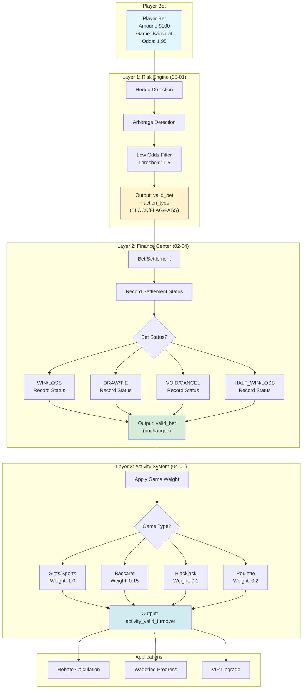
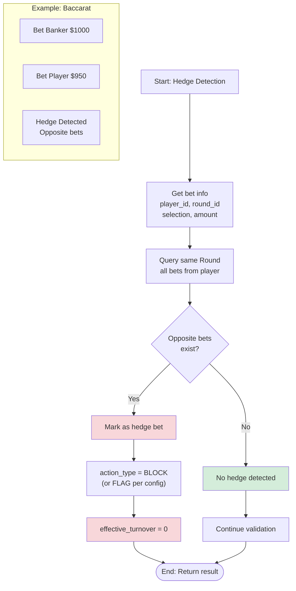
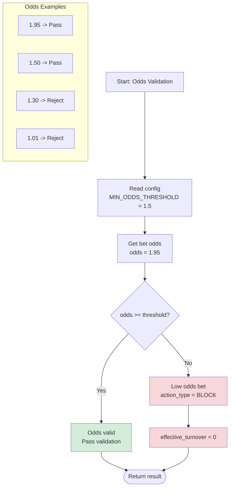
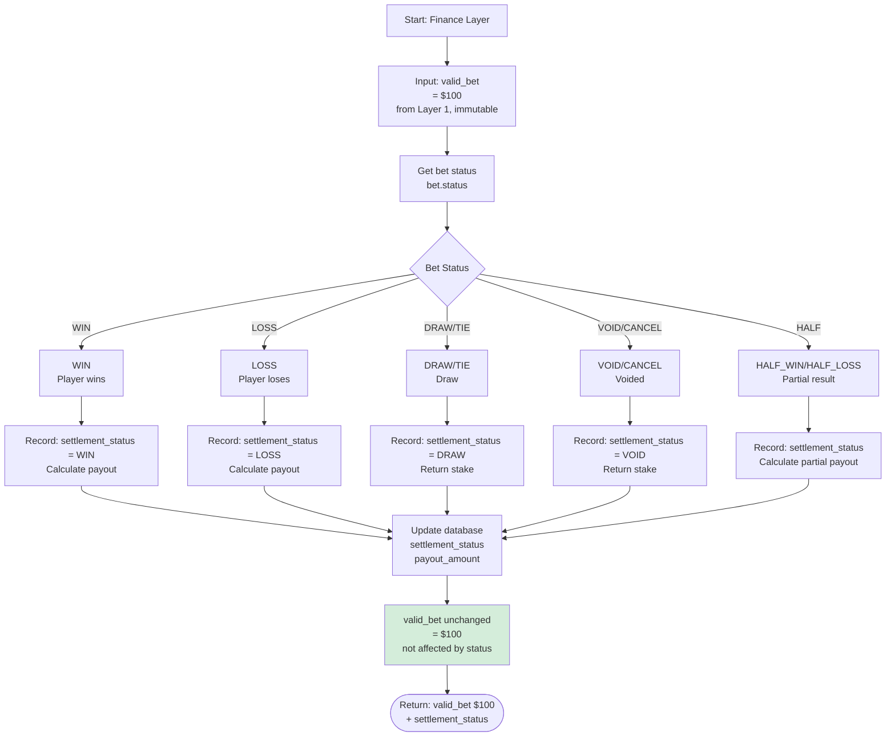
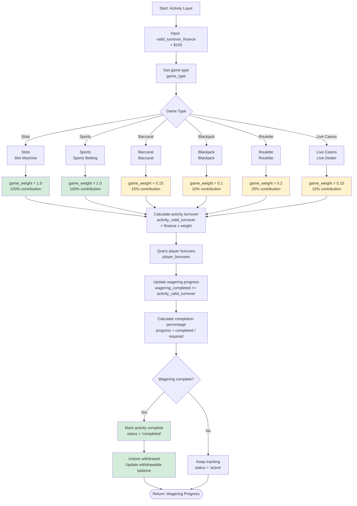
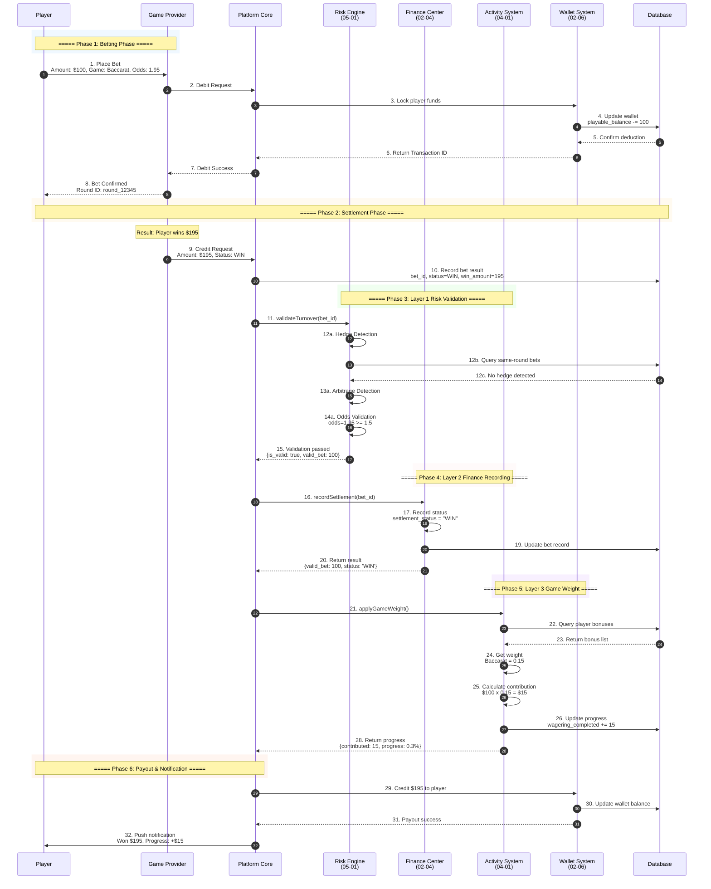
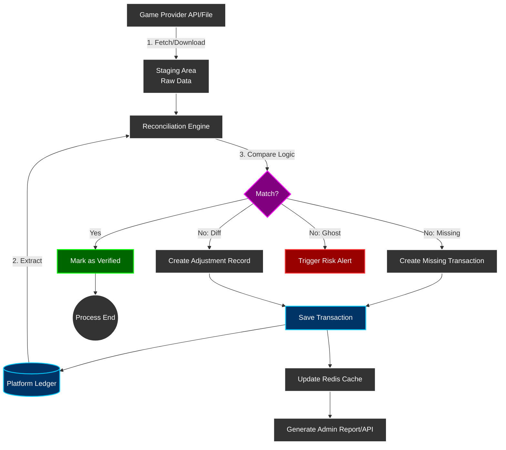

# Turnover Calculation Logic

> **Canonical Source**: [source-archive/03_Game_Center/03-04_Turnover_Calculation.md](../../source-archive/03_Game_Center/03-04_Turnover_Calculation.md)
> **Audience**: Architects, Backend Developers
> **Business Requirements**: [Turnover_Business_Rules.md](../../requirements/03_Gaming_Operations/Turnover_Business_Rules.md)
> **Last Synced**: 2026-02-08
> **Source Version**: 4.0.0

---

## 1. Core Calculation Formula

```
ValidTurnover = BetAmount × GameWeight × OddsFactor × StatusFactor × RiskFactor
```

Where:
- **RiskFactor**: `1` (Pass) or `0` (Block/Flag) - Determined by Layer 1
- **StatusFactor**: `1.0` (WIN/LOSS) or `0` (DRAW/VOID) - Determined by Layer 2
- **GameWeight**: `1.0` (Slots) to `0.05` (Poker) - Applied by Layer 3

---

## 2. Three-Layer Validation Architecture

### 2.1 Architecture Overview



---

## 3. Layer 1: Risk Engine Validation

### 3.1 Risk Validation Result Interface

```typescript
interface RiskValidationResult {
  is_valid: boolean;
  action_type: 'BLOCK' | 'FLAG' | 'PASS';
  matched_rules: string[];
  risk_proposal_id: string | null;
  effective_turnover_base: number;
}
```

### 3.2 Hedge Detection Flow



### 3.3 Odds Threshold Validation



### 3.4 Layer 1 Processing Logic (v2.1.0)

```typescript
// Correct approach (v2.1.0): Short-circuit on Layer 1 rejection
const riskValidation = await RiskEngine.validateTurnover({...});

if (!riskValidation.is_valid && riskValidation.action_type === 'BLOCK') {
  // BLOCK rule returns 0 immediately, skip Layer 2/3
  return {
    effective_turnover_base: 0,
    valid_turnover_finance: 0,
    activity_valid_turnover: 0,
    rejected_by: 'RISK_ENGINE',
    action_type: 'BLOCK',
    matched_rules: riskValidation.matched_rules
  };
}

// FLAG rule marks but continues (v2.1.0)
if (riskValidation.action_type === 'FLAG') {
  await recordRiskFlag(bet.id, riskValidation.risk_proposal_id);
}

// Layer 2 only handles status factor adjustment (trusts Layer 1 result)
const valid_turnover_finance = calculateFinanceTurnover(
  riskValidation.effective_turnover_base,
  bet.status
);
```

---

## 4. Layer 2: Finance Status Recording

### 4.1 Status Factor Mapping

```typescript
/**
 * Layer 2: Finance Layer status factor adjustment
 * Responsibility: WIN/LOSS/DRAW/CANCEL status factor application
 * Precondition: Layer 1 validation passed (is_valid = true)
 *
 * Warning: This layer does NOT make rejection decisions, trusts Layer 1 result
 */
function getStatusFactor(status: BetStatus): number {
  const STATUS_FACTORS = {
    'WIN': 1.0,        // Player wins - full turnover
    'LOSS': 1.0,       // Player loses - full turnover
    'DRAW': 0.0,       // Draw - no risk, no turnover
    'TIE': 0.0,        // Same as draw
    'VOID': 0.0,       // Voided - invalid bet
    'CANCEL': 0.0,     // Cancelled - invalid bet
    'HALF_WIN': 1.0,   // v2.0.0: Half win - full turnover (Standard Principal)
    'HALF_LOSS': 1.0,  // v2.0.0: Half loss - full turnover (Standard Principal)
    'RUNNING': 0.0     // In progress - not settled
  };
  return STATUS_FACTORS[status] ?? 0.0;
}
```

### 4.2 Finance Layer Flow



---

## 5. Layer 3: Activity Weight Application

### 5.1 Game Weight Configuration

```typescript
/**
 * Layer 3: Activity Layer game weight application
 * Responsibility: Apply game weight to finance turnover
 */
function getGameWeight(gameType: GameType): number {
  const GAME_WEIGHTS = {
    'SLOTS': 1.0,
    'SPORTS': 1.0,
    'E_SPORTS': 1.0,
    'ROULETTE': 0.2,
    'BACCARAT': 0.15,
    'LIVE_CASINO': 0.15,
    'BLACKJACK': 0.1,
    'VIDEO_POKER': 0.05,
    'POKER': 0.05,
    'LOTTERY': 0.1,
    'PVP': 0.0
  };
  return GAME_WEIGHTS[gameType] ?? 1.0; // Default 100%
}
```

### 5.2 Activity Layer Flow



---

## 6. Valid Bet Calculation by Game Type

### 6.1 Calculation Formulas

| Game Type | Condition | effectiveStake Formula |
|-----------|-----------|------------------------|
| **SPORTS / E-SPORTS** | - | `|winAmount + lossAmount|` |
| **CASINO** | Draw (payout == betAmount) | `0` |
| **CASINO** | Win (winAmount > 0) | `min(winAmount, betAmount)` |
| **CASINO** | Loss (winAmount == 0) | `betAmount` |
| **Other Types** | - | `betAmount` |

### 6.2 Implementation

```typescript
/**
 * Calculate Effective Stake
 * Location: GridAbstractService.java:171-193
 */
function getEffectiveStake(bet: Transaction): number {
  const gameType = bet.gameType;
  const betAmount = bet.betAmount;
  const payout = bet.payout;
  const winAmount = payout - betAmount;
  const lossAmount = betAmount - payout;

  // Sports: absolute value (winAmount + lossAmount)
  if (gameType === 'SPORTS' || gameType === 'E_SPORTS') {
    return Math.abs(winAmount + lossAmount);
  }

  // Casino games
  if (gameType === 'CASINO') {
    // Draw: 0
    if (payout === betAmount) {
      return 0;
    }
    // Win: min(winAmount, betAmount)
    if (winAmount > 0) {
      return Math.min(winAmount, betAmount);
    }
    // Loss: betAmount
    return betAmount;
  }

  // Other types: betAmount
  return betAmount;
}
```

### 6.3 effectiveStake and lockAmount Relationship

```typescript
/**
 * Add effective stake and adjust lockAmount
 * Location: WalletTransaction.java:119-125
 */
function addEffectiveStake(amount: number): void {
  this.effectiveStake += amount;
  this.addedLockAmount -= amount; // lockAmount decreases

  log.info(`[Wallet] effectiveStake=${this.effectiveStake}, lockAmount=${this.lockAmount}`);
}
```

**Example**:
- Before: lockAmount=500, effectiveStake=100
- Bet settlement produces effectiveStake=200
- After: lockAmount=300, effectiveStake=300

---

## 7. Free Spins Turnover Calculation

### 7.1 GGR Calculation Implementation

```typescript
/**
 * Calculate GGR (including free spins cost)
 */
public calculateGGR(date: LocalDate): GgrReport {
    const transactions = this.transactionRepository.findByDate(date);

    let totalTurnover = 0;
    let totalPayout = 0;
    let freespinTurnover = 0;  // Promotion cost tracking

    for (const tx of transactions) {
        // Turnover calculation (includes free spin face value)
        if (tx.transactionType.endsWith('_BET')) {
            totalTurnover += tx.turnover;

            if (tx.isFreeSpin) {
                freespinTurnover += tx.turnover;  // Record promotion cost
            }
        }

        // Payout calculation
        if (tx.transactionType.endsWith('_WIN')) {
            totalPayout += tx.amount;
        }
    }

    // GGR = Turnover - Payout
    const ggr = totalTurnover - totalPayout;

    return {
        date,
        totalTurnover,
        freespinTurnover,      // Promotion cost
        cashTurnover: totalTurnover - freespinTurnover,
        totalPayout,
        ggr
    };
}
```

---

## 8. Database Schema

### 8.1 Wagering Details Table

```sql
-- wagering_details table (valid bet records)
CREATE TABLE wagering_details (
  id BIGINT PRIMARY KEY AUTO_INCREMENT,
  bet_id VARCHAR(64) NOT NULL UNIQUE,
  player_id BIGINT NOT NULL,
  promotion_id BIGINT,

  -- Original data (immutable)
  bet_amount DECIMAL(19,4) NOT NULL,
  game_type VARCHAR(32) NOT NULL,
  odds DECIMAL(10,4),
  status VARCHAR(32) NOT NULL,

  -- Calculation results (recalculable)
  valid_bet DECIMAL(19,4) NOT NULL,
  game_weight DECIMAL(5,4) NOT NULL,
  contributed_amount DECIMAL(19,4) NOT NULL,

  -- Recalculation support
  calculation_version VARCHAR(16) NOT NULL DEFAULT 'v1.0.0',

  -- Audit fields
  created_at TIMESTAMP DEFAULT CURRENT_TIMESTAMP,
  updated_at TIMESTAMP DEFAULT CURRENT_TIMESTAMP ON UPDATE CURRENT_TIMESTAMP,

  INDEX idx_player_promotion (player_id, promotion_id),
  INDEX idx_calculation_version (calculation_version)
);
```

### 8.2 Wagering Progress Table

```sql
-- wagering_progress table (aggregated view)
CREATE TABLE wagering_progress (
  id BIGINT PRIMARY KEY AUTO_INCREMENT,
  player_id BIGINT NOT NULL,
  promotion_id BIGINT NOT NULL,

  total_requirement DECIMAL(19,4) NOT NULL,
  completed_amount DECIMAL(19,4) NOT NULL DEFAULT 0,
  remaining_amount DECIMAL(19,4) AS (total_requirement - completed_amount) STORED,

  is_completed BOOLEAN AS (completed_amount >= total_requirement) STORED,

  updated_at TIMESTAMP DEFAULT CURRENT_TIMESTAMP ON UPDATE CURRENT_TIMESTAMP,

  UNIQUE KEY uk_player_promotion (player_id, promotion_id)
);
```

### 8.3 Recalculation Task Table

```sql
-- Recalculation task table
CREATE TABLE t_turnover_recalculation_task (
    id                  BIGINT PRIMARY KEY AUTO_INCREMENT,
    task_id             VARCHAR(64) NOT NULL UNIQUE,
    trigger_type        VARCHAR(50) NOT NULL,  -- CONFIG_CHANGE, GP_DIFF, MANUAL
    trigger_reason      VARCHAR(500),

    -- Recalculation scope
    player_id           BIGINT,                -- NULL = full recalculation
    game_type           VARCHAR(50),
    date_range_start    DATETIME,
    date_range_end      DATETIME,
    affected_count      INT,

    -- New configuration
    new_config          JSON,                  -- New status_factor / game_weight

    -- Execution status
    status              VARCHAR(20) DEFAULT 'PENDING',
    started_at          DATETIME,
    completed_at        DATETIME,
    error_message       TEXT,

    -- Audit
    created_by          VARCHAR(100) NOT NULL,
    approved_by         VARCHAR(100),
    approved_at         DATETIME,

    created_at          DATETIME DEFAULT CURRENT_TIMESTAMP,
    updated_at          DATETIME DEFAULT CURRENT_TIMESTAMP ON UPDATE CURRENT_TIMESTAMP,

    INDEX idx_status (status),
    INDEX idx_trigger_type (trigger_type),
    INDEX idx_date_range (date_range_start, date_range_end)
);
```

---

## 9. SmartAdmin Layer Mapping

### 9.1 Layer Responsibilities

| Layer | Class Pattern | Responsibility | Annotation Restrictions |
|-------|---------------|----------------|------------------------|
| **Controller** | `TurnoverController` | HTTP requests, parameter validation, return ResponseDTO | No @Transactional |
| **Service** | `TurnoverService` | Business coordination, call Manager/Dao, return Option/Try | No @Transactional |
| **Manager** | `TurnoverCalculationManager` | Transaction management, cross-table operations, cache control | @Transactional ONLY here |
| **Dao** | `BetTurnoverRecordDao` | Database CRUD, MyBatis Mapper | No business logic |
| **Entity** | `BetTurnoverRecordEntity` | Data model, 1:1 table mapping | No business logic |

### 9.2 Entity Layer

```java
@Data
@TableName("t_bet_turnover_record")
public class BetTurnoverRecordEntity extends SmartBaseEntity {

    @TableId(type = IdType.AUTO)
    private Long id;

    /** Bet ID */
    private String betId;

    /** Player ID */
    private Long playerId;

    /** Game type */
    private String gameType;

    // ========== Layer 1 Results (v2.1.0 update) ==========
    /** Effective turnover base (Layer 1 risk engine output) */
    private BigDecimal effectiveTurnoverBase;

    /** Risk action type: BLOCK/FLAG/PASS (v2.1.0) */
    private String actionType;

    /** Matched rules list (v2.1.0) */
    private String matchedRules; // JSON array

    /** Risk proposal ID (v2.1.0) */
    private String riskProposalId;

    // ========== Layer 2 Results ==========
    /** Bet status */
    private String status;

    /** Status factor */
    private BigDecimal statusFactor;

    /** Finance valid turnover (Layer 2 output) */
    private BigDecimal validTurnoverFinance;

    // ========== Layer 3 Results ==========
    /** Activity valid turnover (Layer 3 output, if applicable) */
    private BigDecimal activityValidTurnover;

    /** Game weight */
    private BigDecimal gameWeight;

    // ========== Audit Fields ==========
    /** Calculation timestamp */
    private LocalDateTime calculatedAt;

    /** Three-layer calculation breakdown (JSON) */
    private String layerBreakdown;
}
```

### 9.3 Manager Layer

```java
@Component  // SmartAdmin Pattern: Manager uses @Component, not @Service
@RequiredArgsConstructor
public class TurnoverCalculationManager {

    private final BetTurnoverRecordDao betTurnoverRecordDao;
    private final RedissonClient redissonClient;
    private final KafkaTemplate<String, String> kafkaTemplate;

    /**
     * Calculate and record turnover (with transaction)
     * v2.1.0: Support config-driven risk control (BLOCK/FLAG/PASS)
     */
    @Transactional(rollbackFor = Throwable.class)
    public BetTurnoverRecordEntity calculateAndRecord(
        String betId,
        Long playerId,
        String gameType,
        BigDecimal betAmount,
        String status,
        BigDecimal odds
    ) {
        // Step 1: Distributed lock to prevent duplicate calculation
        RLock lock = redissonClient.getLock("turnover:calc:" + betId);
        if (!lock.tryLock()) {
            throw new BusinessException("Duplicate turnover calculation");
        }

        try {
            // Step 2: Call Layer 1 risk engine
            RiskValidationResult riskResult = riskEngineClient.validateTurnover(
                betId, playerId, gameType, betAmount, odds
            );

            // Step 2.1: BLOCK rule short-circuit return
            if (!riskResult.isValid() && "BLOCK".equals(riskResult.getActionType())) {
                return createBlockedRecord(betId, playerId, riskResult);
            }

            // Step 2.2: FLAG rule records risk mark
            if ("FLAG".equals(riskResult.getActionType())) {
                recordRiskFlag(betId, riskResult.getRiskProposalId());
            }

            // Step 3: Layer 2 finance status factor
            BigDecimal statusFactor = getStatusFactor(status);
            BigDecimal validTurnoverFinance = riskResult.getEffectiveTurnoverBase()
                .multiply(statusFactor);

            // Step 4: Layer 3 activity weight (if applicable)
            BigDecimal gameWeight = getGameWeight(gameType);
            BigDecimal activityValidTurnover = validTurnoverFinance.multiply(gameWeight);

            // Step 5: Record turnover (three-layer results)
            BetTurnoverRecordEntity record = new BetTurnoverRecordEntity();
            record.setBetId(betId);
            record.setPlayerId(playerId);
            record.setGameType(gameType);

            // Layer 1 results
            record.setEffectiveTurnoverBase(riskResult.getEffectiveTurnoverBase());
            record.setActionType(riskResult.getActionType());
            record.setMatchedRules(JSON.toJSONString(riskResult.getMatchedRules()));
            record.setRiskProposalId(riskResult.getRiskProposalId());

            // Layer 2 results
            record.setStatus(status);
            record.setStatusFactor(statusFactor);
            record.setValidTurnoverFinance(validTurnoverFinance);

            // Layer 3 results
            record.setGameWeight(gameWeight);
            record.setActivityValidTurnover(activityValidTurnover);

            record.setCalculatedAt(LocalDateTime.now());

            // Insert to database
            betTurnoverRecordDao.insert(record);

            // Step 6: Publish event to Kafka
            kafkaTemplate.send("finance.turnover.calculated", betId, JSON.toJSONString(record));

            return record;

        } finally {
            lock.unlock();
        }
    }

    /**
     * Query turnover record (with cache)
     */
    @Cacheable(value = "turnover", key = "#betId")
    public Option<BetTurnoverRecordEntity> getTurnoverByBetId(String betId) {
        return Option.of(betTurnoverRecordDao.selectByBetId(betId));
    }
}
```

### 9.4 Service Layer

```java
@Service
@RequiredArgsConstructor
public class TurnoverService {

    private final TurnoverCalculationManager turnoverCalculationManager;
    private final BetTurnoverRecordDao betTurnoverRecordDao;

    /**
     * Calculate turnover (business coordination)
     */
    public Option<BetTurnoverRecordEntity> calculateTurnover(
        String betId,
        Long playerId,
        String gameType,
        BigDecimal betAmount,
        String status,
        BigDecimal odds
    ) {
        // Parameter validation
        if (StringUtils.isBlank(betId)) {
            return Option.none();
        }

        // Check if already calculated
        Option<BetTurnoverRecordEntity> existing =
            turnoverCalculationManager.getTurnoverByBetId(betId);
        if (existing.isDefined()) {
            return existing;
        }

        // Call Manager for calculation
        try {
            BetTurnoverRecordEntity record = turnoverCalculationManager.calculateAndRecord(
                betId, playerId, gameType, betAmount, status, odds
            );
            return Option.of(record);
        } catch (Exception e) {
            log.error("Failed to calculate turnover: betId={}", betId, e);
            return Option.none();
        }
    }
}
```

### 9.5 Controller Layer

```java
@RestController
@Api(tags = "Turnover Calculation")
@RequiredArgsConstructor
public class TurnoverController {

    private final TurnoverService turnoverService;

    /**
     * Query player turnover records
     */
    @GetMapping("/api/turnover/player/{playerId}")
    @ApiOperation("Query player turnover")
    public ResponseDTO<List<BetTurnoverRecordEntity>> getPlayerTurnover(
        @PathVariable Long playerId,
        @RequestParam @DateTimeFormat(pattern = "yyyy-MM-dd") LocalDate date
    ) {
        List<BetTurnoverRecordEntity> records =
            turnoverService.getPlayerTurnover(playerId, date);
        return ResponseDTO.ok(records);
    }

    /**
     * Query single bet turnover
     */
    @GetMapping("/api/turnover/bet/{betId}")
    @ApiOperation("Query bet turnover")
    public ResponseDTO<BetTurnoverRecordEntity> getTurnoverByBet(@PathVariable String betId) {
        Option<BetTurnoverRecordEntity> record =
            turnoverService.calculateTurnover(betId, null, null, null, null, null);

        return record.map(ResponseDTO::ok)
            .getOrElse(() -> ResponseDTO.error(ErrorCodeEnum.DATA_NOT_EXIST));
    }
}
```

---

## 10. End-to-End Sequence Diagram



---

## 11. Reconciliation System

### 11.1 Three-Layer Reconciliation

#### Layer 1: Real-time Stream Check
- **Timing**: 1-5 minutes after `GameEnd` or `Settlement` webhook
- **Mechanism**: Query GP API for transaction status comparison
- **Purpose**: Quick fix for latency issues

#### Layer 2: Near Real-time Batch
- **Timing**: Every 10-30 minutes
- **Mechanism**: Fetch GP history API, Anti-Join with DB
- **Purpose**: Self-healing for lost callbacks

#### Layer 3: T+1 Daily Settlement
- **Timing**: Daily at 02:00 after GP produces settlement files
- **Mechanism**: Full Outer Join comparison
- **Purpose**: Final settlement reconciliation

### 11.2 Reconciliation Data Flow



---

## 12. Monitoring & Alerting

### 12.1 Prometheus Metrics

```yaml
metrics:
  # Turnover calculation performance
  - name: finance.turnover.calculation.latency_p99
    type: histogram
    description: Turnover calculation latency (P99)
    unit: milliseconds
    target: "< 100ms"

  # Risk engine call success rate
  - name: finance.turnover.risk_engine.call.success_rate
    type: gauge
    description: Risk engine call success rate
    target: "> 99.9%"

  # Daily reconciliation deviation rate
  - name: finance.turnover.daily_reconciliation.deviation_rate
    type: gauge
    description: Daily reconciliation deviation rate
    target: "< 0.01%"

  # Event publish success rate
  - name: finance.turnover.event_publish.success_rate
    type: gauge
    description: Kafka event publish success rate
    target: "> 99.99%"
```

### 12.2 Alert Rules

```yaml
alerts:
  - name: turnover_calculation_latency_high
    condition: finance.turnover.calculation.latency_p99 > 500ms
    severity: WARNING
    notify: slack:#finance-ops

  - name: risk_engine_call_failure
    condition: finance.turnover.risk_engine.call.success_rate < 99%
    severity: CRITICAL
    notify: pagerduty:finance-oncall

  - name: daily_reconciliation_deviation
    condition: finance.turnover.daily_reconciliation.deviation_rate > 0.01
    severity: WARNING
    notify: slack:#finance-ops, email:finance-team@company.com

  - name: event_publish_failure
    condition: finance.turnover.event_publish.success_rate < 99.9
    severity: CRITICAL
    notify: pagerduty:finance-oncall
```

---

## 13. ArchUnit Validation Rules

```java
@AnalyzeClasses(packages = "net.lab1024.sa.business.module.finance.turnover")
public class TurnoverModuleArchitectureTest {

    /**
     * Rule 1: Controller must not directly access Dao
     */
    @ArchTest
    static final ArchRule controllers_should_not_access_daos =
        noClasses()
            .that().resideInAPackage("..controller..")
            .should().dependOnClassesThat().resideInAPackage("..dao..");

    /**
     * Rule 2: @Transactional only allowed in Manager layer
     */
    @ArchTest
    static final ArchRule transactional_only_in_manager =
        methods()
            .that().areAnnotatedWith(Transactional.class)
            .should().beDeclaredInClassesThat().resideInAPackage("..manager..");

    /**
     * Rule 3: Service must return Option/Try (no null)
     */
    @ArchTest
    static final ArchRule service_should_return_option_or_try =
        methods()
            .that().areDeclaredInClassesThat().resideInAPackage("..service..")
            .and().arePublic()
            .should().haveRawReturnType(Option.class)
            .orShould().haveRawReturnType(Try.class);

    /**
     * Rule 4: Controller must use @RequiredArgsConstructor (no @Autowired)
     */
    @ArchTest
    static final ArchRule controller_should_use_constructor_injection =
        noFields()
            .that().areDeclaredInClassesThat().resideInAPackage("..controller..")
            .should().beAnnotatedWith(Autowired.class);
}
```

---

## 14. Performance Considerations

### 14.1 Optimization Strategies

| Strategy | Implementation | Impact |
|----------|----------------|--------|
| **Layer 1 Short-circuit** | BLOCK rule returns immediately, skips Layer 2/3 | ~5% CPU savings |
| **Distributed Lock** | Redisson lock per bet_id | Prevents duplicate calculation |
| **Caching** | @Cacheable for turnover records | Reduces DB queries |
| **Batch Insert** | Async batch write to DB (every 10s or 1000 records) | Reduces write pressure |
| **Event-driven** | Kafka events for downstream systems | Decoupled architecture |

### 14.2 Hybrid Accumulation Architecture

```yaml
Bet Placement:
  1. Real-time calculate valid bet
  2. Write to Redis (millisecond level, player can query immediately)
  3. Async batch write to DB (every 10s or 1000 records)

Withdrawal:
  1. Read wagering_progress table directly (millisecond level)
  2. If target met, allow withdrawal

Background Reconciliation (Flink):
  1. Hourly/daily Flink job
  2. Recalculate wagering progress
  3. Compare with wagering_progress table
  4. Alert + auto-correct on discrepancy
```

---

## 15. Related Documents

### Sub-documents
- [03-04-01 Turnover Core Logic](../../source-archive/03_Game_Center/03-04-01_Turnover_Core_Logic.md)
- [03-04-02 Three Layer Validation](../../source-archive/03_Game_Center/03-04-02_Three_Layer_Validation.md)
- [03-04-03 Reconciliation Model](../../source-archive/03_Game_Center/03-04-03_Reconciliation_Model.md)
- [03-04-04 SmartAdmin Mapping](../../source-archive/03_Game_Center/03-04-04_SmartAdmin_Mapping.md)

### Business Rules
- [Turnover_Business_Rules.md](../../requirements/03_Gaming_Operations/Turnover_Business_Rules.md)

### Architecture Dependencies
- [SmartAdmin Architecture Rules](../../../../.agent/rules/foundation/F04-architecture-rules.md)
- [02-06 Wallet Architecture](../../source-archive/02_Finance_Center/02-06_Wallet_Architecture.md)

---

**Document Version**: 1.0.0 (derived from source v4.0.0)
**Last Updated**: 2026-02-08
**Maintainers**: Backend Team, Architecture Team
