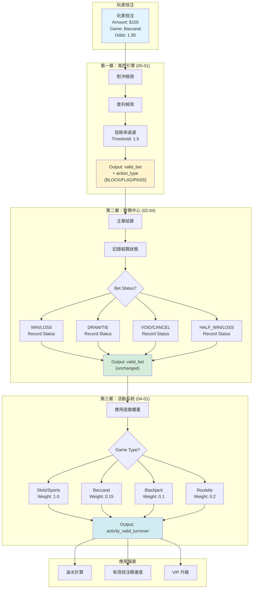
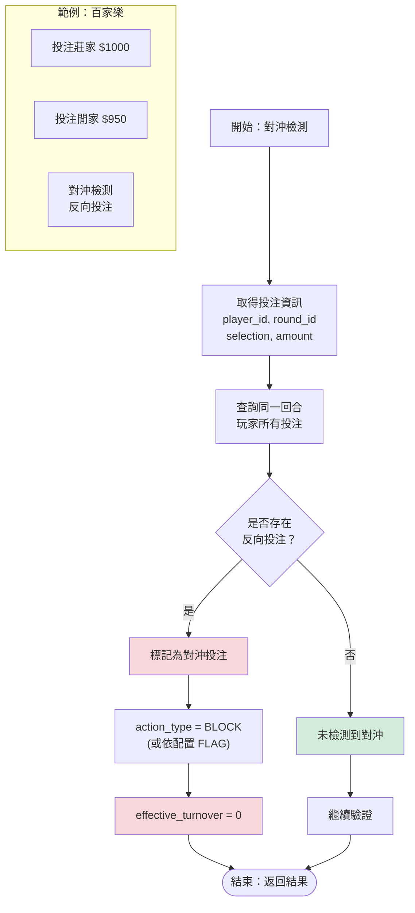
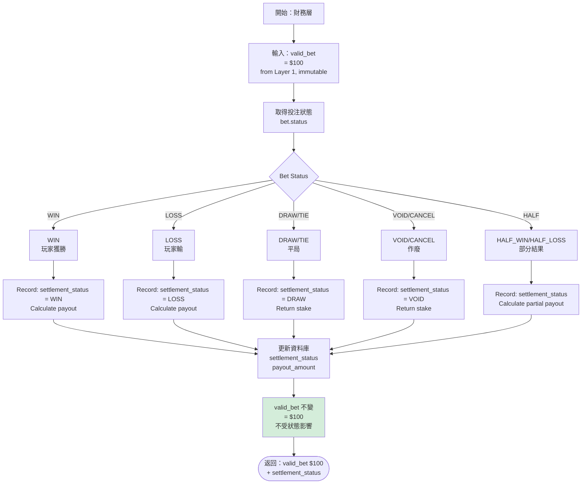
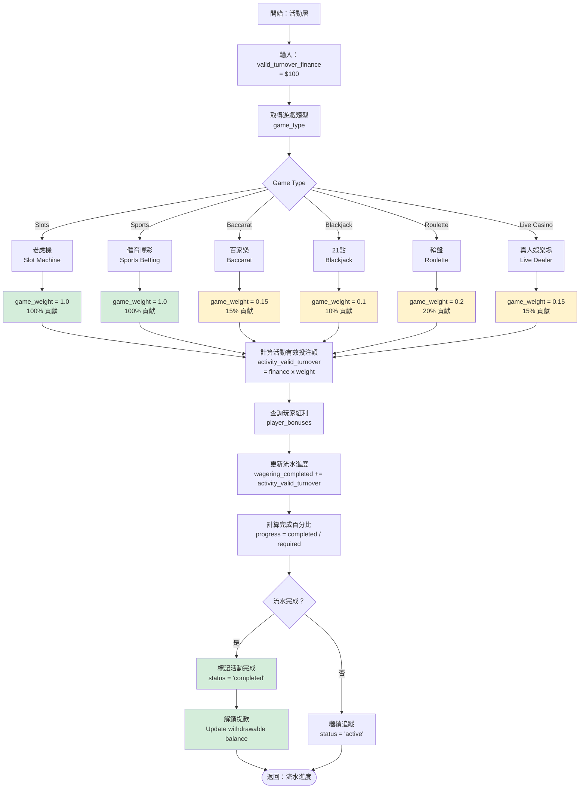
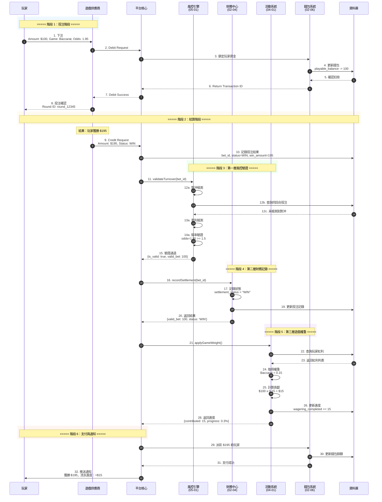
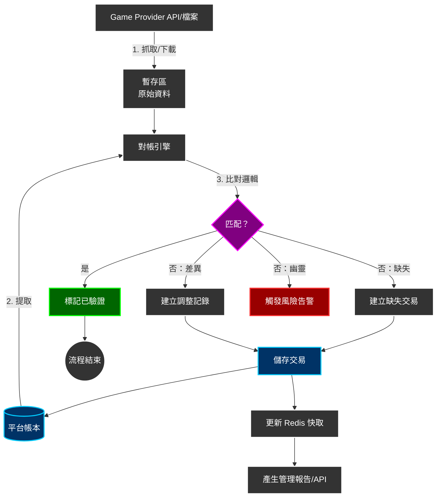

# 有效投注額計算邏輯（Turnover Calculation Logic）

> **規範來源**: [source-archive/03_Game_Center/03-04_Turnover_Calculation.md](../../source-archive/03_Game_Center/03-04_Turnover_Calculation.md)
> **目標讀者**: 架構師、後端開發
> **業務需求**: [Turnover_Business_Rules.md](../../requirements/03_Gaming_Operations/Turnover_Business_Rules.md)
> **最後同步**: 2026-02-08
> **來源版本**: 4.0.0

---

## 1. 核心計算公式（Core Calculation Formula）

```
ValidTurnover = BetAmount × GameWeight × OddsFactor × StatusFactor × RiskFactor
```

其中：
- **RiskFactor**: `1`（通過）或 `0`（封鎖/標記）- 由第一層決定
- **StatusFactor**: `1.0`（WIN/LOSS）或 `0`（DRAW/VOID）- 由第二層決定
- **GameWeight**: `1.0`（老虎機）至 `0.05`（撲克）- 由第三層應用

---

## 2. 三層驗證架構（Three-Layer Validation Architecture）

### 2.1 架構總覽（Architecture Overview）



---

## 3. 第一層：風控引擎驗證（Layer 1: Risk Engine Validation）

### 3.1 風控驗證結果介面（Risk Validation Result Interface）

```typescript
interface RiskValidationResult {
  is_valid: boolean;
  action_type: 'BLOCK' | 'FLAG' | 'PASS';
  matched_rules: string[];
  risk_proposal_id: string | null;
  effective_turnover_base: number;
}
```

### 3.2 對沖檢測流程（Hedge Detection Flow）



### 3.3 賠率門檻驗證（Odds Threshold Validation）


### 3.4 第一層處理邏輯（Layer 1 Processing Logic）（v2.1.0）

```typescript
// Correct approach (v2.1.0): Short-circuit on Layer 1 rejection
const riskValidation = await RiskEngine.validateTurnover({...});

if (!riskValidation.is_valid && riskValidation.action_type === 'BLOCK') {
  // BLOCK rule returns 0 immediately, skip Layer 2/3
  return {
    effective_turnover_base: 0,
    valid_turnover_finance: 0,
    activity_valid_turnover: 0,
    rejected_by: 'RISK_ENGINE',
    action_type: 'BLOCK',
    matched_rules: riskValidation.matched_rules
  };
}

// FLAG rule marks but continues (v2.1.0)
if (riskValidation.action_type === 'FLAG') {
  await recordRiskFlag(bet.id, riskValidation.risk_proposal_id);
}

// Layer 2 only handles status factor adjustment (trusts Layer 1 result)
const valid_turnover_finance = calculateFinanceTurnover(
  riskValidation.effective_turnover_base,
  bet.status
);
```

---

## 4. 第二層：財務狀態記錄（Layer 2: Finance Status Recording）

### 4.1 狀態因子對應（Status Factor Mapping）

```typescript
/**
 * Layer 2: Finance Layer status factor adjustment
 * Responsibility: WIN/LOSS/DRAW/CANCEL status factor application
 * Precondition: Layer 1 validation passed (is_valid = true)
 *
 * Warning: This layer does NOT make rejection decisions, trusts Layer 1 result
 */
function getStatusFactor(status: BetStatus): number {
  const STATUS_FACTORS = {
    'WIN': 1.0,        // Player wins - full turnover
    'LOSS': 1.0,       // Player loses - full turnover
    'DRAW': 0.0,       // Draw - no risk, no turnover
    'TIE': 0.0,        // Same as draw
    'VOID': 0.0,       // Voided - invalid bet
    'CANCEL': 0.0,     // Cancelled - invalid bet
    'HALF_WIN': 1.0,   // v2.0.0: Half win - full turnover (Standard Principal)
    'HALF_LOSS': 1.0,  // v2.0.0: Half loss - full turnover (Standard Principal)
    'RUNNING': 0.0     // In progress - not settled
  };
  return STATUS_FACTORS[status] ?? 0.0;
}
```

### 4.2 財務層流程（Finance Layer Flow）



---

## 5. 第三層：活動權重應用（Layer 3: Activity Weight Application）

### 5.1 遊戲權重配置（Game Weight Configuration）

```typescript
/**
 * Layer 3: Activity Layer game weight application
 * Responsibility: Apply game weight to finance turnover
 */
function getGameWeight(gameType: GameType): number {
  const GAME_WEIGHTS = {
    'SLOTS': 1.0,
    'SPORTS': 1.0,
    'E_SPORTS': 1.0,
    'ROULETTE': 0.2,
    'BACCARAT': 0.15,
    'LIVE_CASINO': 0.15,
    'BLACKJACK': 0.1,
    'VIDEO_POKER': 0.05,
    'POKER': 0.05,
    'LOTTERY': 0.1,
    'PVP': 0.0
  };
  return GAME_WEIGHTS[gameType] ?? 1.0; // Default 100%
}
```

### 5.2 活動層流程（Activity Layer Flow）



---

## 6. 依遊戲類型計算有效投注（Valid Bet Calculation by Game Type）

### 6.1 計算公式（Calculation Formulas）

| 遊戲類型 | 條件 | effectiveStake 公式 |
|---------|------|-------------------|
| **SPORTS / E-SPORTS** | - | `|winAmount + lossAmount|` |
| **CASINO** | 平局（payout == betAmount）| `0` |
| **CASINO** | 獲勝（winAmount > 0）| `min(winAmount, betAmount)` |
| **CASINO** | 輸（winAmount == 0）| `betAmount` |
| **其他類型** | - | `betAmount` |

### 6.2 實作（Implementation）

```typescript
/**
 * Calculate Effective Stake
 * Location: GridAbstractService.java:171-193
 */
function getEffectiveStake(bet: Transaction): number {
  const gameType = bet.gameType;
  const betAmount = bet.betAmount;
  const payout = bet.payout;
  const winAmount = payout - betAmount;
  const lossAmount = betAmount - payout;

  // Sports: absolute value (winAmount + lossAmount)
  if (gameType === 'SPORTS' || gameType === 'E_SPORTS') {
    return Math.abs(winAmount + lossAmount);
  }

  // Casino games
  if (gameType === 'CASINO') {
    // Draw: 0
    if (payout === betAmount) {
      return 0;
    }
    // Win: min(winAmount, betAmount)
    if (winAmount > 0) {
      return Math.min(winAmount, betAmount);
    }
    // Loss: betAmount
    return betAmount;
  }

  // Other types: betAmount
  return betAmount;
}
```

### 6.3 effectiveStake 與 lockAmount 關係

```typescript
/**
 * Add effective stake and adjust lockAmount
 * Location: WalletTransaction.java:119-125
 */
function addEffectiveStake(amount: number): void {
  this.effectiveStake += amount;
  this.addedLockAmount -= amount; // lockAmount decreases

  log.info(`[Wallet] effectiveStake=${this.effectiveStake}, lockAmount=${this.lockAmount}`);
}
```

**範例**：
- 之前：lockAmount=500, effectiveStake=100
- 注單結算產生 effectiveStake=200
- 之後：lockAmount=300, effectiveStake=300

---

## 7. 免費旋轉有效投注額計算（Free Spins Turnover Calculation）

### 7.1 GGR 計算實作（GGR Calculation Implementation）

```typescript
/**
 * Calculate GGR (including free spins cost)
 */
public calculateGGR(date: LocalDate): GgrReport {
    const transactions = this.transactionRepository.findByDate(date);

    let totalTurnover = 0;
    let totalPayout = 0;
    let freespinTurnover = 0;  // Promotion cost tracking

    for (const tx of transactions) {
        // Turnover calculation (includes free spin face value)
        if (tx.transactionType.endsWith('_BET')) {
            totalTurnover += tx.turnover;

            if (tx.isFreeSpin) {
                freespinTurnover += tx.turnover;  // Record promotion cost
            }
        }

        // Payout calculation
        if (tx.transactionType.endsWith('_WIN')) {
            totalPayout += tx.amount;
        }
    }

    // GGR = Turnover - Payout
    const ggr = totalTurnover - totalPayout;

    return {
        date,
        totalTurnover,
        freespinTurnover,      // Promotion cost
        cashTurnover: totalTurnover - freespinTurnover,
        totalPayout,
        ggr
    };
}
```

---

## 8. 資料庫結構（Database Schema）

### 8.1 流水詳情表（Wagering Details Table）

```sql
-- wagering_details table (valid bet records)
CREATE TABLE wagering_details (
  id BIGINT PRIMARY KEY AUTO_INCREMENT,
  bet_id VARCHAR(64) NOT NULL UNIQUE,
  player_id BIGINT NOT NULL,
  promotion_id BIGINT,

  -- Original data (immutable)
  bet_amount DECIMAL(19,4) NOT NULL,
  game_type VARCHAR(32) NOT NULL,
  odds DECIMAL(10,4),
  status VARCHAR(32) NOT NULL,

  -- Calculation results (recalculable)
  valid_bet DECIMAL(19,4) NOT NULL,
  game_weight DECIMAL(5,4) NOT NULL,
  contributed_amount DECIMAL(19,4) NOT NULL,

  -- Recalculation support
  calculation_version VARCHAR(16) NOT NULL DEFAULT 'v1.0.0',

  -- Audit fields
  created_at TIMESTAMP DEFAULT CURRENT_TIMESTAMP,
  updated_at TIMESTAMP DEFAULT CURRENT_TIMESTAMP ON UPDATE CURRENT_TIMESTAMP,

  INDEX idx_player_promotion (player_id, promotion_id),
  INDEX idx_calculation_version (calculation_version)
);
```

### 8.2 流水進度表（Wagering Progress Table）

```sql
-- wagering_progress table (aggregated view)
CREATE TABLE wagering_progress (
  id BIGINT PRIMARY KEY AUTO_INCREMENT,
  player_id BIGINT NOT NULL,
  promotion_id BIGINT NOT NULL,

  total_requirement DECIMAL(19,4) NOT NULL,
  completed_amount DECIMAL(19,4) NOT NULL DEFAULT 0,
  remaining_amount DECIMAL(19,4) AS (total_requirement - completed_amount) STORED,

  is_completed BOOLEAN AS (completed_amount >= total_requirement) STORED,

  updated_at TIMESTAMP DEFAULT CURRENT_TIMESTAMP ON UPDATE CURRENT_TIMESTAMP,

  UNIQUE KEY uk_player_promotion (player_id, promotion_id)
);
```

### 8.3 重算任務表（Recalculation Task Table）

```sql
-- Recalculation task table
CREATE TABLE t_turnover_recalculation_task (
    id                  BIGINT PRIMARY KEY AUTO_INCREMENT,
    task_id             VARCHAR(64) NOT NULL UNIQUE,
    trigger_type        VARCHAR(50) NOT NULL,  -- CONFIG_CHANGE, GP_DIFF, MANUAL
    trigger_reason      VARCHAR(500),

    -- Recalculation scope
    player_id           BIGINT,                -- NULL = full recalculation
    game_type           VARCHAR(50),
    date_range_start    DATETIME,
    date_range_end      DATETIME,
    affected_count      INT,

    -- New configuration
    new_config          JSON,                  -- New status_factor / game_weight

    -- Execution status
    status              VARCHAR(20) DEFAULT 'PENDING',
    started_at          DATETIME,
    completed_at        DATETIME,
    error_message       TEXT,

    -- Audit
    created_by          VARCHAR(100) NOT NULL,
    approved_by         VARCHAR(100),
    approved_at         DATETIME,

    created_at          DATETIME DEFAULT CURRENT_TIMESTAMP,
    updated_at          DATETIME DEFAULT CURRENT_TIMESTAMP ON UPDATE CURRENT_TIMESTAMP,

    INDEX idx_status (status),
    INDEX idx_trigger_type (trigger_type),
    INDEX idx_date_range (date_range_start, date_range_end)
);
```

---

## 9. SmartAdmin 層級對應（SmartAdmin Layer Mapping）

### 9.1 層級職責（Layer Responsibilities）

| 層級 | 類別模式 | 職責 | 註解限制 |
|------|---------|------|---------|
| **Controller** | `TurnoverController` | HTTP 請求、參數驗證、返回 ResponseDTO | 不可使用 @Transactional |
| **Service** | `TurnoverService` | 業務協調、調用 Manager/Dao、返回 Option/Try | 不可使用 @Transactional |
| **Manager** | `TurnoverCalculationManager` | 交易管理、跨表操作、快取控制 | 僅此層可使用 @Transactional |
| **Dao** | `BetTurnoverRecordDao` | 資料庫 CRUD、MyBatis Mapper | 無業務邏輯 |
| **Entity** | `BetTurnoverRecordEntity` | 資料模型、1:1 表格映射 | 無業務邏輯 |

### 9.2 Entity 層

```java
@Data
@TableName("t_bet_turnover_record")
public class BetTurnoverRecordEntity extends SmartBaseEntity {

    @TableId(type = IdType.AUTO)
    private Long id;

    /** Bet ID */
    private String betId;

    /** Player ID */
    private Long playerId;

    /** Game type */
    private String gameType;

    // ========== Layer 1 Results (v2.1.0 update) ==========
    /** Effective turnover base (Layer 1 risk engine output) */
    private BigDecimal effectiveTurnoverBase;

    /** Risk action type: BLOCK/FLAG/PASS (v2.1.0) */
    private String actionType;

    /** Matched rules list (v2.1.0) */
    private String matchedRules; // JSON array

    /** Risk proposal ID (v2.1.0) */
    private String riskProposalId;

    // ========== Layer 2 Results ==========
    /** Bet status */
    private String status;

    /** Status factor */
    private BigDecimal statusFactor;

    /** Finance valid turnover (Layer 2 output) */
    private BigDecimal validTurnoverFinance;

    // ========== Layer 3 Results ==========
    /** Activity valid turnover (Layer 3 output, if applicable) */
    private BigDecimal activityValidTurnover;

    /** Game weight */
    private BigDecimal gameWeight;

    // ========== Audit Fields ==========
    /** Calculation timestamp */
    private LocalDateTime calculatedAt;

    /** Three-layer calculation breakdown (JSON) */
    private String layerBreakdown;
}
```

### 9.3 Manager 層

```java
@Component  // SmartAdmin Pattern: Manager uses @Component, not @Service
@RequiredArgsConstructor
public class TurnoverCalculationManager {

    private final BetTurnoverRecordDao betTurnoverRecordDao;
    private final RedissonClient redissonClient;
    private final KafkaTemplate<String, String> kafkaTemplate;

    /**
     * Calculate and record turnover (with transaction)
     * v2.1.0: Support config-driven risk control (BLOCK/FLAG/PASS)
     */
    @Transactional(rollbackFor = Throwable.class)
    public BetTurnoverRecordEntity calculateAndRecord(
        String betId,
        Long playerId,
        String gameType,
        BigDecimal betAmount,
        String status,
        BigDecimal odds
    ) {
        // Step 1: Distributed lock to prevent duplicate calculation
        RLock lock = redissonClient.getLock("turnover:calc:" + betId);
        if (!lock.tryLock()) {
            throw new BusinessException("Duplicate turnover calculation");
        }

        try {
            // Step 2: Call Layer 1 risk engine
            RiskValidationResult riskResult = riskEngineClient.validateTurnover(
                betId, playerId, gameType, betAmount, odds
            );

            // Step 2.1: BLOCK rule short-circuit return
            if (!riskResult.isValid() && "BLOCK".equals(riskResult.getActionType())) {
                return createBlockedRecord(betId, playerId, riskResult);
            }

            // Step 2.2: FLAG rule records risk mark
            if ("FLAG".equals(riskResult.getActionType())) {
                recordRiskFlag(betId, riskResult.getRiskProposalId());
            }

            // Step 3: Layer 2 finance status factor
            BigDecimal statusFactor = getStatusFactor(status);
            BigDecimal validTurnoverFinance = riskResult.getEffectiveTurnoverBase()
                .multiply(statusFactor);

            // Step 4: Layer 3 activity weight (if applicable)
            BigDecimal gameWeight = getGameWeight(gameType);
            BigDecimal activityValidTurnover = validTurnoverFinance.multiply(gameWeight);

            // Step 5: Record turnover (three-layer results)
            BetTurnoverRecordEntity record = new BetTurnoverRecordEntity();
            record.setBetId(betId);
            record.setPlayerId(playerId);
            record.setGameType(gameType);

            // Layer 1 results
            record.setEffectiveTurnoverBase(riskResult.getEffectiveTurnoverBase());
            record.setActionType(riskResult.getActionType());
            record.setMatchedRules(JSON.toJSONString(riskResult.getMatchedRules()));
            record.setRiskProposalId(riskResult.getRiskProposalId());

            // Layer 2 results
            record.setStatus(status);
            record.setStatusFactor(statusFactor);
            record.setValidTurnoverFinance(validTurnoverFinance);

            // Layer 3 results
            record.setGameWeight(gameWeight);
            record.setActivityValidTurnover(activityValidTurnover);

            record.setCalculatedAt(LocalDateTime.now());

            // Insert to database
            betTurnoverRecordDao.insert(record);

            // Step 6: Publish event to Kafka
            kafkaTemplate.send("finance.turnover.calculated", betId, JSON.toJSONString(record));

            return record;

        } finally {
            lock.unlock();
        }
    }

    /**
     * Query turnover record (with cache)
     */
    @Cacheable(value = "turnover", key = "#betId")
    public Option<BetTurnoverRecordEntity> getTurnoverByBetId(String betId) {
        return Option.of(betTurnoverRecordDao.selectByBetId(betId));
    }
}
```

### 9.4 Service 層

```java
@Service
@RequiredArgsConstructor
public class TurnoverService {

    private final TurnoverCalculationManager turnoverCalculationManager;
    private final BetTurnoverRecordDao betTurnoverRecordDao;

    /**
     * Calculate turnover (business coordination)
     */
    public Option<BetTurnoverRecordEntity> calculateTurnover(
        String betId,
        Long playerId,
        String gameType,
        BigDecimal betAmount,
        String status,
        BigDecimal odds
    ) {
        // Parameter validation
        if (StringUtils.isBlank(betId)) {
            return Option.none();
        }

        // Check if already calculated
        Option<BetTurnoverRecordEntity> existing =
            turnoverCalculationManager.getTurnoverByBetId(betId);
        if (existing.isDefined()) {
            return existing;
        }

        // Call Manager for calculation
        try {
            BetTurnoverRecordEntity record = turnoverCalculationManager.calculateAndRecord(
                betId, playerId, gameType, betAmount, status, odds
            );
            return Option.of(record);
        } catch (Exception e) {
            log.error("Failed to calculate turnover: betId={}", betId, e);
            return Option.none();
        }
    }
}
```

### 9.5 Controller 層

```java
@RestController
@Api(tags = "Turnover Calculation")
@RequiredArgsConstructor
public class TurnoverController {

    private final TurnoverService turnoverService;

    /**
     * Query player turnover records
     */
    @GetMapping("/api/turnover/player/{playerId}")
    @ApiOperation("Query player turnover")
    public ResponseDTO<List<BetTurnoverRecordEntity>> getPlayerTurnover(
        @PathVariable Long playerId,
        @RequestParam @DateTimeFormat(pattern = "yyyy-MM-dd") LocalDate date
    ) {
        List<BetTurnoverRecordEntity> records =
            turnoverService.getPlayerTurnover(playerId, date);
        return ResponseDTO.ok(records);
    }

    /**
     * Query single bet turnover
     */
    @GetMapping("/api/turnover/bet/{betId}")
    @ApiOperation("Query bet turnover")
    public ResponseDTO<BetTurnoverRecordEntity> getTurnoverByBet(@PathVariable String betId) {
        Option<BetTurnoverRecordEntity> record =
            turnoverService.calculateTurnover(betId, null, null, null, null, null);

        return record.map(ResponseDTO::ok)
            .getOrElse(() -> ResponseDTO.error(ErrorCodeEnum.DATA_NOT_EXIST));
    }
}
```

---

## 10. 端到端時序圖（End-to-End Sequence Diagram）



---

## 11. 對帳系統（Reconciliation System）

### 11.1 三層對帳（Three-Layer Reconciliation）

#### 第一層：即時流式檢查（Layer 1: Real-time Stream Check）
- **時機**：`GameEnd` 或 `Settlement` webhook 後 1-5 分鐘
- **機制**：查詢 GP API 進行交易狀態比對
- **目的**：快速修復延遲問題

#### 第二層：準即時批次（Layer 2: Near Real-time Batch）
- **時機**：每 10-30 分鐘
- **機制**：抓取 GP 歷史 API，與資料庫進行 Anti-Join
- **目的**：自我修復丟失的回調

#### 第三層：T+1 每日結算（Layer 3: T+1 Daily Settlement）
- **時機**：每日 02:00（GP 產生結算檔案後）
- **機制**：完整外部連接比對
- **目的**：最終結算對帳

### 11.2 對帳資料流（Reconciliation Data Flow）



---

## 12. 監控與告警（Monitoring & Alerting）

### 12.1 Prometheus 指標

```yaml
metrics:
  # Turnover calculation performance
  - name: finance.turnover.calculation.latency_p99
    type: histogram
    description: 有效投注額計算延遲（P99）
    unit: milliseconds
    target: "< 100ms"

  # Risk engine call success rate
  - name: finance.turnover.risk_engine.call.success_rate
    type: gauge
    description: 風控引擎調用成功率
    target: "> 99.9%"

  # Daily reconciliation deviation rate
  - name: finance.turnover.daily_reconciliation.deviation_rate
    type: gauge
    description: 每日對帳偏差率
    target: "< 0.01%"

  # Event publish success rate
  - name: finance.turnover.event_publish.success_rate
    type: gauge
    description: Kafka 事件發布成功率
    target: "> 99.99%"
```

### 12.2 告警規則（Alert Rules）

```yaml
alerts:
  - name: turnover_calculation_latency_high
    condition: finance.turnover.calculation.latency_p99 > 500ms
    severity: WARNING
    notify: slack:#finance-ops

  - name: risk_engine_call_failure
    condition: finance.turnover.risk_engine.call.success_rate < 99%
    severity: CRITICAL
    notify: pagerduty:finance-oncall

  - name: daily_reconciliation_deviation
    condition: finance.turnover.daily_reconciliation.deviation_rate > 0.01
    severity: WARNING
    notify: slack:#finance-ops, email:finance-team@company.com

  - name: event_publish_failure
    condition: finance.turnover.event_publish.success_rate < 99.9
    severity: CRITICAL
    notify: pagerduty:finance-oncall
```

---

## 13. ArchUnit 驗證規則（ArchUnit Validation Rules）

```java
@AnalyzeClasses(packages = "net.lab1024.sa.business.module.finance.turnover")
public class TurnoverModuleArchitectureTest {

    /**
     * Rule 1: Controller must not directly access Dao
     */
    @ArchTest
    static final ArchRule controllers_should_not_access_daos =
        noClasses()
            .that().resideInAPackage("..controller..")
            .should().dependOnClassesThat().resideInAPackage("..dao..");

    /**
     * Rule 2: @Transactional only allowed in Manager layer
     */
    @ArchTest
    static final ArchRule transactional_only_in_manager =
        methods()
            .that().areAnnotatedWith(Transactional.class)
            .should().beDeclaredInClassesThat().resideInAPackage("..manager..");

    /**
     * Rule 3: Service must return Option/Try (no null)
     */
    @ArchTest
    static final ArchRule service_should_return_option_or_try =
        methods()
            .that().areDeclaredInClassesThat().resideInAPackage("..service..")
            .and().arePublic()
            .should().haveRawReturnType(Option.class)
            .orShould().haveRawReturnType(Try.class);

    /**
     * Rule 4: Controller must use @RequiredArgsConstructor (no @Autowired)
     */
    @ArchTest
    static final ArchRule controller_should_use_constructor_injection =
        noFields()
            .that().areDeclaredInClassesThat().resideInAPackage("..controller..")
            .should().beAnnotatedWith(Autowired.class);
}
```

---

## 14. 效能考量（Performance Considerations）

### 14.1 優化策略（Optimization Strategies）

| 策略 | 實作 | 影響 |
|-----|------|-----|
| **第一層短路** | BLOCK 規則立即返回，跳過第二/三層 | ~5% CPU 節省 |
| **分散式鎖** | Redisson 鎖（每個 bet_id）| 防止重複計算 |
| **快取** | @Cacheable 用於有效投注額記錄 | 減少資料庫查詢 |
| **批次插入** | 非同步批次寫入資料庫（每 10 秒或 1000 筆）| 減少寫入壓力 |
| **事件驅動** | Kafka 事件用於下游系統 | 解耦架構 |

### 14.2 混合累積架構（Hybrid Accumulation Architecture）

```yaml
下注階段：
  1. 即時計算有效投注額
  2. 寫入 Redis（毫秒級，玩家可立即查詢）
  3. 非同步批次寫入資料庫（每 10 秒或 1000 筆）

提款：
  1. 直接讀取 wagering_progress 表（毫秒級）
  2. 若達標，允許提款

背景對帳 (Flink)：
  1. 每小時/每日 Flink 作業
  2. 重新計算流水進度
  3. 與 wagering_progress 表比對
  4. 發現差異時告警 + 自動修正
```

---

## 15. 相關文檔

### 子文檔
- [03-04-01 Turnover Core Logic](../../source-archive/03_Game_Center/03-04-01_Turnover_Core_Logic.md)
- [03-04-02 Three Layer Validation](../../source-archive/03_Game_Center/03-04-02_Three_Layer_Validation.md)
- [03-04-03 Reconciliation Model](../../source-archive/03_Game_Center/03-04-03_Reconciliation_Model.md)
- [03-04-04 SmartAdmin Mapping](../../source-archive/03_Game_Center/03-04-04_SmartAdmin_Mapping.md)

### 業務規則
- [Turnover_Business_Rules.md](../../requirements/03_Gaming_Operations/Turnover_Business_Rules.md)

### 架構依賴
- [SmartAdmin Architecture Rules](../../../../.agent/rules/foundation/F04-architecture-rules.md)
- [02-06 Wallet Architecture](../../source-archive/02_Finance_Center/02-06_Wallet_Architecture.md)

---

**文檔版本**: 1.0.0 (derived from source v4.0.0)
**最後更新**: 2026-02-08
**維護團隊**: Backend Team, Architecture Team
