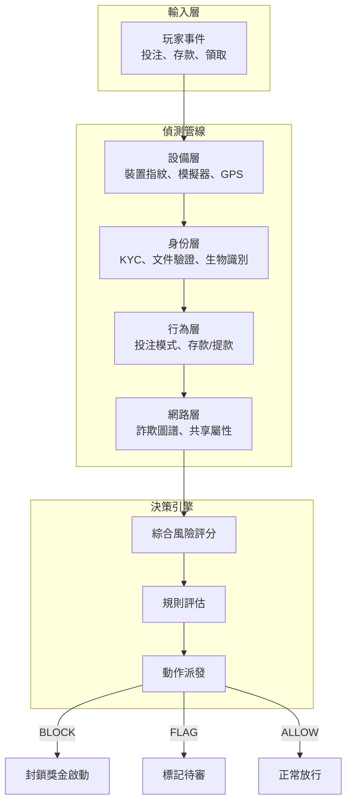
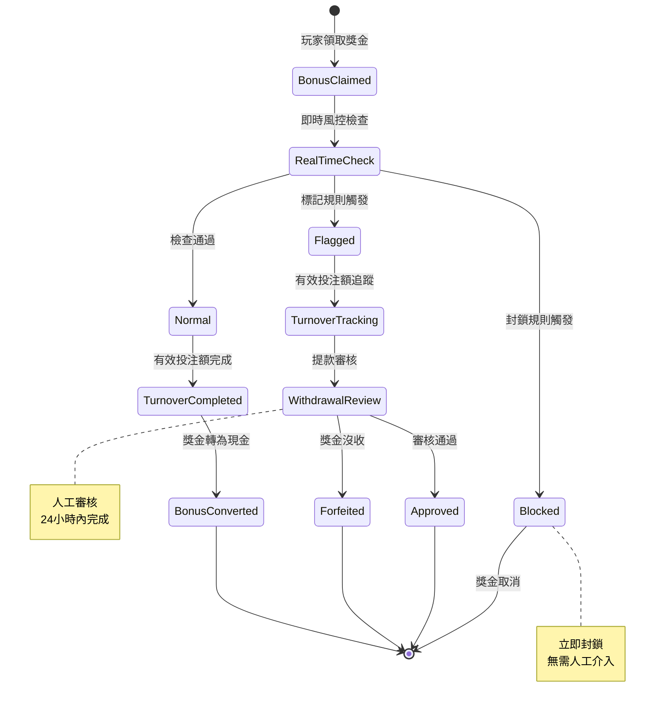
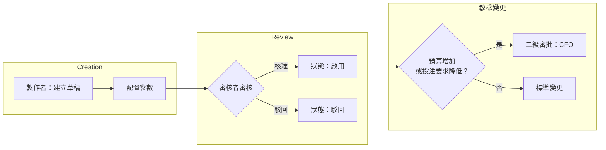

# 活動風控系統架構（Activity Risk Control System Architecture）

> **規範來源**: [04-03_Activity_Risk_Control.md](../../source-archive/04_Activity_Center/04-03_Activity_Risk_Control.md)
> **目標讀者**: 架構師、後端開發、DevOps
> **業務需求**: [Activity_Risk_Requirements.md](../../requirements/04_Promotions_VIP/02_Activity_Risk_Requirements.md)
> **最後同步**: 2026-02-08

---

## 1. 概述（Overview）

本文檔涵蓋活動風控系統的技術架構，包括偵測演算法、資料庫結構、API 模式、事件處理管線，以及活動模板引擎設計。

---

## 2. 多層風險評估架構（Multi-Layer Risk Assessment Architecture）



---

## 3. 配對投注偵測服務（Matched Betting Detection Service）

### 3.1 Service 實作

```java
/**
 * Matched betting detection service.
 * Architecture: Service layer (SmartAdmin pattern)
 */
@Service
@RequiredArgsConstructor
@Slf4j
public class MatchedBettingDetectionService {

    private final BetHistoryDao betHistoryDao;
    private final RiskProposalManager riskProposalManager;

    /**
     * Analyze player for matched betting patterns.
     */
    public MatchedBettingAnalysis analyzePlayer(Long playerId, LocalDate startDate) {
        MatchedBettingAnalysis analysis = new MatchedBettingAnalysis(playerId);

        // 1. Retrieve bonus bet history
        List<BetHistoryEntity> bonusBets = betHistoryDao
            .selectByPlayerIdAndWalletType(playerId, WalletType.BONUS, startDate);

        for (BetHistoryEntity bet : bonusBets) {
            // 2. Evaluate suspicious indicators
            MatchedBettingIndicator indicator = analyzeBet(bet);

            if (indicator.getRiskScore() >= 70) {
                analysis.addSuspiciousBet(bet, indicator);
            }
        }

        // 3. Calculate composite risk score
        analysis.calculateOverallRisk();

        return analysis;
    }

    private MatchedBettingIndicator analyzeBet(BetHistoryEntity bet) {
        MatchedBettingIndicator indicator = new MatchedBettingIndicator();

        // Indicator 1: Pre-match timing (within 15 min of match start)
        if (isPreMatchWindow(bet.getMatchStartTime(), bet.getBetTime())) {
            indicator.addFlag("PRE_MATCH_TIMING", 20);
        }

        // Indicator 2: High odds / low risk
        if (isHighOddsLowRisk(bet)) {
            indicator.addFlag("HIGH_ODDS_LOW_RISK", 30);
        }

        // Indicator 3: Bet amount near maximum
        if (isNearMaxBet(bet)) {
            indicator.addFlag("NEAR_MAX_BET", 15);
        }

        // Indicator 4: Rapid turnover completion
        if (isRapidTurnover(bet.getPlayerId())) {
            indicator.addFlag("RAPID_TURNOVER", 25);
        }

        // Indicator 5: No recreational betting
        if (lacksRecreationalBetting(bet.getPlayerId())) {
            indicator.addFlag("NO_RECREATIONAL", 20);
        }

        indicator.calculateRiskScore();
        return indicator;
    }

    /**
     * Detect rapid turnover completion pattern.
     */
    private boolean isRapidTurnover(Long playerId) {
        BonusClaimHistory claim = bonusClaimDao.selectLatestClaim(playerId);
        if (claim == null || claim.getCompletedAt() == null) {
            return false;
        }

        long hoursToComplete = ChronoUnit.HOURS.between(
            claim.getClaimedAt(),
            claim.getCompletedAt()
        );

        // 35x wagering completed in < 12 hours = highly suspicious
        return hoursToComplete < 12 &&
               claim.getWageringMultiplier() >= 35;
    }
}
```

### 3.2 風險指標權重配置

| 指標 | 旗標代碼 | 權重 | 門檻值 |
|------|---------|------|--------|
| 賽前時機 | `PRE_MATCH_TIMING` | 20 | 賽事開始前 15 分鐘內 |
| 高賠率/低風險 | `HIGH_ODDS_LOW_RISK` | 30 | 統計分析 |
| 接近最大投注額 | `NEAR_MAX_BET` | 15 | >90% 最大允許額度 |
| 快速完成有效投注額 | `RAPID_TURNOVER` | 25 | 35x 在 <12 小時內 |
| 無娛樂性投注 | `NO_RECREATIONAL` | 20 | 零休閒投注 |

---

## 4. 獎金獵人偵測服務（Bonus Hunter Detection Service）

### 4.1 風險評分演算法

```
Score = (DepositPattern x 0.2) + (BettingPattern x 0.3) +
        (WithdrawalPattern x 0.3) + (AccountActivity x 0.2)
```

### 4.2 行為特徵檔案

```yaml
獎金獵人行為特徵:

  註冊:
    - 僅在獎金活動期間註冊
    - 使用獎金代碼或聯盟連結
    - 註冊時間與活動上線時間相關

  存款:
    - 存入恰好符合最低要求的金額
    - 存款後立即啟用獎金
    - 無後續存款行為

  投注:
    - 選擇最高 RTP 遊戲
    - 投注額接近最低要求
    - 無娛樂性投注（小額/高風險）
    - 無遊戲探索行為

  提款:
    - 完成有效投注額後立即申請提款
    - 提款後帳戶進入休眠狀態
    - 無後續存款
```

### 4.3 Service 實作

```java
/**
 * Bonus hunter detection service.
 */
@Service
@RequiredArgsConstructor
public class BonusHunterDetectionService {

    /**
     * Calculate bonus hunter risk score for a player.
     */
    public BonusHunterRiskScore calculateRiskScore(Long playerId) {
        BonusHunterRiskScore score = new BonusHunterRiskScore(playerId);

        // 1. Deposit pattern analysis (weight 20%)
        DepositPattern depositPattern = analyzeDepositPattern(playerId);
        score.setDepositScore(depositPattern.getScore());

        // 2. Betting pattern analysis (weight 30%)
        BettingPattern bettingPattern = analyzeBettingPattern(playerId);
        score.setBettingScore(bettingPattern.getScore());

        // 3. Withdrawal pattern analysis (weight 30%)
        WithdrawalPattern withdrawalPattern = analyzeWithdrawalPattern(playerId);
        score.setWithdrawalScore(withdrawalPattern.getScore());

        // 4. Account activity analysis (weight 20%)
        AccountActivity activity = analyzeAccountActivity(playerId);
        score.setActivityScore(activity.getScore());

        // Calculate composite score
        score.calculateTotal();

        return score;
    }

    private BettingPattern analyzeBettingPattern(Long playerId) {
        BettingPattern pattern = new BettingPattern();

        // Check game selection
        List<GamePlayStats> gameStats = betHistoryDao
            .getGamePlayStatsByPlayer(playerId);

        // Calculate RTP preference score
        double avgRtp = gameStats.stream()
            .mapToDouble(s -> s.getRtp() * s.getPlayCount())
            .sum() / gameStats.stream()
                .mapToInt(GamePlayStats::getPlayCount).sum();

        if (avgRtp > 97.0) {
            pattern.addFlag("HIGH_RTP_PREFERENCE", 30);
        }

        // Check bet amount uniformity
        List<BigDecimal> betAmounts = betHistoryDao
            .getBetAmountsByPlayer(playerId);

        double variance = calculateVariance(betAmounts);
        if (variance < 10.0) {
            // Extremely uniform bet amounts = mechanical behavior
            pattern.addFlag("UNIFORM_BET_AMOUNTS", 25);
        }

        // Check game exploration diversity
        if (gameStats.size() < 3) {
            pattern.addFlag("LOW_GAME_DIVERSITY", 20);
        }

        pattern.calculateScore();
        return pattern;
    }
}
```

---

## 5. 即時偵測規則引擎（Real-Time Detection Rules Engine）

### 5.1 封鎖規則（立即生效）

```yaml
即時封鎖規則 (BLOCK):

  1. 多帳戶強關聯:
     條件: 相同設備 + 相同銀行帳戶
     動作: 封鎖獎金啟動
     代碼: BLOCK_MULTI_ACCOUNT

  2. 已知獎金獵人:
     條件: 風險評分 >= 90
     動作: 封鎖獎金啟動
     代碼: BLOCK_BONUS_HUNTER

  3. 黑名單銀行:
     條件: 銀行帳戶在黑名單中
     動作: 封鎖存款及獎金
     代碼: BLOCK_BLACKLISTED_BANK
```

### 5.2 標記規則（延後處理）

```yaml
延後偵測規則 (FLAG):

  1. 快速完成有效投注額:
     條件: 完成時間 < 預期時間 50%
     動作: 提款時人工審核
     代碼: FLAG_RAPID_TURNOVER

  2. 配對投注嫌疑:
     條件: 3+ 可疑指標
     動作: 標記待審
     代碼: FLAG_MATCHED_BETTING

  3. 獎金獵人嫌疑:
     條件: 風險評分 60-89
     動作: 限制未來獎金資格
     代碼: FLAG_BONUS_HUNTER_SUSPECT
```

---

## 6. 風險評估處理流程（Risk Assessment Processing Flow）



---

## 7. 獎金沒收處理（Bonus Forfeiture Processing）

```yaml
沒收資金處理:

  獎金餘額: 全額沒收
  現金餘額: 保留（除非涉及 AML）
  未結算注單:
    - 獎金資助: 取消並沒收
    - 現金資助: 正常結算

  沒收後動作:
    - 發送通知郵件
    - 說明違規原因
    - 提供申訴管道
    - 保留審計記錄
```

---

## 8. 資料庫結構（Database Schema）

### 8.1 獎金風險評估表

```sql
CREATE TABLE t_bonus_risk_assessment (
    id                      BIGINT PRIMARY KEY,
    player_id               BIGINT NOT NULL,
    bonus_id                BIGINT NOT NULL,
    assessment_type         VARCHAR(32) NOT NULL,   -- CLAIM, TURNOVER, WITHDRAWAL
    risk_score              INT NOT NULL,
    risk_level              VARCHAR(16) NOT NULL,   -- LOW, MEDIUM, HIGH, CRITICAL
    indicators              JSONB NOT NULL,
    decision                VARCHAR(32) NOT NULL,   -- ALLOW, BLOCK, FLAG
    decision_reason         VARCHAR(256),
    reviewed_by             BIGINT,
    reviewed_at             TIMESTAMP,
    created_at              TIMESTAMP DEFAULT CURRENT_TIMESTAMP,

    INDEX idx_player_bonus (player_id, bonus_id),
    INDEX idx_risk_level (risk_level, created_at)
);
```

### 8.2 配對投注偵測表

```sql
CREATE TABLE t_matched_betting_detection (
    id                      BIGINT PRIMARY KEY,
    player_id               BIGINT NOT NULL,
    bet_id                  BIGINT NOT NULL,
    match_id                VARCHAR(64) NOT NULL,
    detection_indicators    JSONB NOT NULL,
    risk_score              INT NOT NULL,
    status                  VARCHAR(32) DEFAULT 'PENDING',
    reviewed_by             BIGINT,
    reviewed_at             TIMESTAMP,
    action_taken            VARCHAR(64),
    created_at              TIMESTAMP DEFAULT CURRENT_TIMESTAMP,

    INDEX idx_player_detection (player_id, created_at DESC),
    INDEX idx_status (status)
);
```

### 8.3 獎金沒收表

```sql
CREATE TABLE t_bonus_forfeiture (
    id                      BIGINT PRIMARY KEY,
    player_id               BIGINT NOT NULL,
    bonus_id                BIGINT NOT NULL,
    forfeiture_reason       VARCHAR(64) NOT NULL,
    forfeited_amount        DECIMAL(18,2) NOT NULL,
    cash_retained           DECIMAL(18,2) NOT NULL,
    pending_bets_cancelled  INT DEFAULT 0,
    evidence                JSONB,
    forfeited_by            BIGINT NOT NULL,
    forfeited_at            TIMESTAMP NOT NULL,
    player_notified_at      TIMESTAMP,
    appeal_deadline         TIMESTAMP,
    appeal_status           VARCHAR(32),
    created_at              TIMESTAMP DEFAULT CURRENT_TIMESTAMP,

    INDEX idx_player_forfeiture (player_id, forfeited_at DESC)
);
```

---

## 9. 活動模板引擎（Activity Template Engine）

### 9.1 存款獎金模板

```json
{
  "templateId": "DEPOSIT_BONUS_V1",
  "name": "Standard Deposit Bonus",
  "category": "DEPOSIT",
  "configSchema": {
    "matchPercentage": { "type": "number", "min": 10, "max": 500 },
    "maxBonus": { "type": "number", "min": 10 },
    "minDeposit": { "type": "number", "min": 1 },
    "wageringMultiplier": { "type": "number", "min": 1, "max": 100 },
    "validDays": { "type": "integer", "min": 1, "max": 90 }
  },
  "defaultValues": {
    "matchPercentage": 100,
    "wageringMultiplier": 30,
    "validDays": 14
  }
}
```

### 9.2 每日簽到模板

```json
{
  "templateId": "DAILY_LOGIN_V1",
  "name": "Consecutive Check-In Rewards",
  "category": "ENGAGEMENT",
  "configSchema": {
    "rewards": {
      "type": "array",
      "items": {
        "day": "integer",
        "rewardType": "enum[CASH, BONUS, FREE_SPINS, POINTS]",
        "amount": "number"
      }
    },
    "streakReset": { "type": "boolean" },
    "maxStreak": { "type": "integer" }
  }
}
```

### 9.3 排行榜錦標賽模板

```json
{
  "templateId": "LEADERBOARD_V1",
  "name": "Tournament Leaderboard",
  "category": "TOURNAMENT",
  "configSchema": {
    "scoringMethod": {
      "type": "enum",
      "options": ["MULTIPLIER", "TOTAL_WAGER", "BIGGEST_WIN", "POINTS"]
    },
    "prizePool": { "type": "number" },
    "prizeDistribution": {
      "type": "array",
      "items": { "rank": "integer", "percentage": "number" }
    },
    "eligibleGames": { "type": "array", "items": "gameId" },
    "duration": {
      "type": "enum",
      "options": ["DAILY", "WEEKLY", "MONTHLY"]
    }
  }
}
```

---

## 10. 動態配置架構（Dynamic Configuration Architecture）

### 10.1 配置規則

- **禁止硬編碼**: 所有規則參數（門檻值、百分比、遊戲清單）必須外部化至後台配置
- **可配置範圍**:
  - 觸發條件: 存款金額、有效投注額倍數、合格遊戲、有效期限
  - 獎勵參數: 獎金百分比、最大上限、目標錢包類型
  - 受眾定位: 適用國家、VIP 等級、排除名單

### 10.2 審批工作流程整合



---

## 11. 監控指標（技術）（Monitoring Metrics）

| 指標 | 計算方式 | 警報門檻值 | 收集方法 |
|------|---------|-----------|---------|
| `bonus_abuse_rate` | 沒收次數 / 領取次數 | >5% | 對 `t_bonus_forfeiture` 執行聚合查詢 |
| `matched_betting_detected` | 偵測案例數 / 日 | >10 | 統計 `t_matched_betting_detection` |
| `bonus_hunter_score_avg` | AVG(risk_score) | >50 | 對 `t_bonus_risk_assessment` 執行聚合 |
| `turnover_completion_time_avg` | AVG(completed_at - claimed_at) | <24h | 獎金領取歷史 |
| `bonus_roi` | 增量 NGR / 獎金成本 | <1.0 | BI 管線計算 |
