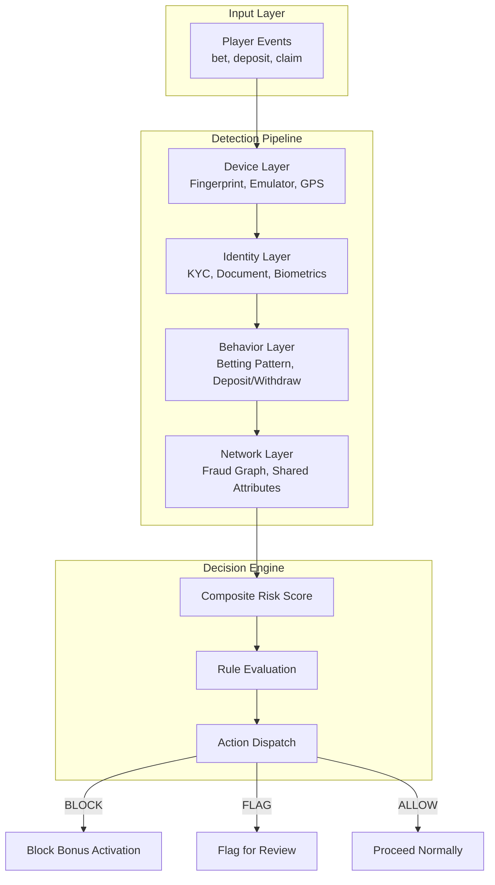
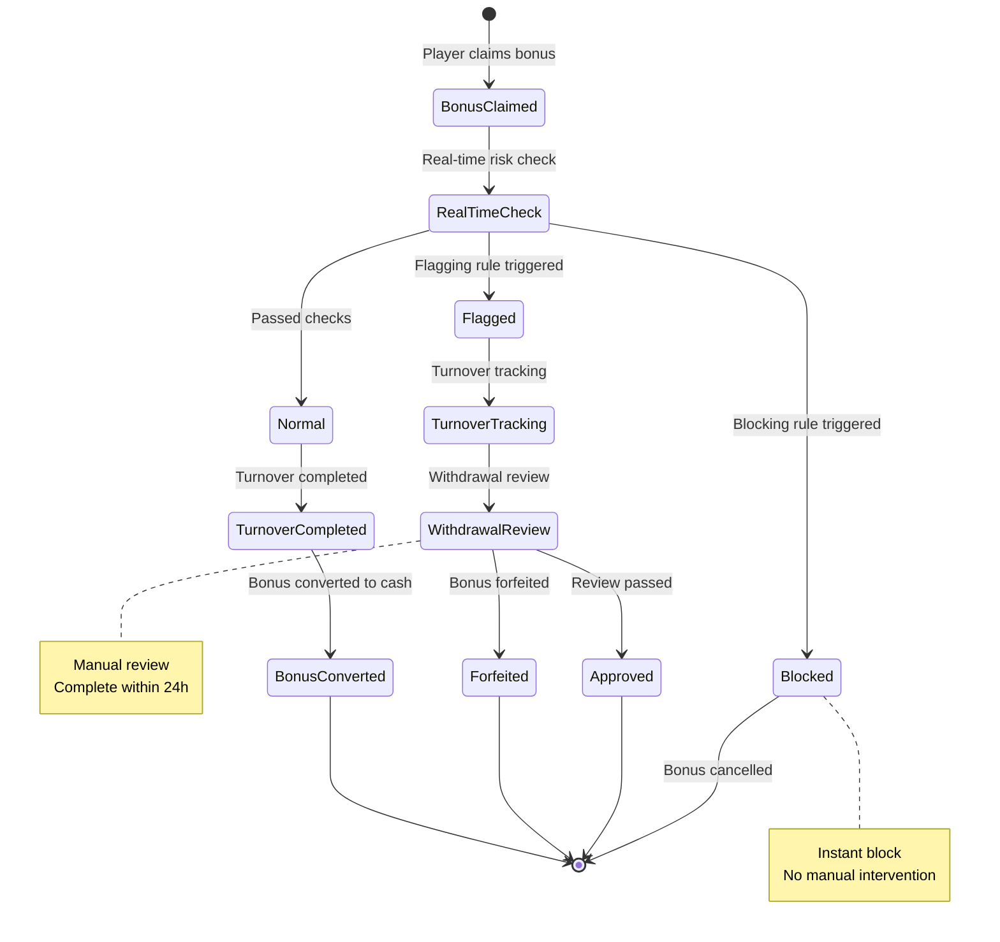
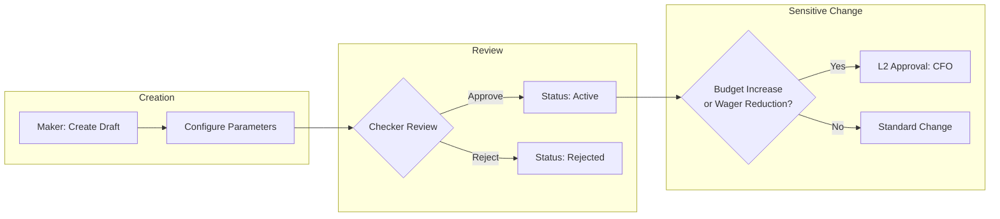

# Activity Risk Control System Architecture

> **Canonical Source**: [04-03_Activity_Risk_Control.md](../../source-archive/04_Activity_Center/04-03_Activity_Risk_Control.md)
> **Audience**: Architects, Backend Developers, DevOps
> **Business Requirements**: [Activity_Risk_Requirements.md](../../requirements/04_Promotions_VIP/Activity_Risk_Requirements.md)
> **Last Synced**: 2026-02-08

---

## 1. Overview

This document covers the technical architecture of the activity risk control system, including detection algorithms, database schemas, API patterns, event processing pipelines, and activity template engine design.

---

## 2. Multi-Layer Risk Assessment Architecture



---

## 3. Matched Betting Detection Service

### 3.1 Service Implementation

```java
/**
 * Matched betting detection service.
 * Architecture: Service layer (SmartAdmin pattern)
 */
@Service
@RequiredArgsConstructor
@Slf4j
public class MatchedBettingDetectionService {

    private final BetHistoryDao betHistoryDao;
    private final RiskProposalManager riskProposalManager;

    /**
     * Analyze player for matched betting patterns.
     */
    public MatchedBettingAnalysis analyzePlayer(Long playerId, LocalDate startDate) {
        MatchedBettingAnalysis analysis = new MatchedBettingAnalysis(playerId);

        // 1. Retrieve bonus bet history
        List<BetHistoryEntity> bonusBets = betHistoryDao
            .selectByPlayerIdAndWalletType(playerId, WalletType.BONUS, startDate);

        for (BetHistoryEntity bet : bonusBets) {
            // 2. Evaluate suspicious indicators
            MatchedBettingIndicator indicator = analyzeBet(bet);

            if (indicator.getRiskScore() >= 70) {
                analysis.addSuspiciousBet(bet, indicator);
            }
        }

        // 3. Calculate composite risk score
        analysis.calculateOverallRisk();

        return analysis;
    }

    private MatchedBettingIndicator analyzeBet(BetHistoryEntity bet) {
        MatchedBettingIndicator indicator = new MatchedBettingIndicator();

        // Indicator 1: Pre-match timing (within 15 min of match start)
        if (isPreMatchWindow(bet.getMatchStartTime(), bet.getBetTime())) {
            indicator.addFlag("PRE_MATCH_TIMING", 20);
        }

        // Indicator 2: High odds / low risk
        if (isHighOddsLowRisk(bet)) {
            indicator.addFlag("HIGH_ODDS_LOW_RISK", 30);
        }

        // Indicator 3: Bet amount near maximum
        if (isNearMaxBet(bet)) {
            indicator.addFlag("NEAR_MAX_BET", 15);
        }

        // Indicator 4: Rapid turnover completion
        if (isRapidTurnover(bet.getPlayerId())) {
            indicator.addFlag("RAPID_TURNOVER", 25);
        }

        // Indicator 5: No recreational betting
        if (lacksRecreationalBetting(bet.getPlayerId())) {
            indicator.addFlag("NO_RECREATIONAL", 20);
        }

        indicator.calculateRiskScore();
        return indicator;
    }

    /**
     * Detect rapid turnover completion pattern.
     */
    private boolean isRapidTurnover(Long playerId) {
        BonusClaimHistory claim = bonusClaimDao.selectLatestClaim(playerId);
        if (claim == null || claim.getCompletedAt() == null) {
            return false;
        }

        long hoursToComplete = ChronoUnit.HOURS.between(
            claim.getClaimedAt(),
            claim.getCompletedAt()
        );

        // 35x wagering completed in < 12 hours = highly suspicious
        return hoursToComplete < 12 &&
               claim.getWageringMultiplier() >= 35;
    }
}
```

### 3.2 Risk Indicator Weight Configuration

| Indicator | Flag Code | Weight | Threshold |
|-----------|-----------|--------|-----------|
| Pre-match timing | `PRE_MATCH_TIMING` | 20 | Within 15 min of match start |
| High odds / low risk | `HIGH_ODDS_LOW_RISK` | 30 | Statistical analysis |
| Near max bet | `NEAR_MAX_BET` | 15 | >90% of max allowed |
| Rapid turnover | `RAPID_TURNOVER` | 25 | 35x in <12 hours |
| No recreational betting | `NO_RECREATIONAL` | 20 | Zero casual bets |

---

## 4. Bonus Hunter Detection Service

### 4.1 Risk Score Algorithm

```
Score = (DepositPattern x 0.2) + (BettingPattern x 0.3) +
        (WithdrawalPattern x 0.3) + (AccountActivity x 0.2)
```

### 4.2 Behavioral Profile

```yaml
Bonus Hunter Behavioral Signatures:

  Registration:
    - Registers only when bonus is active
    - Uses bonus code or affiliate link
    - Registration time correlates with promotion launch

  Deposit:
    - Deposits exact minimum required amount
    - Activates bonus immediately after deposit
    - No subsequent deposit behavior

  Betting:
    - Selects highest-RTP games
    - Bet amounts near minimum requirement
    - No recreational bets (small/high-risk)
    - No game exploration behavior

  Withdrawal:
    - Requests withdrawal immediately after wager completion
    - Account goes dormant after withdrawal
    - No return deposits
```

### 4.3 Service Implementation

```java
/**
 * Bonus hunter detection service.
 */
@Service
@RequiredArgsConstructor
public class BonusHunterDetectionService {

    /**
     * Calculate bonus hunter risk score for a player.
     */
    public BonusHunterRiskScore calculateRiskScore(Long playerId) {
        BonusHunterRiskScore score = new BonusHunterRiskScore(playerId);

        // 1. Deposit pattern analysis (weight 20%)
        DepositPattern depositPattern = analyzeDepositPattern(playerId);
        score.setDepositScore(depositPattern.getScore());

        // 2. Betting pattern analysis (weight 30%)
        BettingPattern bettingPattern = analyzeBettingPattern(playerId);
        score.setBettingScore(bettingPattern.getScore());

        // 3. Withdrawal pattern analysis (weight 30%)
        WithdrawalPattern withdrawalPattern = analyzeWithdrawalPattern(playerId);
        score.setWithdrawalScore(withdrawalPattern.getScore());

        // 4. Account activity analysis (weight 20%)
        AccountActivity activity = analyzeAccountActivity(playerId);
        score.setActivityScore(activity.getScore());

        // Calculate composite score
        score.calculateTotal();

        return score;
    }

    private BettingPattern analyzeBettingPattern(Long playerId) {
        BettingPattern pattern = new BettingPattern();

        // Check game selection
        List<GamePlayStats> gameStats = betHistoryDao
            .getGamePlayStatsByPlayer(playerId);

        // Calculate RTP preference score
        double avgRtp = gameStats.stream()
            .mapToDouble(s -> s.getRtp() * s.getPlayCount())
            .sum() / gameStats.stream()
                .mapToInt(GamePlayStats::getPlayCount).sum();

        if (avgRtp > 97.0) {
            pattern.addFlag("HIGH_RTP_PREFERENCE", 30);
        }

        // Check bet amount uniformity
        List<BigDecimal> betAmounts = betHistoryDao
            .getBetAmountsByPlayer(playerId);

        double variance = calculateVariance(betAmounts);
        if (variance < 10.0) {
            // Extremely uniform bet amounts = mechanical behavior
            pattern.addFlag("UNIFORM_BET_AMOUNTS", 25);
        }

        // Check game exploration diversity
        if (gameStats.size() < 3) {
            pattern.addFlag("LOW_GAME_DIVERSITY", 20);
        }

        pattern.calculateScore();
        return pattern;
    }
}
```

---

## 5. Real-Time Detection Rules Engine

### 5.1 Blocking Rules (Immediate)

```yaml
Instant Blocking Rules (BLOCK):

  1. Multi-account strong link:
     Condition: Same device + same bank account
     Action: Block bonus activation
     Code: BLOCK_MULTI_ACCOUNT

  2. Known bonus hunter:
     Condition: Risk score >= 90
     Action: Block bonus activation
     Code: BLOCK_BONUS_HUNTER

  3. Blacklisted bank:
     Condition: Bank account on blacklist
     Action: Block deposit and bonus
     Code: BLOCK_BLACKLISTED_BANK
```

### 5.2 Flagging Rules (Deferred)

```yaml
Delayed Detection Rules (FLAG):

  1. Rapid turnover completion:
     Condition: Completion time < 50% of expected
     Action: Manual review on withdrawal
     Code: FLAG_RAPID_TURNOVER

  2. Matched betting suspicion:
     Condition: 3+ suspicious indicators
     Action: Flag for review
     Code: FLAG_MATCHED_BETTING

  3. Bonus hunter suspicion:
     Condition: Risk score 60-89
     Action: Restrict future bonuses
     Code: FLAG_BONUS_HUNTER_SUSPECT
```

---

## 6. Risk Assessment Processing Flow



---

## 7. Bonus Forfeiture Processing

```yaml
Forfeiture Fund Handling:

  Bonus balance: Full forfeiture
  Cash balance: Retained (unless AML-related)
  Pending bets:
    - Bonus-funded: Cancel and forfeit
    - Cash-funded: Settle normally

  Post-forfeiture actions:
    - Send notification email
    - State violation reason
    - Provide appeal channel
    - Retain audit record
```

---

## 8. Database Schema

### 8.1 Bonus Risk Assessment Table

```sql
CREATE TABLE t_bonus_risk_assessment (
    id                      BIGINT PRIMARY KEY,
    player_id               BIGINT NOT NULL,
    bonus_id                BIGINT NOT NULL,
    assessment_type         VARCHAR(32) NOT NULL,   -- CLAIM, TURNOVER, WITHDRAWAL
    risk_score              INT NOT NULL,
    risk_level              VARCHAR(16) NOT NULL,   -- LOW, MEDIUM, HIGH, CRITICAL
    indicators              JSONB NOT NULL,
    decision                VARCHAR(32) NOT NULL,   -- ALLOW, BLOCK, FLAG
    decision_reason         VARCHAR(256),
    reviewed_by             BIGINT,
    reviewed_at             TIMESTAMP,
    created_at              TIMESTAMP DEFAULT CURRENT_TIMESTAMP,

    INDEX idx_player_bonus (player_id, bonus_id),
    INDEX idx_risk_level (risk_level, created_at)
);
```

### 8.2 Matched Betting Detection Table

```sql
CREATE TABLE t_matched_betting_detection (
    id                      BIGINT PRIMARY KEY,
    player_id               BIGINT NOT NULL,
    bet_id                  BIGINT NOT NULL,
    match_id                VARCHAR(64) NOT NULL,
    detection_indicators    JSONB NOT NULL,
    risk_score              INT NOT NULL,
    status                  VARCHAR(32) DEFAULT 'PENDING',
    reviewed_by             BIGINT,
    reviewed_at             TIMESTAMP,
    action_taken            VARCHAR(64),
    created_at              TIMESTAMP DEFAULT CURRENT_TIMESTAMP,

    INDEX idx_player_detection (player_id, created_at DESC),
    INDEX idx_status (status)
);
```

### 8.3 Bonus Forfeiture Table

```sql
CREATE TABLE t_bonus_forfeiture (
    id                      BIGINT PRIMARY KEY,
    player_id               BIGINT NOT NULL,
    bonus_id                BIGINT NOT NULL,
    forfeiture_reason       VARCHAR(64) NOT NULL,
    forfeited_amount        DECIMAL(18,2) NOT NULL,
    cash_retained           DECIMAL(18,2) NOT NULL,
    pending_bets_cancelled  INT DEFAULT 0,
    evidence                JSONB,
    forfeited_by            BIGINT NOT NULL,
    forfeited_at            TIMESTAMP NOT NULL,
    player_notified_at      TIMESTAMP,
    appeal_deadline         TIMESTAMP,
    appeal_status           VARCHAR(32),
    created_at              TIMESTAMP DEFAULT CURRENT_TIMESTAMP,

    INDEX idx_player_forfeiture (player_id, forfeited_at DESC)
);
```

---

## 9. Activity Template Engine

### 9.1 Deposit Bonus Template

```json
{
  "templateId": "DEPOSIT_BONUS_V1",
  "name": "Standard Deposit Bonus",
  "category": "DEPOSIT",
  "configSchema": {
    "matchPercentage": { "type": "number", "min": 10, "max": 500 },
    "maxBonus": { "type": "number", "min": 10 },
    "minDeposit": { "type": "number", "min": 1 },
    "wageringMultiplier": { "type": "number", "min": 1, "max": 100 },
    "validDays": { "type": "integer", "min": 1, "max": 90 }
  },
  "defaultValues": {
    "matchPercentage": 100,
    "wageringMultiplier": 30,
    "validDays": 14
  }
}
```

### 9.2 Daily Check-In Template

```json
{
  "templateId": "DAILY_LOGIN_V1",
  "name": "Consecutive Check-In Rewards",
  "category": "ENGAGEMENT",
  "configSchema": {
    "rewards": {
      "type": "array",
      "items": {
        "day": "integer",
        "rewardType": "enum[CASH, BONUS, FREE_SPINS, POINTS]",
        "amount": "number"
      }
    },
    "streakReset": { "type": "boolean" },
    "maxStreak": { "type": "integer" }
  }
}
```

### 9.3 Leaderboard Tournament Template

```json
{
  "templateId": "LEADERBOARD_V1",
  "name": "Tournament Leaderboard",
  "category": "TOURNAMENT",
  "configSchema": {
    "scoringMethod": {
      "type": "enum",
      "options": ["MULTIPLIER", "TOTAL_WAGER", "BIGGEST_WIN", "POINTS"]
    },
    "prizePool": { "type": "number" },
    "prizeDistribution": {
      "type": "array",
      "items": { "rank": "integer", "percentage": "number" }
    },
    "eligibleGames": { "type": "array", "items": "gameId" },
    "duration": {
      "type": "enum",
      "options": ["DAILY", "WEEKLY", "MONTHLY"]
    }
  }
}
```

---

## 10. Dynamic Configuration Architecture

### 10.1 Configuration Rules

- **No hardcoding**: All rule parameters (thresholds, percentages, game lists) must be externalized to back-office configuration
- **Configurable scope**:
  - Trigger conditions: deposit amount, wagering multiplier, eligible games, valid period
  - Reward parameters: bonus percentage, max cap, target wallet type
  - Audience targeting: applicable countries, VIP tiers, exclusion lists

### 10.2 Approval Workflow Integration



---

## 11. Monitoring Metrics (Technical)

| Metric | Calculation | Alert Threshold | Collection Method |
|--------|------------|-----------------|-------------------|
| `bonus_abuse_rate` | Forfeitures / Claims | >5% | Aggregation query on `t_bonus_forfeiture` |
| `matched_betting_detected` | Detection cases / day | >10 | Count on `t_matched_betting_detection` |
| `bonus_hunter_score_avg` | AVG(risk_score) | >50 | Aggregation on `t_bonus_risk_assessment` |
| `turnover_completion_time_avg` | AVG(completed_at - claimed_at) | <24h | Bonus claim history |
| `bonus_roi` | Incremental NGR / Bonus cost | <1.0 | BI pipeline calculation |
