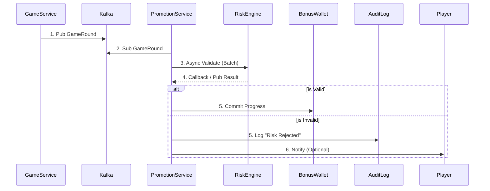

# 獎金計算引擎技術架構 (Bonus Calculation Engine Architecture)

> **Canonical Source**: [source-archive/04_Activity_Center/04-02_Bonus_Calculation_Engine.md](../../source-archive/04_Activity_Center/04-02_Bonus_Calculation_Engine.md)
> **Audience**: Architects, Backend Developers
> **Business Requirements**: [Bonus_Calculation_Requirements.md](../../requirements/04_Promotions_VIP/Bonus_Calculation_Requirements.md)
> **Last Synced**: 2026-02-08
> **Source Version**: 1.0.0

---

## 概述

本文檔詳述活動系統獎金計算引擎的技術實現，包括三層流水計算架構、事件驅動處理流程、API 契約定義，以及跨模組一致性保障機制。這是確保活動系統與財務系統數據一致性的關鍵技術模塊。

---

## 三層流水計算架構 (Three-Layer Turnover Calculation)

### 架構概覽

```
┌─────────────────────────────────────────────────────────────────┐
│              Unified Turnover Validation Stack                  │
├─────────────────────────────────────────────────────────────────┤
│                                                                 │
│  Layer 1: Base Validation (Single Source of Truth)             │
│  ┌───────────────────────────────────────────────────────────┐ │
│  │  RiskEngine.validateTurnover() (05-01 Risk Control)       │ │
│  │  - Filter: Hedge Detection (對沖投注檢測)                  │ │
│  │  - Filter: Arbitrage Detection (套利投注檢測)              │ │
│  │  - Filter: Low Odds (<1.5, configurable)                  │ │
│  │  - Output: effective_turnover_base (基礎有效流水)          │ │
│  └───────────────────────────────────────────────────────────┘ │
│                           ↓                                     │
│  Layer 2: Finance Layer (02-04 Finance Center)                 │
│  ┌───────────────────────────────────────────────────────────┐ │
│  │  effective_turnover_base × status_factor                  │ │
│  │  - WIN: 1.0 (玩家贏,計入流水)                              │ │
│  │  - LOSS: 1.0 (玩家輸,計入流水)                             │ │
│  │  - DRAW/TIE: 0 (和局,無風險,不計流水)                      │ │
│  │  - VOID/CANCEL: 0 (注單作廢)                               │ │
│  │  - HALF_WIN/HALF_LOSS: 0.5 (半贏半輸)                      │ │
│  │  → Output: valid_turnover_finance (財務有效流水)           │ │
│  └───────────────────────────────────────────────────────────┘ │
│                           ↓                                     │
│  Layer 3: Activity Layer (04-01 Activity Center)               │
│  ┌───────────────────────────────────────────────────────────┐ │
│  │  valid_turnover_finance × game_weight                     │ │
│  │  - Slots (老虎機): 1.0 (100% contribution)                 │ │
│  │  - Sports (體育): 1.0                                      │ │
│  │  - Baccarat (百家樂): 0.1-0.15 (10-15%)                    │ │
│  │  - Blackjack (二十一點): 0.05-0.1 (5-10%)                  │ │
│  │  - Roulette (輪盤): 0.1-0.2                                │ │
│  │  → Output: activity_valid_turnover (活動有效流水)          │ │
│  └───────────────────────────────────────────────────────────┘ │
│                                                                 │
└─────────────────────────────────────────────────────────────────┘
```

### 計算公式

```
ValidTurnover = BetAmount
                × Layer1_RiskFactor     (05-01: 0 or 1)
                × Layer2_StatusFactor   (02-04: 0%, 50%, 100%)
                × Layer3_GameWeight     (本節: 5%-100%)
```

### 計算鏈路示例

假設玩家在百家樂 (Baccarat) 投注 $100，賠率 1.95 (歐洲盤)，最終結果 WIN:

```
Step 1 (Risk Engine - 05-01):
  Input: bet_amount = $100, odds = 1.95, game = BACCARAT
  Check: odds >= 1.5 ✓, no hedge detected ✓
  Output: effective_turnover_base = $100

Step 2 (Finance Layer - 02-04):
  Input: effective_turnover_base = $100, status = WIN
  Apply: status_factor = 1.0 (WIN counts as valid)
  Output: valid_turnover_finance = $100 × 1.0 = $100

Step 3 (Activity Layer - 04-01):
  Input: valid_turnover_finance = $100, game = BACCARAT
  Apply: game_weight = 0.15 (15% contribution for baccarat)
  Output: activity_valid_turnover = $100 × 0.15 = $15

Result:
  - Finance System records: $100 valid turnover (for VIP/rebate)
  - Activity System records: $15 wagering progress (for bonus clearing)
```

---

## 事件驅動架構 (Event-Driven Architecture)

### 處理流程

```
玩家動作 → 遊戲服務 → Kafka Topic →
  → 活動觸發消費者
    → 資格檢查服務
    → 獎勵計算服務
    → 錢包服務（發放）
    → 通知服務（推播/站內信）
```

### Kafka Topic 結構

```
Topics:
├── player.activity.casino     # 娛樂場遊戲活動
├── player.activity.sports     # 體育投注活動
├── player.activity.poker      # 撲克活動
├── player.deposits            # 存款事件
├── player.registrations       # 註冊事件
├── promotion.triggers         # 活動觸發
├── promotion.claims           # 活動領取
├── reward.distributions       # 獎勵發放
└── wagering.updates           # 流水更新
```

### 玩家活動追蹤事件結構

```json
{
  "eventType": "GAME_ROUND_COMPLETED",
  "timestamp": "2026-01-24T15:30:00+08:00",
  "playerId": "player-uuid",
  "tenantId": "operator-uuid",
  "vertical": "CASINO",
  "gameType": "SLOTS",
  "gameId": "game-uuid",
  "providerId": "provider-uuid",
  "data": {
    "betAmount": 10.00,
    "winAmount": 25.00,
    "currency": "USD",
    "roundId": "round-uuid"
  },
  "bonusContext": {
    "activeBonusId": "bonus-uuid",
    "contributionRate": 100,
    "effectiveContribution": 10.00,
    "progressBefore": 500.00,
    "progressAfter": 510.00,
    "requiredTotal": 3000.00
  }
}
```

---

## 流水驗證流程 (Turnover Validation Flow)

### 處理時序



### 驗證狀態流轉

| 初始狀態 | 風控結果 | 最終狀態 | 後續動作 |
|---------|---------|---------|---------|
| PENDING | Valid | COMPLETED | 累積流水進度 |
| PENDING | Hedge Detected | REJECTED | 記錄原因、若已發放則 Rollback |
| PENDING | Arbitrage | REJECTED | 記錄原因、觸發風控警報 |
| PENDING | Low Odds | REJECTED | 記錄原因 |

---

## API 契約定義 (API Contract)

### Base Validation API (Risk Engine)

```typescript
// Risk Engine provides this API for cross-module consumption
interface ValidateTurnoverRequest {
  bet_id: string;
  player_id: string;
  game_type: GameType;  // SLOTS, SPORTS, BACCARAT, etc.
  bet_amount: number;
  odds: number;
  odds_type: OddsType;  // EUR, HK, MY, ID
  bet_pattern?: BetPattern[];  // For multi-bet analysis
}

interface ValidateTurnoverResponse {
  is_valid: boolean;
  effective_turnover_base: number;  // Base valid turnover after risk checks
  risk_code: RiskCode;  // VALID, HEDGE_DETECTED, ARBITRAGE, LOW_ODDS
  rejection_reason?: string;
}

// Example usage:
const result = await RiskEngine.validateTurnover({
  bet_id: "bet-uuid-001",
  player_id: "player-uuid-123",
  game_type: GameType.BACCARAT,
  bet_amount: 100,
  odds: 1.95,
  odds_type: OddsType.EUR
});
// Returns: { is_valid: true, effective_turnover_base: 100, risk_code: "VALID" }
```

### 衝突處理配置結構

```json
{
  "conflict_resolution_config": {
    "default_policy": "TYPE_EXCLUSIVE",
    "rules": [
      {
        "conflict_group": "first_deposit_bonuses",
        "type": "MUTUALLY_EXCLUSIVE",
        "resolution_strategy": "MAX_REWARD",
        "members": ["promo-first-deposit-100", "promo-first-deposit-200", "promo-vip-first-deposit"],
        "reason": "首存活動互斥，自動選擇獎勵最高的"
      },
      {
        "conflict_group": "cashback_programs",
        "type": "STACKABLE",
        "resolution_strategy": "STACK_ALL",
        "max_total_percentage": 5.0,
        "members": ["daily-cashback", "vip-cashback", "game-specific-cashback"],
        "reason": "返水可疊加但總計不超過 5%"
      },
      {
        "conflict_group": "free_spins_offers",
        "type": "PLAYER_CHOICE",
        "resolution_strategy": "PLAYER_SELECT",
        "max_selections": 1,
        "members": ["free-spins-50", "free-spins-100-wagered", "mega-spins-10"],
        "reason": "免費旋轉類型差異大，讓玩家選擇"
      }
    ],
    "wagering_mode": {
      "default": "ISOLATED",
      "cross_category_shared": false,
      "completion_order": "PRIORITY_ASC"
    },
    "game_contribution_policy": {
      "default": "UNIFIED",
      "allow_activity_override": true,
      "conflict_resolution": "MIN_CONTRIBUTION"
    },
    "global_limits": {
      "max_active_bonuses_per_player": 5,
      "max_total_bonus_balance": 10000,
      "max_daily_claim_count": 3
    }
  }
}
```

### 遊戲權重配置

```json
{
  "game_weights": {
    "SLOTS": 1.0,
    "SPORTS": 1.0,
    "BACCARAT": 0.15,
    "BLACKJACK": 0.10,
    "ROULETTE": 0.20
  },
  "odds_thresholds": {
    "EUR": 1.5,
    "HK": 0.5,
    "MY": 0.5,
    "ID": 1.2
  }
}
```

---

## 跨模組一致性機制 (Cross-Module Consistency)

### 統一事件源

所有注單結算事件 `GameRound.Settled` 必須同時發送至:
- Finance Turnover Service (財務流水服務)
- Activity Wagering Service (活動流水服務)

兩者均訂閱相同的 Kafka Topic: `game.rounds.settled`

### 同步驗證調用

Finance 與 Activity 模組均需調用 `RiskEngine.validateTurnover()` 作為第一步，不可各自實作風控邏輯。

### 配置集中管理

遊戲權重表 (Game Weight Table) 必須存放於統一配置服務 (Config Service)，Finance 與 Activity 模組均需從此服務讀取，禁止硬編碼。

---

## Database Schema (PostgreSQL)

### bonus_rules
Stores bonus calculation rules and game weight configurations.

```sql
CREATE TABLE bonus_rules (
    rule_id UUID PRIMARY KEY DEFAULT gen_random_uuid(),
    tenant_id UUID NOT NULL REFERENCES tenants(tenant_id),
    promotion_id UUID NOT NULL REFERENCES promotions(promotion_id),
    rule_type VARCHAR(50) NOT NULL, -- 'GAME_WEIGHT', 'ODDS_THRESHOLD', 'STATUS_FACTOR'
    game_category VARCHAR(50), -- 'SLOTS', 'SPORTS', 'BACCARAT', 'BLACKJACK', 'ROULETTE'
    game_id UUID REFERENCES games(game_id),
    weight_factor DECIMAL(5,4) NOT NULL DEFAULT 1.0, -- 0.05 to 1.0
    odds_threshold DECIMAL(5,2), -- Minimum odds (e.g., 1.5 for EUR)
    odds_type VARCHAR(10), -- 'EUR', 'HK', 'MY', 'ID'
    status_factors JSONB, -- { "WIN": 1.0, "LOSS": 1.0, "DRAW": 0, "VOID": 0, "HALF_WIN": 0.5 }
    is_active BOOLEAN NOT NULL DEFAULT TRUE,
    priority INT NOT NULL DEFAULT 0, -- Higher priority = applied first
    effective_from TIMESTAMPTZ NOT NULL,
    effective_to TIMESTAMPTZ,
    created_at TIMESTAMPTZ NOT NULL DEFAULT NOW(),
    updated_at TIMESTAMPTZ NOT NULL DEFAULT NOW(),
    created_by UUID NOT NULL REFERENCES admins(admin_id),
    updated_by UUID REFERENCES admins(admin_id),
    metadata JSONB, -- Additional rule-specific configs
    CONSTRAINT valid_weight CHECK (weight_factor >= 0 AND weight_factor <= 1),
    CONSTRAINT valid_odds CHECK (odds_threshold IS NULL OR odds_threshold > 0)
);

CREATE INDEX idx_bonus_rules_promotion ON bonus_rules(promotion_id) WHERE is_active = TRUE;
CREATE INDEX idx_bonus_rules_game_category ON bonus_rules(game_category) WHERE is_active = TRUE;
CREATE INDEX idx_bonus_rules_effective ON bonus_rules(effective_from, effective_to) WHERE is_active = TRUE;

COMMENT ON TABLE bonus_rules IS 'Bonus calculation rules including game weights and turnover validation factors';
COMMENT ON COLUMN bonus_rules.weight_factor IS 'Layer 3 game weight: SLOTS=1.0, BACCARAT=0.15, BLACKJACK=0.10';
COMMENT ON COLUMN bonus_rules.status_factors IS 'Layer 2 status factor mapping for WIN/LOSS/DRAW/VOID/HALF_WIN/HALF_LOSS';
```

### bonus_calculations
Tracks bonus progress and three-layer turnover calculations.

```sql
CREATE TABLE bonus_calculations (
    calculation_id UUID PRIMARY KEY DEFAULT gen_random_uuid(),
    tenant_id UUID NOT NULL REFERENCES tenants(tenant_id),
    player_id UUID NOT NULL REFERENCES players(player_id),
    bonus_id UUID NOT NULL REFERENCES bonuses(bonus_id),
    promotion_id UUID NOT NULL REFERENCES promotions(promotion_id),
    bet_id UUID NOT NULL REFERENCES bets(bet_id),
    game_round_id UUID NOT NULL REFERENCES game_rounds(game_round_id),
    game_type VARCHAR(50) NOT NULL, -- 'SLOTS', 'SPORTS', 'BACCARAT', etc.

    -- Three-layer calculation breakdown
    bet_amount DECIMAL(18,4) NOT NULL,
    layer1_risk_factor DECIMAL(3,2) NOT NULL, -- 0 or 1 (Risk Engine validation)
    layer1_effective_base DECIMAL(18,4) NOT NULL, -- bet_amount × layer1_risk_factor
    layer2_status_factor DECIMAL(3,2) NOT NULL, -- 0, 0.5, or 1.0 (Finance status)
    layer2_valid_turnover DECIMAL(18,4) NOT NULL, -- layer1_effective_base × layer2_status_factor
    layer3_game_weight DECIMAL(5,4) NOT NULL, -- 0.05 to 1.0 (Activity weight)
    layer3_activity_turnover DECIMAL(18,4) NOT NULL, -- layer2_valid_turnover × layer3_game_weight

    -- Risk validation results
    risk_code VARCHAR(50) NOT NULL, -- 'VALID', 'HEDGE_DETECTED', 'ARBITRAGE', 'LOW_ODDS'
    risk_rejection_reason TEXT,

    -- Progress tracking
    progress_before DECIMAL(18,4) NOT NULL,
    progress_after DECIMAL(18,4) NOT NULL,
    required_total DECIMAL(18,4) NOT NULL,
    contribution_rate INT NOT NULL, -- Percentage (0-100)

    -- Calculation status
    calculation_status VARCHAR(20) NOT NULL DEFAULT 'PENDING', -- 'PENDING', 'COMPLETED', 'REJECTED', 'ROLLED_BACK'
    calculated_at TIMESTAMPTZ NOT NULL DEFAULT NOW(),
    completed_at TIMESTAMPTZ,

    -- Audit trail
    rule_snapshot JSONB NOT NULL, -- Snapshot of applied bonus_rules
    event_metadata JSONB, -- Original Kafka event data

    CONSTRAINT valid_factors CHECK (
        layer1_risk_factor IN (0, 1) AND
        layer2_status_factor >= 0 AND layer2_status_factor <= 1 AND
        layer3_game_weight >= 0 AND layer3_game_weight <= 1
    ),
    CONSTRAINT valid_progression CHECK (progress_after >= progress_before)
);

CREATE INDEX idx_bonus_calc_player ON bonus_calculations(player_id, bonus_id);
CREATE INDEX idx_bonus_calc_status ON bonus_calculations(calculation_status, calculated_at);
CREATE INDEX idx_bonus_calc_game_round ON bonus_calculations(game_round_id);
CREATE INDEX idx_bonus_calc_promotion ON bonus_calculations(promotion_id, calculated_at);
CREATE INDEX idx_bonus_calc_risk_code ON bonus_calculations(risk_code) WHERE risk_code != 'VALID';

COMMENT ON TABLE bonus_calculations IS 'Three-layer turnover calculation audit trail for bonus wagering progress';
COMMENT ON COLUMN bonus_calculations.layer1_risk_factor IS 'Layer 1: Risk Engine validation (0=rejected, 1=valid)';
COMMENT ON COLUMN bonus_calculations.layer2_status_factor IS 'Layer 2: Finance status factor (WIN=1.0, DRAW=0, HALF_WIN=0.5)';
COMMENT ON COLUMN bonus_calculations.layer3_game_weight IS 'Layer 3: Activity game weight (SLOTS=1.0, BACCARAT=0.15)';
COMMENT ON COLUMN bonus_calculations.rule_snapshot IS 'Immutable snapshot of bonus_rules applied at calculation time';
```

### Query Examples

**Calculate total wagering progress for a bonus:**
```sql
SELECT
    player_id,
    bonus_id,
    SUM(layer3_activity_turnover) AS total_wagered,
    MAX(required_total) AS wagering_requirement,
    (SUM(layer3_activity_turnover) / MAX(required_total) * 100)::DECIMAL(5,2) AS completion_percentage
FROM bonus_calculations
WHERE calculation_status = 'COMPLETED'
    AND bonus_id = 'bonus-uuid-001'
GROUP BY player_id, bonus_id;
```

**Audit rejected turnover by risk code:**
```sql
SELECT
    risk_code,
    COUNT(*) AS rejection_count,
    SUM(bet_amount) AS total_bet_amount,
    SUM(layer1_effective_base) AS lost_turnover
FROM bonus_calculations
WHERE calculation_status = 'REJECTED'
    AND calculated_at >= NOW() - INTERVAL '7 days'
GROUP BY risk_code
ORDER BY rejection_count DESC;
```

**Analyze game contribution effectiveness:**
```sql
SELECT
    game_type,
    AVG(layer3_game_weight) AS avg_weight,
    SUM(layer2_valid_turnover) AS finance_turnover,
    SUM(layer3_activity_turnover) AS activity_turnover,
    (SUM(layer3_activity_turnover) / NULLIF(SUM(layer2_valid_turnover), 0))::DECIMAL(5,4) AS effective_contribution_rate
FROM bonus_calculations
WHERE calculation_status = 'COMPLETED'
    AND calculated_at >= NOW() - INTERVAL '30 days'
GROUP BY game_type
ORDER BY activity_turnover DESC;
```

---

## 技術棧推薦

| 層級 | 技術選型 | 用途 |
|------|---------|------|
| API 閘道 | Kong / AWS API Gateway | 限流、認證、路由 |
| 服務通訊 | gRPC（內部）/ REST（外部）| 高效內部調用 |
| 事件串流 | Apache Kafka + Kafka Streams | 即時事件處理 |
| 主數據庫 | PostgreSQL + JSONB | 活動配置、ACID 事務 |
| 高併發寫入 | ScyllaDB / CockroachDB | 流水記錄、交易日誌 |
| 緩存 | Redis Cluster | 玩家狀態、活動快取 |
| 搜尋 | Elasticsearch | 活動搜尋、玩家查詢 |

---

## SmartAdmin 層級對應

### 架構映射

| 獎金引擎組件 | SmartAdmin 層級 | 說明 |
|-------------|----------------|------|
| Promotion API | Controller | REST 端點定義 |
| Bonus Calculation Service | Service | 業務邏輯編排 |
| Turnover Validation Manager | Manager | @Transactional 流水驗證 |
| Bonus Progress Dao | Dao | 流水進度持久化 |
| Risk Engine Client | Service | 調用風控 API |

### 關鍵類別設計

```java
// Controller - API 端點
@RestController
@RequestMapping("/api/v1/promotions")
@RequiredArgsConstructor
public class PromotionController {
    private final PromotionService promotionService;

    @PostMapping("/claim")
    public ResponseDTO<ClaimResultVO> claimPromotion(@RequestBody ClaimPromotionForm form) {
        return ResponseDTO.ok(promotionService.claimPromotion(form));
    }
}

// Service - 業務編排
@Service
@RequiredArgsConstructor
public class PromotionService {
    private final TurnoverValidationManager turnoverValidationManager;
    private final BonusProgressDao bonusProgressDao;

    public Option<BonusProgressVO> calculateProgress(TurnoverEventForm event) {
        // Layer 1: 風控驗證
        return turnoverValidationManager.validateAndCalculate(event);
    }
}

// Manager - 事務管理
@Component
@RequiredArgsConstructor
public class TurnoverValidationManager {
    private final RiskEngineClient riskEngineClient;
    private final BonusProgressDao bonusProgressDao;

    @Transactional(rollbackFor = Throwable.class)
    public Option<BonusProgressVO> validateAndCalculate(TurnoverEventForm event) {
        // 三層計算邏輯
        // Layer 1: RiskEngine validation
        // Layer 2: Status factor
        // Layer 3: Game weight
        return Option.of(progressVO);
    }
}
```

---

## 相關文檔

### 技術架構
- [活動引擎架構索引](README.md)
- [風控系統架構](../05_Risk_Engine/Risk_System_Architecture.md)

### 業務需求
- [獎金計算業務需求](../../requirements/04_Promotions_VIP/Bonus_Calculation_Requirements.md)

---

**文檔版本**: 1.0.0
**創建日期**: 2026-02-08
**維護團隊**: Backend Team
