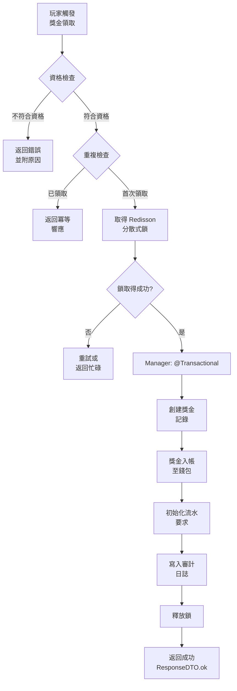

# 促銷活動實作（Promotion Implementation）

> **規範來源**: [00-13_Promotion_Implementation.md](../../source-archive/00_Foundation/guides/00-13_Promotion_Implementation.md)
> **目標讀者**: 架構師、後端工程師、產品工程師
> **業務需求**: [Promotion_Requirements.md](../../requirements/04_Promotions_VIP/Promotion_Requirements.md)
> **最後同步**: 2026-02-08

---

## 1. 概述（Overview）

本文檔涵蓋 iGaming 平台促銷系統的技術實作，包括獎金發放引擎、投注要求追蹤、以及 VIP 階層系統。所有實作均遵循 SmartAdmin 分層架構模式。

---

## 2. 獎金發放引擎（Bonus Distribution Engine）

**狀態（Status）**: PLANNED (Phase 5+)
**模組（Modules）**: 04_Activity_Center, 01_Core_Financial_Loop

### 實作目標（Implementation Goal）

建構可配置的獎金類型定義、分發邏輯的規則引擎、觸發條件管理、以及錢包整合以進行獎金資金分配。

### 實作閱讀順序（Implementation Reading Order）

| 順序 | 文檔 | 章節 | 重點 |
|-------|----------|---------|-------|
| 1 | [04-04 Activity Bonus](../../source-archive/04_Activity_Center/04-04_Activity_Bonus.md) | S3 Rule Engine | 獎金發放邏輯 |
| 2 | [04-04 Activity Bonus](../../source-archive/04_Activity_Center/04-04_Activity_Bonus.md) | Full doc | 計算公式 |
| 3 | [02-06 Wallet Architecture](../../source-archive/02_Finance_Center/02-06_Wallet_Architecture.md) | S2 Bonus Wallet | 錢包整合 |

### SmartAdmin 層級對應（SmartAdmin Layer Mapping）

| 層級 | 職責 |
|-------|---------------|
| Controller | 獎金領取 API，活動查詢 API（`@SaCheckPermission` 用於管理員，`@NoNeedLogin` 用於公開活動列表） |
| Service | 獎金資格驗證，領取處理（Vavr Option 用於玩家/活動查詢） |
| Manager | @Transactional 獎金發放 + 錢包入帳（原子操作），@Cacheable 活動配置 |
| Dao | 獎金記錄 CRUD，活動配置查詢透過 MyBatis Plus |

### 獎金處理流程（Bonus Processing Flow）



### 資料庫架構（Database Schema）

```sql
-- Promotion rule configuration
CREATE TABLE promotion_rules (
    id              BIGSERIAL PRIMARY KEY,
    promotion_code  VARCHAR(64) NOT NULL UNIQUE,
    promotion_name  VARCHAR(128) NOT NULL,
    promotion_type  VARCHAR(32) NOT NULL,  -- FIRST_DEPOSIT, RELOAD, WAGERING, ACTIVITY
    status          VARCHAR(16) NOT NULL DEFAULT 'ACTIVE',  -- ACTIVE, PAUSED, EXPIRED
    start_time      TIMESTAMP NOT NULL,
    end_time        TIMESTAMP NOT NULL,
    min_deposit     NUMERIC(18,2) DEFAULT 0,
    bonus_rate      NUMERIC(8,4),          -- e.g. 1.0000 = 100% match
    max_bonus       NUMERIC(18,2),
    wagering_multi  NUMERIC(8,2) DEFAULT 1.00,  -- wagering multiplier
    tenant_id       BIGINT NOT NULL,
    created_at      TIMESTAMP NOT NULL DEFAULT NOW(),
    updated_at      TIMESTAMP NOT NULL DEFAULT NOW(),
    deleted         BOOLEAN NOT NULL DEFAULT FALSE
);

CREATE INDEX idx_promotion_rules_tenant_status ON promotion_rules(tenant_id, status);
CREATE INDEX idx_promotion_rules_time ON promotion_rules(start_time, end_time);

-- Player bonus claim records
CREATE TABLE player_bonus_records (
    id                  BIGSERIAL PRIMARY KEY,
    player_id           BIGINT NOT NULL,
    promotion_id        BIGINT NOT NULL REFERENCES promotion_rules(id),
    claim_id            VARCHAR(64) NOT NULL UNIQUE,  -- idempotency key
    bonus_amount        NUMERIC(18,2) NOT NULL,
    wagering_required   NUMERIC(18,2) NOT NULL DEFAULT 0,
    wagering_completed  NUMERIC(18,2) NOT NULL DEFAULT 0,
    status              VARCHAR(16) NOT NULL DEFAULT 'PENDING',  -- PENDING, ACTIVE, COMPLETED, EXPIRED, CANCELLED
    claimed_at          TIMESTAMP NOT NULL DEFAULT NOW(),
    completed_at        TIMESTAMP,
    expired_at          TIMESTAMP,
    tenant_id           BIGINT NOT NULL,
    created_at          TIMESTAMP NOT NULL DEFAULT NOW(),
    updated_at          TIMESTAMP NOT NULL DEFAULT NOW(),
    deleted             BOOLEAN NOT NULL DEFAULT FALSE
);

CREATE UNIQUE INDEX idx_player_bonus_dedup ON player_bonus_records(player_id, promotion_id, claim_id);
CREATE INDEX idx_player_bonus_status ON player_bonus_records(player_id, status);
CREATE INDEX idx_player_bonus_expiry ON player_bonus_records(status, expired_at) WHERE status = 'ACTIVE';
```

### 關鍵技術考量（Key Technical Considerations）

- **分散式鎖（Distributed Lock）**: 使用 Redisson `RLock` 防止並發重複領取
- **冪等性（Idempotency）**: 領取操作必須冪等（使用 claim_id 作為去重鍵）
- **錢包整合（Wallet Integration）**: 獎金入帳至錢包必須與獎金記錄創建原子性執行（Manager @Transactional）
- **規則引擎（Rule Engine）**: 考慮使用 LiteFlow 進行複雜的獎金規則評估鏈

### 驗證檢查清單（Verification Checklist）

- [ ] 獎金類型配置正確（首存、流水、活動等）
- [ ] 分發規則引擎運作正常
- [ ] 防重複領取機制有效
- [ ] 獎金錢包餘額正確

### 常見陷阱（Common Pitfalls）

1. **重複領取（Duplicate Claims）**: 並發請求繞過驗證 -- 使用 Redisson 分散式鎖
2. **流水未完成（Incomplete Wagering）**: 在未檢查流水的情況下發放新獎金 -- 發放前查詢未完成的流水
3. **過期獎金（Expired Bonuses）**: 過期記錄未清理 -- 透過 Snail-Job 排程清理

---

## 3. 投注要求追蹤（Wagering Requirement Tracking）

**狀態（Status）**: PLANNED (Phase 5+)
**模組（Modules）**: 04_Activity_Center, 02_Game_Operations

### 實作目標（Implementation Goal）

實作流水計算邏輯、即時進度追蹤、以及完成通知，並支援遊戲權重感知的貢獻核算。

### 實作閱讀順序（Implementation Reading Order）

| 順序 | 文檔 | 章節 | 重點 |
|-------|----------|---------|-------|
| 1 | [03-04 Turnover Calculation](../../source-archive/03_Game_Center/03-04_Turnover_Calculation.md) | S1 Three-Layer Validation | 有效投注演算法 |
| 2 | [04-04 Activity Bonus](../../source-archive/04_Activity_Center/04-04_Activity_Bonus.md) | S5 Wagering Requirements | 流水計算 |
| 3 | [04-04 Activity Bonus](../../source-archive/04_Activity_Center/04-04_Activity_Bonus.md) | S4 Wagering Tracking | 進度記錄 |

### SmartAdmin 層級對應（SmartAdmin Layer Mapping）

| 層級 | 職責 |
|-------|---------------|
| Controller | 流水進度查詢 API，完成狀態端點 |
| Service | 流水計算邏輯，遊戲權重解析（Vavr Option 用於可選的遊戲配置） |
| Manager | @Transactional 流水進度更新（投注結算事件），@Cacheable 遊戲權重配置 |
| Dao | 流水進度記錄，遊戲權重配置查詢 |

### 流水計算邏輯（Wagering Calculation Logic）

```
effective_wagering = bet_amount * game_weight_percentage
total_progress = SUM(effective_wagering) across all qualifying bets
requirement_met = total_progress >= required_wagering_amount
```

### 遊戲權重配置（Game Weight Configuration）

| 遊戲類別 | 權重 | 貢獻公式 |
|--------------|--------|---------------------|
| Slots | 100% | `bet_amount * 1.0` |
| Table Games | 50% | `bet_amount * 0.5` |
| Live Casino | 25% | `bet_amount * 0.25` |
| Sports | Variable | `bet_amount * configured_weight` |

### 事件驅動架構（Event-Driven Architecture）

- **投注結算事件（Bet Settlement Event）**: 觸發流水進度重新計算
- **投注取消事件（Bet Cancellation Event）**: 觸發從累積進度中扣除
- **完成事件（Completion Event）**: 觸發通知和獎金釋放

### 驗證檢查清單（Verification Checklist）

- [ ] 有效投注 (Valid Turnover) 計算準確
- [ ] 流水進度即時更新
- [ ] 完成通知及時發送
- [ ] 歷史流水記錄可追溯

### 常見陷阱（Common Pitfalls）

1. **遊戲權重錯誤（Game Weight Errors）**: 不同遊戲的權重不正確 -- 在 Manager 中使用 @Cacheable 集中管理權重配置
2. **取消投注處理（Cancelled Bet Handling）**: 必須在取消事件時扣除已計算的流水
3. **跨日累積（Cross-Day Accumulation）**: 流水必須跨日累積直到完成

---

## 4. VIP 階層系統（VIP Tier System）

**狀態（Status）**: PLANNED (Phase 5+)
**模組（Modules）**: 01_Player_Center, 04_Activity_Center

### 實作目標（Implementation Goal）

實作階層定義、升降級規則、點數計算、以及專屬福利管理。

### 實作閱讀順序（Implementation Reading Order）

| 順序 | 文檔 | 章節 | 重點 |
|-------|----------|---------|-------|
| 1 | [01-06 VIP Loyalty](../../source-archive/01_Player_Center/01-06_VIP_Loyalty.md) | S2 Tier System | VIP 定義 |
| 2 | [01-06 VIP Loyalty](../../source-archive/01_Player_Center/01-06_VIP_Loyalty.md) | S3 Upgrade Rules | 點數計算 |
| 3 | [01-06 VIP Loyalty](../../source-archive/01_Player_Center/01-06_VIP_Loyalty.md) | S4 Benefits Config | 專屬福利 |

### SmartAdmin 層級對應（SmartAdmin Layer Mapping）

| 層級 | 職責 |
|-------|---------------|
| Controller | VIP 狀態查詢，階層福利端點 |
| Service | 階層計算，升降級評估（Vavr Option 用於玩家階層查詢） |
| Manager | @Transactional 階層變更操作（升級/降級 + 福利啟用），@Cacheable 階層定義 |
| Dao | VIP 階層記錄，點數歷史，福利配置 |

### 階層變更邏輯（Tier Change Logic）

```
// Upgrade check (triggered on points accumulation)
if (player.totalPoints >= nextTier.requiredPoints) {
    // Manager: @Transactional upgrade + benefit activation
    vipManager.upgradeTier(playerId, nextTier);
}

// Downgrade check (scheduled task via Snail-Job)
if (player.periodPoints < currentTier.retentionPoints
    && gracePeriod.isExpired()) {
    // Manager: @Transactional downgrade + benefit removal
    vipManager.downgradeTier(playerId, lowerTier);
}
```

### 點數生命週期（Points Lifecycle）

| 事件 | 點數動作 |
|-------|--------------|
| Bet Settlement | 根據投注金額發放點數 |
| Deposit | 發放存款獎勵點數 |
| Points Expiration | 排程清理過期點數 |
| Tier Downgrade | 重置點數用於保級計算 |

### 驗證檢查清單（Verification Checklist）

- [ ] VIP 階層計算正確
- [ ] 升級觸發準確
- [ ] 降級機制運作正常
- [ ] 專屬福利生效

### 常見陷阱（Common Pitfalls）

1. **降級規則（Demotion Rules）**: 必須定義保級條件和寬限期緩衝
2. **福利停用（Benefit Deactivation）**: 降級時移除專屬福利 -- 透過 Manager @Transactional 觸發
3. **點數過期（Points Expiration）**: 透過 Snail-Job 定期清理點數

---

## 5. 參考文檔（Reference Documents）

| 領域 | 文檔 |
|------|----------|
| Activity Bonus | [04-04 Activity Bonus](../../source-archive/04_Activity_Center/04-04_Activity_Bonus.md) |
| Turnover Calculation | [03-04 Turnover Calculation](../../source-archive/03_Game_Center/03-04_Turnover_Calculation.md) |
| VIP & Loyalty | [01-06 VIP Loyalty](../../source-archive/01_Player_Center/01-06_VIP_Loyalty.md) |
| Wallet Architecture | [02-06 Wallet Architecture](../../source-archive/02_Finance_Center/02-06_Wallet_Architecture.md) |

---

**文檔版本**: 1.0.0
**最後更新**: 2026-02-08
**來源版本**: 4.0.0
