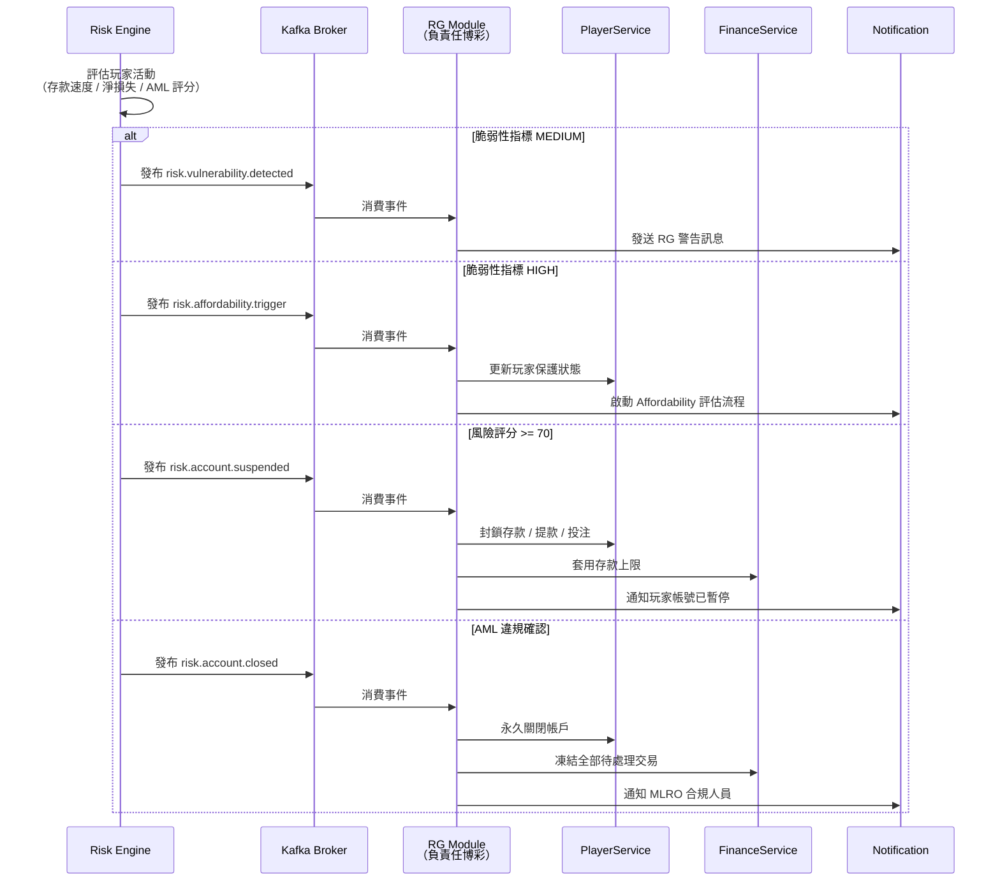

# 玩家保護 API 技術規格（Player Protection API）— Risk Engine 觸發機制

> **規範來源**: [15-07_Player_Protection_API.md](../../source-archive/15_Responsible_Gambling/15-07_Player_Protection_API.md)
> **目標讀者**: Architects, Backend Developers
> **業務需求**: [Player_Protection_Requirements.md](../../requirements/05_Risk_Compliance/08_Player_Protection_Requirements.md)
> **最後同步**: 2026-02-08

> **職責邊界（Responsibility Boundary）**：本文件（Risk Engine）負責**觸發機制（何時觸發保護）**。執行策略（如何執行保護）詳見：[RG Player Protection API](../15_Responsible_Gambling/04_Player_Protection_API.md)

---

## 觸發與執行流程概覽



---

## 1. 概述（Overview）

本文件定義 Risk Engine 如何決定**何時觸發**玩家保護行動。具體保護執行策略（API 端點規格、資料庫結構、Controller 實作）請參閱 [RG Player Protection API](../15_Responsible_Gambling/04_Player_Protection_API.md)。

---

## 2. 觸發條件（Trigger Conditions）

Risk Engine 依以下規則決定是否觸發玩家保護介入：

### 2.1 風控驅動的保護觸發

| 觸發來源 | 觸發條件 | 保護行動 |
|---------|---------|---------|
| **Affordability 評估** | 年度淨損失 >= GBP 125/500/2,000 或月度淨存款 >= GBP 150 | 觸發評估流程（詳見 Affordability SSOT） |
| **財務脆弱性偵測** | 追逐損失（HIGH）/ 存款速度（MEDIUM）/ 異常模式（MEDIUM） | 觸發警告或完整評估 |
| **AML 風險標記** | 風險評分 >= 70 或 AML 警報 | 帳戶凍結 / 強制 KYC 升級 |
| **詐欺行為確認** | 對沖偵測 / 多帳號偵測 | 帳戶停權或關閉 |

### 2.2 觸發決策流程

```
Risk Engine 評估玩家活動
    |
    +-- 年度淨損失 / 月度淨存款達閾值 --> 觸發 Affordability 評估
    +-- 脆弱性指標 HIGH --> 觸發完整保護評估 + 關懷訊息
    +-- 脆弱性指標 MEDIUM --> 觸發 RG 警告訊息
    +-- 風險評分 >= 70 --> 帳戶 SUSPENDED 狀態
    +-- AML 警報 --> 凍結帳戶 + 通知 MLRO
```

### 2.3 觸發事件發布（Domain Events）

Risk Engine 發布以下事件，由 RG 模組消費並執行保護行動：

| 事件名稱 | 觸發條件 | RG 模組處理 |
|---------|---------|-----------|
| `risk.affordability.trigger` | Affordability 閾值達到 | 啟動評估流程 |
| `risk.vulnerability.detected` | 脆弱性指標偵測到 | 發送警告 / 觸發評估 |
| `risk.account.suspended` | 風險評分 >= 70 | 封鎖存款/提款/投注 |
| `risk.account.closed` | AML 違規確認 | 永久關閉帳戶 |

---

## 3. 相關文件（Related Documents）

| 主題 | 文檔 |
|-----|------|
| **執行策略（API 端點、DB Schema、Controller）** | [RG Player Protection API](../15_Responsible_Gambling/04_Player_Protection_API.md) |
| **Affordability 業務規則（SSOT）** | [Affordability Requirements](../../requirements/05_Risk_Compliance/09_Affordability_Requirements.md) |
| **Affordability 架構實作** | [Affordability Implementation](09_Affordability_Implementation.md) |
| **業務需求** | [Player_Protection_Requirements.md](../../requirements/05_Risk_Compliance/08_Player_Protection_Requirements.md) |
| **玩家狀態管理** | [Player Lifecycle Implementation](../01_Player_Service/01_Player_Lifecycle_Implementation.md) |

---

**文檔版本**: 2.0.0
**最後更新**: 2026-03-31
**維護團隊**: SmartAdmin Architecture Team
