# 有效投注額驗證架構（Turnover Validation Architecture）

> **規範來源**: [05-07_Turnover_Validation_Scheme.md](../../source-archive/05_Risk_Control/05-07_Turnover_Validation_Scheme.md)
> **目標讀者**: Architects, Backend Engineers, Database Engineers
> **業務需求**: [Turnover_Validation_Requirements.md](../../requirements/05_Risk_Compliance/10_Turnover_Validation_Requirements.md)
> **最後同步**: 2026-02-08

---

## 1. 問題描述（Problem Statement）

### 1.1 長週期性能瓶頸（Long-Cycle Performance Bottleneck）

當玩家數年未提款（3--5 年）時，提款流程必須計算自上次提款以來的所有有效投注額。傳統的全表掃描方法存在嚴重的性能問題：

| 問題 | 影響 |
|---------|--------|
| 查詢耗時 | 多年數據掃描可能超過 30 秒 |
| 數據庫壓力 | 全表掃描導致 I/O 峰值 |
| 超時風險 | 提款請求因查詢超時而失敗 |

### 1.2 活動風控缺口（Activity Risk Control Gap）

現有系統缺乏對獎金套利的保護：
- 低賠率投注以完成投注要求（套利）
- 對沖投注以消除風險後提取獎金
- 缺乏標記無效有效投注額貢獻的機制

### 1.3 有效投注額驗證決策樹（Turnover Validation Decision Tree）

以下流程圖說明了從提款請求到快照創建的完整有效投注額驗證流程：

```mermaid
flowchart TD
    Start[玩家請求提款]

    subgraph "步驟 1: 快照檢索"
        GetSnapshot[查詢最新快照<br/>snapshotDao.findLatest playerId]
        CheckSnapshot{快照<br/>存在?}
        UseZero[使用 TurnoverSnapshot.ZERO<br/>首次提款]
        UseSnapshot[使用上次快照<br/>totalValidBet, snapshotTime]
    end

    subgraph "步驟 2: 實時聚合"
        GetCurrent[查詢當前有效投注<br/>betRecordDao.sumValidBet playerId]
        CalcDiff[計算週期有效投注額<br/>periodValidBet = current - snapshot]
    end

    subgraph "步驟 3: 投注有效性規則"
        CheckBetRules[對每個投注應用有效性規則]
        LowOdds{賠率 < 1.3?}
        HedgeBet{檢測到<br/>對沖投注?}
        MinBetBonus{最低投注 +<br/>活動投注要求?}
        SameEventOpp{同一賽事<br/>相反投注?}
        ValidBet[有效投注額 = 投注金額]
        InvalidBet[有效投注額 = 0]
    end

    subgraph "步驟 4: 要求計算"
        CalcRequired[計算所需投注要求<br/>depositAmount × multiplier + bonusAmount × multiplier]
        Compare{periodValidBet >=<br/>requiredTurnover?}
    end

    subgraph "步驟 5: 風險提案檢查"
        QueryProposals[查詢未解決的風險提案<br/>時間範圍: lastSnapshotTime → NOW]
        CheckProposals{存在 URGENT/HIGH<br/>提案?}
    end

    subgraph "步驟 6: 驗證結果"
        PassWithRisk[通過但有風險警告<br/>需要人工審核]
        Pass[通過<br/>繼續提款]
        Fail[失敗<br/>拒絕提款]
    end

    subgraph "步驟 7: 提款後快照"
        CreateSnapshot[創建新快照<br/>INSERT INTO t_player_turnover_snapshot<br/>snapshotType = WITHDRAWAL]
        SnapshotData[記錄:<br/>totalBet, totalValidBet, totalWin<br/>triggerId = withdrawalId]
    end

    Start --> GetSnapshot
    GetSnapshot --> CheckSnapshot

    CheckSnapshot -->|否| UseZero
    CheckSnapshot -->|是| UseSnapshot

    UseZero --> GetCurrent
    UseSnapshot --> GetCurrent

    GetCurrent --> CalcDiff
    CalcDiff --> CheckBetRules

    CheckBetRules --> LowOdds
    LowOdds -->|是| InvalidBet
    LowOdds -->|否| HedgeBet

    HedgeBet -->|是| InvalidBet
    HedgeBet -->|否| MinBetBonus

    MinBetBonus -->|是| InvalidBet
    MinBetBonus -->|否| SameEventOpp

    SameEventOpp -->|是| InvalidBet
    SameEventOpp -->|否| ValidBet

    InvalidBet --> CalcRequired
    ValidBet --> CalcRequired

    CalcRequired --> Compare

    Compare -->|否| Fail
    Compare -->|是| QueryProposals

    QueryProposals --> CheckProposals

    CheckProposals -->|是| PassWithRisk
    CheckProposals -->|否| Pass

    Pass --> CreateSnapshot
    CreateSnapshot --> SnapshotData
    SnapshotData --> End[提款批准]

    PassWithRisk --> End2[升級至人工審核]
    Fail --> End3[拒絕通知]

    style GetSnapshot fill:#e1f5ff
    style UseZero fill:#e1f5ff
    style UseSnapshot fill:#e1f5ff
    style GetCurrent fill:#fff4e6
    style CalcDiff fill:#fff4e6
    style CheckBetRules fill:#ffe6e6
    style LowOdds fill:#ffe6e6
    style HedgeBet fill:#ffe6e6
    style MinBetBonus fill:#ffe6e6
    style SameEventOpp fill:#ffe6e6
    style InvalidBet fill:#ffcccc
    style ValidBet fill:#ccffcc
    style CalcRequired fill:#e6ffe6
    style Compare fill:#e6ffe6
    style QueryProposals fill:#f3e5f5
    style CheckProposals fill:#f3e5f5
    style Pass fill:#d4edda
    style PassWithRisk fill:#fff3cd
    style Fail fill:#f8d7da
    style CreateSnapshot fill:#cce5ff
    style SnapshotData fill:#cce5ff
```



**決策樹階段**：

1. **快照檢索（Snapshot Retrieval）**: O(1) 索引掃描於 `(player_id, snapshot_time DESC)`
2. **實時聚合（Real-Time Aggregation）**: 查詢預聚合計數器以獲取當前有效投注
3. **投注有效性規則（Bet Validity Rules）**: 應用 4 個無效有效投注額過濾器（低賠率、對沖、最低投注獎金、同賽事相反）
4. **要求計算（Requirement Calculation）**: 比較週期有效投注額與存款/獎金倍數要求
5. **風險提案檢查（Risk Proposal Check）**: 查詢與上次快照對齊的時間窗口內的未解決提案
6. **驗證結果（Validation Result）**: 3 種結果 - 通過、通過但有風險警告、失敗
7. **提款後快照（Post-Withdrawal Snapshot）**: 為下一個驗證週期創建檢查點

**性能特性**：
- 快照檢索: < 5ms（索引掃描）
- 有效投注求和: < 10ms（預聚合）
- 風險提案查詢: < 20ms（時間範圍索引掃描）
- 總驗證時間: < 50ms (P95)

---

## 2. 檢查點快照設計（Checkpoint Snapshot Design）

### 2.1 核心機制（Core Mechanism）

在每次成功提款時記錄累積有效投注額快照。後續驗證僅計算差值。

**驗證公式**：

```
週期有效投注額 = 當前總有效投注（實時） - 上次快照總有效投注
```

**性能**: O(1) -- 無論時間跨度如何都是常數時間。

### 2.2 數據庫架構（Database Schema）

```sql
CREATE TABLE t_player_turnover_snapshot (
    id              BIGSERIAL PRIMARY KEY,
    player_id       BIGINT NOT NULL,
    tenant_id       BIGINT NOT NULL,
    -- Snapshot data
    total_bet       NUMERIC(18, 2) NOT NULL DEFAULT 0,   -- Cumulative total bets
    total_valid_bet NUMERIC(18, 2) NOT NULL DEFAULT 0,   -- Cumulative valid turnover
    total_win       NUMERIC(18, 2) NOT NULL DEFAULT 0,   -- Cumulative total winnings
    -- Snapshot trigger info
    snapshot_type   VARCHAR(30) NOT NULL,                 -- WITHDRAWAL / MANUAL / SCHEDULED
    trigger_id      BIGINT,                               -- Associated withdrawal order ID
    -- Timestamps
    snapshot_time   TIMESTAMP NOT NULL DEFAULT NOW(),
    created_at      TIMESTAMP NOT NULL DEFAULT NOW(),

    CONSTRAINT idx_player_snapshot UNIQUE (player_id, snapshot_time)
);

CREATE INDEX idx_snapshot_player_latest
    ON t_player_turnover_snapshot (player_id, snapshot_time DESC);

COMMENT ON TABLE t_player_turnover_snapshot IS '玩家有效投注額快照 -- 每次成功提款時創建';
COMMENT ON COLUMN t_player_turnover_snapshot.total_valid_bet IS '累積有效投注額（排除無效投注）';
```

**索引策略**：
- `(player_id, snapshot_time)` 上的唯一約束防止重複快照
- `(player_id, snapshot_time DESC)` 上的降序索引優化「查找最新快照」查詢

---

## 3. 驗證服務實現（Validation Service Implementation）

```java
/**
 * Manager class for turnover validation operations.
 * SmartAdmin Pattern: @Transactional only in Manager layer with @Component.
 */
@Component
@RequiredArgsConstructor
public class TurnoverValidationManager {

    private final TurnoverSnapshotDao snapshotDao;
    private final BetRecordDao betRecordDao;

    /**
     * Validate whether player turnover meets withdrawal requirements.
     * Performance: O(1) -- only queries latest snapshot + real-time aggregate.
     */
    public TurnoverResult validateTurnover(Long playerId, BigDecimal requiredMultiplier) {
        // 1. Get last snapshot
        TurnoverSnapshot lastSnapshot = snapshotDao.findLatest(playerId)
            .orElse(TurnoverSnapshot.ZERO);  // First withdrawal: snapshot is 0

        // 2. Get current real-time valid turnover
        BigDecimal currentValidBet = betRecordDao.sumValidBet(playerId);

        // 3. Calculate period valid turnover
        BigDecimal periodValidBet = currentValidBet.subtract(lastSnapshot.getTotalValidBet());

        // 4. Calculate required turnover
        BigDecimal requiredTurnover = calculateRequired(playerId, requiredMultiplier);

        // 5. Determine result
        boolean passed = periodValidBet.compareTo(requiredTurnover) >= 0;

        return TurnoverResult.builder()
            .playerId(playerId)
            .periodValidBet(periodValidBet)
            .requiredTurnover(requiredTurnover)
            .passed(passed)
            .lastSnapshotTime(lastSnapshot.getSnapshotTime())
            .build();
    }

    /**
     * Create a new snapshot after successful withdrawal.
     */
    @Transactional(rollbackFor = Throwable.class)
    public void createSnapshot(Long playerId, Long withdrawalId) {
        BigDecimal currentTotalBet = betRecordDao.sumTotalBet(playerId);
        BigDecimal currentValidBet = betRecordDao.sumValidBet(playerId);
        BigDecimal currentTotalWin = betRecordDao.sumTotalWin(playerId);

        TurnoverSnapshot snapshot = TurnoverSnapshot.builder()
            .playerId(playerId)
            .totalBet(currentTotalBet)
            .totalValidBet(currentValidBet)
            .totalWin(currentTotalWin)
            .snapshotType("WITHDRAWAL")
            .triggerId(withdrawalId)
            .build();

        snapshotDao.insert(snapshot);
    }
}
```

**關鍵設計說明**：
- `findLatest()` 使用降序索引返回最新快照 -- 單行提取
- `sumValidBet()` 使用預聚合計數器或物化視圖進行 O(1) 實時查找
- `@Transactional` 按照 SmartAdmin 架構規則放置在 Manager/Service 層
- 首次提款使用 `TurnoverSnapshot.ZERO` 作為基線（所有累積值 = 0）

---

## 4. 時間窗口與風險提案對齊（Time Window Alignment with Risk Proposals）

「完全一致性」原則要求有效投注額驗證和風險提案查詢使用相同的時間邊界：

| 維度 | 查詢範圍 | 描述 |
|-----------|-------------|-------------|
| 風險提案查詢 | 上次快照時間 --> 現在 | 自上次提款以來所有未解決的提案 |
| 有效投注額驗證 | 上次快照時間 --> 現在 | 差值計算 |
| 長週期處理 | 無固定天數限制 | 即使是 5 年間隔，也查詢自上次快照以來的所有 URGENT/HIGH 提案 |

這種對齊消除了邊緣情況，即 2 年前的風險標記可能被固定的 30 天窗口遺漏。

---

## 5. 活動風險集成（Activity Risk Integration）—— 雙層架構（Dual-Layer Architecture）

### 5.1 架構概覽（Architecture Overview）

```
+---------------------------------------------+
|          活動風險雙層架構                     |
+--------------------+------------------------+
|  預防層            |  檢測層                 |
|  (Pre-emptive)     |  (Post-hoc)            |
+--------------------+------------------------+
|  - 領取攔截        |  - 提款前掃描            |
|    - IP 檢查       |    - 異常提案            |
|    - 設備指紋      |    - 風險規則觸發         |
|  - 投注攔截        |  - 報告                 |
|    - 低賠率        |    - 活動 ROI           |
|      --> 有效投注額 0 |    - 濫用者列表         |
|    - 對沖投注      |                        |
|      --> 有效投注額 0 |                        |
+--------------------+------------------------+
```

### 5.2 無效有效投注額規則（Invalid Turnover Rules）

| 規則代碼 | 條件 | 有效投注額貢獻 |
|-----------|-----------|----------------------|
| `LOW_ODDS` | 賠率 < 1.3 | 0（零） |
| `HEDGE_BET` | 檢測到對沖投注組合 | 0（零） |
| `MIN_BET_BONUS` | 最低投注金額 + 活動投注要求 | 0（零） |
| `SAME_EVENT_OPPOSITE` | 同一賽事的相反投注 | 0（零） |

### 5.3 有效投注計算邏輯（Valid Bet Calculation Logic）

```java
public BigDecimal calculateValidBet(BetRecord bet) {
    // Low-odds check
    if (bet.getOdds().compareTo(new BigDecimal("1.3")) < 0) {
        return BigDecimal.ZERO;  // Turnover contribution = 0
    }

    // Hedge bet check
    if (hedgeDetector.isHedgeBet(bet)) {
        return BigDecimal.ZERO;
    }

    // Normal bet: full amount counts as valid turnover
    return bet.getBetAmount();
}
```

---

## 6. 數據流（Data Flow）

### 6.1 提款驗證流程（Withdrawal Validation Flow）

```
玩家請求提款
    |
    v
TurnoverValidationService.validateTurnover(playerId, multiplier)
    |
    +---> snapshotDao.findLatest(playerId)     [O(1) 索引掃描]
    |         |
    |         v
    |     上次快照（如果是首次則為 ZERO）
    |
    +---> betRecordDao.sumValidBet(playerId)   [O(1) 預聚合]
    |         |
    |         v
    |     當前累積有效投注
    |
    +---> 計算: current - lastSnapshot = periodValidBet
    |
    +---> 比較: periodValidBet >= requiredTurnover
    |
    v
TurnoverResult { passed: boolean, periodValidBet, requiredTurnover }
```

### 6.2 快照創建流程（Snapshot Creation Flow）

```
提款批准並完成
    |
    v
TurnoverValidationService.createSnapshot(playerId, withdrawalId)
    |
    +---> betRecordDao.sumTotalBet(playerId)
    +---> betRecordDao.sumValidBet(playerId)
    +---> betRecordDao.sumTotalWin(playerId)
    |
    v
INSERT INTO t_player_turnover_snapshot
    (player_id, tenant_id, total_bet, total_valid_bet, total_win,
     snapshot_type='WITHDRAWAL', trigger_id=withdrawalId)
```

---

## 7. UI 集成點（UI Integration Points）

### 7.1 提案審核頁面（Proposal Review Page）

- 突出標籤：「關聯風險」、「活動套利」、「獎金追逐」
- 顯示關聯促銷名稱和投注要求完成進度

### 7.2 投注詳情頁面（Bet Details Page）

- 無效有效投注額標籤：`[低賠率] 有效投注額: 0.00`、`[對沖] 有效投注額: 0.00`
- 每個玩家的有效投注額百分比統計

---

## 8. 性能特性（Performance Characteristics）

| 操作 | 複雜度 | 目標延遲 (P95) |
|-----------|------------|----------------------|
| 有效投注額驗證 | O(1) | < 50ms |
| 快照創建 | O(1) 每次 INSERT | < 100ms |
| 最新快照查找 | O(1) 索引掃描 | < 5ms |
| 有效投注求和 | O(1) 預聚合 | < 10ms |

---

## 9. 驗收標準（Acceptance Criteria）

- 快照機制：每次成功提款後自動創建快照
- O(1) 驗證：有效投注額驗證 < 50ms (P95)，與時間跨度無關
- 無效有效投注額：低賠率 / 對沖 / 獎金追逐投注計為零
- 時間對齊：風險提案查詢窗口 = 有效投注額驗證窗口 = 上次快照至現在
- UI 警報：審核頁面顯示活動風險標籤；投注頁面標記無效有效投注額

---

## 10. 相關文檔（Related Documents）

- [05-01 Risk Framework](../../source-archive/05_Risk_Control/05-01_Risk_Framework.md) -- 配置驅動的風險規則引擎
- [05-05 Risk Proposal Workflow](../../source-archive/05_Risk_Control/05-05_Risk_Proposal_Workflow.md) -- 提案生命週期管理
- [05-06 Withdrawal Risk Correlation](../../source-archive/05_Risk_Control/05-06_Withdrawal_Risk_Correlation.md) -- 提款風險評分

---

## 11. 版本歷史（Version History）

| 版本 | 日期 | 變更 |
|---------|------|---------|
| 1.0.0 | 2026-02-05 | 初始版本 -- 檢查點快照、雙層保護、無效有效投注額規則 |
