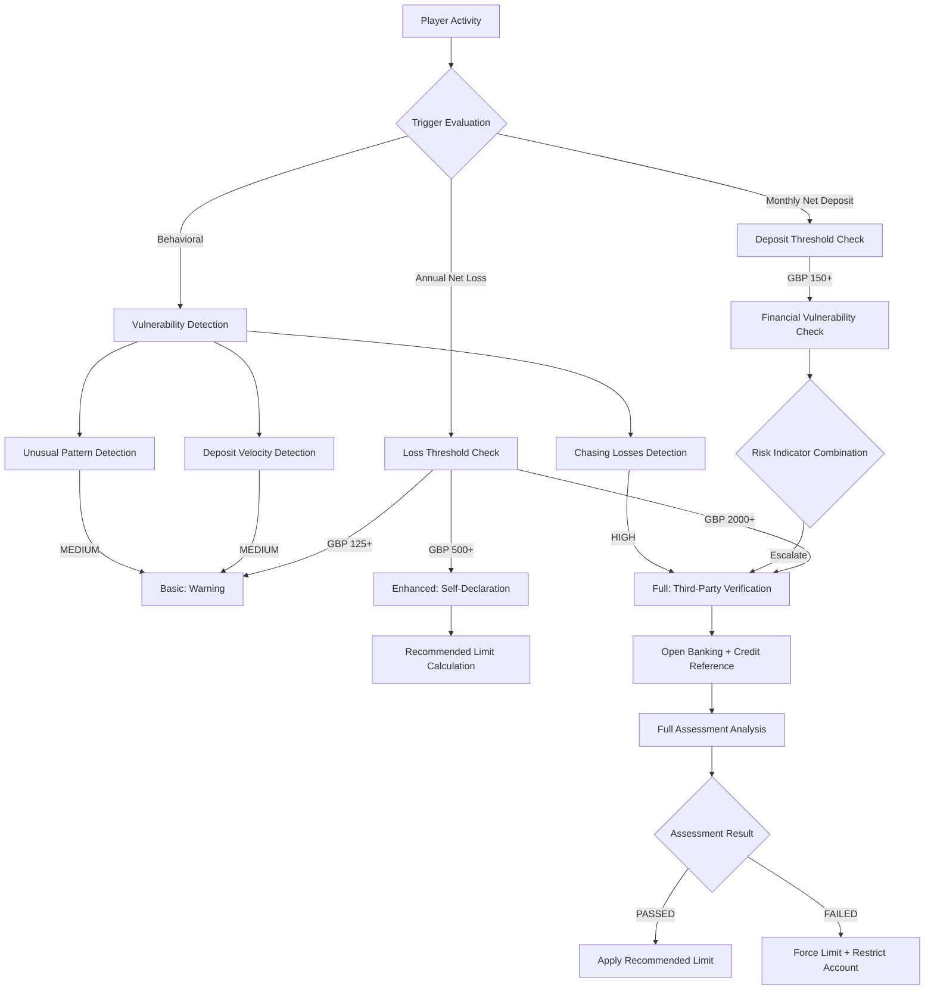

# Affordability Assessment Implementation (可負擔性評估技術實現)

> **Canonical Source**: [15-08_Affordability_Assessment.md](../../source/15_Responsible_Gambling/15-08_Affordability_Assessment.md)
> **Audience**: Architects, Backend Developers, DevOps
> **Related Doc**: [Affordability_Requirements.md](../../requirements/05_Risk_Compliance/Affordability_Requirements.md)
> **Last Synced**: 2026-02-08

---

## 1. Architecture Overview



---

## 2. Database Schema

### 2.1 Affordability Assessment Table

```sql
CREATE TABLE t_affordability_assessment (
    id                  BIGINT PRIMARY KEY AUTO_INCREMENT,
    player_id           BIGINT NOT NULL,
    assessment_type     VARCHAR(20) NOT NULL,  -- BASIC, ENHANCED, FULL
    trigger_reason      VARCHAR(50) NOT NULL,  -- NET_LOSS, DEPOSIT_VELOCITY, MANUAL
    trigger_value       DECIMAL(18,2),         -- Value at time of trigger

    -- Player self-declaration data
    declared_income_range       VARCHAR(20),   -- 10K-20K, 20K-30K, etc.
    declared_housing_status     VARCHAR(20),   -- OWNER, RENTER, LIVING_WITH_FAMILY
    declared_household_size     INT,
    declared_monthly_disposable DECIMAL(18,2),

    -- Third-party verification
    third_party_verified    BOOLEAN DEFAULT FALSE,
    third_party_provider    VARCHAR(50),       -- OPEN_BANKING, EXPERIAN, EQUIFAX
    third_party_result      JSON,
    verified_at             DATETIME,

    -- Assessment outcome
    assessment_result       VARCHAR(20),       -- PASSED, FAILED, PENDING, EXPIRED
    recommended_limit       DECIMAL(18,2),
    applied_limit           DECIMAL(18,2),
    risk_tier               VARCHAR(20),       -- LOW, MEDIUM, HIGH, CRITICAL

    -- Validity window
    valid_from              DATETIME NOT NULL,
    valid_until             DATETIME NOT NULL,

    -- Audit
    created_at              DATETIME DEFAULT CURRENT_TIMESTAMP,
    updated_at              DATETIME DEFAULT CURRENT_TIMESTAMP ON UPDATE CURRENT_TIMESTAMP,

    INDEX idx_player_id (player_id),
    INDEX idx_valid_until (valid_until),
    INDEX idx_assessment_result (assessment_result)
);
```

### 2.2 Financial Vulnerability Indicator Table

```sql
CREATE TABLE t_financial_vulnerability_indicator (
    id                  BIGINT PRIMARY KEY AUTO_INCREMENT,
    player_id           BIGINT NOT NULL,
    indicator_type      VARCHAR(50) NOT NULL,  -- CHASING_LOSSES, DEPOSIT_VELOCITY, UNUSUAL_PATTERN
    indicator_value     VARCHAR(255),
    severity            VARCHAR(20) NOT NULL,  -- LOW, MEDIUM, HIGH
    detected_at         DATETIME NOT NULL,
    resolved            BOOLEAN DEFAULT FALSE,
    resolved_at         DATETIME,
    resolution_action   VARCHAR(100),

    INDEX idx_player_id (player_id),
    INDEX idx_detected_at (detected_at)
);
```

### 2.3 Schema Extension for Monthly Net Deposit Trigger

```sql
-- Add trigger_type column for new UKGC 2025-02-28 rule
ALTER TABLE t_financial_vulnerability_check
ADD COLUMN trigger_type VARCHAR(50) NOT NULL DEFAULT 'ANNUAL_NET_LOSS'
COMMENT 'Trigger type: ANNUAL_NET_LOSS, MONTHLY_NET_DEPOSIT, DEPOSIT_VELOCITY, MANUAL';

-- Index for monthly net deposit query performance
CREATE INDEX idx_transaction_jurisdiction_date
ON t_transaction (jurisdiction, transaction_date, player_id);
```

---

## 3. Monthly Net Deposit Calculation

### 3.1 SQL Query

```sql
-- Calculate player monthly net deposits (rolling 30 days)
SELECT
    player_id,
    SUM(CASE WHEN transaction_type = 'DEPOSIT' THEN amount ELSE 0 END) AS total_deposits,
    SUM(CASE WHEN transaction_type = 'WITHDRAWAL' THEN amount ELSE 0 END) AS total_withdrawals,
    SUM(CASE WHEN transaction_type = 'DEPOSIT' THEN amount ELSE 0 END)
      - SUM(CASE WHEN transaction_type = 'WITHDRAWAL' THEN amount ELSE 0 END) AS monthly_net_deposit
FROM t_transaction
WHERE jurisdiction = 'UKGC'
  AND transaction_date >= CURRENT_DATE - INTERVAL 30 DAY
GROUP BY player_id
HAVING monthly_net_deposit >= 150;
```

### 3.2 Scheduled Task Implementation

```java
/**
 * Monthly net deposit GBP 150 financial vulnerability check (UKGC 2025-02-28)
 *
 * Runs daily, identifies players exceeding threshold without a recent check.
 */
@Scheduled(cron = "0 0 2 * * ?") // Daily at 02:00
public void checkMonthlyNetDepositThreshold() {
    LocalDateTime thirtyDaysAgo = LocalDateTime.now().minusDays(30);
    BigDecimal threshold = new BigDecimal("150");

    // Query UK players exceeding threshold
    List<PlayerNetDepositDTO> triggeredPlayers = transactionDao.findPlayersExceedingMonthlyNetDeposit(
        "UKGC",
        thirtyDaysAgo,
        threshold
    );

    for (PlayerNetDepositDTO player : triggeredPlayers) {
        // Check for existing valid assessment within 30 days
        boolean hasRecentCheck = vulnerabilityCheckDao.hasRecentCheck(
            player.getPlayerId(),
            VulnerabilityCheckType.MONTHLY_NET_DEPOSIT,
            thirtyDaysAgo
        );

        if (!hasRecentCheck) {
            // Create vulnerability check task
            createVulnerabilityCheckTask(player, TriggerReason.MONTHLY_NET_DEPOSIT_150);

            // Send notification to player
            notificationService.sendFinancialCheckReminder(player.getPlayerId());

            log.info("Monthly net deposit threshold triggered: playerId={}, amount=GBP{}",
                player.getPlayerId(), player.getMonthlyNetDeposit());
        }
    }
}
```

---

## 4. Core Service Implementation

### 4.1 AffordabilityAssessmentService

```java
@Service
@RequiredArgsConstructor
@Slf4j
public class AffordabilityAssessmentService {

    private final AffordabilityAssessmentDao assessmentDao;
    private final FinancialVulnerabilityDao vulnerabilityDao;
    private final DepositLimitService depositLimitService;
    private final OpenBankingClient openBankingClient;
    private final CreditReferenceClient creditClient;

    /**
     * Check whether an affordability assessment is required.
     */
    public Option<AssessmentRequirement> checkAssessmentRequired(Long playerId) {
        Option<AffordabilityAssessment> currentAssessmentOpt =
            assessmentDao.findLatestValid(playerId);

        BigDecimal annualNetLoss = calculateAnnualNetLoss(playerId);

        AssessmentType requiredType = determineAssessmentType(annualNetLoss);

        if (requiredType == null) {
            return Option.none();
        }

        if (currentAssessmentOpt.isDefined()) {
            AffordabilityAssessment current = currentAssessmentOpt.get();
            if (current.getAssessmentType().ordinal() >= requiredType.ordinal() &&
                current.getValidUntil().isAfter(LocalDateTime.now())) {
                return Option.none();
            }
        }

        return Option.some(AssessmentRequirement.builder()
            .type(requiredType)
            .reason(determineTriggerReason(annualNetLoss))
            .triggerValue(annualNetLoss)
            .build());
    }

    /**
     * Determine assessment type from annual net loss value.
     */
    private AssessmentType determineAssessmentType(BigDecimal annualNetLoss) {
        if (annualNetLoss.compareTo(new BigDecimal("2000")) > 0) {
            return AssessmentType.FULL;
        } else if (annualNetLoss.compareTo(new BigDecimal("500")) > 0) {
            return AssessmentType.ENHANCED;
        } else if (annualNetLoss.compareTo(new BigDecimal("125")) > 0) {
            return AssessmentType.BASIC;
        }
        return null;
    }

    /**
     * Submit player self-declaration (Enhanced tier).
     */
    @Transactional(rollbackFor = Throwable.class)
    public ResponseDTO<AssessmentResultVO> submitSelfDeclaration(
            Long playerId,
            SelfDeclarationForm form) {

        if (!validateDeclaration(form)) {
            return ResponseDTO.error(UserErrorCode.INVALID_DECLARATION);
        }

        BigDecimal recommendedLimit = calculateRecommendedLimit(form);

        AffordabilityAssessment assessment = AffordabilityAssessment.builder()
            .playerId(playerId)
            .assessmentType(AssessmentType.ENHANCED)
            .triggerReason(TriggerReason.NET_LOSS)
            .declaredIncomeRange(form.getIncomeRange())
            .declaredHousingStatus(form.getHousingStatus())
            .declaredHouseholdSize(form.getHouseholdSize())
            .declaredMonthlyDisposable(form.getMonthlyDisposable())
            .assessmentResult(AssessmentResult.PASSED)
            .recommendedLimit(recommendedLimit)
            .validFrom(LocalDateTime.now())
            .validUntil(LocalDateTime.now().plusMonths(3))
            .build();

        assessmentDao.insert(assessment);

        return ResponseDTO.ok(AssessmentResultVO.builder()
            .assessmentId(assessment.getId())
            .result(AssessmentResult.PASSED)
            .recommendedMonthlyLimit(recommendedLimit)
            .message("Assessment complete. Recommended monthly deposit limit: " + recommendedLimit)
            .build());
    }

    /**
     * Perform full assessment with third-party verification.
     */
    @Transactional(rollbackFor = Throwable.class)
    public ResponseDTO<AssessmentResultVO> performFullAssessment(
            Long playerId,
            FullAssessmentForm form) {

        // 1. Call Open Banking API
        OpenBankingResult obResult = null;
        if (form.isOpenBankingConsent()) {
            obResult = openBankingClient.getFinancialData(
                form.getBankAccountId(),
                form.getConsentToken()
            );
        }

        // 2. Call credit reference agency
        CreditReferenceResult crResult = creditClient.checkAffordability(
            form.getFirstName(),
            form.getLastName(),
            form.getDateOfBirth(),
            form.getPostcode()
        );

        // 3. Composite analysis
        FullAssessmentAnalysis analysis = analyzeFullAssessment(obResult, crResult);

        // 4. Determine risk tier and limit
        RiskTier riskTier = determineRiskTier(analysis);
        BigDecimal appliedLimit = calculateAppliedLimit(analysis, riskTier);

        // 5. Persist assessment record
        AffordabilityAssessment assessment = AffordabilityAssessment.builder()
            .playerId(playerId)
            .assessmentType(AssessmentType.FULL)
            .triggerReason(TriggerReason.NET_LOSS)
            .thirdPartyVerified(true)
            .thirdPartyProvider("OPEN_BANKING,EXPERIAN")
            .thirdPartyResult(JsonUtil.toJson(analysis))
            .verifiedAt(LocalDateTime.now())
            .assessmentResult(analysis.isPassed() ? AssessmentResult.PASSED : AssessmentResult.FAILED)
            .recommendedLimit(appliedLimit)
            .appliedLimit(appliedLimit)
            .riskTier(riskTier)
            .validFrom(LocalDateTime.now())
            .validUntil(LocalDateTime.now().plusMonths(6))
            .build();

        assessmentDao.insert(assessment);

        // 6. Force limit if assessment failed
        if (!analysis.isPassed()) {
            depositLimitService.forceApplyLimit(playerId, appliedLimit, "AFFORDABILITY_ASSESSMENT");
        }

        log.info("Full affordability assessment completed: playerId={}, result={}, limit={}",
            playerId, assessment.getAssessmentResult(), appliedLimit);

        return ResponseDTO.ok(AssessmentResultVO.builder()
            .assessmentId(assessment.getId())
            .result(assessment.getAssessmentResult())
            .riskTier(riskTier)
            .appliedMonthlyLimit(appliedLimit)
            .message(buildResultMessage(assessment))
            .build());
    }

    /**
     * Calculate recommended limit from self-declaration data.
     *
     * Rules:
     * - Base: 10% of monthly disposable income
     * - Household adjustment: -20% if household > 2
     * - Floor: GBP 50, Cap: GBP 2,000
     */
    private BigDecimal calculateRecommendedLimit(SelfDeclarationForm form) {
        BigDecimal monthlyDisposable = form.getMonthlyDisposable();

        BigDecimal maxGambling = monthlyDisposable.multiply(new BigDecimal("0.10"));

        if (form.getHouseholdSize() > 2) {
            maxGambling = maxGambling.multiply(new BigDecimal("0.8"));
        }

        return maxGambling.max(new BigDecimal("50")).min(new BigDecimal("2000"));
    }
}
```

---

## 5. Financial Vulnerability Detection

### 5.1 Scheduled Detection Service

```java
/**
 * Detect financial vulnerability indicators every 5 minutes.
 */
@Scheduled(fixedRate = 300000)
public void detectFinancialVulnerability() {
    List<Long> playerIds = getActivePlayerIds();

    for (Long playerId : playerIds) {
        List<VulnerabilityIndicator> indicators = new ArrayList<>();

        if (detectChasingLosses(playerId)) {
            indicators.add(VulnerabilityIndicator.builder()
                .type(IndicatorType.CHASING_LOSSES)
                .severity(Severity.HIGH)
                .build());
        }

        if (detectDepositVelocity(playerId)) {
            indicators.add(VulnerabilityIndicator.builder()
                .type(IndicatorType.DEPOSIT_VELOCITY)
                .severity(Severity.MEDIUM)
                .build());
        }

        if (detectUnusualPattern(playerId)) {
            indicators.add(VulnerabilityIndicator.builder()
                .type(IndicatorType.UNUSUAL_PATTERN)
                .severity(Severity.MEDIUM)
                .build());
        }

        for (VulnerabilityIndicator indicator : indicators) {
            recordAndHandleIndicator(playerId, indicator);
        }
    }
}
```

### 5.2 Chasing Losses Algorithm

```java
/**
 * Detect chasing losses pattern.
 *
 * Pattern: After a loss, player increases stake by >50%.
 * Threshold: 3 or more occurrences within the last 20 bets.
 */
private boolean detectChasingLosses(Long playerId) {
    List<BetRecord> recentBets = betHistoryService.getRecentBets(playerId, 20);

    int chasingCount = 0;
    BigDecimal previousStake = null;
    boolean previousWon = true;

    for (BetRecord bet : recentBets) {
        if (!previousWon && previousStake != null) {
            if (bet.getStake().compareTo(previousStake.multiply(new BigDecimal("1.5"))) > 0) {
                chasingCount++;
            }
        }
        previousStake = bet.getStake();
        previousWon = bet.getWinAmount().compareTo(bet.getStake()) > 0;
    }

    return chasingCount >= 3;
}
```

### 5.3 Deposit Velocity Algorithm

```java
/**
 * Detect abnormal deposit velocity.
 *
 * Pattern: 5+ deposits within 24 hours totalling >GBP 500.
 */
private boolean detectDepositVelocity(Long playerId) {
    LocalDateTime since = LocalDateTime.now().minusHours(24);
    List<DepositRecord> deposits = depositService.getDepositsSince(playerId, since);

    if (deposits.size() >= 5) {
        BigDecimal totalAmount = deposits.stream()
            .map(DepositRecord::getAmount)
            .reduce(BigDecimal.ZERO, BigDecimal::add);

        return totalAmount.compareTo(new BigDecimal("500")) > 0;
    }

    return false;
}
```

### 5.4 Indicator Response Handler

```java
/**
 * Record indicator and trigger appropriate action based on severity.
 */
private void recordAndHandleIndicator(Long playerId, VulnerabilityIndicator indicator) {
    FinancialVulnerabilityIndicator record = FinancialVulnerabilityIndicator.builder()
        .playerId(playerId)
        .indicatorType(indicator.getType().name())
        .severity(indicator.getSeverity().name())
        .detectedAt(LocalDateTime.now())
        .build();

    vulnerabilityDao.insert(record);

    switch (indicator.getSeverity()) {
        case HIGH -> {
            triggerFullAssessment(playerId, TriggerReason.VULNERABILITY_DETECTED);
            notificationService.sendConcernMessage(playerId);
        }
        case MEDIUM -> {
            notificationService.sendWarningMessage(playerId,
                "We have noticed increased gambling activity. Please ensure you are gambling within your means.");
        }
        case LOW -> {
            log.info("Low severity indicator detected: playerId={}, type={}",
                playerId, indicator.getType());
        }
    }
}
```

---

## 6. Open Banking Integration

```java
@Component
@RequiredArgsConstructor
@Slf4j
public class OpenBankingClient {

    private final RestTemplate restTemplate;

    @Value("${openbanking.api.url}")
    private String apiUrl;

    /**
     * Retrieve financial data via Open Banking (requires player consent).
     */
    public OpenBankingResult getFinancialData(String accountId, String consentToken) {
        HttpHeaders headers = new HttpHeaders();
        headers.set("Authorization", "Bearer " + consentToken);
        headers.setContentType(MediaType.APPLICATION_JSON);

        try {
            // Account balances
            ResponseEntity<AccountBalanceResponse> balanceResponse = restTemplate.exchange(
                apiUrl + "/accounts/" + accountId + "/balances",
                HttpMethod.GET,
                new HttpEntity<>(headers),
                AccountBalanceResponse.class
            );

            // Transaction history (last 90 days)
            ResponseEntity<TransactionListResponse> transactionResponse = restTemplate.exchange(
                apiUrl + "/accounts/" + accountId + "/transactions?fromDate=" +
                    LocalDate.now().minusDays(90),
                HttpMethod.GET,
                new HttpEntity<>(headers),
                TransactionListResponse.class
            );

            return analyzeFinancialData(
                balanceResponse.getBody(),
                transactionResponse.getBody()
            );
        } catch (Exception e) {
            log.error("Open Banking API call failed", e);
            throw new OpenBankingException("Unable to retrieve financial data", e);
        }
    }

    private OpenBankingResult analyzeFinancialData(
            AccountBalanceResponse balance,
            TransactionListResponse transactions) {

        BigDecimal monthlyIncome = calculateMonthlyIncome(transactions);
        BigDecimal monthlyExpenses = calculateMonthlyExpenses(transactions);
        BigDecimal disposableIncome = monthlyIncome.subtract(monthlyExpenses);
        BigDecimal gamblingSpend = detectGamblingTransactions(transactions);

        return OpenBankingResult.builder()
            .averageBalance(balance.getAvailableBalance())
            .monthlyIncome(monthlyIncome)
            .monthlyExpenses(monthlyExpenses)
            .disposableIncome(disposableIncome)
            .gamblingSpend(gamblingSpend)
            .gamblingSpendRatio(gamblingSpend.divide(monthlyIncome, 4, RoundingMode.HALF_UP))
            .build();
    }
}
```

---

## 7. Frontend Integration (Vue 3)

### 7.1 Affordability Assessment Modal

```vue
<template>
  <a-modal
    v-model:visible="visible"
    title="Financial Assessment"
    :closable="false"
    :maskClosable="false"
    width="600px"
  >
    <!-- Step indicator -->
    <a-steps :current="currentStep" class="mb-6">
      <a-step title="Introduction" />
      <a-step title="Financial Declaration" />
      <a-step title="Complete" />
    </a-steps>

    <!-- Step 1: Introduction -->
    <div v-if="currentStep === 0">
      <a-alert type="info" show-icon class="mb-4">
        <template #message>Why is a financial assessment needed?</template>
        <template #description>
          Under UK Gambling Commission regulations, when your gambling activity
          reaches certain thresholds we must confirm it remains within your means.
          This is to protect your interests.
        </template>
      </a-alert>

      <p>We will ask some basic financial questions. All information is kept strictly confidential.</p>

      <a-button type="primary" @click="currentStep = 1">
        Start Assessment
      </a-button>
    </div>

    <!-- Step 2: Financial declaration form -->
    <div v-if="currentStep === 1">
      <a-form :model="form" :rules="rules" @finish="handleSubmit">
        <a-form-item label="Annual Income Range" name="incomeRange">
          <a-select v-model:value="form.incomeRange" placeholder="Please select">
            <a-select-option value="0-15000">GBP 0 - GBP 15,000</a-select-option>
            <a-select-option value="15000-25000">GBP 15,000 - GBP 25,000</a-select-option>
            <a-select-option value="25000-40000">GBP 25,000 - GBP 40,000</a-select-option>
            <a-select-option value="40000-60000">GBP 40,000 - GBP 60,000</a-select-option>
            <a-select-option value="60000-100000">GBP 60,000 - GBP 100,000</a-select-option>
            <a-select-option value="100000+">GBP 100,000+</a-select-option>
          </a-select>
        </a-form-item>

        <a-form-item label="Housing Status" name="housingStatus">
          <a-radio-group v-model:value="form.housingStatus">
            <a-radio value="OWNER">Homeowner</a-radio>
            <a-radio value="RENTER">Renter</a-radio>
            <a-radio value="FAMILY">Living with family</a-radio>
          </a-radio-group>
        </a-form-item>

        <a-form-item label="Household Size" name="householdSize">
          <a-input-number v-model:value="form.householdSize" :min="1" :max="10" />
        </a-form-item>

        <a-form-item label="Monthly Disposable Income (after essential expenses)" name="monthlyDisposable">
          <a-input-number
            v-model:value="form.monthlyDisposable"
            :min="0"
            :step="100"
            style="width: 200px"
          >
            <template #addonBefore>GBP</template>
          </a-input-number>
        </a-form-item>

        <a-divider />

        <a-checkbox v-model:checked="form.confirmAccuracy" class="mb-4">
          I confirm the above information is true and accurate
        </a-checkbox>

        <a-form-item>
          <a-button @click="currentStep = 0">Back</a-button>
          <a-button
            type="primary"
            html-type="submit"
            :loading="loading"
            :disabled="!form.confirmAccuracy"
            class="ml-2"
          >
            Submit Assessment
          </a-button>
        </a-form-item>
      </a-form>
    </div>

    <!-- Step 3: Result -->
    <div v-if="currentStep === 2">
      <a-result
        :status="result.passed ? 'success' : 'warning'"
        :title="result.passed ? 'Assessment Complete' : 'Adjustment Required'"
      >
        <template #subTitle>
          <p v-if="result.recommendedLimit">
            Based on your financial situation, your recommended monthly deposit limit is
            <strong>GBP {{ result.recommendedLimit }}</strong>
          </p>
        </template>

        <template #extra>
          <a-button v-if="result.recommendedLimit" type="primary" @click="applyRecommendedLimit">
            Apply Recommended Limit
          </a-button>
          <a-button @click="close">Close</a-button>
        </template>
      </a-result>
    </div>
  </a-modal>
</template>
```

---

## 8. Monitoring and Observability

### 8.1 Prometheus Metrics

| Metric | Prometheus Name | Description |
|--------|----------------|-------------|
| Assessment triggers | `affordability_assessment_triggered_total` | Counter by assessment type |
| Assessment pass rate | `affordability_assessment_pass_rate` | Gauge: PASSED / TOTAL |
| Average recommended limit | `affordability_recommended_limit_avg` | Gauge: mean recommended limit |
| Vulnerability indicators | `vulnerability_indicator_detected_total` | Counter by indicator type |

### 8.2 Alerting Rules

| Alert | Condition | Severity |
|-------|-----------|----------|
| High failure rate | Pass rate drops below 60% for 1 hour | WARNING |
| Open Banking timeout | API latency exceeds 10 seconds | CRITICAL |
| Vulnerability spike | Indicator count exceeds 3x baseline in 15 minutes | WARNING |

---

## 9. Related Technical Documents

| Document | Relationship |
|----------|-------------|
| Deposit Limits | Limit enforcement API consumed by this service |
| Loss Limits | Net loss calculation shared data source |
| KYC / AML | Full assessment may share verification data |
| UKGC Compliance | Affordability forms part of licence compliance framework |

---

**Navigation**: [Risk Engine Architecture](../05_Risk_Engine/) | [iGaming Home](../../README.md)
