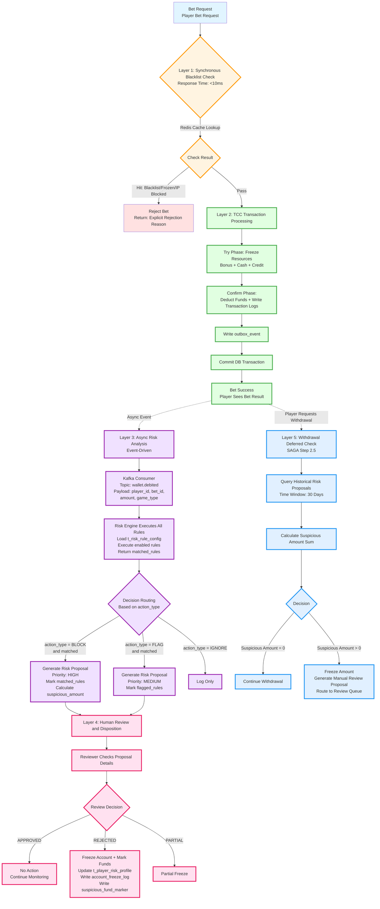

# Detection Model Implementation

> **Canonical Source**: [05-02-01_Detection_Model.md](../../source/05_Risk_Control/05-02-01_Detection_Model.md)
> **Audience**: Architects, Backend Engineers, Risk Team Engineers
> **Related Doc**: [Detection_Model_Spec.md](../../requirements/05_Risk_Compliance/Detection_Model_Spec.md)
> **Last Synced**: 2026-02-08

---

## 1. Executive Summary

SmartAdmin iGaming v2.1.0 introduces a Configuration-Driven Risk Control System with a five-layer architecture. This document covers the technical implementation details: system architecture, event-driven processing, rule engine integration, and data flow.

### Prerequisites

- [05-01 Risk Framework](../../source/05_Risk_Control/05-01_Risk_Framework.md) -- Configuration-driven rule engine (Section 9)
- [01-05 Withdrawal Risk](../../source/01_Player_Center/01-05_Withdrawal_Risk.md) -- SAGA Step 2.5 deferred risk check
- [02-04 Turnover Reconciliation](../../source/02_Finance_Center/02-04_Turnover_and_Game_Reconciliation_Analysis.md) -- Layer 1 processing flow

---

## 2. Configuration-Driven Architecture

### 2.1 Concept

Configuration-Driven Risk Control decouples rule action types (BLOCK / FLAG / IGNORE) from application code into database configuration tables.

```
Configuration-Driven Risk Control =
    Async Active Risk (BLOCK generates HIGH priority proposal)
  + Async Passive Risk (FLAG generates MEDIUM priority proposal)
  + Log-Only (IGNORE)
         |                          |                    |
    Async post-bet analysis    Async post-bet analysis  Log only
    Generates Risk Proposal    Generates Risk Proposal
    (Priority: HIGH)           (Priority: MEDIUM)
```

### 2.2 Design Principles

- **Synchronous blocking** is limited to: blacklisted players, IP bans, account freezes (Layer 1 fast checks)
- **All BLOCK/FLAG rules** execute asynchronously after bet success (Layer 3 risk analysis)
- **BLOCK rules do not reject bets**; they generate high-priority Risk Proposals for human review
- **Fund interception** occurs at withdrawal time -- deferred check (Layer 5 -- SAGA Step 2.5)

### 2.3 Advantages

| Advantage | Technical Rationale |
|-----------|---------------------|
| Zero false kills | Bet already succeeded; risk only flags post-hoc |
| High availability | Risk engine failure does not block betting (Fail Open principle) |
| Low latency | Bet response time unaffected by risk analysis (async processing) |
| Flexibility | Operators adjust rule priority (HIGH/MEDIUM/LOW) via config |
| Compliance | Aligned with DraftKings/FanDuel/Bet365/UKGC best practices |

---

## 3. Five-Layer System Architecture



---

## 4. Layer Details

### 4.1 Layer 1: Synchronous Blacklist Check (< 10ms)

- **Data source**: Redis cache
- **Checked conditions**: Blacklisted players, IP bans, frozen accounts, self-exclusion lists (UKGC/MGA)
- **Fail Open**: If the risk system is down, bets are allowed through by default

### 4.2 Layer 2: TCC Transaction Processing

```
Try Phase   --> Freeze resources (Bonus + Cash + Credit)
Confirm Phase --> Actual deduction + write transaction logs
                  Write outbox_event
                  Commit DB transaction
```

The player sees their bet result immediately after Layer 2 completes.

### 4.3 Layer 3: Async Risk Analysis (Event-Driven, ~5s)

**Event Pipeline**:

```
outbox_event --> Kafka Topic: wallet.debited --> Risk Analysis Consumer

Kafka Payload:
{
  "player_id": Long,
  "bet_id": Long,
  "amount": BigDecimal,
  "game_type": String
}
```

**Rule Execution Flow**:

```
1. Load enabled rules from t_risk_rule_config
2. Execute each rule against the bet context
3. Collect matched_rules
4. Route by action_type:
   - BLOCK + matched --> Risk Proposal (Priority: HIGH)
   - FLAG + matched  --> Risk Proposal (Priority: MEDIUM)
   - IGNORE          --> Log only
```

### 4.4 Layer 4: Human Review and Disposition

Review outcomes and their system actions:

| Decision | System Actions |
|----------|---------------|
| APPROVED | No action; continue monitoring |
| REJECTED | Freeze account; mark suspicious funds; update `t_player_risk_profile`; write `account_freeze_log`; write `suspicious_fund_marker` |
| PARTIAL | Partial freeze applied |

### 4.5 Layer 5: Withdrawal Deferred Check (SAGA Step 2.5)

```
1. Query historical Risk Proposals (time window: 30 days)
2. Calculate sum of suspicious_amount across all proposals
3. Decision:
   - suspicious_amount = 0 --> Continue withdrawal
   - suspicious_amount > 0 --> Freeze amount + generate manual review proposal
```

---

## 5. Applicable Risk Scenarios

### 5.1 Layer 1 -- Synchronous Block Scenarios

| Scenario | Check Method |
|----------|-------------|
| Blacklisted Player | Redis SET lookup |
| IP Blocked | Redis SET lookup |
| Account Frozen | Redis hash field check |
| Self-Exclusion (UKGC/MGA) | Redis SET lookup |

### 5.2 Layer 3 -- Async BLOCK Rules

| Rule | Detection Method |
|------|-----------------|
| Bot Detection | Behavioural feature analysis (bet timing, pattern regularity) |
| Same-Match Hedging | Historical bet query for same match, opposite outcomes |
| Same-IP Arbitrage | Correlation analysis across accounts sharing IP |
| Abnormal Odds Detection | Statistical analysis of odds selection distribution |
| Turnover Manipulation | Turnover velocity calculation against deposit ratio |

### 5.3 Layer 3 -- Async FLAG Rules

| Rule | Detection Method |
|------|-----------------|
| Cross-Match Hedging | Cross-match bet correlation (lower risk) |
| Low-Odds Turnover (< 1.5) | Odds threshold check |
| Abnormal Betting Pattern | Pattern deviation from player baseline |
| High-Frequency Betting (> 10/min) | Sliding window count |

---

## 6. Architecture Comparison (v2.1.0 vs v3.0.0)

| Aspect | v2.1.0 (Synchronous) | v3.0.0 (Async Event-Driven) |
|--------|----------------------|------------------------------|
| Risk Trigger Timing | During bet request (sync) | After bet success (async) |
| BLOCK Rule Handling | Reject bet | Generate HIGH priority proposal |
| FLAG Rule Handling | Allow bet + generate proposal | Generate MEDIUM priority proposal |
| Blacklist Check | Mixed with other rules | Independent synchronous check layer |
| Fund Interception | At bet time (blocking) | At withdrawal time (deferred) |
| False Positive Rate | 5--10% normal players rejected | Zero false rejections |
| Availability | SPOF (risk down = bets fail) | HA (risk down does not affect bets) |

---

## 7. Key Design Decisions

### 7.1 Minimal Synchronous Blocking (Layer 1)
- Only hard rules checked: blacklist, IP ban, account freeze
- Redis cache for < 10ms response time
- Fail Open: risk system failure defaults to allow

### 7.2 Bet-First Completion (Layer 2)
- TCC transaction model ensures bet success
- Player sees result immediately
- Risk analysis does not impact betting experience

### 7.3 Async Risk Analysis (Layer 3)
- Kafka + event-driven architecture
- All rules analysed within ~5 seconds
- BLOCK/FLAG generate Risk Proposals; bets are never rejected

### 7.4 Human-Primary Review (Layer 4)
- Automation generates proposals only
- Final decisions made by human reviewers
- Avoids ML model false positives

### 7.5 Post-Hoc Fund Interception (Layer 5)
- Withdrawal triggers historical proposal query (30-day window)
- Suspicious amounts intercepted at withdrawal stage
- Aligned with DraftKings/FanDuel/Bet365/UKGC industry practices

---

## 8. Related Documents

- [05-02-02 Rule Configuration](../../source/05_Risk_Control/05-02-02_Rule_Configuration.md) -- Risk proposal service and deferred checks
- [05-02-03 ML Integration](../../source/05_Risk_Control/05-02-03_ML_Integration.md) -- Multi-dimensional risk rules
- [05-02-04 Operations Tools](../../source/05_Risk_Control/05-02-04_Operations_Tools.md) -- SmartAdmin architecture mapping and monitoring
