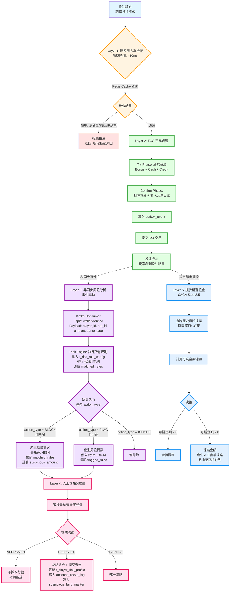

# 偵測模型技術實作（Detection Model Implementation）

> **規範來源**: [05-02-01_Detection_Model.md](../../source-archive/05_Risk_Control/05-02-01_Detection_Model.md)
> **目標讀者**: 架構師、後端工程師、風控團隊工程師
> **業務需求**: [Detection_Model_Spec.md](../../requirements/05_Risk_Compliance/Detection_Model_Spec.md)
> **最後同步**: 2026-02-09
>
> **技術重點**: 本文檔包含從需求層提取的實作細節（TCC 模式、SAGA 流程、規則引擎整合）。

---

## 1. 摘要（Executive Summary）

SmartAdmin iGaming v2.1.0 引入配置驅動的風險控制系統，採用五層架構設計。本文檔涵蓋技術實作細節：系統架構、事件驅動處理、規則引擎整合及數據流動。

### 前置文件（Prerequisites）

- [05-01 Risk Framework](../../source-archive/05_Risk_Control/05-01_Risk_Framework.md) -- 配置驅動規則引擎（第9節）
- [01-05 Withdrawal Risk](../../source-archive/01_Player_Center/01-05_Withdrawal_Risk.md) -- SAGA Step 2.5 延遲風險檢查
- [02-04 Turnover Reconciliation](../../source-archive/02_Finance_Center/02-04_Turnover_and_Game_Reconciliation_Analysis.md) -- Layer 1 處理流程

---

## 2. 配置驅動架構（Configuration-Driven Architecture）

### 2.1 概念（Concept）

配置驅動風險控制（Configuration-Driven Risk Control）將規則動作類型（BLOCK / FLAG / IGNORE）從應用程式程式碼解耦至資料庫配置表。

```
配置驅動風險控制 =
    主動風險（BLOCK 產生 HIGH 優先級提案）
  + 被動風險（FLAG 產生 MEDIUM 優先級提案）
  + 僅記錄（IGNORE）
         |                          |                    |
    投注後非同步分析          投注後非同步分析        僅記錄
    產生風險提案              產生風險提案
    （優先級：HIGH）          （優先級：MEDIUM）
```

### 2.2 設計原則（Design Principles）

- **同步阻斷（Synchronous blocking）** 僅限於：黑名單玩家、IP封禁、帳戶凍結（Layer 1 快速檢查）
- **所有 BLOCK/FLAG 規則** 在投注成功後非同步執行（Layer 3 風險分析）
- **BLOCK 規則不拒絕投注**；它們為人工審核產生高優先級風險提案
- **資金攔截** 發生在提款時 -- 延遲檢查（Layer 5 -- SAGA Step 2.5）

### 2.3 優勢（Advantages）

| 優勢 | 技術理由 |
|------|----------|
| 零誤殺 | 投注已成功；風險僅事後標記 |
| 高可用性 | 風險引擎故障不阻斷投注（Fail Open 原則） |
| 低延遲 | 投注響應時間不受風險分析影響（非同步處理） |
| 靈活性 | 營運商透過配置調整規則優先級（HIGH/MEDIUM/LOW） |
| 合規性 | 符合 DraftKings/FanDuel/Bet365/UKGC 最佳實踐 |

---

## 3. 五層系統架構（Five-Layer System Architecture）



---

## 4. 層級細節（Layer Details）

### 4.1 Layer 1: 同步黑名單檢查（Synchronous Blacklist Check）（< 10ms）

- **資料來源**: Redis 快取
- **檢查條件**: 黑名單玩家、IP 封禁、凍結帳戶、自我排除清單（Self-Exclusion）（UKGC/MGA）
- **Fail Open**: 如果風險系統故障，預設允許投注

### 4.2 Layer 2: TCC 交易處理（TCC Transaction Processing）

```
Try Phase   --> 凍結資源（Bonus + Cash + Credit）
Confirm Phase --> 實際扣除 + 寫入交易日誌
                  寫入 outbox_event
                  提交 DB 交易
```

Layer 2 完成後，玩家立即看到投注結果。

### 4.3 Layer 3: 非同步風險分析（Async Risk Analysis）（事件驅動，~5秒）

**事件管道（Event Pipeline）**:

```
outbox_event --> Kafka Topic: wallet.debited --> Risk Analysis Consumer

Kafka Payload:
{
  "player_id": Long,
  "bet_id": Long,
  "amount": BigDecimal,
  "game_type": String
}
```

**規則執行流程（Rule Execution Flow）**:

```
1. 從 t_risk_rule_config 載入已啟用規則
2. 對投注上下文執行每條規則
3. 收集 matched_rules
4. 依 action_type 路由：
   - BLOCK + 匹配 --> 風險提案（優先級: HIGH）
   - FLAG + 匹配  --> 風險提案（優先級: MEDIUM）
   - IGNORE       --> 僅記錄
```

### 4.4 Layer 4: 人工審核與處置（Human Review and Disposition）

審核結果及其系統行動：

| 決策 | 系統行動 |
|------|----------|
| APPROVED | 不採取行動；繼續監控 |
| REJECTED | 凍結帳戶；標記可疑資金；更新 `t_player_risk_profile`；寫入 `account_freeze_log`；寫入 `suspicious_fund_marker` |
| PARTIAL | 應用部分凍結 |

### 4.5 Layer 5: 提款延遲檢查（Withdrawal Deferred Check）（SAGA Step 2.5）

```
1. 查詢歷史風險提案（時間窗口：30天）
2. 計算所有提案的 suspicious_amount 總和
3. 決策：
   - suspicious_amount = 0 --> 繼續提款
   - suspicious_amount > 0 --> 凍結金額 + 產生人工審核提案
```

---

## 5. 適用風險場景（Applicable Risk Scenarios）

### 5.1 Layer 1 -- 同步阻斷場景（Synchronous Block Scenarios）

| 場景 | 檢查方法 |
|------|----------|
| 黑名單玩家 | Redis SET 查詢 |
| IP 封禁 | Redis SET 查詢 |
| 帳戶凍結 | Redis hash field 檢查 |
| 自我排除（Self-Exclusion）（UKGC/MGA） | Redis SET 查詢 |

### 5.2 Layer 3 -- 非同步 BLOCK 規則（Async BLOCK Rules）

| 規則 | 偵測方法 |
|------|----------|
| 機器人偵測（Bot Detection） | 行為特徵分析（投注時機、模式規律性） |
| 同場對沖（Same-Match Hedging） | 同場比賽歷史投注查詢，對立結果 |
| 同 IP 套利（Same-IP Arbitrage） | 共享 IP 帳戶的相關性分析 |
| 異常賠率偵測（Abnormal Odds Detection） | 賠率選擇分佈的統計分析 |
| 有效投注額操控（Turnover Manipulation） | 有效投注額速度計算與存款比率對比 |

### 5.3 Layer 3 -- 非同步 FLAG 規則（Async FLAG Rules）

| 規則 | 偵測方法 |
|------|----------|
| 跨場對沖（Cross-Match Hedging） | 跨場比賽投注相關性（較低風險） |
| 低賠率有效投注額（< 1.5）（Low-Odds Turnover） | 賠率閾值檢查 |
| 異常投注模式（Abnormal Betting Pattern） | 模式偏離玩家基線 |
| 高頻投注（> 10次/分鐘）（High-Frequency Betting） | 滑動窗口計數 |

---

## 6. Java 實現

### 6.1 Service 層 — 風險偵測服務

```java
package net.lab1024.sa.business.risk;

import io.vavr.control.Option;
import io.vavr.control.Try;
import lombok.RequiredArgsConstructor;
import lombok.extern.slf4j.Slf4j;
import org.springframework.stereotype.Service;

import java.util.List;
import java.util.stream.Collectors;

/**
 * 風險偵測服務
 * 負責執行配置驅動的風險規則並產生風險提案
 */
@Slf4j
@Service
@RequiredArgsConstructor
public class DetectionModelService {

    private final DetectionModelDao detectionModelDao;
    private final DetectionResultDao detectionResultDao;
    private final RiskProposalManager riskProposalManager;
    private final DetectionModelExecutor detectionModelExecutor;

    /**
     * 執行 Layer 3 非同步風險分析
     *
     * @param playerId 玩家 ID
     * @param betId 投注 ID
     * @param amount 投注金額
     * @param gameType 遊戲類型
     * @return 偵測結果列表
     */
    public List<DetectionResultVO> analyzeAsyncRisk(Long playerId, Long betId, BigDecimal amount, String gameType) {
        // 載入已啟用的 Layer 3 規則
        List<DetectionModelEntity> models = detectionModelDao.findEnabledByLayer(3);

        return models.stream()
            .map(model -> executeModel(playerId, betId, amount, gameType, model, 3, "BET_PLACED"))
            .filter(Option::isDefined)
            .map(Option::get)
            .collect(Collectors.toList());
    }

    /**
     * 執行 Layer 1 同步黑名單檢查
     *
     * @param playerId 玩家 ID
     * @param clientIp 客戶端 IP
     * @return 是否通過檢查（true=通過，false=拒絕）
     */
    public boolean checkSyncBlacklist(Long playerId, String clientIp) {
        List<DetectionModelEntity> models = detectionModelDao.findEnabledByLayer(1);

        for (DetectionModelEntity model : models) {
            Option<DetectionResultVO> result = executeModel(playerId, null, null, null, model, 1, "BLACKLIST_CHECK");
            if (result.isDefined() && result.get().getMatched()) {
                // 任一 Layer 1 規則匹配 -> 拒絕投注
                log.warn("Layer 1 blacklist check failed: playerId={}, model={}", playerId, model.getModelName());
                return false;
            }
        }

        return true; // 通過所有 Layer 1 檢查
    }

    /**
     * 執行 Layer 5 提款延遲檢查
     *
     * @param playerId 玩家 ID
     * @param withdrawalId 提款 ID
     * @return 可疑金額總和
     */
    public BigDecimal calculateSuspiciousAmountForWithdrawal(Long playerId, Long withdrawalId) {
        // 查詢 30 天內未審核的風險提案
        LocalDateTime thirtyDaysAgo = LocalDateTime.now().minusDays(30);

        return detectionResultDao.sumSuspiciousAmountByPlayer(playerId, thirtyDaysAgo)
            .getOrElse(BigDecimal.ZERO);
    }

    /**
     * 執行單一偵測模型
     */
    private Option<DetectionResultVO> executeModel(
        Long playerId, Long betId, BigDecimal amount, String gameType,
        DetectionModelEntity model, int layer, String eventType
    ) {
        long startTime = System.currentTimeMillis();

        try {
            // 執行規則引擎
            DetectionExecutionResult executionResult = detectionModelExecutor.execute(
                model, playerId, betId, amount, gameType
            );

            // 記錄偵測結果
            DetectionResultEntity entity = DetectionResultEntity.builder()
                .playerId(playerId)
                .betId(betId)
                .modelId(model.getModelId())
                .layer(layer)
                .eventType(eventType)
                .eventTimestamp(LocalDateTime.now())
                .gameType(gameType)
                .amount(amount)
                .matched(executionResult.isMatched())
                .actionType(model.getActionType())
                .riskScore(executionResult.getRiskScore())
                .confidenceLevel(executionResult.getConfidenceLevel())
                .matchedRules(JsonUtil.toJsonString(executionResult.getMatchedRules()))
                .detectionReason(executionResult.getReason())
                .suspiciousAmount(executionResult.getSuspiciousAmount())
                .processingTimeMs((int) (System.currentTimeMillis() - startTime))
                .modelVersion(model.getModelVersion())
                .build();

            detectionResultDao.insert(entity);

            // 如果匹配且為 BLOCK/FLAG，產生風險提案
            if (executionResult.isMatched() && !model.getActionType().equals("IGNORE")) {
                String priority = model.getActionType().equals("BLOCK") ? "HIGH" : "MEDIUM";
                riskProposalManager.createProposal(entity, priority);
            }

            return Option.of(SmartBeanUtil.copy(entity, DetectionResultVO.class));

        } catch (Exception e) {
            log.error("Detection model execution failed: model={}, playerId={}",
                model.getModelName(), playerId, e);
            return Option.none();
        }
    }
}
```

### 6.2 Manager 層 — 風險提案管理

```java
package net.lab1024.sa.business.risk;

import lombok.RequiredArgsConstructor;
import lombok.extern.slf4j.Slf4j;
import org.springframework.stereotype.Component;
import org.springframework.transaction.annotation.Transactional;

/**
 * 風險提案管理器
 * 負責產生和管理風險提案（Layer 4 人工審核）
 */
@Slf4j
@Component
@RequiredArgsConstructor
public class RiskProposalManager {

    private final RiskProposalDao riskProposalDao;
    private final DetectionResultDao detectionResultDao;
    private final PlayerRiskProfileDao playerRiskProfileDao;

    /**
     * 產生風險提案（基於偵測結果）
     *
     * @param detectionResult 偵測結果
     * @param priority 優先級（HIGH, MEDIUM, LOW）
     */
    @Transactional(rollbackFor = Throwable.class)
    public void createProposal(DetectionResultEntity detectionResult, String priority) {
        RiskProposalEntity proposal = RiskProposalEntity.builder()
            .playerId(detectionResult.getPlayerId())
            .betId(detectionResult.getBetId())
            .detectionResultId(detectionResult.getResultId())
            .priority(priority)
            .proposalType(detectionResult.getActionType()) // BLOCK or FLAG
            .detectionReason(detectionResult.getDetectionReason())
            .suspiciousAmount(detectionResult.getSuspiciousAmount())
            .riskScore(detectionResult.getRiskScore())
            .status("PENDING") // 待審核
            .createdAt(LocalDateTime.now())
            .build();

        riskProposalDao.insert(proposal);

        // 更新 t_detection_result 的 risk_proposal_id
        detectionResultDao.updateProposalId(detectionResult.getResultId(), proposal.getProposalId());

        log.info("Risk proposal created: proposalId={}, priority={}, playerId={}",
            proposal.getProposalId(), priority, detectionResult.getPlayerId());
    }

    /**
     * 審核員處理風險提案
     *
     * @param proposalId 提案 ID
     * @param decision 審核決策（APPROVED, REJECTED, PARTIAL）
     * @param reviewerId 審核員 ID
     */
    @Transactional(rollbackFor = Throwable.class)
    public void reviewProposal(Long proposalId, String decision, Long reviewerId) {
        // 更新提案狀態
        riskProposalDao.updateReviewDecision(proposalId, decision, reviewerId, LocalDateTime.now());

        // 同步更新 t_detection_result
        RiskProposalEntity proposal = riskProposalDao.selectById(proposalId)
            .getOrElseThrow(() -> new RuntimeException("Proposal not found: " + proposalId));

        detectionResultDao.updateReviewDecision(proposal.getDetectionResultId(), decision, reviewerId);

        // 如果審核結果為 REJECTED，執行處置操作
        if ("REJECTED".equals(decision)) {
            applyDispositionActions(proposal);
        }

        log.info("Risk proposal reviewed: proposalId={}, decision={}, reviewedBy={}",
            proposalId, decision, reviewerId);
    }

    /**
     * 執行處置操作（帳戶凍結、資金標記）
     */
    private void applyDispositionActions(RiskProposalEntity proposal) {
        // 更新玩家風險檔案
        playerRiskProfileDao.incrementRiskLevel(proposal.getPlayerId());

        // 寫入帳戶凍結日誌
        AccountFreezeLogEntity freezeLog = AccountFreezeLogEntity.builder()
            .playerId(proposal.getPlayerId())
            .reason("RISK_PROPOSAL_REJECTED")
            .proposalId(proposal.getProposalId())
            .frozenAt(LocalDateTime.now())
            .build();

        accountFreezeLogDao.insert(freezeLog);

        // 標記可疑資金
        if (proposal.getSuspiciousAmount() != null && proposal.getSuspiciousAmount().compareTo(BigDecimal.ZERO) > 0) {
            SuspiciousFundMarkerEntity marker = SuspiciousFundMarkerEntity.builder()
                .playerId(proposal.getPlayerId())
                .amount(proposal.getSuspiciousAmount())
                .proposalId(proposal.getProposalId())
                .markedAt(LocalDateTime.now())
                .build();

            suspiciousFundMarkerDao.insert(marker);
        }

        log.info("Disposition actions applied: playerId={}, proposalId={}",
            proposal.getPlayerId(), proposal.getProposalId());
    }
}

/**
 * 偵測模型執行器
 * 負責實際執行規則引擎邏輯
 */
@Slf4j
@Component
@RequiredArgsConstructor
public class DetectionModelExecutor {

    /**
     * 執行偵測模型
     *
     * @return 執行結果（包含是否匹配、風險分數、匹配規則）
     */
    public DetectionExecutionResult execute(
        DetectionModelEntity model, Long playerId, Long betId,
        BigDecimal amount, String gameType
    ) {
        // 從 rule_definition JSONB 提取規則邏輯
        String ruleDefinition = model.getRuleDefinition();
        Map<String, Object> ruleConfig = JsonUtil.parseObject(ruleDefinition, new TypeReference<Map<String, Object>>() {});

        // 根據 model_type 路由到不同偵測邏輯
        return switch (model.getModelType()) {
            case "BOT_DETECTION" -> executeBotDetection(playerId, betId, ruleConfig);
            case "HEDGING" -> executeHedgingDetection(playerId, betId, ruleConfig);
            case "ARBITRAGE" -> executeArbitrageDetection(playerId, betId, ruleConfig);
            case "TURNOVER_MANIPULATION" -> executeTurnoverManipulation(playerId, amount, ruleConfig);
            case "BLACKLIST" -> executeBlacklistCheck(playerId, ruleConfig);
            default -> {
                log.warn("Unknown model type: {}", model.getModelType());
                yield DetectionExecutionResult.noMatch();
            }
        };
    }

    private DetectionExecutionResult executeBotDetection(Long playerId, Long betId, Map<String, Object> ruleConfig) {
        // 實作機器人偵測邏輯（行為特徵分析）
        // 示例：檢查投注時機規律性、異常速度等
        return DetectionExecutionResult.noMatch(); // 簡化示例
    }

    private DetectionExecutionResult executeHedgingDetection(Long playerId, Long betId, Map<String, Object> ruleConfig) {
        // 實作對沖偵測邏輯（查詢同場比賽歷史投注）
        return DetectionExecutionResult.noMatch();
    }

    private DetectionExecutionResult executeArbitrageDetection(Long playerId, Long betId, Map<String, Object> ruleConfig) {
        // 實作套利偵測邏輯（共享 IP 帳戶相關性分析）
        return DetectionExecutionResult.noMatch();
    }

    private DetectionExecutionResult executeTurnoverManipulation(Long playerId, BigDecimal amount, Map<String, Object> ruleConfig) {
        // 實作有效投注額操控偵測（速度計算與存款比率）
        return DetectionExecutionResult.noMatch();
    }

    private DetectionExecutionResult executeBlacklistCheck(Long playerId, Map<String, Object> ruleConfig) {
        // 實作黑名單檢查（Redis 查詢）
        return DetectionExecutionResult.noMatch();
    }
}
```

---

## 7. 資料庫架構（Database Schema）（PostgreSQL）

### t_detection_model
儲存風險偵測模型配置和規則。

```sql
CREATE TABLE t_detection_model (
    model_id UUID PRIMARY KEY DEFAULT gen_random_uuid(),
    tenant_id UUID NOT NULL REFERENCES tenants(tenant_id),
    model_name VARCHAR(100) NOT NULL,
    model_type VARCHAR(50) NOT NULL, -- 'BLACKLIST', 'BOT_DETECTION', 'HEDGING', 'ARBITRAGE', 'TURNOVER_MANIPULATION'
    action_type VARCHAR(20) NOT NULL, -- 'BLOCK', 'FLAG', 'IGNORE'
    priority VARCHAR(10) NOT NULL, -- 'HIGH', 'MEDIUM', 'LOW'
    layer INT NOT NULL, -- 1 (Sync), 3 (Async), 5 (Withdrawal)

    -- Rule configuration
    rule_definition JSONB NOT NULL, -- Model-specific detection logic
    thresholds JSONB, -- Configurable thresholds (e.g., { "max_frequency": 10, "odds_min": 1.5 })
    detection_method TEXT, -- Natural language description
    enabled_game_types TEXT[], -- ['SPORTS', 'SLOTS', 'BACCARAT', ...] or NULL (all games)

    -- Model metadata
    accuracy_rate DECIMAL(5,4), -- 0.0000 to 1.0000 (e.g., 0.9523 = 95.23%)
    false_positive_rate DECIMAL(5,4),
    training_data_size BIGINT,
    last_trained_at TIMESTAMPTZ,
    model_version VARCHAR(20),

    -- Status and lifecycle
    is_enabled BOOLEAN NOT NULL DEFAULT TRUE,
    effective_from TIMESTAMPTZ NOT NULL DEFAULT NOW(),
    effective_to TIMESTAMPTZ,
    created_at TIMESTAMPTZ NOT NULL DEFAULT NOW(),
    updated_at TIMESTAMPTZ NOT NULL DEFAULT NOW(),
    created_by UUID NOT NULL REFERENCES admins(admin_id),
    updated_by UUID REFERENCES admins(admin_id),

    -- Audit trail
    change_history JSONB, -- Array of { timestamp, changed_by, changes[] }

    CONSTRAINT valid_layer CHECK (layer IN (1, 3, 5)),
    CONSTRAINT valid_action_type CHECK (action_type IN ('BLOCK', 'FLAG', 'IGNORE')),
    CONSTRAINT valid_priority CHECK (priority IN ('HIGH', 'MEDIUM', 'LOW'))
);

CREATE INDEX idx_t_detection_model_tenant ON t_detection_model(tenant_id) WHERE is_enabled = TRUE;
CREATE INDEX idx_t_detection_model_layer_action ON t_detection_model(layer, action_type) WHERE is_enabled = TRUE;
CREATE INDEX idx_t_detection_model_type ON t_detection_model(model_type) WHERE is_enabled = TRUE;
CREATE INDEX idx_t_detection_model_effective ON t_detection_model(effective_from, effective_to) WHERE is_enabled = TRUE;

COMMENT ON TABLE t_detection_model IS '五層風險控制系統的風險偵測模型配置';
COMMENT ON COLUMN t_detection_model.layer IS '1=同步黑名單檢查, 3=非同步風險分析, 5=提款延遲檢查';
COMMENT ON COLUMN t_detection_model.action_type IS 'BLOCK=產生 HIGH 優先級提案, FLAG=產生 MEDIUM 優先級提案, IGNORE=僅記錄';
COMMENT ON COLUMN t_detection_model.rule_definition IS 'JSONB 配置，用於規則特定邏輯（SQL 查詢、ML 模型參數、閾值條件）';
```

### t_detection_result
追蹤風險偵測執行結果和匹配規則。

```sql
CREATE TABLE t_detection_result (
    result_id UUID PRIMARY KEY DEFAULT gen_random_uuid(),
    tenant_id UUID NOT NULL REFERENCES tenants(tenant_id),
    player_id UUID NOT NULL REFERENCES players(player_id),
    bet_id UUID REFERENCES bets(bet_id),
    withdrawal_id UUID REFERENCES withdrawals(withdrawal_id),
    model_id UUID NOT NULL REFERENCES t_detection_model(model_id),

    -- Detection context
    layer INT NOT NULL, -- 1, 3, or 5
    event_type VARCHAR(50) NOT NULL, -- 'BET_PLACED', 'WITHDRAWAL_REQUEST', 'BLACKLIST_CHECK'
    event_timestamp TIMESTAMPTZ NOT NULL,
    game_type VARCHAR(50),
    amount DECIMAL(18,4),

    -- Detection outcome
    matched BOOLEAN NOT NULL DEFAULT FALSE,
    action_type VARCHAR(20) NOT NULL, -- 'BLOCK', 'FLAG', 'IGNORE'
    risk_score DECIMAL(5,4), -- 0.0000 to 1.0000 (higher = riskier)
    confidence_level DECIMAL(5,4), -- Model confidence (0.0000 to 1.0000)

    -- Matched rule details
    matched_rules JSONB, -- Array of matched rule names with scores
    detection_reason TEXT, -- Human-readable explanation
    suspicious_amount DECIMAL(18,4), -- Amount flagged for review (if applicable)

    -- Risk proposal linkage
    risk_proposal_id UUID REFERENCES risk_proposals(proposal_id),
    proposal_priority VARCHAR(10), -- 'HIGH' (BLOCK), 'MEDIUM' (FLAG), NULL (IGNORE)

    -- Processing metadata
    processing_time_ms INT, -- Execution time in milliseconds
    model_version VARCHAR(20),
    rule_snapshot JSONB, -- Snapshot of t_detection_model at execution time

    -- Audit trail
    detected_at TIMESTAMPTZ NOT NULL DEFAULT NOW(),
    reviewed_at TIMESTAMPTZ,
    review_decision VARCHAR(20), -- 'APPROVED', 'REJECTED', 'PARTIAL', NULL (pending)
    reviewed_by UUID REFERENCES admins(admin_id),

    CONSTRAINT valid_layer CHECK (layer IN (1, 3, 5)),
    CONSTRAINT valid_action_type CHECK (action_type IN ('BLOCK', 'FLAG', 'IGNORE')),
    CONSTRAINT valid_review_decision CHECK (review_decision IS NULL OR review_decision IN ('APPROVED', 'REJECTED', 'PARTIAL'))
);

CREATE INDEX idx_t_detection_result_player ON t_detection_result(player_id, detected_at DESC);
CREATE INDEX idx_t_detection_result_bet ON t_detection_result(bet_id) WHERE bet_id IS NOT NULL;
CREATE INDEX idx_t_detection_result_withdrawal ON t_detection_result(withdrawal_id) WHERE withdrawal_id IS NOT NULL;
CREATE INDEX idx_t_detection_result_matched ON t_detection_result(matched, action_type, detected_at DESC) WHERE matched = TRUE;
CREATE INDEX idx_t_detection_result_proposal ON t_detection_result(risk_proposal_id) WHERE risk_proposal_id IS NOT NULL;
CREATE INDEX idx_t_detection_result_review_pending ON t_detection_result(detected_at DESC) WHERE review_decision IS NULL AND matched = TRUE;
CREATE INDEX idx_t_detection_result_layer_event ON t_detection_result(layer, event_type, detected_at DESC);

COMMENT ON TABLE t_detection_result IS '所有層級（同步、非同步、提款）的風險偵測執行結果';
COMMENT ON COLUMN t_detection_result.matched IS 'TRUE 表示偵測規則被觸發，FALSE 表示未觸發';
COMMENT ON COLUMN t_detection_result.suspicious_amount IS '標記供審核或凍結的金額（用於 Layer 5 提款檢查）';
COMMENT ON COLUMN t_detection_result.rule_snapshot IS '執行時 t_detection_model 配置的不可變快照';
```

### 查詢範例（Query Examples）

**分析偵測模型效能:**
```sql
SELECT
    dm.model_name,
    dm.model_type,
    dm.action_type,
    COUNT(*) AS total_executions,
    COUNT(*) FILTER (WHERE dr.matched = TRUE) AS matches,
    COUNT(*) FILTER (WHERE dr.review_decision = 'REJECTED') AS confirmed_fraud,
    (COUNT(*) FILTER (WHERE dr.review_decision = 'REJECTED')::DECIMAL / NULLIF(COUNT(*) FILTER (WHERE dr.matched = TRUE), 0))::DECIMAL(5,4) AS precision,
    AVG(dr.processing_time_ms) AS avg_processing_time_ms
FROM t_detection_model dm
INNER JOIN t_detection_result dr ON dm.model_id = dr.model_id
WHERE dr.detected_at >= NOW() - INTERVAL '30 days'
GROUP BY dm.model_id, dm.model_name, dm.model_type, dm.action_type
ORDER BY confirmed_fraud DESC;
```

**計算提款延遲檢查的可疑金額（Layer 5）:**
```sql
SELECT
    player_id,
    SUM(suspicious_amount) AS total_suspicious_amount,
    COUNT(*) FILTER (WHERE action_type = 'BLOCK') AS high_priority_flags,
    COUNT(*) FILTER (WHERE action_type = 'FLAG') AS medium_priority_flags,
    MAX(detected_at) AS latest_detection
FROM t_detection_result
WHERE player_id = 'player-uuid-001'
    AND matched = TRUE
    AND review_decision IS NULL -- Pending review
    AND detected_at >= NOW() - INTERVAL '30 days' -- 30-day window
GROUP BY player_id;
```

**審計 Layer 1 同步阻斷:**
```sql
SELECT
    DATE_TRUNC('hour', detected_at) AS hour,
    model_type,
    COUNT(*) AS block_count,
    COUNT(DISTINCT player_id) AS unique_players,
    AVG(processing_time_ms) AS avg_processing_time_ms
FROM t_detection_result
WHERE layer = 1
    AND matched = TRUE
    AND detected_at >= NOW() - INTERVAL '24 hours'
GROUP BY hour, model_type
ORDER BY hour DESC, block_count DESC;
```

---

## 7. 架構比較（Architecture Comparison）（v2.1.0 vs v3.0.0）

| 面向 | v2.1.0（同步） | v3.0.0（非同步事件驅動） |
|------|----------------|--------------------------|
| 風險觸發時機 | 投注請求期間（同步） | 投注成功後（非同步） |
| BLOCK 規則處理 | 拒絕投注 | 產生 HIGH 優先級提案 |
| FLAG 規則處理 | 允許投注 + 產生提案 | 產生 MEDIUM 優先級提案 |
| 黑名單檢查 | 與其他規則混合 | 獨立同步檢查層 |
| 資金攔截 | 投注時（阻斷） | 提款時（延遲） |
| 誤報率（False Positive Rate） | 5--10% 正常玩家被拒絕 | 零誤拒 |
| 可用性（Availability） | SPOF（風險故障 = 投注失敗） | HA（風險故障不影響投注） |

---

## 7. 關鍵設計決策（Key Design Decisions）

### 7.1 最小同步阻斷（Minimal Synchronous Blocking）（Layer 1）
- 僅檢查硬規則：黑名單、IP 封禁、帳戶凍結
- Redis 快取以達成 < 10ms 響應時間
- Fail Open: 風險系統故障預設為允許

### 7.2 投注優先完成（Bet-First Completion）（Layer 2）
- TCC 交易模型確保投注成功
- 玩家立即看到結果
- 風險分析不影響投注體驗

### 7.3 非同步風險分析（Async Risk Analysis）（Layer 3）
- Kafka + 事件驅動架構
- 所有規則在 ~5 秒內分析完成
- BLOCK/FLAG 產生風險提案；投注絕不被拒絕

### 7.4 人工主導審核（Human-Primary Review）（Layer 4）
- 自動化僅產生提案
- 最終決策由人工審核員做出
- 避免 ML 模型誤報

### 7.5 事後資金攔截（Post-Hoc Fund Interception）（Layer 5）
- 提款觸發歷史提案查詢（30天窗口）
- 可疑金額在提款階段攔截
- 符合 DraftKings/FanDuel/Bet365/UKGC 產業實踐

---

## 8. 相關文件（Related Documents）

- [05-02-02 Rule Configuration](../../source-archive/05_Risk_Control/05-02-02_Rule_Configuration.md) -- 風險提案服務與延遲檢查
- [05-02-03 ML Integration](../../source-archive/05_Risk_Control/05-02-03_ML_Integration.md) -- 多維度風險規則
- [05-02-04 Operations Tools](../../source-archive/05_Risk_Control/05-02-04_Operations_Tools.md) -- SmartAdmin 架構映射與監控

---

## 文檔資訊（Document Information）

**文檔版本**: v1.0.0
**最後更新**: 2026-02-12
**維護團隊**: SmartAdmin 架構團隊
