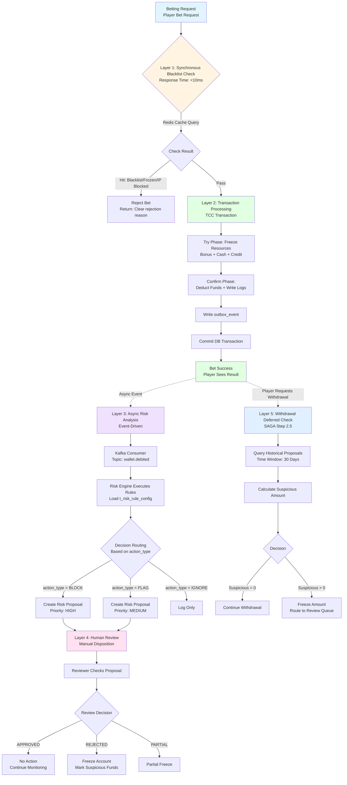
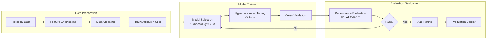
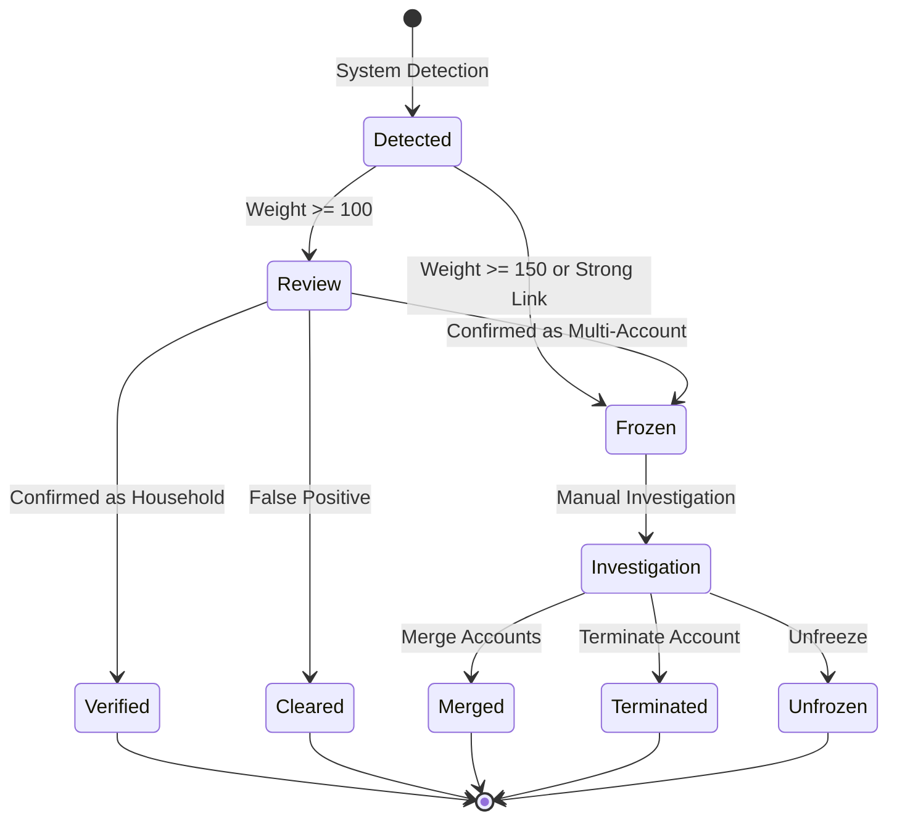
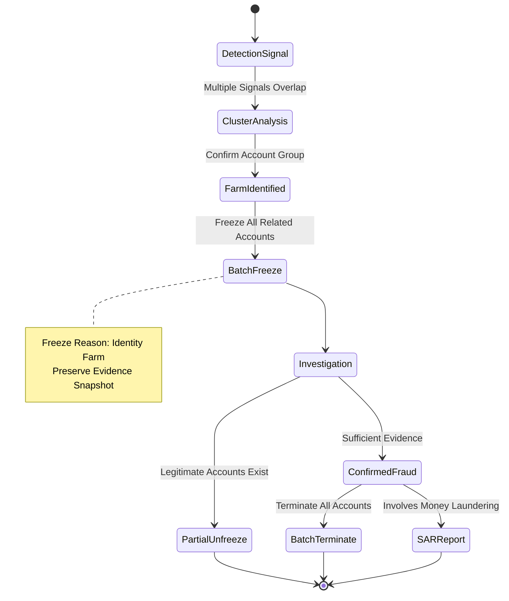
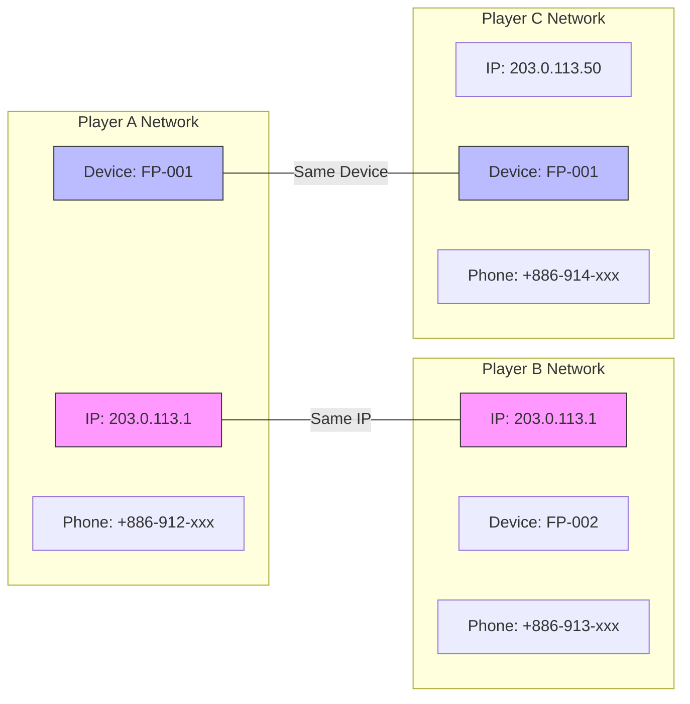

# Fraud Detection System Architecture

> **Business Requirements**: [Fraud_Detection_Requirements.md](../../requirements/05_Risk_Compliance/Fraud_Detection_Requirements.md)
> **Audience**: Backend Developers, Risk Control Engineers, Data Scientists
> **Last Synced**: 2026-02-09

## Document Information

| Property | Value |
|----------|-------|
| **Version** | 1.0.0 |
| **Last Updated** | 2026-02-08 |
| **Canonical Source** | [05-02 Fraud Detection](../../source/05_Risk_Control/05-02_Fraud_Detection.md) |
| **View Type** | Technical Architecture |
| **Target Audience** | Architects, Backend Engineers, DevOps, SRE |
| **Related Doc** | [Fraud_Detection_Requirements.md](../../requirements/05_Risk_Compliance/Fraud_Detection_Requirements.md) |

---

## 1. System Architecture Overview

### 1.1 5-Layer Detection Architecture



### 1.2 Architecture Design Principles

| Principle | Implementation | Benefit |
|-----------|---------------|---------|
| **Minimize Sync Blocking** | Only check hardcoded rules in Layer 1 | <10ms response, Fail Open |
| **Bet-First Complete** | TCC ensures bet success before risk analysis | Zero false kills |
| **Async Risk Analysis** | Kafka + Flink event-driven | Non-blocking, 5s analysis |
| **Human Review Primary** | Auto-generate proposals, human decides | Avoid ML false positives |
| **Post-Hoc Fund Interception** | Check at withdrawal time (30 days) | Industry best practice |

---

## 2. SmartAdmin Architecture Mapping

### 2.1 Layer Mapping

| Layer | Class | Responsibility |
|-------|-------|----------------|
| **Controller** | `RiskProposalController` | API interfaces |
| **Service** | `RiskProposalService` | Business logic (Vavr Option) |
| **Manager** | `RiskProposalManager` | Transaction management (@Transactional) |
| **Dao** | `RiskProposalDao` | Data access |
| **Entity** | `RiskProposalEntity` | Data entity |

### 2.2 Entity Layer - Risk Proposal Entity

```java
package net.lab1024.sa.business.risk.domain.entity;

import com.baomidou.mybatisplus.annotation.*;
import net.lab1024.sa.common.mybatis.domain.BaseEntity;
import lombok.Data;
import lombok.EqualsAndHashCode;
import java.math.BigDecimal;
import java.time.LocalDateTime;
import java.util.List;

/**
 * Risk Proposal Entity
 */
@Data
@EqualsAndHashCode(callSuper = true)
@TableName("t_risk_proposal")
public class RiskProposalEntity extends BaseEntity {

    @TableField("proposal_no")
    private String proposalNo;

    @TableField("bet_id")
    private String betId;

    @TableField("player_id")
    private Long playerId;

    @TableField("withdrawal_request_id")
    private Long withdrawalRequestId;

    @TableField("matched_rules")
    private List<String> matchedRules;

    @TableField("flagged_reasons")
    private List<String> flaggedReasons;

    @TableField("suspicious_amount")
    private BigDecimal suspiciousAmount;

    @TableField("status")
    private String status;

    @TableField("priority")
    private String priority;

    @TableField("reviewer_id")
    private Long reviewerId;

    @TableField("reviewed_at")
    private LocalDateTime reviewedAt;

    @TableField("review_notes")
    private String reviewNotes;

    @TableField("approved_amount")
    private BigDecimal approvedAmount;

    @TableField("compensation_type")
    private String compensationType;

    @TableField("compensation_amount")
    private BigDecimal compensationAmount;

    @TableField("compensation_executed_at")
    private LocalDateTime compensationExecutedAt;
}
```

### 2.3 Dao Layer - Data Access

```java
package net.lab1024.sa.business.risk.dao;

import com.baomidou.mybatisplus.core.mapper.BaseMapper;
import com.baomidou.mybatisplus.core.conditions.query.LambdaQueryWrapper;
import net.lab1024.sa.business.risk.domain.entity.RiskProposalEntity;
import org.apache.ibatis.annotations.Mapper;

@Mapper
public interface RiskProposalDao extends BaseMapper<RiskProposalEntity> {

    default List<RiskProposalEntity> selectByPlayerIdAndStatus(
        Long playerId,
        String status,
        LocalDateTime startDate
    ) {
        return this.selectList(new LambdaQueryWrapper<RiskProposalEntity>()
            .eq(RiskProposalEntity::getPlayerId, playerId)
            .eq(RiskProposalEntity::getStatus, status)
            .ge(RiskProposalEntity::getCreatedAt, startDate)
            .eq(RiskProposalEntity::getDeleted, false)
            .orderByDesc(RiskProposalEntity::getCreatedAt)
        );
    }

    default int countByPlayerId(Long playerId, LocalDateTime startDate) {
        return Math.toIntExact(this.selectCount(new LambdaQueryWrapper<RiskProposalEntity>()
            .eq(RiskProposalEntity::getPlayerId, playerId)
            .ge(RiskProposalEntity::getCreatedAt, startDate)
            .eq(RiskProposalEntity::getDeleted, false)
        ));
    }
}
```

### 2.4 Manager Layer - Transaction Management

```java
package net.lab1024.sa.business.risk.manager;

import lombok.RequiredArgsConstructor;
import org.springframework.kafka.core.KafkaTemplate;
import org.springframework.stereotype.Service;
import org.springframework.transaction.annotation.Transactional;

@Service
@RequiredArgsConstructor
public class RiskProposalManager {

    private final RiskProposalDao riskProposalDao;
    private final KafkaTemplate<String, Object> kafkaTemplate;

    @Transactional(rollbackFor = Throwable.class)
    public String createProposalWithTransaction(RiskProposalEntity entity) {
        // 1. Insert proposal record
        riskProposalDao.insert(entity);

        // 2. Send Kafka event
        kafkaTemplate.send("risk.proposal.created", RiskProposalEvent.builder()
            .proposalId(entity.getId())
            .playerId(entity.getPlayerId())
            .suspiciousAmount(entity.getSuspiciousAmount())
            .priority(entity.getPriority())
            .createdAt(entity.getCreatedAt())
            .build()
        );

        return entity.getId().toString();
    }

    @Transactional(rollbackFor = Throwable.class)
    public boolean approveProposalWithTransaction(
        Long proposalId,
        Long reviewerId,
        String reviewNotes
    ) {
        RiskProposalEntity entity = riskProposalDao.selectById(proposalId);
        if (entity == null) {
            return false;
        }

        entity.setStatus("APPROVED");
        entity.setReviewerId(reviewerId);
        entity.setReviewedAt(LocalDateTime.now());
        entity.setReviewNotes(reviewNotes);

        riskProposalDao.updateById(entity);

        kafkaTemplate.send("risk.proposal.approved", RiskProposalEvent.builder()
            .proposalId(entity.getId())
            .playerId(entity.getPlayerId())
            .reviewerId(reviewerId)
            .build()
        );

        return true;
    }
}
```

### 2.5 Service Layer - Business Logic (Vavr Option)

```java
package net.lab1024.sa.business.risk.service;

import io.vavr.control.Option;
import lombok.RequiredArgsConstructor;
import org.redisson.api.RMap;
import org.redisson.api.RedissonClient;
import org.springframework.stereotype.Service;

@Service
@RequiredArgsConstructor
public class RiskProposalService {

    private final RiskProposalManager riskProposalManager;
    private final RiskProposalDao riskProposalDao;
    private final PlayerDao playerDao;
    private final RedissonClient redissonClient;

    public Option<String> createProposal(RiskProposalCreateDTO createDTO) {
        return Option.of(playerDao.selectById(createDTO.getPlayerId()))
            .flatMap(player -> {
                String proposalId = riskProposalManager.createProposalWithTransaction(
                    RiskProposalEntity.builder()
                        .proposalNo(generateProposalNo())
                        .betId(createDTO.getBetId())
                        .playerId(createDTO.getPlayerId())
                        .matchedRules(createDTO.getFlaggedRules())
                        .flaggedReasons(createDTO.getFlaggedReasons())
                        .suspiciousAmount(createDTO.getSuspiciousAmount())
                        .status("PENDING_REVIEW")
                        .priority(calculatePriority(createDTO))
                        .build()
                );
                return Option.of(proposalId);
            });
    }

    public Option<List<RiskProposalVO>> findPendingProposals(Long playerId, int days) {
        String cacheKey = String.format("risk:proposal:player:%d:days:%d", playerId, days);

        RMap<String, List<RiskProposalVO>> cache = redissonClient.getMap(cacheKey);
        if (cache.isExists()) {
            return Option.of(cache.get("proposals"));
        }

        LocalDateTime startDate = LocalDateTime.now().minusDays(days);
        List<RiskProposalEntity> entities = riskProposalDao.selectByPlayerIdAndStatus(
            playerId, "PENDING_REVIEW", startDate
        );

        List<RiskProposalVO> vos = entities.stream()
            .map(entity -> SmartBeanUtil.copy(entity, RiskProposalVO.class))
            .collect(Collectors.toList());

        cache.put("proposals", vos);
        cache.expire(Duration.ofMinutes(5));

        return Option.of(vos);
    }

    private String calculatePriority(RiskProposalCreateDTO createDTO) {
        BigDecimal amount = createDTO.getSuspiciousAmount();
        if (amount.compareTo(new BigDecimal("10000")) > 0) return "URGENT";
        if (amount.compareTo(new BigDecimal("5000")) > 0) return "HIGH";
        if (amount.compareTo(new BigDecimal("1000")) > 0) return "MEDIUM";
        return "LOW";
    }
}
```

### 2.6 Controller Layer - API Interface

```java
package net.lab1024.sa.business.risk.controller;

import io.swagger.v3.oas.annotations.Operation;
import io.swagger.v3.oas.annotations.tags.Tag;
import lombok.RequiredArgsConstructor;
import net.lab1024.sa.common.core.domain.response.ResponseDTO;
import net.lab1024.sa.common.core.domain.response.PageResult;
import cn.dev33.satoken.annotation.SaCheckPermission;
import org.springframework.web.bind.annotation.*;

@Tag(name = "Risk Proposal Management")
@RestController
@RequestMapping("/risk/proposal")
@RequiredArgsConstructor
public class RiskProposalController {

    private final RiskProposalService riskProposalService;

    @Operation(summary = "Query player pending proposals")
    @GetMapping("/player/{playerId}/pending")
    @SaCheckPermission("risk:proposal:query")
    public ResponseDTO<List<RiskProposalVO>> queryPendingProposals(
        @PathVariable Long playerId,
        @RequestParam(defaultValue = "30") int days
    ) {
        return riskProposalService.findPendingProposals(playerId, days)
            .map(ResponseDTO::ok)
            .getOrElse(ResponseDTO.ok(Collections.emptyList()));
    }

    @Operation(summary = "Paginated query risk proposals")
    @PostMapping("/query")
    @SaCheckPermission("risk:proposal:query")
    public ResponseDTO<PageResult<RiskProposalVO>> queryProposals(
        @Valid @RequestBody RiskProposalQueryForm queryForm
    ) {
        return riskProposalService.queryProposals(queryForm)
            .map(ResponseDTO::ok)
            .getOrElse(ResponseDTO.error("Query failed"));
    }

    @Operation(summary = "Approve risk proposal")
    @PostMapping("/{proposalId}/approve")
    @SaCheckPermission("risk:proposal:approve")
    public ResponseDTO<Void> approveProposal(
        @PathVariable Long proposalId,
        @RequestParam(required = false) String reviewNotes
    ) {
        Long reviewerId = StpUtil.getLoginIdAsLong();
        boolean success = riskProposalService.approveProposal(proposalId, reviewerId, reviewNotes)
            .getOrElse(false);
        return success ? ResponseDTO.ok() : ResponseDTO.error("Approval failed");
    }
}
```

---

## 3. API Specifications

### 3.1 Core APIs

| Endpoint | Method | Permission | Description |
|----------|--------|------------|-------------|
| `/risk/proposal/player/{playerId}/pending` | GET | `risk:proposal:query` | Query player pending proposals |
| `/risk/proposal/query` | POST | `risk:proposal:query` | Paginated query proposals |
| `/risk/proposal/{proposalId}/approve` | POST | `risk:proposal:approve` | Approve risk proposal |
| `/risk/multi-account/linkage/{playerId}` | GET | `risk:multi-account:query` | Query account linkage graph |
| `/risk/multi-account/freeze/{playerId}` | POST | `risk:multi-account:freeze` | Freeze account |
| `/risk/multi-account/merge` | POST | `risk:multi-account:merge` | Merge accounts |

### 3.2 Request/Response Examples

**Query Pending Proposals**:
```
GET /risk/proposal/player/{playerId}/pending?days=30
```

**Response**:
```json
{
  "code": 1,
  "msg": "ok",
  "data": [
    {
      "id": 12345,
      "proposalNo": "RP-20260202-123456",
      "betId": "BET-20260202-789",
      "playerId": 1001,
      "matchedRules": ["LOW_ODDS_WAGERING", "CROSS_MATCH_HEDGE"],
      "suspiciousAmount": 1500.00,
      "status": "PENDING_REVIEW",
      "priority": "MEDIUM",
      "createdAt": "2026-02-02T10:30:00"
    }
  ]
}
```

---

## 4. Database Schema

### 4.1 Risk Proposal Table

```sql
CREATE TABLE t_risk_proposal (
    id BIGINT PRIMARY KEY AUTO_INCREMENT COMMENT 'Proposal ID',
    proposal_no VARCHAR(50) NOT NULL UNIQUE COMMENT 'Proposal Number (e.g., RP-20260202-123456)',

    -- Related Information
    bet_id VARCHAR(50) NOT NULL COMMENT 'Bet ID',
    player_id BIGINT NOT NULL COMMENT 'Player ID',
    withdrawal_request_id BIGINT COMMENT 'Withdrawal Request ID (if linked)',

    -- Risk Information
    matched_rules JSON NOT NULL COMMENT 'Matched risk rule list',
    flagged_reasons JSON NOT NULL COMMENT 'Flag reason list',
    suspicious_amount DECIMAL(15, 2) NOT NULL COMMENT 'Suspicious amount',

    -- Status Management
    status VARCHAR(20) NOT NULL COMMENT 'Status (PENDING_REVIEW/APPROVED/REJECTED/PARTIAL_APPROVED)',
    priority VARCHAR(20) DEFAULT 'MEDIUM' COMMENT 'Priority (LOW/MEDIUM/HIGH/URGENT)',

    -- Review Information
    reviewer_id BIGINT COMMENT 'Reviewer ID',
    reviewed_at DATETIME COMMENT 'Review time',
    review_notes TEXT COMMENT 'Review notes',
    approved_amount DECIMAL(15, 2) COMMENT 'Approved amount (partial approval)',

    -- Compensation Information
    compensation_type VARCHAR(20) COMMENT 'Compensation type (REFUND/ADJUSTMENT/DEDUCTION)',
    compensation_amount DECIMAL(15, 2) COMMENT 'Compensation amount',
    compensation_executed_at DATETIME COMMENT 'Compensation execution time',

    -- Audit Fields
    created_at DATETIME DEFAULT CURRENT_TIMESTAMP,
    updated_at DATETIME DEFAULT CURRENT_TIMESTAMP ON UPDATE CURRENT_TIMESTAMP,
    deleted BOOLEAN DEFAULT FALSE,

    -- Index Optimization
    INDEX idx_bet_id (bet_id),
    INDEX idx_player_id_status (player_id, status, deleted),
    INDEX idx_created_at (created_at),
    INDEX idx_status_priority (status, priority, deleted),
    INDEX idx_withdrawal_request (withdrawal_request_id)
) COMMENT='Risk Proposal Table';
```

### 4.2 Risk Rule Configuration Table

```sql
CREATE TABLE t_risk_rule_config (
    id BIGINT PRIMARY KEY AUTO_INCREMENT,
    rule_code VARCHAR(50) NOT NULL UNIQUE,
    rule_name VARCHAR(100) NOT NULL,
    rule_category VARCHAR(50) NOT NULL,
    action_type VARCHAR(20) NOT NULL COMMENT 'BLOCK/FLAG/IGNORE',
    game_types JSON COMMENT 'Applicable game types',
    excluded_games JSON COMMENT 'Excluded games',
    rule_params JSON COMMENT 'Rule parameters',
    enabled BOOLEAN DEFAULT TRUE,
    created_at DATETIME DEFAULT CURRENT_TIMESTAMP,
    updated_at DATETIME DEFAULT CURRENT_TIMESTAMP ON UPDATE CURRENT_TIMESTAMP,
    deleted BOOLEAN DEFAULT FALSE,

    INDEX idx_enabled (enabled, deleted),
    INDEX idx_category (rule_category)
) COMMENT='Risk Rule Configuration Table';
```

### 4.3 Player Risk Profile Table

```sql
CREATE TABLE t_player_risk_profile (
    id BIGINT PRIMARY KEY AUTO_INCREMENT,
    player_id BIGINT NOT NULL UNIQUE,

    -- Risk Level
    risk_level VARCHAR(20) DEFAULT 'LOW' COMMENT 'Risk level (LOW/MEDIUM/HIGH/BLACKLIST)',
    risk_score INT DEFAULT 0 COMMENT 'Risk score (0-100)',

    -- Statistics
    total_bets INT DEFAULT 0,
    total_bet_amount DECIMAL(15, 2) DEFAULT 0,
    total_win_amount DECIMAL(15, 2) DEFAULT 0,
    win_rate DECIMAL(5, 2) DEFAULT 0,

    -- Risk Flags
    flagged_count INT DEFAULT 0,
    blocked_count INT DEFAULT 0,
    last_flagged_at DATETIME,

    -- Blacklist Information
    is_blacklisted BOOLEAN DEFAULT FALSE,
    blacklist_reason VARCHAR(500),
    blacklisted_at DATETIME,
    blacklisted_by BIGINT,

    -- Audit Fields
    created_at DATETIME DEFAULT CURRENT_TIMESTAMP,
    updated_at DATETIME DEFAULT CURRENT_TIMESTAMP ON UPDATE CURRENT_TIMESTAMP,
    deleted BOOLEAN DEFAULT FALSE,

    INDEX idx_risk_level (risk_level, deleted),
    INDEX idx_blacklist (is_blacklisted, deleted),
    INDEX idx_last_flagged (last_flagged_at)
) COMMENT='Player Risk Profile Table';
```

### 4.4 Account Linkage Tables

```sql
-- Account Linkage Table
CREATE TABLE t_account_linkage (
    id              BIGINT PRIMARY KEY,
    player_id_a     BIGINT NOT NULL,
    player_id_b     BIGINT NOT NULL,
    link_type       VARCHAR(32) NOT NULL,  -- DEVICE, IP, BANK, PHONE
    link_value      VARCHAR(256) NOT NULL,
    weight          INT NOT NULL,
    first_seen      TIMESTAMP NOT NULL,
    last_seen       TIMESTAMP NOT NULL,
    status          VARCHAR(32) DEFAULT 'ACTIVE',
    verified        BOOLEAN DEFAULT FALSE,
    verified_reason VARCHAR(256),
    created_at      TIMESTAMP DEFAULT CURRENT_TIMESTAMP,

    UNIQUE (player_id_a, player_id_b, link_type),
    INDEX idx_player_a (player_id_a),
    INDEX idx_player_b (player_id_b),
    INDEX idx_link_type_value (link_type, link_value)
);

-- Device Fingerprint Table
CREATE TABLE t_device_fingerprint (
    id                  BIGINT PRIMARY KEY,
    fingerprint_id      VARCHAR(64) NOT NULL UNIQUE,
    stable_hash         VARCHAR(64) NOT NULL,
    dynamic_hash        VARCHAR(64) NOT NULL,
    behavior_hash       VARCHAR(64),
    raw_data            JSONB NOT NULL,
    first_player_id     BIGINT NOT NULL,
    player_ids          BIGINT[] DEFAULT '{}',
    player_count        INT DEFAULT 1,
    risk_score          DECIMAL(5,2) DEFAULT 0,
    created_at          TIMESTAMP DEFAULT CURRENT_TIMESTAMP,
    updated_at          TIMESTAMP DEFAULT CURRENT_TIMESTAMP,

    INDEX idx_stable_hash (stable_hash),
    INDEX idx_player_count (player_count) WHERE player_count > 1
);
```

### 4.5 Index Design for Performance

```sql
-- Optimized proposal query (covering index)
CREATE INDEX idx_proposal_query ON t_risk_proposal (
    player_id,
    status,
    created_at DESC,
    deleted
) INCLUDE (id, suspicious_amount, matched_rules, priority);

-- Withdrawal association query optimization
CREATE INDEX idx_withdrawal_request ON t_risk_proposal (
    withdrawal_request_id,
    status,
    deleted
);

-- Review queue query optimization
CREATE INDEX idx_review_queue ON t_risk_proposal (
    status,
    priority DESC,
    created_at ASC,
    deleted
);

-- High-risk linkage partial index
CREATE INDEX idx_linkage_high_risk ON t_account_linkage (player_id_a, weight)
    WHERE weight >= 100;
```

---

## 5. ML Model Architecture

### 5.1 Model Performance Benchmarks

| Model Type | Purpose | Accuracy Target | Latency Target | Status |
|------------|---------|-----------------|----------------|--------|
| **Abnormal Bet Detection** | Identify suspicious betting patterns | >= 95% | < 50ms | Production |
| **Multi-Account Detection** | Device/behavior clustering | >= 90% | < 100ms | Production |
| **Bonus Abuse Detection** | Identify bonus abuse behavior | >= 85% | < 200ms | Beta |
| **AML Risk Scoring** | AML risk grading | >= 80% | < 500ms | Beta |
| **Fraud Transaction Detection** | Payment fraud identification | >= 92% | < 100ms | Production |

### 5.2 Model Training Pipeline



### 5.3 Model Evaluation Metrics

```java
public class MLModelMetrics {

    /**
     * Calculate F1 Score
     * F1 = 2 * (Precision * Recall) / (Precision + Recall)
     */
    public double calculateF1Score(ConfusionMatrix cm) {
        double precision = (double) cm.getTruePositives() /
            (cm.getTruePositives() + cm.getFalsePositives());
        double recall = (double) cm.getTruePositives() /
            (cm.getTruePositives() + cm.getFalseNegatives());

        if (precision + recall == 0) return 0;
        return 2 * (precision * recall) / (precision + recall);
    }

    /**
     * Calculate AUC-ROC
     */
    public double calculateAUCROC(List<PredictionResult> predictions) {
        predictions.sort(Comparator.comparing(PredictionResult::getScore).reversed());

        int positives = (int) predictions.stream().filter(p -> p.isActualPositive()).count();
        int negatives = predictions.size() - positives;

        if (positives == 0 || negatives == 0) return 0.5;

        double auc = 0;
        int tpCount = 0;

        for (PredictionResult pred : predictions) {
            if (pred.isActualPositive()) {
                tpCount++;
            } else {
                auc += tpCount;
            }
        }

        return auc / (positives * negatives);
    }
}
```

### 5.4 Model Drift Monitoring

```yaml
Model Drift Monitoring:
  Data Drift:
    - Feature distribution changes (KS Test, PSI)
    - Missing value ratio changes
    - New category values

  Concept Drift:
    - Prediction distribution changes
    - Accuracy decline trend
    - False positive rate increase

  Alert Thresholds:
    - PSI > 0.2: Re-evaluate model
    - F1 drop > 5%: Trigger retraining
    - Latency increase > 50%: Optimize model
```

---

## 6. Detection Flow Diagrams

### 6.1 Multi-Account Detection Flow



### 6.2 Identity Farm Detection Flow



### 6.3 Network Correlation Graph



---

## 7. Performance Optimization

### 7.1 Redis Cache Strategy

| Cache Level | Key Format | TTL | Purpose |
|-------------|------------|-----|---------|
| **L1 - Proposal List** | `risk:proposal:player:{playerId}:days:{days}` | 5 min | Player pending proposals |
| **L2 - Proposal Detail** | `risk:proposal:detail:{proposalId}` | 10 min | Single proposal full info |
| **L3 - Risk Profile** | `risk:profile:player:{playerId}` | 30 min | Player risk profile |
| **L4 - Rule Config** | `risk:rule:config:game:{gameType}` | 1 hour | Game type rule config |

### 7.2 Query Performance Optimization

```java
/**
 * Parallel query optimization using Virtual Threads
 */
public class RiskProposalService {

    public CompletableFuture<CombinedResult> queryProposalsWithBets(Long playerId) {
        CompletableFuture<List<RiskProposalVO>> proposalsFuture = CompletableFuture.supplyAsync(
            () -> findPendingProposals(playerId, 30).getOrElse(Collections.emptyList()),
            virtualThreadExecutor
        );

        CompletableFuture<List<BetVO>> betsFuture = CompletableFuture.supplyAsync(
            () -> betService.findByPlayerId(playerId, 30).getOrElse(Collections.emptyList()),
            virtualThreadExecutor
        );

        return proposalsFuture.thenCombine(betsFuture, CombinedResult::new);
    }
}
```

### 7.3 Performance Targets

| Metric | Target | Alert Threshold |
|--------|--------|-----------------|
| Proposal Query (P95) | <100ms | >200ms |
| Cache Hit Rate | >95% | <90% |
| Kafka Event Latency | <50ms | >100ms |
| DB Connection Pool | <50% | >80% |

---

## 8. Monitoring and Alerting

### 8.1 Prometheus Metrics

```yaml
# Business Metrics
risk_proposal_created_total:
  type: counter
  labels: [priority]
  description: "Total risk proposals created"

risk_proposal_pending_count:
  type: gauge
  description: "Pending review proposals count"

risk_proposal_approval_rate:
  type: gauge
  description: "Proposal approval rate (%)"

# ML Metrics
ml_model_prediction_total:
  type: counter
  labels: [model_name, model_version, prediction]
  description: "ML model prediction total"

ml_model_latency_seconds:
  type: histogram
  labels: [model_name, model_version]
  buckets: [0.01, 0.025, 0.05, 0.1, 0.25, 0.5]
  description: "ML model inference latency"

ml_model_accuracy:
  type: gauge
  labels: [model_name, model_version]
  description: "ML model accuracy (rolling 7 days)"

ml_model_drift_score:
  type: gauge
  labels: [model_name, drift_type]
  description: "Model drift score (PSI)"
```

### 8.2 AlertManager Rules

```yaml
groups:
  - name: risk_control_alerts
    interval: 30s
    rules:
      - alert: RiskProposalBacklogHigh
        expr: risk_proposal_pending_count > 100
        for: 10m
        labels:
          severity: warning
          team: risk
        annotations:
          summary: "Risk proposal backlog too high"
          description: "Pending proposals: {{ $value }}, exceeds threshold 100"

      - alert: RiskQueryLatencyHigh
        expr: histogram_quantile(0.95, rate(risk_query_duration_ms_bucket[5m])) > 200
        for: 5m
        labels:
          severity: warning
          team: backend
        annotations:
          summary: "Risk query P95 latency too high"
          description: "P95 latency: {{ $value }}ms, exceeds 200ms"

      - alert: RiskKafkaPublishErrors
        expr: rate(risk_kafka_event_publish_errors[5m]) > 10
        for: 5m
        labels:
          severity: critical
          team: backend
        annotations:
          summary: "Risk Kafka event publish error rate too high"
```

---

## 9. Testing Strategy

### 9.1 Unit Tests

```java
@SpringBootTest
class RiskProposalServiceTest {

    @Autowired
    private RiskProposalService riskProposalService;

    @MockBean
    private RiskProposalDao riskProposalDao;

    @Test
    void testCreateProposal_Success() {
        // Given
        RiskProposalCreateDTO createDTO = RiskProposalCreateDTO.builder()
            .betId("BET-20260202-123456")
            .playerId(1001L)
            .flaggedRules(List.of("LOW_ODDS_WAGERING", "CROSS_MATCH_HEDGE"))
            .suspiciousAmount(new BigDecimal("1500.00"))
            .build();

        when(playerDao.selectById(1001L)).thenReturn(new PlayerEntity());

        // When
        Option<String> proposalId = riskProposalService.createProposal(createDTO);

        // Then
        assertTrue(proposalId.isDefined());
        verify(riskProposalDao, times(1)).insert(any(RiskProposalEntity.class));
    }

    @Test
    void testFindPendingProposals_CacheHit() {
        // Given
        Long playerId = 1001L;
        String cacheKey = "risk:proposal:player:1001:days:30";

        RMap<String, List<RiskProposalVO>> mockCache = mock(RMap.class);
        when(redissonClient.getMap(cacheKey)).thenReturn(mockCache);
        when(mockCache.isExists()).thenReturn(true);
        when(mockCache.get("proposals")).thenReturn(Collections.emptyList());

        // When
        Option<List<RiskProposalVO>> result = riskProposalService.findPendingProposals(playerId, 30);

        // Then
        assertTrue(result.isDefined());
        verify(riskProposalDao, never()).selectByPlayerIdAndStatus(any(), any(), any());
    }
}
```

### 9.2 Integration Tests

```java
@SpringBootTest
@Testcontainers
class WithdrawalDeferredRiskCheckIntegrationTest {

    @Container
    static MySQLContainer<?> mysql = new MySQLContainer<>("mysql:8.0")
        .withDatabaseName("test_db")
        .withUsername("test")
        .withPassword("test");

    @Autowired
    private WithdrawalSagaService withdrawalSagaService;

    @Autowired
    private RiskProposalDao riskProposalDao;

    @Test
    void testDeferredRiskCheck_NoSuspiciousAmount_ShouldProceed() {
        WithdrawalRequest request = WithdrawalRequest.builder()
            .playerId(1001L)
            .amount(new BigDecimal("5000.00"))
            .build();

        Option<StepResult> result = withdrawalSagaService.performDeferredRiskCheck(request);

        assertTrue(result.isDefined());
        assertEquals(StepResult.Action.PROCEED, result.get().getAction());
    }

    @Test
    void testDeferredRiskCheck_WithSuspiciousAmount_ShouldFreeze() {
        WithdrawalRequest request = WithdrawalRequest.builder()
            .playerId(1001L)
            .amount(new BigDecimal("5000.00"))
            .build();

        riskProposalDao.insert(RiskProposalEntity.builder()
            .betId("BET-20260202-123456")
            .playerId(1001L)
            .suspiciousAmount(new BigDecimal("1500.00"))
            .status("PENDING_REVIEW")
            .build());

        Option<StepResult> result = withdrawalSagaService.performDeferredRiskCheck(request);

        assertTrue(result.isDefined());
        assertEquals(StepResult.Action.FREEZE, result.get().getAction());
        assertEquals(new BigDecimal("1500.00"), result.get().getFrozenAmount());
    }
}
```

---

## Related Documents

- [05-01 Risk Framework](../../source/05_Risk_Control/05-01_Risk_Framework.md) - Risk system overall architecture
- [05-02-01 Detection Model](../../source/05_Risk_Control/05-02-01_Detection_Model.md) - 5-layer architecture details
- [05-02-02 Rule Configuration](../../source/05_Risk_Control/05-02-02_Rule_Configuration.md) - Proposal service & deferred check
- [05-02-03 ML Integration](../../source/05_Risk_Control/05-02-03_ML_Integration.md) - Multi-dimensional rules
- [05-02-04 Operations Tools](../../source/05_Risk_Control/05-02-04_Operations_Tools.md) - Monitoring & alerting
- [05-02-05 Multi-Account Detection](../../source/05_Risk_Control/05-02-05_Multi_Account_Detection.md) - Device fingerprinting

---

## Change Log

### v1.0.0 (2026-02-08)

**Initial Version**:
- Extracted technical architecture from source documents
- System architecture overview (5-layer design)
- SmartAdmin architecture mapping (Controller/Service/Manager/Dao/Entity)
- API specifications with code examples
- Database schema with index optimization
- ML model architecture and training pipeline
- Mermaid diagrams (detection flows, correlation graphs)
- Performance optimization strategies
- Monitoring and alerting configuration
- Testing strategy with code examples
