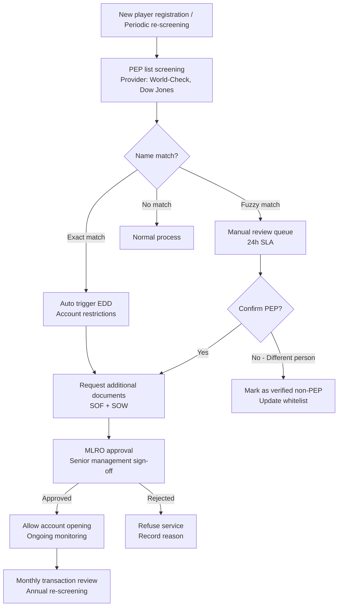
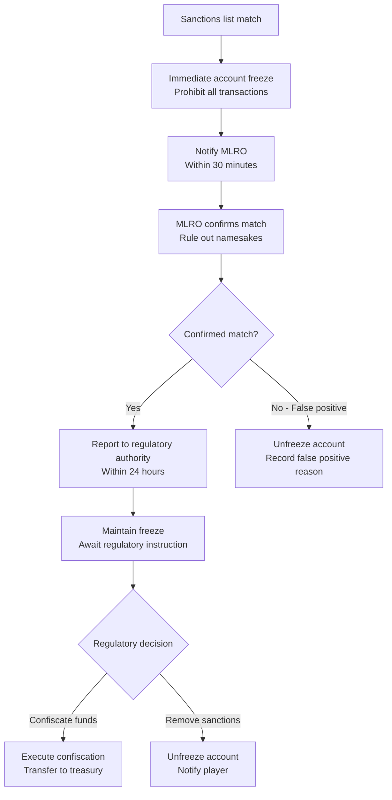
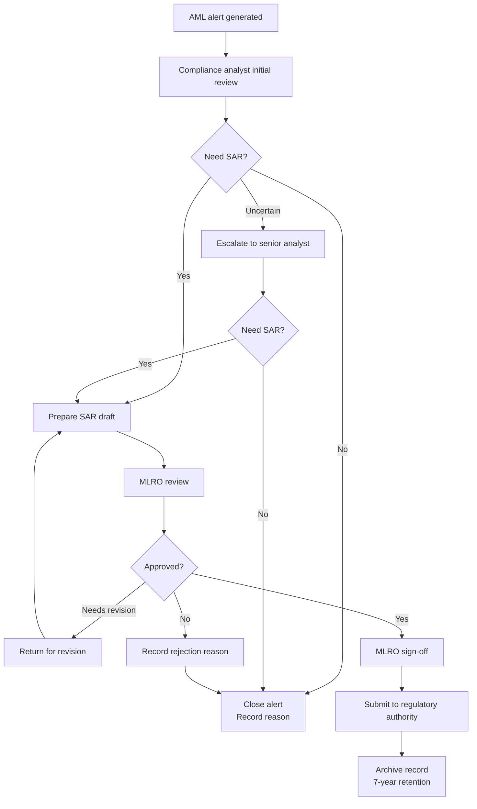

# KYC Verification API Architecture

> **Canonical Source**: [source-archive/05_Risk_Control/05-03_KYC_AML.md](../../source-archive/05_Risk_Control/05-03_KYC_AML.md)
> **Audience**: Architects, Backend Developers, DevOps Engineers
> **Business Requirements**: [KYC_AML_Requirements.md](../../requirements/05_Risk_Compliance/KYC_AML_Requirements.md)
> **Last Synced**: 2026-02-08
> **Source Version**: 4.0.0

---

## Overview

This document covers the technical architecture for implementing KYC (Know Your Customer) and AML (Anti-Money Laundering) verification systems in the SmartAdmin iGaming platform. It includes API specifications, database schemas, verification workflows, third-party integrations, and code examples.

---

## 1. Automated Verification Workflow

### 1.1 KYC Document Verification Flow

```mermaid
flowchart TD
    START[Player uploads document] --> OCR[AI OCR Recognition<br/>Provider: Tesseract + AWS Textract<br/>Extract: Name, DOB, ID Number, Expiry]

    OCR --> VALIDATE{Data Completeness Check<br/>Required fields 100% coverage?<br/>Photo clarity >= 300 DPI?}

    VALIDATE -->|Failed| REJECT1[Auto Reject<br/>Reason: Blurry photo/incomplete data<br/>Action: Request re-upload]

    VALIDATE -->|Passed| FACE[Facial Comparison<br/>Provider: AWS Rekognition<br/>Match threshold: >= 85%]

    FACE --> LIVENESS[Liveness Detection<br/>Anti-spoofing: Blink/head turn<br/>Prevent photo attacks]

    LIVENESS --> WATCHLIST[Blacklist Check<br/>Data sources:<br/>- Internal fraud list<br/>- Cifas National Fraud Database<br/>- PEPs political persons list]

    WATCHLIST -->|Blacklist hit| REJECT2[Auto Block<br/>Action: Permanent ban + Notify compliance team]

    WATCHLIST -->|No hit| RISK_SCORE[Risk Scoring<br/>Combined: IP geolocation, Device fingerprint,<br/>Registration source, Historical behavior]

    RISK_SCORE -->|Score < 30| AUTO_APPROVE[Auto Approve<br/>KYC Level ++<br/>Send notification email]

    RISK_SCORE -->|Score 30-60| MANUAL[Manual Review<br/>Assign to compliance team<br/>SLA: 24 hours]

    RISK_SCORE -->|Score > 60| FLAG[EDD Investigation<br/>Request additional docs (SOF/SOW)<br/>Freeze account until investigation complete]

    AUTO_APPROVE --> END[End]
    MANUAL --> END
    FLAG --> END
    REJECT1 --> END
    REJECT2 --> END
```

### 1.2 SAR Reporting Workflow

```mermaid
flowchart TD
    DETECT[Risk control system detects anomaly] --> ALERT[Generate AML Alert<br/>Risk score >= 80<br/>Auto freeze account]

    ALERT --> REVIEW[Compliance team review<br/>Investigate: Transaction records, Device fingerprint,<br/>Graph analysis, Historical behavior]

    REVIEW -->|Reasonable explanation| CLEAR[Unfreeze<br/>Mark as false positive<br/>Adjust risk model]

    REVIEW -->|Confirmed suspicious| SAR[Submit SAR Report<br/>To regulatory authority:<br/>- UK NCA (7 working days)<br/>- Malta FIAU (15 days)]

    SAR --> FREEZE[Permanent account freeze<br/>Confiscate winnings<br/>Return principal (case by case)]

    SAR --> RECORD[Record retention 7 years<br/>Meet AML regulatory requirements<br/>Hash Chain tamper-proofing]
```

### 1.3 PEP Screening Flow



### 1.4 Sanctions Screening and Asset Freeze Flow



### 1.5 MLRO Approval Flow



---

## 2. Database Schema

### 2.1 KYC Verification Records Table

```sql
CREATE TABLE kyc_verifications (
    id BIGINT PRIMARY KEY AUTO_INCREMENT,
    player_id BIGINT NOT NULL,
    tenant_id BIGINT NOT NULL,
    kyc_level INT NOT NULL COMMENT '0:L0, 1:L1, 2:L2, 3:L3',
    verification_type ENUM('IDENTITY', 'ADDRESS', 'SOF', 'SOW') NOT NULL,
    document_type ENUM('PASSPORT', 'ID_CARD', 'DRIVERS_LICENSE', 'UTILITY_BILL', 'BANK_STATEMENT') NOT NULL,

    -- OCR extracted data
    extracted_data JSON COMMENT '{"name":"John Doe","dob":"1990-01-01","document_number":"AB123456"}',
    ocr_confidence DECIMAL(5,2) COMMENT '0.00-100.00%',

    -- Facial comparison
    face_match_score DECIMAL(5,2) COMMENT '0.00-100.00%',
    liveness_check BOOLEAN DEFAULT FALSE,

    -- Review result
    status ENUM('PENDING', 'APPROVED', 'REJECTED', 'MANUAL_REVIEW') NOT NULL DEFAULT 'PENDING',
    rejection_reason VARCHAR(500),
    reviewed_by BIGINT COMMENT 'Reviewer ID (NULL if auto)',
    reviewed_at DATETIME,

    -- Risk assessment
    risk_score INT COMMENT '0-100',
    risk_flags JSON COMMENT '["BLACKLIST_MATCH", "HIGH_RISK_COUNTRY", "PEP"]',

    -- Third-party service
    provider ENUM('SUMSUB', 'JUMIO', 'AWS_REKOGNITION', 'IN_HOUSE') NOT NULL,
    provider_request_id VARCHAR(100),
    provider_response JSON,

    -- Audit
    created_at DATETIME NOT NULL DEFAULT CURRENT_TIMESTAMP,
    updated_at DATETIME NOT NULL DEFAULT CURRENT_TIMESTAMP ON UPDATE CURRENT_TIMESTAMP,

    INDEX idx_player_id (player_id),
    INDEX idx_tenant_status (tenant_id, status),
    INDEX idx_created_at (created_at)
) ENGINE=InnoDB COMMENT='KYC verification records';
```

### 2.2 AML Alerts Table

```sql
CREATE TABLE aml_alerts (
    id BIGINT PRIMARY KEY AUTO_INCREMENT,
    player_id BIGINT NOT NULL,
    tenant_id BIGINT NOT NULL,

    -- Alert type
    alert_type ENUM('STRUCTURING', 'LAYERING', 'FUND_AGGREGATION', 'TWO_SIDED_BET', 'RAPID_WITHDRAWAL') NOT NULL,
    severity ENUM('LOW', 'MEDIUM', 'HIGH', 'CRITICAL') NOT NULL,

    -- Trigger conditions
    trigger_rule VARCHAR(100) COMMENT 'RULE_CODE: AML_001, AML_002...',
    trigger_details JSON COMMENT '{"transaction_amount": 10000, "frequency": 15, "time_window": "1h"}',

    -- Investigation result
    investigation_status ENUM('OPEN', 'IN_PROGRESS', 'RESOLVED', 'ESCALATED', 'FALSE_POSITIVE') NOT NULL DEFAULT 'OPEN',
    investigation_notes TEXT,
    investigator_id BIGINT,

    -- SAR report
    sar_filed BOOLEAN DEFAULT FALSE,
    sar_reference VARCHAR(100),
    sar_filed_at DATETIME,
    sar_submitted_to ENUM('NCA_UK', 'FIAU_MALTA', 'GFIU_GIBRALTAR', 'OTHER'),

    -- Actions taken
    actions_taken JSON COMMENT '["ACCOUNT_FROZEN", "FUNDS_SEIZED", "PERMANENT_BAN"]',

    -- Audit
    created_at DATETIME NOT NULL DEFAULT CURRENT_TIMESTAMP,
    resolved_at DATETIME,

    INDEX idx_player_id (player_id),
    INDEX idx_tenant_status (tenant_id, investigation_status),
    INDEX idx_severity (severity),
    INDEX idx_created_at (created_at)
) ENGINE=InnoDB COMMENT='AML alerts table';
```

### 2.3 PEP Screening Results Table

```sql
CREATE TABLE t_pep_screening_result (
    id BIGINT PRIMARY KEY AUTO_INCREMENT,
    player_id BIGINT NOT NULL,

    -- Screening result
    is_pep BOOLEAN NOT NULL DEFAULT FALSE,
    pep_category ENUM('FOREIGN_PEP', 'DOMESTIC_PEP', 'INTL_ORG_PEP', 'RCA') COMMENT 'RCA=Related Close Associate',
    pep_position VARCHAR(500) COMMENT 'Position description',
    pep_country VARCHAR(2),

    -- Match details
    match_score DECIMAL(5,4),
    matched_name VARCHAR(200),
    matched_dob DATE,
    screening_provider VARCHAR(50),
    screening_reference VARCHAR(100),

    -- EDD status
    edd_required BOOLEAN DEFAULT FALSE,
    edd_completed BOOLEAN DEFAULT FALSE,
    edd_completed_at DATETIME,
    edd_approved_by BIGINT,

    -- Audit
    screened_at DATETIME DEFAULT CURRENT_TIMESTAMP,
    next_screening_due DATE,

    INDEX idx_player (player_id),
    INDEX idx_pep (is_pep, edd_required)
) ENGINE=InnoDB COMMENT='PEP screening results';

CREATE TABLE t_pep_edd_document (
    id BIGINT PRIMARY KEY AUTO_INCREMENT,
    player_id BIGINT NOT NULL,
    screening_id BIGINT NOT NULL,

    document_type ENUM('SOF', 'SOW', 'DECLARATION', 'PURPOSE', 'OTHER') NOT NULL,
    document_url VARCHAR(500) NOT NULL,
    document_status ENUM('PENDING', 'APPROVED', 'REJECTED') DEFAULT 'PENDING',
    rejection_reason VARCHAR(500),

    reviewed_by BIGINT,
    reviewed_at DATETIME,
    uploaded_at DATETIME DEFAULT CURRENT_TIMESTAMP,

    INDEX idx_player (player_id),
    INDEX idx_screening (screening_id)
) ENGINE=InnoDB COMMENT='PEP EDD documents';
```

### 2.4 Sanctions Screening Log Table

```sql
CREATE TABLE t_sanctions_screening_log (
    id BIGINT PRIMARY KEY AUTO_INCREMENT,
    player_id BIGINT NOT NULL,

    -- Screening info
    screening_type ENUM('REGISTRATION', 'PERIODIC', 'TRANSACTION') NOT NULL,
    screening_lists JSON COMMENT '["UN", "OFAC", "EU", "UK"]',

    -- Match result
    has_match BOOLEAN NOT NULL DEFAULT FALSE,
    matches JSON COMMENT 'Match details',
    match_confidence DECIMAL(5,4),

    -- Action taken
    account_frozen BOOLEAN DEFAULT FALSE,
    frozen_at DATETIME,
    frozen_by BIGINT,

    -- Reporting status
    reported_to_authority BOOLEAN DEFAULT FALSE,
    authority_name VARCHAR(100),
    report_reference VARCHAR(100),
    reported_at DATETIME,

    -- Unfreeze info
    unfrozen BOOLEAN DEFAULT FALSE,
    unfrozen_at DATETIME,
    unfrozen_by BIGINT,
    unfrozen_reason VARCHAR(500),

    -- Audit
    screened_at DATETIME DEFAULT CURRENT_TIMESTAMP,

    INDEX idx_player (player_id),
    INDEX idx_match (has_match, screened_at),
    INDEX idx_frozen (account_frozen)
) ENGINE=InnoDB COMMENT='Sanctions screening log';

CREATE TABLE t_ctf_alert (
    id BIGINT PRIMARY KEY AUTO_INCREMENT,
    player_id BIGINT NOT NULL,

    -- Alert type
    alert_type ENUM(
        'SANCTIONS_MATCH',
        'HIGH_RISK_JURISDICTION',
        'CHARITY_TRANSFER',
        'CROSS_BORDER_STRUCTURING',
        'DUAL_USE_PATTERN'
    ) NOT NULL,

    -- Details
    alert_details JSON,
    risk_score INT NOT NULL,

    -- Processing status
    status ENUM('OPEN', 'INVESTIGATING', 'ESCALATED', 'CLOSED') DEFAULT 'OPEN',
    assigned_to BIGINT,
    resolution VARCHAR(500),

    -- Reporting
    sar_filed BOOLEAN DEFAULT FALSE,
    sar_reference VARCHAR(100),

    -- Timestamps
    created_at DATETIME DEFAULT CURRENT_TIMESTAMP,
    resolved_at DATETIME,

    INDEX idx_player (player_id),
    INDEX idx_status (status, created_at)
) ENGINE=InnoDB COMMENT='CTF alerts table';
```

### 2.5 MLRO Decision Log Table

```sql
CREATE TABLE t_mlro_decision_log (
    id BIGINT PRIMARY KEY AUTO_INCREMENT,
    alert_id BIGINT NOT NULL COMMENT 'Related AML alert',

    -- MLRO decision
    decision ENUM('APPROVE_SAR', 'REJECT_SAR', 'REQUEST_MORE_INFO', 'ESCALATE') NOT NULL,
    decision_reason TEXT NOT NULL,

    -- SAR info
    sar_reference VARCHAR(100) COMMENT 'SAR number (if submitted)',
    sar_submitted_at DATETIME,

    -- MLRO info
    mlro_id BIGINT NOT NULL,
    mlro_name VARCHAR(100),

    -- Timestamp
    decision_at DATETIME DEFAULT CURRENT_TIMESTAMP,

    INDEX idx_alert (alert_id),
    INDEX idx_mlro (mlro_id, decision_at)
) ENGINE=InnoDB COMMENT='MLRO decision log';
```

### 2.6 AML Audit Log Table (7-Year Retention with Hash Chain)

```sql
-- AML audit log table (regulatory compliant)
CREATE TABLE aml_audit_logs (
    id BIGINT PRIMARY KEY AUTO_INCREMENT,
    tenant_id BIGINT NOT NULL,
    player_id BIGINT,

    -- Event type
    event_type ENUM('KYC_SUBMIT', 'KYC_APPROVE', 'KYC_REJECT', 'AML_ALERT', 'SAR_FILED', 'ACCOUNT_FROZEN') NOT NULL,
    event_details JSON,

    -- Operator
    operator_id BIGINT COMMENT 'NULL if system',
    operator_type ENUM('SYSTEM', 'ADMIN', 'COMPLIANCE_OFFICER'),

    -- Tamper-proofing
    hash_value VARCHAR(64) NOT NULL COMMENT 'HMAC-SHA256',
    previous_hash VARCHAR(64),

    -- Audit
    created_at DATETIME NOT NULL DEFAULT CURRENT_TIMESTAMP,

    INDEX idx_tenant_player (tenant_id, player_id),
    INDEX idx_event_type (event_type),
    INDEX idx_created_at (created_at)
) ENGINE=InnoDB COMMENT='AML audit log (7-year retention)';

-- Hash Chain verification trigger
DELIMITER //
CREATE TRIGGER aml_audit_logs_hash_chain
BEFORE INSERT ON aml_audit_logs
FOR EACH ROW
BEGIN
    DECLARE prev_hash VARCHAR(64);

    -- Get previous record hash
    SELECT hash_value INTO prev_hash
    FROM aml_audit_logs
    WHERE tenant_id = NEW.tenant_id
    ORDER BY id DESC
    LIMIT 1;

    -- Set previous_hash
    SET NEW.previous_hash = IFNULL(prev_hash, 'GENESIS');

    -- Calculate current hash: HMAC(previous_hash + event_details + timestamp)
    SET NEW.hash_value = SHA2(CONCAT(NEW.previous_hash, NEW.event_details, NEW.created_at), 256);
END//
DELIMITER ;
```

---

## 3. API Specifications

### 3.1 Submit KYC Document

```java
/**
 * Submit KYC verification document
 */
@PostMapping("/api/kyc/submit")
@SaCheckLogin
public ResponseDTO<KycVerificationVO> submitKycDocument(@RequestBody @Valid KycSubmitForm form) {
    return kycService.submitDocument(form);
}

@Data
public class KycSubmitForm {
    @NotNull
    private KycLevelEnum targetLevel; // L1, L2, L3

    @NotNull
    private DocumentTypeEnum documentType; // PASSPORT, ID_CARD, etc.

    @NotBlank
    private String documentImageUrl; // S3/MinIO file path

    private String selfieImageUrl; // For facial comparison (L1 required)

    private String addressProofUrl; // Address proof (L2 required)

    private List<String> sofDocumentUrls; // SOF document list (L3 required)
}
```

### 3.2 Query KYC Status

```java
/**
 * Query player KYC status
 */
@GetMapping("/api/kyc/status")
@SaCheckLogin
public ResponseDTO<KycStatusVO> getKycStatus() {
    Long playerId = StpUtil.getLoginIdAsLong();
    return kycService.getPlayerKycStatus(playerId);
}

@Data
public class KycStatusVO {
    private Integer currentLevel; // 0, 1, 2, 3
    private KycStatusEnum status; // PENDING, APPROVED, REJECTED
    private String rejectionReason;
    private LocalDateTime submittedAt;
    private LocalDateTime reviewedAt;

    // Next level requirements
    private Integer nextLevel;
    private List<String> requiredDocuments; // ["PASSPORT", "UTILITY_BILL"]

    // Withdrawal limits
    private BigDecimal dailyWithdrawalLimit;
}
```

### 3.3 Admin Manual Review

```java
/**
 * Admin manual KYC document review
 */
@PostMapping("/api/admin/kyc/review")
@SaCheckPermission("kyc:review")
public ResponseDTO<Void> reviewKyc(@RequestBody @Valid KycReviewForm form) {
    return kycService.manualReview(form);
}

@Data
public class KycReviewForm {
    @NotNull
    private Long verificationId;

    @NotNull
    private KycStatusEnum decision; // APPROVED, REJECTED

    private String rejectionReason; // Required when decision=REJECTED

    private Integer riskScore; // 0-100, reviewer adjustment

    private List<String> riskFlags; // ["PEP", "HIGH_RISK_COUNTRY"]
}
```

---

## 4. Service Layer Implementation

### 4.1 PEP Enhanced Due Diligence Service

```java
/**
 * PEP Enhanced Due Diligence Service
 */
@Service
@RequiredArgsConstructor
public class PepEddService {

    private final PepScreeningClient pepScreeningClient;
    private final KycDocumentDao kycDocumentDao;

    /**
     * PEP screening
     */
    public PepScreeningResult screenPlayer(PlayerRegistrationForm form) {
        // 1. Call third-party PEP list
        List<PepMatch> matches = pepScreeningClient.screen(
            form.getFirstName(),
            form.getLastName(),
            form.getDateOfBirth(),
            form.getNationality()
        );

        if (matches.isEmpty()) {
            return PepScreeningResult.notPep();
        }

        // 2. Calculate match confidence
        PepMatch bestMatch = matches.stream()
            .max(Comparator.comparing(PepMatch::getMatchScore))
            .orElse(null);

        if (bestMatch.getMatchScore() >= 0.95) {
            // High confidence match - auto trigger EDD
            return PepScreeningResult.confirmedPep(bestMatch);
        } else if (bestMatch.getMatchScore() >= 0.70) {
            // Medium confidence match - manual review
            return PepScreeningResult.potentialPep(bestMatch);
        }

        return PepScreeningResult.notPep();
    }

    /**
     * PEP EDD required documents
     */
    public List<RequiredDocument> getPepEddRequirements() {
        return List.of(
            new RequiredDocument("SOF", "Source of Funds proof", true),
            new RequiredDocument("SOW", "Source of Wealth proof", true),
            new RequiredDocument("DECLARATION", "PEP declaration form", true),
            new RequiredDocument("PURPOSE", "Account purpose statement", true)
        );
    }

    /**
     * PEP ongoing monitoring
     */
    @Scheduled(cron = "0 0 2 * * ?")
    public void dailyPepTransactionReview() {
        List<Long> pepPlayerIds = playerService.getAllPepPlayers();

        for (Long playerId : pepPlayerIds) {
            // Check yesterday's transactions
            List<Transaction> transactions = transactionService
                .getYesterdayTransactions(playerId);

            // Anomalous transaction detection
            for (Transaction tx : transactions) {
                if (isAnomalousForPep(tx)) {
                    createPepReviewProposal(playerId, tx);
                }
            }
        }
    }
}
```

### 4.2 Sanctions Screening Service

```java
/**
 * Sanctions list screening service
 */
@Service
@RequiredArgsConstructor
public class SanctionsScreeningService {

    private final SanctionsListClient sanctionsClient;

    /**
     * Multi-source sanctions list screening
     */
    public SanctionsScreeningResult screenPlayer(Long playerId) {
        Player player = playerDao.selectById(playerId);

        List<SanctionsMatch> allMatches = new ArrayList<>();

        // 1. UN sanctions list
        allMatches.addAll(sanctionsClient.screenUN(player));

        // 2. OFAC SDN list
        allMatches.addAll(sanctionsClient.screenOFAC(player));

        // 3. EU sanctions list
        allMatches.addAll(sanctionsClient.screenEU(player));

        // 4. UK sanctions list
        allMatches.addAll(sanctionsClient.screenUK(player));

        if (!allMatches.isEmpty()) {
            // Immediately freeze account
            return SanctionsScreeningResult.matched(allMatches);
        }

        return SanctionsScreeningResult.clear();
    }

    /**
     * High-risk jurisdiction check
     */
    public boolean isHighRiskJurisdiction(String countryCode) {
        // FATF Blacklist (High-Risk)
        Set<String> blacklist = Set.of("KP", "IR", "MM");

        // FATF Greylist (Increased Monitoring)
        Set<String> greylist = Set.of("SY", "YE", "AF", "AL", "BF", "CM",
            "CD", "GH", "HT", "JM", "JO", "ML", "MZ", "NI", "NG", "PA",
            "PH", "SN", "SS", "TZ", "TG", "UG", "AE", "VN");

        return blacklist.contains(countryCode) || greylist.contains(countryCode);
    }
}
```

### 4.3 Smurfing Detection Service

```java
/**
 * Smurfing detection service
 */
@Service
@RequiredArgsConstructor
public class SmurfingDetector {

    // Threshold slightly below reporting threshold
    private static final BigDecimal SINGLE_THRESHOLD = new BigDecimal("1800");
    private static final BigDecimal AGGREGATE_THRESHOLD = new BigDecimal("2000");
    private static final int TIME_WINDOW_HOURS = 24;

    /**
     * Detect structured deposits
     */
    public SmurfingResult detectStructuredDeposits(Long playerId) {
        LocalDateTime since = LocalDateTime.now().minusHours(TIME_WINDOW_HOURS);

        List<Deposit> recentDeposits = depositDao.findByPlayerIdAndTimeRange(
            playerId, since, LocalDateTime.now());

        // Filter deposits near threshold
        List<Deposit> suspiciousDeposits = recentDeposits.stream()
            .filter(d -> d.getAmount().compareTo(SINGLE_THRESHOLD) >= 0 &&
                        d.getAmount().compareTo(AGGREGATE_THRESHOLD) < 0)
            .toList();

        // Calculate cumulative amount
        BigDecimal totalAmount = recentDeposits.stream()
            .map(Deposit::getAmount)
            .reduce(BigDecimal.ZERO, BigDecimal::add);

        // Smurfing signal determination
        if (suspiciousDeposits.size() >= 3 &&
            totalAmount.compareTo(AGGREGATE_THRESHOLD.multiply(new BigDecimal("2"))) >= 0) {
            return SmurfingResult.detected(
                suspiciousDeposits,
                totalAmount,
                "Multiple near-threshold deposits, cumulative amount exceeds threshold"
            );
        }

        return SmurfingResult.normal();
    }
}
```

### 4.4 Risk Scoring Model

```java
/**
 * KYC risk score calculation
 */
public int calculateKycRiskScore(Long playerId, KycVerificationEntity verification) {
    int score = 0;

    // 1. Identity dimension (Weight: High)
    if (verification.getOcrConfidence() < 90.0) {
        score += 20; // Low OCR confidence
    }
    if (verification.getFaceMatchScore() < 85.0) {
        score += 30; // Low face match score
    }
    if (!verification.getLivenessCheck()) {
        score += 40; // Liveness check failed
    }

    // 2. Device dimension (Weight: High)
    if (deviceFingerprintService.isEmulator(playerId)) {
        score += 25; // Using emulator
    }
    if (deviceFingerprintService.isVpnDetected(playerId)) {
        score += 15; // Using VPN
    }

    // 3. Geolocation dimension (Weight: Medium)
    String country = geoService.getPlayerCountry(playerId);
    if (isHighRiskCountry(country)) {
        score += 20; // FATF blacklist country
    }
    if (geoService.isMismatch(playerId, verification.getDocumentCountry())) {
        score += 15; // Document country doesn't match IP
    }

    // 4. Blacklist dimension (Weight: Very High)
    if (blacklistService.isPep(verification.getExtractedName())) {
        score += 50; // Politically exposed person
    }
    if (blacklistService.isInFraudDatabase(verification.getDocumentNumber())) {
        score += 80; // Fraud database hit
    }

    // 5. Historical behavior dimension (Weight: Medium)
    if (playerService.hasMultipleRejectedKyc(playerId)) {
        score += 10; // Multiple rejections
    }

    return Math.min(score, 100); // Cap at 100
}
```

---

## 5. Graph Analysis (Neo4j)

### 5.1 Fund Flow Aggregation Detection

```cypher
// Detect fund flow aggregation (multiple losers -> 1 winner)
MATCH (loser:Player)-[d:DEPOSIT]->(platform:Platform)
MATCH (platform)-[w:WITHDRAWAL]->(winner:Player)
WHERE loser.id <> winner.id
  AND w.bank_account = loser.bank_account
  AND w.amount >= 1000
WITH winner, count(DISTINCT loser) AS loser_count
WHERE loser_count >= 3
RETURN winner.id, winner.username, loser_count
ORDER BY loser_count DESC;
```

### 5.2 Device Fingerprint Aggregation Detection

```cypher
// Detect device fingerprint aggregation (multiple accounts on same device)
MATCH (p:Player)-[:USES_DEVICE]->(d:Device)
WITH d, count(p) AS player_count
WHERE player_count >= 5
MATCH (p:Player)-[:USES_DEVICE]->(d)
RETURN d.fingerprint, collect(p.username) AS accounts, player_count
ORDER BY player_count DESC;
```

**BFS Depth Limit**: 3 levels (to prevent query timeout, single query < 500ms)

---

## 6. KYC Level Upgrade Trigger Rules

```sql
-- L1 upgrade trigger conditions (UKGC: GBP 2,000 cumulative deposit OR first withdrawal)
SELECT player_id
FROM players
WHERE kyc_level = 0
  AND (cumulative_deposit >= 2000 OR first_withdrawal_requested = TRUE);

-- L2 upgrade trigger conditions
SELECT player_id
FROM players
WHERE kyc_level = 1
  AND (cumulative_deposit >= 5000 OR vip_level >= 3);

-- L3 EDD trigger conditions
SELECT player_id
FROM players
WHERE (single_transaction >= 10000 OR cumulative_deposit >= 50000)
  OR is_pep = TRUE
  OR risk_score >= 80;
```

---

## 7. Third-Party Integration Patterns

### 7.1 Provider Comparison

| Provider | Function | Integration Method | Cost |
|----------|----------|-------------------|------|
| **Sumsub** | Full KYC flow (OCR + Face + Liveness) | REST API + Webhook | $0.5-2.0/verification |
| **Jumio** | Identity verification + AML screening | SDK + API | $1.0-3.0/verification |
| **AWS Rekognition** | Facial comparison + Liveness detection | AWS SDK | $0.001/image |
| **Tesseract OCR** | Open-source OCR (self-hosted) | Self-Hosted | Free |
| **Cifas** | UK National Fraud Database | API (1,100+ companies shared) | GBP 5,000/year |

### 7.2 Recommended Architecture by Scale

- **Small operators (< 10K players)**: Sumsub all-in-one (fast deployment)
- **Medium operators (10K-100K)**: Jumio + AWS Rekognition (cost-optimized)
- **Large operators (> 100K)**: Self-built OCR + AWS Rekognition (lowest cost)

---

## 8. Data Retention Strategy

| Tier | Storage | Retention | Purpose |
|------|---------|-----------|---------|
| Hot Data | Elasticsearch | 30 days | Real-time queries |
| Warm Data | S3 | 1 year | Periodic audits |
| Cold Data | AWS Glacier | 7 years | Regulatory compliance |

---

## 9. Monitoring and Metrics

### 9.1 KYC Metrics

| Metric | Definition | Target | Formula |
|--------|------------|--------|---------|
| **KYC Completion Rate** | Players who completed L1 verification | >= 85% | (L1+ players / Total players) x 100% |
| **Auto-approval Rate** | Auto-reviewed approvals | >= 90% (L1), >= 70% (L2) | (Auto-approvals / Total submissions) x 100% |
| **Average Review Time** | Time from submission to result | < 5 min (L1), < 24h (L2) | AVG(reviewed_at - created_at) |
| **Rejection Rate** | Rejected KYC submissions | < 10% | (REJECTED count / Total submissions) x 100% |
| **False Positive Rate** | Legitimate players incorrectly rejected | < 2% | (False positives / Total rejections) x 100% |

### 9.2 AML Metrics

| Metric | Definition | Target | Regulatory Requirement |
|--------|------------|--------|------------------------|
| **SAR Timeliness Rate** | SAR submitted within deadline | 100% | UKGC: 7 working days, MGA: 15 days |
| **Alert Resolution Rate** | Alerts closed within 30 days | >= 95% | - |
| **False Positive Rate** | FALSE_POSITIVE alerts proportion | < 15% | - |
| **SOF Review Completion Rate** | EDD cases with completed SOF review | 100% | Large transaction mandatory |

---

## Related Documentation

### Technical References
- [06-05 Data Security Strategy](../../source-archive/06_Platform_Governance/06-05_Data_Security.md) - Personal data encryption, audit logs
- [06-04 Approval Workflow System](../../source-archive/06_Platform_Governance/06-04_Approval_Workflow.md) - KYC manual review process
- [09-02-01 Gateway Architecture](../../source-archive/09_Technical_Infrastructure/09-02-01_Gateway_Core.md) - API security, brute force protection

### Third-Party Integration
- [14-01 Third-Party Integration Standards](../../source-archive/14_Third_Party_Integration/14-01_Third_Party_Integration.md) - Sumsub/Jumio integration guide

---

**Document Maintenance**: Update with API changes and new integration patterns
**Last Review**: 2026-02-08 (Engineering Team)
