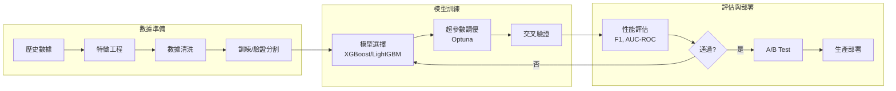

# 機器學習整合架構（ML Integration Architecture）

> **規範來源**: [05-02-03_ML_Integration.md](../../source-archive/05_Risk_Control/05-02-03_ML_Integration.md)
> **目標讀者**: Architects, ML Engineers
> **業務需求**: [ML_Requirements.md](../../requirements/05_Risk_Compliance/ML_Requirements.md)
> **最後同步**: 2026-02-08

---

## 1. 概述（Overview）

本文檔涵蓋基於機器學習的風險檢測系統技術架構,包括遊戲類型維度規則配置、玩家風險畫像、模型訓練管道、評估指標、A/B Testing 以及監控基礎設施。

---

## 2. 遊戲類型維度規則配置（Game-Type Dimensional Rule Configuration）

### 2.1 數據庫架構：t_risk_rule_config

規則按遊戲類型進行過濾,並可排除特定遊戲。`game_types` 欄位使用 JSON 陣列實現靈活的多類型匹配,`excluded_games` 允許細粒度的單遊戲覆蓋。

**查詢：選擇適用於特定遊戲的規則**

```sql
SELECT
    rule_code,
    rule_name,
    action_type,
    rule_params
FROM t_risk_rule_config
WHERE enabled = TRUE
  AND (
    game_types IS NULL
    OR JSON_CONTAINS(game_types, JSON_QUOTE(#{gameType}))
  )
  AND deleted = FALSE
ORDER BY rule_category, rule_code;
```

### 2.2 遊戲類型枚舉（Game Type Enum）

```java
public enum GameType {
    SPORTS("體育博彩"),
    LIVE("真人娛樂"),
    SLOTS("老虎機"),
    LOTTERY("彩票"),
    POKER("撲克"),
    FISHING("捕魚機"),
    ESPORTS("電子競技");

    private final String description;

    GameType(String description) {
        this.description = description;
    }
}
```

### 2.3 配置範例（Configuration Examples）

```sql
-- Sports-only rules
INSERT INTO t_risk_rule_config (rule_code, rule_name, action_type, game_types) VALUES
('SAME_MATCH_HEDGE', '同局反向投注', 'BLOCK', '["SPORTS"]'),
('CROSS_MATCH_HEDGE', '跨局反向投注', 'FLAG', '["SPORTS"]');

-- Sports + Live Casino rules
INSERT INTO t_risk_rule_config (rule_code, rule_name, action_type, game_types) VALUES
('LOW_ODDS_WAGERING', '低賠率洗水', 'FLAG', '["SPORTS", "LIVE"]');

-- Universal rules (game_types = NULL)
INSERT INTO t_risk_rule_config (rule_code, rule_name, action_type, game_types) VALUES
('BLACKLIST_PLAYER', '黑名單玩家', 'BLOCK', NULL),
('BOT_DETECTION', '機器人檢測', 'BLOCK', NULL);
```

### 2.4 遊戲排除過濾（Game Exclusion Filtering）

```sql
-- Exclude specific games from a rule
UPDATE t_risk_rule_config
SET excluded_games = '["EVOLUTION_BACCARAT", "EVOLUTION_DRAGON_TIGER"]'
WHERE rule_code = 'LOW_ODDS_WAGERING';

-- Query with exclusion filtering
SELECT
    rule_code,
    rule_name,
    action_type
FROM t_risk_rule_config
WHERE enabled = TRUE
  AND (
    excluded_games IS NULL
    OR NOT JSON_CONTAINS(excluded_games, JSON_QUOTE(#{gameId}))
  )
  AND deleted = FALSE;
```

### 2.5 Dao 實現（Dao Implementation）

```java
@Mapper
public interface RiskRuleConfigDao extends BaseMapper<RiskRuleConfigEntity> {

    @Select({
        "<script>",
        "SELECT * FROM t_risk_rule_config",
        "WHERE enabled = TRUE",
        "  AND deleted = FALSE",
        "  AND (",
        "    game_types IS NULL",
        "    OR JSON_CONTAINS(game_types, #{gameType})",
        "  )",
        "  AND (",
        "    excluded_games IS NULL",
        "    OR NOT JSON_CONTAINS(excluded_games, #{gameId})",
        "  )",
        "ORDER BY rule_category, rule_code",
        "</script>"
    })
    List<RiskRuleConfigEntity> selectEnabledRulesForGame(
        @Param("gameType") String gameType,
        @Param("gameId") String gameId
    );
}
```

---

## 3. 玩家風險畫像（Player Risk Profile）

### 3.1 數據庫架構：t_player_risk_profile

```sql
CREATE TABLE t_player_risk_profile (
    id BIGINT PRIMARY KEY AUTO_INCREMENT COMMENT '玩家風險檔案 ID',
    player_id BIGINT NOT NULL UNIQUE COMMENT '玩家 ID',

    -- Risk Level
    risk_level VARCHAR(20) DEFAULT 'LOW' COMMENT 'LOW/MEDIUM/HIGH/BLACKLIST',
    risk_score INT DEFAULT 0 COMMENT '0-100',

    -- Statistics
    total_bets INT DEFAULT 0 COMMENT '總投注次數',
    total_bet_amount DECIMAL(15, 2) DEFAULT 0 COMMENT '總投注金額',
    total_win_amount DECIMAL(15, 2) DEFAULT 0 COMMENT '總贏得金額',
    win_rate DECIMAL(5, 2) DEFAULT 0 COMMENT '勝率 (%)',

    -- Risk Flags
    flagged_count INT DEFAULT 0 COMMENT '被風控標記次數',
    blocked_count INT DEFAULT 0 COMMENT '被阻斷次數',
    last_flagged_at DATETIME COMMENT '最後風控標記時間',

    -- Blacklist
    is_blacklisted BOOLEAN DEFAULT FALSE COMMENT '是否黑名單',
    blacklist_reason VARCHAR(500) COMMENT '黑名單原因',
    blacklisted_at DATETIME COMMENT '加入黑名單時間',
    blacklisted_by BIGINT COMMENT '操作人員 ID',

    -- Audit
    created_at DATETIME DEFAULT CURRENT_TIMESTAMP,
    updated_at DATETIME DEFAULT CURRENT_TIMESTAMP ON UPDATE CURRENT_TIMESTAMP,
    deleted BOOLEAN DEFAULT FALSE,

    INDEX idx_risk_level (risk_level, deleted),
    INDEX idx_blacklist (is_blacklisted, deleted),
    INDEX idx_last_flagged (last_flagged_at)
) COMMENT='玩家風險檔案表';
```

### 3.2 風險評分計算（Risk Score Calculation）— Manager 層

```java
@Service
@RequiredArgsConstructor
public class PlayerRiskProfileManager {

    private final PlayerRiskProfileDao playerRiskProfileDao;
    private final RiskProposalDao riskProposalDao;

    @Transactional(rollbackFor = Throwable.class)
    public int updateRiskScore(Long playerId) {
        PlayerRiskProfileEntity profile = playerRiskProfileDao.selectById(playerId);
        if (profile == null) {
            profile = createDefaultProfile(playerId);
        }

        int score = calculateRiskScore(profile);
        String riskLevel = determineRiskLevel(score);

        profile.setRiskScore(score);
        profile.setRiskLevel(riskLevel);
        playerRiskProfileDao.updateById(profile);

        return score;
    }

    /**
     * Risk score calculation (0-100)
     * Factors:
     * - Flag count: +5 per flag (max 30)
     * - Block count: +10 per block (max 40)
     * - Abnormal win rate (>60% or <30%): +20
     * - Recent proposals (30d): +3 per proposal (max 20)
     */
    private int calculateRiskScore(PlayerRiskProfileEntity profile) {
        int score = 0;

        // Factor 1: Flag count
        score += Math.min(profile.getFlaggedCount() * 5, 30);

        // Factor 2: Block count
        score += Math.min(profile.getBlockedCount() * 10, 40);

        // Factor 3: Abnormal win rate
        BigDecimal winRate = profile.getWinRate();
        if (winRate.compareTo(new BigDecimal("60")) > 0 ||
            winRate.compareTo(new BigDecimal("30")) < 0) {
            score += 20;
        }

        // Factor 4: Recent proposals (30 days)
        LocalDateTime startDate = LocalDateTime.now().minusDays(30);
        int recentProposals = riskProposalDao.countByPlayerId(
            profile.getPlayerId(), startDate);
        score += Math.min(recentProposals * 3, 20);

        return Math.min(Math.max(score, 0), 100);
    }

    private String determineRiskLevel(int score) {
        if (score >= 80) return "HIGH";
        if (score >= 50) return "MEDIUM";
        return "LOW";
    }
}
```

### 3.3 黑名單檢查規則（Blacklist Check Rule）

```java
public class BlacklistPlayerRule implements RiskRule {

    private final PlayerRiskProfileDao playerRiskProfileDao;

    @Override
    public RuleCheckResult execute(BetRequest betRequest) {
        PlayerRiskProfileEntity profile =
            playerRiskProfileDao.selectById(betRequest.getPlayerId());

        if (profile != null && profile.getIsBlacklisted()) {
            return RuleCheckResult.builder()
                .matched(true)
                .ruleCode("BLACKLIST_PLAYER")
                .ruleName("黑名單玩家")
                .matchedReason(String.format(
                    "玩家已被列入黑名單: %s (加入時間: %s)",
                    profile.getBlacklistReason(),
                    profile.getBlacklistedAt()
                ))
                .build();
        }

        return RuleCheckResult.notMatched();
    }
}
```

---

## 4. ML 模型訓練管道（ML Model Training Pipeline）



---

## 5. 模型評估指標（Model Evaluation Metrics）

### 5.1 性能基準（Performance Benchmarks）

| 模型 | 使用場景 | 準確率目標 | 延遲目標 | 當前成熟度 |
|------|---------|-----------|---------|-----------|
| Abnormal Betting Detection | 可疑投注模式檢測 | >= 95% | < 50ms | 4/5 |
| Multi-Account Detection | 設備/行為聚類 | >= 90% | < 100ms | 4/5 |
| Bonus Abuse Detection | 紅利濫用模式檢測 | >= 85% | < 200ms | 3/5 |
| AML Risk Scoring | 反洗錢風險評級 | >= 80% | < 500ms | 3/5 |
| Fraudulent Transaction Detection | 支付欺詐識別 | >= 92% | < 100ms | 4/5 |

### 5.2 指標實現（Metric Implementations）

```java
public class MLModelMetrics {

    /**
     * F1 Score = 2 * (Precision * Recall) / (Precision + Recall)
     */
    public double calculateF1Score(ConfusionMatrix cm) {
        double precision = (double) cm.getTruePositives() /
            (cm.getTruePositives() + cm.getFalsePositives());
        double recall = (double) cm.getTruePositives() /
            (cm.getTruePositives() + cm.getFalseNegatives());

        if (precision + recall == 0) return 0;
        return 2 * (precision * recall) / (precision + recall);
    }

    /**
     * AUC-ROC calculation via trapezoidal approximation
     */
    public double calculateAUCROC(List<PredictionResult> predictions) {
        predictions.sort(
            Comparator.comparing(PredictionResult::getScore).reversed());

        int positives = (int) predictions.stream()
            .filter(p -> p.isActualPositive()).count();
        int negatives = predictions.size() - positives;

        if (positives == 0 || negatives == 0) return 0.5;

        double auc = 0;
        int tpCount = 0;

        for (PredictionResult pred : predictions) {
            if (pred.isActualPositive()) {
                tpCount++;
            } else {
                auc += tpCount;
            }
        }

        return auc / (positives * negatives);
    }
}
```

---

## 6. A/B Testing 框架（A/B Testing Framework）

```java
@Service
@RequiredArgsConstructor
public class MLABTestService {

    /**
     * A/B test routing via consistent hashing
     */
    public RiskCheckResult executeWithABTest(
            BetRequest request,
            String experimentId) {

        Experiment experiment = experimentDao.findById(experimentId);

        // Consistent hash for group assignment
        int bucket = Math.abs(request.getPlayerId().hashCode() % 100);

        if (bucket < experiment.getTreatmentRatio()) {
            // Treatment group - new model
            RiskCheckResult result = newModelService.evaluate(request);
            logExperimentResult(experimentId, "TREATMENT", request, result);
            return result;
        } else {
            // Control group - current model
            RiskCheckResult result = currentModelService.evaluate(request);
            logExperimentResult(experimentId, "CONTROL", request, result);
            return result;
        }
    }

    /**
     * Statistical significance testing (Chi-Square)
     */
    public ABTestResult analyzeExperiment(String experimentId) {
        ExperimentStats control =
            experimentDao.getStats(experimentId, "CONTROL");
        ExperimentStats treatment =
            experimentDao.getStats(experimentId, "TREATMENT");

        double chiSquare = calculateChiSquare(control, treatment);
        double pValue =
            chiSquareDistribution.cumulativeProbability(chiSquare);

        return ABTestResult.builder()
            .experimentId(experimentId)
            .controlF1(control.getF1Score())
            .treatmentF1(treatment.getF1Score())
            .improvement(
                (treatment.getF1Score() - control.getF1Score())
                / control.getF1Score())
            .pValue(pValue)
            .isSignificant(pValue < 0.05)
            .build();
    }
}
```

---

## 7. 模型漂移監控（Model Drift Monitoring）

### 7.1 漂移檢測策略（Drift Detection Strategy）

| 漂移類型 | 檢測方法 | 警報閾值 |
|---------|---------|---------|
| Data Drift（數據漂移） | 特徵分佈變化 (KS Test, PSI) | PSI > 0.2 |
| Concept Drift（概念漂移） | 預測分佈偏移、準確率下降 | F1 下降 > 5% |
| Latency Drift（延遲漂移） | 推理時間增加 | 延遲增加 > 50% |

### 7.2 監控動作（Monitoring Actions）

| 條件 | 自動化響應 |
|------|-----------|
| PSI > 0.2 | 重新評估模型;警報 ML 團隊 |
| F1 下降 > 5% | 觸發重新訓練管道 |
| 延遲增加 > 50% | 擴展基礎設施;優化模型 |

---

## 8. Prometheus 監控指標（Prometheus Monitoring Metrics）

```yaml
ml_model_prediction_total:
  type: counter
  labels: [model_name, model_version, prediction]
  description: "Total ML model predictions"

ml_model_latency_seconds:
  type: histogram
  labels: [model_name, model_version]
  buckets: [0.01, 0.025, 0.05, 0.1, 0.25, 0.5]
  description: "ML model inference latency"

ml_model_accuracy:
  type: gauge
  labels: [model_name, model_version]
  description: "ML model accuracy (rolling 7-day)"

ml_model_drift_score:
  type: gauge
  labels: [model_name, drift_type]
  description: "Model drift score (PSI)"
```

---

## 9. 交叉引用（Cross-References）

| 主題 | 文檔 |
|------|------|
| 業務需求 | requirements/05_Risk_Compliance/ML_Requirements.md |
| 檢測模型概述 | source/05_Risk_Control/05-02-01_Detection_Model.md |
| 規則配置 | source/05_Risk_Control/05-02-02_Rule_Configuration.md |
| 運營工具 | source/05_Risk_Control/05-02-04_Operations_Tools.md |

---

**文檔版本**: v1.0.0
**最後更新**: 2026-02-12
**維護團隊**: SmartAdmin Architecture Team
