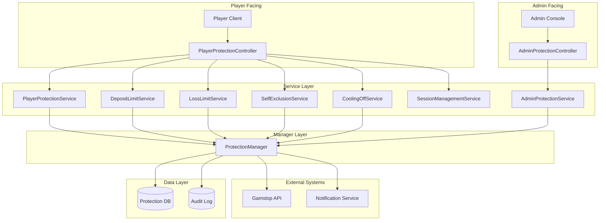

# Player Protection API (玩家保護 API 技術規格)

> **Canonical Source**: [15-07_Player_Protection_API.md](../../source-archive/15_Responsible_Gambling/15-07_Player_Protection_API.md)
> **Audience**: Architects, Backend Developers
> **Business Requirements**: [Player_Protection_Requirements.md](../../requirements/05_Risk_Compliance/Player_Protection_Requirements.md)
> **Last Synced**: 2026-02-08

---

## 1. Overview

This document defines the RESTful API specification for the Player Protection module, covering both player-facing and admin-facing endpoints for responsible gambling tools.

---

## 2. API Endpoint Summary

### 2.1 Player-Facing Endpoints

| Endpoint | Method | Description |
|----------|--------|-------------|
| `/api/v1/player/protection/settings` | GET | Retrieve all protection settings |
| `/api/v1/player/protection/settings` | PUT | Update protection settings |
| `/api/v1/player/protection/deposit-limits` | GET | Retrieve deposit limits |
| `/api/v1/player/protection/deposit-limits` | PUT | Set deposit limits |
| `/api/v1/player/protection/loss-limits` | GET | Retrieve loss limits |
| `/api/v1/player/protection/loss-limits` | PUT | Set loss limits |
| `/api/v1/player/protection/self-exclusion` | POST | Request self-exclusion |
| `/api/v1/player/protection/self-exclusion/revoke` | POST | Request exclusion revocation |
| `/api/v1/player/protection/cooling-off` | POST | Activate cooling-off period |
| `/api/v1/player/protection/session-limits` | GET | Retrieve session limits |
| `/api/v1/player/protection/session-limits` | PUT | Set session limits |
| `/api/v1/player/protection/activity-history` | GET | Retrieve activity history |
| `/api/v1/player/protection/usage` | GET | Retrieve limit usage |

### 2.2 Admin-Facing Endpoints

| Endpoint | Method | Description |
|----------|--------|-------------|
| `/api/v1/admin/protection/exclusions` | GET | List excluded players |
| `/api/v1/admin/protection/exclusions/{playerId}` | GET | Player exclusion details |
| `/api/v1/admin/protection/exclusions/{playerId}` | POST | Operator-initiated exclusion |
| `/api/v1/admin/protection/reports` | GET | Compliance reports |
| `/api/v1/admin/protection/reports/export` | POST | Export reports |
| `/api/v1/admin/protection/gamstop/sync` | POST | Gamstop synchronisation |
| `/api/v1/admin/protection/gamstop/check` | POST | Gamstop lookup |

---

## 3. Detailed API Specifications

### 3.1 Get Protection Settings

**Request**
```http
GET /api/v1/player/protection/settings
Authorization: Bearer {token}
```

**Response**
```json
{
  "code": 200,
  "msg": "success",
  "data": {
    "selfExclusion": {
      "active": false,
      "endTime": null
    },
    "coolingOff": {
      "active": false,
      "endTime": null
    },
    "depositLimits": {
      "daily": 1000.00,
      "weekly": 5000.00,
      "monthly": 15000.00,
      "pendingChanges": []
    },
    "lossLimits": {
      "daily": 500.00,
      "weekly": 2000.00,
      "monthly": null,
      "pendingChanges": []
    },
    "sessionLimits": {
      "durationMinutes": 60,
      "idleTimeoutMinutes": 30,
      "realityCheckIntervalMinutes": 30
    },
    "lastUpdated": "2026-02-07T10:30:00Z"
  }
}
```

### 3.2 Set Deposit Limits

**Request**
```http
PUT /api/v1/player/protection/deposit-limits
Authorization: Bearer {token}
Content-Type: application/json

{
  "dailyLimit": 500.00,
  "weeklyLimit": 2000.00,
  "monthlyLimit": 8000.00
}
```

**Response**
```json
{
  "code": 200,
  "msg": "success",
  "data": {
    "currentLimits": {
      "daily": 500.00,
      "weekly": 2000.00,
      "monthly": 8000.00
    },
    "pendingChanges": [
      {
        "type": "MONTHLY",
        "oldValue": 5000.00,
        "newValue": 8000.00,
        "effectiveTime": "2026-02-08T10:30:00Z",
        "status": "PENDING"
      }
    ],
    "message": "日限額和週限額已立即生效，月限額提高將於 24 小時後生效"
  }
}
```

### 3.3 Request Self-Exclusion

**Request**
```http
POST /api/v1/player/protection/self-exclusion
Authorization: Bearer {token}
Content-Type: application/json

{
  "duration": "6M",
  "reason": "需要休息一段時間",
  "coolingOffConfirmed": true
}
```

**Response**
```json
{
  "code": 200,
  "msg": "success",
  "data": {
    "exclusionId": 12345,
    "status": "ACTIVE",
    "startTime": "2026-02-07T10:30:00Z",
    "endTime": "2026-08-07T10:30:00Z",
    "duration": "6M",
    "message": "自我排除已生效，將於 2026-08-07 結束"
  }
}
```

**Duration Options**

| Value | Description |
|-------|-------------|
| `24H` | 24 hours |
| `7D` | 7 days |
| `30D` | 30 days |
| `6M` | 6 months |
| `1Y` | 1 year |
| `5Y` | 5 years |
| `PERMANENT` | Permanent |

### 3.4 Activate Cooling-Off

**Request**
```http
POST /api/v1/player/protection/cooling-off
Authorization: Bearer {token}
Content-Type: application/json

{
  "duration": "D7",
  "reason": "短暫休息"
}
```

**Response**
```json
{
  "code": 200,
  "msg": "success",
  "data": {
    "status": "ACTIVE",
    "startTime": "2026-02-07T10:30:00Z",
    "endTime": "2026-02-14T10:30:00Z",
    "message": "冷靜期已啟動，將於 2026-02-14 自動結束"
  }
}
```

### 3.5 Get Limit Usage

**Request**
```http
GET /api/v1/player/protection/usage
Authorization: Bearer {token}
```

**Response**
```json
{
  "code": 200,
  "msg": "success",
  "data": {
    "depositLimits": {
      "daily": {
        "limit": 1000.00,
        "used": 350.00,
        "remaining": 650.00,
        "percentage": 35,
        "resetTime": "2026-02-08T00:00:00Z"
      },
      "weekly": {
        "limit": 5000.00,
        "used": 1200.00,
        "remaining": 3800.00,
        "percentage": 24,
        "resetTime": "2026-02-12T00:00:00Z"
      },
      "monthly": {
        "limit": 15000.00,
        "used": 4500.00,
        "remaining": 10500.00,
        "percentage": 30,
        "resetTime": "2026-03-01T00:00:00Z"
      }
    },
    "lossLimits": {
      "daily": {
        "limit": 500.00,
        "current": 120.00,
        "remaining": 380.00,
        "percentage": 24,
        "resetTime": "2026-02-08T00:00:00Z"
      },
      "weekly": {
        "limit": 2000.00,
        "current": 450.00,
        "remaining": 1550.00,
        "percentage": 22.5,
        "resetTime": "2026-02-12T00:00:00Z"
      },
      "monthly": null
    },
    "session": {
      "currentDuration": 45,
      "limitMinutes": 60,
      "nextRealityCheck": "2026-02-07T11:00:00Z"
    }
  }
}
```

### 3.6 Get Activity History

**Request**
```http
GET /api/v1/player/protection/activity-history
Authorization: Bearer {token}
```

**Query Parameters**

| Parameter | Type | Required | Description |
|-----------|------|----------|-------------|
| `startDate` | String | No | Start date (YYYY-MM-DD) |
| `endDate` | String | No | End date (YYYY-MM-DD) |
| `type` | String | No | Activity type: EXCLUSION, LIMIT_CHANGE, COOLING_OFF, REALITY_CHECK |
| `page` | Integer | No | Page number (default: 1) |
| `pageSize` | Integer | No | Page size (default: 20) |

**Response**
```json
{
  "code": 200,
  "msg": "success",
  "data": {
    "total": 45,
    "page": 1,
    "pageSize": 20,
    "records": [
      {
        "id": 1001,
        "type": "LIMIT_CHANGE",
        "subType": "DEPOSIT_LIMIT",
        "action": "DECREASE",
        "oldValue": "1500.00",
        "newValue": "1000.00",
        "effectiveTime": "2026-02-06T15:30:00Z",
        "createdAt": "2026-02-06T15:30:00Z"
      },
      {
        "id": 1002,
        "type": "REALITY_CHECK",
        "sessionDuration": 60,
        "netResult": -150.00,
        "response": "CONTINUE",
        "createdAt": "2026-02-05T20:00:00Z"
      }
    ]
  }
}
```

---

## 4. Admin API Specifications

### 4.1 List Excluded Players

**Request**
```http
GET /api/v1/admin/protection/exclusions
Authorization: Bearer {admin_token}
```

**Query Parameters**

| Parameter | Type | Description |
|-----------|------|-------------|
| `status` | String | ACTIVE, COMPLETED, PENDING_REVOCATION |
| `type` | String | SELF, OPERATOR, GAMSTOP |
| `page` | Integer | Page number |
| `pageSize` | Integer | Page size |

**Response**
```json
{
  "code": 200,
  "msg": "success",
  "data": {
    "total": 128,
    "page": 1,
    "pageSize": 20,
    "records": [
      {
        "id": 5001,
        "playerId": 10001,
        "playerName": "player***",
        "email": "p***@email.com",
        "exclusionType": "SELF",
        "duration": "6M",
        "startTime": "2026-01-15T10:00:00Z",
        "endTime": "2026-07-15T10:00:00Z",
        "status": "ACTIVE",
        "gamstopSynced": true,
        "createdAt": "2026-01-15T10:00:00Z"
      }
    ]
  }
}
```

### 4.2 Operator-Initiated Exclusion

**Request**
```http
POST /api/v1/admin/protection/exclusions/{playerId}
Authorization: Bearer {admin_token}
Content-Type: application/json

{
  "duration": "1Y",
  "reason": "疑似問題博彩行為",
  "notifyPlayer": true
}
```

**Response**
```json
{
  "code": 200,
  "msg": "success",
  "data": {
    "exclusionId": 5002,
    "playerId": 10002,
    "status": "ACTIVE",
    "message": "玩家已被排除，並已發送通知"
  }
}
```

### 4.3 Compliance Reports

**Request**
```http
GET /api/v1/admin/protection/reports
Authorization: Bearer {admin_token}
```

**Query Parameters**

| Parameter | Type | Description |
|-----------|------|-------------|
| `reportType` | String | MONTHLY, QUARTERLY, ANNUAL |
| `period` | String | Reporting period (YYYY-MM or YYYY-Q1) |
| `format` | String | JSON, CSV, PDF |

**Response**
```json
{
  "code": 200,
  "msg": "success",
  "data": {
    "reportId": "RPT-2026-02",
    "period": "2026-02",
    "generatedAt": "2026-02-07T12:00:00Z",
    "summary": {
      "selfExclusions": {
        "new": 45,
        "active": 128,
        "completed": 12,
        "revoked": 3
      },
      "depositLimits": {
        "playersWithLimits": 3456,
        "limitBreaches": 234,
        "averageLimit": 1250.00
      },
      "lossLimits": {
        "playersWithLimits": 1234,
        "limitBreaches": 89
      },
      "realityChecks": {
        "total": 12456,
        "continueRate": 0.78,
        "averageResponseTime": 8.5
      },
      "gamstopSync": {
        "checksPerformed": 2345,
        "matchesFound": 12,
        "syncFailures": 0
      }
    },
    "downloadUrl": "/api/v1/admin/protection/reports/RPT-2026-02/download"
  }
}
```

### 4.4 Gamstop Lookup

**Request**
```http
POST /api/v1/admin/protection/gamstop/check
Authorization: Bearer {admin_token}
Content-Type: application/json

{
  "playerId": 10001,
  "firstName": "John",
  "lastName": "Doe",
  "dateOfBirth": "1990-05-15",
  "postcode": "SW1A 1AA"
}
```

**Response**
```json
{
  "code": 200,
  "msg": "success",
  "data": {
    "excluded": false,
    "checkTime": "2026-02-07T12:00:00Z",
    "reference": "GS-CHK-123456"
  }
}
```

---

## 5. Database Schema (PostgreSQL)

### player_limits
Stores player-set limits for deposits, losses, and session durations.

```sql
CREATE TABLE player_limits (
    limit_id UUID PRIMARY KEY DEFAULT gen_random_uuid(),
    tenant_id UUID NOT NULL REFERENCES tenants(tenant_id),
    player_id UUID NOT NULL REFERENCES players(player_id),
    limit_type VARCHAR(50) NOT NULL, -- 'DEPOSIT', 'LOSS', 'SESSION', 'REALITY_CHECK'
    time_period VARCHAR(20) NOT NULL, -- 'DAILY', 'WEEKLY', 'MONTHLY', 'PER_SESSION'

    -- Limit values
    limit_amount DECIMAL(18,4), -- For deposit/loss limits (NULL for session/reality check)
    limit_duration_minutes INT, -- For session limits (NULL for deposit/loss limits)
    reality_check_interval_minutes INT, -- For reality checks (NULL for other types)

    -- Effective period
    effective_from TIMESTAMPTZ NOT NULL DEFAULT NOW(),
    effective_to TIMESTAMPTZ, -- NULL = active indefinitely

    -- Change management
    status VARCHAR(20) NOT NULL DEFAULT 'ACTIVE', -- 'PENDING', 'ACTIVE', 'SUPERSEDED', 'CANCELLED'
    pending_change_id UUID REFERENCES player_limits(limit_id), -- Links to future limit change
    cooldown_ends_at TIMESTAMPTZ, -- For limit increases (24-hour cooldown)

    -- Usage tracking
    current_used_amount DECIMAL(18,4) DEFAULT 0.00, -- Real-time usage counter
    reset_at TIMESTAMPTZ, -- Next reset time for daily/weekly/monthly limits

    -- Audit trail
    created_at TIMESTAMPTZ NOT NULL DEFAULT NOW(),
    updated_at TIMESTAMPTZ NOT NULL DEFAULT NOW(),
    created_by UUID, -- Player-initiated (player_id) or admin-initiated (admin_id)
    reason TEXT, -- Optional reason provided by player or admin
    metadata JSONB, -- Additional context (e.g., IP address, user agent)

    CONSTRAINT valid_limit_type CHECK (limit_type IN ('DEPOSIT', 'LOSS', 'SESSION', 'REALITY_CHECK')),
    CONSTRAINT valid_time_period CHECK (time_period IN ('DAILY', 'WEEKLY', 'MONTHLY', 'PER_SESSION')),
    CONSTRAINT valid_status CHECK (status IN ('PENDING', 'ACTIVE', 'SUPERSEDED', 'CANCELLED')),
    CONSTRAINT valid_limit_amount CHECK (limit_amount IS NULL OR limit_amount > 0),
    CONSTRAINT valid_duration CHECK (limit_duration_minutes IS NULL OR limit_duration_minutes > 0),
    CONSTRAINT hierarchy_check CHECK (
        -- Monthly >= Weekly >= Daily
        (time_period = 'DAILY') OR
        (time_period = 'WEEKLY' AND limit_amount >= (SELECT limit_amount FROM player_limits WHERE player_id = player_limits.player_id AND time_period = 'DAILY' AND status = 'ACTIVE' AND limit_type = player_limits.limit_type LIMIT 1)) OR
        (time_period = 'MONTHLY' AND limit_amount >= (SELECT limit_amount FROM player_limits WHERE player_id = player_limits.player_id AND time_period = 'WEEKLY' AND status = 'ACTIVE' AND limit_type = player_limits.limit_type LIMIT 1))
    )
);

CREATE INDEX idx_player_limits_player ON player_limits(player_id, status, effective_from) WHERE status = 'ACTIVE';
CREATE INDEX idx_player_limits_type_period ON player_limits(limit_type, time_period) WHERE status = 'ACTIVE';
CREATE INDEX idx_player_limits_pending ON player_limits(status, cooldown_ends_at) WHERE status = 'PENDING';
CREATE INDEX idx_player_limits_reset ON player_limits(reset_at) WHERE status = 'ACTIVE' AND reset_at IS NOT NULL;

COMMENT ON TABLE player_limits IS 'Player-set and admin-set limits for responsible gambling (deposit, loss, session, reality checks)';
COMMENT ON COLUMN player_limits.cooldown_ends_at IS '24-hour cooldown for limit increases (immediate for decreases)';
COMMENT ON COLUMN player_limits.current_used_amount IS 'Real-time usage counter (updated by deposit/loss transactions)';
COMMENT ON COLUMN player_limits.hierarchy_check IS 'Enforces monthly >= weekly >= daily for same limit_type';
```

### self_exclusions
Tracks self-exclusion and cooling-off periods (player-initiated or operator-initiated).

```sql
CREATE TABLE self_exclusions (
    exclusion_id UUID PRIMARY KEY DEFAULT gen_random_uuid(),
    tenant_id UUID NOT NULL REFERENCES tenants(tenant_id),
    player_id UUID NOT NULL REFERENCES players(player_id),
    exclusion_type VARCHAR(20) NOT NULL, -- 'SELF', 'OPERATOR', 'GAMSTOP', 'COOLING_OFF'
    duration VARCHAR(20) NOT NULL, -- '24H', '7D', '30D', '6M', '1Y', '5Y', 'PERMANENT'

    -- Time period
    start_time TIMESTAMPTZ NOT NULL DEFAULT NOW(),
    end_time TIMESTAMPTZ, -- NULL for PERMANENT
    actual_end_time TIMESTAMPTZ, -- Actual end (for early revocations)

    -- Status
    status VARCHAR(20) NOT NULL DEFAULT 'ACTIVE', -- 'ACTIVE', 'COMPLETED', 'PENDING_REVOCATION', 'REVOKED'
    revocation_reason TEXT, -- Reason for revocation (if applicable)
    revocation_requested_at TIMESTAMPTZ,
    revocation_approved_by UUID REFERENCES admins(admin_id),

    -- Gamstop integration
    gamstop_synced BOOLEAN NOT NULL DEFAULT FALSE,
    gamstop_sync_time TIMESTAMPTZ,
    gamstop_reference VARCHAR(100),

    -- Notification
    player_notified BOOLEAN NOT NULL DEFAULT FALSE,
    notification_sent_at TIMESTAMPTZ,

    -- Audit trail
    created_at TIMESTAMPTZ NOT NULL DEFAULT NOW(),
    updated_at TIMESTAMPTZ NOT NULL DEFAULT NOW(),
    created_by UUID, -- Player (player_id) or Admin (admin_id)
    reason TEXT, -- Player or operator reason for exclusion
    metadata JSONB, -- Additional context (IP, user agent, verification method)

    CONSTRAINT valid_exclusion_type CHECK (exclusion_type IN ('SELF', 'OPERATOR', 'GAMSTOP', 'COOLING_OFF')),
    CONSTRAINT valid_duration CHECK (duration IN ('24H', '7D', '30D', '6M', '1Y', '5Y', 'PERMANENT')),
    CONSTRAINT valid_status CHECK (status IN ('ACTIVE', 'COMPLETED', 'PENDING_REVOCATION', 'REVOKED')),
    CONSTRAINT permanent_no_end CHECK (
        (duration = 'PERMANENT' AND end_time IS NULL) OR
        (duration != 'PERMANENT' AND end_time IS NOT NULL)
    ),
    CONSTRAINT no_overlap CHECK (
        -- Prevent overlapping active exclusions for same player
        NOT EXISTS (
            SELECT 1 FROM self_exclusions se2
            WHERE se2.player_id = self_exclusions.player_id
                AND se2.exclusion_id != self_exclusions.exclusion_id
                AND se2.status = 'ACTIVE'
                AND se2.start_time < self_exclusions.end_time
                AND se2.end_time > self_exclusions.start_time
        )
    )
);

CREATE INDEX idx_self_exclusions_player ON self_exclusions(player_id, status, start_time DESC);
CREATE INDEX idx_self_exclusions_active ON self_exclusions(status, end_time) WHERE status = 'ACTIVE';
CREATE INDEX idx_self_exclusions_pending_revocation ON self_exclusions(status, revocation_requested_at) WHERE status = 'PENDING_REVOCATION';
CREATE INDEX idx_self_exclusions_gamstop ON self_exclusions(gamstop_reference) WHERE gamstop_synced = TRUE;
CREATE INDEX idx_self_exclusions_type ON self_exclusions(exclusion_type, status);

COMMENT ON TABLE self_exclusions IS 'Self-exclusion and cooling-off periods for responsible gambling compliance (UKGC/MGA)';
COMMENT ON COLUMN self_exclusions.duration IS 'Exclusion duration: 24H (cooling-off) to PERMANENT (self-exclusion)';
COMMENT ON COLUMN self_exclusions.gamstop_synced IS 'TRUE if exclusion has been synced with UK Gamstop registry';
COMMENT ON COLUMN self_exclusions.no_overlap IS 'Prevents concurrent active exclusions for same player';
```

### Query Examples

**Get active limits and usage for a player:**
```sql
SELECT
    limit_type,
    time_period,
    limit_amount,
    current_used_amount,
    (limit_amount - current_used_amount) AS remaining,
    (current_used_amount / limit_amount * 100)::DECIMAL(5,2) AS usage_percentage,
    reset_at
FROM player_limits
WHERE player_id = 'player-uuid-001'
    AND status = 'ACTIVE'
    AND effective_from <= NOW()
    AND (effective_to IS NULL OR effective_to > NOW())
ORDER BY limit_type, time_period;
```

**Check if player is currently excluded:**
```sql
SELECT
    exclusion_id,
    exclusion_type,
    duration,
    start_time,
    end_time,
    status
FROM self_exclusions
WHERE player_id = 'player-uuid-001'
    AND status = 'ACTIVE'
    AND start_time <= NOW()
    AND (end_time IS NULL OR end_time > NOW())
LIMIT 1;
```

**Generate compliance report (monthly self-exclusions):**
```sql
SELECT
    exclusion_type,
    COUNT(*) AS total_exclusions,
    COUNT(*) FILTER (WHERE status = 'ACTIVE') AS currently_active,
    COUNT(*) FILTER (WHERE status = 'COMPLETED') AS completed_this_month,
    COUNT(*) FILTER (WHERE status = 'REVOKED') AS revoked,
    AVG(EXTRACT(EPOCH FROM (COALESCE(actual_end_time, end_time, NOW()) - start_time)) / 86400)::DECIMAL(10,2) AS avg_duration_days
FROM self_exclusions
WHERE created_at >= DATE_TRUNC('month', NOW())
    AND created_at < DATE_TRUNC('month', NOW()) + INTERVAL '1 month'
GROUP BY exclusion_type
ORDER BY total_exclusions DESC;
```

**Audit limit breaches (deposits exceeding limits):**
```sql
SELECT
    pl.player_id,
    pl.limit_type,
    pl.time_period,
    pl.limit_amount,
    pl.current_used_amount,
    (pl.current_used_amount - pl.limit_amount) AS breach_amount,
    pl.reset_at
FROM player_limits pl
WHERE pl.status = 'ACTIVE'
    AND pl.limit_amount IS NOT NULL
    AND pl.current_used_amount > pl.limit_amount
ORDER BY (pl.current_used_amount - pl.limit_amount) DESC;
```

---

## 6. Error Codes

| Error Code | Description | HTTP Status |
|------------|-------------|-------------|
| `RG_001` | Player is excluded | 403 |
| `RG_002` | Player is in cooling-off period | 403 |
| `RG_003` | Deposit limit exceeded | 400 |
| `RG_004` | Loss limit exceeded | 400 |
| `RG_005` | Cannot revoke permanent exclusion | 400 |
| `RG_006` | Exclusion period not yet ended | 400 |
| `RG_007` | No pending limit change exists | 400 |
| `RG_008` | Player is in mandatory break | 403 |
| `RG_009` | Gamstop sync failure | 502 |
| `RG_010` | Invalid limit hierarchy | 400 |

---

## 6. Controller Implementation

```java
@RestController
@RequestMapping("/api/v1/player/protection")
@RequiredArgsConstructor
@Tag(name = "玩家保護", description = "負責任博彩相關 API")
public class PlayerProtectionController {

    private final PlayerProtectionService protectionService;
    private final DepositLimitService depositLimitService;
    private final LossLimitService lossLimitService;
    private final SelfExclusionService selfExclusionService;
    private final CoolingOffService coolingOffService;
    private final SessionManagementService sessionService;

    @GetMapping("/settings")
    @Operation(summary = "獲取保護設定總覽")
    public ResponseDTO<ProtectionSettingsVO> getSettings() {
        Long playerId = StpUtil.getLoginIdAsLong();
        return ResponseDTO.ok(protectionService.getSettings(playerId));
    }

    @PutMapping("/deposit-limits")
    @Operation(summary = "設定存款限額")
    public ResponseDTO<LimitUpdateResultVO> setDepositLimits(
            @Valid @RequestBody DepositLimitForm form) {
        Long playerId = StpUtil.getLoginIdAsLong();
        return depositLimitService.setDepositLimits(playerId, form);
    }

    @PutMapping("/loss-limits")
    @Operation(summary = "設定虧損限額")
    public ResponseDTO<LimitUpdateResultVO> setLossLimits(
            @Valid @RequestBody LossLimitForm form) {
        Long playerId = StpUtil.getLoginIdAsLong();
        return lossLimitService.setLossLimits(playerId, form);
    }

    @PostMapping("/self-exclusion")
    @Operation(summary = "申請自我排除")
    public ResponseDTO<ExclusionResultVO> requestSelfExclusion(
            @Valid @RequestBody SelfExclusionForm form) {
        Long playerId = StpUtil.getLoginIdAsLong();
        return selfExclusionService.requestSelfExclusion(playerId, form);
    }

    @PostMapping("/cooling-off")
    @Operation(summary = "啟動冷靜期")
    public ResponseDTO<CoolingOffResultVO> startCoolingOff(
            @Valid @RequestBody CoolingOffForm form) {
        Long playerId = StpUtil.getLoginIdAsLong();
        return coolingOffService.startCoolingOff(playerId, form);
    }

    @GetMapping("/usage")
    @Operation(summary = "獲取限額使用情況")
    public ResponseDTO<LimitUsageVO> getLimitUsage() {
        Long playerId = StpUtil.getLoginIdAsLong();
        return ResponseDTO.ok(protectionService.getLimitUsage(playerId));
    }

    @GetMapping("/activity-history")
    @Operation(summary = "獲取活動歷史")
    public ResponseDTO<PageResult<ActivityHistoryVO>> getActivityHistory(
            @Valid ActivityHistoryQueryForm queryForm) {
        Long playerId = StpUtil.getLoginIdAsLong();
        return ResponseDTO.ok(protectionService.getActivityHistory(playerId, queryForm));
    }
}
```

---

## 7. Integration Architecture



---

## 8. Cross-References

| Topic | Document |
|-------|----------|
| Business Requirements | requirements/05_Risk_Compliance/Player_Protection_Requirements.md |
| Self-Exclusion Details | source/15_Responsible_Gambling/15-01_Self_Exclusion.md |
| Deposit Limits Details | source/15_Responsible_Gambling/15-02_Deposit_Limits.md |
| API Design Standards | source/09_Technical_Infrastructure/09-03-04_Domain_APIs.md |
