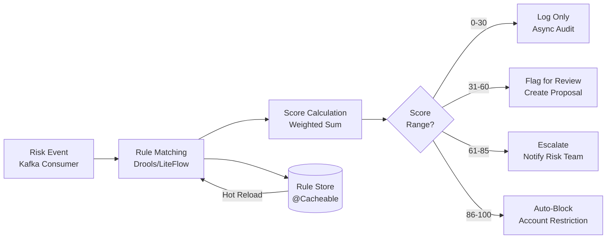

# Risk Implementation

> **Canonical Source**: [00-14_Risk_Implementation.md](../../source-archive/00_Foundation/guides/00-14_Risk_Implementation.md)
> **Audience**: Architects, Backend Engineers, Data Engineers
> **Business Requirements**: [Risk_Requirements_Summary.md](../../requirements/05_Risk_Compliance/Risk_Requirements_Summary.md)
> **Last Synced**: 2026-02-08

---

## 1. Overview

This document covers the technical implementation of the iGaming platform risk control system, including the risk rule engine, fraud detection algorithms, and agent credit management. All implementations follow SmartAdmin layered architecture patterns.

---

## 2. Risk Rule Engine

**Status**: PLANNED (Phase 5+)
**Modules**: 05_Risk_Control, 01_Core_Financial_Loop

### Implementation Goal

Design and implement a rule engine architecture integrating Drools/LiteFlow, with dynamic rule configuration and hot-reloading capabilities.

### Implementation Reading Order

| Order | Document | Section | Focus |
|-------|----------|---------|-------|
| 1 | [05-01 Risk Framework](../../source-archive/05_Risk_Control/05-01_Risk_Framework.md) | S2 Rule Engine | Drools integration |
| 2 | [05-05 Risk Proposal Workflow](../../source-archive/05_Risk_Control/05-05_Risk_Proposal_Workflow.md) | S3 Approval Flow | Workflow design |
| 3 | [01-05 Withdrawal Risk](../../source-archive/01_Player_Center/01-05_Withdrawal_Risk.md) | S4 Risk Rules | Real-world cases |

### SmartAdmin Layer Mapping

| Layer | Responsibility |
|-------|---------------|
| Controller | Risk evaluation API, rule management admin endpoints (`@SaCheckPermission`) |
| Service | Rule matching logic, risk score aggregation (Vavr Option for optional rule config lookups) |
| Manager | @Transactional rule persistence + version management, @Cacheable rule cache with hot-reload |
| Dao | Rule definitions, risk event logs, scoring history via MyBatis Plus |

### Rule Engine Architecture



### Risk Score Calculation

```java
// Service layer: risk score aggregation
public RiskScore evaluate(RiskEvent event) {
    List<RuleResult> results = ruleEngine.matchAll(event);
    return results.stream()
        .map(r -> r.getScore() * r.getWeight())
        .reduce(0.0, Double::sum);
}
```

### Action Dispatch by Score

| Score Range | Action | Implementation |
|------------|--------|----------------|
| 0-30 | Log | Async audit log write (Manager) |
| 31-60 | Flag for review | Create risk proposal (Manager @Transactional) |
| 61-85 | Escalate | Notify risk team + create urgent proposal |
| 86-100 | Auto-block | Immediate account restriction (Manager @Transactional) |

### Verification Checklist

- [ ] Rule engine executes correctly
- [ ] Dynamic rule loading succeeds
- [ ] Rule priorities are correct
- [ ] Risk scoring calculations are accurate

### Common Pitfalls

1. **Rule Conflicts**: Multiple rules match simultaneously -- implement priority-based resolution with early-exit
2. **Performance**: Too many rules slow execution -- use indexed rule matching and Drools RETE optimization
3. **Hot Update Failure**: Rule updates not reflected -- version rules in Manager with @Cacheable eviction on update

### Database Schema

```sql
-- Risk rule definitions with versioning
CREATE TABLE risk_rules (
    id              BIGSERIAL PRIMARY KEY,
    rule_code       VARCHAR(64) NOT NULL UNIQUE,
    rule_name       VARCHAR(128) NOT NULL,
    rule_type       VARCHAR(32) NOT NULL,   -- VELOCITY, AMOUNT, PATTERN, DEVICE, GEO
    category        VARCHAR(32) NOT NULL,   -- DEPOSIT, WITHDRAWAL, LOGIN, BET, REGISTRATION
    priority        INT NOT NULL DEFAULT 100,
    weight          NUMERIC(5,2) NOT NULL DEFAULT 1.00,
    condition_expr  TEXT NOT NULL,           -- Drools/LiteFlow expression
    action_type     VARCHAR(16) NOT NULL,   -- LOG, FLAG, ESCALATE, BLOCK
    score_value     INT NOT NULL DEFAULT 0, -- 0-100
    status          VARCHAR(16) NOT NULL DEFAULT 'ACTIVE',
    version         INT NOT NULL DEFAULT 1,
    tenant_id       BIGINT NOT NULL,
    created_at      TIMESTAMP NOT NULL DEFAULT NOW(),
    updated_at      TIMESTAMP NOT NULL DEFAULT NOW(),
    deleted         BOOLEAN NOT NULL DEFAULT FALSE
);

CREATE INDEX idx_risk_rules_category ON risk_rules(category, status);
CREATE INDEX idx_risk_rules_tenant ON risk_rules(tenant_id, status);

-- Risk assessment event log
CREATE TABLE risk_assessments (
    id              BIGSERIAL PRIMARY KEY,
    event_id        VARCHAR(64) NOT NULL UNIQUE,  -- idempotency
    player_id       BIGINT NOT NULL,
    event_type      VARCHAR(32) NOT NULL,   -- DEPOSIT, WITHDRAWAL, LOGIN, BET
    risk_score      INT NOT NULL,           -- 0-100 aggregated score
    action_taken    VARCHAR(16) NOT NULL,   -- LOG, FLAG, ESCALATE, BLOCK
    matched_rules   JSONB,                  -- array of rule_codes that matched
    event_data      JSONB,                  -- original event payload
    reviewed_by     BIGINT,                 -- admin user who reviewed (nullable)
    review_result   VARCHAR(16),            -- APPROVED, REJECTED, ESCALATED
    reviewed_at     TIMESTAMP,
    tenant_id       BIGINT NOT NULL,
    created_at      TIMESTAMP NOT NULL DEFAULT NOW()
);

CREATE INDEX idx_risk_assessments_player ON risk_assessments(player_id, created_at DESC);
CREATE INDEX idx_risk_assessments_score ON risk_assessments(risk_score) WHERE risk_score >= 60;
CREATE INDEX idx_risk_assessments_review ON risk_assessments(action_taken, review_result) WHERE review_result IS NULL;
```

---

## 3. Fraud Detection Algorithm

**Status**: PLANNED (Phase 5+)
**Modules**: 05_Risk_Control, 01_Player_Center

### Implementation Goal

Implement device fingerprinting, behavioral analysis, and machine learning model integration for fraud detection.

### Implementation Reading Order

| Order | Document | Section | Focus |
|-------|----------|---------|-------|
| 1 | [05-02 Fraud Detection](../../source-archive/05_Risk_Control/05-02_Fraud_Detection.md) | S2 Device Fingerprint | FingerprintJS |
| 2 | [05-02 Fraud Detection](../../source-archive/05_Risk_Control/05-02_Fraud_Detection.md) | S3 Behavioral Analysis | Anomaly detection |
| 3 | [01-01 Player Lifecycle](../../source-archive/01_Player_Center/01-01_Player_Lifecycle.md) | S5 Risk Scoring | Player classification |

### SmartAdmin Layer Mapping

| Layer | Responsibility |
|-------|---------------|
| Controller | Fingerprint collection API, fraud report query endpoint |
| Service | Fingerprint matching, behavioral pattern analysis (Vavr Option for device lookups) |
| Manager | @Transactional fraud case creation, @Cacheable fingerprint index, ML model inference orchestration |
| Dao | Device fingerprint store, fraud case records, behavioral event logs |

### Device Fingerprint Architecture

```
Browser/App → FingerprintJS SDK → Fingerprint API → Fingerprint Store
                                        ↓
                                  Match Service → Known Device? → Risk Score Adjustment
                                        ↓
                                  New Device → Create Record + Flag for Review
```

### ML Model Integration

```java
// Manager layer: ML model inference with @Cacheable model config
@Cacheable("fraud-model-config")
public ModelConfig getActiveModelConfig() {
    return modelConfigDao.selectActiveModel();
}

// Service layer: fraud evaluation
public FraudScore evaluate(PlayerBehavior behavior) {
    ModelConfig config = fraudManager.getActiveModelConfig();
    return Option.of(mlClient.predict(behavior, config))
        .map(this::mapToFraudScore)
        .getOrElse(FraudScore.unknown());
}
```

### Verification Checklist

- [ ] Device fingerprints are correctly generated
- [ ] Anomaly behavior detection is effective
- [ ] ML model accuracy meets target threshold
- [ ] False positive rate is within acceptable range

### Common Pitfalls

1. **High False Positives**: Legitimate players misclassified -- tune thresholds, implement human review queue
2. **Model Drift**: Historical model degrades -- schedule periodic retraining via Snail-Job
3. **Insufficient Features**: Missing risk signals -- continuously expand feature engineering pipeline

---

## 4. Agent Credit Management

**Status**: PLANNED (Phase 5+)
**Modules**: 07_Agent_Center, 05_Risk_Control

### Implementation Goal

Implement credit line calculation, risk alerts, commission settlement (share mode), and credit freeze mechanisms.

### Implementation Reading Order

| Order | Document | Section | Focus |
|-------|----------|---------|-------|
| 1 | [07-02 Credit Network Logic](../../source-archive/07_Agent_Center/07-02_Credit_Network_Logic.md) | S2 Credit Network | Share mode |
| 2 | [05-04 Agent Credit Risk](../../source-archive/05_Risk_Control/05-04_Agent_Credit_Risk.md) | S3 Risk Control | Credit calculation |
| 3 | [07-03 Agent System](../../source-archive/07_Agent_Center/07-03_Agent_System.md) | S4 Risk Integration | Agent risk controls |

### SmartAdmin Layer Mapping

| Layer | Responsibility |
|-------|---------------|
| Controller | Credit query API, settlement API, admin credit management (`@SaCheckPermission`) |
| Service | Credit calculation, hierarchy traversal (Vavr Option for optional parent-agent lookups) |
| Manager | @Transactional credit allocation + freeze operations, @Transactional settlement processing, @Cacheable agent hierarchy |
| Dao | Credit records, settlement history, agent hierarchy via MyBatis Plus |

### Credit Calculation Logic

```java
// Service layer: credit line calculation
public CreditAllocation calculateCredit(Long agentId) {
    Agent agent = agentDao.selectById(agentId);
    return Option.of(agent)
        .map(a -> {
            BigDecimal parentCredit = getParentAvailableCredit(a.getParentId());
            BigDecimal riskFactor = calculateRiskFactor(a);
            return new CreditAllocation(
                parentCredit.multiply(riskFactor),
                a.getLevel()
            );
        })
        .getOrElse(CreditAllocation.empty());
}
```

### Credit Monitoring Thresholds

| Utilization | Action | Implementation |
|------------|--------|----------------|
| 0-70% | Normal | No action |
| 71-85% | Warning | Async notification via Manager |
| 86-95% | Restrict | Block new registrations (Manager @Transactional) |
| 96-100% | Freeze | Freeze credit + escalate (Manager @Transactional) |

### Settlement Processing

```java
// Manager layer: atomic settlement operation
@Transactional(rollbackFor = Throwable.class)
public void processSettlement(Long agentId, SettlementPeriod period) {
    BigDecimal commission = calculateCommission(agentId, period);
    creditDao.deductSettledAmount(agentId, commission);
    settlementDao.createRecord(agentId, commission, period);
    // Cascade settlement to sub-agents
    List<Long> subAgentIds = agentDao.selectSubAgentIds(agentId);
    subAgentIds.forEach(subId -> processSettlement(subId, period));
}
```

### Verification Checklist

- [ ] Credit line calculation is correct
- [ ] Risk alerts trigger promptly
- [ ] Commission settlement is accurate
- [ ] Credit freeze mechanism is effective

### Common Pitfalls

1. **Credit Overflow**: Sub-agent bets exceed allocated credit -- real-time credit check in Service before bet acceptance
2. **Settlement Delay**: Commission settlement lag -- automate with Snail-Job scheduled task
3. **Hierarchy Calculation Error**: Multi-level credit distribution -- validate with automated integration tests

---

## 5. Reference Documents

| Area | Document |
|------|----------|
| Risk Framework | [05-01 Risk Framework](../../source-archive/05_Risk_Control/05-01_Risk_Framework.md) |
| Fraud Detection | [05-02 Fraud Detection](../../source-archive/05_Risk_Control/05-02_Fraud_Detection.md) |
| Risk Proposal Workflow | [05-05 Risk Proposal Workflow](../../source-archive/05_Risk_Control/05-05_Risk_Proposal_Workflow.md) |
| Agent Credit Risk | [05-04 Agent Credit Risk](../../source-archive/05_Risk_Control/05-04_Agent_Credit_Risk.md) |
| Credit Network Logic | [07-02 Credit Network Logic](../../source-archive/07_Agent_Center/07-02_Credit_Network_Logic.md) |
| Agent System | [07-03 Agent System](../../source-archive/07_Agent_Center/07-03_Agent_System.md) |

---

**Document Version**: 1.0.0
**Last Updated**: 2026-02-08
**Source Version**: 4.0.0
