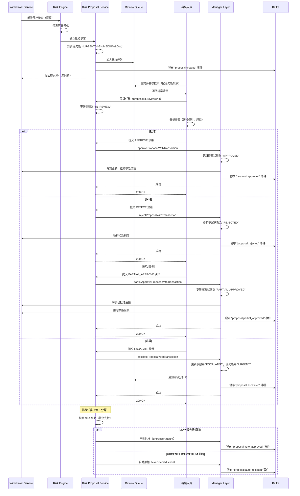

# 風控提案工作流實作（Risk Proposal Workflow Implementation）

> **規範來源**: [source-archive/05_Risk_Control/05-05_Risk_Proposal_Workflow.md](../../source-archive/05_Risk_Control/05-05_Risk_Proposal_Workflow.md)
> **目標讀者**: Architects, Backend Developers, DevOps Engineers
> **業務需求**: [Risk_Proposal_Requirements.md](../../requirements/05_Risk_Compliance/Risk_Proposal_Requirements.md)
> **最後同步**: 2026-02-08

---

## 1. 文件資訊（Document Information）

**版本（Version）**: 4.0.0 (v2.1.0 Simplified)
**依賴項（Dependencies）**:
- [05-03 KYC/AML Configuration-Driven Risk](../05_Risk_Engine/) - 風控提案（Risk Proposal）Service 實作
- [05-01 Risk Framework](../05_Risk_Engine/) - Configuration-driven 規則引擎
- [01-05 Withdrawal Risk](../../source-archive/01_Player_Center/01-05_Withdrawal_Risk.md) - SAGA Step 2.5 延遲檢查

---

## 1.1 非同步風控提案生命週期（Async Risk Proposal Lifecycle）

風控提案工作流遵循非同步模式，允許審核人員獨立於觸發事件（例如提款請求）處理提案。



**關鍵特性**：
- **非同步（Asynchronous）**: 提款 Service 不會阻塞等待提案建立
- **優先級驅動（Priority-driven）**: 佇列按優先級 + 建立時間排序
- **SLA 強制執行（SLA-enforced）**: 超時時自動批准（LOW）或自動拒絕（URGENT/HIGH/MEDIUM）
- **事件驅動（Event-driven）**: 所有狀態變更都發布 Kafka 事件用於審計/分析

---

## 2. 審核佇列管理（Review Queue Management）

### 2.1 優先級計算 Service（Priority Calculation Service）

```java
/**
 * Service Layer - Proposal priority calculation (v2.1.0 simplified)
 */
public class RiskProposalPriorityService {

    /**
     * Calculate proposal priority
     * Rules (v2.1.0 simplified):
     * - URGENT: amount > $10,000
     * - HIGH:   amount > $5,000
     * - MEDIUM: amount > $1,000
     * - LOW:    amount <= $1,000
     *
     * @param suspiciousAmount Suspicious amount
     * @return String Priority level
     */
    public String calculatePriority(BigDecimal suspiciousAmount) {
        if (suspiciousAmount.compareTo(new BigDecimal("10000")) > 0) {
            return "URGENT";
        } else if (suspiciousAmount.compareTo(new BigDecimal("5000")) > 0) {
            return "HIGH";
        } else if (suspiciousAmount.compareTo(new BigDecimal("1000")) > 0) {
            return "MEDIUM";
        } else {
            return "LOW";
        }
    }

    /**
     * Dynamic priority upgrade based on wait time
     * v2.1.0: Upgrades priority only when SLA is exceeded
     */
    @Scheduled(fixedDelay = 3600000)  // Execute every hour
    public void updatePriorityBasedOnWaitTime() {
        LocalDateTime slaThreshold = LocalDateTime.now().minusHours(48);

        // Query overdue pending proposals
        List<RiskProposalEntity> overdueProposals = riskProposalDao.selectList(
            new LambdaQueryWrapper<RiskProposalEntity>()
                .eq(RiskProposalEntity::getStatus, "PENDING_REVIEW")
                .lt(RiskProposalEntity::getCreatedAt, slaThreshold)
                .eq(RiskProposalEntity::getDeleted, false)
        );

        // Upgrade priority
        overdueProposals.forEach(proposal -> {
            String newPriority = upgradePriority(proposal.getPriority());
            proposal.setPriority(newPriority);
            riskProposalDao.updateById(proposal);

            log.warn("[Priority Upgrade] Proposal {} priority upgraded to {} (overdue)",
                proposal.getId(), newPriority);
        });
    }

    private String upgradePriority(String currentPriority) {
        return switch (currentPriority) {
            case "LOW" -> "MEDIUM";
            case "MEDIUM" -> "HIGH";
            case "HIGH" -> "URGENT";
            default -> "URGENT";
        };
    }
}
```

### 2.2 SLA 監控和超時處理（SLA Monitoring and Timeout Processing，v3.0.0）

```java
/**
 * Service Layer - SLA monitoring and timeout processing (v3.0.0 priority-based)
 */
@Service
@RequiredArgsConstructor
public class RiskProposalSLAService {

    private final RiskProposalDao riskProposalDao;
    private final NotificationService notificationService;
    private final WithdrawalService withdrawalService;

    /**
     * Per-priority SLA configuration (unit: hours)
     */
    private static final Map<String, Integer> PRIORITY_SLA_HOURS = Map.of(
        "URGENT", 1,
        "HIGH", 2,
        "MEDIUM", 24,
        "LOW", 48
    );

    /**
     * Process expired proposals (scheduled task, every 5 minutes)
     * URGENT/HIGH/MEDIUM timeout -> auto-reject withdrawal
     * LOW timeout -> auto-approve
     */
    @Scheduled(fixedDelay = 300_000)
    public void processExpiredProposals() {
        for (Map.Entry<String, Integer> entry : PRIORITY_SLA_HOURS.entrySet()) {
            String priority = entry.getKey();
            int slaHours = entry.getValue();
            LocalDateTime slaThreshold = LocalDateTime.now().minusHours(slaHours);

            List<RiskProposalEntity> expired = riskProposalDao.selectList(
                new LambdaQueryWrapper<RiskProposalEntity>()
                    .eq(RiskProposalEntity::getStatus, "PENDING_REVIEW")
                    .eq(RiskProposalEntity::getPriority, priority)
                    .lt(RiskProposalEntity::getCreatedAt, slaThreshold)
                    .eq(RiskProposalEntity::getDeleted, false)
            );

            for (RiskProposalEntity p : expired) {
                if ("LOW".equals(p.getPriority())) {
                    // LOW: auto-approve on timeout
                    withdrawalService.approveWithdrawal(p.getWithdrawalRequestId());
                    p.setStatus("APPROVED");
                    log.info("[SLA Auto-Approve] Proposal {} (LOW) auto-approved after {} hours",
                        p.getId(), slaHours);
                } else {
                    // URGENT/HIGH/MEDIUM: auto-reject on timeout
                    withdrawalService.rejectWithdrawal(p.getWithdrawalRequestId());
                    p.setStatus("REJECTED");
                    log.warn("[SLA Auto-Reject] Proposal {} ({}) auto-rejected after {} hours",
                        p.getId(), p.getPriority(), slaHours);
                }
                riskProposalDao.updateById(p);
            }
        }
    }

    /**
     * Calculate remaining time for a proposal (based on priority SLA)
     */
    public Duration calculateRemainingTime(Long proposalId) {
        RiskProposalEntity proposal = riskProposalDao.selectById(proposalId);
        if (proposal == null) {
            return Duration.ZERO;
        }

        int slaHours = PRIORITY_SLA_HOURS.getOrDefault(proposal.getPriority(), 48);
        LocalDateTime slaDeadline = proposal.getCreatedAt().plusHours(slaHours);
        return Duration.between(LocalDateTime.now(), slaDeadline);
    }

    /**
     * Find proposals approaching SLA deadline (remaining time < warning threshold)
     */
    public List<RiskProposalVO> findApproachingSLA() {
        LocalDateTime now = LocalDateTime.now();
        List<RiskProposalEntity> results = new ArrayList<>();

        for (Map.Entry<String, Integer> entry : PRIORITY_SLA_HOURS.entrySet()) {
            String priority = entry.getKey();
            int slaHours = entry.getValue();
            int warningHours = Math.max(1, slaHours / 4);  // Warning threshold = SLA / 4

            LocalDateTime warningThreshold = now.minusHours(slaHours - warningHours);

            results.addAll(riskProposalDao.selectList(
                new LambdaQueryWrapper<RiskProposalEntity>()
                    .eq(RiskProposalEntity::getStatus, "PENDING_REVIEW")
                    .eq(RiskProposalEntity::getPriority, priority)
                    .lt(RiskProposalEntity::getCreatedAt, warningThreshold)
                    .ge(RiskProposalEntity::getCreatedAt, now.minusHours(slaHours))
                    .eq(RiskProposalEntity::getDeleted, false)
            ));
        }

        return results.stream()
            .sorted(Comparator.comparing(RiskProposalEntity::getCreatedAt))
            .map(entity -> SmartBeanUtil.copy(entity, RiskProposalVO.class))
            .collect(Collectors.toList());
    }
}
```

### 2.3 審核佇列 Controller（Review Queue Controller）

```java
/**
 * Controller Layer - Review queue queries
 */
@Tag(name = "Risk Proposal Review Queue")
@RestController
@RequestMapping("/risk/proposal/queue")
@RequiredArgsConstructor
public class RiskProposalQueueController {

    private final RiskProposalService riskProposalService;
    private final RiskProposalSLAService slaService;

    /**
     * Query review queue (sorted by priority)
     *
     * @param queryForm Query form
     * @return ResponseDTO<PageResult<RiskProposalVO>> Paginated result
     */
    @Operation(summary = "Query review queue")
    @PostMapping("/query")
    @SaCheckPermission("risk:proposal:review")
    public ResponseDTO<PageResult<RiskProposalVO>> queryReviewQueue(
        @Valid @RequestBody RiskProposalQueryForm queryForm
    ) {
        // Default sort: priority DESC, created_at ASC
        queryForm.setOrderBy("priority DESC, created_at ASC");

        return riskProposalService.queryProposals(queryForm)
            .map(ResponseDTO::ok)
            .getOrElse(ResponseDTO.error("Query failed"));
    }

    /**
     * Query proposals approaching SLA deadline
     *
     * @return ResponseDTO<List<RiskProposalVO>> Proposal list
     */
    @Operation(summary = "Query proposals approaching SLA")
    @GetMapping("/approaching-sla")
    @SaCheckPermission("risk:proposal:review")
    public ResponseDTO<List<RiskProposalVO>> queryApproachingSLA() {
        List<RiskProposalVO> proposals = slaService.findApproachingSLA();
        return ResponseDTO.ok(proposals);
    }

    /**
     * Claim review task (reviewer actively claims)
     *
     * @param proposalId Proposal ID
     * @return ResponseDTO<Void> Operation result
     */
    @Operation(summary = "Claim review task")
    @PostMapping("/{proposalId}/claim")
    @SaCheckPermission("risk:proposal:review")
    public ResponseDTO<Void> claimReviewTask(@PathVariable Long proposalId) {
        Long reviewerId = StpUtil.getLoginIdAsLong();

        boolean success = riskProposalService.claimReviewTask(proposalId, reviewerId)
            .getOrElse(false);

        return success ? ResponseDTO.ok() : ResponseDTO.error("Claim failed");
    }
}
```

---

## 3. 審核決策實作（Review Decision Implementation）

### 3.1 批准流程（Approve Flow）

**Service Layer**:

```java
/**
 * Service Layer - Approve proposal
 */
public class RiskProposalService {

    /**
     * Approve risk proposal (full release)
     *
     * @param proposalId Proposal ID
     * @param reviewerId Reviewer ID
     * @param reviewNotes Review notes
     * @return Option<Boolean> Success flag
     */
    public Option<Boolean> approveProposal(
        Long proposalId,
        Long reviewerId,
        String reviewNotes
    ) {
        return Option.of(riskProposalDao.selectById(proposalId))
            .flatMap(proposal -> {
                // Validate proposal status
                if (!"PENDING_REVIEW".equals(proposal.getStatus())) {
                    log.error("[Approve Failed] Proposal {} not in PENDING_REVIEW status", proposalId);
                    return Option.none();
                }

                // Delegate to Manager layer for transaction
                boolean success = riskProposalManager.approveProposalWithTransaction(
                    proposalId,
                    reviewerId,
                    reviewNotes
                );

                return Option.of(success);
            });
    }
}
```

**Manager Layer（事務性）**:

```java
/**
 * Manager Layer - Approve proposal transaction
 */
@Service
@RequiredArgsConstructor
public class RiskProposalManager {

    private final RiskProposalDao riskProposalDao;
    private final WithdrawalService withdrawalService;
    private final KafkaTemplate<String, Object> kafkaTemplate;

    /**
     * Approve proposal (with transaction)
     */
    @Transactional(rollbackFor = Throwable.class)
    public boolean approveProposalWithTransaction(
        Long proposalId,
        Long reviewerId,
        String reviewNotes
    ) {
        // 1. Update proposal status
        RiskProposalEntity proposal = riskProposalDao.selectById(proposalId);
        proposal.setStatus("APPROVED");
        proposal.setReviewerId(reviewerId);
        proposal.setReviewedAt(LocalDateTime.now());
        proposal.setReviewNotes(reviewNotes);
        proposal.setApprovedAmount(proposal.getSuspiciousAmount());  // Full approval

        riskProposalDao.updateById(proposal);

        // 2. Unfreeze amount, continue withdrawal flow
        if (proposal.getWithdrawalRequestId() != null) {
            withdrawalService.unfreezeAmount(
                proposal.getWithdrawalRequestId(),
                proposal.getSuspiciousAmount()
            );
        }

        // 3. Publish Kafka event
        kafkaTemplate.send("risk.proposal.approved", RiskProposalEvent.builder()
            .proposalId(proposal.getId())
            .playerId(proposal.getPlayerId())
            .reviewerId(reviewerId)
            .approvedAmount(proposal.getSuspiciousAmount())
            .build()
        );

        log.info("[Proposal Approved] proposalId={}, reviewerId={}, amount={}",
            proposalId, reviewerId, proposal.getSuspiciousAmount());

        return true;
    }
}
```

### 3.2 拒絕流程（Reject Flow）

**Service Layer**:

```java
/**
 * Service Layer - Reject proposal
 */
public class RiskProposalService {

    /**
     * Reject risk proposal
     *
     * @param proposalId Proposal ID
     * @param reviewerId Reviewer ID
     * @param reviewNotes Review notes (REQUIRED)
     * @return Option<Boolean> Success flag
     */
    public Option<Boolean> rejectProposal(
        Long proposalId,
        Long reviewerId,
        String reviewNotes
    ) {
        // Validate review notes (rejection must provide reason)
        if (StringUtils.isBlank(reviewNotes)) {
            log.error("[Reject Failed] Review notes required for rejection");
            return Option.none();
        }

        return Option.of(riskProposalDao.selectById(proposalId))
            .flatMap(proposal -> {
                if (!"PENDING_REVIEW".equals(proposal.getStatus())) {
                    return Option.none();
                }

                boolean success = riskProposalManager.rejectProposalWithTransaction(
                    proposalId,
                    reviewerId,
                    reviewNotes
                );

                return Option.of(success);
            });
    }
}
```

**Manager Layer（事務性）**:

```java
/**
 * Manager Layer - Reject proposal transaction
 */
@Service
@RequiredArgsConstructor
public class RiskProposalManager {

    /**
     * Reject proposal (with transaction)
     */
    @Transactional(rollbackFor = Throwable.class)
    public boolean rejectProposalWithTransaction(
        Long proposalId,
        Long reviewerId,
        String reviewNotes
    ) {
        // 1. Update proposal status
        RiskProposalEntity proposal = riskProposalDao.selectById(proposalId);
        proposal.setStatus("REJECTED");
        proposal.setReviewerId(reviewerId);
        proposal.setReviewedAt(LocalDateTime.now());
        proposal.setReviewNotes(reviewNotes);
        proposal.setApprovedAmount(BigDecimal.ZERO);  // Rejected, approved = 0

        riskProposalDao.updateById(proposal);

        // 2. Suspicious amount stays frozen, trigger deduction compensation
        if (proposal.getWithdrawalRequestId() != null) {
            compensationService.executeDeduction(
                proposal.getPlayerId(),
                proposal.getSuspiciousAmount(),
                String.format("Risk proposal rejected: %s (Proposal: %s)",
                    reviewNotes, proposal.getProposalNo())
            );
        }

        // 3. Publish Kafka event
        kafkaTemplate.send("risk.proposal.rejected", RiskProposalEvent.builder()
            .proposalId(proposal.getId())
            .playerId(proposal.getPlayerId())
            .reviewerId(reviewerId)
            .rejectionReason(reviewNotes)
            .build()
        );

        log.info("[Proposal Rejected] proposalId={}, reviewerId={}, reason={}",
            proposalId, reviewerId, reviewNotes);

        return true;
    }
}
```

### 3.3 部分批准流程（Partial Approve Flow）

**Service Layer**:

```java
/**
 * Service Layer - Partial approve proposal
 */
public class RiskProposalService {

    /**
     * Partially approve risk proposal
     *
     * @param proposalId Proposal ID
     * @param reviewerId Reviewer ID
     * @param approvedAmount Approved amount
     * @param reviewNotes Review notes (REQUIRED)
     * @return Option<Boolean> Success flag
     */
    public Option<Boolean> partialApproveProposal(
        Long proposalId,
        Long reviewerId,
        BigDecimal approvedAmount,
        String reviewNotes
    ) {
        return Option.of(riskProposalDao.selectById(proposalId))
            .flatMap(proposal -> {
                // Validate approved amount
                if (approvedAmount.compareTo(BigDecimal.ZERO) <= 0 ||
                    approvedAmount.compareTo(proposal.getSuspiciousAmount()) >= 0) {
                    log.error("[Partial Approve Failed] Invalid approved amount: {}", approvedAmount);
                    return Option.none();
                }

                boolean success = riskProposalManager.partialApproveProposalWithTransaction(
                    proposalId,
                    reviewerId,
                    approvedAmount,
                    reviewNotes
                );

                return Option.of(success);
            });
    }
}
```

**Manager Layer（事務性）**:

```java
/**
 * Manager Layer - Partial approve proposal transaction
 */
@Service
@RequiredArgsConstructor
public class RiskProposalManager {

    /**
     * Partial approve proposal (with transaction)
     */
    @Transactional(rollbackFor = Throwable.class)
    public boolean partialApproveProposalWithTransaction(
        Long proposalId,
        Long reviewerId,
        BigDecimal approvedAmount,
        String reviewNotes
    ) {
        // 1. Update proposal status
        RiskProposalEntity proposal = riskProposalDao.selectById(proposalId);
        BigDecimal rejectedAmount = proposal.getSuspiciousAmount().subtract(approvedAmount);

        proposal.setStatus("PARTIAL_APPROVED");
        proposal.setReviewerId(reviewerId);
        proposal.setReviewedAt(LocalDateTime.now());
        proposal.setReviewNotes(reviewNotes);
        proposal.setApprovedAmount(approvedAmount);

        riskProposalDao.updateById(proposal);

        // 2. Unfreeze approved amount, deduct rejected amount
        if (proposal.getWithdrawalRequestId() != null) {
            withdrawalService.unfreezeAmount(proposal.getWithdrawalRequestId(), approvedAmount);

            // Deduct rejected portion
            compensationService.executeDeduction(
                proposal.getPlayerId(),
                rejectedAmount,
                String.format("Partial approve: approved $%s, rejected $%s (Proposal: %s)",
                    approvedAmount, rejectedAmount, proposal.getProposalNo())
            );
        }

        // 3. Publish Kafka event
        kafkaTemplate.send("risk.proposal.partial_approved", RiskProposalEvent.builder()
            .proposalId(proposal.getId())
            .playerId(proposal.getPlayerId())
            .reviewerId(reviewerId)
            .approvedAmount(approvedAmount)
            .rejectedAmount(rejectedAmount)
            .build()
        );

        log.info("[Proposal Partial Approved] proposalId={}, approved={}, rejected={}",
            proposalId, approvedAmount, rejectedAmount);

        return true;
    }
}
```

### 3.4 升級流程（Escalate Flow）

**Service Layer**:

```java
/**
 * Service Layer - Escalate proposal to senior review
 */
public class RiskProposalService {

    /**
     * Escalate proposal to senior analyst (v2.1.0 manual escalation)
     *
     * @param proposalId Proposal ID
     * @param reviewerId Current reviewer ID
     * @param escalationReason Escalation reason (REQUIRED)
     * @return Option<Boolean> Success flag
     */
    public Option<Boolean> escalateProposal(
        Long proposalId,
        Long reviewerId,
        String escalationReason
    ) {
        if (StringUtils.isBlank(escalationReason)) {
            log.error("[Escalate Failed] Escalation reason required");
            return Option.none();
        }

        return Option.of(riskProposalDao.selectById(proposalId))
            .flatMap(proposal -> {
                if (!"PENDING_REVIEW".equals(proposal.getStatus())) {
                    return Option.none();
                }

                boolean success = riskProposalManager.escalateProposalWithTransaction(
                    proposalId,
                    reviewerId,
                    escalationReason
                );

                return Option.of(success);
            });
    }
}
```

**Manager Layer（事務性）**:

```java
/**
 * Manager Layer - Escalate proposal transaction
 */
@Service
@RequiredArgsConstructor
public class RiskProposalManager {

    /**
     * Escalate proposal to senior review (with transaction)
     */
    @Transactional(rollbackFor = Throwable.class)
    public boolean escalateProposalWithTransaction(
        Long proposalId,
        Long reviewerId,
        String escalationReason
    ) {
        // 1. Update proposal status
        RiskProposalEntity proposal = riskProposalDao.selectById(proposalId);
        proposal.setStatus("ESCALATED");
        proposal.setPriority("URGENT");  // Escalated -> URGENT priority
        proposal.setReviewNotes(String.format("[Escalated by Reviewer %d] %s",
            reviewerId, escalationReason));

        riskProposalDao.updateById(proposal);

        // 2. Notify senior analysts
        notificationService.sendEscalationNotification(
            proposal,
            reviewerId,
            escalationReason
        );

        // 3. Publish Kafka event
        kafkaTemplate.send("risk.proposal.escalated", RiskProposalEvent.builder()
            .proposalId(proposal.getId())
            .playerId(proposal.getPlayerId())
            .escalatedBy(reviewerId)
            .escalationReason(escalationReason)
            .build()
        );

        log.info("[Proposal Escalated] proposalId={}, escalatedBy={}, reason={}",
            proposalId, reviewerId, escalationReason);

        return true;
    }
}
```

---

## 4. 補償機制（Compensation Mechanism）

### 4.1 補償 Service（Compensation Service）

```java
/**
 * Service Layer - Compensation service
 */
@Service
@RequiredArgsConstructor
public class CompensationService {

    private final CompensationManager compensationManager;
    private final WalletService walletService;

    /**
     * Execute refund compensation
     *
     * @param playerId Player ID
     * @param amount Refund amount
     * @param reason Refund reason
     * @return Option<String> Compensation record ID
     */
    public Option<String> executeRefund(Long playerId, BigDecimal amount, String reason) {
        return walletService.getPlayerWallet(playerId)
            .flatMap(wallet -> {
                String compensationId = compensationManager.executeRefundWithTransaction(
                    playerId,
                    amount,
                    reason
                );

                return Option.of(compensationId);
            });
    }

    /**
     * Execute deduction compensation
     *
     * @param playerId Player ID
     * @param amount Deduction amount
     * @param reason Deduction reason
     * @return Option<String> Compensation record ID
     */
    public Option<String> executeDeduction(Long playerId, BigDecimal amount, String reason) {
        return walletService.getPlayerWallet(playerId)
            .flatMap(wallet -> {
                if (wallet.getBalance().compareTo(amount) < 0) {
                    log.error("[Deduction Failed] Insufficient balance for player {}", playerId);
                    return Option.none();
                }

                String compensationId = compensationManager.executeDeductionWithTransaction(
                    playerId,
                    amount,
                    reason
                );

                return Option.of(compensationId);
            });
    }
}
```

### 4.2 補償 Manager（事務性，Compensation Manager, Transactional）

```java
/**
 * Manager Layer - Compensation transaction processing
 */
@Service
@RequiredArgsConstructor
public class CompensationManager {

    private final CompensationDao compensationDao;
    private final WalletDao walletDao;
    private final KafkaTemplate<String, Object> kafkaTemplate;

    /**
     * Execute refund compensation (with transaction)
     */
    @Transactional(rollbackFor = Throwable.class)
    public String executeRefundWithTransaction(Long playerId, BigDecimal amount, String reason) {
        // 1. Create compensation record
        CompensationEntity compensation = CompensationEntity.builder()
            .compensationNo(generateCompensationNo())
            .playerId(playerId)
            .compensationType("REFUND")
            .amount(amount)
            .reason(reason)
            .status("PENDING")
            .build();

        compensationDao.insert(compensation);

        // 2. Update player wallet (add balance)
        WalletEntity wallet = walletDao.selectByPlayerId(playerId);
        wallet.setBalance(wallet.getBalance().add(amount));
        walletDao.updateById(wallet);

        // 3. Update compensation status
        compensation.setStatus("COMPLETED");
        compensation.setExecutedAt(LocalDateTime.now());
        compensationDao.updateById(compensation);

        // 4. Publish Kafka event
        kafkaTemplate.send("wallet.compensation.refund", CompensationEvent.builder()
            .compensationId(compensation.getId())
            .playerId(playerId)
            .amount(amount)
            .type("REFUND")
            .build()
        );

        log.info("[Refund Executed] playerId={}, amount={}, reason={}",
            playerId, amount, reason);

        return compensation.getId().toString();
    }

    /**
     * Execute deduction compensation (with transaction)
     */
    @Transactional(rollbackFor = Throwable.class)
    public String executeDeductionWithTransaction(Long playerId, BigDecimal amount, String reason) {
        // 1. Create compensation record
        CompensationEntity compensation = CompensationEntity.builder()
            .compensationNo(generateCompensationNo())
            .playerId(playerId)
            .compensationType("DEDUCTION")
            .amount(amount)
            .reason(reason)
            .status("PENDING")
            .build();

        compensationDao.insert(compensation);

        // 2. Update player wallet (subtract balance)
        WalletEntity wallet = walletDao.selectByPlayerId(playerId);
        if (wallet.getBalance().compareTo(amount) < 0) {
            throw new IllegalStateException("Insufficient balance for deduction");
        }

        wallet.setBalance(wallet.getBalance().subtract(amount));
        walletDao.updateById(wallet);

        // 3. Update compensation status
        compensation.setStatus("COMPLETED");
        compensation.setExecutedAt(LocalDateTime.now());
        compensationDao.updateById(compensation);

        // 4. Publish Kafka event
        kafkaTemplate.send("wallet.compensation.deduction", CompensationEvent.builder()
            .compensationId(compensation.getId())
            .playerId(playerId)
            .amount(amount)
            .type("DEDUCTION")
            .build()
        );

        log.info("[Deduction Executed] playerId={}, amount={}, reason={}",
            playerId, amount, reason);

        return compensation.getId().toString();
    }

    private String generateCompensationNo() {
        String timestamp = LocalDateTime.now().format(DateTimeFormatter.ofPattern("yyyyMMdd-HHmmss"));
        String random = RandomStringUtils.randomNumeric(6);
        return String.format("COMP-%s-%s", timestamp, random);
    }
}
```

### 4.3 補償重試 Service（Compensation Retry Service）

```java
/**
 * Service Layer - Compensation retry with exponential backoff
 */
@Service
@RequiredArgsConstructor
public class CompensationRetryService {

    private final CompensationDao compensationDao;
    private final CompensationService compensationService;

    /**
     * Retry failed compensations (scheduled task, every 10 minutes)
     */
    @Scheduled(fixedDelay = 600000)
    public void retryFailedCompensations() {
        List<CompensationEntity> failedCompensations = compensationDao.selectList(
            new LambdaQueryWrapper<CompensationEntity>()
                .eq(CompensationEntity::getStatus, "FAILED")
                .lt(CompensationEntity::getRetryCount, 3)  // Max 3 retries
                .eq(CompensationEntity::getDeleted, false)
        );

        failedCompensations.forEach(compensation -> {
            try {
                // Exponential backoff delay
                long delayMs = (long) Math.pow(2, compensation.getRetryCount()) * 1000;
                Thread.sleep(delayMs);

                // Retry compensation
                retryCompensation(compensation);

            } catch (Exception e) {
                log.error("[Retry Failed] compensationId={}, error={}",
                    compensation.getId(), e.getMessage());
            }
        });
    }

    private void retryCompensation(CompensationEntity compensation) {
        try {
            switch (compensation.getCompensationType()) {
                case "REFUND":
                    compensationService.executeRefund(
                        compensation.getPlayerId(),
                        compensation.getAmount(),
                        compensation.getReason()
                    );
                    break;

                case "DEDUCTION":
                    compensationService.executeDeduction(
                        compensation.getPlayerId(),
                        compensation.getAmount(),
                        compensation.getReason()
                    );
                    break;

                case "ADJUSTMENT":
                    compensationService.executeAdjustment(
                        compensation.getPlayerId(),
                        compensation.getAmount(),
                        compensation.getReason()
                    );
                    break;
            }

            compensation.setRetryCount(compensation.getRetryCount() + 1);
            compensation.setStatus("COMPLETED");
            compensationDao.updateById(compensation);

            log.info("[Retry Success] compensationId={}", compensation.getId());

        } catch (Exception e) {
            compensation.setRetryCount(compensation.getRetryCount() + 1);

            if (compensation.getRetryCount() >= 3) {
                compensation.setStatus("PERMANENTLY_FAILED");
                log.error("[Retry Exhausted] compensationId={}", compensation.getId());
            }

            compensationDao.updateById(compensation);
        }
    }
}
```

---

## 5. 審核人員 API 和權限配置（Reviewer API and Permission Configuration）

### 5.1 權限註解（Permission Annotations，Sa-Token）

```java
/**
 * Controller Layer - Permission configuration
 */
@RestController
@RequestMapping("/risk/proposal")
public class RiskProposalController {

    /**
     * Reviewer permission: Query review queue
     */
    @PostMapping("/queue/query")
    @SaCheckPermission("risk:proposal:review")
    public ResponseDTO<PageResult<RiskProposalVO>> queryReviewQueue(
        @RequestBody RiskProposalQueryForm queryForm
    ) {
        // ...
    }

    /**
     * Reviewer permission: Approve proposal
     */
    @PostMapping("/{proposalId}/approve")
    @SaCheckPermission("risk:proposal:review")
    public ResponseDTO<Void> approveProposal(
        @PathVariable Long proposalId,
        @RequestParam String reviewNotes
    ) {
        // ...
    }

    /**
     * Senior analyst permission: Handle escalated cases
     */
    @PostMapping("/{proposalId}/escalate-decision")
    @SaCheckPermission("risk:proposal:escalate_review")
    public ResponseDTO<Void> handleEscalatedProposal(
        @PathVariable Long proposalId,
        @RequestBody EscalatedDecisionForm form
    ) {
        // ...
    }

    /**
     * Compliance manager permission: Configure risk rules
     */
    @PostMapping("/rules/config")
    @SaCheckPermission("risk:proposal:final_decision")
    public ResponseDTO<Void> configureRiskRules(
        @RequestBody RiskRuleConfigForm form
    ) {
        // ...
    }
}
```

### 5.2 統一審核決策 Controller（Unified Review Decision Controller）

```java
/**
 * Controller Layer - Reviewer operation APIs
 */
@Tag(name = "Risk Proposal Review Operations")
@RestController
@RequestMapping("/risk/proposal/review")
@RequiredArgsConstructor
public class RiskProposalReviewController {

    private final RiskProposalService riskProposalService;

    /**
     * Claim review task (reviewer actively claims)
     */
    @Operation(summary = "Claim review task")
    @PostMapping("/{proposalId}/claim")
    @SaCheckPermission("risk:proposal:review")
    public ResponseDTO<Void> claimTask(@PathVariable Long proposalId) {
        Long reviewerId = StpUtil.getLoginIdAsLong();

        boolean success = riskProposalService.claimReviewTask(proposalId, reviewerId)
            .getOrElse(false);

        return success ? ResponseDTO.ok() : ResponseDTO.error("Claim failed");
    }

    /**
     * Submit review decision (unified entry point)
     */
    @Operation(summary = "Submit review decision")
    @PostMapping("/{proposalId}/decision")
    @SaCheckPermission("risk:proposal:review")
    public ResponseDTO<Void> submitDecision(
        @PathVariable Long proposalId,
        @Valid @RequestBody ReviewDecisionForm form
    ) {
        Long reviewerId = StpUtil.getLoginIdAsLong();

        boolean success = switch (form.getDecisionType()) {
            case "APPROVE" -> riskProposalService.approveProposal(
                proposalId, reviewerId, form.getReviewNotes()
            ).getOrElse(false);

            case "REJECT" -> riskProposalService.rejectProposal(
                proposalId, reviewerId, form.getReviewNotes()
            ).getOrElse(false);

            case "PARTIAL_APPROVE" -> riskProposalService.partialApproveProposal(
                proposalId, reviewerId, form.getApprovedAmount(), form.getReviewNotes()
            ).getOrElse(false);

            case "ESCALATE" -> riskProposalService.escalateProposal(
                proposalId, reviewerId, form.getEscalationReason()
            ).getOrElse(false);

            default -> false;
        };

        return success ? ResponseDTO.ok() : ResponseDTO.error("Decision submission failed");
    }
}
```

---

## 6. Camunda BPMN 工作流整合（Camunda BPMN Workflow Integration）

### 6.1 BPMN 流程定義（BPMN Process Definition）

```xml
<?xml version="1.0" encoding="UTF-8"?>
<bpmn:definitions xmlns:bpmn="http://www.omg.org/spec/BPMN/20100524/MODEL"
                  xmlns:camunda="http://camunda.org/schema/1.0/bpmn">

  <bpmn:process id="RiskProposalReviewProcess" name="Risk Proposal Review Process" isExecutable="true">

    <!-- Start Event -->
    <bpmn:startEvent id="StartEvent" name="Risk Proposal Created">
      <bpmn:outgoing>Flow1</bpmn:outgoing>
    </bpmn:startEvent>

    <!-- User Task: Reviewer Review -->
    <bpmn:userTask id="ReviewerTask" name="Reviewer Review"
                   camunda:assignee="${reviewerId}"
                   camunda:candidateGroups="risk_reviewers">
      <bpmn:incoming>Flow1</bpmn:incoming>
      <bpmn:outgoing>Flow2</bpmn:outgoing>
    </bpmn:userTask>

    <!-- Exclusive Gateway: Decision Routing -->
    <bpmn:exclusiveGateway id="DecisionGateway" name="Review Decision">
      <bpmn:incoming>Flow2</bpmn:incoming>
      <bpmn:outgoing>FlowApprove</bpmn:outgoing>
      <bpmn:outgoing>FlowReject</bpmn:outgoing>
      <bpmn:outgoing>FlowPartialApprove</bpmn:outgoing>
      <bpmn:outgoing>FlowEscalate</bpmn:outgoing>
    </bpmn:exclusiveGateway>

    <!-- Service Task: Approve Compensation -->
    <bpmn:serviceTask id="ApproveCompensationTask" name="Execute Approve Compensation"
                      camunda:delegateExpression="${compensationService}">
      <bpmn:incoming>FlowApprove</bpmn:incoming>
      <bpmn:outgoing>FlowEnd1</bpmn:outgoing>
    </bpmn:serviceTask>

    <!-- Service Task: Reject Compensation -->
    <bpmn:serviceTask id="RejectCompensationTask" name="Execute Reject Compensation"
                      camunda:delegateExpression="${compensationService}">
      <bpmn:incoming>FlowReject</bpmn:incoming>
      <bpmn:outgoing>FlowEnd2</bpmn:outgoing>
    </bpmn:serviceTask>

    <!-- Service Task: Partial Approve Compensation -->
    <bpmn:serviceTask id="PartialApproveCompensationTask" name="Execute Partial Approve Compensation"
                      camunda:delegateExpression="${compensationService}">
      <bpmn:incoming>FlowPartialApprove</bpmn:incoming>
      <bpmn:outgoing>FlowEnd3</bpmn:outgoing>
    </bpmn:serviceTask>

    <!-- User Task: Senior Analyst Review -->
    <bpmn:userTask id="SeniorAnalystTask" name="Senior Analyst Review"
                   camunda:candidateGroups="senior_analysts">
      <bpmn:incoming>FlowEscalate</bpmn:incoming>
      <bpmn:outgoing>Flow2</bpmn:outgoing>  <!-- Back to decision gateway -->
    </bpmn:userTask>

    <!-- End Event -->
    <bpmn:endEvent id="EndEvent" name="Review Complete">
      <bpmn:incoming>FlowEnd1</bpmn:incoming>
      <bpmn:incoming>FlowEnd2</bpmn:incoming>
      <bpmn:incoming>FlowEnd3</bpmn:incoming>
    </bpmn:endEvent>

    <!-- Sequence Flows -->
    <bpmn:sequenceFlow id="Flow1" sourceRef="StartEvent" targetRef="ReviewerTask"/>
    <bpmn:sequenceFlow id="Flow2" sourceRef="ReviewerTask" targetRef="DecisionGateway"/>

    <bpmn:sequenceFlow id="FlowApprove" sourceRef="DecisionGateway" targetRef="ApproveCompensationTask">
      <bpmn:conditionExpression xsi:type="bpmn:tFormalExpression">
        ${decisionType == 'APPROVE'}
      </bpmn:conditionExpression>
    </bpmn:sequenceFlow>

    <bpmn:sequenceFlow id="FlowReject" sourceRef="DecisionGateway" targetRef="RejectCompensationTask">
      <bpmn:conditionExpression xsi:type="bpmn:tFormalExpression">
        ${decisionType == 'REJECT'}
      </bpmn:conditionExpression>
    </bpmn:sequenceFlow>

    <bpmn:sequenceFlow id="FlowPartialApprove" sourceRef="DecisionGateway" targetRef="PartialApproveCompensationTask">
      <bpmn:conditionExpression xsi:type="bpmn:tFormalExpression">
        ${decisionType == 'PARTIAL_APPROVE'}
      </bpmn:conditionExpression>
    </bpmn:sequenceFlow>

    <bpmn:sequenceFlow id="FlowEscalate" sourceRef="DecisionGateway" targetRef="SeniorAnalystTask">
      <bpmn:conditionExpression xsi:type="bpmn:tFormalExpression">
        ${decisionType == 'ESCALATE'}
      </bpmn:conditionExpression>
    </bpmn:sequenceFlow>

    <bpmn:sequenceFlow id="FlowEnd1" sourceRef="ApproveCompensationTask" targetRef="EndEvent"/>
    <bpmn:sequenceFlow id="FlowEnd2" sourceRef="RejectCompensationTask" targetRef="EndEvent"/>
    <bpmn:sequenceFlow id="FlowEnd3" sourceRef="PartialApproveCompensationTask" targetRef="EndEvent"/>

  </bpmn:process>

</bpmn:definitions>
```

### 6.2 工作流 Service（Workflow Service）

```java
/**
 * Service Layer - Camunda workflow integration
 */
@Service
@RequiredArgsConstructor
public class RiskProposalWorkflowService {

    private final RuntimeService runtimeService;
    private final TaskService taskService;

    /**
     * Start risk proposal review process
     *
     * @param proposalId Proposal ID
     * @return String Process instance ID
     */
    public String startReviewProcess(Long proposalId) {
        Map<String, Object> variables = new HashMap<>();
        variables.put("proposalId", proposalId);
        variables.put("startTime", LocalDateTime.now());

        ProcessInstance processInstance = runtimeService.startProcessInstanceByKey(
            "RiskProposalReviewProcess",
            String.valueOf(proposalId),
            variables
        );

        log.info("[Workflow Started] proposalId={}, processInstanceId={}",
            proposalId, processInstance.getId());

        return processInstance.getId();
    }

    /**
     * Complete review task (submit decision)
     *
     * @param taskId Camunda task ID
     * @param decisionType Decision type
     * @param variables Process variables
     */
    public void completeReviewTask(String taskId, String decisionType, Map<String, Object> variables) {
        variables.put("decisionType", decisionType);
        taskService.complete(taskId, variables);

        log.info("[Workflow Task Completed] taskId={}, decisionType={}", taskId, decisionType);
    }
}
```

---

## 7. 監控和告警（Monitoring and Alerting）

### 7.1 Prometheus 指標（Prometheus Metrics）

**審核效率指標**：

| 指標 | 類型 | 描述 | 告警閾值 |
|------|------|------|----------|
| `risk_review_duration_seconds` | Histogram | 審核響應時間（秒） | P95 > 3600s（1 小時） |
| `risk_review_approval_rate` | Gauge | 提案批准率（%） | < 70% 或 > 95% |
| `risk_review_sla_violation_count` | Counter | SLA 違規次數 | > 10/天 |
| `risk_review_pending_count` | Gauge | 待審核提案數量 | > 100 |

**補償指標**：

| 指標 | 類型 | 描述 | 告警閾值 |
|------|------|------|----------|
| `risk_compensation_execution_errors` | Counter | 補償執行失敗次數 | > 5/小時 |
| `risk_compensation_retry_count` | Counter | 補償重試次數 | > 20/天 |
| `risk_compensation_amount_total` | Counter | 總補償金額（$） | - |

### 7.2 Grafana 儀表板配置（Grafana Dashboard Configuration）

```json
{
  "dashboard": {
    "title": "Risk Proposal Review Efficiency Monitor",
    "panels": [
      {
        "id": 1,
        "title": "Review Response Time (P50/P95/P99)",
        "type": "graph",
        "targets": [
          {
            "expr": "histogram_quantile(0.50, rate(risk_review_duration_seconds_bucket[5m]))",
            "legendFormat": "P50"
          },
          {
            "expr": "histogram_quantile(0.95, rate(risk_review_duration_seconds_bucket[5m]))",
            "legendFormat": "P95"
          },
          {
            "expr": "histogram_quantile(0.99, rate(risk_review_duration_seconds_bucket[5m]))",
            "legendFormat": "P99"
          }
        ]
      },
      {
        "id": 2,
        "title": "Proposal Approval Rate",
        "type": "gauge",
        "targets": [
          {
            "expr": "risk_review_approval_rate * 100",
            "legendFormat": "Approval Rate (%)"
          }
        ],
        "fieldConfig": {
          "defaults": {
            "thresholds": {
              "mode": "absolute",
              "steps": [
                {"value": 0, "color": "red"},
                {"value": 70, "color": "yellow"},
                {"value": 80, "color": "green"},
                {"value": 95, "color": "orange"}
              ]
            }
          }
        }
      },
      {
        "id": 3,
        "title": "Pending Proposal Count",
        "type": "stat",
        "targets": [
          {
            "expr": "risk_review_pending_count",
            "legendFormat": "Pending"
          }
        ]
      },
      {
        "id": 4,
        "title": "SLA Violation Trend",
        "type": "graph",
        "targets": [
          {
            "expr": "rate(risk_review_sla_violation_count[1h])",
            "legendFormat": "SLA Violations (per hour)"
          }
        ]
      }
    ]
  }
}
```

### 7.3 Prometheus AlertManager 規則（Prometheus AlertManager Rules）

```yaml
groups:
  - name: risk_review_alerts
    interval: 30s
    rules:
      # 1. Review latency too high
      - alert: RiskReviewLatencyHigh
        expr: histogram_quantile(0.95, rate(risk_review_duration_seconds_bucket[5m])) > 3600
        for: 10m
        labels:
          severity: warning
          team: risk
        annotations:
          summary: "Risk review P95 response time too high"
          description: "P95 response time: {{ $value }}s, exceeds 1 hour"

      # 2. Pending proposal backlog
      - alert: RiskReviewBacklogHigh
        expr: risk_review_pending_count > 100
        for: 30m
        labels:
          severity: warning
          team: risk
        annotations:
          summary: "Risk review backlog too high"
          description: "Pending proposals: {{ $value }}, exceeds threshold 100"

      # 3. SLA violations
      - alert: RiskReviewSLAViolation
        expr: increase(risk_review_sla_violation_count[1d]) > 10
        labels:
          severity: critical
          team: risk
        annotations:
          summary: "Risk review SLA violations too high"
          description: "Today's SLA violations: {{ $value }}, exceeds 10"

      # 4. Compensation execution failures
      - alert: RiskCompensationExecutionErrors
        expr: rate(risk_compensation_execution_errors[1h]) > 5
        for: 5m
        labels:
          severity: critical
          team: backend
        annotations:
          summary: "Risk compensation execution failure rate too high"
          description: "Failure rate: {{ $value }} per hour"
```

---

## 8. 架構模式總結（Architecture Patterns Summary）

### 8.1 SmartAdmin 分層架構合規性（SmartAdmin Layered Architecture Compliance）

| 層級 | 職責 | 關鍵模式 |
|------|------|----------|
| **Controller** | API 路由、權限檢查、參數驗證 | `@SaCheckPermission`, `ResponseDTO.ok()` |
| **Service** | 業務邏輯、Vavr `Option` 用於空值安全 | `Option.of(...).flatMap(...)` |
| **Manager** | 事務管理、跨 Service 協調 | `@Transactional(rollbackFor = Throwable.class)` |
| **Dao** | 通過 MyBatis Plus 進行資料存取 | `LambdaQueryWrapper`, `selectList`, `updateById` |

### 8.2 事件驅動架構（Event-Driven Architecture）

所有狀態變更都發布 Kafka 事件供下游消費者使用：
- `risk.proposal.approved` - 提案已批准
- `risk.proposal.rejected` - 提案已拒絕
- `risk.proposal.partial_approved` - 提案部分批准
- `risk.proposal.escalated` - 提案已升級
- `wallet.compensation.refund` - 已執行退款
- `wallet.compensation.deduction` - 已執行扣款

### 8.3 關鍵設計決策（Key Design Decisions）

- **Service 使用 Vavr Option**（非 java.util.Optional），符合 ArchUnit 強制執行
- **@Transactional 僅在 Manager 層**（永遠不在 Service/Controller）
- **建構子注入**，通過 `@RequiredArgsConstructor` + `private final`
- **布林欄位命名**: `deleted`（非 `isDeleted`）

---

## 9. 資料庫綱要（Database Schema）

### 9.1 風控提案表（Risk Proposals Table）

`t_risk_proposal` 表儲存所有風控提案記錄，具有基於優先級的 SLA 追蹤。

```sql
CREATE TABLE t_risk_proposal (
    proposal_id BIGSERIAL PRIMARY KEY,
    proposal_no VARCHAR(50) NOT NULL UNIQUE,
    player_id BIGINT NOT NULL,
    withdrawal_request_id BIGINT, -- Nullable if not triggered by withdrawal
    risk_type VARCHAR(50) NOT NULL, -- SUSPICIOUS_BET, HIGH_WIN_RATE, ABNORMAL_WITHDRAWAL, etc.
    suspicious_amount NUMERIC(15, 2) NOT NULL CHECK (suspicious_amount > 0),
    approved_amount NUMERIC(15, 2) DEFAULT 0 CHECK (approved_amount >= 0),
    priority VARCHAR(20) NOT NULL CHECK (priority IN ('URGENT', 'HIGH', 'MEDIUM', 'LOW')),
    status VARCHAR(30) NOT NULL CHECK (status IN ('PENDING_REVIEW', 'IN_REVIEW', 'APPROVED', 'REJECTED', 'PARTIAL_APPROVED', 'ESCALATED', 'AUTO_APPROVED', 'AUTO_REJECTED')),
    reviewer_id BIGINT, -- Assigned reviewer (nullable if not claimed)
    reviewed_at TIMESTAMP, -- Nullable until reviewed
    review_notes TEXT,
    escalation_reason TEXT, -- Nullable unless escalated
    created_at TIMESTAMP NOT NULL DEFAULT CURRENT_TIMESTAMP,
    updated_at TIMESTAMP NOT NULL DEFAULT CURRENT_TIMESTAMP,
    deleted BOOLEAN NOT NULL DEFAULT false,
    CONSTRAINT fk_t_risk_proposal_player FOREIGN KEY (player_id) REFERENCES players(player_id),
    CONSTRAINT fk_t_risk_proposal_withdrawal FOREIGN KEY (withdrawal_request_id) REFERENCES withdrawal_requests(request_id),
    CONSTRAINT fk_t_risk_proposal_reviewer FOREIGN KEY (reviewer_id) REFERENCES admin_users(user_id)
);

CREATE INDEX idx_t_risk_proposal_player_id ON t_risk_proposal(player_id);
CREATE INDEX idx_t_risk_proposal_status ON t_risk_proposal(status) WHERE deleted = false;
CREATE INDEX idx_t_risk_proposal_priority_created ON t_risk_proposal(priority DESC, created_at ASC) WHERE status IN ('PENDING_REVIEW', 'IN_REVIEW', 'ESCALATED');
CREATE INDEX idx_t_risk_proposal_reviewer_id ON t_risk_proposal(reviewer_id) WHERE reviewer_id IS NOT NULL;
CREATE INDEX idx_t_risk_proposal_withdrawal_id ON t_risk_proposal(withdrawal_request_id) WHERE withdrawal_request_id IS NOT NULL;
CREATE INDEX idx_t_risk_proposal_created_at ON t_risk_proposal(created_at DESC);

COMMENT ON TABLE t_risk_proposal IS '風控提案記錄，具有非同步審核工作流、基於優先級的 SLA 強制執行';
COMMENT ON COLUMN t_risk_proposal.priority IS '優先級等級：URGENT（1 小時 SLA）、HIGH（2 小時）、MEDIUM（24 小時）、LOW（48 小時）';
COMMENT ON COLUMN t_risk_proposal.approved_amount IS '審核後批准的金額（如果拒絕則為 0，如果 PARTIAL_APPROVED 則為部分，如果 APPROVED 則為全額）';
COMMENT ON COLUMN t_risk_proposal.escalation_reason IS '升級至高級分析師的原因（如果 status = ESCALATED 則為必填）';
```

### 9.2 風控提案審核表（Risk Proposal Reviews Table）

`t_risk_proposal_review` 表儲存詳細的審核歷史記錄以供審計之用。

```sql
CREATE TABLE t_risk_proposal_review (
    review_id BIGSERIAL PRIMARY KEY,
    proposal_id BIGINT NOT NULL REFERENCES t_risk_proposal(proposal_id),
    reviewer_id BIGINT NOT NULL REFERENCES admin_users(user_id),
    review_action VARCHAR(30) NOT NULL CHECK (review_action IN ('CLAIM', 'APPROVE', 'REJECT', 'PARTIAL_APPROVE', 'ESCALATE', 'AUTO_APPROVE', 'AUTO_REJECT')),
    approved_amount NUMERIC(15, 2), -- Nullable for CLAIM/ESCALATE actions
    rejected_amount NUMERIC(15, 2), -- Calculated for PARTIAL_APPROVE
    review_notes TEXT,
    escalation_reason TEXT, -- Nullable unless action = ESCALATE
    review_duration_seconds INT, -- Time spent reviewing (calculated)
    previous_status VARCHAR(30) NOT NULL, -- Status before this review
    new_status VARCHAR(30) NOT NULL, -- Status after this review
    created_at TIMESTAMP NOT NULL DEFAULT CURRENT_TIMESTAMP,
    deleted BOOLEAN NOT NULL DEFAULT false,
    CONSTRAINT fk_t_risk_proposal_review_proposal FOREIGN KEY (proposal_id) REFERENCES t_risk_proposal(proposal_id)
);

CREATE INDEX idx_t_risk_proposal_review_proposal_id ON t_risk_proposal_review(proposal_id);
CREATE INDEX idx_t_risk_proposal_review_reviewer_id ON t_risk_proposal_review(reviewer_id);
CREATE INDEX idx_t_risk_proposal_review_review_action ON t_risk_proposal_review(review_action);
CREATE INDEX idx_t_risk_proposal_review_created_at ON t_risk_proposal_review(created_at DESC);

COMMENT ON TABLE t_risk_proposal_review IS '所有風控提案審核操作的完整審計軌跡（認領、批准、拒絕、升級）';
COMMENT ON COLUMN t_risk_proposal_review.review_action IS '執行的操作：CLAIM（分配給自己）、APPROVE、REJECT、PARTIAL_APPROVE、ESCALATE、AUTO_APPROVE/AUTO_REJECT（SLA 超時）';
COMMENT ON COLUMN t_risk_proposal_review.review_duration_seconds IS '從 CLAIM 到決策的時間（以秒為單位），用於效能指標';
```

### 9.3 查詢範例（Example Queries）

**查詢按優先級排序的待審核提案**：
```sql
SELECT
    rp.proposal_id,
    rp.proposal_no,
    rp.player_id,
    rp.risk_type,
    rp.suspicious_amount,
    rp.priority,
    rp.status,
    rp.created_at,
    EXTRACT(EPOCH FROM (NOW() - rp.created_at)) AS wait_time_seconds
FROM t_risk_proposal rp
WHERE rp.status IN ('PENDING_REVIEW', 'ESCALATED')
  AND rp.deleted = false
ORDER BY
    CASE rp.priority
        WHEN 'URGENT' THEN 1
        WHEN 'HIGH' THEN 2
        WHEN 'MEDIUM' THEN 3
        WHEN 'LOW' THEN 4
    END ASC,
    rp.created_at ASC
LIMIT 50;
```

**查詢審核人員效能指標**：
```sql
SELECT
    rpr.reviewer_id,
    au.username AS reviewer_name,
    COUNT(*) AS total_reviews,
    COUNT(*) FILTER (WHERE rpr.review_action = 'APPROVE') AS approve_count,
    COUNT(*) FILTER (WHERE rpr.review_action = 'REJECT') AS reject_count,
    COUNT(*) FILTER (WHERE rpr.review_action = 'PARTIAL_APPROVE') AS partial_approve_count,
    COUNT(*) FILTER (WHERE rpr.review_action = 'ESCALATE') AS escalate_count,
    ROUND(AVG(rpr.review_duration_seconds), 2) AS avg_review_duration_seconds
FROM t_risk_proposal_review rpr
JOIN admin_users au ON rpr.reviewer_id = au.user_id
WHERE rpr.created_at > NOW() - INTERVAL '30 days'
  AND rpr.review_action IN ('APPROVE', 'REJECT', 'PARTIAL_APPROVE', 'ESCALATE')
GROUP BY rpr.reviewer_id, au.username
ORDER BY total_reviews DESC;
```

**查詢 SLA 違規候選項**：
```sql
SELECT
    rp.proposal_id,
    rp.proposal_no,
    rp.priority,
    rp.created_at,
    CASE rp.priority
        WHEN 'URGENT' THEN 1
        WHEN 'HIGH' THEN 2
        WHEN 'MEDIUM' THEN 24
        WHEN 'LOW' THEN 48
    END AS sla_hours,
    EXTRACT(EPOCH FROM (NOW() - rp.created_at)) / 3600 AS elapsed_hours,
    ROUND((EXTRACT(EPOCH FROM (NOW() - rp.created_at)) / 3600) /
        CASE rp.priority
            WHEN 'URGENT' THEN 1
            WHEN 'HIGH' THEN 2
            WHEN 'MEDIUM' THEN 24
            WHEN 'LOW' THEN 48
        END * 100, 2) AS sla_usage_percentage
FROM t_risk_proposal rp
WHERE rp.status IN ('PENDING_REVIEW', 'IN_REVIEW', 'ESCALATED')
  AND rp.deleted = false
  AND EXTRACT(EPOCH FROM (NOW() - rp.created_at)) / 3600 >
      CASE rp.priority
          WHEN 'URGENT' THEN 0.75  -- 75% of 1 hour
          WHEN 'HIGH' THEN 1.5     -- 75% of 2 hours
          WHEN 'MEDIUM' THEN 18    -- 75% of 24 hours
          WHEN 'LOW' THEN 36       -- 75% of 48 hours
      END
ORDER BY sla_usage_percentage DESC;
```
