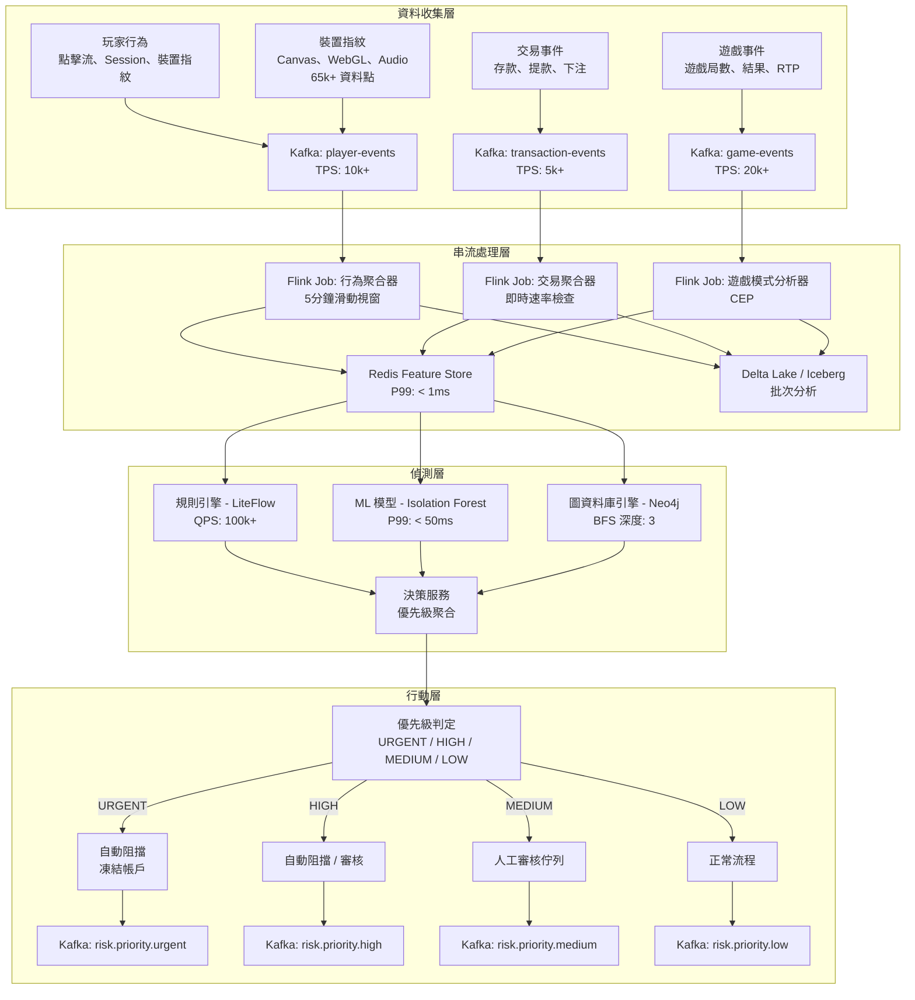
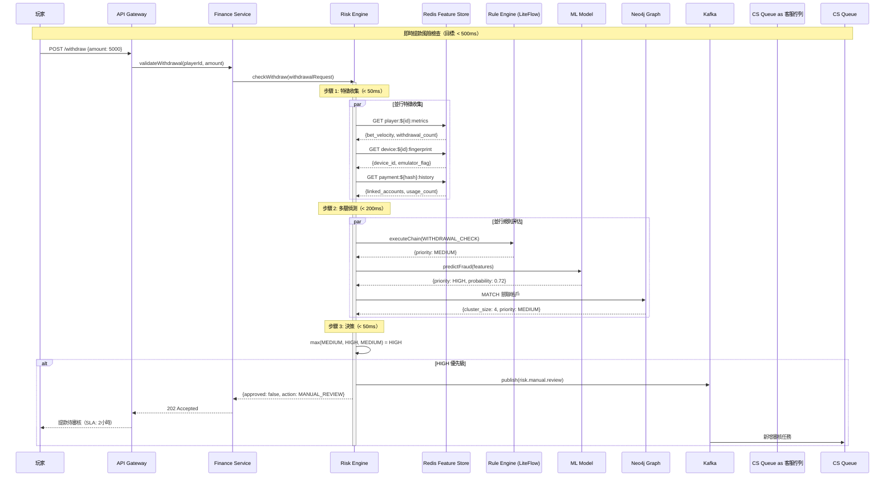

# 風控系統架構（Risk Control System Architecture）

> **業務需求**: [Risk_Strategy_Overview.md](../../requirements/05_Risk_Compliance/Risk_Strategy_Overview.md)
> **規範來源**: [source-archive/05_Risk_Control/05-01_Risk_Framework.md](../../source-archive/05_Risk_Control/05-01_Risk_Framework.md)
> **目標讀者**: Architects, Backend Developers, DevOps Engineers
> **最後同步**: 2026-02-09
> **來源版本**: 4.0.0

---

## 架構概述（Architecture Overview）

風控系統採用**事件驅動架構（Event-Driven Architecture, EDA）**，實現：
- **94.2% 真陽性率**
- **次秒級延遲**
- **模組化與可擴展設計**

---

## 1. 事件驅動架構（Event-Driven Architecture）



### 核心元件（Key Components）

| 元件 | 技術 | 效能 | 用途 |
|-----------|------------|-------------|---------|
| **訊息匯流排** | Apache Kafka | 35k+ TPS | 高吞吐量資料攝取 |
| **串流處理** | Apache Flink | 次秒級 | 複雜事件處理（Complex Event Processing, CEP） |
| **特徵儲存** | Redis Cluster | P99 < 1ms | 低延遲特徵查詢 |
| **規則引擎** | LiteFlow | 100k+ QPS | 確定性規則執行 |
| **ML 模型** | Isolation Forest | P99 < 50ms | 異常偵測 |
| **圖資料庫引擎** | Neo4j | BFS 深度 3 | 多帳戶關聯分析 |
| **資料湖** | Delta Lake / Iceberg | 批次處理 | 歷史分析 |

---

## 2. 即時偵測流程（Real-time Detection Sequence）



### 效能 SLA（Performance SLA）

| API | P99 延遲 | P50 延遲 | 可用性 |
|-----|-------------|-------------|--------------|
| `validateBet()` | < 100ms | < 30ms | 99.9% |
| `checkWithdraw()` | < 500ms | < 200ms | 99.95% |
| `assessPlayerRisk()` | < 1000ms | < 400ms | 99.9% |
| `validateTurnover()` | < 2000ms | < 800ms | 99.5% |

---

## 3. API 規格（API Specifications）

### 3.1 validateBet（Layer 1 核心邏輯）- v2.1.0

**用途**: 配置驅動的下注驗證，支援 BLOCK/FLAG/PASS 模式。

**請求**:
```json
{
  "bet_id": "tx_123456",
  "player_id": "u_999",
  "game_type": "BACCARAT",
  "selection": "Banker",
  "odds": 0.95,
  "amount": 1000.00,
  "ip": "1.1.1.1"
}
```

**回應（BLOCK）**:
```json
{
  "is_valid": false,
  "action_type": "BLOCK",
  "matched_rules": ["SAME_MATCH_HEDGE", "BOT_DETECTION"],
  "rejection_reason": "Hedge betting detected, Bot detected",
  "effective_turnover_base": 0
}
```

**回應（FLAG）**:
```json
{
  "is_valid": true,
  "action_type": "FLAG",
  "matched_rules": ["LOW_ODDS_WAGERING"],
  "risk_proposal_id": "RP-20260202-123456",
  "effective_turnover_base": 1000.00,
  "flagged_reasons": ["Low odds wagering (0.95 < 1.5 threshold)"]
}
```

### 3.2 checkWithdraw

**請求**:
```json
{
  "withdrawal_id": "wd_789012",
  "player_id": "u_999",
  "amount": 5000.00,
  "payment_method": "BANK_TRANSFER",
  "account_hash": "hash_of_bank_account",
  "ip": "1.1.1.1",
  "device_id": "dev_abc123"
}
```

**回應**:
```json
{
  "approved": false,
  "risk_level": "HIGH",
  "reasons": ["TURNOVER_NOT_MET", "NEW_PAYMENT_METHOD", "SUSPICIOUS_IP"],
  "action": "MANUAL_REVIEW",
  "sla_hours": 2
}
```

### 3.3 錯誤代碼（Error Codes）

| 代碼 | 名稱 | HTTP 狀態 | 描述 |
|------|------|-------------|-------------|
| `RISK_001` | TURNOVER_NOT_MET | 403 | 未達有效投注額（Valid Turnover）要求 |
| `RISK_002` | HEDGE_BET | 403 | 偵測到對沖下注 |
| `RISK_005` | MULTI_ACCOUNT | 403 | 多帳戶關聯 |
| `RISK_007` | BLACKLIST_MATCH | 403 | 黑名單比對命中 |
| `RISK_500` | INTERNAL_ERROR | 500 | 引擎內部錯誤 |
| `RISK_504` | TIMEOUT | 504 | 檢查逾時（> 3秒） |

---

## 4. 整合架構（Integration Architecture）

```
[風控引擎整合架構]
┌──────────────────────────────────────────────────────────────────────┐
│                         風控引擎核心                                   │
│                                                                      │
│  提供的 API（gRPC/REST）:                                             │
│  ├─ validateBet()          → 活動系統 (04-01)                         │
│  ├─ validateTurnover()     → 財務系統 (02-04)                         │
│  ├─ checkWithdraw()        → 財務系統 (02-01)                         │
│  ├─ assessPlayerRisk()     → VIP 系統 (01-02)、CRM (07-01)           │
│  └─ reportFraudIncident()  → 客服平台 (11-01)                         │
│                                                                      │
│  發布的事件（Kafka）:                                                  │
│  ├─ risk.player.flagged    → 客服平台、CRM                            │
│  ├─ risk.fraud.detected    → 財務系統、客服平台                        │
│  ├─ risk.withdrawal.rejected → 財務系統、玩家通知                      │
│  └─ risk.model.updated     → 分析系統、稽核系統                        │
│                                                                      │
│  消費的事件（Kafka）:                                                  │
│  ├─ player.registered      → 初始化風險檔案                            │
│  ├─ player.kyc.completed   → 更新風險等級                             │
│  ├─ wallet.deposit.completed → 速率檢查                               │
│  └─ game.bet.placed        → 即時模式分析                             │
└──────────────────────────────────────────────────────────────────────┘
```

### 同步 vs 非同步（Sync vs Async）

| 情境 | 呼叫方式 | 原因 |
|----------|-------------|--------|
| 提款前檢查 | 同步 gRPC/REST | 必須等待結果 |
| 下注驗證 | 同步 gRPC/REST | 活動系統需要立即有效性結果 |
| 玩家註冊 | 非同步 Kafka | 非阻塞初始化 |
| 詐騙警報 | 非同步 Kafka | 通知而不阻塞 |

---

## 5. 降級策略（Degradation Strategy）

| 等級 | 觸發條件 | 降級措施 | 業務影響 |
|-------|---------|-------------|-----------------|
| **等級 0** | P99 < 100ms | 完整功能 | 無 |
| **等級 1** | P99 > 200ms | 停用圖資料庫分析 | 關聯準確率下降 10% |
| **等級 2** | P99 > 500ms | 僅規則引擎 | ML 停用，漏報率提高 15% |
| **等級 3** | 服務不可用 | 白名單通過，其他阻擋 | 嚴重影響，緊急修復 |

**自動恢復**: 當指標正常化 5 分鐘後，自動升級至前一等級。

---

## 6. RTP 異常偵測（RTP Anomaly Detection）

### 6.1 計算服務（Calculation Service）

```java
@Service
@RequiredArgsConstructor
public class RtpCalculationService {

    /**
     * Calculate game RTP
     * RTP = (Total Payouts / Total Bets) × 100%
     */
    public RtpResult calculateGameRtp(String gameId, LocalDateTime start, LocalDateTime end) {
        GameStats stats = gameStatsDao.aggregate(gameId, start, end);

        if (stats.getTotalBets().compareTo(BigDecimal.ZERO) == 0) {
            return RtpResult.noData();
        }

        BigDecimal rtp = stats.getTotalPayouts()
            .divide(stats.getTotalBets(), 4, RoundingMode.HALF_UP)
            .multiply(new BigDecimal("100"));

        return RtpResult.builder()
            .gameId(gameId)
            .rtp(rtp)
            .totalBets(stats.getTotalBets())
            .totalPayouts(stats.getTotalPayouts())
            .roundCount(stats.getRoundCount())
            .build();
    }
}
```

### 6.2 偵測規則（Detection Rules）

| 規則 | 條件 | 風險等級 | 行動 |
|------|-----------|------------|--------|
| 遊戲 RTP 過高 | 24小時 RTP > 理論值 + 10% | 高 | 通知供應商 + 調查 |
| 遊戲 RTP 過低 | 24小時 RTP < 理論值 - 10% | 中 | 監控 + 合規審查 |
| 玩家 RTP 異常 | 玩家 RTP > 理論值 + 20%（100+ 局） | 嚴重 | 凍結 + 調查 |
| RTP 集群異常 | 多位玩家同一遊戲異常 | 嚴重 | 暫停遊戲 + 緊急處理 |

### 6.3 Prometheus 指標（Prometheus Metrics）

```yaml
game_rtp_current:
  type: gauge
  labels: [game_id, provider, period]
  description: "Current RTP value"

game_rtp_deviation:
  type: gauge
  labels: [game_id, provider]
  description: "RTP deviation from theoretical"

player_rtp_anomaly:
  type: counter
  labels: [game_id, risk_level]
  description: "Player RTP anomaly detection count"
```

---

## 7. 配置驅動規則（Configuration-Driven Rules）- v2.1.0

### 7.1 資料庫架構（Database Schema）

```sql
CREATE TABLE t_risk_rule_config (
    id BIGINT PRIMARY KEY AUTO_INCREMENT,
    rule_code VARCHAR(50) NOT NULL UNIQUE COMMENT 'Rule code',
    rule_name VARCHAR(100) NOT NULL COMMENT 'Rule name',
    rule_category VARCHAR(50) NOT NULL COMMENT 'Category (FRAUD/ARBITRAGE/WAGERING)',
    action_type VARCHAR(20) NOT NULL COMMENT 'Action (BLOCK/FLAG/IGNORE)',
    enabled BOOLEAN DEFAULT TRUE,
    rule_params JSON COMMENT 'Rule parameters',
    game_types JSON COMMENT 'Applicable game types',
    excluded_games JSON COMMENT 'Excluded games',
    updated_by VARCHAR(50),
    updated_at DATETIME DEFAULT CURRENT_TIMESTAMP ON UPDATE CURRENT_TIMESTAMP,

    INDEX idx_category_enabled (rule_category, enabled),
    INDEX idx_action_type (action_type)
) COMMENT='Risk rule configuration table';
```

### 7.2 範例配置（Sample Configuration）

```sql
-- BLOCK rules (real-time block)
INSERT INTO t_risk_rule_config VALUES
(1, 'BLACKLIST_PLAYER', 'Blacklist Player', 'FRAUD', 'BLOCK', true, '{}', NULL, NULL, NULL, NOW()),
(2, 'BOT_DETECTION', 'Bot Detection', 'FRAUD', 'BLOCK', true, '{"threshold": 0.95}', NULL, NULL, NULL, NOW()),
(3, 'SAME_MATCH_HEDGE', 'Same Match Hedge', 'ARBITRAGE', 'BLOCK', true, '{}', '["SPORTS"]', NULL, NULL, NOW()),

-- FLAG rules (delayed review)
(5, 'CROSS_MATCH_HEDGE', 'Cross Match Hedge', 'ARBITRAGE', 'FLAG', true, '{"window_hours": 24}', '["SPORTS"]', NULL, NULL, NOW()),
(6, 'LOW_ODDS_WAGERING', 'Low Odds Wagering', 'WAGERING', 'FLAG', true, '{"odds_threshold": 1.5}', '["SPORTS", "LIVE"]', NULL, NULL, NOW());
```

### 7.3 SmartAdmin 架構映射（SmartAdmin Architecture Mapping）

**Entity**:
```java
@Entity
@Table(name = "t_risk_rule_config")
public class RiskRuleConfigEntity extends BaseEntity {
    @Column(name = "rule_code", unique = true, nullable = false, length = 50)
    private String ruleCode;

    @Enumerated(EnumType.STRING)
    @Column(name = "action_type", nullable = false, length = 20)
    private ActionType actionType;  // BLOCK, FLAG, IGNORE

    @Type(JsonStringType.class)
    @Column(name = "rule_params", columnDefinition = "json")
    private Map<String, Object> ruleParams;
}
```

**Service（Vavr Option）**:
```java
public class RiskRuleConfigService {

    private final RiskRuleConfigManager riskRuleConfigManager;

    public Option<List<RiskRuleConfigVO>> loadEnabledRules(String gameType) {
        return riskRuleConfigManager.findEnabledRulesByGameType(gameType)
            .map(entities -> entities.stream()
                .map(e -> SmartBeanUtil.copy(e, RiskRuleConfigVO.class))
                .collect(Collectors.toList()));
    }
}
```

**Manager（@Transactional）**:
```java
public class RiskRuleConfigManager {

    private final RiskRuleConfigDao riskRuleConfigDao;

    @Transactional(rollbackFor = Throwable.class)
    public void updateRuleConfig(Long ruleId, RiskRuleConfigUpdateDTO updateDTO) {
        RiskRuleConfigEntity entity = riskRuleConfigDao.selectById(ruleId);
        if (entity == null) {
            throw new BusinessException(ErrorCode.RISK_RULE_NOT_FOUND);
        }

        entity.setActionType(updateDTO.getActionType());
        entity.setEnabled(updateDTO.getEnabled());
        riskRuleConfigDao.updateById(entity);

        // Clear cache
        redisTemplate.delete("risk:rules:" + entity.getRuleCategory());
    }
}
```

---

## 8. 監控與告警（Monitoring & Alerting）

### 8.1 關鍵指標（Key Metrics）

| 類別 | 指標 | 正常 | 警告 | 嚴重 |
|----------|--------|--------|---------|----------|
| **效能** | API P99 延遲 | < 100ms | > 200ms | > 500ms |
| **效能** | API 錯誤率 | < 0.1% | > 1% | > 5% |
| **業務** | 詐騙偵測率 | 0.5-1.5% | < 0.2% 或 > 3% | < 0.1% 或 > 5% |
| **業務** | 誤報率 | < 5% | > 8% | > 15% |
| **系統** | Kafka Consumer Lag | < 1秒 | > 10秒 | > 60秒 |

### 8.2 告警策略（Alert Strategy）

**P0（立即 - 電話 + 簡訊 + PagerDuty）**:
- 風控系統完全不可用（> 90% API 失敗）
- 黑名單功能失效（> 50% 查詢失敗）
- 大規模詐騙攻擊（> 1000 事件/小時）

**P1（1 小時 - Slack + Email）**:
- API 延遲 > 500ms（持續 > 10 分鐘）
- 誤報率飆升（> 15%）
- 人工審核佇列積壓（> 300 項）

---

## 9. 安全與合規（Security & Compliance）

### 9.1 API 認證（API Authentication）

**內部 API**: mTLS（Mutual TLS）
- 每個呼叫服務持有客戶端憑證
- 風控引擎驗證憑證並檢查服務身份
- 僅白名單服務可呼叫風控 API

**外部 API**: API Key + HMAC 簽章
- API Key 識別呼叫者
- 請求本體使用 HMAC-SHA256 簽章
- 速率限制（1000 請求/分鐘）

### 9.2 稽核追蹤（Audit Trail）

**保留期限**:
- 熱資料（Elasticsearch）: 30 天
- 溫資料（S3）: 1 年
- 冷資料（Glacier）: 7 年（反洗錢 AML 合規要求）

**防篡改**:
- 每筆日誌生成 HMAC 雜湊值
- 每日 Hash Chain 完整性驗證

### 9.3 GDPR 合規（GDPR Compliance）

**資料刪除（被遺忘權，Right to Erasure）**:
- 匿名化 `player_risk_profiles` 中的 PII 欄位（IP、裝置指紋）
- 在 `risk_events` 中將 `player_id` 替換為假名化 ID
- 保留交易記錄 7 年（AML 要求），但不含可識別資訊
- 使用 Crypto-Shredding（銷毀玩家特定的 DEK）

---

## 相關文件（Related Documents）

### 核心依賴（Core Dependencies）
- 錢包架構 *(規劃中)* - 餘額監控
- [Turnover_Calculation_Logic.md](../03_Game_Integration/Turnover_Calculation_Logic.md) - Layer 2 整合

### 技術參考（Technical Reference）
- [Gateway_Core.md](../09_Infrastructure/Gateway_Core.md) - API 速率限制、熔斷器
- [Stream_Processing_Architecture.md](../09_Infrastructure/Stream_Processing_Architecture.md) - Kafka/Flink 模式

---

## 合規缺口說明（Compliance Gap Notes）

> **6AMLD 合規缺口**: 目前風控系統涵蓋 FATF 建議和 5AMLD（第五反洗錢指令），但尚未完全對齊 6AMLD（第六反洗錢指令, Sixth Anti-Money Laundering Directive）的新增要求：
> - **刑事責任擴展（Criminal Liability Extension）**: 法人實體直接承擔刑事責任
> - **22 種核心犯罪行為（22 Predicate Offences）**: 含稅務犯罪、環境犯罪的擴展清單
> - **輔助犯罪（Aiding & Abetting）**: 協助洗錢行為的偵測
>
> **待辦**: 需建立獨立文件 `6AMLD_Compliance_Requirements.md` 規劃完整合規需求，並更新 KYC/AML 交易監控規則。

---

**文件版本**: 1.0.0
**最後更新**: 2026-02-08
**維護者**: 風控團隊 & 後端團隊
