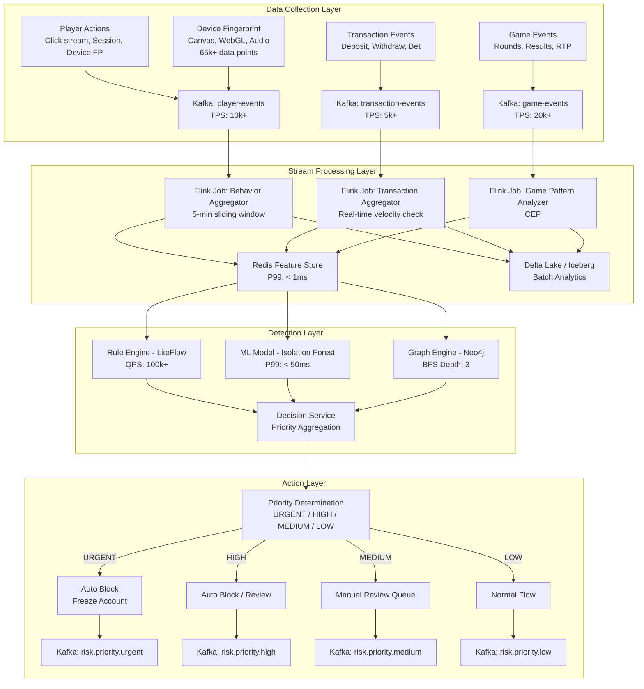
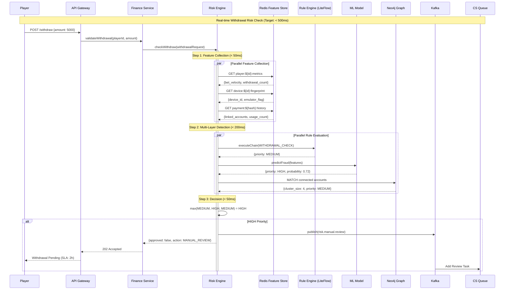

# Risk Control System Architecture

> **Business Requirements**: [Risk_Strategy_Overview.md](../../requirements/05_Risk_Compliance/Risk_Strategy_Overview.md)
> **Canonical Source**: [source-archive/05_Risk_Control/05-01_Risk_Framework.md](../../source-archive/05_Risk_Control/05-01_Risk_Framework.md)
> **Audience**: Architects, Backend Developers, DevOps Engineers
> **Last Synced**: 2026-02-09
> **Source Version**: 4.0.0

---

## Architecture Overview

The risk control system employs an **Event-Driven Architecture (EDA)** achieving:
- **94.2% true positive rate**
- **Sub-second latency**
- **Modular and scalable design**

---

## 1. Event-Driven Architecture



### Key Components

| Component | Technology | Performance | Purpose |
|-----------|------------|-------------|---------|
| **Message Bus** | Apache Kafka | 35k+ TPS | High-throughput data ingestion |
| **Stream Processing** | Apache Flink | Sub-second | Complex Event Processing (CEP) |
| **Feature Store** | Redis Cluster | P99 < 1ms | Low-latency feature lookup |
| **Rule Engine** | LiteFlow | 100k+ QPS | Deterministic rule execution |
| **ML Model** | Isolation Forest | P99 < 50ms | Anomaly detection |
| **Graph Engine** | Neo4j | BFS Depth 3 | Multi-account correlation |
| **Data Lake** | Delta Lake / Iceberg | Batch | Historical analysis |

---

## 2. Real-time Detection Sequence



### Performance SLA

| API | P99 Latency | P50 Latency | Availability |
|-----|-------------|-------------|--------------|
| `validateBet()` | < 100ms | < 30ms | 99.9% |
| `checkWithdraw()` | < 500ms | < 200ms | 99.95% |
| `assessPlayerRisk()` | < 1000ms | < 400ms | 99.9% |
| `validateTurnover()` | < 2000ms | < 800ms | 99.5% |

---

## 3. API Specifications

### 3.1 validateBet (Layer 1 Core Logic) - v2.1.0

**Purpose**: Configuration-driven bet validation with BLOCK/FLAG/PASS modes.

**Request**:
```json
{
  "bet_id": "tx_123456",
  "player_id": "u_999",
  "game_type": "BACCARAT",
  "selection": "Banker",
  "odds": 0.95,
  "amount": 1000.00,
  "ip": "1.1.1.1"
}
```

**Response (BLOCK)**:
```json
{
  "is_valid": false,
  "action_type": "BLOCK",
  "matched_rules": ["SAME_MATCH_HEDGE", "BOT_DETECTION"],
  "rejection_reason": "Hedge betting detected, Bot detected",
  "effective_turnover_base": 0
}
```

**Response (FLAG)**:
```json
{
  "is_valid": true,
  "action_type": "FLAG",
  "matched_rules": ["LOW_ODDS_WAGERING"],
  "risk_proposal_id": "RP-20260202-123456",
  "effective_turnover_base": 1000.00,
  "flagged_reasons": ["Low odds wagering (0.95 < 1.5 threshold)"]
}
```

### 3.2 checkWithdraw

**Request**:
```json
{
  "withdrawal_id": "wd_789012",
  "player_id": "u_999",
  "amount": 5000.00,
  "payment_method": "BANK_TRANSFER",
  "account_hash": "hash_of_bank_account",
  "ip": "1.1.1.1",
  "device_id": "dev_abc123"
}
```

**Response**:
```json
{
  "approved": false,
  "risk_level": "HIGH",
  "reasons": ["TURNOVER_NOT_MET", "NEW_PAYMENT_METHOD", "SUSPICIOUS_IP"],
  "action": "MANUAL_REVIEW",
  "sla_hours": 2
}
```

### 3.3 Error Codes

| Code | Name | HTTP Status | Description |
|------|------|-------------|-------------|
| `RISK_001` | TURNOVER_NOT_MET | 403 | Turnover requirement not met |
| `RISK_002` | HEDGE_BET | 403 | Hedge bet detected |
| `RISK_005` | MULTI_ACCOUNT | 403 | Multi-account correlation |
| `RISK_007` | BLACKLIST_MATCH | 403 | Blacklist match |
| `RISK_500` | INTERNAL_ERROR | 500 | Internal engine error |
| `RISK_504` | TIMEOUT | 504 | Check timeout (> 3s) |

---

## 4. Integration Architecture

```
[Risk Engine Integration Architecture]
┌──────────────────────────────────────────────────────────────────────┐
│                         Risk Engine Core                             │
│                                                                      │
│  Provided APIs (gRPC/REST):                                          │
│  ├─ validateBet()          → Activity (04-01)                        │
│  ├─ validateTurnover()     → Finance (02-04)                         │
│  ├─ checkWithdraw()        → Finance (02-01)                         │
│  ├─ assessPlayerRisk()     → VIP (01-02), CRM (07-01)                │
│  └─ reportFraudIncident()  → CS Platform (11-01)                     │
│                                                                      │
│  Events Published (Kafka):                                           │
│  ├─ risk.player.flagged    → CS Platform, CRM                        │
│  ├─ risk.fraud.detected    → Finance, CS Platform                    │
│  ├─ risk.withdrawal.rejected → Finance, Player Notification          │
│  └─ risk.model.updated     → Analytics, Audit                        │
│                                                                      │
│  Events Consumed (Kafka):                                            │
│  ├─ player.registered      → Initialize risk profile                 │
│  ├─ player.kyc.completed   → Update risk level                       │
│  ├─ wallet.deposit.completed → Velocity check                        │
│  └─ game.bet.placed        → Real-time pattern analysis              │
└──────────────────────────────────────────────────────────────────────┘
```

### Sync vs Async

| Scenario | Call Method | Reason |
|----------|-------------|--------|
| Pre-withdrawal check | Sync gRPC/REST | Must wait for result |
| Bet validation | Sync gRPC/REST | Activity needs immediate validity |
| Player registration | Async Kafka | Non-blocking initialization |
| Fraud alert | Async Kafka | Notify without blocking |

---

## 5. Degradation Strategy

| Level | Trigger | Degradation | Business Impact |
|-------|---------|-------------|-----------------|
| **Level 0** | P99 < 100ms | Full functionality | None |
| **Level 1** | P99 > 200ms | Disable graph analysis | 10% drop in correlation accuracy |
| **Level 2** | P99 > 500ms | Rule engine only | ML disabled, 15% higher miss rate |
| **Level 3** | Service unavailable | Whitelist pass, others block | Severe impact, emergency fix |

**Auto Recovery**: When metrics normalize for 5 minutes, auto-upgrade to previous level.

---

## 6. RTP Anomaly Detection

### 6.1 Calculation Service

```java
@Service
@RequiredArgsConstructor
public class RtpCalculationService {

    /**
     * Calculate game RTP
     * RTP = (Total Payouts / Total Bets) × 100%
     */
    public RtpResult calculateGameRtp(String gameId, LocalDateTime start, LocalDateTime end) {
        GameStats stats = gameStatsDao.aggregate(gameId, start, end);

        if (stats.getTotalBets().compareTo(BigDecimal.ZERO) == 0) {
            return RtpResult.noData();
        }

        BigDecimal rtp = stats.getTotalPayouts()
            .divide(stats.getTotalBets(), 4, RoundingMode.HALF_UP)
            .multiply(new BigDecimal("100"));

        return RtpResult.builder()
            .gameId(gameId)
            .rtp(rtp)
            .totalBets(stats.getTotalBets())
            .totalPayouts(stats.getTotalPayouts())
            .roundCount(stats.getRoundCount())
            .build();
    }
}
```

### 6.2 Detection Rules

| Rule | Condition | Risk Level | Action |
|------|-----------|------------|--------|
| Game RTP too high | 24h RTP > Theory + 10% | High | Notify provider + investigate |
| Game RTP too low | 24h RTP < Theory - 10% | Medium | Monitor + compliance review |
| Player RTP anomaly | Player RTP > Theory + 20% (100+ rounds) | Critical | Freeze + investigate |
| RTP clustering | Multiple players same game anomaly | Critical | Suspend game + emergency |

### 6.3 Prometheus Metrics

```yaml
game_rtp_current:
  type: gauge
  labels: [game_id, provider, period]
  description: "Current RTP value"

game_rtp_deviation:
  type: gauge
  labels: [game_id, provider]
  description: "RTP deviation from theoretical"

player_rtp_anomaly:
  type: counter
  labels: [game_id, risk_level]
  description: "Player RTP anomaly detection count"
```

---

## 7. Configuration-Driven Rules (v2.1.0)

### 7.1 Database Schema

```sql
CREATE TABLE t_risk_rule_config (
    id BIGINT PRIMARY KEY AUTO_INCREMENT,
    rule_code VARCHAR(50) NOT NULL UNIQUE COMMENT 'Rule code',
    rule_name VARCHAR(100) NOT NULL COMMENT 'Rule name',
    rule_category VARCHAR(50) NOT NULL COMMENT 'Category (FRAUD/ARBITRAGE/WAGERING)',
    action_type VARCHAR(20) NOT NULL COMMENT 'Action (BLOCK/FLAG/IGNORE)',
    enabled BOOLEAN DEFAULT TRUE,
    rule_params JSON COMMENT 'Rule parameters',
    game_types JSON COMMENT 'Applicable game types',
    excluded_games JSON COMMENT 'Excluded games',
    updated_by VARCHAR(50),
    updated_at DATETIME DEFAULT CURRENT_TIMESTAMP ON UPDATE CURRENT_TIMESTAMP,

    INDEX idx_category_enabled (rule_category, enabled),
    INDEX idx_action_type (action_type)
) COMMENT='Risk rule configuration table';
```

### 7.2 Sample Configuration

```sql
-- BLOCK rules (real-time block)
INSERT INTO t_risk_rule_config VALUES
(1, 'BLACKLIST_PLAYER', 'Blacklist Player', 'FRAUD', 'BLOCK', true, '{}', NULL, NULL, NULL, NOW()),
(2, 'BOT_DETECTION', 'Bot Detection', 'FRAUD', 'BLOCK', true, '{"threshold": 0.95}', NULL, NULL, NULL, NOW()),
(3, 'SAME_MATCH_HEDGE', 'Same Match Hedge', 'ARBITRAGE', 'BLOCK', true, '{}', '["SPORTS"]', NULL, NULL, NOW()),

-- FLAG rules (delayed review)
(5, 'CROSS_MATCH_HEDGE', 'Cross Match Hedge', 'ARBITRAGE', 'FLAG', true, '{"window_hours": 24}', '["SPORTS"]', NULL, NULL, NOW()),
(6, 'LOW_ODDS_WAGERING', 'Low Odds Wagering', 'WAGERING', 'FLAG', true, '{"odds_threshold": 1.5}', '["SPORTS", "LIVE"]', NULL, NULL, NOW());
```

### 7.3 SmartAdmin Architecture Mapping

**Entity**:
```java
@Entity
@Table(name = "t_risk_rule_config")
public class RiskRuleConfigEntity extends BaseEntity {
    @Column(name = "rule_code", unique = true, nullable = false, length = 50)
    private String ruleCode;

    @Enumerated(EnumType.STRING)
    @Column(name = "action_type", nullable = false, length = 20)
    private ActionType actionType;  // BLOCK, FLAG, IGNORE

    @Type(JsonStringType.class)
    @Column(name = "rule_params", columnDefinition = "json")
    private Map<String, Object> ruleParams;
}
```

**Service (Vavr Option)**:
```java
public class RiskRuleConfigService {

    private final RiskRuleConfigManager riskRuleConfigManager;

    public Option<List<RiskRuleConfigVO>> loadEnabledRules(String gameType) {
        return riskRuleConfigManager.findEnabledRulesByGameType(gameType)
            .map(entities -> entities.stream()
                .map(e -> SmartBeanUtil.copy(e, RiskRuleConfigVO.class))
                .collect(Collectors.toList()));
    }
}
```

**Manager (@Transactional)**:
```java
public class RiskRuleConfigManager {

    private final RiskRuleConfigDao riskRuleConfigDao;

    @Transactional(rollbackFor = Throwable.class)
    public void updateRuleConfig(Long ruleId, RiskRuleConfigUpdateDTO updateDTO) {
        RiskRuleConfigEntity entity = riskRuleConfigDao.selectById(ruleId);
        if (entity == null) {
            throw new BusinessException(ErrorCode.RISK_RULE_NOT_FOUND);
        }

        entity.setActionType(updateDTO.getActionType());
        entity.setEnabled(updateDTO.getEnabled());
        riskRuleConfigDao.updateById(entity);

        // Clear cache
        redisTemplate.delete("risk:rules:" + entity.getRuleCategory());
    }
}
```

---

## 8. Monitoring & Alerting

### 8.1 Key Metrics

| Category | Metric | Normal | Warning | Critical |
|----------|--------|--------|---------|----------|
| **Performance** | API P99 Latency | < 100ms | > 200ms | > 500ms |
| **Performance** | API Error Rate | < 0.1% | > 1% | > 5% |
| **Business** | Fraud Detection Rate | 0.5-1.5% | < 0.2% or > 3% | < 0.1% or > 5% |
| **Business** | False Positive Rate | < 5% | > 8% | > 15% |
| **System** | Kafka Consumer Lag | < 1s | > 10s | > 60s |

### 8.2 Alert Strategy

**P0 (Immediate - Phone + SMS + PagerDuty)**:
- Risk system completely unavailable (> 90% API failure)
- Blacklist function failed (> 50% lookup failures)
- Large-scale fraud attack (> 1000 events/hour)

**P1 (1 hour - Slack + Email)**:
- API latency > 500ms (> 10 minutes)
- False positive rate surge (> 15%)
- Manual review queue backlog (> 300 items)

---

## 9. Security & Compliance

### 9.1 API Authentication

**Internal APIs**: mTLS (Mutual TLS)
- Each calling service holds client certificate
- Risk engine validates certificate and checks service identity
- Only whitelisted services can call risk APIs

**External APIs**: API Key + HMAC Signature
- API Key identifies caller
- Request body signed with HMAC-SHA256
- Rate limiting (1000 requests/minute)

### 9.2 Audit Trail

**Retention**:
- Hot data (Elasticsearch): 30 days
- Warm data (S3): 1 year
- Cold data (Glacier): 7 years (AML compliance)

**Tamper-proof**:
- Each log generates HMAC hash
- Daily Hash Chain integrity verification

### 9.3 GDPR Compliance

**Data Deletion (Right to Erasure)**:
- Anonymize PII fields (IP, device fingerprint) in `player_risk_profiles`
- Replace `player_id` with pseudonymized ID in `risk_events`
- Retain transaction records 7 years (AML requirement) without identifiable info
- Use Crypto-Shredding (destroy player-specific DEK)

---

## Related Documents

### Core Dependencies
- Wallet Architecture *(planned)* - Balance monitoring
- [Turnover_Calculation_Logic.md](../03_Game_Integration/Turnover_Calculation_Logic.md) - Layer 2 integration

### Technical Reference
- [Gateway_Core.md](../09_Infrastructure/Gateway_Core.md) - API rate limiting, circuit breaker
- [Stream_Processing_Architecture.md](../09_Infrastructure/Stream_Processing_Architecture.md) - Kafka/Flink patterns

---

**Document Version**: 1.0.0
**Last Updated**: 2026-02-08
**Maintainer**: Risk Team & Backend Team
