# Turnover Validation Architecture

> **Canonical Source**: [05-07_Turnover_Validation_Scheme.md](../../source-archive/05_Risk_Control/05-07_Turnover_Validation_Scheme.md)
> **Audience**: Architects, Backend Engineers, Database Engineers
> **Business Requirements**: [Turnover_Validation_Requirements.md](../../requirements/05_Risk_Compliance/Turnover_Validation_Requirements.md)
> **Last Synced**: 2026-02-08

---

## 1. Problem Statement

### 1.1 Long-Cycle Performance Bottleneck

When a player has not withdrawn for years (3--5 years), the withdrawal process must calculate all turnover since the last withdrawal. Traditional full-scan approaches have severe performance issues:

| Problem | Impact |
|---------|--------|
| Query Duration | Multi-year data scans can exceed 30 seconds |
| Database Pressure | Full table scans cause I/O spikes |
| Timeout Risk | Withdrawal requests fail due to query timeout |

### 1.2 Activity Risk Control Gap

The existing system lacks protection against bonus exploitation:
- Low-odds betting to complete turnover requirements (arbitrage)
- Hedge betting to eliminate risk before withdrawing bonus
- No mechanism to mark invalid turnover contributions

### 1.3 Turnover Validation Decision Tree

The following flowchart illustrates the complete turnover validation flow from withdrawal request through snapshot creation:

```mermaid
flowchart TD
    Start[Player Requests Withdrawal]

    subgraph "Step 1: Snapshot Retrieval"
        GetSnapshot[Query Latest Snapshot<br/>snapshotDao.findLatest playerId]
        CheckSnapshot{Snapshot<br/>Exists?}
        UseZero[Use TurnoverSnapshot.ZERO<br/>First-time withdrawal]
        UseSnapshot[Use Last Snapshot<br/>totalValidBet, snapshotTime]
    end

    subgraph "Step 2: Real-Time Aggregation"
        GetCurrent[Query Current Valid Bet<br/>betRecordDao.sumValidBet playerId]
        CalcDiff[Calculate Period Turnover<br/>periodValidBet = current - snapshot]
    end

    subgraph "Step 3: Bet Validity Rules"
        CheckBetRules[Apply Validity Rules to Each Bet]
        LowOdds{Odds < 1.3?}
        HedgeBet{Hedge Bet<br/>Detected?}
        MinBetBonus{Min Bet +<br/>Activity Turnover?}
        SameEventOpp{Same Event<br/>Opposite Bets?}
        ValidBet[Valid Turnover = Bet Amount]
        InvalidBet[Valid Turnover = 0]
    end

    subgraph "Step 4: Requirement Calculation"
        CalcRequired[Calculate Required Turnover<br/>depositAmount × multiplier + bonusAmount × multiplier]
        Compare{periodValidBet >=<br/>requiredTurnover?}
    end

    subgraph "Step 5: Risk Proposal Check"
        QueryProposals[Query Unresolved Risk Proposals<br/>Time Range: lastSnapshotTime → NOW]
        CheckProposals{Has URGENT/HIGH<br/>Proposals?}
    end

    subgraph "Step 6: Validation Result"
        PassWithRisk[PASS with Risk Warning<br/>Manual Review Required]
        Pass[PASS<br/>Proceed to Withdrawal]
        Fail[FAIL<br/>Reject Withdrawal]
    end

    subgraph "Step 7: Post-Withdrawal Snapshot"
        CreateSnapshot[Create New Snapshot<br/>INSERT INTO t_player_turnover_snapshot<br/>snapshotType = WITHDRAWAL]
        SnapshotData[Record:<br/>totalBet, totalValidBet, totalWin<br/>triggerId = withdrawalId]
    end

    Start --> GetSnapshot
    GetSnapshot --> CheckSnapshot

    CheckSnapshot -->|No| UseZero
    CheckSnapshot -->|Yes| UseSnapshot

    UseZero --> GetCurrent
    UseSnapshot --> GetCurrent

    GetCurrent --> CalcDiff
    CalcDiff --> CheckBetRules

    CheckBetRules --> LowOdds
    LowOdds -->|Yes| InvalidBet
    LowOdds -->|No| HedgeBet

    HedgeBet -->|Yes| InvalidBet
    HedgeBet -->|No| MinBetBonus

    MinBetBonus -->|Yes| InvalidBet
    MinBetBonus -->|No| SameEventOpp

    SameEventOpp -->|Yes| InvalidBet
    SameEventOpp -->|No| ValidBet

    InvalidBet --> CalcRequired
    ValidBet --> CalcRequired

    CalcRequired --> Compare

    Compare -->|No| Fail
    Compare -->|Yes| QueryProposals

    QueryProposals --> CheckProposals

    CheckProposals -->|Yes| PassWithRisk
    CheckProposals -->|No| Pass

    Pass --> CreateSnapshot
    CreateSnapshot --> SnapshotData
    SnapshotData --> End[Withdrawal Approved]

    PassWithRisk --> End2[Escalate to Manual Review]
    Fail --> End3[Rejection Notification]

    style GetSnapshot fill:#e1f5ff
    style UseZero fill:#e1f5ff
    style UseSnapshot fill:#e1f5ff
    style GetCurrent fill:#fff4e6
    style CalcDiff fill:#fff4e6
    style CheckBetRules fill:#ffe6e6
    style LowOdds fill:#ffe6e6
    style HedgeBet fill:#ffe6e6
    style MinBetBonus fill:#ffe6e6
    style SameEventOpp fill:#ffe6e6
    style InvalidBet fill:#ffcccc
    style ValidBet fill:#ccffcc
    style CalcRequired fill:#e6ffe6
    style Compare fill:#e6ffe6
    style QueryProposals fill:#f3e5f5
    style CheckProposals fill:#f3e5f5
    style Pass fill:#d4edda
    style PassWithRisk fill:#fff3cd
    style Fail fill:#f8d7da
    style CreateSnapshot fill:#cce5ff
    style SnapshotData fill:#cce5ff
```



**Decision Tree Stages**:

1. **Snapshot Retrieval**: O(1) index scan on `(player_id, snapshot_time DESC)`
2. **Real-Time Aggregation**: Query pre-aggregated counter for current valid bets
3. **Bet Validity Rules**: Apply 4 invalid turnover filters (low-odds, hedge, min-bet-bonus, same-event-opposite)
4. **Requirement Calculation**: Compare period turnover against deposit/bonus multiplier requirements
5. **Risk Proposal Check**: Query unresolved proposals within time window aligned with last snapshot
6. **Validation Result**: 3 outcomes - PASS, PASS with Risk Warning, FAIL
7. **Post-Withdrawal Snapshot**: Create checkpoint for next validation cycle

**Performance Characteristics**:
- Snapshot retrieval: < 5ms (index scan)
- Valid bet sum: < 10ms (pre-aggregated)
- Risk proposal query: < 20ms (time-range index scan)
- Total validation: < 50ms (P95)

---

## 2. Checkpoint Snapshot Design

### 2.1 Core Mechanism

Record a cumulative turnover snapshot on each successful withdrawal. Subsequent validations compute only the difference.

**Validation Formula**:

```
Period Valid Turnover = Current Total Valid Bets (real-time) - Last Snapshot Total Valid Bets
```

**Performance**: O(1) -- constant time regardless of time span.

### 2.2 Database Schema

```sql
CREATE TABLE t_player_turnover_snapshot (
    id              BIGSERIAL PRIMARY KEY,
    player_id       BIGINT NOT NULL,
    tenant_id       BIGINT NOT NULL,
    -- Snapshot data
    total_bet       NUMERIC(18, 2) NOT NULL DEFAULT 0,   -- Cumulative total bets
    total_valid_bet NUMERIC(18, 2) NOT NULL DEFAULT 0,   -- Cumulative valid turnover
    total_win       NUMERIC(18, 2) NOT NULL DEFAULT 0,   -- Cumulative total winnings
    -- Snapshot trigger info
    snapshot_type   VARCHAR(30) NOT NULL,                 -- WITHDRAWAL / MANUAL / SCHEDULED
    trigger_id      BIGINT,                               -- Associated withdrawal order ID
    -- Timestamps
    snapshot_time   TIMESTAMP NOT NULL DEFAULT NOW(),
    created_at      TIMESTAMP NOT NULL DEFAULT NOW(),

    CONSTRAINT idx_player_snapshot UNIQUE (player_id, snapshot_time)
);

CREATE INDEX idx_snapshot_player_latest
    ON t_player_turnover_snapshot (player_id, snapshot_time DESC);

COMMENT ON TABLE t_player_turnover_snapshot IS 'Player turnover snapshot -- created on each successful withdrawal';
COMMENT ON COLUMN t_player_turnover_snapshot.total_valid_bet IS 'Cumulative valid turnover (excludes invalid bets)';
```

**Index Strategy**:
- Unique constraint on `(player_id, snapshot_time)` prevents duplicate snapshots
- Descending index on `(player_id, snapshot_time DESC)` optimizes "find latest snapshot" queries

---

## 3. Validation Service Implementation

```java
/**
 * Manager class for turnover validation operations.
 * SmartAdmin Pattern: @Transactional only in Manager layer with @Component.
 */
@Component
@RequiredArgsConstructor
public class TurnoverValidationManager {

    private final TurnoverSnapshotDao snapshotDao;
    private final BetRecordDao betRecordDao;

    /**
     * Validate whether player turnover meets withdrawal requirements.
     * Performance: O(1) -- only queries latest snapshot + real-time aggregate.
     */
    public TurnoverResult validateTurnover(Long playerId, BigDecimal requiredMultiplier) {
        // 1. Get last snapshot
        TurnoverSnapshot lastSnapshot = snapshotDao.findLatest(playerId)
            .orElse(TurnoverSnapshot.ZERO);  // First withdrawal: snapshot is 0

        // 2. Get current real-time valid turnover
        BigDecimal currentValidBet = betRecordDao.sumValidBet(playerId);

        // 3. Calculate period valid turnover
        BigDecimal periodValidBet = currentValidBet.subtract(lastSnapshot.getTotalValidBet());

        // 4. Calculate required turnover
        BigDecimal requiredTurnover = calculateRequired(playerId, requiredMultiplier);

        // 5. Determine result
        boolean passed = periodValidBet.compareTo(requiredTurnover) >= 0;

        return TurnoverResult.builder()
            .playerId(playerId)
            .periodValidBet(periodValidBet)
            .requiredTurnover(requiredTurnover)
            .passed(passed)
            .lastSnapshotTime(lastSnapshot.getSnapshotTime())
            .build();
    }

    /**
     * Create a new snapshot after successful withdrawal.
     */
    @Transactional(rollbackFor = Throwable.class)
    public void createSnapshot(Long playerId, Long withdrawalId) {
        BigDecimal currentTotalBet = betRecordDao.sumTotalBet(playerId);
        BigDecimal currentValidBet = betRecordDao.sumValidBet(playerId);
        BigDecimal currentTotalWin = betRecordDao.sumTotalWin(playerId);

        TurnoverSnapshot snapshot = TurnoverSnapshot.builder()
            .playerId(playerId)
            .totalBet(currentTotalBet)
            .totalValidBet(currentValidBet)
            .totalWin(currentTotalWin)
            .snapshotType("WITHDRAWAL")
            .triggerId(withdrawalId)
            .build();

        snapshotDao.insert(snapshot);
    }
}
```

**Key Design Notes**:
- `findLatest()` returns the most recent snapshot using the descending index -- single row fetch
- `sumValidBet()` uses a pre-aggregated counter or materialized view for O(1) real-time lookup
- `@Transactional` is placed in the Manager/Service layer per SmartAdmin architecture rules
- First-time withdrawal uses `TurnoverSnapshot.ZERO` as the baseline (all cumulative values = 0)

---

## 4. Time Window Alignment with Risk Proposals

The "Full Consistency" principle requires that turnover validation and risk proposal queries use identical time boundaries:

| Dimension | Query Range | Description |
|-----------|-------------|-------------|
| Risk Proposal Query | Last Snapshot Time --> Now | All unresolved proposals since last withdrawal |
| Turnover Validation | Last Snapshot Time --> Now | Difference calculation |
| Long-Cycle Handling | No fixed day limit | Even for 5-year gaps, query all URGENT/HIGH proposals since last snapshot |

This alignment eliminates edge cases where a risk flag from 2 years ago could be missed by a fixed 30-day window.

---

## 5. Activity Risk Integration (Dual-Layer Architecture)

### 5.1 Architecture Overview

```
+---------------------------------------------+
|          Activity Risk Dual-Layer            |
+--------------------+------------------------+
|  Prevention        |  Detection             |
|  (Pre-emptive)     |  (Post-hoc)            |
+--------------------+------------------------+
|  - Claim intercept |  - Pre-withdrawal scan |
|    - IP check      |    - Anomaly proposals |
|    - Device FP     |    - Risk rule triggers |
|  - Bet intercept   |  - Reporting           |
|    - Low odds      |    - Activity ROI      |
|      --> turnover 0|    - Abuser lists      |
|    - Hedge bet     |                        |
|      --> turnover 0|                        |
+--------------------+------------------------+
```

### 5.2 Invalid Turnover Rules

| Rule Code | Condition | Turnover Contribution |
|-----------|-----------|----------------------|
| `LOW_ODDS` | Odds < 1.3 | 0 (zero) |
| `HEDGE_BET` | Detected hedge bet combination | 0 (zero) |
| `MIN_BET_BONUS` | Minimum bet amount + activity turnover | 0 (zero) |
| `SAME_EVENT_OPPOSITE` | Opposite bets on the same event | 0 (zero) |

### 5.3 Valid Bet Calculation Logic

```java
public BigDecimal calculateValidBet(BetRecord bet) {
    // Low-odds check
    if (bet.getOdds().compareTo(new BigDecimal("1.3")) < 0) {
        return BigDecimal.ZERO;  // Turnover contribution = 0
    }

    // Hedge bet check
    if (hedgeDetector.isHedgeBet(bet)) {
        return BigDecimal.ZERO;
    }

    // Normal bet: full amount counts as valid turnover
    return bet.getBetAmount();
}
```

---

## 6. Data Flow

### 6.1 Withdrawal Validation Flow

```
Player requests withdrawal
    |
    v
TurnoverValidationService.validateTurnover(playerId, multiplier)
    |
    +---> snapshotDao.findLatest(playerId)     [O(1) index scan]
    |         |
    |         v
    |     Last snapshot (or ZERO if first time)
    |
    +---> betRecordDao.sumValidBet(playerId)   [O(1) pre-aggregated]
    |         |
    |         v
    |     Current cumulative valid bets
    |
    +---> Calculate: current - lastSnapshot = periodValidBet
    |
    +---> Compare: periodValidBet >= requiredTurnover
    |
    v
TurnoverResult { passed: boolean, periodValidBet, requiredTurnover }
```

### 6.2 Snapshot Creation Flow

```
Withdrawal approved and completed
    |
    v
TurnoverValidationService.createSnapshot(playerId, withdrawalId)
    |
    +---> betRecordDao.sumTotalBet(playerId)
    +---> betRecordDao.sumValidBet(playerId)
    +---> betRecordDao.sumTotalWin(playerId)
    |
    v
INSERT INTO t_player_turnover_snapshot
    (player_id, tenant_id, total_bet, total_valid_bet, total_win,
     snapshot_type='WITHDRAWAL', trigger_id=withdrawalId)
```

---

## 7. UI Integration Points

### 7.1 Proposal Review Page

- Highlight tags: "Associated Risk", "Activity Arbitrage", "Bonus Chasing"
- Display associated promotion name and turnover completion progress

### 7.2 Bet Details Page

- Invalid turnover labels: `[Low Odds] Turnover: 0.00`, `[Hedge] Turnover: 0.00`
- Valid turnover percentage statistic per player

---

## 8. Performance Characteristics

| Operation | Complexity | Target Latency (P95) |
|-----------|------------|----------------------|
| Turnover Validation | O(1) | < 50ms |
| Snapshot Creation | O(1) per INSERT | < 100ms |
| Latest Snapshot Lookup | O(1) index scan | < 5ms |
| Valid Bet Sum | O(1) pre-aggregated | < 10ms |

---

## 9. Acceptance Criteria

- Snapshot mechanism: automatic snapshot creation after each successful withdrawal
- O(1) validation: turnover validation < 50ms (P95), independent of time span
- Invalid turnover: low-odds / hedge / bonus chasing bets counted as zero
- Time alignment: risk proposal query window = turnover validation window = last snapshot to present
- UI alerts: review page shows activity risk tags; bet page marks invalid turnover

---

## 10. Related Documents

- [05-01 Risk Framework](../../source-archive/05_Risk_Control/05-01_Risk_Framework.md) -- Configuration-driven risk rule engine
- [05-05 Risk Proposal Workflow](../../source-archive/05_Risk_Control/05-05_Risk_Proposal_Workflow.md) -- Proposal lifecycle management
- [05-06 Withdrawal Risk Correlation](../../source-archive/05_Risk_Control/05-06_Withdrawal_Risk_Correlation.md) -- Withdrawal risk scoring

---

## 11. Version History

| Version | Date | Changes |
|---------|------|---------|
| 1.0.0 | 2026-02-05 | Initial version -- Checkpoint Snapshot, dual-layer protection, invalid turnover rules |
