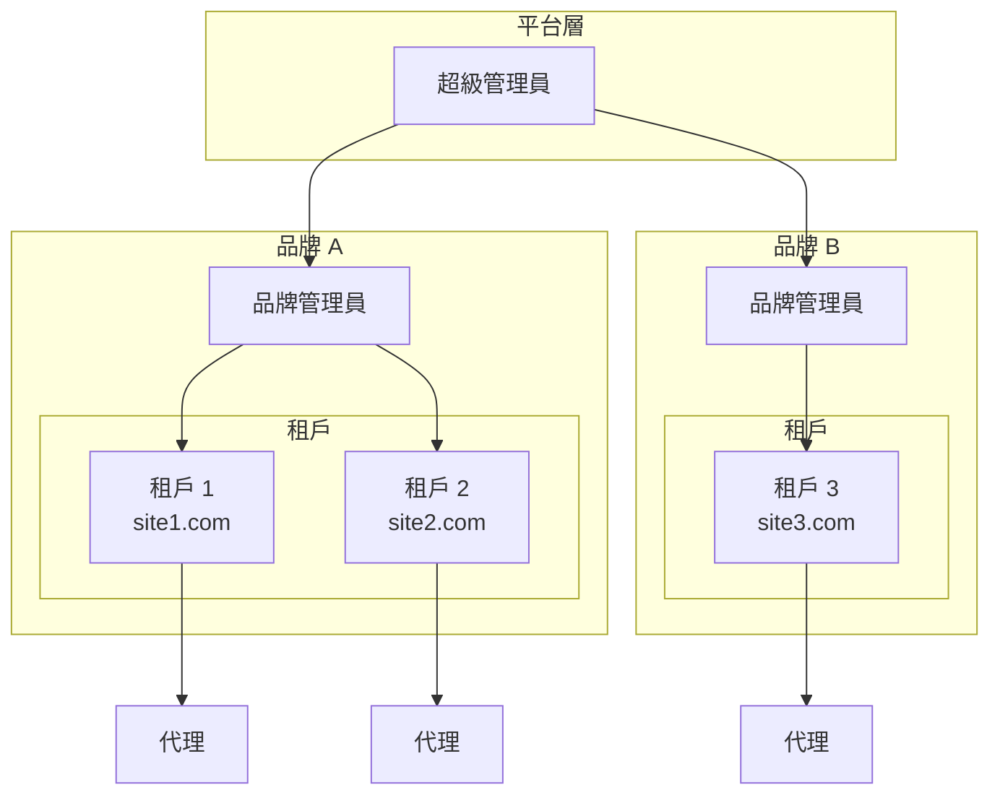
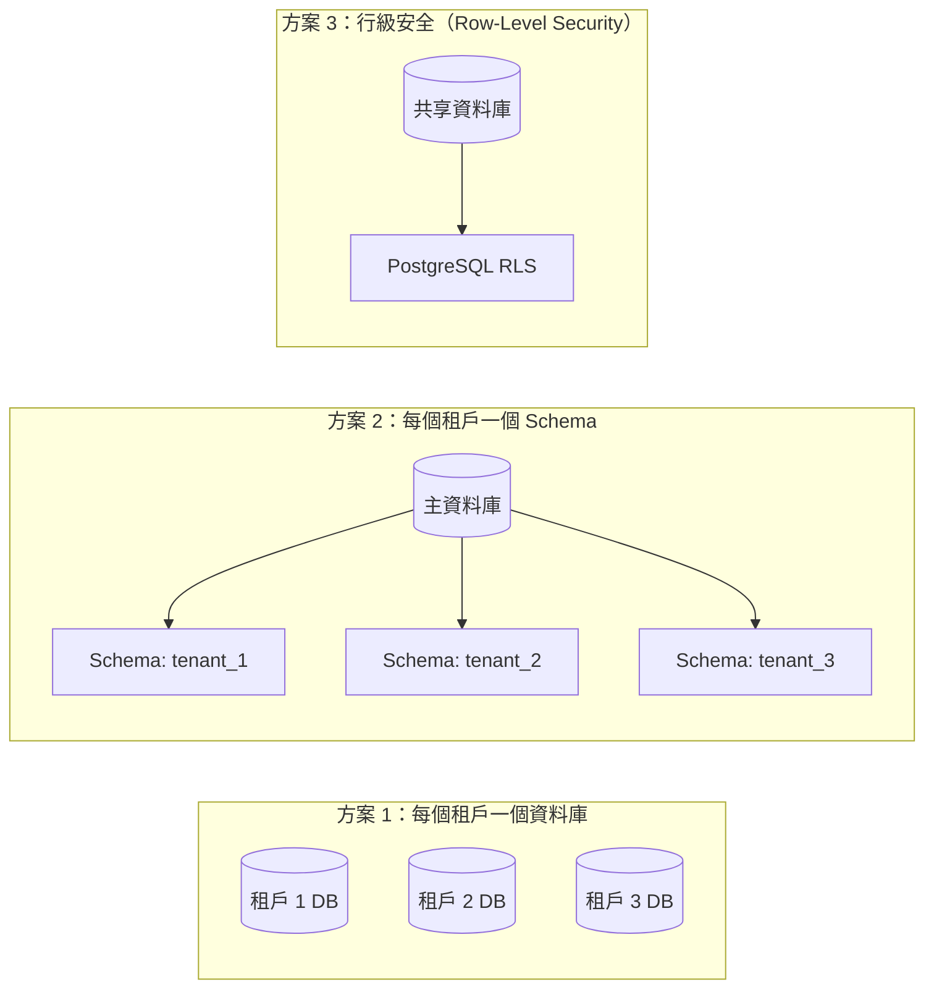
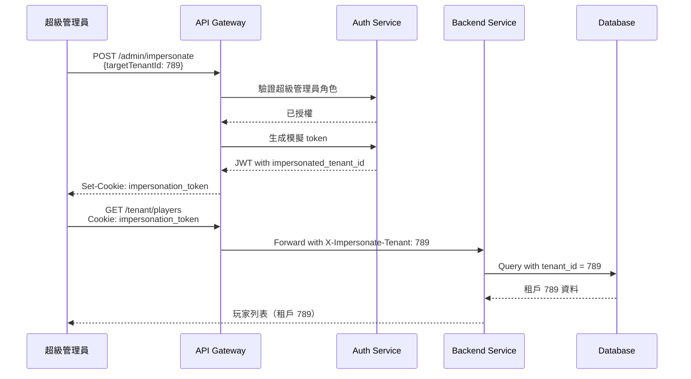
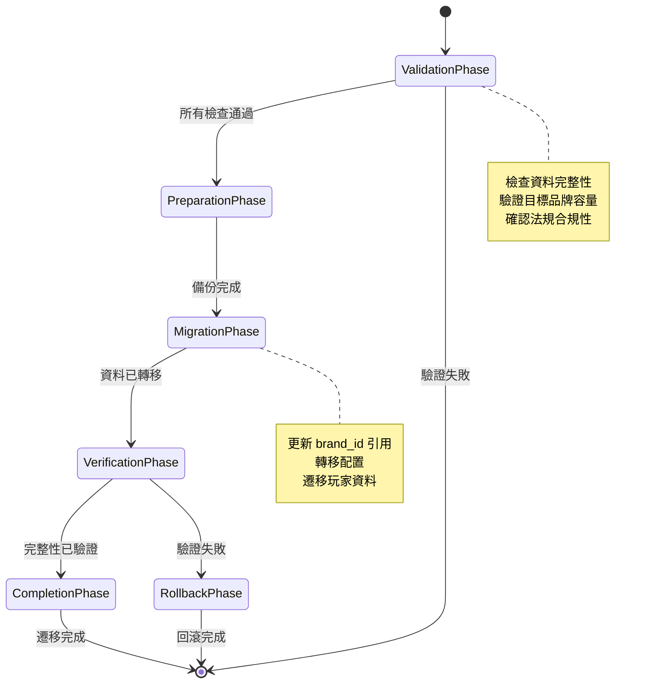

# 多租戶架構（Multi-Tenant Architecture）

> **業務需求**: [Multi_Tenant_Requirements.md](../../requirements/06_Governance_Licensing/01_Multi_Tenant_Requirements.md)
> **規範來源**: [`docs/iGaming/source-archive/06_Platform_Governance/06-01_Multi_Tenant.md`](../../source-archive/06_Platform_Governance/06-01_Multi_Tenant.md)
> **目標讀者**: Architects, Backend Developers, DevOps Engineers
> **最後同步**: 2026-02-09

---

## 1. 架構概覽（Architecture Overview）



**層級結構**: `超級管理員 -> 品牌 -> 租戶 -> 代理`

---

## 2. 資料庫分區策略（Database Partitioning Strategy）

### 2.1 資料隔離方法（Data Isolation Approaches）



| 策略 | 隔離級別 | 成本 | 跨租戶查詢 | 建議 |
|----------|-----------------|------|-------------------|----------------|
| 每個租戶一個資料庫 | 最高 | 高 | 複雜 | 企業客戶 |
| 每個租戶一個 Schema | 中等 | 中等 | 適中 | 中型部署 |
| 行級安全（RLS） | 充足 | 低 | 簡單 | **建議（SmartAdmin）** |

### 2.2 建議方案：PostgreSQL RLS 行級安全（Row-Level Security）

**PostgreSQL RLS 策略實作**：

```sql
-- Enable RLS on player table
ALTER TABLE t_player ENABLE ROW LEVEL SECURITY;

-- Create policy for tenant isolation
CREATE POLICY tenant_isolation_policy ON t_player
    USING (tenant_id = current_setting('app.current_tenant_id')::BIGINT);

-- Create policy for brand-level access
CREATE POLICY brand_access_policy ON t_player
    FOR SELECT
    USING (
        brand_id = current_setting('app.current_brand_id')::BIGINT
        OR current_setting('app.is_super_admin')::BOOLEAN = TRUE
    );
```

**Session 上下文設定**：

```sql
-- Set tenant context at connection start
SET app.current_tenant_id = '789';
SET app.current_brand_id = '10';
SET app.is_super_admin = 'FALSE';
```

---

## 3. API 租戶上下文傳播（API Tenant Context Propagation）

### 3.1 JWT Token 結構

```json
{
  "user_id": 12345,
  "role": "tenant_admin",
  "tenant_id": 789,
  "brand_id": 10,
  "permissions": ["player:read", "player:write", "report:read"],
  "exp": 1706356800,
  "iat": 1706270400
}
```

### 3.2 租戶上下文持有者（Tenant Context Holder）（ThreadLocal）

```java
/**
 * SmartAdmin Multi-Tenant Context Holder
 * Thread-safe tenant context propagation
 */
public class TenantContextHolder {

    private static final ThreadLocal<TenantContext> CONTEXT = new ThreadLocal<>();

    public static void setContext(TenantContext context) {
        CONTEXT.set(context);
    }

    public static TenantContext getContext() {
        return CONTEXT.get();
    }

    public static Long getTenantId() {
        TenantContext ctx = CONTEXT.get();
        return ctx != null ? ctx.getTenantId() : null;
    }

    public static Long getBrandId() {
        TenantContext ctx = CONTEXT.get();
        return ctx != null ? ctx.getBrandId() : null;
    }

    public static boolean isSuperAdmin() {
        TenantContext ctx = CONTEXT.get();
        return ctx != null && ctx.isSuperAdmin();
    }

    public static void clear() {
        CONTEXT.remove();
    }
}

@Data
@Builder
public class TenantContext {
    private Long tenantId;
    private Long brandId;
    private boolean superAdmin;
    private Long impersonatedTenantId; // For admin impersonation
}
```

### 3.3 租戶過濾器攔截器（Tenant Filter Interceptor）

```java
/**
 * SmartAdmin Tenant Interceptor
 * Extracts tenant context from JWT and sets ThreadLocal
 */
@Component
@RequiredArgsConstructor
public class TenantInterceptor implements HandlerInterceptor {

    private final JwtService jwtService;

    @Override
    public boolean preHandle(HttpServletRequest request,
                            HttpServletResponse response,
                            Object handler) {
        String token = extractToken(request);
        if (token != null) {
            JwtPayload payload = jwtService.parseToken(token);

            TenantContext context = TenantContext.builder()
                .tenantId(payload.getTenantId())
                .brandId(payload.getBrandId())
                .superAdmin("super_admin".equals(payload.getRole()))
                .build();

            // Check for impersonation header
            String impersonatedId = request.getHeader("X-Impersonate-Tenant");
            if (impersonatedId != null && context.isSuperAdmin()) {
                context.setImpersonatedTenantId(Long.parseLong(impersonatedId));
            }

            TenantContextHolder.setContext(context);
        }
        return true;
    }

    @Override
    public void afterCompletion(HttpServletRequest request,
                               HttpServletResponse response,
                               Object handler, Exception ex) {
        TenantContextHolder.clear();
    }

    private String extractToken(HttpServletRequest request) {
        String header = request.getHeader("Authorization");
        if (header != null && header.startsWith("Bearer ")) {
            return header.substring(7);
        }
        return null;
    }
}
```

---

## 4. MyBatis-Plus 租戶插件（MyBatis-Plus Tenant Plugin）

### 4.1 租戶行處理器配置（Tenant Line Handler Configuration）

```java
/**
 * SmartAdmin MyBatis-Plus Multi-Tenant Configuration
 */
@Configuration
public class MybatisPlusTenantConfig {

    @Bean
    public MybatisPlusInterceptor mybatisPlusInterceptor() {
        MybatisPlusInterceptor interceptor = new MybatisPlusInterceptor();

        // Tenant Line Interceptor - auto-inject tenant_id
        interceptor.addInnerInterceptor(new TenantLineInnerInterceptor(
            new TenantLineHandler() {

                @Override
                public Expression getTenantId() {
                    Long tenantId = TenantContextHolder.getTenantId();
                    if (tenantId == null) {
                        throw new TenantNotFoundException("Tenant context not set");
                    }
                    return new LongValue(tenantId);
                }

                @Override
                public String getTenantIdColumn() {
                    return "tenant_id";
                }

                @Override
                public boolean ignoreTable(String tableName) {
                    // Global tables that don't need tenant filtering
                    return GLOBAL_TABLES.contains(tableName);
                }
            }
        ));

        // Pagination interceptor
        interceptor.addInnerInterceptor(new PaginationInnerInterceptor(DbType.POSTGRE_SQL));

        return interceptor;
    }

    private static final Set<String> GLOBAL_TABLES = Set.of(
        "t_game_provider",      // Global game provider list
        "t_currency",           // Currency reference
        "t_country",            // Country reference
        "t_system_config"       // Global system configuration
    );
}
```

### 4.2 Entity 基礎類別

```java
/**
 * Base entity with tenant_id for multi-tenant tables
 */
@Data
public abstract class TenantBaseEntity {

    @TableId(type = IdType.ASSIGN_ID)
    private Long id;

    /**
     * Tenant identifier - auto-filled by MyBatis-Plus interceptor
     */
    @TableField(fill = FieldFill.INSERT)
    private Long tenantId;

    /**
     * Brand identifier for aggregation queries
     */
    @TableField(fill = FieldFill.INSERT)
    private Long brandId;

    @TableField(fill = FieldFill.INSERT)
    private LocalDateTime createTime;

    @TableField(fill = FieldFill.INSERT_UPDATE)
    private LocalDateTime updateTime;

    @TableLogic
    private Boolean deleted;
}
```

---

## 5. 模擬實作（Impersonation Implementation）

### 5.1 管理員模擬流程（Admin Impersonation Flow）



### 5.2 模擬服務（Impersonation Service）

```java
/**
 * SmartAdmin Impersonation Service
 * Allows Super Admin to operate as any Tenant Admin
 */
@Service
@RequiredArgsConstructor
public class ImpersonationService {

    private final TenantDao tenantDao;
    private final AuditLogManager auditLogManager;

    /**
     * Start impersonation session
     * @param targetTenantId Tenant to impersonate
     * @return Impersonation session token
     */
    public String startImpersonation(Long targetTenantId) {
        TenantContext ctx = TenantContextHolder.getContext();

        if (!ctx.isSuperAdmin()) {
            throw new UnauthorizedException("Only Super Admin can impersonate");
        }

        // Verify target tenant exists
        TenantEntity tenant = tenantDao.selectById(targetTenantId);
        if (tenant == null) {
            throw new TenantNotFoundException("Tenant not found: " + targetTenantId);
        }

        // Log impersonation start
        auditLogManager.log(AuditLog.builder()
            .action("IMPERSONATION_START")
            .userId(ctx.getUserId())
            .targetTenantId(targetTenantId)
            .build());

        // Update context
        ctx.setImpersonatedTenantId(targetTenantId);
        TenantContextHolder.setContext(ctx);

        return generateImpersonationToken(ctx);
    }

    /**
     * End impersonation session
     */
    public void stopImpersonation() {
        TenantContext ctx = TenantContextHolder.getContext();

        if (ctx.getImpersonatedTenantId() != null) {
            auditLogManager.log(AuditLog.builder()
                .action("IMPERSONATION_END")
                .userId(ctx.getUserId())
                .targetTenantId(ctx.getImpersonatedTenantId())
                .build());

            ctx.setImpersonatedTenantId(null);
            TenantContextHolder.setContext(ctx);
        }
    }
}
```

---

## 6. 品牌級別聚合查詢（Brand-Level Aggregation Queries）

### 6.1 跨租戶報表查詢（Cross-Tenant Report Query）

```java
/**
 * Brand-level financial report service
 */
@Service
@RequiredArgsConstructor
public class BrandReportService {

    private final TransactionDao transactionDao;

    /**
     * Get aggregated financial report for all tenants under a brand
     * Bypasses tenant filter for aggregation
     */
    @TenantIgnore // Custom annotation to bypass tenant filter
    public BrandFinancialReportVO getBrandReport(Long brandId,
                                                  LocalDate startDate,
                                                  LocalDate endDate) {
        // Verify brand access
        TenantContext ctx = TenantContextHolder.getContext();
        if (!ctx.isSuperAdmin() && !brandId.equals(ctx.getBrandId())) {
            throw new UnauthorizedException("No access to brand: " + brandId);
        }

        // Aggregate across all tenants in brand
        List<TenantFinancialSummary> summaries = transactionDao.selectBrandSummary(
            brandId, startDate, endDate);

        return BrandFinancialReportVO.builder()
            .brandId(brandId)
            .startDate(startDate)
            .endDate(endDate)
            .tenantSummaries(summaries)
            .totalDeposit(summaries.stream()
                .map(TenantFinancialSummary::getTotalDeposit)
                .reduce(BigDecimal.ZERO, BigDecimal::add))
            .totalWithdrawal(summaries.stream()
                .map(TenantFinancialSummary::getTotalWithdrawal)
                .reduce(BigDecimal.ZERO, BigDecimal::add))
            .totalGGR(summaries.stream()
                .map(TenantFinancialSummary::getGgr)
                .reduce(BigDecimal.ZERO, BigDecimal::add))
            .build();
    }
}
```

### 6.2 品牌聚合 SQL（SQL for Brand Aggregation）

```sql
-- Brand-level financial summary
SELECT
    t.tenant_id,
    t.tenant_name,
    COALESCE(SUM(CASE WHEN tx.type = 'DEPOSIT' THEN tx.amount END), 0) as total_deposit,
    COALESCE(SUM(CASE WHEN tx.type = 'WITHDRAWAL' THEN tx.amount END), 0) as total_withdrawal,
    COALESCE(SUM(CASE WHEN tx.type = 'BET' THEN tx.amount END), 0) as total_bet,
    COALESCE(SUM(CASE WHEN tx.type = 'WIN' THEN tx.amount END), 0) as total_win,
    COALESCE(SUM(CASE WHEN tx.type = 'BET' THEN tx.amount END), 0)
        - COALESCE(SUM(CASE WHEN tx.type = 'WIN' THEN tx.amount END), 0) as ggr
FROM t_tenant t
LEFT JOIN t_transaction tx ON t.id = tx.tenant_id
    AND tx.create_time BETWEEN :startDate AND :endDate
    AND tx.deleted = FALSE
WHERE t.brand_id = :brandId
    AND t.deleted = FALSE
GROUP BY t.tenant_id, t.tenant_name
ORDER BY t.tenant_name;
```

### 6.3 @TenantIgnore 安全使用策略（Tenant Bypass Safety Matrix）

> **合規標準**:
> - PCI-DSS v4 Req 7.2.1: 基於最小權限原則的訪問控制 — 繞過租戶過濾器必須限定在明確授權的場景
> - GDPR Art 25: 數據保護設計（Data Protection by Design） — 跨租戶數據訪問必須有安全防護
> - ISO 27001 A.9.2: 用戶訪問管理 — 所有租戶繞過操作必須記錄審計日誌

**@TenantIgnore 允許使用的場景白名單**:

| 允許場景 | 操作表 | 授權角色 | 審計要求 | 備註 |
|---------|--------|---------|---------|------|
| 品牌級別財務聚合報表 | `t_transaction`（唯讀聚合） | Super Admin, Brand Admin | 必須記錄查詢者、時間、brand_id | 僅 SELECT + GROUP BY |
| 品牌級別玩家統計 | `t_player`（唯讀計數） | Super Admin, Brand Admin | 必須記錄查詢者、時間 | 禁止返回 PII 明細 |
| 全局遊戲供應商管理 | `t_game_provider` | Super Admin | 標準審計日誌 | 全局共享資料表 |
| 全局風控規則管理 | `t_risk_rule_global` | Super Admin | 標準審計日誌 | 全局預設規則 |
| 跨 Brand 租戶遷移 | 多表（見 Section 7.2） | Super Admin | 完整遷移審計追蹤 | 僅在 TenantMigrationManager 內 |

**禁止使用 @TenantIgnore 的場景**:

| 禁止場景 | 受保護表 | 風險等級 | 違反標準 |
|---------|---------|---------|---------|
| 玩家 PII 明細查詢 | `t_player`（含 email, phone, id_number） | 極高 | GDPR Art 25, PCI-DSS 3.4 |
| 錢包餘額直接訪問 | `t_wallet`, `t_wallet_transaction` | 極高 | PCI-DSS 7.2.1 |
| KYC 文件訪問 | `t_kyc_document` | 極高 | GDPR Art 9, UK RTS 5A |
| 支付憑證訪問 | `t_payment_credential` | 極高 | PCI-DSS 3.4, 4.1 |

**ArchUnit 強制檢查建議**:

```java
@ArchTest
static final ArchRule tenantIgnoreOnlyInAllowedClasses =
    methods().that().areAnnotatedWith(TenantIgnore.class)
        .should().beDeclaredInClassesThat()
        .haveSimpleNameEndingWith("ReportService")
        .orShould().beDeclaredInClassesThat()
        .haveSimpleNameEndingWith("MigrationManager")
        .because("@TenantIgnore 僅限於報表 Service 和遷移 Manager 使用 (PCI-DSS v4 Req 7.2.1)");
```

**審計日誌要求**:

所有使用 `@TenantIgnore` 的方法必須在執行時記錄：
1. **操作者身份**（userId, role）
2. **訪問範圍**（brandId, 時間範圍）
3. **返回數據量**（記錄數，不記錄明細）
4. **訪問原因**（報表查詢 / 遷移操作 / 全局管理）

---

## 7. 租戶資料遷移（Tenant Data Migration）

### 7.1 跨品牌轉移流程（Cross-Brand Transfer Process）



### 7.2 遷移服務（Migration Service）

```java
/**
 * Tenant migration service for cross-brand transfers
 */
@Component  // SmartAdmin Pattern: Manager uses @Component, not @Service
@RequiredArgsConstructor
public class TenantMigrationManager {

    private final TenantDao tenantDao;
    private final PlayerDao playerDao;
    private final TransactionDao transactionDao;
    private final AuditLogManager auditLogManager;

    /**
     * Migrate tenant from one brand to another
     * Transaction spans multiple tables
     */
    @Transactional(rollbackFor = Throwable.class)
    public MigrationResultVO migrateTenant(Long tenantId,
                                           Long sourceBrandId,
                                           Long targetBrandId) {
        // 1. Validate migration
        validateMigration(tenantId, sourceBrandId, targetBrandId);

        // 2. Create backup checkpoint
        String checkpointId = createBackupCheckpoint(tenantId);

        try {
            // 3. Update tenant brand reference
            int tenantUpdated = tenantDao.updateBrandId(tenantId, targetBrandId);

            // 4. Update all related records
            int playersUpdated = playerDao.updateBrandIdByTenant(tenantId, targetBrandId);
            int transactionsUpdated = transactionDao.updateBrandIdByTenant(tenantId, targetBrandId);

            // 5. Log migration
            auditLogManager.log(AuditLog.builder()
                .action("TENANT_MIGRATION")
                .tenantId(tenantId)
                .details(Map.of(
                    "sourceBrandId", sourceBrandId,
                    "targetBrandId", targetBrandId,
                    "playersUpdated", playersUpdated,
                    "transactionsUpdated", transactionsUpdated
                ))
                .build());

            return MigrationResultVO.builder()
                .success(true)
                .tenantId(tenantId)
                .targetBrandId(targetBrandId)
                .recordsUpdated(playersUpdated + transactionsUpdated)
                .build();

        } catch (Exception e) {
            // Rollback will be automatic due to @Transactional
            throw new MigrationException("Migration failed: " + e.getMessage(), e);
        }
    }
}
```

---

## 8. SmartAdmin 多租戶實作（SmartAdmin Multi-Tenant Implementation）

### 8.1 模組結構（Module Structure）

```
smartadmin-modules/
├── smartadmin-system/
│   └── src/main/java/net/lab1024/sa/system/
│       └── tenant/
│           ├── controller/
│           │   └── TenantController.java
│           ├── service/
│           │   └── TenantService.java
│           ├── manager/
│           │   ├── TenantManager.java          # @Transactional here
│           │   └── TenantMigrationManager.java
│           ├── dao/
│           │   └── TenantDao.java
│           └── domain/
│               ├── entity/TenantEntity.java
│               ├── form/TenantCreateForm.java
│               └── vo/TenantVO.java
```

### 8.2 Controller 層

```java
/**
 * Tenant management API endpoints
 */
@RestController
@RequestMapping("/admin/tenant")
@RequiredArgsConstructor
@Tag(name = "Tenant Management")
public class TenantController {

    private final TenantService tenantService;

    @PostMapping("/create")
    @SaCheckPermission("tenant:create")
    @Operation(summary = "Create new tenant")
    public ResponseDTO<Long> createTenant(@Valid @RequestBody TenantCreateForm form) {
        return tenantService.createTenant(form);
    }

    @GetMapping("/list")
    @SaCheckPermission("tenant:read")
    @Operation(summary = "List tenants with pagination")
    public ResponseDTO<PageResult<TenantVO>> listTenants(TenantQueryForm form) {
        return tenantService.queryTenants(form);
    }

    @PostMapping("/impersonate/{tenantId}")
    @SaCheckPermission("tenant:impersonate")
    @Operation(summary = "Start impersonation session")
    public ResponseDTO<String> impersonate(@PathVariable Long tenantId) {
        return tenantService.startImpersonation(tenantId);
    }
}
```

### 8.3 Service 層（使用 Vavr Option）

```java
/**
 * Tenant service - uses io.vavr.control.Option (SmartAdmin standard)
 */
@Service
@RequiredArgsConstructor
public class TenantService {

    private final TenantDao tenantDao;
    private final TenantManager tenantManager;
    private final ImpersonationService impersonationService;

    public ResponseDTO<Long> createTenant(TenantCreateForm form) {
        // Validate unique domain
        Option<TenantEntity> existing = Option.of(
            tenantDao.selectByDomain(form.getDomain()));

        if (existing.isDefined()) {
            return ResponseDTO.userErrorParam("Domain already exists: " + form.getDomain());
        }

        // Delegate to Manager for @Transactional operation
        Long tenantId = tenantManager.createTenant(form);
        return ResponseDTO.ok(tenantId);
    }

    public ResponseDTO<PageResult<TenantVO>> queryTenants(TenantQueryForm form) {
        Page<TenantEntity> page = SmartPageUtil.convert2PageQuery(form);

        // Apply brand filter based on context
        TenantContext ctx = TenantContextHolder.getContext();
        if (!ctx.isSuperAdmin()) {
            form.setBrandId(ctx.getBrandId());
        }

        Page<TenantEntity> result = tenantDao.selectPage(page,
            new LambdaQueryWrapper<TenantEntity>()
                .eq(form.getBrandId() != null, TenantEntity::getBrandId, form.getBrandId())
                .like(form.getName() != null, TenantEntity::getName, form.getName())
                .orderByDesc(TenantEntity::getCreateTime));

        PageResult<TenantVO> pageResult = SmartPageUtil.convert2PageResult(
            result, TenantVO.class);

        return ResponseDTO.ok(pageResult);
    }

    public ResponseDTO<String> startImpersonation(Long tenantId) {
        String token = impersonationService.startImpersonation(tenantId);
        return ResponseDTO.ok(token);
    }
}
```

---

## 相關文件（Related Documents）

### 架構參考（Architecture References）
- RBAC Architecture *(planned)* - 權限系統實作
- Audit Log Architecture *(planned)* - 租戶操作審計

### 業務需求（Business Requirements）
- [Multi-Tenant Requirements](../../requirements/06_Governance_Licensing/01_Multi_Tenant_Requirements.md) - 業務需求視圖

---

**Document Version**: 1.0.0
**Last Updated**: 2026-02-08
**Maintainer**: Backend Team
