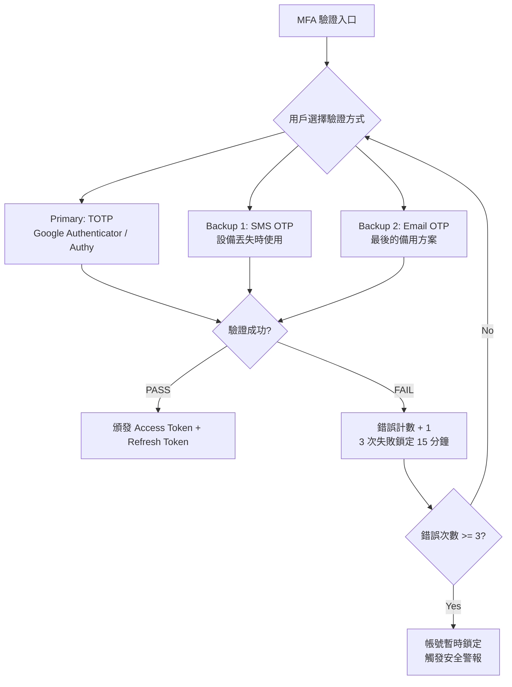
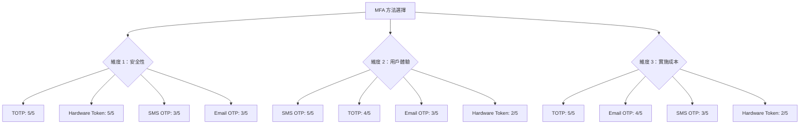
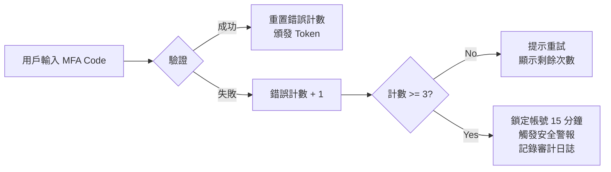

# MFA 技術架構設計（MFA Technical Architecture Design）

> **規範來源**: [06-06-01_MFA_Architecture.md](../../source-archive/06_Platform_Governance/06-06-01_MFA_Architecture.md)
> **目標讀者**: Architects, Backend Developers
> **業務需求**: [MFA_Architecture_Spec.md](../../requirements/06_Governance_Licensing/03_MFA_Architecture_Spec.md)
> **最後同步**: 2026-02-08

---

## 1. 架構概覽（Architecture Overview）

SmartAdmin iGaming 平台採用 **TOTP（主要）+ SMS OTP（備用）+ Email OTP（最後備用）+ Backup Codes（離線恢復）** 的四層 MFA 架構。

本文件聚焦於 MFA 驗證流程的系統架構設計與安全技術實現。業務需求與方法選擇依據請參閱 [MFA_Architecture_Spec.md](../../requirements/06_Governance_Licensing/03_MFA_Architecture_Spec.md)。

---

## 2. MFA 驗證流程架構（MFA Verification Flow Architecture）

### 2.1 驗證入口流程（Verification Entry Flow）



### 2.2 方法優先級設計（Method Priority Design）

| 優先級 | 方法 | 觸發條件 | 安全級別 |
|-------|------|---------|---------|
| **P0** | TOTP | 日常登入（預設方式） | 5/5 |
| **P1** | SMS OTP | 設備丟失 / TOTP 不可用 | 3/5 |
| **P2** | Email OTP | SMS 不可用（國際漫遊） | 3/5 |
| **P3** | Backup Codes | 所有方法都不可用（離線恢復） | 4/5 |

---

## 3. MFA 方法選擇決策架構（MFA Method Selection Decision Architecture）



---

## 4. 安全設計（Security Design）

### 4.1 威脅建模與 MFA 防禦對照（Threat Modeling and MFA Defense Mapping）

| 威脅類型（STRIDE） | 攻擊場景 | MFA 技術防禦機制 |
|---------|---------|-----------|
| **Spoofing** | 釣魚網站竊取密碼 | TOTP 為時間敏感碼，攻擊者無法在 30 秒內重放 |
| **Tampering** | Session Hijacking | MFA 綁定設備指紋，Session 與 MFA 驗證結果綁定 |
| **Repudiation** | 內部人員惡意操作否認 | MFA 審計日誌記錄設備、時間、驗證方式 |
| **Information Disclosure** | 密碼洩露 | TOTP Secret 使用 AES-256-GCM 獨立加密存儲 |
| **DoS** | 暴力破解登入 | 3 次失敗鎖定 15 分鐘 + Rate Limiting |
| **Elevation of Privilege** | 橫向移動攻擊 | 高權限角色強制 MFA，權限升級需重新驗證 |

### 4.2 CVSS 3.1 風險評分（CVSS 3.1 Risk Scoring）

```
無 MFA 的後台登入系統：
Base Score = 8.1 (High)
Attack Vector = Network (N)
Attack Complexity = Low (L)
Privileges Required = None (N)
User Interaction = None (N)

有 MFA 的後台登入系統：
Base Score = 4.3 (Medium)
Attack Vector = Network (N)
Attack Complexity = High (H) ← MFA 增加攻擊難度
Privileges Required = None (N)
User Interaction = Required (R) ← 需要受害者掃描 QR Code
```

MFA 可將安全風險從 High（8.1）降低至 Medium（4.3），降低約 47% 風險。

### 4.3 失敗鎖定機制設計（Failure Lockout Mechanism Design）

> **獨立狀態釐清**：MFA 設備鎖定（`t_mfa_secret.status = LOCKED`，3 次失敗 / 15 分鐘）與玩家帳號鎖定（`account_status = LOCKED`，5 次登入失敗 / 30 分鐘）為**獨立狀態**，解鎖需分別處理。MFA 設備解鎖不影響帳號狀態，反之亦然。帳號狀態機見 → [Data_Model.md Section 3.1](../00_Overview/04_Data_Model.md)



---

## 5. 合規技術映射（Compliance Technical Mapping）

| 合規標準 | 技術要求 | 架構實現 |
|---------|---------|---------|
| MGA/B2C/183/2010 | 高權限帳號強制 MFA | 角色-MFA 強制綁定策略 |
| PCI DSS 4.0 Req 8.3.1 | 所有管理員使用 MFA | MFA 啟用狀態檢查中間件 |
| GDPR Art. 32 | 適當的技術措施 | AES-256-GCM 加密 + 審計日誌 |
| NIST SP 800-63B | 不推薦 SMS OTP 作為主要方式 | TOTP 為主，SMS 僅作備用 |

**合規技術檢查清單**：

```
1. 所有 Super Admin、Finance Manager、Risk Control 必須啟用 MFA
2. MFA Secret 必須加密存儲（AES-256-GCM）
3. 審計日誌必須記錄所有 MFA 事件（註冊、驗證、失敗）
4. 備份恢復機制必須有二次驗證（不能自助恢復）
5. MFA 實施後需通過滲透測試（Penetration Test）
```

---

## 6. 實施階段（Implementation Phases）

| 階段 | 時間範圍 | 技術內容 | 驗收標準 |
|------|---------|---------|---------|
| Phase 1 | Week 1-2 | TOTP 整合（Google Authenticator） | TOTP 註冊 + 驗證流程 E2E 測試通過 |
| Phase 2 | Week 3 | SMS OTP 備用方案 | SMS 發送 + 驗證 + 頻率限制測試通過 |
| Phase 3 | Week 4 | Backup Codes（10 個一次性恢復碼） | 恢復碼生成 + 使用 + 作廢測試通過 |

---

## 7. SmartAdmin 實作（SmartAdmin Implementation）

### 7.1 Service 層（Service Layer）

```java
@Service
@RequiredArgsConstructor
public class MfaService {

    private final MfaSecretDao mfaSecretDao;
    private final MfaManager mfaManager;
    private final TotpGenerator totpGenerator;

    /**
     * Verify MFA code using TOTP algorithm.
     * Service layer handles orchestration, no @Transactional here.
     */
    public ResponseDTO<MfaVerifyResult> verifyMfaCode(Long userId, String code) {
        Option<MfaSecretEntity> secretOpt = Option.of(mfaSecretDao.selectByUserId(userId));
        if (secretOpt.isEmpty()) {
            return ResponseDTO.error(ErrorCode.MFA_NOT_ENABLED);
        }

        MfaSecretEntity secret = secretOpt.get();
        boolean valid = totpGenerator.verify(secret.getDecryptedSecret(), code);
        if (!valid) {
            return mfaManager.handleVerificationFailure(userId);
        }

        return mfaManager.handleVerificationSuccess(userId);
    }
}
```

### 7.2 Manager 層（Manager Layer）

```java
@Component
@RequiredArgsConstructor
public class MfaManager {

    private final MfaSecretDao mfaSecretDao;
    private final MfaAuditLogDao auditLogDao;
    private final AesEncryptor aesEncryptor;

    /**
     * Handle verification failure with lockout logic.
     * @Transactional only allowed in Manager layer per SmartAdmin architecture.
     */
    @Transactional(rollbackFor = Throwable.class)
    public ResponseDTO<MfaVerifyResult> handleVerificationFailure(Long userId) {
        MfaSecretEntity entity = mfaSecretDao.selectByUserId(userId);
        int newCount = entity.getFailureCount() + 1;

        if (newCount >= 3) {
            entity.setStatus(MfaStatus.LOCKED);
            entity.setLockedUntil(LocalDateTime.now().plusMinutes(15));
            logAuditEvent(userId, MfaEventType.ACCOUNT_LOCKED);
        }

        entity.setFailureCount(newCount);
        mfaSecretDao.updateById(entity);
        logAuditEvent(userId, MfaEventType.VERIFICATION_FAILED);

        return ResponseDTO.error(ErrorCode.MFA_INVALID_CODE);
    }
}
```

### 7.3 資料庫結構（Database Schema）

```sql
-- MFA secret storage with AES-256-GCM encryption
CREATE TABLE t_mfa_secret (
    id                  BIGSERIAL PRIMARY KEY,
    user_id             BIGINT NOT NULL UNIQUE,
    encrypted_secret    VARCHAR(500) NOT NULL,
    status              VARCHAR(20) NOT NULL DEFAULT 'PENDING_VERIFICATION',
    failure_count       INTEGER NOT NULL DEFAULT 0,
    locked_until        TIMESTAMP,
    last_verified_at    TIMESTAMP,
    created_at          TIMESTAMP NOT NULL DEFAULT NOW(),
    updated_at          TIMESTAMP NOT NULL DEFAULT NOW(),
    deleted             BOOLEAN NOT NULL DEFAULT FALSE
);

CREATE INDEX idx_mfa_user ON t_mfa_secret(user_id) WHERE deleted = FALSE;
CREATE INDEX idx_mfa_locked ON t_mfa_secret(status, locked_until)
    WHERE status = 'LOCKED';

-- MFA audit log for compliance
CREATE TABLE t_mfa_audit_log (
    id              BIGSERIAL PRIMARY KEY,
    user_id         BIGINT NOT NULL,
    event_type      VARCHAR(50) NOT NULL,
    ip_address      VARCHAR(45),
    device_info     JSONB,
    created_at      TIMESTAMP NOT NULL DEFAULT NOW()
);

CREATE INDEX idx_mfa_audit_user ON t_mfa_audit_log(user_id, created_at DESC);
```

---

---

## 8. MFA 方法選擇評估（Method Evaluation Summary）

> 本節摘自原始技術評估文件，包含安全性比較矩陣與合規對齊分析。
> TOTP 演算法實作細節見 [04_MFA_Implementation.md](04_MFA_Implementation.md)

## 5. 安全性比較矩陣（Security Comparison Matrix）

### 5.1 技術比較（Technical Comparison）

| 特性 | TOTP | SMS OTP | Email OTP | 硬體權杖（Hardware Token, FIDO2） |
|---------|------|---------|-----------|------------------------|
| **演算法** | HMAC-SHA1（RFC 6238） | N/A（電信） | N/A | ECDSA P-256 / RSA 2048 |
| **離線能力** | ✅ 是 | ❌ 否（需網路） | ❌ 否 | ✅ 是 |
| **抗網路釣魚** | ⚠️ 部分（驗證碼可能被釣魚） | ❌ 否 | ❌ 否 | ✅ 是（網域綁定） |
| **SIM 卡交換漏洞** | ✅ 否 | ❌ 是 | ✅ 否 | ✅ 否 |
| **SS7 攻擊漏洞** | ✅ 否 | ❌ 是 | ✅ 否 | ✅ 否 |
| **裝置依賴性** | ⚠️ 手機/應用程式 | ⚠️ 手機 | ⚠️ 電子郵件存取 | ⚠️ 硬體權杖 |
| **每位使用者成本** | $0 | $0.05-$0.10 每則簡訊 | $0 | $50-$70（一次性） |
| **設定複雜度** | 中（QR Code 掃描） | 低（自動） | 低（自動） | 高（USB/NFC 配對） |
| **NIST 建議** | ✅ 建議 | ⚠️ 已淘汰 | ⚠️ 不建議 | ✅ 建議（AAL3） |

### 5.2 攻擊面分析（Attack Surface Analysis）

**TOTP 攻擊向量**:
- ⚠️ 網路釣魚: 使用者在假登入頁面輸入驗證碼
  - 緩解: 短有效期（30秒）、使用者教育
- ⚠️ 裝置失竊: 實體存取手機
  - 緩解: 需裝置 PIN/生物辨識才能存取應用程式
- ⚠️ 備份碼失竊: 儲存不安全
  - 緩解: 加密備份碼，需 MFA 才能查看

**SMS OTP 攻擊向量**:
- ❌ **SIM 卡交換**（高風險）: 攻擊者取得電話號碼
- ❌ **SS7 劫持**（中風險）: 電信層級攔截
- ❌ **網路釣魚**（高風險）: 驗證碼可被攔截
- ❌ **惡意軟體**（中風險）: 手機上的簡訊讀取惡意軟體

**硬體權杖（FIDO2）攻擊向量**:
- ⚠️ 實體失竊: 攻擊者竊取權杖
  - 緩解: 需 PIN/生物辨識才能使用權杖
- ⚠️ 供應鏈: 受損硬體（罕見）
  - 緩解: 從可信供應商購買（Yubico、Google Titan）

### 5.3 合規性對齊（Compliance Alignment）

| 法規 | TOTP | SMS OTP | 硬體權杖（Hardware Token, FIDO2） |
|-----------|------|---------|------------------------|
| **NIST AAL2**（中度保證） | ✅ 核准 | ⚠️ 受限（有條件） | ✅ 核准 |
| **NIST AAL3**（高度保證） | ❌ 不足 | ❌ 禁止 | ✅ 必要 |
| **PSD2 SCA**（歐盟支付） | ✅ 合規 | ⚠️ 2025年前允許 | ✅ 合規 |
| **GDPR Art. 32**（資料保護） | ✅ 充足 | ⚠️ 可疑（SMS 風險） | ✅ 強 |
| **UKGC LCCP**（博彩執照） | ✅ 可接受 | ⚠️ 可接受但有警告 | ✅ 首選 |
| **MGA B2C/183/2010** | ✅ 管理員強制 | ❌ 單獨使用不足 | ✅ 建議 |

### 5.4 成本效益分析（Cost-Benefit Analysis）

**情境: 200 位管理員使用者**

| 方法 | 設定成本 | 年度成本 | 安全等級 | 建議 |
|--------|-----------|-------------|----------------|----------------|
| **僅 TOTP** | $0 | $0 | 高（5/5） | ✅ **符合成本效益的基準** |
| **TOTP + SMS 備用** | $500（整合） | $3,600（簡訊費） | 高（5/5） | ✅ 良好平衡 |
| **TOTP + 硬體權杖** | $10,000（權杖） | $0 | 極高（5/5） | ⚠️ 僅適用 AAL3 合規 |
| **僅 SMS** | $500 | $3,600 | 低（2/5） | ❌ **不建議** |

**ROI 計算**:
- **風險降低**: TOTP 將帳號入侵風險從 8.1 CVSS（高）降至 4.3（中）
- **資料外洩成本**: 平均 iGaming 平台資料外洩成本 $500K-$2M
- **預期損失降低**: TOTP（$0/年）vs. 潛在外洩（$1M）= ∞% ROI

---

## 6. 實作建議（Implementation Recommendations）

### 6.1 高風險角色強制 TOTP（Mandatory TOTP for High-Risk Roles）

```java
@Component
public class MFAEnforcementPolicy {

    /**
     * Determine if MFA is mandatory for user role
     *
     * @param role User role
     * @return true if MFA required
     */
    public boolean isMFAMandatory(Role role) {
        return role == Role.SUPER_ADMIN
            || role == Role.FINANCE_MANAGER
            || role == Role.RISK_CONTROL
            || role == Role.DEVELOPER;
    }

    /**
     * Determine allowed MFA methods for role
     *
     * @param role User role
     * @return List of allowed methods
     */
    public List<MFAMethod> getAllowedMethods(Role role) {
        if (role == Role.SUPER_ADMIN || role == Role.FINANCE_MANAGER) {
            // AAL3: Only hardware token or TOTP
            return Arrays.asList(MFAMethod.TOTP, MFAMethod.HARDWARE_TOKEN);
        }

        // AAL2: TOTP or SMS fallback
        return Arrays.asList(MFAMethod.TOTP, MFAMethod.SMS, MFAMethod.BACKUP_CODES);
    }
}
```

### 6.2 從 SMS 逐步遷移至 TOTP（Gradual Migration from SMS to TOTP）

**階段 1**（第 1-3 個月）: 鼓勵採用 TOTP
- 發送電子郵件鼓勵使用者從 SMS 切換至 TOTP
- 強調安全優勢

**階段 2**（第 4-6 個月）: 新帳號淘汰 SMS
- 新管理員帳號必須使用 TOTP
- 現有 SMS 使用者可繼續（既有權利）

**階段 3**（第 7-12 個月）: 強制遷移
- 所有使用者必須在期限前遷移至 TOTP
- 提供遷移指南和支援

**階段 4**（第 13 個月+）: 完全移除 SMS
- 平台全面停用 SMS OTP

---

## 7. 相關文件（Related Documents）

### 業務需求（Business Requirements）
- [MFA_Architecture_Spec.md](../../requirements/06_Governance_Licensing/03_MFA_Architecture_Spec.md) - MFA 方法選擇、風險分析、決策矩陣

### 技術實作（Technical Implementation）
- [MFA_Login_Recovery_Technical.md](10_MFA_Login_Recovery_Technical.md) - 兩階段登入、信任裝置權杖
- [MFA_Compliance_Technical.md](07_MFA_Compliance_Technical.md) - 稽核日誌、備份碼、合規驗證

### 安全標準（Security Standards）
- **NIST SP 800-63B**: 數位身分指南（AAL2/AAL3）
- **RFC 6238**: TOTP 規格
- **RFC 4226**: HOTP 規格
- **W3C WebAuthn Level 2**: Web Authentication API


---

## 相關文檔（Related Documents）

- **業務需求**: [MFA_Architecture_Spec.md](../../requirements/06_Governance_Licensing/03_MFA_Architecture_Spec.md)
- **MFA 實作細節**: [04_MFA_Implementation.md](04_MFA_Implementation.md) — TOTP 演算法、AES 加密、WebAuthn
- **MFA 合規技術**: [05_MFA_Compliance.md](05_MFA_Compliance.md) — 稽核日誌、合規驗證
- **MFA 恢復流程**: [06_MFA_Recovery.md](06_MFA_Recovery.md) — 備份碼、設備恢復

---

**文件版本**: 2.0.0（合併自 03_MFA_Technical_Architecture.md + 05_MFA_Technical_Evaluation.md）
**最後更新**: 2026-03-31
